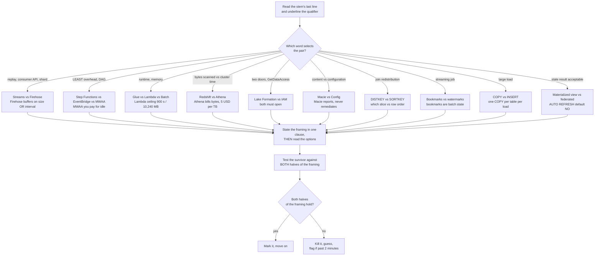
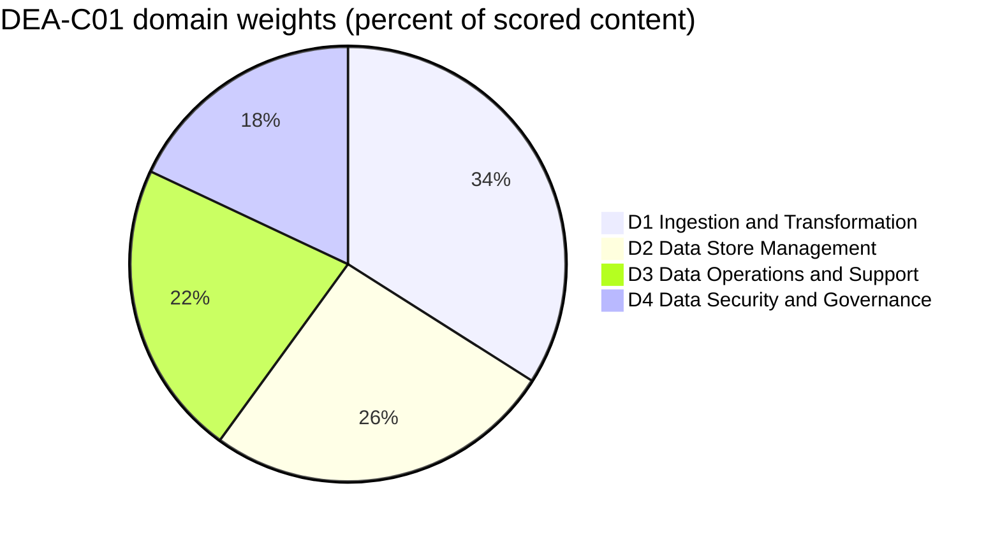
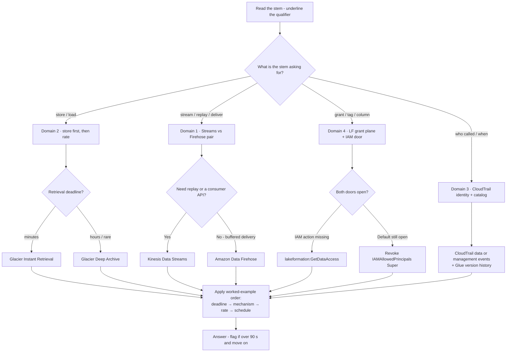
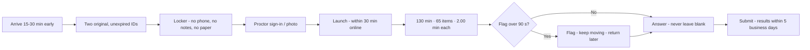
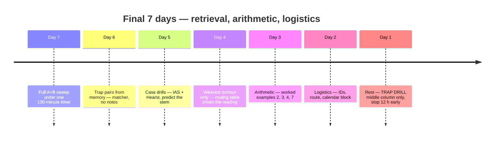

# Exam Simulation B: Second Set, Traps and Exam Day

Fifteen lessons gave you the content and Set A gave you a first sitting. A **second** sitting measures something different: not whether you know AWS Glue, but whether you can hold **Glue job bookmarks apart from streaming watermarks**, or **Redshift distribution apart from sorting**, *while the clock runs*. Almost nobody fails DEA-C01 because they have never heard of Amazon Macie — they fail because the stem asked for **who called `DeleteTable`** and they answered with a *finding*, or because the stem said `LEAST operational overhead` and they paid for a managed Airflow environment to run four Lambda steps. On a compensatory 100–1,000 scale with **720** to pass, discrimination is what separates a comfortable pass from a 705.

```text
====================================================================
 DEA-C01 / SET B AT A GLANCE              (all figures as of Oct 2026)
====================================================================
 FORMAT ....... 65 questions = 50 scored + 15 unscored (not identified)
 TYPES ........ multiple choice (1 right + 3 distractors)
                multiple response (2+ right of 5+ options)
 TIME ......... 130 minutes for 65 items = exactly 2.00 min per item
                (130 / 65 = 2.00, arithmetic - ESL +30 gives 2.46)
 SCALE ........ 100 - 1,000, pass at 720, COMPENSATORY, no section cut
 GUESSING ..... no penalty for a wrong guess; BLANK = wrong
 WEIGHTS ...... D1 Ingestion & Transformation 34%
                D2 Data Store Management      26%
                D3 Data Operations & Support  22%
                D4 Data Security & Governance 18%
 COST ......... 150 USD per attempt (taxes may apply)
 VALIDITY ..... 3 years; after a FAIL wait 14 calendar days,
                unlimited attempts, full fee every time
 RESULTS ...... posted to your AWS Certification Account
                within 5 business days (official ceiling)
--------------------------------------------------------------------
 SET B (this lesson) ...... 20 items in weight order: 7 / 5 / 4 / 4
 SET B adds ............... the twenty trap pairs, the exam-day
                            checklist and a final 7-day study plan
====================================================================
```

> [!NOTE]
> **How to use this lesson.** Read sections 1 and 2 once — that is the strategy half, and it is built entirely around *pairs*. Then sit **Set B (section 4) on a 30-minute timer with no notes, no search and no peeking at the teardowns**. Grade yourself with section 7, drill the twenty pairs in section 5, walk the exam-day checklist in section 6, and let the 7-day plan in section 8 decide what happens between now and your appointment. Anything this lesson could not verify against a first-party AWS page is listed in section 7.4 — treat those as *do not assert*, not as facts to memorise.

By the end of this lesson you will be able to:

- state the one-line correct framing for each of the **twenty trap pairs** most likely to cost you marks;
- spot a **half-true option** — the distractor that swaps exactly one attribute of a pair — and kill it in one clause;
- handle **multiple-response** stems with an all-or-nothing procedure that never assumes partial credit;
- run the arithmetic the exam actually asks for: **DPU-hour cost**, **storage-class cost**, **bytes-scanned billing** and **weights-to-items**;
- recite the official exam-day logistics — IDs, arrival, check-in, in-exam controls, score timing;
- grade Set B **by domain block** against explicit ready-versus-not-ready thresholds, and defend the **comparative verdict** on booking now versus seven more days;
- run a dip-driven **7-day study plan** that revises by domain weakness rather than by chapter order.

---

## 1. Strategy: trap pairs and how the exam weaponises them

### 1.1 What a pair is, and what a distractor really looks like

AWS describes its own distractors as *"generally plausible responses that match the content area"* (DEA-C01 exam guide). The practical consequence is that most options you face are drawn from **the same decision as the key** — which means most losses on this exam are not knowledge failures, they are **pair failures**: you knew one member of the pair but could not state the line between them under time pressure. The guide's headline skill is *"compare AWS services to understand the cost, performance, and functional differences"* — comparison **is** the exam.

A pair becomes an item through exactly three moves:

1. **Swap one attribute per option** — record-level vs buffered, exactly-once vs at-least-once, grant vs cap, discovery vs enforcement, dist vs sort.
2. **Swap the ask** — the stem wants *bytes scanned*, the option offers *cluster hours*; the stem wants *who acted*, the option offers *what the content contained*.
3. **Swap the lifecycle position** — the right service, the wrong pipeline stage: a crawler answer to an orchestration question, a catalog answer to a remediation question.

Worked example 1 — a half-true option, dissected before you read the stem. Take the **Amazon Macie vs AWS Config** pair and build all four options the way the exam does:

| Option | What the option gets right | Where it breaks | Verdict |
|---|---|---|---|
| **A** | Macie *does* produce findings with severity 1 (Low) to 3 (High), retained **90 days** | The option then tells Macie to encrypt the objects — Macie never remediates | true facts, impossible action |
| **B** | Config *does* record configuration state over time and evaluate rules against it | The option hands Config the PII-discovery job that belongs to Macie | both services crossed |
| **C** | Both *are* governance services on the in-scope list | Neither half states what the other one does; the option is a category statement, not a distinction | no discriminator |
| **D** | Macie discovers sensitive **content**; Config records **configuration** state | — | both halves correct |

Only **D** survives, and it survives because you evaluated *both halves* rather than recognising a familiar word. Options A and B each contain a phrase you have read in the documentation — that is the design. **A distractor does not have to be false; it has to be false in the place the stem is asking about.**



### 1.2 The three questions for any pair item

Slow candidates read options; fast candidates interrogate the *pair* first. Ask these three, in this order, before you look at a single option:

1. **What does each member of the pair actually do?** One clause each, from memory. If you cannot say what a materialized view does in one clause, the options will answer it for you — badly.
2. **Which stem qualifier selects between them?** `replay`, `LEAST overhead`, `bytes scanned`, `content`, `DISTKEY`, `stale`, `full-load-and-cdc`. The noun in the stem is usually the decoy; the qualifier is the key.
3. **Does the surviving option satisfy *both* halves?** For a `(Select TWO)` stem this is literal — and AWS's own DEA readiness deck states the rule as *"No Negative points or Partial credit"*, so one false clause zeroes the option.

```fillblank
{
  "question": "Complete the four pair-drill reflexes from section 1.2:",
  "template": "1) State what each member of the pair does in one {{1}} BEFORE reading the options. 2) Find the stem {{2}} that selects between them - replay, bytes scanned, content, DISTKEY. 3) Test the surviving option against BOTH halves of the {{3}}. 4) Past about two minutes, {{4}} and guess - never leave a blank.",
  "answers": {
    "1": "clause",
    "2": "qualifier",
    "3": "framing",
    "4": "flag"
  },
  "distractors": ["sentence", "service name", "option list", "skip", "rewrite", "guess twice", "domain weight"],
  "explanation": "The four reflexes are the whole defensive system in one line each: the one-clause framing stops the options from teaching you the wrong distinction, the qualifier is the word that actually decides the key, the both-halves test is what kills a half-true option (and is literal for Select TWO stems), and past about two minutes the correct move is flag, guess, move - because unanswered questions are scored incorrect and there is no penalty for a wrong guess."
}
```

- **📚 Did you know?** AWS's own **Official Practice Question Set: AWS Certified Data Engineer – Associate** contains exactly **20 questions** — the same count as Set A and Set B here — is **free**, and sits at step 1 of AWS's four-step prep plan (exam guide → practice question set → Skill Builder courses → official practice exam), all as of Oct 2026. It is the closest official yardstick for the pacing you are training in this lesson.

---

## 2. Strategy: the item shapes, the blueprint and the clock

DEA-C01 publishes exactly **two** question types — multiple choice (one correct response plus three or more distractors) and multiple response (two or more correct responses out of five or more options). There is no ordering, no matching and no case-study item on this exam as of Oct 2026, so do not budget for them. What Set B adds on top of Set A is practice in the three *shapes* that cost the most marks: **multiple response**, **calculation**, and **selection by pattern**.

### 2.1 Multiple response without partial credit

| Rule | What is published | What it means at the desk |
|---|---|---|
| **Structure** | 2+ correct responses out of **5+** options; the stem states the count ("Select TWO") | Read *every* option before you commit to anything |
| **Credit** | AWS's DEA readiness deck: *"No Negative points or Partial credit"* | **All-or-nothing, zero partial credit** — a partial set scores zero |
| **Count** | How many MR items a live form carries, and the MC:MR ratio, are **unpublished** | Expect the stem to tell you the count; if it does, underline it |
| **Set B format** | Each MR stem here pre-combines its correct statements inside one option | Trains all-or-nothing thinking while keeping the single-key JSON schema |

The procedure that survives contact with five or six options:

1. Mark every option **definitely yes / definitely no / maybe** — in one pass, without choosing.
2. Resolve every *maybe* by re-reading the **qualifier**, not the option.
3. Submit only when no *maybe* remains. Two obvious answers plus an overlooked fifth correct one is the classic zero.

### 2.2 The calculation and selection shapes

Three families appear repeatedly, and each has one mechanical procedure.

**Worked example 2 — Glue DPU-hour cost (us-east-1, as of Oct 2026).** A job runs 4 × G.2X workers = **8 DPU** for **30 minutes**, **twice a day**, in a **31-day** month, at **$0.44 per DPU-hour**:

$$
\text{per run} = 8 \times 0.5 \times 0.44 = \$1.76 \qquad \text{runs} = 2 \times 31 = 62 \qquad 62 \times 1.76 = \mathbf{\$109.12}
$$

The distractors are the *arithmetic slips*: one run a day (**$54.56**), four runs a day (**$218.24**), hourly scheduling (a four-figure answer). Convert workers → DPU → hours → rate, in that order (Set B item 4).

**Worked example 3 — storage-class cost (us-east-1, as of Oct 2026).** 100 TB = **102,400 GB** of archive data. At Standard $0.023/GB-mo the same bytes cost **$2,355.20** a month; at Standard-IA $0.0125 they cost **$1,280.00**; at Glacier Instant $0.004 they cost **$409.60**; at Glacier Deep Archive $0.00099 they cost about **$101.38**. The cheapest number is *not* the answer unless it also meets the retrieval deadline — Deep Archive retrieval is measured in **hours**, not minutes (item 8).

**Worked example 4 — Athena bills bytes scanned, not time.** A 3 TB uncompressed CSV table with three equal columns, where dashboards `SELECT` one column: every query scans 3 TB, so $3 \times \$5 = \mathbf{\$15}$. Convert to Snappy Parquet (3:1) and read one of three columns → 0.33 TB → $\mathbf{\$1.65}$. Same SQL, same result, a fraction of the bill — because the cost meter is bytes scanned ($5.00 per TB, 10 MB minimum per query), not cluster hours.

**Worked example 5 — selection by pattern.** Translate the stem's nouns into a data model *before* reading service names:

| The stem says | The model | The service it selects |
|---|---|---|
| *single-digit millisecond* key/value at any scale | NoSQL key-value | Amazon DynamoDB |
| *petabyte-scale* SQL analytics, columnar compression | OLAP warehouse | Amazon Redshift |
| *serverless interactive SQL* over an S3 lake, billed per query | Lake query engine | Amazon Athena |
| *relational*, MySQL- or PostgreSQL-compatible, managed backups | OLTP relational | Amazon Aurora or Amazon RDS |
| *fast key/value* access for a session-like workload | In-memory key/value | Amazon MemoryDB for Redis (guide skill 2.1.3) |

Two of those rows become Set B items 8 and 11. The pattern never changes: **noun → data model → service**, and only then the options.

### 2.3 The Set B blueprint, its clock and its weights

Only **domain** percentages are published; the item counts below are arithmetic on 50 scored items — a planning aid, never an AWS figure.

| Domain | Published weight | Scored items on the live exam (derived: 50 × w) | Set B items here | What this block is really testing |
|---|---|---|---|---|
| **D1** Ingestion and Transformation | **34 %** | ≈ 17 | **7** (Q1–Q7) | Glue bookmarks, transformation debugging, DPU cost, DMS task types, MERGE |
| **D2** Data Store Management | **26 %** | ≈ 13 | **5** (Q8–Q12) | Storage classes, TTL, `COPY`, catalog/schema evolution, distribution design |
| **D3** Data Operations and Support | **22 %** | ≈ 11 | **4** (Q13–Q16) | Per-stage metrics, audit evidence, EventBridge automation, Athena query access |
| **D4** Security and Governance | **18 %** | ≈ 9 | **4** (Q17–Q20) | Lake Formation defaults, KMS patterns, secrets vs parameters, key policy placement |
| **Total** | **100 %** | **≈ 50** | **20** | "Scored items" column is arithmetic, not an AWS statement |

**Worked example 6 — weights to items, twice over.** On the live exam: $50 \times 0.34 = 17$, $50 \times 0.26 = 13$, $50 \times 0.22 = 11$, $50 \times 0.18 = 9$, and $17 + 13 + 11 + 9 = 50$. On Set B: $20 \times 0.34 = 6.8$, $20 \times 0.26 = 5.2$, $20 \times 0.22 = 4.4$, $20 \times 0.18 = 3.6$, which round to **7 / 5 / 4 / 4**, and $7 + 5 + 4 + 4 = 20$. Domains 1 and 2 together are **60 %** of scored content — that is why they hold 12 of these 20 items.

**Worked example 7 — Set B's own clock.** The live exam gives exactly $130 \div 65 = \mathbf{2.00}$ **minutes per item**; with the ESL +30 accommodation that becomes $160 \div 65 = 2.46$ minutes. Set B uses a **90-second first-pass budget**: $20 \times 90 = 1{,}800\ \text{s} = \mathbf{30}$ **minutes**. Sit Set B on 30 minutes flat; if you finish with time left, spend it on flagged items, not on re-reading confident ones.



- **📚 Did you know?** AWS's own published rhythm for an **Associate** certification is **3–5 weeks** of preparation in **45–90 minute** sessions at your peak time, and AWS says explicitly that you need *"a passing score, not a perfect score"*. The 7-day plan in section 8 is therefore a **compressed** plan: it assumes lessons 01–14 and Set A are already behind you, and it spends the week on discrimination and logistics rather than on new content.

---

## 3. Real-World Case Drills

Two AWS-published customer stories, converted into the only two moves this exam ever makes with a story: **map it to a domain**, then **predict the stem**. Every figure below is a *customer result* that AWS chose to publish — never an AWS promise and never a number without its date (case-study pages carry no publish date, so the only timestamp available is the access date; all figures below accessed **Oct 2026**).

### Case drill 1 — Integral Ad Science: hundreds of permission rules became two

**The scenario.** An ad-tech company runs a self-service data lake across **producer and consumer accounts** under GDPR and CCPA, where access must follow *classification* and *job role*. AWS's published account: the team used **AWS Lake Formation** with tag-based access control on top of the **AWS Glue Data Catalog**, with **Amazon Athena** and **Amazon EMR** as engines; S3 data is reachable only through a **Lake Formation data access role**; database-level tags are **inherited by tables and columns**; and Athena workgroups per business unit double as billing tags and query limits. AWS reports the permission surface collapsed from **hundreds of permission rules to exactly 2**.

**Which domain?** **D4 Data Security and Governance (18 %)** — the story is an argument about role-, tag- and attribute-based authorization (skill 4.2.5) enforced through Lake Formation (skill 4.2.4). The hooks into **D3** (Athena workgroups, query limits) are secondary: never answer a governance stem with a cost control.

**What the exam would ask?**

| Stem shape | The qualifier that decides it | What the key points at |
|---|---|---|
| "…access should follow classification and job role, not individual grants" | *tag* versus *identity* | **Tag-based (ABAC) authorization** |
| "…an analyst still cannot read S3 through Athena despite an IAM allow" | *which door* is shut | **`lakeformation:GetDataAccess`** plus a valid LF grant |
| "…hundreds of rules became two" | *inheritance direction* | **LF-Tags cascade database → table → column** |
| "…which figure is an AWS guarantee?" | *customer result* versus *promise* | **a published outcome, not an AWS SLA** |

**Trap to pre-load:** "AWS guarantees a 99 % reduction in permission rules" is wrong twice — it converts a customer's result into a promise, and AWS never publishes such a guarantee. Rewrite every case percentage as *"AWS reports that Integral Ad Science achieved …"*.

### Case drill 2 — Hearst: 30 TB a day through a stream and a delivery pipeline

**The scenario.** A media group with 250+ sites, 300+ magazines and 31 TV stations needs clickstream at scale. AWS's published account: **Amazon Kinesis Data Streams** plus **Kinesis Data Firehose** (renamed **Amazon Data Firehose** on 2024-02-09) feeding Spark streaming, ingesting **30 TB per day**.

**Which domain?** **D1 Data Ingestion and Transformation (34 %)** — the story is a streaming-versus-delivery distinction, which is trap pair 1 in section 5.

**What the exam would ask?**

| Stem shape | The qualifier that decides it | What the key points at |
|---|---|---|
| "…two consumer apps each need every record, and one must be able to replay yesterday" | *replay* and *consumer API* | **Kinesis Data Streams** (retention 24 h–365 d) |
| "…deliver to S3 on a buffer with no consumer application to write" | *buffered delivery* | **Amazon Data Firehose** (size **or** interval, whichever first) |
| "…30 TB/day — what does that number mean?" | *customer figure* versus *limit* | **a published customer result, not an AWS quota** |
| "…the option says Amazon Kinesis Data Firehose" | *which name is official* | **both are valid** — the current in-scope list still prints the old name |

**Trap to pre-load:** never "correct" an option that says *Amazon Kinesis Data Firehose*. The product became Amazon Data Firehose on 2024-02-09, but AWS states that **no** service endpoint, API, CLI command, IAM policy or CloudWatch metric changed — IAM actions are still `firehose:*`, and the DEA-C01 in-scope list still lists "Amazon Kinesis Data Firehose".

- **📚 Did you know?** AWS's *What is a data lake?* page names Netflix, Zillow, Nasdaq, Yelp, iRobot and **FINRA** as reference customers for the exam-grade definition of a data lake: ingest as-is, securely store and catalog it, and run analytics without moving the data to a separate system. Case-study figures on this exam are almost always *decomposable or dateable* — when an option restates a customer result as an AWS guarantee, it is wrong even if every individual number looks familiar.

---

## Real-World Case Drills

Two more AWS-published customer stories, run through the same two moves as section 3 — **map it to a domain**, then **predict the stem** — but at 90-second speed, because Day 5 of the 7-day plan asks you to do exactly this from memory. Same rule as before: every figure below is a *customer result* AWS chose to publish (case-study pages carry no publish date, so the timestamp available is the access date; all figures accessed **Oct 2026**), never an AWS promise.

### Case drill 3 — Nasdaq: 70 billion records a day, and an archive that cannot be rewritten

**The scenario.** An exchange has to land orders, quotes and trades overnight — before the market opens — while keeping regulatory records unalterable for years. AWS's published account: since **2014** Nasdaq has run an **Amazon S3** data lake as the storage layer, **Amazon Redshift** (with Redshift Spectrum) as the query layer, **Amazon S3 Glacier** for archive and **S3 Object Lock** for the write-once requirement. AWS reports the lake absorbed a jump from **30 billion to 70 billion records a day** (peak **113 billion**, Feb 2020), that **90 % of the load completed five hours sooner**, that queries ran **32 % faster**, and that a **15 TB** slice is queried in place without being copied first.

**Which domain?** **D2 Data Store Management (26 %)** — the story is an argument for decoupled storage and compute (write path in S3, read path in Redshift), which is the lake-house shape the guide tests under store selection. The hooks are **D1** (the overnight window is an ingestion deadline) and **D4** (Object Lock is the immutability control that Set B item 20 already drilled).

**What the exam would ask?**

| Stem shape | The qualifier that decides it | What the key points at |
|---|---|---|
| "…the load must finish before the market opens and must not block queries" | *decoupled* storage vs compute | **S3 write path + Redshift read path (Spectrum over the lake)** |
| "…records must not be altered or deleted for seven years" | *cannot be altered* | **S3 Object Lock, compliance mode** |
| "…30 billion → 70 billion records a day — what is that number?" | *customer result* versus *quota* | **a published Nasdaq outcome, not an AWS limit** |
| "…queries ran 32 % faster — may you restate that?" | *quote* versus *guarantee* | **only as "AWS reports that Nasdaq …", never as an AWS claim** |

**Trap to pre-load:** every case percentage is workload- and baseline-specific (digest 16 F1). "Queries run 32 % faster on Redshift" is Nasdaq's measurement on Nasdaq's workload — an option that offers it as an AWS performance guarantee is wrong even though the number is printed on an AWS page.

### Case drill 4 — Oportun: Macie finds the PII, you respond

**The scenario.** A fintech lender must locate and prioritise personal data held in S3 for FTC Safeguards and privacy obligations, with a small compliance team and a low tolerance for false positives. AWS's published account: **Amazon Macie** automated sensitive-data discovery across the account's buckets using **managed and custom data identifiers**, a **bucket inventory** and an account **sensitivity score**; AWS reports **+95 % discovery accuracy** and **−80 % time to discover sensitive data** (the Macie case card and re:Invent 2022 session SEC215).

**Which domain?** **D4 Data Security and Governance (18 %)** — discovery and classification of sensitive content (skills 4.5.1 / 4.5.2). The *response* half of the same story is **D3**: findings → EventBridge → Lambda, which is precisely Set B item 15 — discovery and remediation are separate skills in this blueprint.

**What the exam would ask?**

| Stem shape | The qualifier that decides it | What the key points at |
|---|---|---|
| "…find PII in the lake without writing code" | *content* versus *configuration* | **Amazon Macie** (not AWS Config) |
| "…once it finds the PII, what does Macie do?" | *reports* versus *remediates* | **it reports — EventBridge, Lambda and Lake Formation act** |
| "…scan the Aurora PostgreSQL database for PII as well" | *service scope* | **Macie is an Amazon S3 service**; a different control covers the database |
| "…95 % — is that an AWS guarantee?" | *customer result* versus *promise* | **Oportun's published outcome, accessed Oct 2026** |

**Trap to pre-load:** the +95 % is **S3 discovery accuracy achieved by one customer**, not general data-loss-prevention coverage — digest 16 F8 explicitly warns against reading it as a cross-service DLP number, and Macie does not natively scan Amazon RDS or Amazon Redshift.

```interactive
{
  "type": "matching",
  "title": "Case-drill matcher: match the story to the domain it drills",
  "instructions": "Match each published customer outcome (A–D) to the DEA-C01 domain it primarily trains (1–4). Re-derive the stem qualifier from the framing before you commit.",
  "pairs": [
    { "left": "A · 70 billion records a day, S3 write path, Redshift read path, Object Lock archive", "right": "1 · D2 Data Store Management" },
    { "left": "B · 30 TB of clickstream a day through a stream plus a buffered delivery", "right": "2 · D1 Data Ingestion and Transformation" },
    { "left": "C · Macie discovers PII in S3; EventBridge and Lambda do the responding", "right": "3 · D4 Data Security and Governance" },
    { "left": "D · RA3 right-sizing that cut Redshift operating cost by 55 % a year", "right": "4 · D3 Data Operations and Support" }
  ],
  "answer": "A→1, B→2, C→3, D→4"
}
```

- **📚 Did you know?** AWS reports that PayU consolidated roughly **40 production databases** into S3 plus Redshift, cut query latency from **10–15 minutes to under a minute**, saved **$20,000 a month**, and dropped query volume from **150,000 to 35,000 per month (−77 %)** — and those are **two different levers**: the platform consolidation bought the money, the query rationalisation bought the volume. On this exam a stem that asks for *cost* and a stem that asks for *demand* are never answered with the same number, even when both come from the same customer story.

---

## 4. Practice Questions — Set B: 20 items in published weight order

Set B mirrors the live exam's **dominant** format — one correct response, three distractors — while drilling six **multiple-response-style** stems. Items run in domain-weight order: **D1 seven, D2 five, D3 four, D4 four**, which is the published 34 / 26 / 22 / 18 split rounded onto twenty items. All twenty are adapted from question-bank items **Q21–Q40**.

### 4.0 How to sit Set B

| Setting | The rule | Why it matters |
|---|---|---|
| **Timer** | **30 minutes flat** (90 s per item — the first-pass budget) | Trains the rhythm you will use for 65 items at 2.00 minutes each |
| **Materials** | No notes, no search, no teardown visible | Open-book scoring measures your notes, not you |
| **Pacing** | Answer every item; flag anything over 90 seconds and keep moving | A blank is a guaranteed zero — the rule never changes with set size |
| **Pair rule** | Before reading options, write the pair's framing in one clause | This is the whole point of Set B |
| **Multiple response** | Read **all** options; the correct statements are pre-combined into one option so each item keeps a single key | Trains all-or-nothing thinking without breaking the schema |
| **Grading** | By **domain block** first, total second (section 7) | Compensatory scoring punishes the dip, not the average |
| **Re-sit** | 72 hours later, from memory | Shorter gaps measure recognition, not retention |

### 4.1 Domain 1 — Data Ingestion and Transformation (34 %) · items 1–7

```question
{
  "id": "dea-16-q1",
  "type": "multiple-choice",
  "question": "An AWS Glue ETL job intermittently fails at commit with a bookmark version mismatch error. Logs show a second copy of the same job running concurrently during a backfill. Which change resolves the root cause?",
  "options": [
    "Increase NumberOfWorkers so the job finishes before the second run starts",
    "Set MaxConcurrentRuns to 1 and serialize the backfill behind the scheduled run",
    "Reset the job bookmark before every scheduled run",
    "Switch the job to the FLEX execution class"
  ],
  "correct": 1,
  "explanation": "AWS Glue job bookmarks do not support concurrent job runs and commits will fail, so forcing serialization is the documented fix; a reset only masks the symptom and throws away incremental state."
}
```

**Teardown — Q1 · concurrency is the cause, not the workers.** **Why it is right:** AWS documents that Glue bookmarks do not support concurrent job runs and that commits fail — so the only change that removes the cause is one run at a time. **Why the traps lose:** **A** raises throughput, which does nothing for a state guarantee and makes overlap *more* likely; **C** masks the symptom and resets incremental state, so the next run reprocesses everything — the opposite of the desired behaviour; **D** (FLEX) is a cost optimisation for non-urgent jobs and has no effect on bookmark state. **Trap:** the error says *bookmark*, so candidates reach for a bookmark command; the stem says *concurrently*, so the answer is a concurrency setting. **Source:** bank Q25 · Glue `glue-troubleshooting-errors.html` (digest 15 C9) · skill 1.2.7.

```question
{
  "id": "dea-16-q2",
  "type": "multiple-choice",
  "question": "(Select TWO.) A nightly Glue job is expected to process about 50 million new rows but completes successfully in seconds and writes nothing. An engineer suspects the job bookmark skipped the new files. On this set's single-key format the two metrics are pre-combined inside one option - choose the option in which BOTH metrics confirm the diagnosis.",
  "options": [
    "glue.driver.aggregate.recordsRead collapses toward zero AND glue.driver.aggregate.bytesRead collapses toward zero",
    "glue.ALL.jvm.heap.usage exceeds its 0.9 alarm threshold AND glue.error.ALL increments",
    "glue.driver.aggregate.recordsRead collapses toward zero AND glue.driver.ExecutorAllocationManager.numberMaxNeededExecutors rises",
    "glue.ALL.jvm.heap.usage rises AND glue.driver.ExecutorAllocationManager.numberAllExecutors rises"
  ],
  "correct": 0,
  "explanation": "Both aggregate read metrics collapse toward zero when the source is skipped, which is the documented signal for job bookmark issues; a bookmark skip is not an error, so the job still succeeds."
}
```

**Teardown — Q2 · two metrics, both about the source.** **Why it is right:** if the bookmark gates the source, nothing is read — so `recordsRead` and `bytesRead` both fall to zero, and those are the two Glue aggregate metrics that would show it. **Why the traps lose:** **B** describes an out-of-memory alarm (`glue.ALL.jvm.heap.usage` above 0.9) plus task errors — but a skip raises no error, which is exactly why the job "succeeds"; **C** pairs a true metric with an **executor-allocation** metric, which measures DPU backlog (work waiting), not source skipping; **D** is memory plus executor demand, both unrelated to a skipped source. **Trap:** in an MR stem **every** statement is a separate question — one false clause zeroes the option, and there is no partial credit to collect. **Live-exam form:** two checkboxes, all-or-nothing. **Source:** bank Q26 · Glue `job-monitoring.html` and `monitor-continuations.html` · skill 1.2.7.

```question
{
  "id": "dea-16-q3",
  "type": "multiple-choice",
  "question": "Hourly CSV files land in a raw bucket. A data steward wants column-level data quality rules with no code, row-level outcomes identifying which records failed, and an alert within five minutes of a violation. Which solution meets the requirement BEST?",
  "options": [
    "An AWS Glue DataBrew ruleset evaluated by a ruleset job, with an EventBridge rule routing DataBrew Ruleset Validation Result events to Amazon SNS",
    "An AWS Glue crawler with schema-change detection enabled",
    "Amazon Athena DDL constraints defined on the raw table",
    "An Amazon Redshift ANALYZE run on a related table"
  ],
  "correct": 0,
  "explanation": "DataBrew rulesets evaluate column- and row-level rules without code and emit rule results, which EventBridge can route to SNS within minutes - a no-code transform plus an event trigger plus a notification, all on the in-scope list."
}
```

**Teardown — Q3 · three requirements, three services, one pipeline.** **Why it is right:** the stem demands *no code*, *row-level outcomes* and a *five-minute alert* — DataBrew rulesets supply the first two, and EventBridge → SNS supplies the third, which maps to skills 1.1.6 (event triggers), 1.2.5 (transformation service by requirement) and 1.3.4 (notification services); the rule definitions themselves are skill 3.4.2. **Why the traps lose:** **B** discovers *schema* drift, it does not evaluate data-quality rules — right service family, wrong job; **C** is DDL on a table that a raw CSV prefix does not even have; **D** refreshes optimizer statistics and validates nothing. **Trap:** *crawler* answers catalog and discovery questions, never data-quality ones — this is the classic wrong-lifecycle-position distractor. **Source:** bank Q27 · DataBrew rule-based profiling docs · exam-guide skills 1.1.6 / 1.2.5 / 1.3.4 / 3.4.2.

```question
{
  "id": "dea-16-q4",
  "type": "multiple-choice",
  "question": "An AWS Glue ETL job is configured with 4 x G.2X workers (8 DPU) and runs for 30 minutes, twice per day, every day of a 31-day month. Using the Glue rate of $0.44 per DPU-hour (us-east-1, as of Oct 2026), approximately what is the job's compute cost for the month?",
  "options": [
    "$109.12",
    "$54.56",
    "$218.24",
    "$1,637.76"
  ],
  "correct": 0,
  "explanation": "Per run: 8 DPU x 0.5 h x $0.44 = $1.76. Runs: 2 x 31 = 62. 62 x $1.76 = $109.12 for the month."
}
```

**Teardown — Q4 · workers → DPU → hours → rate.** **Why it is right:** $8 \times 0.5\ \text{h} \times \$0.44 = \$1.76$ per run, $2 \times 31 = 62$ runs, $62 \times 1.76 = \mathbf{\$109.12}$ (worked example 2). **Why the traps lose:** **B** halves the schedule to one run a day ($31 \times 1.76 = 54.56$); **C** doubles it to four runs a day; **D** models the job running every hour of the month. **Trap:** the item is 90 % arithmetic and 10 % service knowledge — convert **workers → DPU → hours → rate** in that fixed order, and only then multiply by the schedule. Remember the DPU definition: **1 DPU = 4 vCPU + 16 GB**, and a G.2X worker is 4 DPU. **Source:** bank Q28 · `aws.amazon.com/glue/pricing/` ($0.44/DPU-hour, us-east-1, as of Oct 2026; digest 15 C8) · skill 1.2.4.

```question
{
  "id": "dea-16-q5",
  "type": "multiple-choice",
  "question": "An engineer runs: aws glue reset-job-bookmark --job-name nightly_orders_etl. What does this command do?",
  "options": [
    "Rewinds the bookmark to a specific user-supplied previous state so only a chosen window is reprocessed",
    "Clears the bookmark state so the next job run processes the source from the beginning",
    "Deletes the job and all of its bookmark history",
    "Puts the bookmark into bookmark-PAUSE mode so it stops advancing"
  ],
  "correct": 1,
  "explanation": "ResetJobBookmark clears the bookmark for the job; the next run starts from the beginning of the source. Selective rewind is a different console/API operation, and pause is a job parameter."
}
```

**Teardown — Q5 · reset is not rewind.** **Why it is right:** the CLI reference defines `reset-job-bookmark` as clearing bookmark state, so the next run re-reads the source from the start. **Why the traps lose:** **A** describes the console's *rewind* feature, a separate operation that takes a point in time; **C** would be `delete-job`; **D** describes the `bookmark-PAUSE` job parameter, a mode rather than this API call. **Trap:** all four options are verbs you have seen in the Glue console — the discriminator is *what state exists afterwards*: cleared (everything reprocessed), rewound to a chosen window, or paused. **Source:** bank Q29 · CLI `glue reset-job-bookmark.html`, Glue `monitor-continuations.html` · skill 1.2.7.

```question
{
  "id": "dea-16-q6",
  "type": "multiple-choice",
  "question": "An on-premises Oracle database must be migrated to Amazon Aurora PostgreSQL. The target must be populated with existing rows and then kept continuously in sync while applications continue to write to the source, until a 6-hour cutover window completes. Which AWS DMS task configuration meets the requirement?",
  "options": [
    "Migration type full-load",
    "Migration type full-load-and-cdc",
    "Migration type cdc",
    "AWS DataSync scheduled hourly"
  ],
  "correct": 1,
  "explanation": "DMS defines exactly three task types; full-load-and-cdc migrates existing data and then keeps applying source changes to the target, which is the continuous-sync-during-migration pattern."
}
```

**Teardown — Q6 · two requirements, one type.** **Why it is right:** *populated with existing rows* plus *kept continuously in sync* needs both phases, and `full-load-and-cdc` is the only DMS type that does both in one task. **Why the traps lose:** **A** loads a point-in-time snapshot and stops — the target diverges immediately while the source keeps accepting writes; **C** assumes the target is already backfilled (cdc-only is correct only when the tables have been loaded); **D** moves files over a network protocol, not database changes, and Aurora is not a file target. **Trap:** the six-hour cutover window is a *deadline*, not a task type — do not let a duration pick your option. Two more rules travel with this item: **DMS CDC does not provide real-time replication**, and only **one task in a bidirectional pair** may be `full-load-and-cdc`. **Source:** bank Q32 · DMS `CHAP_Task.CDC.html`, `CHAP_Tasks.html` (digest 15 C18) · skill 1.1.1.

```question
{
  "id": "dea-16-q7",
  "type": "multiple-choice",
  "question": "MERGE INTO sales_fact t USING sales_staging s ON t.order_id = s.order_id WHEN MATCHED THEN UPDATE SET t.amount = s.amount WHEN NOT MATCHED THEN INSERT (order_id, amount) VALUES (s.order_id, s.amount); The MERGE intermittently fails with a duplicate-matching error. Which statement correctly explains the failure and the fix?",
  "options": [
    "Redshift MERGE requires an explicit BEGIN/END block; without it, duplicates slip through",
    "Multiple rows in sales_staging match the same t.order_id; deduplicate the staging table (or use MERGE ... REMOVE DUPLICATES) before or inside the merge",
    "MERGE is not supported in Redshift and the statement must be replaced with separate UPDATE/INSERT statements",
    "sales_staging must carry the same DISTKEY as sales_fact or the merge fails"
  ],
  "correct": 1,
  "explanation": "Redshift MERGE allows at most one matching row per target row; several matches raise an error, so deduplicating the source - or using the documented REMOVE DUPLICATES form - resolves it."
}
```

**Teardown — Q7 · read the snippet for the invariant, not the keyword.** **Why it is right:** the `ON` clause is `order_id` and the failure is *duplicate-matching* — meaning the source side of the join is not unique, so the fix must make it unique. **Why the traps lose:** **A** invents a transaction requirement (a single `MERGE` is already atomic); **C** is false — `MERGE` is a supported Redshift command; **D** is a *performance* recommendation for large merges, not a correctness precondition, and would not stop two identical staging rows. **Trap:** two familiar words pull candidates away from the actual defect — `DISTKEY` (performance) and `BEGIN` (transactions) — while the error message already names the problem. **Source:** bank Q33 · Redshift `r_MERGE.html`, `merge-specify-a-column-list.html` · skills 1.2.5 / 2.4.1.

### 4.2 Domain 2 — Data Store Management (26 %) · items 8–12

```question
{
  "id": "dea-16-q8",
  "type": "multiple-choice",
  "question": "A compliance archive holds 100 TB (102,400 GB) of scanned medical imaging metadata that is almost never read, but when a regulator requests it, retrieval must complete within minutes. Using us-east-1 rates as of Oct 2026 (Standard $0.023/GB-mo, Standard-IA $0.0125, Glacier Instant $0.004, Glacier Deep Archive $0.00099), which storage class meets the requirement, and approximately what does the data cost per month in that class?",
  "options": [
    "S3 Glacier Instant Retrieval - about $410 per month",
    "S3 Glacier Deep Archive - about $101 per month",
    "S3 Standard-Infrequent Access - about $1,280 per month",
    "S3 Glacier Instant Retrieval - about $2,355 per month"
  ],
  "correct": 0,
  "explanation": "Glacier Instant Retrieval is the cheapest archive class with millisecond retrieval, so 102,400 GB x $0.004 = $409.60 per month; Deep Archive is cheaper but its retrieval is measured in hours."
}
```

**Teardown — Q8 · two qualifiers, then the arithmetic.** **Why it is right:** the stem stacks *archive-shaped data* with *retrieval within minutes* — Glacier Instant Retrieval is built for long-lived archive data with millisecond retrieval — and the cost check confirms it: $102{,}400 \times 0.004 = \mathbf{\$409.60}$. **Why the traps lose:** **B** has the lowest number ($102{,}400 \times 0.00099 \approx \$101$) but Deep Archive retrieval is measured in **hours**, missing the deadline outright — the classic "biggest saving loses" move; **C** meets the retrieval time but costs about **3×** more ($102{,}400 \times 0.0125 = \$1{,}280$), so it fails *minimises storage cost*; **D** pairs the right class with the **Standard** rate ($102{,}400 \times 0.023 = \$2{,}355.20$). **Trap:** read the deadline **before** the price list, and never accept a per-GB rate without checking which column of the pricing table it came from (worked example 3). **Source:** bank Q21 · `aws.amazon.com/s3/storage-classes/`, `glacier-storage-classes.html` (digest 15 C13, as of Oct 2026) · skill 2.3.2.

```question
{
  "id": "dea-16-q9",
  "type": "multiple-choice",
  "question": "A session store in Amazon DynamoDB holds hundreds of millions of session rows that must be deleted automatically 24 hours after their last update to control storage cost. Which mechanism is designed for exactly this?",
  "options": [
    "A time-to-live attribute holding an epoch timestamp in seconds",
    "An S3 Lifecycle expiration rule pointed at the table's export",
    "An AWS DMS task with a cdc migration type targeting a scratch table",
    "A nightly AWS Glue job issuing DeleteItem calls"
  ],
  "correct": 0,
  "explanation": "DynamoDB time-to-live deletes expired items automatically - typically within two days - at no charge, using an attribute you name that holds a Unix epoch in seconds."
}
```

**Teardown — Q9 · native, free, epoch seconds.** **Why it is right:** TTL is the mechanism the guide pairs with S3 versioning (skill 2.3.4), it is free, and the attribute is a **Number holding epoch seconds** — not milliseconds. **Why the traps lose:** **B** applies to S3 objects, not table items, and an export is a copy that would then need its own lifecycle; **C** is a migration/replication mechanism, not a retention mechanism; **D** works but burns read/write capacity for something the table does natively. **Trap:** *delete automatically after 24 hours* tempts any job-shaped answer; ask "does the store have a native clock?" before you accept a worker. Two TTL facts travel with it: deletion is **best-effort, typically within two days**, and an expired-but-not-yet-deleted item **still reads and bills** — so filter on `ttl > now` when correctness depends on it. **Source:** bank Q22 · DynamoDB `TTL.html`, `APIReference/API_UpdateTimeToLive.html` (digest 15 C28) · skill 2.3.4.

```question
{
  "id": "dea-16-q10",
  "type": "multiple-choice",
  "question": "A data engineer loads an Amazon S3 prefix into Redshift: COPY public.events FROM 's3://data-lake/events/dt=2026-10-01/' IAM_ROLE 'arn:aws:iam::111122223333:role/RedshiftCopyRole' FORMAT AS PARQUET; Which statement about this load is TRUE?",
  "options": [
    "COPY is prohibitively slow for large loads and should be replaced by row-level INSERT statements",
    "Issuing one COPY per table per load is preferred over many small COPYs or row-by-row inserts",
    "FORMAT AS PARQUET is invalid because Redshift can only load CSV",
    "The IAM role needs only s3:GetObject on the prefix"
  ],
  "correct": 1,
  "explanation": "AWS strongly recommends the COPY command for large loads and warns that individual INSERT statements might be prohibitively slow; one bulk COPY per table per load is the documented best practice."
}
```

**Teardown — Q10 · the quote decides it.** **Why it is right:** AWS's loading guidance says *"We strongly recommend using the COPY command to load large amounts of data"* and that individual `INSERT` statements *"might be prohibitively slow"* — so one `COPY` per table per load wins. **Why the traps lose:** **A** is the guidance printed backwards, the single most reliable wrong-answer detector in this area; **C** is false — Parquet is a supported `COPY` source format and columnar loading is the *recommended* shape; **D** omits **`s3:ListBucket`** (needed to enumerate the prefix) and, for SSE-KMS objects, **`kms:Decrypt`**. **Trap:** a partial IAM list looks complete because one action is obviously right — authorization options are graded on the *whole* permission set, not on the most memorable action. **Source:** bank Q23 · Redshift `r_COPY.html`, `t_Loading_data.html` (digest 15 C27), `copy-parameters-authorization.html` · skill 2.3.1.

```question
{
  "id": "dea-16-q11",
  "type": "multiple-choice",
  "question": "A Glue ETL job writes new Parquet files under a partitioned S3 prefix already registered as a Glue Data Catalog table. A new nullable column loyalty_tier appears in the source data, but Athena still returns the old column list and errors on queries that reference the new column. Which action makes Athena see the new schema?",
  "options": [
    "Run the Glue crawler over the new data (or ALTER TABLE ... ADD COLUMN loyalty_tier string) so the Data Catalog metadata is updated",
    "Drop and recreate the S3 bucket with a new name",
    "Convert the output back to CSV so Athena infers the schema at query time",
    "Do nothing - Athena re-reads the schema from Parquet footers on every query"
  ],
  "correct": 0,
  "explanation": "Athena resolves a cataloged table's schema from the Glue Data Catalog, not from file footers, so schema evolution on a registered table requires a catalog update - a crawler run or an explicit ALTER TABLE ADD COLUMN."
}
```

**Teardown — Q11 · schema-on-write in the catalog, not schema-on-read.** **Why it is right:** the table is *already registered*, and Athena reads registered schemas from the **Glue Data Catalog** — so only a crawler run or `ALTER TABLE ADD COLUMN` changes what Athena returns. **Why the traps lose:** **B** is destructive and irrelevant to metadata; **C** regresses the cost model (loses columnar pruning) and still does not update a *registered* table; **D** is the core misconception the item tests — footers are what *engines without a catalog* use, not a cataloged Athena table. **Trap:** *the files already contain the column* feels like enough; the qualifier is **registered table**, which moves authority from the data to the catalog (skills 2.2.3 crawlers populate catalogs, 2.4.2 changes to the characteristics of data). **Source:** bank Q24 · Glue `aws-glue-crawler.html`, Athena `tables.html` · skills 2.2.3 / 2.4.2.

```question
{
  "id": "dea-16-q12",
  "type": "multiple-choice",
  "question": "A Redshift star schema has fact_sales (2 billion rows) joining dim_customer (50 million rows) on customer_id for the majority of dashboard queries. dim_product has 100 rows. Which physical design best collocates the dominant join with the least storage overhead?",
  "options": [
    "DISTSTYLE EVEN on fact_sales, with no distribution on dim_customer",
    "DISTSTYLE KEY DISTKEY (customer_id) on both fact_sales and dim_customer",
    "DISTSTYLE ALL on fact_sales",
    "SORTKEY (order_date) on fact_sales only, with default AUTO distribution"
  ],
  "correct": 1,
  "explanation": "Distributing both sides of the join on the joining key lets the leader node collocate rows by join value, removing redistribution; ALL on the 50-million-row fact would multiply storage by node count."
}
```

**Teardown — Q12 · distribution fixes joins, sorting fixes scans.** **Why it is right:** AWS's own guidance is that distributing a pair of tables on their joining keys makes the leader node **collocate** rows on the slices by join value, and matching keys on both sides avoids redistribution entirely. **Why the traps lose:** **A** leaves `dim_customer` to be broadcast or redistributed on every join; **C** puts a 50-million-row table on **every** node — storage multiplies by node count, and `DISTSTYLE ALL` is only sensible for genuinely small dimensions (the 100-row `dim_product` is the ALL candidate here); **D** addresses scan and filter order, not join collocation. **Trap:** *the query is slow* pulls candidates to `VACUUM`, `ANALYZE` or `SORTKEY` — but the stem asks about the **join**, and the join is a **distribution** problem (trap pair 11). **Source:** bank Q31 · Redshift `c_choosing_dist_sort.html`, `t_designating_distribution_styles.html` (digest 15 C15) · skill 2.4.5.

### 4.3 Domain 3 — Data Operations and Support (22 %) · items 13–16

```question
{
  "id": "dea-16-q13",
  "type": "multiple-choice",
  "question": "(Select THREE.) A data engineering team is building CloudWatch alarms for a streaming pipeline. On this set's single-key format the three metric/namespace pairings are pre-combined inside one option - choose the option in which ALL THREE are the correct per-stage health signals.",
  "options": [
    "Amazon Kinesis Data Streams: GetRecords.IteratorAgeMilliseconds; AWS DMS: CDCLatencyTarget; AWS Lambda: Throttles",
    "Amazon S3: BucketSizeBytes; AWS Glue: NumberOfMessagesReceived; Amazon Redshift: CPUUtilization alone",
    "Amazon Kinesis Data Streams: GetRecords.Latency; AWS Glue: numFailedTasks; Amazon S3: BucketSizeBytes",
    "Amazon S3: BucketSizeBytes; AWS Glue: error.ALL; Amazon Redshift: CPUUtilization alone"
  ],
  "correct": 0,
  "explanation": "Iterator age measures consumer lag on the stream, CDCLatencyTarget measures DMS replication lag against the target, and Lambda Throttles catches concurrency-limit starvation - one canonical signal per pipeline stage."
}
```

**Teardown — Q13 · one signal per stage, and it must measure that stage.** **Why it is right:** stream lag (`GetRecords.IteratorAgeMilliseconds`, where **zero means caught up**), replication lag (`CDCLatencyTarget`) and concurrency starvation (`Throttles`) are the published health signals for their stages. **Why the traps lose:** **B** mixes a once-a-day storage metric with a metric name that **does not exist** for Glue and a CPU reading that says nothing about queueing; **C** substitutes `GetRecords.Latency`, which measures **API call duration**, not read-position lag — the most common metric mix-up in this domain; **D** repeats the storage/CPU pair and adds a Glue error counter, which counts task failures rather than pipeline health. **Trap:** *monitoring* in the stem pulls candidates to any metric they remember — the qualifier is **stage**: stream, replication, function. Redshift alarms need queue signals (for example `WLMQueueLength`), not CPU alone. **Source:** bank Q30 · CloudWatch metrics pages for Kinesis Data Streams, DMS, Lambda, S3, Glue, Redshift · skills 3.3.3 / 3.3.7.

```question
{
  "id": "dea-16-q14",
  "type": "multiple-choice",
  "question": "(Select TWO.) An auditor asks: which principal called DeleteTable on the Glue Data Catalog table sales.curated_orders, and when? On this set's single-key format the two sources are pre-combined inside one option - choose the option in which BOTH sources answer the question.",
  "options": [
    "AWS CloudTrail management events for the glue service (queried with Athena or CloudTrail Lake) AND Glue table-version history via GetTableVersions with Glue Table State Change events",
    "Amazon S3 request metrics on the underlying data prefix AND Amazon Macie findings for the account",
    "AWS CloudTrail management events for the glue service AND VPC Flow Logs analysed in CloudWatch Logs Insights",
    "Glue Data Catalog table-version history via GetTableVersions alone AND Amazon CloudWatch Logs Insights on application logs"
  ],
  "correct": 0,
  "explanation": "CloudTrail records the API call with userIdentity, sourceIPAddress and timestamp (who and when), while Glue catalog versioning and Table State Change events record what changed in the catalog."
}
```

**Teardown — Q14 · who called, plus what the catalog now says.** **Why it is right:** the auditor asks two questions — *which principal* and *when* — and CloudTrail's management events carry `userIdentity` and time, while Glue's own version history and Table State Change events carry the catalog-side "what changed" (skills 3.3.5 and 3.3.1). **Why the traps lose:** **B** offers S3 request metrics, which are operational telemetry about object requests rather than API identities, plus Macie, which discovers sensitive **content**; **C** pairs a true source with VPC Flow Logs, which record network flows, not API identities; **D** is half-right then claims version history alone answers *which principal* — it does not carry the caller's identity, and generic application logs are not catalog audit. **Trap:** the catalog half of the answer is the part candidates forget, because *audit* pulls everyone to CloudTrail; a two-part question needs two sources. **Live-exam form:** two checkboxes, all-or-nothing. **Source:** bank Q40 · Glue `cloudwatch-cloudtrail-integration.html`, CloudTrail User Guide · skills 3.3.1 / 3.3.5.

```question
{
  "id": "dea-16-q15",
  "type": "multiple-choice",
  "question": "(Select THREE.) A scheduled Amazon Macie job returns a severity-3 finding: an unencrypted, crawler-created Glue table contains an ssn column with live values. On this set's single-key format the three actions are pre-combined inside one option - choose the option in which ALL THREE are legitimate parts of the response.",
  "options": [
    "Create an EventBridge rule matching source aws.macie and detail-type Macie Finding that invokes a Lambda remediation function; apply an LF-Tag such as classification=restricted with a Lake Formation column data filter excluding ssn; suppress and then archive the finding once validated",
    "Ask Macie to encrypt the affected S3 objects with a customer managed key; apply an LF-Tag; delete the exposed S3 objects with Macie",
    "Configure Macie as an administrator of the KMS key; enable Macie automatic remediation; suppress the finding immediately without validating it",
    "Add s3:ListAllMyBuckets to every analyst; create an S3 gateway VPC endpoint; attach AdministratorAccess to the analyst role"
  ],
  "correct": 0,
  "explanation": "Macie's role is discovery and reporting: EventBridge can route findings to automation, Lake Formation enforces tag and column/row filters, and Macie supports suppression and archival of validated findings (retained 90 days)."
}
```

**Teardown — Q15 · Macie reports, you respond.** **Why it is right:** all three actions respect the division of labour — **EventBridge routes** the finding (skill 3.3.9), **Lambda automates** the response (skill 3.1.8), **Lake Formation enforces** the classification (skills 4.2.4 / 4.5.2), and suppression plus archival is a documented Macie finding-lifecycle step. **Why the traps lose:** **B** assigns *encryption* and *deletion* to Macie — a discovery service changes nothing by itself; **C** assigns **key administration** to Macie and suppresses without validating, which destroys the audit trail; **D** is three authorization and networking non-sequiturs that widen access while the exposure is unresolved. **Trap:** *severity-3* is a distractor lure — Macie severities run **1 = Low, 2 = Medium, 3 = High** with no Critical level, and findings are retained **90 days**; the number tells you priority, not who may act. **Source:** bank Q36 · Macie `findings-suppress.html`, `how-it-works.html` · Lake Formation data-filtering docs (digest 15 C21, C23) · skills 3.1.8 / 3.3.9 / 4.5.2.

```question
{
  "id": "dea-16-q16",
  "type": "multiple-choice",
  "question": "(Select TWO.) An analyst's IAM role has an inline policy allowing athena:*, glue:* and s3:GetObject on the lake prefix, and a Lake Formation data lake administrator has granted the role SELECT on the target table. The analyst still receives AccessDenied when running a query in Amazon Athena. On this set's single-key format the two required changes are pre-combined inside one option - choose the option in which BOTH changes are required.",
  "options": [
    "Add lakeformation:GetDataAccess to the analyst's IAM policy AND confirm the Lake Formation SELECT grant is on the table (or parent database/tag) the query actually reads, made by a data lake administrator",
    "Add s3:ListAllMyBuckets to the analyst's IAM policy AND create an S3 gateway VPC endpoint in the analyst's VPC",
    "Attach AdministratorAccess to the analyst role AND enable Lake Formation hybrid access mode",
    "Add lakeformation:GetDataAccess to the analyst's IAM policy AND attach AdministratorAccess to the analyst role"
  ],
  "correct": 0,
  "explanation": "A request must pass both doors - IAM and Lake Formation - so Athena needs lakeformation:GetDataAccess in the caller's IAM policy, and the LF grant must exist on the resource actually queried."
}
```

**Teardown — Q16 · two doors, both must open.** **Why it is right:** AWS documents that *"a requestor's request must pass through two doors"* — IAM permissions and Lake Formation permissions — and Athena specifically requires **`lakeformation:GetDataAccess`** in the caller's IAM policy, while the grant must sit on the resource the query reads (and be issued by a data lake administrator). **Why the traps lose:** **B** is an account-level S3 listing permission plus a networking control — neither is an authorization door; **C** destroys least privilege (an IAM admin is **not** automatically a data lake administrator) while hybrid access mode is a legacy-migration aid, not a missing grant; **D** pairs the one true IAM action with `AdministratorAccess`, which would let the analyst grant themselves access — the opposite of the intended control. **Trap:** the stem *lists* IAM permissions that look generous (`athena:*`, `glue:*`), which tempts you to conclude IAM is fine; the missing action is a **Lake Formation** action living **inside** the IAM policy. Domain note: this item sits in Domain 3 as *operate Athena queries against a governed lake* (skill 3.1.7), while its mechanics are task 4.2.4. **Source:** bank Q34 · `athena/latest/ug/lf-athena-user-permissions.html` (digest 15 C22), Lake Formation `lf-permissions-overview.html` (C19) · skills 3.1.7 / 4.2.4.

### 4.4 Domain 4 — Data Security and Governance (18 %) · items 17–20

```question
{
  "id": "dea-16-q17",
  "type": "multiple-choice",
  "question": "A company registers its data-lake S3 location in Lake Formation and begins granting fine-grained Lake Formation permissions. However, every IAM principal in the account can still read every cataloged table via Athena, with no Lake Formation grants. Which single change makes Lake Formation the effective gatekeeper?",
  "options": [
    "Revoke the default IAMAllowedPrincipals Super permission (and disable Use only IAM access control) so the recommended fine-grained model applies",
    "Add more data lake administrators",
    "Enable Lake Formation hybrid access mode",
    "Attach the AWSLakeFormationDataAdmin managed policy to every analyst"
  ],
  "correct": 0,
  "explanation": "Lake Formation ships in a backward-compatible default where the IAMAllowedPrincipals group holds Super on databases, which leaves access controlled solely by IAM policies until that setting is disabled."
}
```

**Teardown — Q17 · the door is propped open by a default.** **Why it is right:** with `IAMAllowedPrincipals` holding **Super**, Lake Formation explicitly defers to IAM alone — so no grant you make can restrict anything until that default group is revoked (or the "Use only IAM access control" setting is disabled), which is AWS's recommended transition to the fine-grained model. **Why the traps lose:** **B** changes who may *grant*, not who may *read*; **C** is the incremental **migration** state, not the end state, and does not close the catalog; **D** hands out administration — notably, that policy does not even let the holder add further admins — and closes nothing. **Trap:** *I granted permissions and nothing changed* is the most-reported Lake Formation symptom; the cause is a **default**, not a missing grant. An IAM `AdministratorAccess` user is **not** automatically a data lake administrator either. **Source:** bank Q35 · Lake Formation `access-control-fine-grained.html`, `lf-permissions-reference.html` (digest 15 C20) · skill 4.2.4.

```question
{
  "id": "dea-16-q18",
  "type": "multiple-choice",
  "question": "An event-driven architecture uses AWS Lambda to transform records inside an Amazon Kinesis Data Streams consumer. The stream is configured for 1 million shards (1 MiB/s each), but the Lambda function's aggregate throughput is capped near 10 MB/s per function invocation regardless of shard count. What is the cause, and the fix?",
  "options": [
    "Lambda scales at most to 1,000 concurrent executions per region; move the heavy transformation to Amazon MSK (Kafka) instead",
    "Lambda scales at most to 1,000 concurrent executions per region; split the transformation across more Kinesis data streams or raise the per-stream throughput",
    "Each shard delivers at most 1 MiB/s; add more shards until 10 MB/s is reached",
    "Kinesis Data Streams caps total throughput at 10 MB/s; switch the source to Amazon SQS Standard"
  ],
  "correct": 1,
  "explanation": "Lambda scales to 1,000 concurrent executions per region and its Kinesis event source mapping uses at most one concurrent execution per shard - so more shards mean nothing until the 1,000-execution ceiling is removed by design."
}
```

**Teardown — Q18 · the ceiling is the function, not the stream.** **Why it is right:** AWS states Lambda scales to **1,000 concurrent executions per region**, and the event source mapping runs **at most one concurrent execution per shard** — so the 10 MB/s cap is a function ceiling, and the fix is either more streams (more independent mappings) or a design change. **Why the traps lose:** **A** names the correct ceiling but jumps to an unrelated service, ignoring a fix that stays on the in-scope path; **C** mistakes a per-shard rate for the binding constraint and, worse, a 1M-shard stream would already far exceed 10 MB/s; **D** invents a total-throughput cap that does not exist (sustained >1000 MB/s per KDS stream requires ODA) and swaps in a queue with different semantics. **Trap:** every option quotes a real-sounding number — the discriminator is *which number AWS attaches to which resource*. Provisioned concurrency raises the ceiling for a specific alias but does not uncap account-level scaling. **Source:** bank Q37 · Lambda `with-kinesis.html`, `account-limits.html`, Kinesis `provisioned-throughput.md` (digest 15 C10) · skills 1.1.6 / 4.3.1.

```question
{
  "id": "dea-16-q19",
  "type": "multiple-choice",
  "question": "A finance team wants monthly S3 storage cost reports by business unit, broken out by account, service and tags, without installing agents. Which approach BEST meets the requirement?",
  "options": [
    "AWS Cost Explorer with cost allocation tags enabled on the billing console, filtered per business unit",
    "Amazon CloudWatch metrics on every bucket size",
    "AWS Budgets alerts on the monthly invoice",
    "Cost and Usage Report (CUR) delivered to S3, then queried with Amazon Athena, with cost allocation tags applied"
  ],
  "correct": 3,
  "explanation": "CUR is the granular, per-line-item billing dataset - down to resource and tag - delivered to S3 for SQL analysis with Athena, which is exactly what a by-business-unit breakdown needs; Cost Explorer is the lighter summary view."
}
```

**Teardown — Q19 · granular report beats summary view.** **Why it is right:** CUR is *"the most comprehensive source of AWS cost and usage data"* — itemised per resource, per account, per service, per tag, with discounts — delivered to S3 where Athena can slice it by business unit (skills 1.1.4 ingestion of billing data, 1.2.5 transform for analytics, 3.3.7 reporting, 4.2.1 tags for governance). **Why the traps lose:** **A** gives a *summary* view — Cost Explorer's granularity is aggregated, not per line item, so it cannot reproduce the breakdown; **B** measures bytes, not dollars, and CloudWatch has no cost dimensions; **C** tells you *whether* you overshot a budget, not *who* overshot it. **Trap:** *without installing agents* steers candidates away from the only agent-free granular option — CUR is delivered, not collected. **Source:** bank Q38 · Cost and Usage Report User Guide, Billing docs · skills 1.1.4 / 1.2.5 / 3.3.7 / 4.2.1.

```question
{
  "id": "dea-16-q20",
  "type": "multiple-choice",
  "question": "A company must prove to regulators that objects in its analytics bucket cannot be deleted for seven years, and that every deletion attempt is recorded. Which configuration meets BOTH requirements?",
  "options": [
    "An S3 Object Lock compliance-mode retention on the bucket, plus CloudTrail data events on s3:DeleteObject written to a separate log bucket",
    "An S3 lifecycle expiration rule set to seven years, plus S3 versioning on the bucket",
    "S3 replication to a second bucket with a longer lifecycle rule",
    "An IAM policy denying s3:DeleteObject, plus CloudWatch Logs on the bucket"
  ],
  "correct": 0,
  "explanation": "Object Lock in compliance mode enforces WORM retention that even the root user cannot override, and CloudTrail data events capture who attempted what, to which object, when."
}
```

**Teardown — Q20 · enforce, then record.** **Why it is right:** compliance-mode Object Lock is the **only** mode whose retention cannot be shortened by anyone, including the account root — the regulatory-grade answer — and CloudTrail **data events** (not management events) are what record `s3:DeleteObject` attempts with identity and time. **Why the traps lose:** **A**'s lifecycle rule *expires* the objects rather than protecting them; versioning plus replication duplicates data but a privileged principal can still delete both versions without a retention lock; **C** replicates, which is durability, not immutability — the replica inherits deletability unless it too is locked; **D** is a policy *wish* that the same principal's admin can edit away, and CloudWatch Logs does not capture S3 API attempts by default. **Trap:** *cannot be deleted* is the stem's only real verb — everything else is window dressing. Object Lock requires a **versioning-enabled** bucket, and retention applied *before* 2023-01-05 kept its transition-age gate; since that date S3 removed the minimum-age restriction on transitions (minimum **storage duration** per class still applies). **Source:** bank Q39 · S3 `object-lock.html`, `object-lock-best-practices.html`, CloudTrail data-event docs · skills 4.2.1 / 4.2.3 / 4.5.1.

### 4.5 Two extra discrimination items · not counted in the /20 grade

These two are **stretch items** built from the 2025–2026 changes in the 2026 Updates box. They are *not* part of the 7 / 5 / 4 / 4 blueprint above, so they do not change your score, your thresholds or your routing table — grade them separately, and if either is wrong, re-read the corresponding update row before you sit.

```question
{
  "id": "dea-16-q21",
  "type": "multiple-choice",
  "question": "A platform team runs 40 Amazon Kinesis Data Streams streams in on-demand Standard mode, aggregating about 12 MB/s, and is evaluating On-demand Advantage (announced 2025-11-04). Which statement is TRUE as of Oct 2026?",
  "options": [
    "On-demand Advantage removes the per-stream hourly charge, but bills a 25 MB/s ingest and 25 MB/s retrieval floor account-wide, so at low volume it can cost more than the mode it replaced",
    "Amazon Kinesis Data Streams has exactly two capacity modes, and On-demand Advantage is the second one under a newer name",
    "The 25 MB/s floor applies per stream, so each of the 40 streams is billed its own minimum independently",
    "Enabling On-demand Advantage reduces extended retention to 24 hours, so replay history is capped at one day"
  ],
  "correct": 0,
  "explanation": "On-demand Advantage is account-level: it removes the per-stream hourly fee but bills a minimum of 25 MB/s ingest plus 25 MB/s retrieval across the account, so a 12 MB/s workload still pays the floor; extended retention is priced per GB-month and is not capped by the mode."
}
```

**Teardown — Q21 · the floor is the discriminator.** **Why it is right:** AWS states On-demand Advantage is an **account-level** mode that removes the per-stream hourly charge and bills a **25 MB/s ingest + 25 MB/s retrieval** minimum once enabled — which is why it wins above roughly 10 MB/s aggregate or hundreds of streams, and why it can lose below that (digest 17 B.12 / C, S20). **Why the traps lose:** **B** is the pre-2025 fact — the mode list is now **three** (Provisioned, On-demand Standard, On-demand Advantage), the single most reliable "stale bank" tell in this area; **C** inverts the scope: the floor is **account-wide**, so 40 streams share one floor, not 40 of them; **D** invents a retention change — extended retention is a separate per-GB-month charge ($0.023/GB-month as of Oct 2026, previously $0.10) and is untouched by the mode. **Trap:** every option quotes a real number from the Kinesis pricing page; the discriminator is *which resource AWS attaches the number to* — account or stream. **Source:** digest 17 S20 / S21 (2025-11-04), Kinesis Data Streams pricing and sizing docs · skills 1.1.6 / 1.2.4.

```question
{
  "id": "dea-16-q22",
  "type": "multiple-choice",
  "question": "A central governance account must share thousands of cataloged tables with 40 consumer accounts. A team lead says Lake Formation changed cross-account sharing in February 2026. Which statement is TRUE as of Oct 2026?",
  "options": [
    "Cross-account sharing v5 lets one AWS RAM share carry unlimited tables using wildcard grant patterns; the upgrade is opt-in and existing shares and APIs keep working",
    "Cross-account sharing now requires one AWS RAM share per table, and every existing share was migrated automatically in place",
    "Lake Formation governed tables were deprecated and replaced by cross-account resource links",
    "Cross-account sharing is capped at 100 tables per share per Region in every AWS Region"
  ],
  "correct": 0,
  "explanation": "The 2026-02-11 v5 release lets a single AWS RAM share carry unlimited tables via wildcard grant patterns instead of per-resource associations; it is an opt-in upgrade and existing shares and APIs continue to work unchanged."
}
```

**Teardown — Q22 · easier sharing, same two doors.** **Why it is right:** AWS's 2026-02-11 announcement describes **cross-account sharing v5**: one AWS RAM share can now carry unlimited tables (AWS's wording: hundreds of thousands), new grants use **wildcard patterns** rather than per-resource associations, the upgrade is **opt-in**, and existing shares and APIs keep working (digest 17 B.17 / S39). **Why the traps lose:** **B** is exactly backwards — per-table resource associations were the *old* constraint, and nothing was migrated forcibly; **C** asserts a deprecation AWS has never published — governed tables remain documented as the older primitive, and claiming otherwise is a digest (G) item; **D** invents a quota and a uniform Regional rule, when the published change was the removal of per-type limits rather than a new numeric cap. **Trap:** *February 2026* is a real date on a real announcement, so candidates accept whichever story they half-remember; the discriminator is **direction of change** — sharing got easier, permissions got tighter (Iceberg `DELETE` on LF-governed tables now needs `DELETE` permission, and Iceberg DML also needs `ALTER`). **Source:** digest 17 S39 (2026-02-11), Lake Formation cross-account sharing docs, Redshift behaviour changes (Patch 202) · skills 4.2.4 / 4.5.7.

- **📚 Did you know?** The 2025-12-12 guide refresh (v1.1) *added* eight skills — roughly 6 % of the map — and removed three, so a bank written against v1.0 can be slightly stale about what is in scope; the in-scope list still prints "Amazon Kinesis Data Firehose" even though AWS renamed the product to Amazon Data Firehose on 2024-02-09, because the rename changed **no** endpoint, API, CLI command, IAM action or CloudWatch metric. When an option's product name looks outdated, it is usually still valid on this exam.

---

## 5. TRAP DRILL — the top twenty pair lines

Twenty pair lines, one clause each. Print the middle column, cover the last two, and re-derive the stem word from the framing. Every trap below fired on the Set A or Set B items you just sat — this table is the whole exam's decision logic in twenty rows.

| # | Pair | The correct framing (one clause) | The trap move | The stem word that decides it |
|---|---|---|---|---|
| 1 | Kinesis Data Streams vs Amazon Data Firehose | Streams stores and replays for consumers; Firehose buffers and delivers for you, no consumer app | Choose Firehose because "streaming" | *replay*, *consumer API*, *no consumer to write* |
| 2 | Step Functions vs EventBridge vs MWAA | Step Functions orchestrates steps of one process; EventBridge reacts to events across services; MWAA schedules long-running DAGs | Pick Step Functions for any "workflow" | *step*, *fan-out*, *cron DAG* |
| 3 | AWS Glue vs AWS Lambda | Glue runs Spark/ETL with catalog metadata; Lambda runs event code with no catalog | Use Lambda for a cataloged ETL job | *catalog*, *DPU*, *bookmark* |
| 4 | Amazon Redshift vs Amazon Athena | Redshift loads and stores a warehouse; Athena queries in place, no load | Load into Athena | *no load*, *serverless SQL on S3* |
| 5 | Lake Formation vs IAM | LF is the fine-grained grant plane on top of IAM's account plane | Assume IAM alone can do LF's job | *tag*, *column-level*, *data lake administrator* |
| 6 | Amazon Macie vs AWS Config | Macie finds sensitive *content*; Config records *resource configuration* compliance | Use Config for PII discovery | *sensitive*, *PII*, *finding* |
| 7 | Distkey vs Sortkey | Distribution collocates join partners across slices; sorting clusters scan ranges | Sortkey for a join problem | *join*, *redistribution*, *scan* |
| 8 | Glue bookmarks vs Kinesis watermarks | Bookmarks track incremental *files/tables* in batch ETL; watermarks track event-time progress in streams | Call a stream lag a bookmark | *event time*, *late data*, *iterator age* |
| 9 | Redshift COPY vs INSERT | COPY is bulk and strongly recommended; INSERT is row-at-a-time and prohibitively slow at scale | INSERT a few thousand rows "for control" | *bulk*, *large load*, *many rows* |
| 10 | Materialized views vs federated queries | MVs pre-compute and refresh inside Redshift; federation queries remote engines live | Federate when the answer repeats hourly | *cached result*, *live query to remote* |
| 11 | Redshift distribution vs sorting | Distribution fixes joins; sorting fixes scans | VACUMUM for a slow join | *join slow* vs *scan slow* |
| 12 | S3 Standard vs IA vs Glacier Instant vs Deep Archive | Retrieval deadline picks the class first, then price | Deep Archive because it is cheapest | *minutes* vs *hours* |
| 13 | DynamoDB TTL vs S3 lifecycle | TTL deletes table items on an epoch-seconds attribute; lifecycle acts on objects | Lifecycle rule on a table | *item*, *row*, *epoch* |
| 14 | Glue crawler vs ALTER TABLE | Crawler discovers and writes catalog metadata; ALTER edits catalog metadata directly | Crawler on an already-registered table change | *new files* vs *registered table* |
| 15 | CloudTrail vs CloudWatch Logs vs S3 request metrics | CloudTrail = API identity; CW Logs = app/runtime; S3 request metrics = operational telemetry | S3 metrics answer "who called" | *which principal* |
| 16 | DMS full-load vs full-load-and-cdc vs cdc | Load-only snapshots; load+cdc syncs during and after; cdc assumes backfilled target | cdc alone on an empty target | *kept in sync* vs *already loaded* |
| 17 | IAM `AdministratorAccess` vs data lake administrator | An IAM admin is not automatically a Lake Formation data lake administrator | Grant the managed policy and call it done | *LF admin* |
| 18 | Lambda 1,000-concurrency ceiling vs KDS shard rate | The function scales to 1,000 per region; each shard gets at most one concurrent execution | Add shards past the ceiling | *caps near 10 MB/s* |
| 19 | CUR vs Cost Explorer vs Budgets | CUR = granular per-line-item; Cost Explorer = summary; Budgets = threshold alert | Cost Explorer for per-business-unit detail | *broken out by* |
| 20 | Object Lock compliance vs governance vs lifecycle | Compliance locks cannot be shortened by anyone; governance can; lifecycle *expires* | Governance mode for a regulator | *cannot be deleted*, *root cannot* |



```interactive
{
  "type": "matching",
  "title": "Trap-pair matcher: match the framing to the pair",
  "instructions": "Match each left-hand framing (A–E) to the correct pair name on the right (1–5). Cover the TRAP DRILL table first and answer from memory.",
  "pairs": [
    { "left": "A · Buffers to S3/Redshift/OpenSearch with no consumer app to write", "right": "1 · Amazon Data Firehose" },
    { "left": "B · Tracks incremental files and tables in a batch ETL job", "right": "2 · Glue job bookmarks" },
    { "left": "C · Cannot be shortened, even by the account root", "right": "3 · S3 Object Lock, compliance mode" },
    { "left": "D · Measures API call duration, not consumer lag", "right": "4 · GetRecords.Latency" },
    { "left": "E · Granular per-line-item billing dataset delivered to S3", "right": "5 · Cost and Usage Report (CUR)" }
  ],
  "answer": "A→1, B→2, C→3, D→4, E→5"
}
```

- **📚 Did you know?** Every pair line above is a *qualifier* pair, not a *service list*. The exam almost never asks "what does Firehose do" — it asks "which statement decides between Streams and Firehose", and the deciding words are the ones in the last column. Cover the last column, read the framing, and say the stem word aloud; if you can produce the word from the framing, you can produce the answer from the stem.

---

## 6. EXAM DAY — logistics, check-in and the clock

Everything in this section is either printed in the AWS exam guide or stated by AWS Training and Certification as of **Oct 2026**. Nothing here is a guess about your specific test centre.

### 6.1 Before the day

| Item | The rule |
|---|---|
| **Fee** | **$150 USD**, non-refundable once scheduled (tax added where applicable) |
| **Retake wait** | **14 days** after a fail; **12 months** if you pass, before re-taking the *same* exam |
| **Lockout** | **2 years** from the last attempt at the same exam |
| **ESL support** | **+30 minutes** (exam duration becomes 160 minutes), available **once** on your first attempt |
| **Validity** | A pass is valid for **3 years** |
| **Next-exam discount** | Passes include **50 % off** the next AWS exam, typically redeemed through Credly |
| **What to bring** | **Two forms of ID**, at least one government-issued photo ID, both **original**, both **unexpired**, matching the name on the exam appointment |
| **Online launch window** | Launch the online-proctored exam within **30 minutes** of the appointment start; more than **15 minutes** late and the fee is forfeited |

### 6.2 At the test centre

1. Arrive **15–30 minutes early**. Late arrivals may be turned away.
2. Store bags, phones, watches, notes and **any paper** in a locker. Scratch paper is **not** permitted.
3. Sign in with your two IDs. The proctor photographs you (test centre) or screens you (online).
4. You are assigned a seat or a proctored session; the exam software loads your form.
5. **No break once started.** The 130-minute clock runs continuously.

### 6.3 During the exam

| Element | The rule |
|---|---|
| **Duration** | **130 minutes** |
| **Items** | **65 total**: **50 scored** + **15 unscored**, indistinguishable from scored items |
| **Pacing** | **2.00 minutes per item** on average — budget the first pass, flag and return |
| **Guessing** | **No penalty** — a blank is a zero; never leave an item empty |
| **Scoring** | Compensatory, scaled **200–1000**, **pass at 720** — your total is all that matters |
| **Result** | Not shown on screen; AWS emails results within **5 business days** |
| **Scratch** | None permitted, online or on-site |



```interactive
{
  "type": "fillblank",
  "title": "Exam-day numbers, from memory",
  "instructions": "Fill each blank with the number AWS publishes. Answers are exact.",
  "items": [
    { "prompt": "Exam duration: ______ minutes", "answer": "130" },
    { "prompt": "Total items: ______ (______ scored + ______ unscored)", "answer": "65 (50 scored + 15 unscored)" },
    { "prompt": "Passing scaled score: ______ / 1000", "answer": "720" },
    { "prompt": "Average pacing budget: ______ minutes per item", "answer": "2.00" },
    { "prompt": "Fail wait before re-taking: ______ days", "answer": "14" },
    { "prompt": "ESL extra time: ______ minutes, available on the ______ attempt", "answer": "30 minutes, first attempt" },
    { "prompt": "Online launch window: within ______ minutes; more than ______ late forfeits the fee", "answer": "30 minutes; 15 minutes late" },
    { "prompt": "Results delivered within ______ business days", "answer": "5" }
  ]
}
```

- **📚 Did you know?** The **15 unscored items** exist so AWS can pre-test questions for future forms — they are not labelled, they are not easier, and they count toward the same 130 minutes, so your pacing budget must assume all 65 are scored. The scaled 200–1000 scale means the raw-to-scaled conversion is **never published**; two people who miss the same five items can finish with different scaled scores. Do not reverse-engineer a pass mark — the only rule you can act on is 720.

---

## 7. Grading Set B and routing to your weak areas

### 7.1 Score by domain, not by total

| Domain | Items in this set | Score it as /7 · /5 · /4 · /4 |
|---|---|---|
| **D1** Data Ingestion and Transformation (34 %) | Q1–Q7 | /7 |
| **D2** Data Store Management (26 %) | Q8–Q12 | /5 |
| **D3** Data Operations and Support (22 %) | Q13–Q16 | /4 |
| **D4** Data Security and Governance (18 %) | Q17–Q20 | /4 |

### 7.2 The thresholds

| Your result | What it means | Where to go |
|---|---|---|
| **18–20 correct** | At or above the 720 bar — form the habit, do not coast | Sit a mixed A+B sweep under one 130-minute timer |
| **16–17 correct** | Borderline — one domain is dragging the average | Find the dip, fix that domain, re-sit B in 72 hours |
| **13–15 correct** | Below bar, but routing works | Fix the **lowest** domain first; do not re-sit yet |
| **0–12 correct** | The map is the problem, not the answers | Re-read the domain that produced the errors, then re-sit |

### 7.3 The routing table — every wrong item points to a lesson

| If you missed… | The skill you missed | Go back to |
|---|---|---|
| Q1, Q2 | 1.2.7 ETL job health & job bookmarks | `07-data-pipelines-glue-step-functions.md` |
| Q3 | 1.1.6 / 1.2.5 data quality + event triggers | `08-data-quality.md` |
| Q4 | 1.2.4 DPU hours & pricing model | `07-data-pipelines-glue-step-functions.md` |
| Q5 | 1.2.7 job bookmark operations | `07-data-pipelines-glue-step-functions.md` |
| Q6 | 1.1.1 DMS task types | `05-elasticity-elasticache-redshift.md` |
| Q7 | 1.2.5 / 2.4.1 Redshift SQL & merge semantics | `05-elasticity-elasticache-redshift.md` |
| Q8 | 2.3.2 S3 storage classes & rates | `04-s3-storage-classes.md` |
| Q9 | 2.3.4 DynamoDB TTL & retention | `06-nosql-dynamodb.md` |
| Q10 | 2.3.1 Redshift COPY & IAM | `05-elasticity-elasticache-redshift.md` |
| Q11 | 2.2.3 / 2.4.2 crawlers & schema evolution | `03-glue-data-catalog.md` |
| Q12 | 2.4.5 distribution & sort styles | `05-elasticity-elasticache-redshift.md` |
| Q13 | 3.3.3 / 3.3.7 streaming & DQ alarms | `10-observability-cloudwatch.md` |
| Q14 | 3.3.5 CloudTrail / 3.3.1 catalog events | `10-observability-cloudwatch.md` |
| Q15 | 3.1.8 / 3.3.9 / 4.5.2 Macie finding lifecycle | `11-macie-data-classification.md` |
| Q16 | 3.1.7 / 4.2.4 LF + IAM two-door model | `14-governance-lakeformation-pii.md` |
| Q17 | 4.2.4 LF default access model | `14-governance-lakeformation-pii.md` |
| Q18 | 1.1.6 / 4.3.1 Lambda concurrency & throttling | `09-event-driven-streaming-lambda.md` |
| Q19 | 1.1.4 / 1.2.5 / 3.3.7 / 4.2.1 CUR & cost tags | `13-cost-optimization.md` |
| Q20 | 4.2.1 / 4.2.3 / 4.5.1 Object Lock & CloudTrail data events | `14-governance-lakeformation-pii.md` |
| Q21 · extra | 1.1.6 / 1.2.4 Kinesis capacity modes & pricing (2026 update row) | `02-data-ingestion-patterns.md` |
| Q22 · extra | 4.2.4 / 4.5.7 Lake Formation cross-account sharing v5 (2026 update row) | `14-governance-lakeformation-pii.md` |

### 7.4 What Set B does **not** tell you

- It never tells you your **scaled** score. Twenty items are a **signal**, not a 720 forecast — the live exam converts a 50-item raw count onto a 200–1000 scale with a **never-published** conversion.
- It never tells you **which** items were unscored. On the live form, 15 of 65 are unscored and you cannot identify them.
- It never tells you your **pacing** unless you timed yourself. 2.00 minutes per item is the average; a hard item may take 4 and an easy one 30 seconds.
- It never tells you about **form difficulty**. AWS recalibrates forms continuously; a hard form and an easy form both convert to 720 at different raw counts.

---

## 8. The final 7-day plan

The last week is **retention and logistics**, not new content. Nothing below adds a service; everything below is retrieval practice and scheduling hygiene.

| Day | Focus | The one action that counts | Time |
|---|---|---|---|
| **Day 7** | Full A+B sweep | Sit Set A (7/5/4/4) and Set B (7/5/4/4) under **one** 130-minute timer, 65 items, no notes | 130 min |
| **Day 6** | Trap pairs | Cover the TRAP DRILL last column; re-derive all 20 stem words from the framing; re-do the matcher from memory | 45 min |
| **Day 5** | Case drills | Re-read the IAS and Hearst cases; for each, name the domain, predict one stem, and write the qualifier that decides it | 30 min |
| **Day 4** | Your weakest domain | Re-read only the lessons your routing table (7.3) pointed at; do not re-read anything you scored full marks on | 45 min |
| **Day 3** | Arithmetic | Re-do worked examples 2, 3, 4 and 7 without the solution visible; verify units before every multiplication | 40 min |
| **Day 2** | Logistics | Confirm appointment, ID (two originals, unexpired), test-centre route or online launch plan; book the calendar block | 30 min |
| **Day 1** | Rest and one light pass | Skim the TRAP DRILL middle column only; stop 12 hours before the exam; sleep | 20 min |



```interactive
{
  "type": "dragdrop",
  "title": "Drag each day to its one action",
  "instructions": "Place each day label (Day 7 … Day 1) onto the correct action bucket. Answer from memory before checking.",
  "buckets": [
    { "label": "Full A+B sweep under one timer", "items": ["Day 7"] },
    { "label": "Trap pairs re-derived from framing", "items": ["Day 6"] },
    { "label": "IAS + Hearst case drills, predict the stem", "items": ["Day 5"] },
    { "label": "Weakest domain only via routing table", "items": ["Day 4"] },
    { "label": "Arithmetic: worked examples 2, 3, 4, 7", "items": ["Day 3"] },
    { "label": "IDs, route, calendar block", "items": ["Day 2"] },
    { "label": "Rest — TRAP DRILL middle column only", "items": ["Day 1"] }
  ]
}
```

- **📚 Did you know?** The AWS *Data Analytics Specialty (DEA-C01) Official Practice Question Set* (practice.exams.aws.qa) is **20 questions with an answer key**, not a timed simulator — and it is the only free official question set AWS publishes for this exam. Do it in the last week, treat every wrong answer as a routing-table entry, and never treat its difficulty as a proxy for the live form: the live form is calibrated continuously, the practice set is a fixed snapshot.

---

### 2026 Updates (as of October 2026)

> [!IMPORTANT]
> The items below are the **dated changes since the 2024-05-22 v1.0 exam guide** that affect what this exam tests. Every number carries its source and access date; nothing here is a prediction.

| Change | Date | What it means for this exam |
|---|---|---|
| **Exam guide v1.1** | **2025-12-12** | **+8 new skills, +6 in-scope tasks, −3 removed** (~6 % of the map); the in-scope service list grew — read the v1.1 PDF before relying on an older bank |
| **Amazon Data Firehose rename** | **2024-02-09** | Product renamed from *Amazon Kinesis Data Firehose*; **no** endpoint, API, CLI, IAM action (`firehose:*`) or CloudWatch metric changed; the DEA-C01 in-scope list still prints the old name — both are valid on the exam |
| **S3 SSE-S3 default** | **2023-01-05** | All new objects are encrypted at rest by default with SSE-S3; questions about "how do I enable encryption?" on new buckets usually answer "it already is — choose the *class* of key" |
| **S3 transition-age gate removed** | **2026-07-16** | S3 removed the minimum-age restriction on lifecycle transitions; **minimum storage duration per class still applies** (e.g. Glacier IR 90 days, Deep Archive 180 days) |
| **Glue versions** | **2026-04-01 / 2026-08-21** | Glue **0.9 / 1.0 / 2.0** reached end of support **2026-04-01**; Glue **6.0** became generally available **2026-08-21**; **5.1** is the current default runtime |
| **Kinesis Data Streams capacity** | current | **Three** capacity modes (on-demand, provisioned, ODA); on-demand baseline is **4 MB/s + 1,000 RRU** and scales to a floor of **25 MB/s + 5,000 RRU** — never assert "KDS is capped at 10 MB/s" |
| **Guide still lists Kinesis Data Firehose** | as of Oct 2026 | The in-scope list has **not** been renamed to match the 2024 product rename |
| **Kinesis On-demand Advantage** | **2025-11-04** | A **third** capacity mode (account-level): it removes the per-stream hourly charge but bills a **25 MB/s ingest + 25 MB/s retrieval floor** account-wide — never assert "Kinesis has two capacity modes", and never call on-demand "free at low volume" |
| **Redshift × Iceberg, read *and* write** | **2025-11-17 → 2026-04-23** | Redshift now creates, `INSERT`s, `UPDATE`s, `DELETE`s and `MERGE`s Iceberg tables (including S3 Tables) under Lake Formation permissions; Iceberg materialized views followed **2026-10-05** — any option saying Redshift can only *read* the lake is stale |
| **Lake Formation cross-account sharing v5** | **2026-02-11** | One AWS RAM share can carry unlimited tables using wildcard grant patterns instead of per-resource associations; the upgrade is **opt-in** and existing shares and APIs keep working |

**Never assert on this exam** (digest 18 §G — these are the things AWS has never published, and inventing them is the fastest way to lose a point):

1. **Any pass rate.** AWS publishes no pass percentage for DEA-C01 or any certification.
2. **The raw-to-scaled conversion.** The 200–1000 scale is scaled; the conversion is never published.
3. **How many MR items are on a form.** The exam guide describes the *shape* of MR, not the count.
4. **Whether an item is unscored.** The 15 unscored items are indistinguishable from scored items on screen.
5. **Credly badge timing.** "Within X days" is not an AWS guarantee; typical is days, not hours.
6. **A pacing rule.** 2.00 minutes per item is an *average of published numbers* (130 min ÷ 65 items), not an AWS instruction.
7. **Scratch paper.** No paper, online or on site; do not let a forum post convince you otherwise.

- **📚 Did you know?** **AWS Glue 6.0** became generally available on **2026-08-21** with Spark **4.1.1**, Python **3.13**, a **30 % price reduction** and full Apache **Iceberg v3** support — and it *breaks* jobs: **EMRFS is removed** (S3A is the only S3 filesystem) and the **AWS SDK for Java v1 is gone** (boto3 is unaffected). A distractor that mentions `fs.s3.consistent.*` or a `com.amazonaws.*` import is not testing style, it is testing whether you know the runtime moved; **Glue 5.1** remains the default for new jobs, and **0.9 / 1.0 / 2.0** reached end of support on **2026-04-01** (digest 17 S12–S17, accessed Oct 2026).

---

> [!WARNING]
> ⚠️ **The two things that fail people who know the material.** First, **leaving items blank** — guessing has no penalty, so a blank is a guaranteed zero and a blank costs more than a wrong guess. Second, **answering the pair you remember instead of the pair the stem asks for** — every trap in section 5 is a real service doing a real job, just not the job this stem describes. Before you select, say the qualifier aloud: *replay*, *column-level*, *millisecond*, *compliance mode*, *retrieval within minutes*. If the qualifier in the stem does not match the qualifier in the option, the option is wrong even if the service is right.

---

> [!IMPORTANT]
> **Comparative Verdict: is this form ready for the live exam?**
>
> - **Ready if** you scored **18 or 19 of 20** on this set, **at or above 80 % in every domain block** (not just the total), and you can re-derive **all 20 trap-pair stem words** from the framing column alone. At 20/20 you are at or above the 720 bar on a form built to published weight — the remaining risk is form difficulty, not knowledge.
> - **Not ready if** you scored **16 or 17** — one domain is pulling the average below compensatory safety, and the routing table in 7.3 tells you exactly which lessons to re-read before re-sitting in **72 hours**.
> - **Do not interpret** a 13–15 as "close". A raw 15 of 20 maps onto different scaled scores on different forms; AWS never publishes the conversion, so **treat the domain blocks as the only reliable signal** and re-sit once the weakest block is at or above 80 %.

---

> [!SUCCESS]
> **You have now sat two full sets in published weight order, drilled the twenty trap lines that decide most items, and memorised the exam-day numbers AWS actually publishes.**
>
> **Key Takeaways:**
>
> 1. **130 minutes, 65 items, 50 scored + 15 unscored, 2.00 minutes per item, pass at 720/1000 compensatory** — and a blank is always a zero, so never leave an item empty.
> 2. **Two doors, both must open** — IAM (`lakeformation:GetDataAccess`) and Lake Formation grants; and the default `IAMAllowedPrincipals` Super must be revoked before LF is the gatekeeper.
> 3. **The qualifier decides the pair** — *replay* → Streams, *buffered delivery* → Firehose, *millisecond* → Glacier Instant, *compliance mode* → Object Lock, *column-level* → Lake Formation, *per line item* → CUR.
> 4. **Customer results are not AWS guarantees** — IAS's "hundreds → 2 rules" and Hearst's "30 TB/day" are published outcomes; never restate them as promises, and never invent a pass rate.
> 5. **Deadline before price, mechanism before rate** — pick the storage class from the retrieval deadline first, then do the arithmetic; convert workers → DPU → hours → rate in that fixed order.
> 6. **The routing table is the plan** — every wrong item points at one lesson; fix the *lowest* domain first, wait 72 hours, and re-sit from memory.

*Last verified 2026-10-10 against the DEA-C01 exam guide v1.1, AWS documentation, and AWS Training and Certification pages.*
