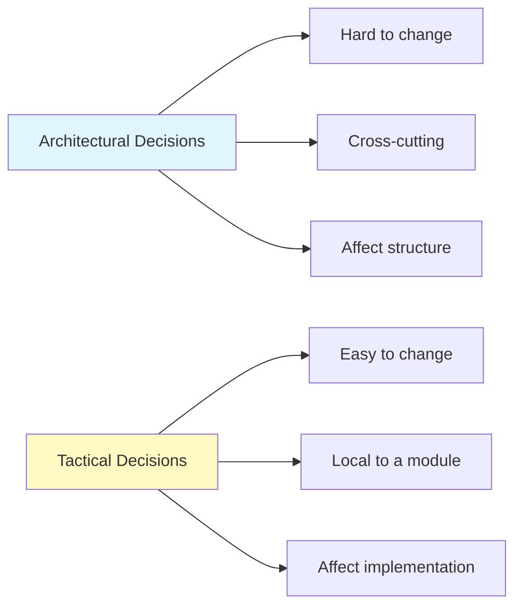
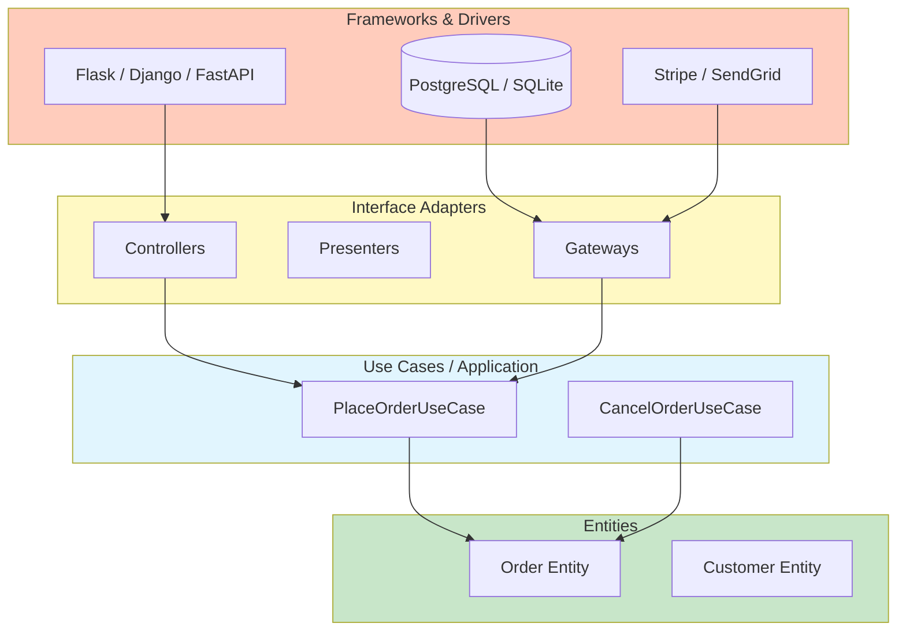
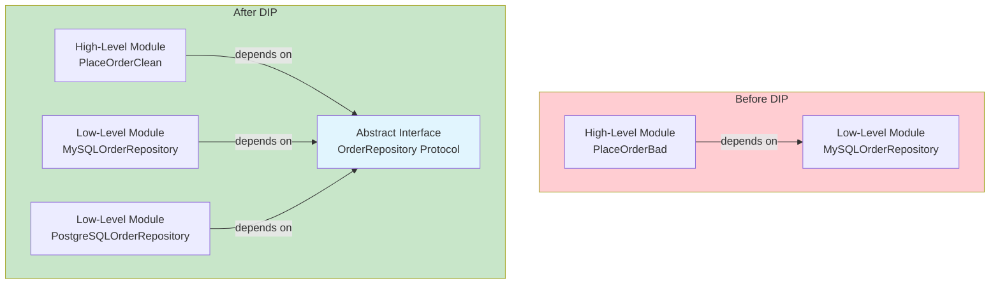
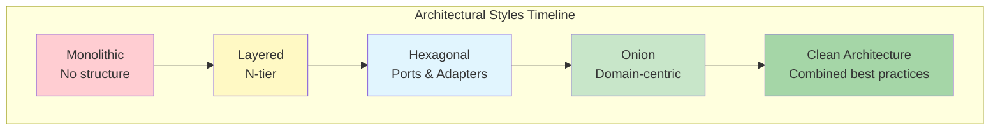

# What is Software Architecture?

Software architecture is the set of design decisions that shape a system's structure, behavior, and evolution. It defines the high-level components, their interactions, and the constraints that guide implementation.

> [!NOTE]
> Architecture is not about frameworks, libraries, or databases. It is about the **decisions that are hard to change** once the system is built. Good architecture delays those decisions until the last responsible moment.

## Why Architecture Matters

Poor architecture leads to systems that are rigid, fragile, and impossible to test. Good architecture enables:

| Property | Bad Architecture | Good Architecture |
|----------|-----------------|-------------------|
| Maintainability | Every change breaks something | Changes are localized |
| Testability | Requires full system setup | Unit-testable in isolation |
| Deployability | Long, risky deployments | Safe, frequent releases |
| Scalability | Coupled to a single machine | Scales horizontally |
| Developer productivity | Declines over time | Sustained velocity |

```python
# Bad: no architecture — everything coupled
import flask, sqlite3, smtplib, stripe

app = flask.Flask(__name__)

@app.route("/checkout")
def checkout():
    data = flask.request.json
    db = sqlite3.connect("shop.db")
    db.execute("INSERT INTO orders VALUES (?, ?)", (data["user_id"], data["total"]))
    stripe.Charge.create(amount=int(data["total"] * 100), currency="usd", source=data["token"])
    smtplib.SMTP("smtp.example.com").sendmail("from@shop.com", data["email"], "Order placed!")
    return {"ok": True}

# Good: layered architecture
# routes.py — only handles HTTP
# use_cases.py — business logic
# repositories.py — data access
# external.py — third-party integrations
```

## Architectural vs Tactical Decisions



Architectural decisions include choice of programming language, architectural style (layered, hexagonal, onion), communication protocols, and data storage strategy. Tactical decisions include algorithm choice, variable naming, and inline optimizations.

> [!WARNING]
> The most common architectural mistake is treating framework choices as architectural decisions. Swapping a framework should not change the architecture. Your business logic should be framework-agnostic.

## The Clean Architecture

Clean Architecture, introduced by Robert C. Martin, organizes code into concentric layers:

```python
from abc import ABC, abstractmethod
from dataclasses import dataclass
from typing import Protocol


@dataclass
class Order:
    customer_email: str
    product_id: str
    quantity: int
    total: float


class OrderRepository(ABC):
    @abstractmethod
    def save(self, order: Order) -> None:
        ...

    @abstractmethod
    def find_by_id(self, order_id: str) -> Order | None:
        ...


class PaymentGateway(ABC):
    @abstractmethod
    def charge(self, customer_email: str, amount: float) -> str:
        ...


class PlaceOrderUseCase:
    def __init__(
        self,
        repo: OrderRepository,
        gateway: PaymentGateway,
    ):
        self._repo = repo
        self._gateway = gateway

    def execute(
        self, customer_email: str, product_id: str, quantity: int, total: float
    ) -> Order:
        order = Order(customer_email, product_id, quantity, total)
        transaction_id = self._gateway.charge(customer_email, total)
        self._repo.save(order)
        return order
```

Notice how `PlaceOrderUseCase` depends only on **abstract interfaces** (`OrderRepository` and `PaymentGateway`). The concrete implementations come later — this is dependency inversion in action.

## The Four Layers

| Layer | Name | Contains | Dependencies |
|-------|------|----------|-------------|
| Outer | Frameworks & Drivers | DB, web framework, UI | Nothing (on the outside) |
| Middle | Interface Adapters | Controllers, presenters, gateways | Inward |
| Inner | Application / Use Cases | Business rules for a specific use case | Entities |
| Core | Entities | Enterprise-wide business rules | Nothing |



> [!TIP]
> Think of the layers as an onion. The core knows nothing about the outside. The outer layers know about the layers inside them. Dependencies always point **inward**.

## The Dependency Inversion Principle

Dependency Inversion is the bedrock of Clean Architecture. It states:

1. High-level modules should not depend on low-level modules. Both should depend on abstractions.
2. Abstractions should not depend on details. Details should depend on abstractions.

```python
# Violation: high-level depends on low-level
class MySQLOrderRepository:
    def save(self, order: Order) -> None:
        print(f"Saving {order} to MySQL...")

class PlaceOrderBad:
    def __init__(self):
        self._repo = MySQLOrderRepository()  # Hard dependency!

    def execute(self, order: Order) -> None:
        self._repo.save(order)


# Clean: depends on abstraction
from typing import Protocol

class OrderRepository(Protocol):
    def save(self, order: Order) -> None:
        ...

class PlaceOrderClean:
    def __init__(self, repo: OrderRepository):
        self._repo = repo  # Depends on abstraction

    def execute(self, order: Order) -> None:
        self._repo.save(order)


# Now we can inject any implementation
class PostgreSQLOrderRepository:
    def save(self, order: Order) -> None:
        print(f"Saving {order} to PostgreSQL...")

class InMemoryOrderRepository:
    def __init__(self):
        self._orders: dict[str, Order] = {}

    def save(self, order: Order) -> None:
        self._orders[order.product_id] = order

# Usage
repo = InMemoryOrderRepository()
use_case = PlaceOrderClean(repo)
use_case.execute(Order("a@b.com", "PROD-1", 2, 49.99))
```



## Separation of Concerns

Each layer has one responsibility. The Entity layer knows nothing about databases. The use case layer knows nothing about HTTP. The controller layer knows nothing about business rules.

```python
# Entity — pure business logic
@dataclass
class Product:
    product_id: str
    name: str
    price: float
    stock: int

    def can_be_purchased(self, quantity: int) -> bool:
        return self.stock >= quantity > 0

    def reduce_stock(self, quantity: int) -> None:
        if not self.can_be_purchased(quantity):
            raise ValueError("Insufficient stock")
        self.stock -= quantity

# Use Case — orchestrates the operation
class PurchaseProductUseCase:
    def __init__(self, product_repo, payment_gateway, notification_service):
        self._product_repo = product_repo
        self._payment_gateway = payment_gateway
        self._notification_service = notification_service

    def execute(self, product_id: str, quantity: int, customer_email: str) -> None:
        product = self._product_repo.find_by_id(product_id)
        product.reduce_stock(quantity)
        total = product.price * quantity
        self._payment_gateway.charge(customer_email, total)
        self._product_repo.save(product)
        self._notification_service.send_confirmation(customer_email, product, quantity)

# Controller — handles HTTP concerns
class PurchaseProductController:
    def __init__(self, use_case: PurchaseProductUseCase):
        self._use_case = use_case

    def handle(self, http_request: dict) -> dict:
        body = http_request.get("body", {})
        try:
            self._use_case.execute(
                product_id=body["product_id"],
                quantity=body["quantity"],
                customer_email=body["customer_email"],
            )
            return {"status": 200, "body": {"message": "Purchase successful"}}
        except ValueError as e:
            return {"status": 400, "body": {"error": str(e)}}
```

## Testing Without Infrastructure

Because layers depend on abstractions, we can test each layer in isolation:

```python
# Test the use case without any real infrastructure
def test_purchase_product():
    # Arrange
    product = Product("P1", "Widget", 10.0, 5)
    repo = InMemoryProductRepository([product])
    gateway = FakePaymentGateway()
    notifications = FakeNotificationService()
    use_case = PurchaseProductUseCase(repo, gateway, notifications)

    # Act
    use_case.execute("P1", 2, "test@example.com")

    # Assert
    assert product.stock == 3
    assert gateway.total_charged == 20.0
    assert notifications.last_email == "test@example.com"


class InMemoryProductRepository:
    def __init__(self, products: list | None = None):
        self._products = {p.product_id: p for p in (products or [])}

    def find_by_id(self, product_id: str) -> Product:
        if product_id not in self._products:
            raise ValueError("Product not found")
        return self._products[product_id]

    def save(self, product: Product) -> None:
        self._products[product.product_id] = product


class FakePaymentGateway:
    def __init__(self):
        self.total_charged = 0.0

    def charge(self, email: str, amount: float) -> str:
        self.total_charged += amount
        return "txn_fake_123"


class FakeNotificationService:
    def __init__(self):
        self.last_email = ""

    def send_confirmation(self, email: str, product: Product, qty: int) -> None:
        self.last_email = email
```

> [!SUCCESS]
> Clean Architecture enables you to test all business logic **without a database, without HTTP, and without any external service**. This is the hallmark of well-architected software.

## The Screaming Architecture

> [!NOTE]
> A well-architected system **screams** its purpose. If you see a Django project, you know it's a web app. But a Clean Architecture project screams **what it does** — ecommerce, banking, logistics — regardless of the framework.

```
# A Clean Architecture project structure screams "this is an ecommerce system"
src/
  entities/          # Enterprise business rules
    product.py
    order.py
    customer.py
  use_cases/         # Application business rules
    place_order.py
    cancel_order.py
    process_refund.py
  interface_adapters/
    controllers/
    presenters/
    repositories/
  frameworks/
    flask_app.py
    postgres_repo.py
    stripe_gateway.py
```

The top-level structure tells you what the system does, not what technology it uses.

## Architectural Boundaries

Boundaries separate layers. They are drawn at points where one concern ends and another begins. The simplest boundary is a Python module boundary. More explicit boundaries use abstract base classes or `Protocol` types.

```python
# Boundary: between use cases and data access
from typing import Protocol


class OrderRepository(Protocol):
    """This Protocol defines the boundary.
    
    The use case layer depends on this Protocol.
    The data access layer implements this Protocol.
    They can be developed and tested independently.
    """
    def save(self, order: "Order") -> None:
        ...

    def find_by_id(self, order_id: str) -> "Order | None":
        ...
```

> [!TIP]
> Boundaries should be **plugin points**. You should be able to "plug in" a new database, a new UI, or a new payment provider without changing the business logic.

## Comparing Architectural Styles

| Style | Direction | Coupling | Best For |
|-------|-----------|----------|----------|
| Layered | Top-down | Tight | Simple CRUD apps |
| Clean Architecture | Inward | Loose (via DIP) | Complex business logic |
| Hexagonal (Ports & Adapters) | Inward | Loose | Domain-driven design |
| Onion | Inward | Loose | Enterprise applications |
| Microservices | Decentralized | Loose (via APIs) | Large distributed teams |



## Common Misconceptions

> [!WARNING]
> **"Clean Architecture means more code."** Yes, there are more files and interfaces. But the total complexity is lower because each piece is simpler, testable, and independently understandable.

| Misconception | Reality |
|---------------|---------|
| "It's only for big projects" | Even small projects benefit from separation of concerns |
| "It slows down development" | Initial speed is slightly slower; long-term speed is much faster |
| "You need a DI framework" | Python Protocols and manual injection work perfectly |
| "It's about layers" | It's about **boundaries** and **dependency direction** |
| "It means no frameworks" | Frameworks are fine in the outer layer |

## Practice Exercises

1. **Identify architectural decisions**: List 3 architectural decisions and 3 tactical decisions in a project you know. Explain why each one is classified as such.

2. **Spot the violation**: The following code has a dependency inversion violation. Identify it and fix it:
   ```python
   class EmailService:
       def send(self, to: str, message: str):
           import smtplib
           server = smtplib.SMTP("smtp.example.com")
           server.sendmail("noreply@shop.com", to, message)

   class OrderProcessor:
       def __init__(self):
           self.email = EmailService()

       def process(self, order):
           self.email.send(order.email, "Order processed")
   ```

3. **Draw the layers**: Pick a small application you've built. Draw its layers as a Clean Architecture onion diagram. Identify which dependencies point inward and which violate the direction.

4. **Implement a boundary**: Create a `UserRepository` Protocol and an `InMemoryUserRepository` implementation. Write a use case called `RegisterUserUseCase` that depends on the Protocol.

5. **Test without infrastructure**: Using the `PurchaseProductUseCase` from this lesson, write a test that verifies the correct behavior when `can_be_purchased` returns `False`. Do not use any real databases or external services.

6. **Framework dependency audit**: Examine a Django or Flask project. Count how many import statements in `views.py` reference framework-specific classes. How could you refactor to reduce framework coupling?

7. **Scream test**: Look at your project's top-level directory. Does it scream what the system does or what technology it uses? Sketch a cleaner directory structure.

8. **Boundary refactoring**: Take a function that mixes HTTP parsing, business logic, and database access. Split it into three layers: controller, use case, and repository. Show each layer.

> [!SUCCESS]
> You have completed Lesson 1. Remember: architecture is about the decisions that matter — and making them reversible.
