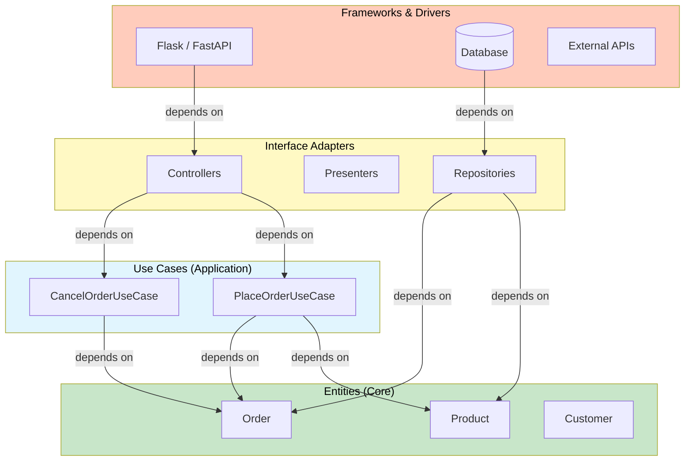
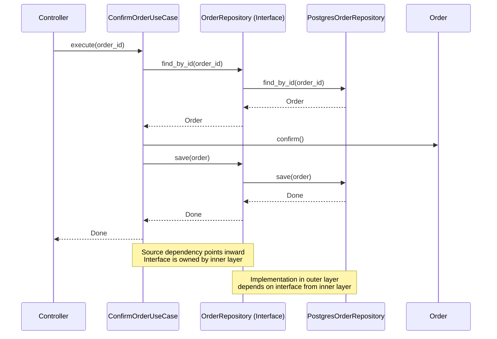
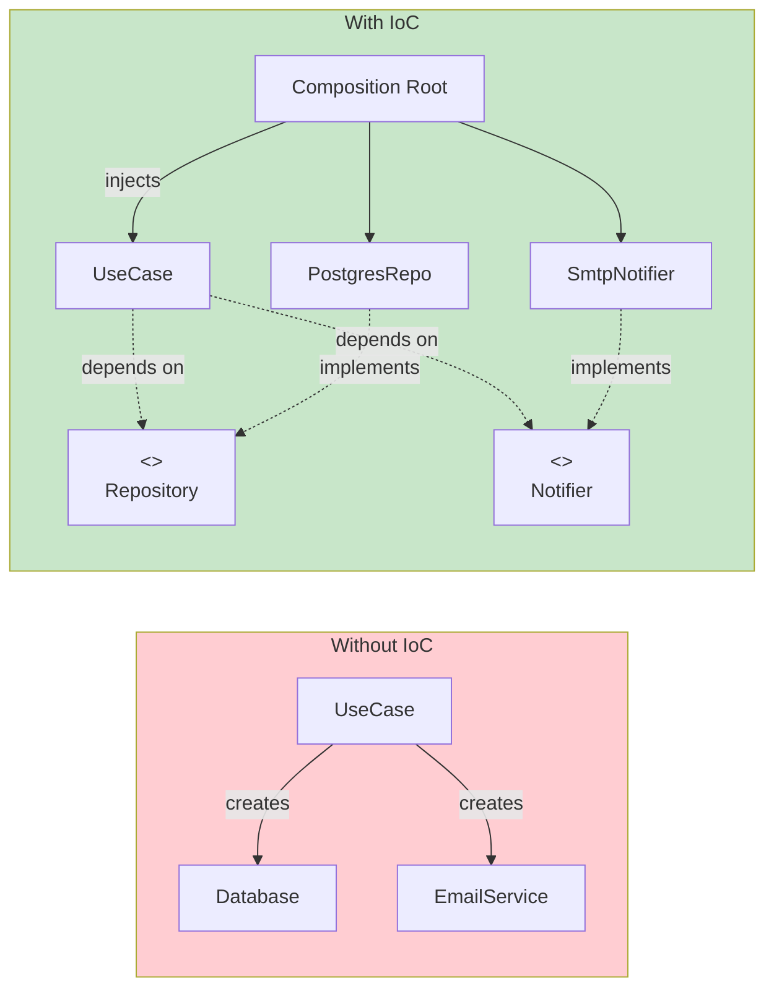
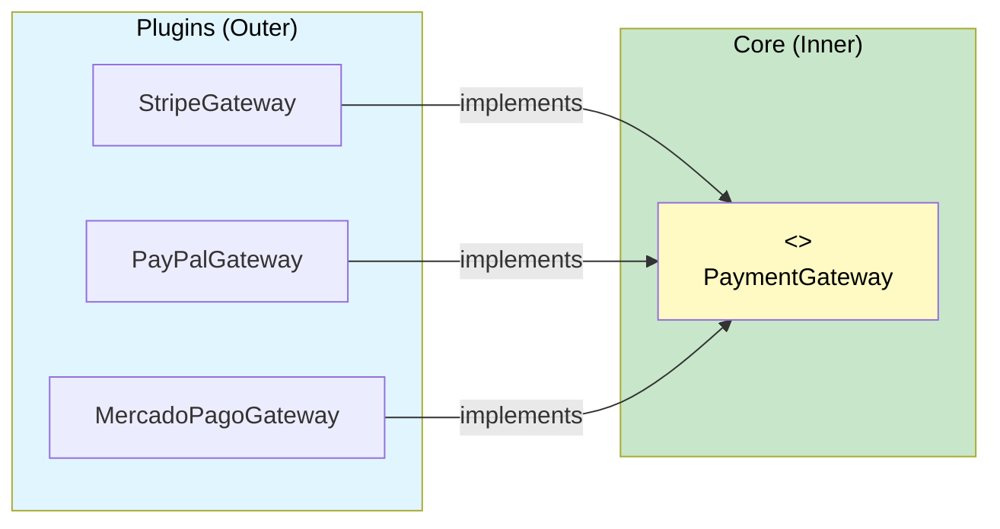

# The Dependency Rule

The Dependency Rule is the single most important principle in Clean Architecture. It states:

> **Source code dependencies must point only inward, toward the center of the onion.**

Nothing in an inner circle can know anything about an outer circle. This includes function names, class names, variable names — anything declared in an outer circle.

> [!NOTE]
> The Dependency Rule applies to **compile-time** or **source-code** dependencies, not runtime execution. Your inner code can call outer code through dependency inversion — the interface is defined in the inner layer, implemented in the outer layer.

## Visualizing the Rule



**Arrows point from outer to inner** because a module depends on what it points to. The outer layer knows about the next inner layer, but the inner layer knows nothing about the outer layers.

## What Violates the Dependency Rule?

```python
# VIOLATION: Entity imports a framework
import django.db.models  # Entity should NOT know about Django!

class Product:
    def __init__(self, name: str, price: float):
        self.name = name
        self.price = price
        self.django_model = django.db.models.Model()  # Wrong!


# VIOLATION: Use case imports a database driver
import psycopg2  # Use case should NOT know about PostgreSQL!

class PlaceOrderUseCase:
    def execute(self, order: Order) -> None:
        conn = psycopg2.connect("dbname=shop")
        cursor = conn.cursor()
        cursor.execute("INSERT INTO orders VALUES (%s)", (order,))  # Wrong!
```

> [!WARNING]
> Every time an inner layer imports something from an outer layer, the Dependency Rule is broken. This includes importing ORM models, HTTP request objects, JSON libraries, or configuration files from within your entities or use cases.

## Crossing Boundaries

When inner code needs to communicate with outer code (e.g., save to a database), it does so through an **interface** defined in the inner layer but implemented in the outer layer.

```python
from abc import ABC, abstractmethod
from dataclasses import dataclass


# --- Inner layer: Entities ---

@dataclass
class Order:
    order_id: str
    customer_email: str
    total: float
    status: str = "pending"

    def confirm(self) -> None:
        self.status = "confirmed"

    def cancel(self) -> None:
        self.status = "cancelled"


# --- Inner layer: Use Cases ---

class OrderRepository(ABC):
    """Interface defined in the inner layer."""
    
    @abstractmethod
    def save(self, order: Order) -> None:
        ...

    @abstractmethod
    def find_by_id(self, order_id: str) -> Order | None:
        ...


class NotificationService(ABC):
    """Another inner-layer interface."""
    
    @abstractmethod
    def send(self, recipient: str, subject: str, body: str) -> None:
        ...


class ConfirmOrderUseCase:
    def __init__(
        self,
        repo: OrderRepository,
        notifier: NotificationService,
    ):
        self._repo = repo
        self._notifier = notifier

    def execute(self, order_id: str) -> None:
        order = self._repo.find_by_id(order_id)
        if order is None:
            raise ValueError("Order not found")
        order.confirm()
        self._repo.save(order)
        self._notifier.send(
            order.customer_email,
            "Order Confirmed",
            f"Your order {order.order_id} has been confirmed.",
        )


# --- Outer layer: Interface Adapters ---

class PostgresOrderRepository(OrderRepository):
    """Implementation lives in the outer layer."""
    
    def __init__(self, connection_string: str):
        self._conn_string = connection_string

    def save(self, order: Order) -> None:
        print(f"[PostgreSQL] Saving order {order.order_id}...")
        # Real implementation: INSERT INTO orders ...

    def find_by_id(self, order_id: str) -> Order | None:
        print(f"[PostgreSQL] Finding order {order_id}...")
        # Real implementation: SELECT * FROM orders WHERE id = ...
        return Order(order_id=order_id, customer_email="test@test.com", total=99.99)


class EmailNotificationService(NotificationService):
    def send(self, recipient: str, subject: str, body: str) -> None:
        print(f"[Email] To: {recipient}, Subject: {subject}")


# --- Wiring (Composition Root) ---

def create_order_confirmation_handler() -> ConfirmOrderUseCase:
    repo = PostgresOrderRepository("postgresql://localhost/shop")
    notifier = EmailNotificationService()
    return ConfirmOrderUseCase(repo, notifier)
```

## The Flow of Control vs The Flow of Dependencies



The flow of **control** goes from outer to inner (controller calls use case). The flow of **dependency** also goes inward (controller depends on use case). But the **data flow** goes both ways through the boundary.

> [!TIP]
> When control crosses a boundary from outer to inner, the source code dependency still points inward. This is achieved by having the outer layer call an interface that is **defined** in the inner layer and **implemented** in the outer layer.

## Inversion of Control (IoC)

IoC is the mechanism that makes the Dependency Rule work. Instead of inner layers calling outer layers directly, outer layers call inner layers through interfaces.

```python
# Without IoC — violating the rule
class UseCase:
    def execute(self):
        db = Database()  # Use case creates its own database — WRONG
        db.save(...)

# With IoC — following the rule
class UseCase:
    def __init__(self, repo: Repository):
        self._repo = repo  # Injected — follows Dependency Rule

    def execute(self):
        self._repo.save(...)

# Without IoC — direct instantiation
class ReportController:
    def generate(self):
        use_case = GenerateReportUseCase()  # Controller creates use case
        return use_case.run()

# With IoC — dependency injection
class ReportController:
    def __init__(self, use_case: GenerateReportUseCase):
        self._use_case = use_case

    def generate(self):
        return self._use_case.run()
```



## Cross-Boundary Data Models

Data that crosses a boundary should be in a form that is convenient for the inner layer. Do not pass ORM models or HTTP request objects across boundaries.

```python
# BAD: Passing ORM model across boundary
from django.db import models

class OrderModel(models.Model):  # Outer layer
    user_email = models.EmailField()
    total = models.DecimalField(max_digits=10, decimal_places=2)

# Use case receives an ORM model — VIOLATION!
class ConfirmOrderBad:
    def execute(self, order_model: OrderModel) -> None:
        order_model.status = "confirmed"
        order_model.save()


# GOOD: Simple data structure for cross-boundary communication
from dataclasses import dataclass

@dataclass
class OrderRequest:
    """Simple DTO for crossing boundaries."""
    order_id: str
    customer_email: str
    total: float


class ConfirmOrderGood:
    def __init__(self, repo: OrderRepository):
        self._repo = repo

    def execute(self, request: OrderRequest) -> None:
        order = self._repo.find_by_id(request.order_id)
        order.confirm()
        self._repo.save(order)
```

```python
# An adapter transforms data at the boundary
from dataclasses import dataclass


# --- Inner layer types ---

@dataclass
class ProductData:
    product_id: str
    name: str
    price: float


# --- Adapter translates between layers ---

class DjangoProductAdapter:
    def to_inner(self, django_model) -> ProductData:
        return ProductData(
            product_id=str(django_model.id),
            name=django_model.name,
            price=float(django_model.price),
        )

    def from_inner(self, product: ProductData):
        from myapp.models import Product as DjangoProduct
        return DjangoProduct(
            id=product.product_id,
            name=product.name,
            price=product.price,
        )
```

## The Composition Root

The Composition Root is the **single place** in the application where all dependencies are wired together. It should be as close to the entry point as possible.

```python
# --- composition_root.py ---
# This is the ONLY place where concrete classes are instantiated

def create_app():
    # Repositories (outer layer)
    order_repo = PostgresOrderRepository(
        connection_string="postgresql://localhost/shop"
    )
    product_repo = PostgresProductRepository(
        connection_string="postgresql://localhost/shop"
    )
    
    # Gateways (outer layer)
    payment_gateway = StripePaymentGateway(api_key="sk_test_...")
    notification_service = EmailNotificationService(
        smtp_host="smtp.example.com"
    )
    
    # Use cases (inner layer — injected with dependencies)
    place_order = PlaceOrderUseCase(
        repo=order_repo,
        payment=payment_gateway,
        notification=notification_service,
    )
    cancel_order = CancelOrderUseCase(repo=order_repo)
    
    # Controllers (outer layer)
    order_controller = OrderController(
        place_order=place_order,
        cancel_order=cancel_order,
    )
    
    # Framework
    return FlaskApp(order_controller=order_controller)
```

> [!SUCCESS]
> With the Composition Root, no class in the application instantiates its own dependencies. Everything is wired from the outside, making every class testable in isolation.

## Plugin Architecture

The Dependency Rule enables a **plugin architecture**. Outer layers behave as plugins to the inner layer:

| Component | Type | Can Be Swapped |
|-----------|------|----------------|
| Database | Plugin | PostgreSQL → SQLite → MongoDB |
| Web Framework | Plugin | Flask → FastAPI → Django |
| Payment Gateway | Plugin | Stripe → PayPal → Mercado Pago |
| Notification | Plugin | Email → SMS → Push Notification |
| UI | Plugin | Web → CLI → Desktop → Mobile API |

```python
# Each plugin implements an inner-layer interface

# plugins/stripe_payment.py
from use_cases.payment_gateway import PaymentGateway

class StripePaymentGateway(PaymentGateway):
    def charge(self, customer_email: str, amount: float) -> str:
        import stripe
        charge = stripe.Charge.create(
            amount=int(amount * 100),
            currency="usd",
            receipt_email=customer_email,
        )
        return charge.id

# plugins/paypal_payment.py
from use_cases.payment_gateway import PaymentGateway

class PayPalPaymentGateway(PaymentGateway):
    def charge(self, customer_email: str, amount: float) -> str:
        import paypalrestsdk
        payment = paypalrestsdk.Payment({
            "intent": "sale",
            "payer": {"payment_method": "paypal"},
            "transactions": [{"amount": {"total": str(amount), "currency": "USD"}}],
        })
        if payment.create():
            return payment.id
        raise RuntimeError("PayPal payment failed")
```



## Partial vs Complete Boundaries

Not every boundary needs to be a full-blown interface. Use the right level of boundary for your needs:

| Type | Mechanism | Cost | When to Use |
|------|-----------|------|-------------|
| No boundary | Direct import | Lowest | Prototypes, throwaway code |
| Partial boundary | Abstract class or Protocol | Low | Single implementation but want testability |
| Complete boundary | Interface + DI + separate package | Higher | Multiple implementations, independent teams |
| Separate process | Microservice | Highest | Different deployability needs |

```python
# Partial boundary: Protocol is enough
from typing import Protocol

class Logger(Protocol):
    def log(self, message: str) -> None:
        ...


class UseCase:
    def __init__(self, logger: Logger):
        self._logger = logger

    def execute(self) -> None:
        self._logger.log("Executing use case")


# Two implementations, no separate package needed
class ConsoleLogger:
    def log(self, message: str) -> None:
        print(f"[LOG] {message}")

class FileLogger:
    def __init__(self, path: str):
        self._path = path

    def log(self, message: str) -> None:
        with open(self._path, "a") as f:
            f.write(f"{message}\n")
```

> [!TIP]
> Start with partial boundaries (Protocols) and evolve to complete boundaries only when you need multiple implementations or independent deployability. Premature boundary abstraction adds unnecessary complexity.

## Testing and the Dependency Rule

The Dependency Rule makes testing trivial. Every use case can be tested with fake implementations of its dependencies:

```python
def test_confirm_order_sends_notification():
    # Arrange
    order = Order(order_id="ORD-001", customer_email="alice@test.com", total=100.0)
    repo = FakeOrderRepository([order])
    notifier = FakeNotificationService()
    use_case = ConfirmOrderUseCase(repo, notifier)

    # Act
    use_case.execute("ORD-001")

    # Assert
    assert order.status == "confirmed"
    assert notifier.sent_to == "alice@test.com"
    assert "confirmed" in notifier.last_subject.lower()


class FakeOrderRepository:
    def __init__(self, orders: list[Order] | None = None):
        self._orders = {o.order_id: o for o in (orders or [])}

    def save(self, order: Order) -> None:
        self._orders[order.order_id] = order

    def find_by_id(self, order_id: str) -> Order | None:
        return self._orders.get(order_id)


class FakeNotificationService:
    def __init__(self):
        self.sent_to = ""
        self.last_subject = ""
        self.last_body = ""

    def send(self, recipient: str, subject: str, body: str) -> None:
        self.sent_to = recipient
        self.last_subject = subject
        self.last_body = body
```

## Common Dependency Rule Violations

| Violation | Example | Fix |
|-----------|---------|-----|
| Importing ORM in entity | `from django.db import models` | Create plain Python entities |
| Using framework decorators in use cases | `@app.route` in use case | Move routing to controller layer |
| Passing request objects to services | `def process(request: HttpRequest)` | Extract data into a DTO |
| Creating concrete instances | `db = MySQLDatabase()` | Inject via constructor |
| Importing JSON library in core | `import json` in entity | Serialize at boundary |
| Using environment variables in entities | `os.getenv("DATABASE_URL")` | Inject configuration |

```python
# VIOLATION: Use case handles HTTP concerns
from flask import request, jsonify

class CheckoutUseCase:
    def execute(self):
        data = request.json  # Flask import in use case!
        return jsonify({"status": "ok"})  # Framework response in use case!


# CLEAN: Controller handles HTTP, use case handles logic
class CheckoutController:
    def __init__(self, use_case: "CheckoutUseCase"):
        self._use_case = use_case

    def handle(self, http_request) -> dict:
        data = http_request.json
        result = self._use_case.execute(
            customer_email=data["email"],
            total=data["total"],
        )
        return {"status": 200, "body": result}


class CheckoutUseCase:
    def __init__(self, repo: OrderRepository):
        self._repo = repo

    def execute(self, customer_email: str, total: float) -> dict:
        order = Order(customer_email=customer_email, total=total)
        self._repo.save(order)
        return {"order_id": order.order_id, "status": "created"}
```

## The Dependency Rule in Different Languages

| Language | Mechanism | Example |
|----------|-----------|---------|
| Python | `Protocol`, `ABC`, `typing` | `class Repository(Protocol):` |
| Java | `interface` keyword | `interface Repository<T>` |
| C# | `interface` keyword | `interface IRepository<T>` |
| TypeScript | `interface` or `type` | `type Repository = {...}` |
| Go | `interface` type | `type Repository interface` |
| Rust | `trait` | `trait Repository<T>` |

The mechanism varies, but the principle is the same: **depend on abstractions, not concretions**.

## Practice Exercises

1. **Find violations**: Look at any existing Python project. Find 3 places where the Dependency Rule is violated. Document the file, line, and the fix.

2. **Define an interface**: Create a `NotificationService` Protocol in the inner layer with a `send(user_id: str, message: str) -> None` method. Implement `SMSNotificationService` and `EmailNotificationService` in the outer layer.

3. **Implement a boundary**: Write a `ShoppingCartRepository` Protocol in the inner layer. Implement `RedisCartRepository` and `InMemoryCartRepository` in the outer layer. Write a `CheckoutUseCase` that uses it.

4. **Build a Composition Root**: Take 3 use cases with different dependencies. Create a `create_application()` function that wires them all together. No class should instantiate its own dependencies.

5. **Test with fakes**: For the `ConfirmOrderUseCase` in this lesson, write a test that verifies the correct exception is raised when `order_id` does not exist.

6. **Cross-boundary DTO**: Create a `UserRegistrationRequest` dataclass in the inner layer. Write an adapter that converts between an HTTP request body and this DTO.

7. **Plugin swap**: Write two `PaymentGateway` implementations: `StripeGateway` and `PayPalGateway`. Show how the use case code does not change when swapping between them.

8. **Boundary exercise**: Without looking at the lesson, draw the dependency arrows for a 4-layer clean architecture. Explain why inner layers can never import from outer layers.

> [!SUCCESS]
> The Dependency Rule is the foundation of Clean Architecture. Master this rule, and you master architectural design.
