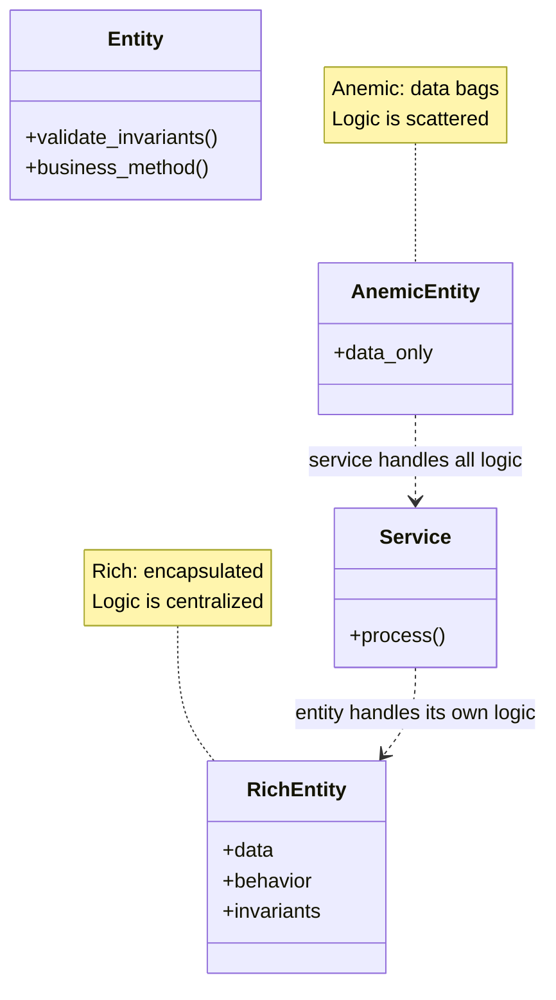
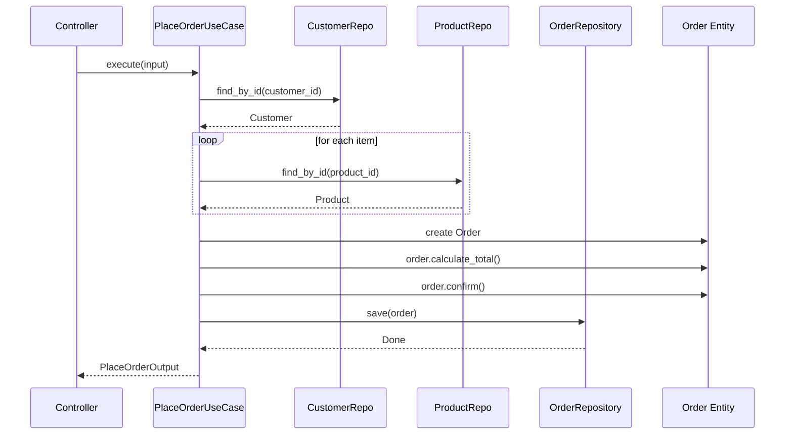
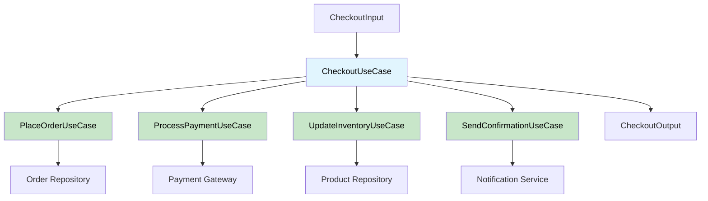

# Entities & Use Cases

Entities and Use Cases form the two innermost layers of Clean Architecture. Together, they contain **all** of the business logic. Nothing in these layers depends on frameworks, databases, or external systems.

> [!NOTE]
> **Entities** represent enterprise-wide business rules. **Use Cases** represent application-specific business rules. The distinction is about scope, not technology.

## Entities: Enterprise Business Rules

Entities encapsulate the most general and high-level business rules. They are the least likely to change when something external changes (like a database migration or a UI redesign).

```python
from dataclasses import dataclass, field
from decimal import Decimal
from enum import Enum, auto
from typing import List


class OrderStatus(Enum):
    PENDING = auto()
    CONFIRMED = auto()
    SHIPPED = auto()
    DELIVERED = auto()
    CANCELLED = auto()


@dataclass
class Address:
    street: str
    city: str
    state: str
    zip_code: str
    country: str

    def is_valid(self) -> bool:
        return all([self.street, self.city, self.country])


@dataclass
class Customer:
    customer_id: str
    name: str
    email: str
    shipping_address: Address | None = None

    def update_email(self, new_email: str) -> None:
        if "@" not in new_email:
            raise ValueError("Invalid email address")
        self.email = new_email

    def update_address(self, new_address: Address) -> None:
        if not new_address.is_valid():
            raise ValueError("Invalid address")
        self.shipping_address = new_address


@dataclass
class OrderItem:
    product_id: str
    product_name: str
    quantity: int
    unit_price: Decimal

    def total_price(self) -> Decimal:
        return Decimal(str(self.quantity)) * self.unit_price


@dataclass
class Order:
    order_id: str
    customer: Customer
    items: List[OrderItem] = field(default_factory=list)
    status: OrderStatus = OrderStatus.PENDING
    _total: Decimal | None = None

    def add_item(self, item: OrderItem) -> None:
        if self.status != OrderStatus.PENDING:
            raise ValueError("Cannot add items to a non-pending order")
        self.items.append(item)
        self._total = None  # Invalidate cached total

    def remove_item(self, product_id: str) -> None:
        if self.status != OrderStatus.PENDING:
            raise ValueError("Cannot remove items from a non-pending order")
        self.items = [i for i in self.items if i.product_id != product_id]
        self._total = None

    def calculate_total(self) -> Decimal:
        if self._total is None:
            self._total = sum(
                (item.total_price() for item in self.items),
                Decimal("0"),
            )
        return self._total

    def confirm(self) -> None:
        if self.status != OrderStatus.PENDING:
            raise ValueError("Only pending orders can be confirmed")
        if not self.items:
            raise ValueError("Cannot confirm an empty order")
        self.status = OrderStatus.CONFIRMED

    def ship(self) -> None:
        if self.status != OrderStatus.CONFIRMED:
            raise ValueError("Only confirmed orders can be shipped")
        self.status = OrderStatus.SHIPPED

    def cancel(self) -> None:
        if self.status in (OrderStatus.SHIPPED, OrderStatus.DELIVERED):
            raise ValueError("Cannot cancel shipped or delivered orders")
        self.status = OrderStatus.CANCELLED
```

> [!TIP]
> Entities should be **pure** — no imports from frameworks, no ORM mappings, no serialization logic. They are plain Python classes with business methods.

## Entity Design Principles

| Principle | Description | Example |
|-----------|-------------|---------|
| Encapsulation | Protect internal state | Properties, private attributes |
| Self-validation | Guard against invalid states | Check in setters and methods |
| Behavior-rich | Methods, not getters/setters | `order.confirm()`, not `order.status = "confirmed"` |
| Persistence-ignorant | No DB/ORM awareness | No `save()`, no `objects` attribute |
| Framework-free | No imports from frameworks | No Django models, no Flask imports |

```python
# BAD: Anemic entity (just data, no behavior)
@dataclass
class BadOrder:
    id: str
    status: str
    items: list
    customer_id: str

# Every service needs to know the rules
def confirm_order(order: BadOrder) -> None:
    if order.status != "pending":
        raise ValueError("...")
    if not order.items:
        raise ValueError("...")
    order.status = "confirmed"

# GOOD: Rich entity (encapsulated behavior)
@dataclass
class GoodOrder:
    id: str
    status: str = "pending"
    items: list = field(default_factory=list)

    def confirm(self) -> None:
        if self.status != "pending":
            raise ValueError("Only pending orders can be confirmed")
        if not self.items:
            raise ValueError("Cannot confirm an empty order")
        self.status = "confirmed"
```



## Use Cases: Application Business Rules

A use case orchestrates the flow of data to and from entities, and directs those entities to use their enterprise business rules to achieve a specific application goal.

```python
from abc import ABC, abstractmethod
from dataclasses import dataclass
from decimal import Decimal


# --- Input/Output DTOs ---

@dataclass
class PlaceOrderInput:
    customer_id: str
    items: list[dict]  # [{"product_id": str, "quantity": int}]


@dataclass
class PlaceOrderOutput:
    order_id: str
    total: Decimal
    status: str


# --- Repository Interfaces ---

class CustomerRepository(ABC):
    @abstractmethod
    def find_by_id(self, customer_id: str) -> Customer | None:
        ...

    @abstractmethod
    def save(self, customer: Customer) -> None:
        ...


class ProductRepository(ABC):
    @abstractmethod
    def find_by_id(self, product_id: str) -> "Product | None":
        ...


class OrderRepository(ABC):
    @abstractmethod
    def save(self, order: Order) -> None:
        ...

    @abstractmethod
    def find_by_id(self, order_id: str) -> Order | None:
        ...


# --- The Use Case ---

class PlaceOrderUseCase:
    """Application-specific business rule: placing an order."""
    
    def __init__(
        self,
        customer_repo: CustomerRepository,
        product_repo: ProductRepository,
        order_repo: OrderRepository,
    ):
        self._customer_repo = customer_repo
        self._product_repo = product_repo
        self._order_repo = order_repo

    def execute(self, input_data: PlaceOrderInput) -> PlaceOrderOutput:
        customer = self._customer_repo.find_by_id(input_data.customer_id)
        if customer is None:
            raise ValueError(f"Customer {input_data.customer_id} not found")

        items: list[OrderItem] = []
        for item_data in input_data.items:
            product = self._product_repo.find_by_id(item_data["product_id"])
            if product is None:
                raise ValueError(f"Product {item_data['product_id']} not found")
            items.append(
                OrderItem(
                    product_id=product.product_id,
                    product_name=product.name,
                    quantity=item_data["quantity"],
                    unit_price=product.price,
                )
            )

        order = Order(
            order_id=self._generate_id(),
            customer=customer,
            items=items,
        )
        total = order.calculate_total()
        order.confirm()
        self._order_repo.save(order)
        return PlaceOrderOutput(
            order_id=order.order_id,
            total=total,
            status=order.status.name,
        )

    def _generate_id(self) -> str:
        import uuid
        return str(uuid.uuid4())
```



## Use Case Flow

Every use case follows a standard pattern:

1. **Receive input** from the controller (or presenter)
2. **Validate** the input (business rules)
3. **Fetch** necessary entities from repositories
4. **Orchestrate** entity methods to perform the operation
5. **Persist** changes through repositories
6. **Return output** to the presenter

```python
class CancelOrderUseCase:
    def __init__(
        self,
        order_repo: OrderRepository,
        notification_service: NotificationService,
    ):
        self._order_repo = order_repo
        self._notification = notification_service

    def execute(self, order_id: str, reason: str) -> None:
        # 1. Fetch
        order = self._order_repo.find_by_id(order_id)
        if order is None:
            raise ValueError("Order not found")

        # 2. Orchestrate
        order.cancel()

        # 3. Persist
        self._order_repo.save(order)

        # 4. Notify (cross-boundary call via interface)
        self._notification.send(
            recipient=order.customer.email,
            subject="Order Cancelled",
            body=f"Your order {order_id} has been cancelled. Reason: {reason}",
        )


class ProcessRefundUseCase:
    def __init__(
        self,
        order_repo: OrderRepository,
        payment_gateway: PaymentGateway,
    ):
        self._order_repo = order_repo
        self._payment = payment_gateway

    def execute(self, order_id: str) -> Decimal:
        order = self._order_repo.find_by_id(order_id)
        if order is None:
            raise ValueError("Order not found")
        if order.status != OrderStatus.CANCELLED:
            raise ValueError("Only cancelled orders can be refunded")

        refund_amount = order.calculate_total()
        self._payment.refund(order.customer.email, refund_amount)
        return refund_amount
```

## One Use Case = One Class

> [!TIP]
> A common pattern is **one use case per class**. This gives each use case a single responsibility, makes them independently testable, and prevents unrelated business logic from coupling.

```python
# DO THIS: Separate classes for separate use cases
class RegisterUserUseCase:
    """Single responsibility: register a user."""
    def execute(self, input_data: RegisterUserInput) -> User:
        ...

class UpdateUserProfileUseCase:
    """Single responsibility: update user profile."""
    def execute(self, user_id: str, profile_data: dict) -> User:
        ...

class DeactivateUserUseCase:
    """Single responsibility: deactivate a user."""
    def execute(self, user_id: str) -> None:
        ...

# NOT THIS: God class with everything
class UserManager:
    """One class doing everything — violates Single Responsibility."""
    def register(self, ...): ...
    def update_profile(self, ...): ...
    def deactivate(self, ...): ...
    def send_welcome_email(self, ...): ...
    def generate_report(self, ...): ...
```

## Use Cases and DTOs

Input and output data should be simple data transfer objects (DTOs) — plain dataclasses with no behavior:

```python
from dataclasses import dataclass
from decimal import Decimal
from datetime import datetime
from typing import List


@dataclass
class CreateProductInput:
    name: str
    description: str
    price: Decimal
    category_id: str
    tags: List[str]


@dataclass
class ProductOutput:
    product_id: str
    name: str
    price: Decimal
    created_at: datetime


@dataclass
class SearchProductsInput:
    query: str
    category_id: str | None = None
    min_price: Decimal | None = None
    max_price: Decimal | None = None
    page: int = 1
    page_size: int = 20


@dataclass
class SearchProductsOutput:
    results: List[ProductOutput]
    total_count: int
    page: int
    total_pages: int
```

> [!NOTE]
> DTOs should be **serializable** (simple types, no complex objects). They cross boundaries and may need to be serialized to JSON for APIs or stored in message queues.

## Testing Use Cases

Use cases are the most important thing to test — they contain your application's business logic:

```python
import pytest
from decimal import Decimal


def test_place_order_successfully():
    # Arrange
    customer = Customer(customer_id="C1", name="Alice", email="alice@test.com")
    product = Product(product_id="P1", name="Widget", price=Decimal("10.00"))
    
    customer_repo = InMemoryCustomerRepository([customer])
    product_repo = InMemoryProductRepository([product])
    order_repo = InMemoryOrderRepository()
    
    use_case = PlaceOrderUseCase(customer_repo, product_repo, order_repo)
    
    input_data = PlaceOrderInput(
        customer_id="C1",
        items=[{"product_id": "P1", "quantity": 3}],
    )

    # Act
    output = use_case.execute(input_data)

    # Assert
    assert output.status == "CONFIRMED"
    assert output.total == Decimal("30.00")
    
    saved_order = order_repo.find_by_id(output.order_id)
    assert saved_order is not None
    assert len(saved_order.items) == 1
    assert saved_order.status == OrderStatus.CONFIRMED


def test_place_order_fails_for_nonexistent_customer():
    empty_repo = InMemoryCustomerRepository([])
    use_case = PlaceOrderUseCase(empty_repo, InMemoryProductRepository(), InMemoryOrderRepository())
    
    with pytest.raises(ValueError, match="not found"):
        use_case.execute(PlaceOrderInput(customer_id="FAKE", items=[]))


def test_place_order_fails_for_nonexistent_product():
    customer = Customer(customer_id="C1", name="Alice", email="a@b.com")
    customer_repo = InMemoryCustomerRepository([customer])
    
    use_case = PlaceOrderUseCase(
        customer_repo, InMemoryProductRepository(), InMemoryOrderRepository()
    )
    
    with pytest.raises(ValueError, match="not found"):
        use_case.execute(
            PlaceOrderInput(customer_id="C1", items=[{"product_id": "FAKE", "quantity": 1}])
        )


# --- In-Memory Repositories for Testing ---

class InMemoryCustomerRepository:
    def __init__(self, customers: list[Customer] | None = None):
        self._customers = {c.customer_id: c for c in (customers or [])}

    def find_by_id(self, customer_id: str) -> Customer | None:
        return self._customers.get(customer_id)

    def save(self, customer: Customer) -> None:
        self._customers[customer.customer_id] = customer


class InMemoryProductRepository:
    def __init__(self, products: list | None = None):
        self._products = {p.product_id: p for p in (products or [])}

    def find_by_id(self, product_id: str):
        return self._products.get(product_id)


class InMemoryOrderRepository:
    def __init__(self):
        self._orders: dict[str, Order] = {}

    def save(self, order: Order) -> None:
        self._orders[order.order_id] = order

    def find_by_id(self, order_id: str) -> Order | None:
        return self._orders.get(order_id)
```

## Entity vs Use Case: When to Put Logic Where

| Question | Put in Entity | Put in Use Case |
|----------|---------------|-----------------|
| Can this rule change per application? | No | Yes |
| Is this a universal business rule? | Yes | No |
| Does it depend on external data? | No | Yes |
| Does it orchestrate multiple entities? | No | Yes |
| Does it involve I/O (DB, API, file)? | No | Yes |

```python
# ENTITY: Enterprise-wide rule — applies everywhere
class Money:
    def __init__(self, amount: Decimal, currency: str = "USD"):
        if amount < 0:
            raise ValueError("Amount cannot be negative")
        self.amount = amount
        self.currency = currency

    def __add__(self, other: "Money") -> "Money":
        if self.currency != other.currency:
            raise ValueError("Cannot add different currencies")
        return Money(self.amount + other.amount, self.currency)

# USE CASE: Application-specific rule — varies per app
class CalculateShippingCostUseCase:
    def __init__(self, shipping_provider: ShippingProvider):
        self._provider = shipping_provider

    def execute(self, order: Order, zip_code: str) -> Money:
        # This rule depends on an external provider
        # and varies by application — it belongs in a use case
        weight = sum(item.quantity * 0.5 for item in order.items)
        return self._provider.calculate(weight, zip_code)
```

## Use Case Composition

Use cases can compose other use cases for complex workflows:

```python
class CheckoutUseCase:
    """Composite use case that orchestrates multiple sub-use cases."""
    
    def __init__(
        self,
        place_order: PlaceOrderUseCase,
        process_payment: ProcessPaymentUseCase,
        send_confirmation: SendConfirmationUseCase,
        update_inventory: UpdateInventoryUseCase,
    ):
        self._place_order = place_order
        self._process_payment = process_payment
        self._send_confirmation = send_confirmation
        self._update_inventory = update_inventory

    def execute(self, input_data: CheckoutInput) -> CheckoutOutput:
        # Step 1: Place the order
        order_output = self._place_order.execute(
            PlaceOrderInput(
                customer_id=input_data.customer_id,
                items=input_data.items,
            )
        )

        # Step 2: Process payment
        payment_output = self._process_payment.execute(
            ProcessPaymentInput(
                customer_id=input_data.customer_id,
                amount=order_output.total,
                payment_token=input_data.payment_token,
            )
        )

        # Step 3: Update inventory
        for item in input_data.items:
            self._update_inventory.execute(
                UpdateInventoryInput(
                    product_id=item["product_id"],
                    quantity_reduced=item["quantity"],
                )
            )

        # Step 4: Send confirmation
        self._send_confirmation.execute(
            SendConfirmationInput(
                customer_id=input_data.customer_id,
                order_id=order_output.order_id,
                total=order_output.total,
            )
        )

        return CheckoutOutput(
            order_id=order_output.order_id,
            transaction_id=payment_output.transaction_id,
            total=order_output.total,
        )
```



## Common Anti-Patterns

| Anti-Pattern | Description | Fix |
|--------------|-------------|-----|
| Anemic Entity | Entity is a data bag with no methods | Move related logic into the entity |
| Fat Use Case | Use case does too many things | Split into focused use cases |
| Skipping Entities | All logic in use cases | Extract shared rules into entities |
| Repository in Entity | Entity calls database | Move persistence to use case via repo |
| Input Validation in Entity | Entity validates HTTP data | Validate in adapter layer |

```python
# Anti-pattern: Entity knows about persistence
class Product:
    def save_to_database(self) -> None:
        import sqlite3
        conn = sqlite3.connect("shop.db")  # Entity should NOT do this!
        conn.execute("INSERT INTO ...")

# Anti-pattern: Use case has entity logic duplicated
class ShipOrderUseCase:
    def execute(self, order_id: str) -> None:
        order = self._repo.find_by_id(order_id)
        # Duplicate of Order.ship() logic!
        if order.status != "confirmed":
            raise ValueError("...")
        if not order.items:
            raise ValueError("...")
        order.status = "shipped"
        self._repo.save(order)
```

## Practice Exercises

1. **Build an Entity**: Create a `BankAccount` entity with methods `deposit(amount)`, `withdraw(amount)`, `transfer_to(target, amount)`. Include validation rules (no negative amounts, no overdraft beyond limit).

2. **Create a Use Case**: Write a `TransferMoneyUseCase` that depends on `AccountRepository` (interface) and uses the `BankAccount` entity from exercise 1. Include input/output DTOs.

3. **Entity vs Use Case**: Given the rule "Orders over $100 get free shipping" — should this be in an entity or a use case? Justify your answer with code.

4. **Test a Use Case**: Write pytest tests for `CancelOrderUseCase`. Include tests for: successful cancellation, cancelling a confirmed order, cancelling a shipped order (should fail), and cancelling a non-existent order.

5. **Anemic to Rich**: Refactor this anemic entity:
   ```python
   @dataclass
   class Booking:
       id: str
       room_id: str
       guest_name: str
       check_in: str
       check_out: str
       status: str
       total: float
   ```
   Add validation: check_out must be after check_in, status transitions (pending → confirmed → checked_in → checked_out → completed).

6. **Composite Use Case**: Write a `BookRoomUseCase` that composes: `ValidateRoomAvailabilityUseCase`, `CreateBookingUseCase`, `ChargeDepositUseCase`, and `SendBookingConfirmationUseCase`.

7. **In-Memory Repository Pattern**: Implement `InMemoryBookingRepository` with `save`, `find_by_id`, `find_by_room_and_date` methods. Use it to test `BookRoomUseCase`.

8. **DTO Design**: Design input and output DTOs for a `SearchFlightsUseCase`. Include departure city, destination, date range, passenger count, and sorting options.

> [!SUCCESS]
> Entities hold the **what** and Use Cases hold the **how**. Keep entities framework-free and use cases orchestrator-focused.
