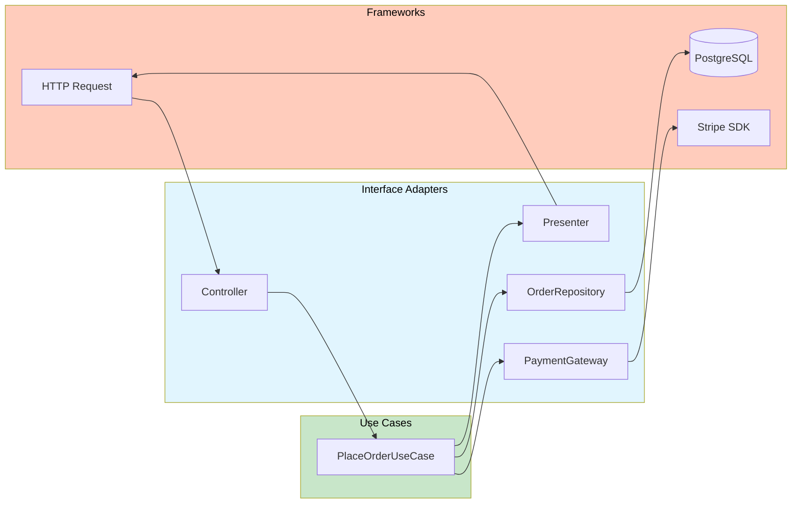
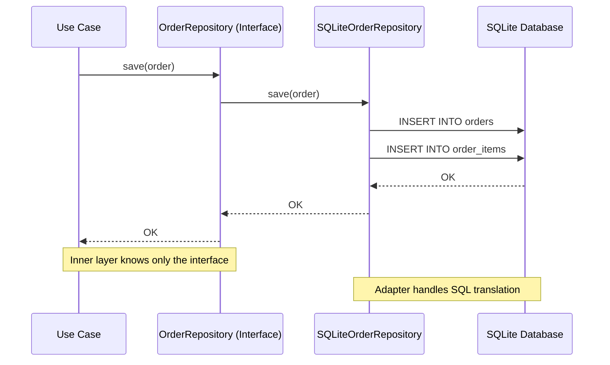
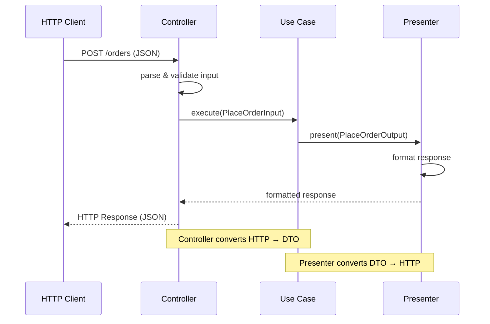
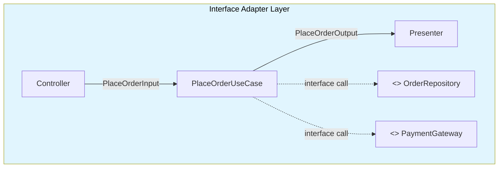

# Interface Adapters

Interface Adapters are the middle layer in Clean Architecture. They sit between the use cases (inner) and the frameworks (outer), translating data between formats that are convenient for each side.

> [!NOTE]
> The adapter layer exists so that neither the inner layers know about frameworks, nor the frameworks need to conform to inner-layer interfaces. The adapter translates in both directions.

## The Role of Interface Adapters

| Adapter Type | Input Source | Output Target | Translates |
|--------------|-------------|---------------|------------|
| Controller | HTTP Request / CLI / Queue | Use Case Input DTO | External format → inner format |
| Presenter | Use Case Output DTO | HTTP Response / View / CLI | Inner format → external format |
| Gateway / Repository | Database / API | Use Case Interface | Inner interface → external SDK |
| Database Adapter | Use Case Interface | SQL / ORM / NoSQL | Inner interface → database query |



## Controllers: From HTTP to Use Cases

Controllers parse incoming requests, validate input format, and construct the DTO that the use case expects.

```python
import json
from dataclasses import dataclass
from decimal import Decimal
from typing import Any


# --- Use Case DTO (inner layer) ---

@dataclass
class PlaceOrderInput:
    customer_id: str
    items: list[dict]
    coupon_code: str | None = None


# --- Controller (adapter layer) ---

class PlaceOrderController:
    """Translates HTTP request to Use Case input."""
    
    def __init__(self, use_case: "PlaceOrderUseCase"):
        self._use_case = use_case

    def handle(self, http_request: dict) -> dict:
        try:
            body = self._parse_body(http_request)
            self._validate(body)
            
            input_dto = PlaceOrderInput(
                customer_id=body["customer_id"],
                items=body["items"],
                coupon_code=body.get("coupon_code"),
            )
            
            output = self._use_case.execute(input_dto)
            return self._success_response(output)
            
        except ValueError as e:
            return self._error_response(400, str(e))
        except Exception as e:
            return self._error_response(500, "Internal server error")

    def _parse_body(self, request: dict) -> dict:
        raw = request.get("body", "{}")
        if isinstance(raw, str):
            return json.loads(raw)
        return raw

    def _validate(self, body: dict) -> None:
        if "customer_id" not in body:
            raise ValueError("customer_id is required")
        if "items" not in body or not body["items"]:
            raise ValueError("At least one item is required")
        for item in body["items"]:
            if "product_id" not in item:
                raise ValueError("Each item must have product_id")
            if "quantity" not in item:
                raise ValueError("Each item must have quantity")

    def _success_response(self, data: Any) -> dict:
        return {"status": 200, "body": {"success": True, "data": data}}

    def _error_response(self, status: int, message: str) -> dict:
        return {"status": status, "body": {"success": False, "error": message}}
```

## Presenters: From Use Cases to Responses

Presenters transform use case output into the format expected by the outer layer (JSON, HTML, CLI output).

```python
from dataclasses import dataclass
from decimal import Decimal
from datetime import datetime
import json


# --- Use Case Output (inner layer) ---

@dataclass
class PlaceOrderOutput:
    order_id: str
    total: Decimal
    status: str
    created_at: datetime


# --- Presenter (adapter layer) ---

class PlaceOrderPresenter:
    """Translates Use Case output to HTTP response format."""
    
    def present(self, output: PlaceOrderOutput) -> dict:
        return {
            "status": 201,
            "body": {
                "order_id": output.order_id,
                "total": float(output.total),
                "status": output.status,
                "created_at": output.created_at.isoformat(),
                "message": "Order placed successfully",
            },
        }


class PlaceOrderCLIPresenter:
    """Alternative presenter for CLI output."""
    
    def present(self, output: PlaceOrderOutput) -> str:
        return (
            f"Order {output.order_id} created!\n"
            f"Total: ${output.total:.2f}\n"
            f"Status: {output.status}"
        )


# --- Using the presenter ---

class PlaceOrderUseCase:
    def __init__(self, repo, presenter):
        self._repo = repo
        self._presenter = presenter

    def execute(self, input_dto: PlaceOrderInput) -> Any:
        # ... business logic ...
        order = self._repo.save(...)
        output = PlaceOrderOutput(
            order_id=order.order_id,
            total=order.calculate_total(),
            status=order.status.name,
            created_at=datetime.now(),
        )
        return self._presenter.present(output)
```

> [!TIP]
> Having multiple presenters for the same use case output is a powerful pattern. You can have a `JSONPresenter`, `HTMLPresenter`, `CSVPresenter`, and `CLIPresenter` — all driven by the same business logic.

## Repositories: Bridging Data

Repositories translate between the use case's data interfaces and the actual database:

```python
from abc import ABC, abstractmethod
from dataclasses import dataclass
from typing import Optional


# --- Inner layer: Interface ---

class OrderRepository(ABC):
    """Interface defined in the inner layer."""
    
    @abstractmethod
    def save(self, order: "Order") -> None:
        ...

    @abstractmethod
    def find_by_id(self, order_id: str) -> Optional["Order"]:
        ...

    @abstractmethod
    def find_by_customer_id(self, customer_id: str) -> list["Order"]:
        ...


# --- Adapter layer: Implementation ---

import sqlite3

class SQLiteOrderRepository(OrderRepository):
    """Adapter that translates between OrderRepository and SQLite."""
    
    def __init__(self, db_path: str):
        self._db_path = db_path
        self._init_db()

    def _init_db(self) -> None:
        with sqlite3.connect(self._db_path) as conn:
            conn.execute("""
                CREATE TABLE IF NOT EXISTS orders (
                    order_id TEXT PRIMARY KEY,
                    customer_email TEXT,
                    total REAL,
                    status TEXT,
                    created_at TEXT
                )
            """)
            conn.execute("""
                CREATE TABLE IF NOT EXISTS order_items (
                    id INTEGER PRIMARY KEY AUTOINCREMENT,
                    order_id TEXT,
                    product_id TEXT,
                    product_name TEXT,
                    quantity INTEGER,
                    unit_price REAL
                )
            """)

    def save(self, order: "Order") -> None:
        with sqlite3.connect(self._db_path) as conn:
            conn.execute(
                "INSERT OR REPLACE INTO orders VALUES (?, ?, ?, ?, ?)",
                (
                    order.order_id,
                    order.customer.email,
                    float(order.calculate_total()),
                    order.status.name,
                    datetime.now().isoformat(),
                ),
            )
            for item in order.items:
                conn.execute(
                    "INSERT INTO order_items (order_id, product_id, product_name, quantity, unit_price) VALUES (?, ?, ?, ?, ?)",
                    (order.order_id, item.product_id, item.product_name, item.quantity, float(item.unit_price)),
                )

    def find_by_id(self, order_id: str) -> Optional["Order"]:
        with sqlite3.connect(self._db_path) as conn:
            row = conn.execute(
                "SELECT * FROM orders WHERE order_id = ?", (order_id,)
            ).fetchone()
            if row is None:
                return None
            return self._row_to_order(row, conn)

    def find_by_customer_id(self, customer_id: str) -> list["Order"]:
        with sqlite3.connect(self._db_path) as conn:
            rows = conn.execute(
                "SELECT * FROM orders WHERE customer_email = ?", (customer_id,)
            ).fetchall()
            return [self._row_to_order(row, conn) for row in rows]

    def _row_to_order(self, row, conn) -> "Order":
        from your_app.entities import Order, Customer, Address, OrderItem, OrderStatus
        from decimal import Decimal
        
        order_id, customer_email, total, status_str, _ = row
        
        customer = Customer(customer_id="", email=customer_email, name="")
        
        item_rows = conn.execute(
            "SELECT * FROM order_items WHERE order_id = ?", (order_id,)
        ).fetchall()
        
        items = [
            OrderItem(
                product_id=ir[2],
                product_name=ir[3],
                quantity=ir[4],
                unit_price=Decimal(str(ir[5])),
            )
            for ir in item_rows
        ]
        
        order = Order(
            order_id=order_id,
            customer=customer,
            items=items,
            status=OrderStatus[status_str],
        )
        return order
```



## Gateways: External Service Adapters

Gateways wrap external services (payment processors, email providers, SMS services):

```python
from abc import ABC, abstractmethod


# --- Inner layer: Interface ---

class PaymentGateway(ABC):
    @abstractmethod
    def charge(self, customer_email: str, amount: float) -> str:
        """Returns transaction ID."""
        ...

    @abstractmethod
    def refund(self, transaction_id: str) -> float:
        """Returns refunded amount."""
        ...


# --- Adapter layer: Implementations ---

class StripePaymentGateway(PaymentGateway):
    """Adapter for Stripe payment processing."""
    
    def __init__(self, api_key: str):
        import stripe
        stripe.api_key = api_key
        self._stripe = stripe

    def charge(self, customer_email: str, amount: float) -> str:
        try:
            charge = self._stripe.Charge.create(
                amount=int(amount * 100),
                currency="usd",
                receipt_email=customer_email,
                description=f"Charge for {customer_email}",
            )
            return charge.id
        except self._stripe.error.StripeError as e:
            raise RuntimeError(f"Payment failed: {e}") from e

    def refund(self, transaction_id: str) -> float:
        try:
            refund = self._stripe.Refund.create(charge=transaction_id)
            return float(refund.amount) / 100.0
        except self._stripe.error.StripeError as e:
            raise RuntimeError(f"Refund failed: {e}") from e


class FakePaymentGateway(PaymentGateway):
    """Fake adapter for testing."""
    
    def __init__(self):
        self.charges: list[dict] = []
        self.refunds: list[str] = []

    def charge(self, customer_email: str, amount: float) -> str:
        txn_id = f"txn_{len(self.charges) + 1}"
        self.charges.append({"email": customer_email, "amount": amount, "id": txn_id})
        return txn_id

    def refund(self, transaction_id: str) -> float:
        self.refunds.append(transaction_id)
        for charge in self.charges:
            if charge["id"] == transaction_id:
                return charge["amount"]
        return 0.0
```

> [!NOTE]
> The adapter pattern for external services is often called the **Gateway** pattern. It wraps a third-party SDK behind an interface that your use cases understand. If Stripe changes its API, you only change one adapter.

## Database Adapter Example: Full CRUD

```python
from abc import ABC, abstractmethod
from dataclasses import dataclass
from typing import Optional


# --- Entity ---

@dataclass
class User:
    user_id: str
    name: str
    email: str
    is_active: bool = True


# --- Repository Interface ---

class UserRepository(ABC):
    @abstractmethod
    def save(self, user: User) -> None:
        ...

    @abstractmethod
    def find_by_id(self, user_id: str) -> Optional[User]:
        ...

    @abstractmethod
    def find_by_email(self, email: str) -> Optional[User]:
        ...

    @abstractmethod
    def delete(self, user_id: str) -> None:
        ...

    @abstractmethod
    def find_all(self, page: int, page_size: int) -> tuple[list[User], int]:
        ...


# --- PostgreSQL Implementation ---

import psycopg2
from psycopg2.extras import RealDictCursor

class PostgresUserRepository(UserRepository):
    def __init__(self, connection_string: str):
        self._conn_string = connection_string

    def _get_connection(self):
        return psycopg2.connect(self._conn_string)

    def save(self, user: User) -> None:
        with self._get_connection() as conn:
            with conn.cursor() as cur:
                cur.execute(
                    """
                    INSERT INTO users (user_id, name, email, is_active)
                    VALUES (%s, %s, %s, %s)
                    ON CONFLICT (user_id) DO UPDATE SET
                        name = EXCLUDED.name,
                        email = EXCLUDED.email,
                        is_active = EXCLUDED.is_active
                    """,
                    (user.user_id, user.name, user.email, user.is_active),
                )

    def find_by_id(self, user_id: str) -> Optional[User]:
        with self._get_connection() as conn:
            with conn.cursor(cursor_factory=RealDictCursor) as cur:
                cur.execute("SELECT * FROM users WHERE user_id = %s", (user_id,))
                row = cur.fetchone()
                if row:
                    return User(**row)
                return None

    def find_by_email(self, email: str) -> Optional[User]:
        with self._get_connection() as conn:
            with conn.cursor(cursor_factory=RealDictCursor) as cur:
                cur.execute("SELECT * FROM users WHERE email = %s", (email,))
                row = cur.fetchone()
                if row:
                    return User(**row)
                return None

    def delete(self, user_id: str) -> None:
        with self._get_connection() as conn:
            with conn.cursor() as cur:
                cur.execute("DELETE FROM users WHERE user_id = %s", (user_id,))

    def find_all(self, page: int, page_size: int) -> tuple[list[User], int]:
        with self._get_connection() as conn:
            with conn.cursor(cursor_factory=RealDictCursor) as cur:
                cur.execute("SELECT count(*) FROM users")
                total = cur.fetchone()["count"]
                
                offset = (page - 1) * page_size
                cur.execute(
                    "SELECT * FROM users ORDER BY name LIMIT %s OFFSET %s",
                    (page_size, offset),
                )
                users = [User(**row) for row in cur.fetchall()]
                return users, total


# --- In-Memory Implementation (for testing) ---

class InMemoryUserRepository(UserRepository):
    def __init__(self):
        self._users: dict[str, User] = {}

    def save(self, user: User) -> None:
        self._users[user.user_id] = user

    def find_by_id(self, user_id: str) -> Optional[User]:
        return self._users.get(user_id)

    def find_by_email(self, email: str) -> Optional[User]:
        for user in self._users.values():
            if user.email == email:
                return user
        return None

    def delete(self, user_id: str) -> None:
        self._users.pop(user_id, None)

    def find_all(self, page: int, page_size: int) -> tuple[list[User], int]:
        users = sorted(self._users.values(), key=lambda u: u.name)
        total = len(users)
        offset = (page - 1) * page_size
        return users[offset:offset + page_size], total
```

## The Controller-Presenter Pattern

A common Clean Architecture pattern separates the controller from the presenter:



```python
# Clean separation of concerns

class Controller:
    def __init__(self, use_case, presenter):
        self._use_case = use_case
        self._presenter = presenter

    def handle(self, request: dict) -> dict:
        try:
            input_dto = self._build_input(request)
            output = self._use_case.execute(input_dto)
            return self._presenter.present(output)
        except ValueError as e:
            return {"status": 400, "body": {"error": str(e)}}


class UseCase:
    def __init__(self, repo, presenter):
        self._repo = repo
        self._presenter = presenter

    def execute(self, input_dto) -> dict:
        # Business logic
        result = self._repo.save(...)
        return self._presenter.present(result)


class JSONPresenter:
    def present(self, data) -> dict:
        return {"status": 200, "body": self._serialize(data)}

    def _serialize(self, data):
        if hasattr(data, "__dataclass_fields__"):
            return {k: self._serialize(v) for k, v in data.__dict__.items()}
        return data
```

## Adapter Testing

Interface adapters are testable by providing fake frameworks:

```python
def test_controller_parses_request_correctly():
    # Arrange
    use_case = FakeUseCase()
    controller = PlaceOrderController(use_case)
    
    request = {
        "body": json.dumps({
            "customer_id": "C1",
            "items": [{"product_id": "P1", "quantity": 2}],
        })
    }

    # Act
    response = controller.handle(request)

    # Assert
    assert response["status"] == 200
    assert use_case.last_input.customer_id == "C1"
    assert use_case.last_input.items[0]["product_id"] == "P1"


def test_controller_returns_400_for_missing_fields():
    controller = PlaceOrderController(FakeUseCase())
    
    response = controller.handle({"body": json.dumps({})})
    
    assert response["status"] == 400
    assert "customer_id" in response["body"]["error"]


def test_presenter_formats_output_correctly():
    presenter = PlaceOrderPresenter()
    
    output = PlaceOrderOutput(
        order_id="ORD-001",
        total=Decimal("49.99"),
        status="CONFIRMED",
        created_at=datetime(2025, 1, 15, 10, 30, 0),
    )
    
    result = presenter.present(output)
    
    assert result["status"] == 201
    assert result["body"]["order_id"] == "ORD-001"
    assert result["body"]["total"] == 49.99
    assert result["body"]["created_at"] == "2025-01-15T10:30:00"


class FakeUseCase:
    def __init__(self):
        self.last_input = None

    def execute(self, input_dto):
        self.last_input = input_dto
        return PlaceOrderOutput(
            order_id="ORD-001",
            total=Decimal("49.99"),
            status="CONFIRMED",
            created_at=datetime.now(),
        )
```

## Data Mapping Across Boundaries

> [!WARNING]
> Never pass ORM models or HTTP request objects to use cases. Always create **boundary-specific DTOs**.

```python
# BAD: Passing ORM model across boundary
from django.http import HttpRequest

def checkout_view(request: HttpRequest):
    # Direct database access in view
    ...

# GOOD: Adapters isolate the layers
# views.py (Django-specific adapter)
def checkout_view(django_request: HttpRequest):
    controller = checkout_controller()
    adapted_request = {
        "method": django_request.method,
        "body": django_request.body.decode(),
        "headers": dict(django_request.headers),
        "params": dict(django_request.GET),
    }
    response = controller.handle(adapted_request)
    return JsonResponse(response["body"], status=response["status"])
```

```python
class DatabaseAdapter:
    """Generic adapter for database access."""
    
    def __init__(self, connection):
        self._conn = connection

    def execute_query(self, query: str, params: tuple = ()) -> list[dict]:
        with self._conn.cursor() as cur:
            cur.execute(query, params)
            columns = [desc[0] for desc in cur.description]
            return [dict(zip(columns, row)) for row in cur.fetchall()]

    def execute_insert(self, query: str, params: tuple = ()) -> None:
        with self._conn.cursor() as cur:
            cur.execute(query, params)
        self._conn.commit()
```

## Interface Adapters Summary

| Adapter | Input | Output | Responsibility |
|---------|-------|--------|----------------|
| Controller | HTTP Request | Use Case DTO | Parse, validate, translate |
| Presenter | Use Case Output | HTTP Response | Format, serialize |
| Repository | Repository Interface | SQL / ORM | Persistence translation |
| Gateway | Gateway Interface | External API | Service integration |



## Practice Exercises

1. **Build a Controller**: Write a `RegisterUserController` that takes an HTTP request, validates it, and calls a `RegisterUserUseCase`. Include proper error handling.

2. **Build a Presenter**: Create two presenters for `GenerateReportOutput`: `JSONReportPresenter` and `CSVReportPresenter`. Each should format the same data differently.

3. **Implement a Repository**: Create a `MongoDBUserRepository` that implements a `UserRepository` interface. Include `save`, `find_by_id`, and `find_by_email`.

4. **Build a Gateway**: Write a `TwilioSMSGateway` that implements an `SMSGateway` interface with `send_sms(phone_number, message)`. Include a `FakeSMSGateway` for testing.

5. **Test a Controller**: Write tests for the `PlaceOrderController` from this lesson. Test: valid request returns 200, missing fields return 400, and use case exceptions are handled.

6. **Test a Repository**: Write tests for `InMemoryUserRepository`. Test: save and retrieve, find by email, find all with pagination, and delete.

7. **Adapter Wire-up**: Create a function that wires together: `FlaskRegisterController` → `RegisterUserUseCase` → `PostgresUserRepository` and `EmailNotificationGateway`. Show the full composition root.

8. **Refactor to Adapters**: Take a Django view that directly uses ORM and send email. Refactor it into: controller, use case, repository, and gateway adapters. Show the before and after.

> [!SUCCESS]
> Interface adapters are the plumbing that makes Clean Architecture work. They translate, transform, and isolate — keeping the business logic pure.
