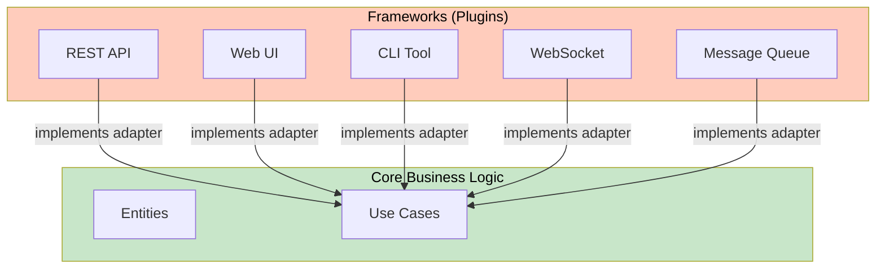
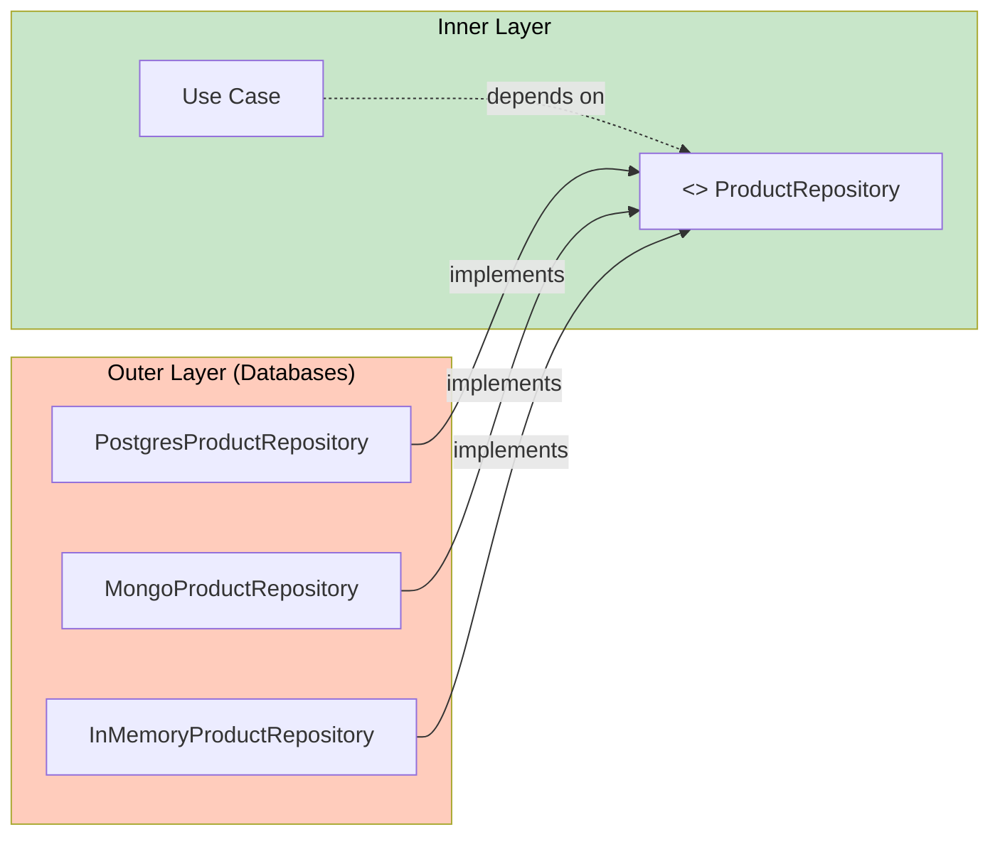
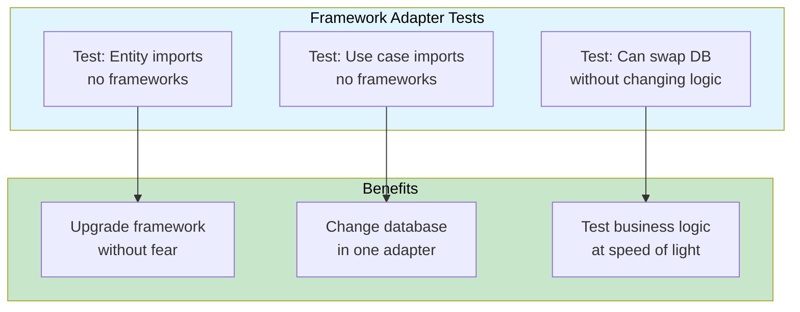

# Frameworks & Externalities

In Clean Architecture, frameworks and external tools are **details** — they are the outermost layer, not the foundation. This lesson shows how to keep your business logic framework-agnostic while still leveraging powerful tools.

> [!NOTE]
> Frameworks are tools, not architectures. A good architecture allows you to use a framework without being coupled to it. You should be able to swap Flask for FastAPI without changing a single line of business logic.

## Frameworks as Plugins



Each framework becomes a **plugin** that communicates with the business logic through adapters. The business logic doesn't know — or care — which framework is being used.

## Framework Coupling: Before and After

```python
# BEFORE: Tightly coupled to Flask
from flask import Flask, request, jsonify
from flask_sqlalchemy import SQLAlchemy

app = Flask(__name__)
db = SQLAlchemy(app)


class UserModel(db.Model):
    id = db.Column(db.Integer, primary_key=True)
    name = db.Column(db.String(80))
    email = db.Column(db.String(120))


@app.route("/users", methods=["POST"])
def create_user():
    data = request.get_json()
    
    # Business logic mixed with framework code
    if len(data["name"]) < 3:
        return jsonify({"error": "Name too short"}), 400
    
    user = UserModel(name=data["name"], email=data["email"])
    db.session.add(user)
    db.session.commit()
    
    return jsonify({"id": user.id, "name": user.name}), 201


# AFTER: Flask is just a plugin
# --- entities.py (pure business logic) ---
from dataclasses import dataclass

@dataclass
class User:
    user_id: str
    name: str
    email: str
    
    def validate(self) -> None:
        if len(self.name) < 3:
            raise ValueError("Name too short")
        if "@" not in self.email:
            raise ValueError("Invalid email")


# --- use_cases.py (pure business logic) ---
class CreateUserUseCase:
    def __init__(self, repo: "UserRepository"):
        self._repo = repo
    
    def execute(self, name: str, email: str) -> User:
        user = User(user_id=self._generate_id(), name=name, email=email)
        user.validate()
        self._repo.save(user)
        return user
    
    def _generate_id(self) -> str:
        import uuid
        return str(uuid.uuid4())


# --- flask_adapter.py (framework-specific adapter) ---
from flask import Blueprint, request, jsonify
from .composition_root import create_user_use_case

users_bp = Blueprint("users", __name__)

@users_bp.route("/users", methods=["POST"])
def create_user():
    use_case = create_user_use_case()
    data = request.get_json()
    
    try:
        user = use_case.execute(name=data["name"], email=data["email"])
        return jsonify({"id": user.user_id, "name": user.name, "email": user.email}), 201
    except ValueError as e:
        return jsonify({"error": str(e)}), 400
```

> [!WARNING]
> When framework decorators (`@app.route`, `@db.Model`) appear in your business logic, you have coupled your system to that framework. Always keep framework decorators in the adapter layer.

## The Framework Trap

| Trap | Symptom | Consequence |
|------|---------|-------------|
| Framework-first design | Start with `Flask(__name__)` | Business logic is an afterthought |
| ORM models as entities | `class User(db.Model)` | Cannot test without database |
| Decorator pollution | `@app.route` in business logic | Framework change = rewrite |
| Configuration coupling | `app.config` everywhere | Framework-specific setup leaks |
| Extension coupling | `flask-mail`, `flask-login` | Tied to Flask ecosystem |

```python
# Trap: Using ORM models as domain entities
# You cannot create a User without a database connection!

# myapp/models.py
from django.db import models

class Order(models.Model):
    user = models.ForeignKey(User, on_delete=models.CASCADE)
    total = models.DecimalField(max_digits=10, decimal_places=2)
    status = models.CharField(max_length=20)

    def confirm(self):
        self.status = "confirmed"
        self.save()  # Implicit database access!

# Clean: separate entity from ORM model
# domain/entities.py
@dataclass
class Order:
    order_id: str
    total: float
    status: str = "pending"

    def confirm(self) -> None:
        self.status = "confirmed"

# infrastructure/orm_models.py
from django.db import models

class OrderModel(models.Model):
    order_id = models.CharField(max_length=36, unique=True)
    total = models.DecimalField(max_digits=10, decimal_places=2)
    status = models.CharField(max_length=20)

# infrastructure/adapters.py
class DjangoOrderRepository(OrderRepository):
    def save(self, order: Order) -> None:
        OrderModel.objects.update_or_create(
            order_id=order.order_id,
            defaults={"total": order.total, "status": order.status},
        )
```

## Database as a Detail

```python
from abc import ABC, abstractmethod
from dataclasses import dataclass
from typing import Optional


# --- Entity ---

@dataclass
class Product:
    product_id: str
    name: str
    price: float
    stock: int

    def reduce_stock(self, quantity: int) -> None:
        if quantity > self.stock:
            raise ValueError("Insufficient stock")
        self.stock -= quantity


# --- Repository Interface (inner) ---

class ProductRepository(ABC):
    @abstractmethod
    def save(self, product: Product) -> None:
        ...

    @abstractmethod
    def find_by_id(self, product_id: str) -> Optional[Product]:
        ...

    @abstractmethod
    def find_all(self) -> list[Product]:
        ...


# --- Concrete: PostgreSQL (outer) ---

class PostgresProductRepository(ProductRepository):
    def __init__(self, connection_string: str):
        self._conn_string = connection_string

    def save(self, product: Product) -> None:
        import psycopg2
        conn = psycopg2.connect(self._conn_string)
        try:
            with conn.cursor() as cur:
                cur.execute(
                    "INSERT INTO products (id, name, price, stock) VALUES (%s, %s, %s, %s) "
                    "ON CONFLICT (id) DO UPDATE SET name=EXCLUDED.name, price=EXCLUDED.price, stock=EXCLUDED.stock",
                    (product.product_id, product.name, product.price, product.stock),
                )
            conn.commit()
        finally:
            conn.close()

    def find_by_id(self, product_id: str) -> Optional[Product]:
        import psycopg2
        conn = psycopg2.connect(self._conn_string)
        try:
            with conn.cursor() as cur:
                cur.execute("SELECT id, name, price, stock FROM products WHERE id = %s", (product_id,))
                row = cur.fetchone()
                if row:
                    return Product(product_id=row[0], name=row[1], price=row[2], stock=row[3])
                return None
        finally:
            conn.close()

    def find_all(self) -> list[Product]:
        import psycopg2
        conn = psycopg2.connect(self._conn_string)
        try:
            with conn.cursor() as cur:
                cur.execute("SELECT id, name, price, stock FROM products")
                return [Product(product_id=r[0], name=r[1], price=r[2], stock=r[3]) for r in cur.fetchall()]
        finally:
            conn.close()


# --- Concrete: MongoDB (outer) ---

class MongoProductRepository(ProductRepository):
    def __init__(self, connection_string: str, db_name: str):
        from pymongo import MongoClient
        self._collection = MongoClient(connection_string)[db_name]["products"]

    def save(self, product: Product) -> None:
        self._collection.replace_one(
            {"_id": product.product_id},
            {"_id": product.product_id, "name": product.name, "price": product.price, "stock": product.stock},
            upsert=True,
        )

    def find_by_id(self, product_id: str) -> Optional[Product]:
        doc = self._collection.find_one({"_id": product_id})
        if doc:
            return Product(product_id=doc["_id"], name=doc["name"], price=doc["price"], stock=doc["stock"])
        return None

    def find_all(self) -> list[Product]:
        return [
            Product(product_id=doc["_id"], name=doc["name"], price=doc["price"], stock=doc["stock"])
            for doc in self._collection.find()
        ]


# --- Concrete: In-Memory (testing) ---

class InMemoryProductRepository(ProductRepository):
    def __init__(self):
        self._products: dict[str, Product] = {}

    def save(self, product: Product) -> None:
        self._products[product.product_id] = product

    def find_by_id(self, product_id: str) -> Optional[Product]:
        return self._products.get(product_id)

    def find_all(self) -> list[Product]:
        return list(self._products.values())
```



## Web Frameworks as Details

```python
# --- fastapi_adapter.py ---

from fastapi import FastAPI, HTTPException
from pydantic import BaseModel
from .composition_root import create_order_use_case

app = FastAPI()


class OrderRequest(BaseModel):
    customer_id: str
    items: list[dict]
    coupon_code: str | None = None


@app.post("/orders")
def place_order(request: OrderRequest):
    use_case = create_order_use_case()
    try:
        result = use_case.execute(
            customer_id=request.customer_id,
            items=request.items,
            coupon_code=request.coupon_code,
        )
        return result
    except ValueError as e:
        raise HTTPException(status_code=400, detail=str(e))


# --- flask_adapter.py ---

from flask import Blueprint, request, jsonify
from .composition_root import create_order_use_case

orders_bp = Blueprint("orders", __name__)


@orders_bp.route("/orders", methods=["POST"])
def place_order():
    use_case = create_order_use_case()
    data = request.get_json()
    try:
        result = use_case.execute(
            customer_id=data["customer_id"],
            items=data["items"],
            coupon_code=data.get("coupon_code"),
        )
        return jsonify(result), 201
    except ValueError as e:
        return jsonify({"error": str(e)}), 400
```

> [!TIP]
> The use case is identical in both examples. Only the adapter changes. This is the power of treating frameworks as details.

## Configuration as a Detail

Configuration should be injected, not imported. The inner layers should never read from environment variables directly.

```python
# BAD: Inner layer reads configuration
import os

class UseCase:
    def execute(self) -> None:
        db_url = os.environ["DATABASE_URL"]  # Inner layer knows about env vars!
        api_key = os.environ["STRIPE_API_KEY"]
        ...


# GOOD: Configuration is injected from the outside

from dataclasses import dataclass


@dataclass
class AppConfig:
    database_url: str
    stripe_api_key: str
    smtp_host: str
    smtp_port: int
    log_level: str


# Composition root reads config and injects it
def create_app_config() -> AppConfig:
    import os
    return AppConfig(
        database_url=os.environ["DATABASE_URL"],
        stripe_api_key=os.environ["STRIPE_API_KEY"],
        smtp_host=os.environ.get("SMTP_HOST", "localhost"),
        smtp_port=int(os.environ.get("SMTP_PORT", "25")),
        log_level=os.environ.get("LOG_LEVEL", "INFO"),
    )


class UseCase:
    def __init__(self, config: AppConfig, repo: ProductRepository):
        self._config = config
        self._repo = repo

    def execute(self) -> None:
        # Use self._config.database_url if needed
        # But really — use cases shouldn't need config directly
        pass
```

## Email as a Detail

```python
from abc import ABC, abstractmethod


# --- Inner layer: Interface ---

class EmailSender(ABC):
    @abstractmethod
    def send(self, to: str, subject: str, body: str) -> None:
        ...


# --- Outer layer: SMTP Implementation ---

class SmtpEmailSender(EmailSender):
    def __init__(self, host: str, port: int, username: str, password: str):
        self._host = host
        self._port = port
        self._username = username
        self._password = password

    def send(self, to: str, subject: str, body: str) -> None:
        import smtplib
        from email.mime.text import MIMEText

        msg = MIMEText(body)
        msg["Subject"] = subject
        msg["To"] = to
        msg["From"] = self._username

        with smtplib.SMTP(self._host, self._port) as server:
            server.starttls()
            server.login(self._username, self._password)
            server.send_message(msg)


# --- Outer layer: SendGrid Implementation ---

class SendGridEmailSender(EmailSender):
    def __init__(self, api_key: str):
        self._api_key = api_key

    def send(self, to: str, subject: str, body: str) -> None:
        from sendgrid import SendGridAPIClient
        from sendgrid.helpers.mail import Mail

        message = Mail(
            from_email="noreply@example.com",
            to_emails=to,
            subject=subject,
            plain_text_content=body,
        )
        sg = SendGridAPIClient(self._api_key)
        sg.send(message)


# --- Testing: Fake Implementation ---

class FakeEmailSender(EmailSender):
    def __init__(self):
        self.sent_emails: list[dict] = []

    def send(self, to: str, subject: str, body: str) -> None:
        self.sent_emails.append({"to": to, "subject": subject, "body": body})
```

## Async Frameworks as Details

```python
# --- asyncio adapter ---

import asyncio
from abc import ABC, abstractmethod


# Sync use case (doesn't know about async)
class NotifyUserUseCase:
    def __init__(self, email_sender: EmailSender):
        self._email_sender = email_sender

    def execute(self, user_email: str, message: str) -> None:
        self._email_sender.send(
            to=user_email,
            subject="Notification",
            body=message,
        )


# Adapter makes sync use case work with async framework
class AsyncEmailSender(EmailSender):
    def __init__(self, smtp_host: str):
        self._host = smtp_host

    def send(self, to: str, subject: str, body: str) -> None:
        # Use asyncio.run or thread pool in the adapter
        import asyncio
        asyncio.create_task(self._async_send(to, subject, body))

    async def _async_send(self, to: str, subject: str, body: str) -> None:
        import aiosmtplib
        await aiosmtplib.send(
            body,
            hostname=self._host,
            recipients=[to],
            subject=subject,
        )


# Or wrap the use case for async controllers
class AsyncNotifyUserController:
    def __init__(self, use_case: NotifyUserUseCase):
        self._use_case = use_case

    async def handle(self, user_email: str, message: str) -> dict:
        # Run the sync use case in a thread pool
        await asyncio.to_thread(
            self._use_case.execute, user_email, message
        )
        return {"status": 200, "body": {"sent": True}}
```

> [!NOTE]
> Your business logic should have **no opinion** about whether it runs synchronously or asynchronously. The adapter handles the async boundary.

## Logging as a Detail

```python
from abc import ABC, abstractmethod
from enum import Enum


class LogLevel(Enum):
    DEBUG = "DEBUG"
    INFO = "INFO"
    WARNING = "WARNING"
    ERROR = "ERROR"


class Logger(ABC):
    @abstractmethod
    def log(self, level: LogLevel, message: str) -> None:
        ...

    def debug(self, message: str) -> None:
        self.log(LogLevel.DEBUG, message)

    def info(self, message: str) -> None:
        self.log(LogLevel.INFO, message)

    def warning(self, message: str) -> None:
        self.log(LogLevel.WARNING, message)

    def error(self, message: str) -> None:
        self.log(LogLevel.ERROR, message)


class StdoutLogger(Logger):
    def __init__(self, min_level: LogLevel = LogLevel.INFO):
        self._min_level = min_level

    def log(self, level: LogLevel, message: str) -> None:
        if level.value >= self._min_level.value:
            print(f"[{level.value}] {message}")


class PythonLogger(Logger):
    """Adapter for Python's standard logging module."""
    
    def __init__(self, name: str = "app"):
        import logging
        self._logger = logging.getLogger(name)

    def log(self, level: LogLevel, message: str) -> None:
        mapping = {
            LogLevel.DEBUG: logging.DEBUG,
            LogLevel.INFO: logging.INFO,
            LogLevel.WARNING: logging.WARNING,
            LogLevel.ERROR: logging.ERROR,
        }
        self._logger.log(mapping[level], message)


class UseCase:
    def __init__(self, repo, logger: Logger):
        self._repo = repo
        self._logger = logger

    def execute(self) -> None:
        self._logger.info("Starting use case execution")
        try:
            result = self._repo.find_all()
            self._logger.debug(f"Found {len(result)} items")
            return result
        except Exception as e:
            self._logger.error(f"Failed: {e}")
            raise
```

## Testing Framework Decisions

```python
# Test that the framework doesn't constrain the architecture

def test_use_case_has_no_framework_imports():
    import ast
    import os
    
    use_case_path = "src/use_cases/place_order.py"
    with open(use_case_path) as f:
        tree = ast.parse(f.read())
    
    framework_imports = {"flask", "fastapi", "django", "sqlalchemy", "psycopg2"}
    for node in ast.walk(tree):
        if isinstance(node, ast.Import):
            for alias in node.names:
                root = alias.name.split(".")[0]
                assert root not in framework_imports, \
                    f"Use case imports framework: {alias.name}"
        elif isinstance(node, ast.ImportFrom):
            root = node.module.split(".")[0] if node.module else ""
            assert root not in framework_imports, \
                f"Use case imports framework: {node.module}"


def test_entity_has_orm_free():
    """Entities should not inherit from ORM base classes."""
    entity_path = "src/entities/order.py"
    with open(entity_path) as f:
        content = f.read()
    
    assert "db.Model" not in content
    assert "models.Model" not in content
    assert "Base" not in content or "sqlalchemy" not in content
```



## Real-World Framework Migration

```python
# SCENARIO: Migrating from Flask to FastAPI
# The ONLY files that change:

# BEFORE: flask_adapter.py
from flask import Blueprint, request, jsonify

orders_bp = Blueprint("orders", __name__)

@orders_bp.route("/orders/<order_id>", methods=["GET"])
def get_order(order_id):
    use_case = get_order_use_case()
    try:
        result = use_case.execute(order_id=order_id)
        return jsonify(result), 200
    except ValueError as e:
        return jsonify({"error": str(e)}), 404


# AFTER: fastapi_adapter.py
from fastapi import APIRouter, HTTPException

router = APIRouter()

@router.get("/orders/{order_id}")
def get_order(order_id: str):
    use_case = get_order_use_case()
    try:
        result = use_case.execute(order_id=order_id)
        return result
    except ValueError as e:
        raise HTTPException(status_code=404, detail=str(e))


# Everything else remains the same:
# - use_cases/get_order.py  → UNCHANGED
# - entities/order.py        → UNCHANGED
# - repositories/*.py        → UNCHANGED
# - tests/*.py                → UNCHANGED
```

> [!SUCCESS]
> When frameworks are treated as details, migrating from Flask to FastAPI (or any other framework) is a matter of rewriting one adapter file — not the entire application.

## Framework Selection Checklist

| Criteria | Question | Why It Matters |
|----------|----------|----------------|
| Coupling | Does this framework force my entities to inherit from it? | ORM coupling = untestable entities |
| Testability | Can I test my logic without running the framework? | Slow tests = skipped tests |
| Swap cost | How many files change if I switch frameworks? | Fewer = better architecture |
| Community | Will this framework be maintained in 5 years? | Abandoned framework = rewrite |
| Fit | Does this framework solve the right problem? | Wrong tool = wrong architecture |

> [!WARNING]
> Avoid "framework-first" development. Never start a project by running `npx create-react-app` or `django-admin startproject`. Start with the business logic, then add the framework as a plugin.

## Practice Exercises

1. **Framework audit**: Examine a project you work on. List every file that would need to change if you swapped the web framework. Which layers are coupled?

2. **Swap a database**: Take a SQLAlchemy-based repository and implement a MongoDB version. The use case should not change.

3. **Abstract an email service**: You have `send_email(to, subject, body)` using `smtplib`. Create an `EmailSender` interface and two implementations: `SmtpSender` and `SendGridSender`.

4. **Config injection**: Refactor a use case that reads `os.environ["API_KEY"]` directly. Inject the API key through the constructor instead.

5. **Framework adapter**: Create a FastAPI adapter and a Flask adapter for the same `CreateProductUseCase`. Show they share the same use case import.

6. **ORM decoupling**: Take a Django model that mixes entity logic (`class Order(models.Model)` with business methods) and separate it into an entity + repository pair.

7. **Async boundary**: Create a use case that calls a `Logger` interface. Provide `SyncLogger` and `AsyncLogger` implementations. Show how the use case doesn't change.

8. **Migration plan**: Write a step-by-step plan to migrate a Django monolith to Clean Architecture. List which files are created, which are modified, and which stay the same.

> [!SUCCESS]
> Frameworks are tools, not foundations. When you treat them as details, your architecture survives framework upgrades, migrations, and industry shifts.
