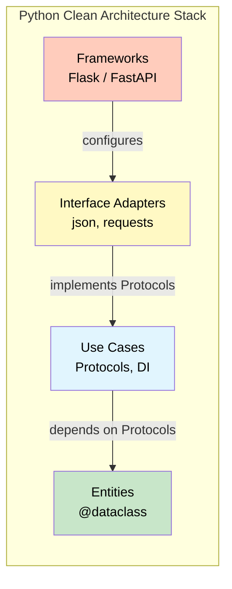

# Clean Architecture in Python

Python is an excellent language for Clean Architecture. Its dynamic typing, Protocol classes, and simple syntax make it easy to define boundaries, invert dependencies, and keep business logic pure.

> [!NOTE]
> Python's philosophy aligns naturally with Clean Architecture: simplicity, readability, and practicality. You don't need a heavyweight DI container — Python's duck typing and dataclasses are enough.

## Project Structure

A Clean Architecture Python project follows a consistent directory layout:

```
my_project/
  src/
    entities/              # Enterprise business rules
      __init__.py
      order.py
      customer.py
      product.py
    
    use_cases/             # Application business rules
      __init__.py
      place_order.py
      cancel_order.py
      interfaces.py        # Repository & gateway protocols
    
    interface_adapters/    # Adapters
      __init__.py
      controllers/
        order_controller.py
      presenters/
        order_presenter.py
      repositories/
        postgres_order_repo.py
        in_memory_order_repo.py
      gateways/
        stripe_payment.py
    
    frameworks/            # Framework setup
      __init__.py
      web/
        flask_app.py
        fastapi_app.py
      database/
        postgres_connection.py
      config.py
    
    main.py                # Composition root
  
  tests/
    test_entities/
    test_use_cases/
    test_adapters/
  
  requirements.txt
  pyproject.toml
```

> [!TIP]
> Keep the directory structure flat and descriptive. Each folder corresponds to a Clean Architecture layer. The `interfaces.py` file in the use cases layer defines the boundaries that outer layers implement.

## Using Protocols for Boundaries

Python's `typing.Protocol` (PEP 544) provides structural subtyping — you don't need explicit inheritance:

```python
from typing import Protocol, runtime_checkable


# Define the protocol (interface) in the inner layer
@runtime_checkable
class OrderRepository(Protocol):
    def save(self, order: "Order") -> None:
        ...

    def find_by_id(self, order_id: str) -> "Order | None":
        ...

    def find_by_customer(self, customer_id: str) -> list["Order"]:
        ...


# The use case depends on the Protocol
class CancelOrderUseCase:
    def __init__(self, repo: OrderRepository):
        self._repo = repo

    def execute(self, order_id: str) -> None:
        order = self._repo.find_by_id(order_id)
        if order is None:
            raise ValueError("Order not found")
        order.cancel()
        self._repo.save(order)


# Outer layer implementation — no explicit inheritance
class PostgresOrderRepository:
    def save(self, order: "Order") -> None:
        ...

    def find_by_id(self, order_id: str) -> "Order | None":
        ...

    def find_by_customer(self, customer_id: str) -> list["Order"]:
        ...


# Testing — also conforms to the Protocol
class FakeOrderRepository:
    def __init__(self):
        self._orders: dict[str, "Order"] = {}

    def save(self, order: "Order") -> None:
        self._orders[order.order_id] = order

    def find_by_id(self, order_id: str) -> "Order | None":
        return self._orders.get(order_id)

    def find_by_customer(self, customer_id: str) -> list["Order"]:
        return [o for o in self._orders.values() if o.customer.customer_id == customer_id]
```

> [!NOTE]
> Unlike ABCs, Protocols use **structural subtyping** — an object is considered to implement the protocol if it has the right methods, regardless of its class hierarchy. This is more Pythonic and flexible.

## Dataclasses for DTOs and Entities

Dataclasses are perfect for entities and data transfer objects:

```python
from dataclasses import dataclass, field
from decimal import Decimal
from enum import Enum, auto
from typing import List, Optional
from datetime import datetime


class OrderStatus(Enum):
    PENDING = auto()
    CONFIRMED = auto()
    SHIPPED = auto()
    DELIVERED = auto()
    CANCELLED = auto()


@dataclass
class Address:
    street: str
    city: str
    state: str
    zip_code: str
    country: str

    def full_address(self) -> str:
        return f"{self.street}, {self.city}, {self.state} {self.zip_code}, {self.country}"


@dataclass
class Customer:
    customer_id: str
    name: str
    email: str
    address: Optional[Address] = None


@dataclass
class OrderItem:
    product_id: str
    product_name: str
    quantity: int
    unit_price: Decimal

    def total(self) -> Decimal:
        return Decimal(str(self.quantity)) * self.unit_price


@dataclass
class Order:
    order_id: str
    customer: Customer
    items: List[OrderItem] = field(default_factory=list)
    status: OrderStatus = OrderStatus.PENDING
    created_at: datetime = field(default_factory=datetime.now)
    _total_cache: Optional[Decimal] = field(default=None, repr=False)

    def add_item(self, item: OrderItem) -> None:
        if self.status != OrderStatus.PENDING:
            raise ValueError("Cannot modify a non-pending order")
        self.items.append(item)
        self._total_cache = None

    def remove_item(self, product_id: str) -> None:
        if self.status != OrderStatus.PENDING:
            raise ValueError("Cannot modify a non-pending order")
        self.items = [i for i in self.items if i.product_id != product_id]
        self._total_cache = None

    def total(self) -> Decimal:
        if self._total_cache is None:
            self._total_cache = sum(
                (item.total() for item in self.items),
                Decimal("0"),
            )
        return self._total_cache

    def confirm(self) -> None:
        if self.status != OrderStatus.PENDING:
            raise ValueError(f"Cannot confirm order in {self.status.name} state")
        if not self.items:
            raise ValueError("Cannot confirm an empty order")
        self.status = OrderStatus.CONFIRMED

    def cancel(self) -> None:
        if self.status in (OrderStatus.SHIPPED, OrderStatus.DELIVERED):
            raise ValueError(f"Cannot cancel order in {self.status.name} state")
        self.status = OrderStatus.CANCELLED


# Input/Output DTOs
@dataclass
class PlaceOrderInput:
    customer_id: str
    items: List[dict]
    coupon_code: Optional[str] = None


@dataclass
class PlaceOrderOutput:
    order_id: str
    total: float
    status: str
    item_count: int
    created_at: str
```

## Dependency Injection Without a Framework

Python doesn't need a DI framework — manual injection is clean and explicit:

```python
# --- composition_root.py ---
# This is the only place where concrete classes are instantiated

def create_place_order_use_case() -> "PlaceOrderUseCase":
    order_repo = PostgresOrderRepository(
        connection_string="postgresql://localhost:5432/shop"
    )
    customer_repo = PostgresCustomerRepository(
        connection_string="postgresql://localhost:5432/shop"
    )
    product_repo = PostgresProductRepository(
        connection_string="postgresql://localhost:5432/shop"
    )

    payment_gateway = StripePaymentGateway(api_key="sk_test_...")
    notification = EmailNotificationService(smtp_host="smtp.example.com")

    return PlaceOrderUseCase(
        customer_repo=customer_repo,
        product_repo=product_repo,
        order_repo=order_repo,
        payment_gateway=payment_gateway,
        notification_service=notification,
    )


def create_test_place_order_use_case() -> "PlaceOrderUseCase":
    return PlaceOrderUseCase(
        customer_repo=InMemoryCustomerRepository(),
        product_repo=InMemoryProductRepository(),
        order_repo=InMemoryOrderRepository(),
        payment_gateway=FakePaymentGateway(),
        notification_service=FakeNotificationService(),
    )


# --- main.py ---

def main() -> None:
    use_case = create_place_order_use_case()
    controller = OrderController(use_case=use_case)
    app = create_flask_app(controller=controller)
    app.run(host="0.0.0.0", port=8000)


if __name__ == "__main__":
    main()
```

```mermaid
flowchart TD
    subgraph Composition["Composition Root"]
        CR[create_app()]
    end
    subgraph Instantiates["Creates"]
        ORepo[PostgresOrderRepository]
        PRepo[PostgresProductRepository]
        CRepo[PostgresCustomerRepository]
        PGW[StripePaymentGateway]
        NS[EmailNotificationService]
    end
    subgraph Injects["Injects Into"]
        UC[PlaceOrderUseCase]
    end
    subgraph Exposes["Exposed Via"]
        CTRL[OrderController]
        APP[Flask App]
    end
    
    CR --> ORepo
    CR --> PRepo
    CR --> CRepo
    CR --> PGW
    CR --> NS
    CR --> UC
    ORepo --> UC
    PRepo --> UC
    CRepo --> UC
    PGW --> UC
    NS --> UC
    UC --> CTRL
    CTRL --> APP
    
    style Composition fill:#c8e6c9,color:#000
    style Instantiates fill:#e1f5fe,color:#000
    style Injects fill:#fff9c4,color:#000
```

## Use Case with Complete Boundaries

Here's a complete, production-ready use case:

```python
from dataclasses import dataclass
from decimal import Decimal
from typing import Protocol, Optional
import uuid
from datetime import datetime


# --- Protocols (defined in use_cases/) ---

class CustomerRepository(Protocol):
    def find_by_id(self, customer_id: str) -> Optional["Customer"]: ...
    def save(self, customer: "Customer") -> None: ...


class ProductRepository(Protocol):
    def find_by_id(self, product_id: str) -> Optional["Product"]: ...


class OrderRepository(Protocol):
    def save(self, order: "Order") -> None: ...
    def find_by_id(self, order_id: str) -> Optional["Order"]: ...


class PaymentGateway(Protocol):
    def charge(self, customer_email: str, amount: Decimal) -> str: ...
    def refund(self, transaction_id: str) -> Decimal: ...


class NotificationService(Protocol):
    def send_order_confirmation(self, email: str, order_id: str) -> None: ...


# --- Input / Output DTOs ---

@dataclass
class PlaceOrderInput:
    customer_id: str
    items: list[dict]
    coupon_code: Optional[str] = None


@dataclass
class PlaceOrderOutput:
    order_id: str
    total: float
    status: str
    item_count: int
    transaction_id: str
    created_at: str


# --- The Use Case ---

class PlaceOrderUseCase:
    def __init__(
        self,
        customer_repo: CustomerRepository,
        product_repo: ProductRepository,
        order_repo: OrderRepository,
        payment_gateway: PaymentGateway,
        notification_service: NotificationService,
    ):
        self._customer_repo = customer_repo
        self._product_repo = product_repo
        self._order_repo = order_repo
        self._payment = payment_gateway
        self._notification = notification_service

    def execute(self, input_dto: PlaceOrderInput) -> PlaceOrderOutput:
        customer = self._customer_repo.find_by_id(input_dto.customer_id)
        if customer is None:
            raise ValueError(f"Customer '{input_dto.customer_id}' not found")

        order_id = str(uuid.uuid4())
        order = Order(order_id=order_id, customer=customer)

        for item_data in input_dto.items:
            product = self._product_repo.find_by_id(item_data["product_id"])
            if product is None:
                raise ValueError(f"Product '{item_data['product_id']}' not found")

            item = OrderItem(
                product_id=product.product_id,
                product_name=product.name,
                quantity=item_data["quantity"],
                unit_price=product.price,
            )
            order.add_item(item)

        order.confirm()
        total = order.total()

        txn_id = self._payment.charge(customer.email, total)
        self._order_repo.save(order)
        self._notification.send_order_confirmation(customer.email, order_id)

        return PlaceOrderOutput(
            order_id=order_id,
            total=float(total),
            status=order.status.name,
            item_count=len(order.items),
            transaction_id=txn_id,
            created_at=order.created_at.isoformat(),
        )
```


## The Adapter Layer in Python

```python
# --- controllers/order_controller.py ---

import json


class OrderController:
    def __init__(self, place_order_use_case: "PlaceOrderUseCase"):
        self._use_case = place_order_use_case

    def handle_place_order(self, request: dict) -> dict:
        try:
            body = self._parse_body(request)
            self._validate_body(body)

            input_dto = PlaceOrderInput(
                customer_id=body["customer_id"],
                items=body["items"],
                coupon_code=body.get("coupon_code"),
            )

            output = self._use_case.execute(input_dto)

            return {
                "status": 201,
                "body": {
                    "success": True,
                    "data": {
                        "order_id": output.order_id,
                        "total": output.total,
                        "status": output.status,
                        "item_count": output.item_count,
                        "transaction_id": output.transaction_id,
                        "created_at": output.created_at,
                    },
                },
            }
        except ValueError as e:
            return {"status": 400, "body": {"success": False, "error": str(e)}}
        except Exception:
            return {"status": 500, "body": {"success": False, "error": "Internal error"}}

    def _parse_body(self, request: dict) -> dict:
        raw = request.get("body", "{}")
        if isinstance(raw, str):
            return json.loads(raw)
        return raw

    def _validate_body(self, body: dict) -> None:
        if "customer_id" not in body:
            raise ValueError("Field 'customer_id' is required")
        if "items" not in body or not isinstance(body["items"], list) or len(body["items"]) == 0:
            raise ValueError("Field 'items' must be a non-empty list")
        for item in body["items"]:
            if "product_id" not in item:
                raise ValueError("Each item must have 'product_id'")
            if "quantity" not in item:
                raise ValueError("Each item must have 'quantity'")
```


## Testing Patterns in Python

```python
import pytest
from decimal import Decimal


# --- Fixtures ---

@pytest.fixture
def customer() -> Customer:
    return Customer(
        customer_id="CUST-001",
        name="Alice Johnson",
        email="alice@example.com",
    )


@pytest.fixture
def sample_items() -> list[OrderItem]:
    return [
        OrderItem(product_id="P1", product_name="Widget", quantity=2, unit_price=Decimal("10.00")),
        OrderItem(product_id="P2", product_name="Gadget", quantity=1, unit_price=Decimal("25.00")),
    ]


@pytest.fixture
def order(customer: Customer, sample_items: list[OrderItem]) -> Order:
    return Order(
        order_id="ORD-001",
        customer=customer,
        items=sample_items,
    )


# --- Entity Tests ---

class TestOrderEntity:
    def test_calculate_total(self, order: Order):
        assert order.total() == Decimal("45.00")

    def test_confirm_sets_status(self, order: Order):
        order.confirm()
        assert order.status == OrderStatus.CONFIRMED

    def test_confirm_empty_order_fails(self, customer: Customer):
        empty_order = Order(order_id="ORD-002", customer=customer)
        with pytest.raises(ValueError, match="empty"):
            empty_order.confirm()

    def test_cancel_pending_order(self, order: Order):
        order.cancel()
        assert order.status == OrderStatus.CANCELLED

    def test_cancel_shipped_order_fails(self, order: Order):
        order.status = OrderStatus.SHIPPED
        with pytest.raises(ValueError, match="cancel"):
            order.cancel()

    def test_add_item_to_confirmed_order_fails(self, order: Order):
        order.confirm()
        with pytest.raises(ValueError, match="pending"):
            order.add_item(OrderItem(product_id="P3", product_name="X", quantity=1, unit_price=Decimal("1")))


# --- Use Case Tests ---

class TestPlaceOrderUseCase:
    @pytest.fixture
    def use_case(self):
        customer_repo = InMemoryCustomerRepository()
        customer_repo.save(Customer(customer_id="C1", name="Alice", email="a@test.com"))

        product_repo = InMemoryProductRepository()
        product_repo.save(Product(product_id="P1", name="Widget", price=Decimal("10.00"), stock=10))
        product_repo.save(Product(product_id="P2", name="Gadget", price=Decimal("25.00"), stock=5))

        return PlaceOrderUseCase(
            customer_repo=customer_repo,
            product_repo=product_repo,
            order_repo=InMemoryOrderRepository(),
            payment_gateway=FakePaymentGateway(),
            notification_service=FakeNotificationService(),
        )

    def test_place_order_success(self, use_case):
        output = use_case.execute(PlaceOrderInput(
            customer_id="C1",
            items=[{"product_id": "P1", "quantity": 2}, {"product_id": "P2", "quantity": 1}],
        ))
        assert output.status == "CONFIRMED"
        assert output.total == 45.0
        assert output.item_count == 2
        assert output.transaction_id.startswith("txn_")

    def test_place_order_invalid_customer(self, use_case):
        with pytest.raises(ValueError, match="not found"):
            use_case.execute(PlaceOrderInput(customer_id="FAKE", items=[]))
```


## Python-Specific Patterns

### Context Managers for Boundaries

```python
from contextlib import contextmanager
from typing import Iterator


class UnitOfWork:
    def __init__(self, connection_string: str):
        self._conn_string = connection_string

    @contextmanager
    def transaction(self) -> Iterator["Connection"]:
        import psycopg2
        conn = psycopg2.connect(self._conn_string)
        try:
            yield conn
            conn.commit()
        except Exception:
            conn.rollback()
            raise
        finally:
            conn.close()


class PostgresOrderRepository:
    def __init__(self, uow: UnitOfWork):
        self._uow = uow

    def save(self, order: "Order") -> None:
        with self._uow.transaction() as conn:
            with conn.cursor() as cur:
                cur.execute("INSERT INTO orders ...", (...))
```

### Type Aliases for Clarity

```python
from typing import TypeAlias
from decimal import Decimal

JSON: TypeAlias = dict[str, "JSON"] | list["JSON"] | str | int | float | bool | None
OrderID: TypeAlias = str
CustomerID: TypeAlias = str
Money: TypeAlias = Decimal
Email: TypeAlias = str

class PaymentGateway(Protocol):
    def charge(self, customer_email: Email, amount: Money) -> str: ...
    def refund(self, transaction_id: str) -> Money: ...
```

### Custom Exceptions

```python
class DomainError(Exception):
    pass


class EntityNotFoundError(DomainError):
    def __init__(self, entity_type: str, entity_id: str):
        self.entity_type = entity_type
        self.entity_id = entity_id
        super().__init__(f"{entity_type} '{entity_id}' not found")


class InvalidOperationError(DomainError):
    def __init__(self, operation: str, reason: str):
        self.operation = operation
        self.reason = reason
        super().__init__(f"Cannot {operation}: {reason}")


# Usage in use case
class GetProductUseCase:
    def __init__(self, repo: ProductRepository):
        self._repo = repo

    def execute(self, product_id: str) -> Product:
        product = self._repo.find_by_id(product_id)
        if product is None:
            raise EntityNotFoundError("Product", product_id)
        return product
```

### Pydantic for DTO Validation

```python
from pydantic import BaseModel, Field, field_validator
from typing import List, Optional


class PlaceOrderInput(BaseModel):
    customer_id: str = Field(..., min_length=1)
    items: List[dict]
    coupon_code: Optional[str] = None

    @field_validator("items")
    @classmethod
    def validate_items(cls, v: List[dict]) -> List[dict]:
        if not v:
            raise ValueError("At least one item required")
        for item in v:
            if "product_id" not in item:
                raise ValueError("Each item needs product_id")
            if "quantity" not in item or item["quantity"] < 1:
                raise ValueError("Each item needs quantity >= 1")
        return v


class PlaceOrderOutput(BaseModel):
    order_id: str
    total: float
    status: str
    item_count: int
    transaction_id: str
    created_at: str
```

## Performance Considerations

| Concern | Python Solution | Impact |
|---------|---------------|--------|
| Boundary overhead | Protocol calls | Minimal — Python dynamic dispatch |
| DI container | Manual injection | Zero overhead |
| DTO creation | Dataclass instantiation | Negligible |
| Repository pattern | SQL vs ORM | ORM adds 10-30% latency |
| Testing | In-memory repos | 100x faster than database |

> [!WARNING]
> Don't over-abstract. Every boundary has a cost. Start with direct dependencies and extract interfaces only when you need them. Premature abstraction is as harmful as no abstraction.

## Complete Project Skeleton Generator

```python
#!/usr/bin/env python3
"""Generate a Clean Architecture Python project skeleton."""

import os
import sys


def create_project(name: str) -> None:
    directories = [
        f"src/entities",
        f"src/use_cases",
        f"src/interface_adapters/controllers",
        f"src/interface_adapters/presenters",
        f"src/interface_adapters/repositories",
        f"src/interface_adapters/gateways",
        f"src/frameworks/web",
        f"src/frameworks/database",
        f"tests/test_entities",
        f"tests/test_use_cases",
        f"tests/test_adapters",
    ]

    for directory in directories:
        os.makedirs(f"{name}/{directory}", exist_ok=True)
        init_file = f"{name}/{directory}/__init__.py"
        if not os.path.exists(init_file):
            with open(init_file, "w") as f:
                f.write("")

    with open(f"{name}/src/main.py", "w") as f:
        f.write('"""Composition root — wire dependencies here."""\n\n')
        f.write("def create_app():\n")
        f.write('    """Build and return the application."""\n')
        f.write("    pass\n\n\n")
        f.write('if __name__ == "__main__":\n')
        f.write("    app = create_app()\n")
        f.write("    app.run()\n")

    with open(f"{name}/README.md", "w") as f:
        f.write(f"# {name}\n\nClean Architecture project.\n")

    print(f"Project '{name}' created successfully.")
    print(f"cd {name} && python src/main.py")


if __name__ == "__main__":
    if len(sys.argv) != 2:
        print("Usage: python generate_skeleton.py <project_name>")
        sys.exit(1)
    create_project(sys.argv[1])
```



## Comparison: Python vs Other Languages

| Aspect | Python | Java / C# | TypeScript |
|--------|--------|-----------|------------|
| Interfaces | Protocol / ABC | interface keyword | interface |
| DI | Manual / simple libs | Spring / Guice | InversifyJS |
| Entities | @dataclass | POJO / record | class / type |
| DTOs | @dataclass / Pydantic | record | interface |
| Testing | pytest + in-memory | JUnit + mocks | Jest + mocks |
| Build | No build step | Maven / Gradle | tsc / esbuild |

## Practice Exercises

1. **Protocol boundary**: Define a `Logger` Protocol with `log(level, message)`. Implement `StdoutLogger` and `FileLogger`. Write a use case that uses it.

2. **Dataclass DTOs**: Create input/output dataclasses for a `TransferMoneyUseCase`. Include `from_account_id`, `to_account_id`, `amount`, and `currency`.

3. **Manual DI**: Write a composition root that creates a `ProcessOrderUseCase` with `PostgresOrderRepository`, `StripePaymentGateway`, and `EmailNotificationService`.

4. **In-memory repositories**: Implement `InMemoryAccountRepository` with `save`, `find_by_id`, and `find_by_owner`. Test a use case that transfers money between two accounts.

5. **Project generator**: Run the skeleton generator above. Add two use cases (`CreateUser` and `DeleteUser`) with their corresponding repositories and controllers.

6. **Refactor to Protocols**: Take a class that inherits from `ABC` and refactor it to use `Protocol`. Show both versions.

7. **Pydantic validation**: Replace a plain dataclass DTO with a Pydantic model that validates email format and positive prices.

8. **Unit of Work pattern**: Implement a `UnitOfWork` context manager and use it in a repository. Write a test that verifies rollback on failure.

> [!SUCCESS]
> Python and Clean Architecture are a natural fit. Python's Protocol, dataclasses, and simplicity let you focus on what matters — clean, testable business logic.
