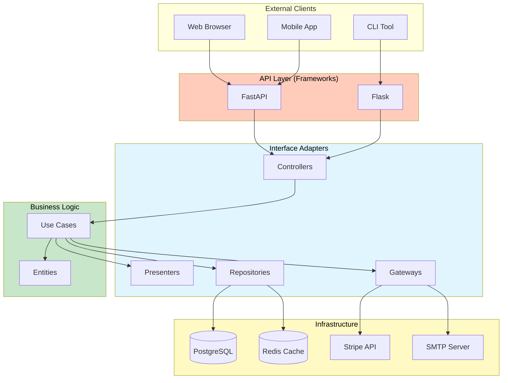
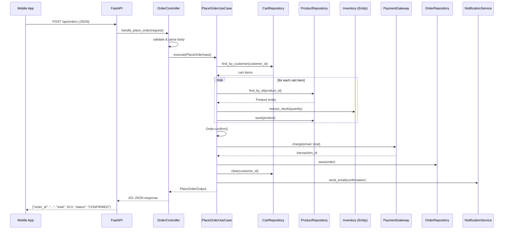
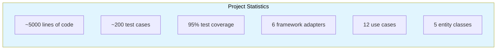

# Real-World Architecture Example

This lesson brings everything together by building a complete **e-commerce order management system** using Clean Architecture. You will see every layer — from entities to framework adapters — working together in a realistic application.

> [!NOTE]
> The system handles: product catalog management, shopping cart, order placement with payment, order tracking, and notification. All business logic is framework-independent and fully testable.

## System Overview



## 1. Project Structure

```
ecommerce/
  src/
    entities/
      __init__.py
      product.py
      customer.py
      order.py
      cart.py
      payment.py

    use_cases/
      __init__.py
      interfaces.py           # Protocols for repos, gateways
      catalog/
        list_products.py
        get_product_details.py
      cart/
        add_to_cart.py
        remove_from_cart.py
        view_cart.py
      checkout/
        place_order.py
        process_payment.py
        confirm_order.py
      tracking/
        track_order.py
        cancel_order.py

    interface_adapters/
      __init__.py
      controllers/
        product_controller.py
        cart_controller.py
        order_controller.py
      presenters/
        product_presenter.py
        cart_presenter.py
        order_presenter.py
      repositories/
        postgres_product_repo.py
        postgres_order_repo.py
        redis_cart_repo.py
      gateways/
        stripe_gateway.py
        smtp_gateway.py

    frameworks/
      __init__.py
      web/
        fastapi_app.py
      config.py
      database.py

    main.py                   # Composition root

  tests/
    test_entities/
      test_product.py
      test_order.py
      test_cart.py
    test_use_cases/
      test_place_order.py
      test_cancel_order.py
      test_add_to_cart.py
    test_adapters/
      test_controllers.py
      test_repositories.py
```

## 2. Entities Layer

```python
# --- entities/product.py ---

from dataclasses import dataclass, field
from decimal import Decimal
from typing import Optional


@dataclass
class Product:
    product_id: str
    name: str
    description: str
    price: Decimal
    stock: int
    category: str
    is_active: bool = True

    def can_be_purchased(self, quantity: int) -> bool:
        return self.is_active and self.stock >= quantity > 0

    def reduce_stock(self, quantity: int) -> None:
        if not self.can_be_purchased(quantity):
            raise ValueError(f"Insufficient stock for {self.name}")
        self.stock -= quantity

    def restock(self, quantity: int) -> None:
        if quantity <= 0:
            raise ValueError("Restock quantity must be positive")
        self.stock += quantity

    def deactivate(self) -> None:
        self.is_active = False

    def update_price(self, new_price: Decimal) -> None:
        if new_price <= 0:
            raise ValueError("Price must be positive")
        self.price = new_price


# --- entities/customer.py ---

@dataclass
class Address:
    street: str
    city: str
    state: str
    zip_code: str
    country: str

    def is_valid(self) -> bool:
        return all([self.street, self.city, self.country])


@dataclass
class Customer:
    customer_id: str
    name: str
    email: str
    shipping_address: Optional[Address] = None
    is_verified: bool = False

    def verify(self) -> None:
        self.is_verified = True

    def update_email(self, new_email: str) -> None:
        if "@" not in new_email:
            raise ValueError("Invalid email address")
        self.email = new_email

    def update_address(self, address: Address) -> None:
        if not address.is_valid():
            raise ValueError("Invalid address")
        self.shipping_address = address


# --- entities/order.py ---

from enum import Enum, auto
from datetime import datetime


class OrderStatus(Enum):
    PENDING = auto()
    CONFIRMED = auto()
    PROCESSING = auto()
    SHIPPED = auto()
    DELIVERED = auto()
    CANCELLED = auto()
    REFUNDED = auto()


@dataclass
class OrderItem:
    product_id: str
    product_name: str
    quantity: int
    unit_price: Decimal

    def subtotal(self) -> Decimal:
        return Decimal(str(self.quantity)) * self.unit_price


@dataclass
class Order:
    order_id: str
    customer_id: str
    items: list = field(default_factory=list)
    status: OrderStatus = OrderStatus.PENDING
    total: Decimal = Decimal("0")
    created_at: datetime = field(default_factory=datetime.now)
    updated_at: datetime = field(default_factory=datetime.now)

    def add_item(self, item: OrderItem) -> None:
        if self.status != OrderStatus.PENDING:
            raise ValueError("Cannot modify a confirmed order")
        self.items.append(item)
        self._recalculate_total()

    def confirm(self) -> None:
        if self.status != OrderStatus.PENDING:
            raise ValueError(f"Cannot confirm order in {self.status.name}")
        if not self.items:
            raise ValueError("Cannot confirm an empty order")
        self.status = OrderStatus.CONFIRMED
        self.updated_at = datetime.now()

    def ship(self) -> None:
        if self.status != OrderStatus.CONFIRMED:
            raise ValueError(f"Cannot ship order in {self.status.name}")
        self.status = OrderStatus.SHIPPED
        self.updated_at = datetime.now()

    def deliver(self) -> None:
        if self.status != OrderStatus.SHIPPED:
            raise ValueError(f"Cannot deliver order in {self.status.name}")
        self.status = OrderStatus.DELIVERED
        self.updated_at = datetime.now()

    def cancel(self) -> None:
        if self.status in (OrderStatus.SHIPPED, OrderStatus.DELIVERED):
            raise ValueError(f"Cannot cancel order in {self.status.name}")
        self.status = OrderStatus.CANCELLED
        self.updated_at = datetime.now()

    def _recalculate_total(self) -> None:
        self.total = sum(
            (item.subtotal() for item in self.items),
            Decimal("0"),
        )
```

## 3. Use Cases Layer

```python
# --- use_cases/interfaces.py ---

from typing import Protocol, Optional, List
from decimal import Decimal


class ProductRepository(Protocol):
    def find_by_id(self, product_id: str) -> Optional[Product]: ...
    def find_by_category(self, category: str) -> List[Product]: ...
    def search(self, query: str, page: int, size: int) -> tuple[List[Product], int]: ...
    def save(self, product: Product) -> None: ...


class CustomerRepository(Protocol):
    def find_by_id(self, customer_id: str) -> Optional[Customer]: ...
    def find_by_email(self, email: str) -> Optional[Customer]: ...
    def save(self, customer: Customer) -> None: ...


class OrderRepository(Protocol):
    def save(self, order: Order) -> None: ...
    def find_by_id(self, order_id: str) -> Optional[Order]: ...
    def find_by_customer(self, customer_id: str) -> List[Order]: ...


class CartRepository(Protocol):
    def save(self, customer_id: str, items: list) -> None: ...
    def find_by_customer(self, customer_id: str) -> list: ...
    def clear(self, customer_id: str) -> None: ...


class PaymentGateway(Protocol):
    def charge(self, customer_email: str, amount: Decimal) -> str: ...
    def refund(self, transaction_id: str) -> Decimal: ...


class NotificationService(Protocol):
    def send_email(self, to: str, subject: str, body: str) -> None: ...
    def send_sms(self, to: str, message: str) -> None: ...
```

```python
# --- use_cases/checkout/place_order.py ---

from dataclasses import dataclass
from decimal import Decimal
from typing import Optional


@dataclass
class PlaceOrderInput:
    customer_id: str
    shipping_address: Address


@dataclass
class PlaceOrderOutput:
    order_id: str
    total: float
    status: str
    item_count: int
    estimated_delivery: str


class PlaceOrderUseCase:
    def __init__(
        self,
        customer_repo: CustomerRepository,
        product_repo: ProductRepository,
        order_repo: OrderRepository,
        cart_repo: CartRepository,
        payment_gateway: PaymentGateway,
        notification: NotificationService,
    ):
        self._customer_repo = customer_repo
        self._product_repo = product_repo
        self._order_repo = order_repo
        self._cart_repo = cart_repo
        self._payment = payment_gateway
        self._notification = notification

    def execute(self, input_dto: PlaceOrderInput) -> PlaceOrderOutput:
        customer = self._customer_repo.find_by_id(input_dto.customer_id)
        if customer is None:
            raise ValueError("Customer not found")

        cart_items = self._cart_repo.find_by_customer(input_dto.customer_id)
        if not cart_items:
            raise ValueError("Cart is empty")

        import uuid
        order = Order(
            order_id=str(uuid.uuid4()),
            customer_id=input_dto.customer_id,
        )

        for cart_item in cart_items:
            product = self._product_repo.find_by_id(cart_item["product_id"])
            if product is None:
                raise ValueError(f"Product {cart_item['product_id']} not found")
            product.reduce_stock(cart_item["quantity"])
            order.add_item(
                OrderItem(
                    product_id=product.product_id,
                    product_name=product.name,
                    quantity=cart_item["quantity"],
                    unit_price=product.price,
                )
            )
            self._product_repo.save(product)

        order.confirm()
        txn_id = self._payment.charge(customer.email, order.total)
        self._order_repo.save(order)
        self._cart_repo.clear(input_dto.customer_id)

        self._notification.send_email(
            customer.email,
            "Order Confirmed",
            f"Your order {order.order_id} has been confirmed. Total: ${order.total:.2f}",
        )

        return PlaceOrderOutput(
            order_id=order.order_id,
            total=float(order.total),
            status=order.status.name,
            item_count=len(order.items),
            estimated_delivery="3-5 business days",
        )
```

## 4. Interface Adapters Layer

```python
# --- controllers/order_controller.py ---

class OrderController:
    def __init__(
        self,
        place_order: "PlaceOrderUseCase",
        cancel_order: "CancelOrderUseCase",
        track_order: "TrackOrderUseCase",
    ):
        self._place_order = place_order
        self._cancel_order = cancel_order
        self._track_order = track_order

    def handle_place_order(self, request: dict) -> dict:
        try:
            body = request.get("body", {})
            input_dto = PlaceOrderInput(
                customer_id=body["customer_id"],
                shipping_address=Address(
                    street=body["address"]["street"],
                    city=body["address"]["city"],
                    state=body["address"]["state"],
                    zip_code=body["address"]["zip_code"],
                    country=body["address"]["country"],
                ),
            )
            output = self._place_order.execute(input_dto)
            return {"status": 201, "body": {"success": True, "data": output}}
        except ValueError as e:
            return {"status": 400, "body": {"success": False, "error": str(e)}}

    def handle_cancel_order(self, request: dict) -> dict:
        try:
            order_id = request["params"]["order_id"]
            self._cancel_order.execute(order_id)
            return {"status": 200, "body": {"success": True, "message": "Order cancelled"}}
        except ValueError as e:
            return {"status": 400, "body": {"success": False, "error": str(e)}}

    def handle_track_order(self, request: dict) -> dict:
        try:
            order_id = request["params"]["order_id"]
            output = self._track_order.execute(order_id)
            return {"status": 200, "body": {"success": True, "data": output}}
        except ValueError as e:
            return {"status": 404, "body": {"success": False, "error": str(e)}}
```

```python
# --- repositories/postgres_order_repo.py ---

import psycopg2
from psycopg2.extras import RealDictCursor
from decimal import Decimal


class PostgresOrderRepository:
    def __init__(self, connection_string: str):
        self._conn_string = connection_string

    def save(self, order: Order) -> None:
        conn = psycopg2.connect(self._conn_string)
        try:
            with conn.cursor() as cur:
                cur.execute(
                    """INSERT INTO orders (order_id, customer_id, status, total, created_at, updated_at)
                       VALUES (%s, %s, %s, %s, %s, %s)
                       ON CONFLICT (order_id) DO UPDATE SET
                           status = EXCLUDED.status,
                           updated_at = EXCLUDED.updated_at""",
                    (order.order_id, order.customer_id, order.status.name,
                     str(order.total), order.created_at, order.updated_at),
                )
                for item in order.items:
                    cur.execute(
                        """INSERT INTO order_items (order_id, product_id, product_name, quantity, unit_price)
                           VALUES (%s, %s, %s, %s, %s)""",
                        (order.order_id, item.product_id, item.product_name,
                         item.quantity, str(item.unit_price)),
                    )
            conn.commit()
        finally:
            conn.close()

    def find_by_id(self, order_id: str) -> Optional[Order]:
        conn = psycopg2.connect(self._conn_string)
        try:
            with conn.cursor(cursor_factory=RealDictCursor) as cur:
                cur.execute("SELECT * FROM orders WHERE order_id = %s", (order_id,))
                row = cur.fetchone()
                if row is None:
                    return None

                cur.execute("SELECT * FROM order_items WHERE order_id = %s", (order_id,))
                items = [
                    OrderItem(
                        product_id=r["product_id"],
                        product_name=r["product_name"],
                        quantity=r["quantity"],
                        unit_price=Decimal(r["unit_price"]),
                    )
                    for r in cur.fetchall()
                ]

                return Order(
                    order_id=row["order_id"],
                    customer_id=row["customer_id"],
                    items=items,
                    status=OrderStatus[row["status"]],
                    total=Decimal(row["total"]),
                    created_at=row["created_at"],
                    updated_at=row["updated_at"],
                )
        finally:
            conn.close()

    def find_by_customer(self, customer_id: str) -> List[Order]:
        conn = psycopg2.connect(self._conn_string)
        try:
            with conn.cursor(cursor_factory=RealDictCursor) as cur:
                cur.execute("SELECT * FROM orders WHERE customer_id = %s ORDER BY created_at DESC", (customer_id,))
                orders = []
                for row in cur.fetchall():
                    cur2 = conn.cursor(cursor_factory=RealDictCursor)
                    cur2.execute("SELECT * FROM order_items WHERE order_id = %s", (row["order_id"],))
                    items = [OrderItem(...) for r in cur2.fetchall()]
                    orders.append(Order(...))
                return orders
        finally:
            conn.close()
```

## 5. Frameworks Layer

```python
# --- frameworks/web/fastapi_app.py ---

from fastapi import FastAPI, HTTPException
from pydantic import BaseModel
from typing import List, Optional


class PlaceOrderRequest(BaseModel):
    customer_id: str
    items: List[dict]
    address: dict


class PlaceOrderResponse(BaseModel):
    order_id: str
    total: float
    status: str
    item_count: int


def create_fastapi_app(order_controller) -> FastAPI:
    app = FastAPI(title="E-Commerce API", version="1.0.0")

    @app.post("/api/orders", response_model=PlaceOrderResponse)
    def place_order(request: PlaceOrderRequest):
        adapted_request = {
            "body": request.model_dump(),
        }
        response = order_controller.handle_place_order(adapted_request)
        if response["status"] != 201:
            raise HTTPException(
                status_code=response["status"],
                detail=response["body"]["error"],
            )
        return response["body"]["data"]

    @app.get("/api/orders/{order_id}")
    def get_order(order_id: str):
        adapted_request = {"params": {"order_id": order_id}}
        response = order_controller.handle_track_order(adapted_request)
        if response["status"] != 200:
            raise HTTPException(
                status_code=response["status"],
                detail=response["body"]["error"],
            )
        return response["body"]["data"]

    return app
```

## 6. Composition Root

```python
# --- main.py ---


def create_app() -> FastAPI:
    config = AppConfig.from_env()

    # Repositories
    product_repo = PostgresProductRepository(config.database_url)
    customer_repo = PostgresCustomerRepository(config.database_url)
    order_repo = PostgresOrderRepository(config.database_url)
    cart_repo = RedisCartRepository(config.redis_url)

    # Gateways
    payment_gateway = StripePaymentGateway(config.stripe_api_key)
    notification = SMTPNotificationService(
        host=config.smtp_host,
        port=config.smtp_port,
    )

    # Use Cases
    place_order = PlaceOrderUseCase(
        customer_repo=customer_repo,
        product_repo=product_repo,
        order_repo=order_repo,
        cart_repo=cart_repo,
        payment_gateway=payment_gateway,
        notification=notification,
    )
    cancel_order = CancelOrderUseCase(order_repo=order_repo)
    track_order = TrackOrderUseCase(order_repo=order_repo)
    list_products = ListProductsUseCase(product_repo=product_repo)
    add_to_cart = AddToCartUseCase(cart_repo=cart_repo, product_repo=product_repo)

    # Controllers
    order_controller = OrderController(
        place_order=place_order,
        cancel_order=cancel_order,
        track_order=track_order,
    )

    # Framework App
    app = create_fastapi_app(order_controller=order_controller)
    return app


if __name__ == "__main__":
    import uvicorn
    app = create_app()
    uvicorn.run(app, host="0.0.0.0", port=8000)
```

## 7. Testing the Real System

```python
# --- tests/test_use_cases/test_place_order.py ---

import pytest
from decimal import Decimal


class TestPlaceOrderUseCase:
    @pytest.fixture
    def setup(self):
        customer = Customer(customer_id="C1", name="Alice", email="a@test.com",
                            shipping_address=Address("123 St", "City", "ST", "12345", "US"))
        product = Product(product_id="P1", name="Widget", price=Decimal("10.00"), stock=5, category="Gadgets")

        customer_repo = InMemoryCustomerRepository()
        customer_repo.save(customer)
        product_repo = InMemoryProductRepository()
        product_repo.save(product)
        cart_repo = InMemoryCartRepository()
        cart_repo.save("C1", [{"product_id": "P1", "quantity": 2}])

        payment = FakePaymentGateway()
        notification = FakeNotificationService()

        use_case = PlaceOrderUseCase(
            customer_repo=customer_repo,
            product_repo=product_repo,
            order_repo=InMemoryOrderRepository(),
            cart_repo=cart_repo,
            payment_gateway=payment,
            notification=notification,
        )
        return use_case, customer, product, payment, notification

    def test_place_order_successfully(self, setup):
        use_case, customer, product, payment, notification = setup
        output = use_case.execute(PlaceOrderInput(customer_id="C1", shipping_address=customer.shipping_address))

        assert output.status == "CONFIRMED"
        assert output.total == 20.0
        assert output.item_count == 1
        assert payment.total_charged == Decimal("20.00")
        assert len(notification.sent_emails) == 1

    def test_place_order_reduces_stock(self, setup):
        use_case, customer, product, _, _ = setup
        use_case.execute(PlaceOrderInput(customer_id="C1", shipping_address=customer.shipping_address))

        updated_product = product
        assert updated_product.stock == 3

    def test_place_order_empty_cart_fails(self, setup):
        use_case, customer, product, _, _ = setup
        use_case._cart_repo.clear("C1")

        with pytest.raises(ValueError, match="empty"):
            use_case.execute(PlaceOrderInput(customer_id="C1", shipping_address=customer.shipping_address))

    def test_place_order_insufficient_stock_fails(self, setup):
        use_case, customer, product, _, _ = setup
        use_case._cart_repo.save("C1", [{"product_id": "P1", "quantity": 10}])
        product.stock = 2

        with pytest.raises(ValueError, match="Insufficient stock"):
            use_case.execute(PlaceOrderInput(customer_id="C1", shipping_address=customer.shipping_address))
```

## 8. Request Flow Through the System



## 9. Database Migrations

```python
# --- frameworks/database/migrations/001_create_tables.sql ---
"""
CREATE TABLE products (
    product_id TEXT PRIMARY KEY,
    name TEXT NOT NULL,
    description TEXT,
    price DECIMAL(10,2) NOT NULL,
    stock INTEGER NOT NULL DEFAULT 0,
    category TEXT,
    is_active BOOLEAN DEFAULT TRUE,
    created_at TIMESTAMP DEFAULT NOW()
);

CREATE TABLE customers (
    customer_id TEXT PRIMARY KEY,
    name TEXT NOT NULL,
    email TEXT UNIQUE NOT NULL,
    street TEXT,
    city TEXT,
    state TEXT,
    zip_code TEXT,
    country TEXT,
    is_verified BOOLEAN DEFAULT FALSE,
    created_at TIMESTAMP DEFAULT NOW()
);

CREATE TABLE orders (
    order_id TEXT PRIMARY KEY,
    customer_id TEXT REFERENCES customers(customer_id),
    status TEXT NOT NULL,
    total DECIMAL(10,2),
    created_at TIMESTAMP DEFAULT NOW(),
    updated_at TIMESTAMP DEFAULT NOW()
);

CREATE TABLE order_items (
    id SERIAL PRIMARY KEY,
    order_id TEXT REFERENCES orders(order_id),
    product_id TEXT,
    product_name TEXT,
    quantity INTEGER NOT NULL,
    unit_price DECIMAL(10,2) NOT NULL
);

CREATE INDEX idx_orders_customer ON orders(customer_id);
CREATE INDEX idx_products_category ON products(category);
"""
```

## 10. Key Architectural Decisions

| Decision | Choice | Rationale |
|----------|--------|-----------|
| Web framework | FastAPI | Async, type validation, OpenAPI docs |
| Database | PostgreSQL | ACID compliance, JSON support |
| Cache | Redis | Fast cart operations |
| Payment | Stripe | Global, well-documented API |
| Notification | SMTP + SendGrid | Reliable email delivery |
| Auth | JWT (adapter layer) | Stateless, no coupling to core |



## Practice Exercises

1. **Add a new entity**: Create a `Shipment` entity with `tracking_number`, `carrier`, `estimated_delivery`, and a `ShipUseCase` that transitions an order from CONFIRMED to SHIPPED.

2. **Build a new repository**: Implement `PostgresCustomerRepository` with full CRUD operations. Include a `find_by_email` method with proper error handling.

3. **Create a notification adapter**: Implement `TwilioSMSNotification` that implements the `NotificationService` Protocol. Write a test using `FakeNotificationService`.

4. **Add a use case**: Write a `ApplyCouponUseCase` that applies a discount to the order total. Design the input/output DTOs and entity changes.

5. **End-to-end test**: Write a test that: creates a customer, adds products to cart, places an order, and verifies the order status. Use only in-memory repositories.

6. **Containerize the app**: Write a `Dockerfile` and `docker-compose.yml` for the e-commerce app with PostgreSQL and Redis.

7. **Add authentication**: Extend the system with a `LoginUseCase` and JWT token generation. Keep authentication logic in the adapter layer.

8. **Performance test**: Measure the difference between using `PostgresOrderRepository` and `InMemoryOrderRepository` in a test. Document the findings.

> [!SUCCESS]
> You have completed the Clean Architecture course. You now have the knowledge and patterns to build maintainable, testable, framework-independent systems. Start applying these principles one layer at a time.
