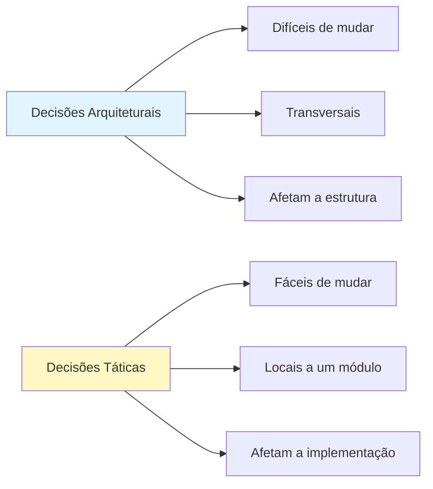
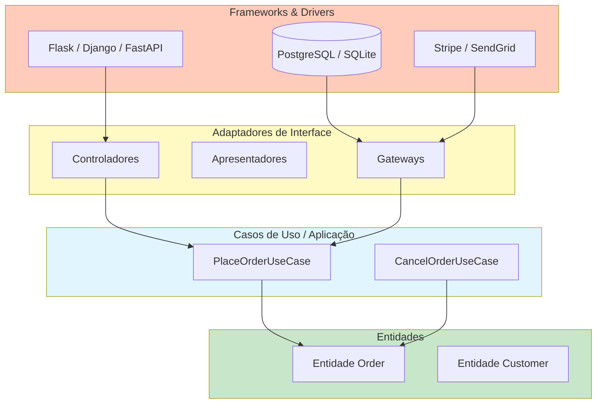
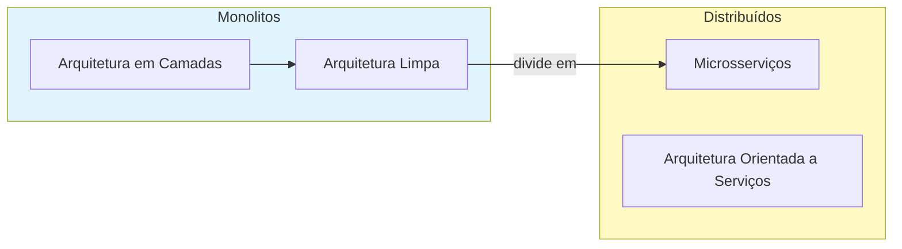

# O que é Arquitetura de Software?

Arquitetura de software é o conjunto de decisões de design que moldam a estrutura, o comportamento e a evolução de um sistema. Ela define os componentes de alto nível, suas interações e as restrições que guiam a implementação.

> [!NOTE]
> Arquitetura não é sobre frameworks, bibliotecas ou bancos de dados. Trata-se das **decisões que são difíceis de mudar** depois que o sistema é construído. Uma boa arquitetura adia essas decisões até o último momento responsável.

## Por que a Arquitetura é Importante

Uma arquitetura ruim leva a sistemas rígidos, frágeis e impossíveis de testar. Uma boa arquitetura possibilita:

| Propriedade | Arquitetura Ruim | Arquitetura Boa |
|-------------|-----------------|-----------------|
| Manutenibilidade | Toda mudança quebra algo | Mudanças são localizadas |
| Testabilidade | Requer configuração completa do sistema | Testável isoladamente |
| Capacidade de deploy | Implantações longas e arriscadas | Releases seguros e frequentes |
| Escalabilidade | Acoplado a uma única máquina | Escala horizontalmente |
| Produtividade do dev | Diminui com o tempo | Velocidade sustentada |

```python
# Ruim: sem arquitetura — tudo acoplado
import flask, sqlite3, smtplib, stripe

app = flask.Flask(__name__)

@app.route("/checkout")
def checkout():
    data = flask.request.json
    db = sqlite3.connect("shop.db")
    db.execute("INSERT INTO orders VALUES (?, ?)", (data["user_id"], data["total"]))
    stripe.Charge.create(amount=int(data["total"] * 100), currency="usd", source=data["token"])
    smtplib.SMTP("smtp.example.com").sendmail("from@shop.com", data["email"], "Pedido realizado!")
    return {"ok": True}

# Bom: arquitetura em camadas
# routes.py — apenas HTTP
# use_cases.py — lógica de negócio
# repositories.py — acesso a dados
# external.py — integrações de terceiros
```

## Decisões Arquiteturais vs Táticas



Decisões arquiteturais incluem escolha da linguagem, estilo arquitetural (camadas, hexagonal, cebola), protocolos de comunicação e estratégia de armazenamento. Decisões táticas incluem escolha de algoritmos, nomeação de variáveis e otimizações locais.

> [!WARNING]
> O erro arquitetural mais comum é tratar escolhas de frameworks como decisões arquiteturais. Trocar um framework não deve mudar a arquitetura. Sua lógica de negócio deve ser independente de framework.

## A Arquitetura Limpa

A Arquitetura Limpa, introduzida por Robert C. Martin, organiza o código em camadas concêntricas:

```python
from abc import ABC, abstractmethod
from dataclasses import dataclass
from typing import Protocol


@dataclass
class Order:
    customer_email: str
    product_id: str
    quantity: int
    total: float


class OrderRepository(ABC):
    @abstractmethod
    def save(self, order: Order) -> None:
        ...

    @abstractmethod
    def find_by_id(self, order_id: str) -> Order | None:
        ...


class PaymentGateway(ABC):
    @abstractmethod
    def charge(self, customer_email: str, amount: float) -> str:
        ...


class PlaceOrderUseCase:
    def __init__(self, repo: OrderRepository, gateway: PaymentGateway):
        self._repo = repo
        self._gateway = gateway

    def execute(self, customer_email: str, product_id: str, quantity: int, total: float) -> Order:
        order = Order(customer_email, product_id, quantity, total)
        transaction_id = self._gateway.charge(customer_email, total)
        self._repo.save(order)
        return order
```

## As Quatro Camadas

| Camada | Nome | Contém | Dependências |
|--------|------|--------|-------------|
| Externa | Frameworks & Drivers | BD, framework web, UI | Nada (do lado externo) |
| Intermediária | Adaptadores de Interface | Controladores, apresentadores, gateways | Para dentro |
| Interna | Casos de Uso / Aplicação | Regras de negócio específicas | Entidades |
| Núcleo | Entidades | Regras de negócio empresariais | Nada |



> [!TIP]
> Pense nas camadas como uma cebola. O núcleo não sabe nada sobre o exterior. As camadas externas conhecem as camadas internas. As dependências sempre apontam **para dentro**.

## O Princípio da Inversão de Dependência

A Inversão de Dependência é a base da Arquitetura Limpa:

1. Módulos de alto nível não devem depender de módulos de baixo nível. Ambos devem depender de abstrações.
2. Abstrações não devem depender de detalhes. Detalhes devem depender de abstrações.

```python
# Violação: alto nível depende do baixo nível
class MySQLOrderRepository:
    def save(self, order: Order) -> None:
        print(f"Salvando {order} no MySQL...")

class PlaceOrderBad:
    def __init__(self):
        self._repo = MySQLOrderRepository()  # Dependência rígida!

    def execute(self, order: Order) -> None:
        self._repo.save(order)


# Limpo: depende de abstração
from typing import Protocol

class OrderRepository(Protocol):
    def save(self, order: Order) -> None:
        ...

class PlaceOrderClean:
    def __init__(self, repo: OrderRepository):
        self._repo = repo  # Depende da abstração

    def execute(self, order: Order) -> None:
        self._repo.save(order)


class PostgreSQLOrderRepository:
    def save(self, order: Order) -> None:
        print(f"Salvando {order} no PostgreSQL...")

class InMemoryOrderRepository:
    def __init__(self):
        self._orders: dict[str, Order] = {}

    def save(self, order: Order) -> None:
        self._orders[order.product_id] = order

repo = InMemoryOrderRepository()
use_case = PlaceOrderClean(repo)
use_case.execute(Order("a@b.com", "PROD-1", 2, 49.99))
```

## Separação de Preocupações

Cada camada tem uma responsabilidade. A camada de entidades não sabe nada sobre bancos de dados. O caso de uso não sabe sobre HTTP.

```python
@dataclass
class Product:
    product_id: str
    name: str
    price: float
    stock: int

    def can_be_purchased(self, quantity: int) -> bool:
        return self.stock >= quantity > 0

    def reduce_stock(self, quantity: int) -> None:
        if not self.can_be_purchased(quantity):
            raise ValueError("Estoque insuficiente")
        self.stock -= quantity


class PurchaseProductUseCase:
    def __init__(self, product_repo, payment_gateway, notification_service):
        self._product_repo = product_repo
        self._payment_gateway = payment_gateway
        self._notification_service = notification_service

    def execute(self, product_id: str, quantity: int, customer_email: str) -> None:
        product = self._product_repo.find_by_id(product_id)
        product.reduce_stock(quantity)
        total = product.price * quantity
        self._payment_gateway.charge(customer_email, total)
        self._product_repo.save(product)
        self._notification_service.send_confirmation(customer_email, product, quantity)
```

## Testes Sem Infraestrutura

```python
def test_purchase_product():
    product = Product("P1", "Widget", 10.0, 5)
    repo = InMemoryProductRepository([product])
    gateway = FakePaymentGateway()
    notifications = FakeNotificationService()
    use_case = PurchaseProductUseCase(repo, gateway, notifications)

    use_case.execute("P1", 2, "test@example.com")

    assert product.stock == 3
    assert gateway.total_charged == 20.0
    assert notifications.last_email == "test@example.com"
```

## A Arquitetura que Grita

> [!NOTE]
> Um sistema bem arquitetado **grita** seu propósito. Se você vê um projeto Django, sabe que é uma aplicação web. Mas um projeto de Arquitetura Limpa grita **o que ele faz** — e-commerce, banco, logística — independente do framework.

```
src/
  entities/          # Regras de negócio empresariais
    product.py
    order.py
    customer.py
  use_cases/         # Regras de negócio da aplicação
    place_order.py
    cancel_order.py
    process_refund.py
  interface_adapters/
    controllers/
    presenters/
    repositories/
  frameworks/
    flask_app.py
    postgres_repo.py
    stripe_gateway.py
```

## Comparação de Estilos Arquiteturais

| Estilo | Direção | Acoplamento | Melhor Para |
|--------|---------|-------------|-------------|
| Em Camadas | Top-down | Forte | Aplicações CRUD simples |
| Arquitetura Limpa | Para dentro | Fraco (via DIP) | Lógica de negócio complexa |
| Hexagonal | Para dentro | Fraco | Design-driven domain |
| Cebola | Para dentro | Fraco | Aplicações empresariais |
| Microsserviços | Descentralizado | Fraco (via APIs) | Grandes equipes distribuídas |

## Equívocos Comuns

> [!WARNING]
> **"Arquitetura Limpa significa mais código."** Sim, há mais arquivos e interfaces. Mas a complexidade total é menor porque cada peça é mais simples, testável e independentemente compreensível.

| Equívoco | Realidade |
|----------|-----------|
| "É só para grandes projetos" | Projetos pequenos também se beneficiam |
| "Retarda o desenvolvimento" | Velocidade inicial é menor; velocidade a longo prazo é muito maior |
| "Precisa de um framework de DI" | Protocols do Python e injeção manual funcionam perfeitamente |
| "É sobre camadas" | É sobre **limites** e **direção de dependência** |
| "Significa sem frameworks" | Frameworks são bem-vindos na camada externa |

## Exercícios Práticos

1. **Identifique decisões arquiteturais**: Liste 3 decisões arquiteturais e 3 táticas em um projeto que você conhece. Explique cada classificação.

2. **Encontre a violação**: O código abaixo tem uma violação de inversão de dependência. Identifique e corrija:
   ```python
   class EmailService:
       def send(self, to: str, message: str):
           import smtplib
           server = smtplib.SMTP("smtp.example.com")
           server.sendmail("noreply@shop.com", to, message)
   ```

3. **Desenhe as camadas**: Pegue uma aplicação que você construiu. Desenhe suas camadas como um diagrama de cebola da Arquitetura Limpa.

4. **Implemente um limite**: Crie um Protocol `UserRepository` e uma implementação `InMemoryUserRepository`. Escreva um `RegisterUserUseCase` que depende do Protocol.

5. **Teste sem infraestrutura**: Usando o `PurchaseProductUseCase`, escreva um teste que verifica o comportamento correto quando `can_be_purchased` retorna `False`.

6. **Auditoria de dependência**: Examine um projeto Django ou Flask. Conte quantos imports em `views.py` referenciam classes específicas do framework.

7. **Teste do grito**: Olhe o diretório raiz do seu projeto. Ele grita o que o sistema faz ou qual tecnologia usa?

8. **Refatoração de limite**: Pegue uma função que mistura parsing HTTP, lógica de negócio e acesso a banco de dados. Divida em três camadas.

> [!SUCCESS]
> Você completou a Lição 1. Lembre-se: arquitetura é sobre as decisões que importam — e torná-las reversíveis.

## Comparação Detalhada de Estilos Arquiteturais

Cada estilo arquitetural atende a diferentes necessidades. A Arquitetura Limpa se destaca em sistemas com lógica de negócio complexa, onde a manutenibilidade a longo prazo é crítica.



| Característica | Camadas | Limpa | Microsserviços |
|---------------|---------|-------|----------------|
| Complexidade inicial | Baixa | Média | Alta |
| Testabilidade | Baixa | Alta | Alta |
| Acoplamento | Alto | Baixo | Baixo |
| Deploy | Simples | Simples | Complexo |
| Equipe | Única | Única | Múltiplas |

## O Custo da Má Arquitetura

Sistemas sem arquitetura adequada acumulam dívida técnica rapidamente. O custo de mudança cresce exponencialmente com o tempo, enquanto em sistemas bem arquitetados ele cresce linearmente.

```python
# Sintoma de má arquitetura: arquivos gigantes
# controllers.py com 2000+ linhas fazendo TUDO

# Sintoma de boa arquitetura: arquivos pequenos e focados
# controllers/order_controller.py — 50 linhas, só controla
# use_cases/place_order.py — 80 linhas, só lógica de pedido
# entities/order.py — 100 linhas, só regras de negócio
# repositories/postgres_order_repo.py — 120 linhas, só persistência
```

## Arquitetura e Testes

Um dos maiores benefícios da Arquitetura Limpa é a testabilidade. Como as dependências são invertidas, cada camada pode ser testada isoladamente.

```python
# Teste de entidade — sem infraestrutura
def test_order_confirmation_rules():
    customer = Customer("C1", "Alice", "a@test.com")
    order = Order("ORD-1", customer)
    order.add_item(OrderItem("P1", "Widget", 2, Decimal("10.00")))
    
    order.confirm()
    assert order.status == OrderStatus.CONFIRMED
    
    with pytest.raises(ValueError):
        order.confirm()  # Já confirmado!

# Teste de caso de uso — com repositórios in-memory
def test_place_order_use_case():
    ...
```

## Boas Práticas de Arquitetura

1. **Comece pequeno**: Não superprojete antecipadamente. Extraia interfaces quando precisar delas.
2. **Mantenha os limites claros**: Use Protocols para definir contratos entre camadas.
3. **Teste sem infraestrutura**: Se você precisa de um banco de dados para testar lógica de negócio, sua arquitetura está errada.
4. **Refatore continuamente**: Arquitetura não é um destino — é uma prática contínua.
5. **Documente as decisões**: Use ADRs (Architecture Decision Records) para registrar decisões importantes.

> [!SUCCESS]
> Revise os conceitos fundamentais. Uma boa arquitetura é o investimento mais importante que você pode fazer na qualidade do seu software.
