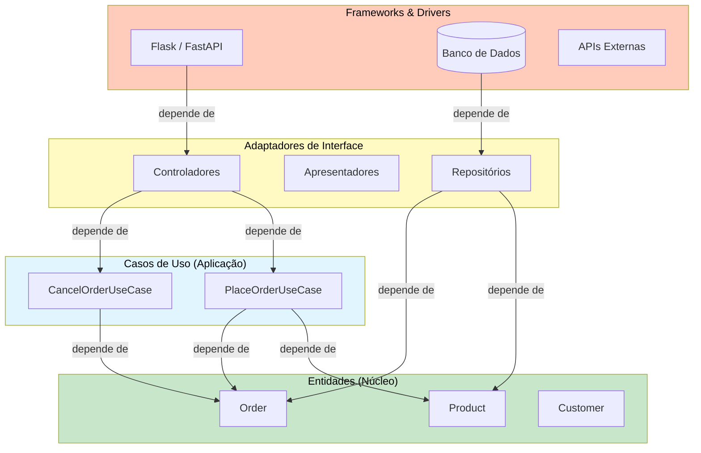
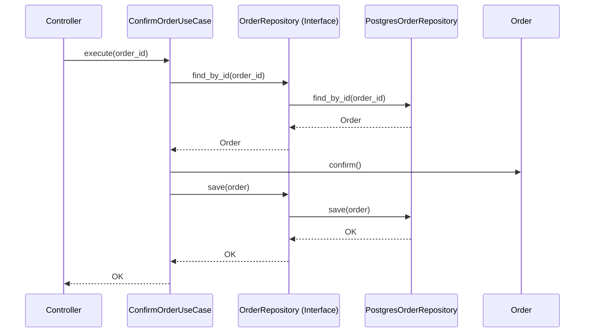
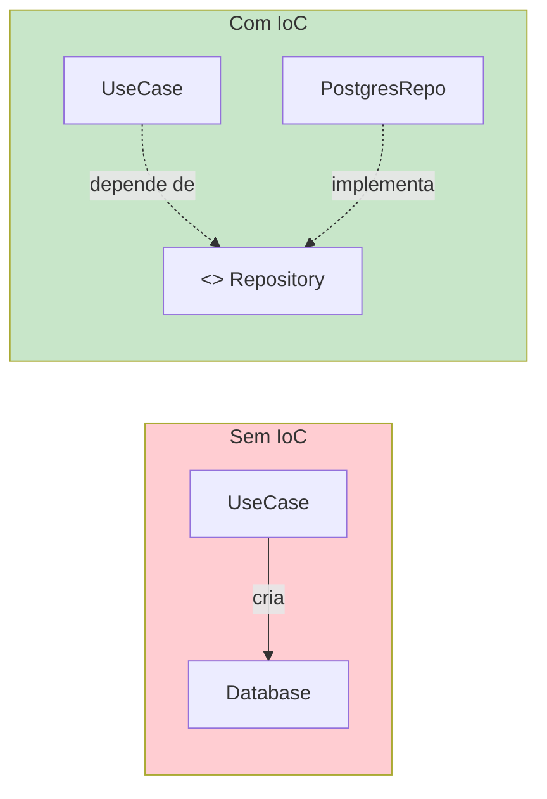

# A Regra de Dependência

A Regra de Dependência é o princípio mais importante na Arquitetura Limpa. Ela afirma:

> **Dependências de código-fonte devem apontar apenas para dentro, em direção ao centro da cebola.**

Nada em um círculo interno pode saber sobre um círculo externo. Isso inclui nomes de funções, classes, variáveis — qualquer coisa declarada em um círculo externo.

> [!NOTE]
> A Regra de Dependência se aplica a dependências de **tempo de compilação** ou **código-fonte**, não à execução em tempo de execução. Seu código interno pode chamar código externo através de inversão de dependência — a interface é definida na camada interna, implementada na externa.

## Visualizando a Regra



## O Que Viola a Regra de Dependência?

```python
# VIOLAÇÃO: Entidade importa um framework
import django.db.models

class Product:
    def __init__(self, name: str, price: float):
        self.name = name
        self.price = price
        self.django_model = django.db.models.Model()

# VIOLAÇÃO: Caso de uso importa driver de banco
import psycopg2

class PlaceOrderUseCase:
    def execute(self, order: Order) -> None:
        conn = psycopg2.connect("dbname=shop")
        cursor = conn.cursor()
        cursor.execute("INSERT INTO orders VALUES (%s)", (order,))
```

> [!WARNING]
> Toda vez que uma camada interna importa algo de uma camada externa, a Regra de Dependência é quebrada. Isso inclui importar modelos ORM, objetos de requisição HTTP, bibliotecas JSON ou configurações de ambiente.

## Atravessando Limites

Quando o código interno precisa se comunicar com o código externo, ele o faz através de uma **interface** definida na camada interna mas implementada na externa.

```python
from abc import ABC, abstractmethod
from dataclasses import dataclass


@dataclass
class Order:
    order_id: str
    customer_email: str
    total: float
    status: str = "pending"

    def confirm(self) -> None:
        self.status = "confirmed"

    def cancel(self) -> None:
        self.status = "cancelled"


class OrderRepository(ABC):
    @abstractmethod
    def save(self, order: Order) -> None:
        ...

    @abstractmethod
    def find_by_id(self, order_id: str) -> Order | None:
        ...


class NotificationService(ABC):
    @abstractmethod
    def send(self, recipient: str, subject: str, body: str) -> None:
        ...


class ConfirmOrderUseCase:
    def __init__(self, repo: OrderRepository, notifier: NotificationService):
        self._repo = repo
        self._notifier = notifier

    def execute(self, order_id: str) -> None:
        order = self._repo.find_by_id(order_id)
        if order is None:
            raise ValueError("Pedido não encontrado")
        order.confirm()
        self._repo.save(order)
        self._notifier.send(order.customer_email, "Pedido Confirmado",
                            f"Seu pedido {order.order_id} foi confirmado.")


class PostgresOrderRepository(OrderRepository):
    def save(self, order: Order) -> None:
        print(f"[PostgreSQL] Salvando pedido {order.order_id}...")

    def find_by_id(self, order_id: str) -> Order | None:
        return Order(order_id=order_id, customer_email="test@test.com", total=99.99)
```

## Fluxo de Controle vs Fluxo de Dependências



## Inversão de Controle (IoC)

IoC é o mecanismo que faz a Regra de Dependência funcionar:

```python
# Sem IoC — violando a regra
class UseCase:
    def execute(self):
        db = Database()
        db.save(...)

# Com IoC — seguindo a regra
class UseCase:
    def __init__(self, repo: Repository):
        self._repo = repo

    def execute(self):
        self._repo.save(...)
```



## A Raiz de Composição

A Raiz de Composição é o **único lugar** na aplicação onde todas as dependências são conectadas:

```python
# composition_root.py
def create_app():
    order_repo = PostgresOrderRepository(connection_string="postgresql://localhost/shop")
    payment_gateway = StripePaymentGateway(api_key="sk_test_...")
    notification = EmailNotificationService(smtp_host="smtp.example.com")

    place_order = PlaceOrderUseCase(repo=order_repo, payment=payment_gateway, notification=notification)
    order_controller = OrderController(place_order=place_order)

    return FlaskApp(order_controller=order_controller)
```

## Arquitetura de Plugins

| Componente | Tipo | Pode Ser Substituído |
|-----------|------|---------------------|
| Banco de Dados | Plugin | PostgreSQL → SQLite → MongoDB |
| Framework Web | Plugin | Flask → FastAPI → Django |
| Gateway de Pagamento | Plugin | Stripe → PayPal |
| Notificação | Plugin | Email → SMS → Push |

```python
class StripePaymentGateway(PaymentGateway):
    def charge(self, customer_email: str, amount: float) -> str:
        import stripe
        charge = stripe.Charge.create(amount=int(amount * 100), currency="usd")
        return charge.id

class PayPalPaymentGateway(PaymentGateway):
    def charge(self, customer_email: str, amount: float) -> str:
        import paypalrestsdk
        payment = paypalrestsdk.Payment({...})
        if payment.create():
            return payment.id
        raise RuntimeError("Falha no pagamento PayPal")
```

## Testando com a Regra de Dependência

```python
def test_confirm_order_sends_notification():
    order = Order(order_id="ORD-001", customer_email="alice@test.com", total=100.0)
    repo = FakeOrderRepository([order])
    notifier = FakeNotificationService()
    use_case = ConfirmOrderUseCase(repo, notifier)

    use_case.execute("ORD-001")

    assert order.status == "confirmed"
    assert notifier.sent_to == "alice@test.com"
```

## Exercícios Práticos

1. **Encontre violações**: Olhe um projeto Python existente. Encontre 3 lugares onde a Regra de Dependência é violada.

2. **Defina uma interface**: Crie um Protocol `NotificationService` com `send(user_id, message)`. Implemente `SMSNotificationService` e `EmailNotificationService`.

3. **Implemente um limite**: Escreva um `ShoppingCartRepository` Protocol e implemente `RedisCartRepository` e `InMemoryCartRepository`.

4. **Construa uma Raiz de Composição**: Pegue 3 casos de uso com dependências diferentes. Crie uma função `create_application()` que conecta tudo.

5. **Teste com fakes**: Para o `ConfirmOrderUseCase`, escreva um teste que verifica a exceção correta quando `order_id` não existe.

6. **DTO de fronteira**: Crie um dataclass `UserRegistrationRequest` na camada interna. Escreva um adaptador que converte entre um corpo de requisição HTTP e este DTO.

7. **Troca de plugin**: Escreva duas implementações de `PaymentGateway`. Mostre como o caso de uso não muda ao trocar entre elas.

8. **Exercício de fronteira**: Sem olhar a lição, desenhe as setas de dependência para uma arquitetura de 4 camadas.

> [!SUCCESS]
> A Regra de Dependência é a fundação da Arquitetura Limpa. Domine esta regra e você dominará o design arquitetural.

## Limites Parciais vs Completos

Nem todo limite precisa ser uma interface completa. Use o nível certo de limite para suas necessidades:

| Tipo | Mecanismo | Custo | Quando Usar |
|------|-----------|-------|-------------|
| Sem limite | Import direto | Mínimo | Protótipos, código descartável |
| Limite parcial | Protocol ou ABC | Baixo | Implementação única, mas quer testabilidade |
| Limite completo | Interface + DI + pacote separado | Maior | Múltiplas implementações, equipes independentes |
| Processo separado | Microsserviço | Máximo | Necessidades diferentes de deploy |

```python
# Limite parcial: Protocol é suficiente
class Logger(Protocol):
    def log(self, message: str) -> None: ...

class UseCase:
    def __init__(self, logger: Logger):
        self._logger = logger

    def execute(self) -> None:
        self._logger.log("Executando caso de uso")

# Duas implementações, sem pacote separado
class ConsoleLogger:
    def log(self, message: str) -> None:
        print(f"[LOG] {message}")

class FileLogger:
    def __init__(self, path: str):
        self._path = path

    def log(self, message: str) -> None:
        with open(self._path, "a") as f:
            f.write(f"{message}\n")
```

> [!TIP]
> Comece com limites parciais (Protocols) e evolua para limites completos apenas quando precisar de múltiplas implementações. Abstração prematura adiciona complexidade desnecessária.

## Violações Comuns da Regra de Dependência

| Violação | Exemplo | Correção |
|----------|---------|----------|
| Importar ORM na entidade | `from django.db import models` | Criar entidades Python puras |
| Usar decoradores do framework em casos de uso | `@app.route` no caso de uso | Mover roteamento para controlador |
| Passar objetos de requisição para serviços | `def process(request: HttpRequest)` | Extrair dados para um DTO |
| Criar instâncias concretas | `db = MySQLDatabase()` | Injetar via construtor |
| Importar JSON no núcleo | `import json` na entidade | Serializar no limite |

```python
# VIOLAÇÃO: Caso de uso lida com HTTP
from flask import request, jsonify

class CheckoutUseCase:
    def execute(self):
        data = request.json
        return jsonify({"status": "ok"})

# LIMPO: Controlador lida com HTTP, caso de uso lida com lógica
class CheckoutController:
    def __init__(self, use_case: "CheckoutUseCase"):
        self._use_case = use_case

    def handle(self, http_request) -> dict:
        data = http_request.json
        result = self._use_case.execute(customer_email=data["email"], total=data["total"])
        return {"status": 200, "body": result}

class CheckoutUseCase:
    def execute(self, customer_email: str, total: float) -> dict:
        order = Order(customer_email=customer_email, total=total)
        self._repo.save(order)
        return {"order_id": order.order_id, "status": "created"}
```

## A Regra de Dependência em Diferentes Linguagens

| Linguagem | Mecanismo | Exemplo |
|-----------|-----------|---------|
| Python | `Protocol`, `ABC` | `class Repository(Protocol):` |
| Java | `interface` | `interface Repository<T>` |
| TypeScript | `interface` | `type Repository = {...}` |
| Go | `interface` | `type Repository interface` |
| Rust | `trait` | `trait Repository<T>` |

O mecanismo varia, mas o princípio é o mesmo: **dependa de abstrações, não de concreções**.

## Exercício Bônus: Refatoração Guiada

Aplique a Regra de Dependência neste código:

```python
# Código problemático
class OrderService:
    def __init__(self):
        self.db = MySQLDatabase()
        self.email = SendGridEmail()
        self.stripe = StripeAPI()

    def process(self, order_data: dict) -> None:
        self.db.save(order_data)
        self.email.send(order_data["email"], "Pedido recebido")
        self.stripe.charge(order_data["email"], order_data["total"])
```

Refatore para que `OrderService` (agora um caso de uso) dependa apenas de abstrações injetadas via construtor.

> [!SUCCESS]
> Pratique a Regra de Dependência em todos os seus projetos. Ela é a chave para uma arquitetura flexível e testável.
