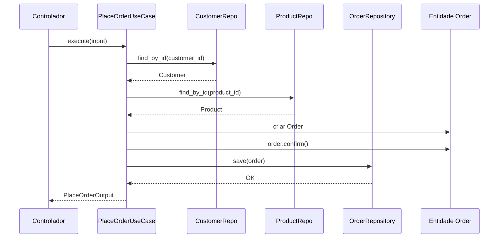

# Entidades e Casos de Uso

Entidades e Casos de Uso formam as duas camadas mais internas da Arquitetura Limpa. Juntos, eles contêm **toda** a lógica de negócio. Nada nessas camadas depende de frameworks, bancos de dados ou sistemas externos.

> [!NOTE]
> **Entidades** representam regras de negócio de toda a empresa. **Casos de Uso** representam regras de negócio específicas da aplicação. A distinção é sobre escopo, não tecnologia.

## Entidades: Regras de Negócio Empresariais

```python
from dataclasses import dataclass, field
from decimal import Decimal
from enum import Enum, auto
from typing import List


class OrderStatus(Enum):
    PENDING = auto()
    CONFIRMED = auto()
    SHIPPED = auto()
    DELIVERED = auto()
    CANCELLED = auto()


@dataclass
class Address:
    street: str
    city: str
    state: str
    zip_code: str
    country: str

    def is_valid(self) -> bool:
        return all([self.street, self.city, self.country])


@dataclass
class Customer:
    customer_id: str
    name: str
    email: str
    shipping_address: Address | None = None

    def update_email(self, new_email: str) -> None:
        if "@" not in new_email:
            raise ValueError("Email inválido")
        self.email = new_email


@dataclass
class OrderItem:
    product_id: str
    product_name: str
    quantity: int
    unit_price: Decimal

    def total_price(self) -> Decimal:
        return Decimal(str(self.quantity)) * self.unit_price


@dataclass
class Order:
    order_id: str
    customer: Customer
    items: List[OrderItem] = field(default_factory=list)
    status: OrderStatus = OrderStatus.PENDING

    def add_item(self, item: OrderItem) -> None:
        if self.status != OrderStatus.PENDING:
            raise ValueError("Não pode modificar pedido não-pendente")
        self.items.append(item)

    def confirm(self) -> None:
        if self.status != OrderStatus.PENDING:
            raise ValueError("Apenas pedidos pendentes podem ser confirmados")
        if not self.items:
            raise ValueError("Não pode confirmar pedido vazio")
        self.status = OrderStatus.CONFIRMED

    def cancel(self) -> None:
        if self.status in (OrderStatus.SHIPPED, OrderStatus.DELIVERED):
            raise ValueError("Não pode cancelar pedido enviado ou entregue")
        self.status = OrderStatus.CANCELLED
```

> [!TIP]
> Entidades devem ser **puras** — sem imports de frameworks, sem mapeamentos ORM, sem lógica de serialização. São classes Python simples com métodos de negócio.

## Princípios de Design de Entidades

| Princípio | Descrição | Exemplo |
|-----------|-----------|---------|
| Encapsulamento | Proteger estado interno | Propriedades, atributos privados |
| Autovalidação | Proteger contra estados inválidos | Verificações em setters |
| Rico em comportamento | Métodos, não getters/setters | `order.confirm()`, não `order.status = "confirmed"` |
| Ignorante de persistência | Sem consciência de BD/ORM | Sem `save()`, sem atributo `objects` |
| Livre de framework | Sem imports de frameworks | Sem modelos Django, sem imports Flask |

## Casos de Uso: Regras de Negócio da Aplicação

```python
from abc import ABC, abstractmethod
from dataclasses import dataclass
from decimal import Decimal


@dataclass
class PlaceOrderInput:
    customer_id: str
    items: list[dict]


@dataclass
class PlaceOrderOutput:
    order_id: str
    total: Decimal
    status: str


class CustomerRepository(ABC):
    @abstractmethod
    def find_by_id(self, customer_id: str) -> Customer | None: ...


class ProductRepository(ABC):
    @abstractmethod
    def find_by_id(self, product_id: str) -> "Product | None": ...


class OrderRepository(ABC):
    @abstractmethod
    def save(self, order: Order) -> None: ...


class PlaceOrderUseCase:
    def __init__(self, customer_repo: CustomerRepository, product_repo: ProductRepository, order_repo: OrderRepository):
        self._customer_repo = customer_repo
        self._product_repo = product_repo
        self._order_repo = order_repo

    def execute(self, input_data: PlaceOrderInput) -> PlaceOrderOutput:
        customer = self._customer_repo.find_by_id(input_data.customer_id)
        if customer is None:
            raise ValueError(f"Cliente {input_data.customer_id} não encontrado")

        items = []
        for item_data in input_data.items:
            product = self._product_repo.find_by_id(item_data["product_id"])
            if product is None:
                raise ValueError(f"Produto {item_data['product_id']} não encontrado")
            items.append(OrderItem(product.product_id, product.name, item_data["quantity"], product.price))

        order = Order(order_id=self._generate_id(), customer=customer, items=items)
        order.confirm()
        self._order_repo.save(order)
        return PlaceOrderOutput(order_id=order.order_id, total=order.calculate_total(), status=order.status.name)

    def _generate_id(self) -> str:
        import uuid
        return str(uuid.uuid4())
```



## Um Caso de Uso = Uma Classe

> [!TIP]
> Um padrão comum é **um caso de uso por classe**. Isso dá a cada caso de uso uma única responsabilidade e os torna testáveis independentemente.

```python
# FAÇA ASSIM: Classes separadas para casos de uso separados
class RegisterUserUseCase:
    def execute(self, input_data) -> User: ...

class UpdateUserProfileUseCase:
    def execute(self, user_id, profile_data) -> User: ...

# NÃO ASSIM: Classe god com tudo
class UserManager:
    def register(self, ...): ...
    def update_profile(self, ...): ...
    def deactivate(self, ...): ...
    def send_welcome_email(self, ...): ...
```

## DTOs para Casos de Uso

```python
from dataclasses import dataclass
from decimal import Decimal
from typing import List, Optional


@dataclass
class CreateProductInput:
    name: str
    description: str
    price: Decimal
    category_id: str
    tags: List[str]


@dataclass
class ProductOutput:
    product_id: str
    name: str
    price: Decimal
```

## Testando Casos de Uso

```python
import pytest
from decimal import Decimal


def test_place_order_successfully():
    customer = Customer(customer_id="C1", name="Alice", email="alice@test.com")
    product = Product(product_id="P1", name="Widget", price=Decimal("10.00"), stock=5, category="Gadgets")

    customer_repo = InMemoryCustomerRepository([customer])
    product_repo = InMemoryProductRepository([product])
    order_repo = InMemoryOrderRepository()
    use_case = PlaceOrderUseCase(customer_repo, product_repo, order_repo)

    output = use_case.execute(PlaceOrderInput(customer_id="C1", items=[{"product_id": "P1", "quantity": 3}]))

    assert output.status == "CONFIRMED"
    assert output.total == Decimal("30.00")


def test_place_order_fails_for_nonexistent_customer():
    use_case = PlaceOrderUseCase(InMemoryCustomerRepository([]), InMemoryProductRepository(), InMemoryOrderRepository())
    with pytest.raises(ValueError, match="não encontrado"):
        use_case.execute(PlaceOrderInput(customer_id="FAKE", items=[]))
```

## Entidade vs Caso de Uso

| Pergunta | Colocar na Entidade | Colocar no Caso de Uso |
|----------|--------------------|------------------------|
| Esta regra muda por aplicação? | Não | Sim |
| É uma regra de negócio universal? | Sim | Não |
| Depende de dados externos? | Não | Sim |
| Orquestra múltiplas entidades? | Não | Sim |
| Envolve I/O (BD, API, arquivo)? | Não | Sim |

## Composição de Casos de Uso

```python
class CheckoutUseCase:
    def __init__(self, place_order: PlaceOrderUseCase, process_payment: ProcessPaymentUseCase,
                 send_confirmation: SendConfirmationUseCase, update_inventory: UpdateInventoryUseCase):
        self._place_order = place_order
        self._process_payment = process_payment
        self._send_confirmation = send_confirmation
        self._update_inventory = update_inventory

    def execute(self, input_data: CheckoutInput) -> CheckoutOutput:
        order_output = self._place_order.execute(PlaceOrderInput(customer_id=input_data.customer_id, items=input_data.items))
        payment_output = self._process_payment.execute(ProcessPaymentInput(customer_id=input_data.customer_id, amount=order_output.total))
        for item in input_data.items:
            self._update_inventory.execute(UpdateInventoryInput(product_id=item["product_id"], quantity_reduced=item["quantity"]))
        self._send_confirmation.execute(SendConfirmationInput(customer_id=input_data.customer_id, order_id=order_output.order_id))
        return CheckoutOutput(order_id=order_output.order_id, transaction_id=payment_output.transaction_id, total=order_output.total)
```

## Antipadrões Comuns

| Antipadrão | Descrição | Correção |
|------------|-----------|----------|
| Entidade Anêmica | Entidade é um saco de dados sem métodos | Mover lógica relacionada para a entidade |
| Caso de Uso Gordo | Caso de uso faz coisas demais | Dividir em casos de uso focados |
| Pular Entidades | Toda lógica em casos de uso | Extrair regras compartilhadas para entidades |
| Repositório na Entidade | Entidade chama banco de dados | Mover persistência para caso de uso via repositório |

## Exercícios Práticos

1. **Construa uma Entidade**: Crie uma entidade `BankAccount` com métodos `deposit(amount)`, `withdraw(amount)`, `transfer_to(target, amount)`.

2. **Crie um Caso de Uso**: Escreva um `TransferMoneyUseCase` que depende de `AccountRepository` (interface) e usa a entidade `BankAccount`.

3. **Entidade vs Caso de Uso**: A regra "Pedidos acima de R$100 têm frete grátis" deve estar na entidade ou no caso de uso? Justifique.

4. **Teste um Caso de Uso**: Escreva testes pytest para `CancelOrderUseCase`. Inclua testes para cancelamento bem-sucedido e falha.

5. **Anêmico para Rico**: Refatore esta entidade anêmica para ser rica em comportamento:
   ```python
   @dataclass
   class Booking:
       id: str; room_id: str; guest_name: str; check_in: str; check_out: str; status: str; total: float
   ```

6. **Caso de Uso Composto**: Escreva um `BookRoomUseCase` que compõe: `ValidateRoomAvailabilityUseCase`, `CreateBookingUseCase`, `ChargeDepositUseCase`.

7. **Padrão Repositório In-Memory**: Implemente `InMemoryBookingRepository` com `save`, `find_by_id`, `find_by_room_and_date`.

8. **Design de DTO**: Projete DTOs de entrada e saída para um `SearchFlightsUseCase`.

> [!SUCCESS]
> Entidades guardam o **o quê** e Casos de Uso guardam o **como**. Mantenha entidades livres de framework e casos de uso focados em orquestração.

## O Fluxo de um Caso de Uso

Cada caso de uso segue um padrão padrão:

1. **Receber entrada** do controlador
2. **Validar** a entrada (regras de negócio)
3. **Buscar** entidades necessárias dos repositórios
4. **Orquestrar** métodos das entidades para realizar a operação
5. **Persistir** mudanças através dos repositórios
6. **Retornar saída** para o apresentador

```python
class CancelOrderUseCase:
    def __init__(self, order_repo: OrderRepository, notification_service: NotificationService):
        self._order_repo = order_repo
        self._notification = notification_service

    def execute(self, order_id: str, reason: str) -> None:
        order = self._order_repo.find_by_id(order_id)
        if order is None:
            raise ValueError("Pedido não encontrado")
        
        order.cancel()
        self._order_repo.save(order)
        
        self._notification.send(
            recipient=order.customer.email,
            subject="Pedido Cancelado",
            body=f"Seu pedido {order_id} foi cancelado. Motivo: {reason}",
        )
```

## Quando Usar Entidade vs Caso de Uso

A distinção entre entidade e caso de uso é crucial. Aqui está uma regra prática:

```python
# ENTIDADE: Regra universal — aplica-se em qualquer contexto
class Money:
    def __init__(self, amount: Decimal, currency: str = "BRL"):
        if amount < 0:
            raise ValueError("Valor não pode ser negativo")
        self.amount = amount
        self.currency = currency

    def __add__(self, other: "Money") -> "Money":
        if self.currency != other.currency:
            raise ValueError("Moedas diferentes não podem ser somadas")
        return Money(self.amount + other.amount, self.currency)

# CASO DE USO: Regra específica — varia por aplicação
class CalculateShippingCostUseCase:
    def __init__(self, shipping_provider: ShippingProvider):
        self._provider = shipping_provider

    def execute(self, order: Order, zip_code: str) -> Money:
        weight = sum(item.quantity * 0.5 for item in order.items)
        return self._provider.calculate(weight, zip_code)
```

## Testes de Entidades

Entidades são as unidades mais fáceis de testar porque não têm dependências externas:

```python
import pytest
from decimal import Decimal

class TestOrderEntity:
    def test_initial_status_is_pending(self):
        customer = Customer("C1", "Alice", "a@test.com")
        order = Order("ORD-1", customer)
        assert order.status == OrderStatus.PENDING

    def test_confirm_changes_status(self):
        customer = Customer("C1", "Alice", "a@test.com")
        order = Order("ORD-1", customer)
        order.add_item(OrderItem("P1", "Widget", 1, Decimal("10.00")))
        order.confirm()
        assert order.status == OrderStatus.CONFIRMED

    def test_confirm_empty_order_raises_error(self):
        customer = Customer("C1", "Alice", "a@test.com")
        order = Order("ORD-1", customer)
        with pytest.raises(ValueError, match="vazio"):
            order.confirm()

    def test_cancel_pending_order(self):
        customer = Customer("C1", "Alice", "a@test.com")
        order = Order("ORD-1", customer)
        order.cancel()
        assert order.status == OrderStatus.CANCELLED

    def test_cancel_shipped_order_raises_error(self):
        customer = Customer("C1", "Alice", "a@test.com")
        order = Order("ORD-1", customer)
        order.status = OrderStatus.SHIPPED
        with pytest.raises(ValueError, match="cancelar"):
            order.cancel()

    def test_calculate_total(self):
        customer = Customer("C1", "Alice", "a@test.com")
        order = Order("ORD-1", customer)
        order.add_item(OrderItem("P1", "Widget", 2, Decimal("10.00")))
        order.add_item(OrderItem("P2", "Gadget", 1, Decimal("25.00")))
        assert order.calculate_total() == Decimal("45.00")

    def test_add_item_to_confirmed_order_fails(self):
        customer = Customer("C1", "Alice", "a@test.com")
        order = Order("ORD-1", customer)
        order.add_item(OrderItem("P1", "Widget", 1, Decimal("10.00")))
        order.confirm()
        with pytest.raises(ValueError, match="pendente"):
            order.add_item(OrderItem("P2", "Gadget", 1, Decimal("25.00")))
```

> [!NOTE]
> Os testes de entidade são puros, rápidos e não requerem configuração. Eles são a primeira linha de defesa contra bugs de lógica de negócio.

## Bônus: Checklist para Projetar Entidades e Casos de Uso

**Para Entidades:**
- [ ] A entidade contém apenas regras de negócio universais?
- [ ] A entidade não importa nada de frameworks?
- [ ] A entidade não tem métodos de persistência (save, delete)?
- [ ] A entidade valida seu próprio estado?
- [ ] Os métodos revelam intenção de negócio (confirm, cancel, ship)?

**Para Casos de Uso:**
- [ ] O caso de uso tem uma única responsabilidade?
- [ ] O caso de uso depende apenas de abstrações (interfaces/protocols)?
- [ ] Os DTOs de entrada/saída são objetos simples (dataclasses)?
- [ ] O caso de uso orquestra entidades sem conter lógica de entidade?
- [ ] O caso de uso é testável sem infraestrutura real?

> [!SUCCESS]
> Entidades bem projetadas e casos de uso focados são o coração de um sistema sustentável.
