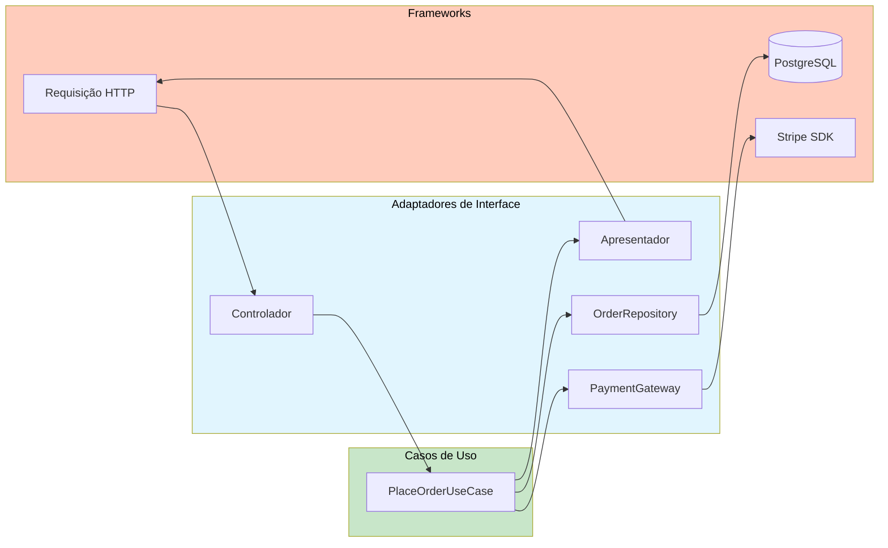

# Adaptadores de Interface

Os Adaptadores de Interface são a camada intermediária na Arquitetura Limpa. Eles ficam entre os casos de uso (interno) e os frameworks (externo), traduzindo dados entre formatos convenientes para cada lado.

> [!NOTE]
> A camada de adaptadores existe para que nem as camadas internas conheçam frameworks, nem os frameworks precisem se conformar com interfaces internas. O adaptador traduz em ambas as direções.

## O Papel dos Adaptadores de Interface

| Tipo de Adaptador | Fonte de Entrada | Destino da Saída | Traduz |
|-------------------|-----------------|-------------------|--------|
| Controlador | Requisição HTTP / CLI / Fila | DTO do Caso de Uso | Formato externo → formato interno |
| Apresentador | DTO do Caso de Uso | Resposta HTTP / View / CLI | Formato interno → formato externo |
| Gateway / Repositório | Banco de Dados / API | Interface do Caso de Uso | Interface interna → SDK externo |



## Controladores: De HTTP para Casos de Uso

```python
import json
from dataclasses import dataclass


@dataclass
class PlaceOrderInput:
    customer_id: str
    items: list[dict]


class PlaceOrderController:
    def __init__(self, use_case: "PlaceOrderUseCase"):
        self._use_case = use_case

    def handle(self, http_request: dict) -> dict:
        try:
            body = self._parse_body(http_request)
            self._validate(body)
            input_dto = PlaceOrderInput(customer_id=body["customer_id"], items=body["items"])
            output = self._use_case.execute(input_dto)
            return self._success_response(output)
        except ValueError as e:
            return self._error_response(400, str(e))
        except Exception:
            return self._error_response(500, "Erro interno do servidor")

    def _parse_body(self, request: dict) -> dict:
        raw = request.get("body", "{}")
        return json.loads(raw) if isinstance(raw, str) else raw

    def _validate(self, body: dict) -> None:
        if "customer_id" not in body:
            raise ValueError("customer_id é obrigatório")
        if "items" not in body or not body["items"]:
            raise ValueError("Pelo menos um item é obrigatório")

    def _success_response(self, data) -> dict:
        return {"status": 200, "body": {"success": True, "data": data}}

    def _error_response(self, status: int, message: str) -> dict:
        return {"status": status, "body": {"success": False, "error": message}}
```

## Apresentadores: De Casos de Uso para Respostas

```python
from dataclasses import dataclass
from decimal import Decimal
from datetime import datetime


@dataclass
class PlaceOrderOutput:
    order_id: str
    total: Decimal
    status: str
    created_at: datetime


class PlaceOrderPresenter:
    def present(self, output: PlaceOrderOutput) -> dict:
        return {
            "status": 201,
            "body": {
                "order_id": output.order_id,
                "total": float(output.total),
                "status": output.status,
                "created_at": output.created_at.isoformat(),
                "message": "Pedido realizado com sucesso",
            },
        }


class PlaceOrderCLIPresenter:
    def present(self, output: PlaceOrderOutput) -> str:
        return f"Pedido {output.order_id} criado!\nTotal: R$ {output.total:.2f}\nStatus: {output.status}"
```

## Repositórios: Ponte para Dados

```python
from abc import ABC, abstractmethod
from decimal import Decimal
from typing import Optional


class OrderRepository(ABC):
    @abstractmethod
    def save(self, order: "Order") -> None: ...
    @abstractmethod
    def find_by_id(self, order_id: str) -> Optional["Order"]: ...


import sqlite3
from datetime import datetime


class SQLiteOrderRepository(OrderRepository):
    def __init__(self, db_path: str):
        self._db_path = db_path
        self._init_db()

    def _init_db(self) -> None:
        with sqlite3.connect(self._db_path) as conn:
            conn.execute("CREATE TABLE IF NOT EXISTS orders (order_id TEXT PRIMARY KEY, customer_email TEXT, total REAL, status TEXT, created_at TEXT)")
            conn.execute("CREATE TABLE IF NOT EXISTS order_items (id INTEGER PRIMARY KEY AUTOINCREMENT, order_id TEXT, product_id TEXT, product_name TEXT, quantity INTEGER, unit_price REAL)")

    def save(self, order: "Order") -> None:
        with sqlite3.connect(self._db_path) as conn:
            conn.execute("INSERT OR REPLACE INTO orders VALUES (?, ?, ?, ?, ?)",
                         (order.order_id, order.customer.email, float(order.calculate_total()),
                          order.status.name, datetime.now().isoformat()))
            for item in order.items:
                conn.execute("INSERT INTO order_items (order_id, product_id, product_name, quantity, unit_price) VALUES (?, ?, ?, ?, ?)",
                             (order.order_id, item.product_id, item.product_name, item.quantity, float(item.unit_price)))

    def find_by_id(self, order_id: str) -> Optional["Order"]:
        with sqlite3.connect(self._db_path) as conn:
            row = conn.execute("SELECT * FROM orders WHERE order_id = ?", (order_id,)).fetchone()
            if row is None:
                return None
            return self._row_to_order(row, conn)
```

## Gateways: Adaptadores de Serviços Externos

```python
from abc import ABC, abstractmethod


class PaymentGateway(ABC):
    @abstractmethod
    def charge(self, customer_email: str, amount: float) -> str: ...
    @abstractmethod
    def refund(self, transaction_id: str) -> float: ...


class StripePaymentGateway(PaymentGateway):
    def __init__(self, api_key: str):
        import stripe
        stripe.api_key = api_key
        self._stripe = stripe

    def charge(self, customer_email: str, amount: float) -> str:
        charge = self._stripe.Charge.create(amount=int(amount * 100), currency="usd", receipt_email=customer_email)
        return charge.id

    def refund(self, transaction_id: str) -> float:
        refund = self._stripe.Refund.create(charge=transaction_id)
        return float(refund.amount) / 100.0


class FakePaymentGateway(PaymentGateway):
    def __init__(self):
        self.charges = []

    def charge(self, customer_email: str, amount: float) -> str:
        txn_id = f"txn_{len(self.charges) + 1}"
        self.charges.append({"email": customer_email, "amount": amount, "id": txn_id})
        return txn_id

    def refund(self, transaction_id: str) -> float:
        return sum(c["amount"] for c in self.charges if c["id"] == transaction_id)
```

## Mapeamento de Dados através de Limites

> [!WARNING]
> Nunca passe modelos ORM ou objetos de requisição HTTP para casos de uso. Sempre crie **DTOs específicos do limite**.

```python
# RUIM: Passando modelo ORM
from django.http import HttpRequest

def checkout_view(request: HttpRequest):
    ...

# BOM: Adaptadores isolam as camadas
# views.py (adaptador Django)
def checkout_view(django_request: HttpRequest):
    controller = checkout_controller()
    adapted_request = {"method": django_request.method, "body": django_request.body.decode(), "headers": dict(django_request.headers)}
    response = controller.handle(adapted_request)
    return JsonResponse(response["body"], status=response["status"])
```

## Testando Adaptadores de Interface

```python
def test_controller_parses_request_correctly():
    use_case = FakeUseCase()
    controller = PlaceOrderController(use_case)
    request = {"body": '{"customer_id": "C1", "items": [{"product_id": "P1", "quantity": 2}]}'}
    response = controller.handle(request)
    assert response["status"] == 200
    assert use_case.last_input.customer_id == "C1"


def test_controller_returns_400_for_missing_fields():
    controller = PlaceOrderController(FakeUseCase())
    response = controller.handle({"body": "{}"})
    assert response["status"] == 400


def test_presenter_formats_output_correctly():
    presenter = PlaceOrderPresenter()
    output = PlaceOrderOutput(order_id="ORD-001", total=Decimal("49.99"), status="CONFIRMED", created_at=datetime.now())
    result = presenter.present(output)
    assert result["status"] == 201
    assert result["body"]["order_id"] == "ORD-001"


class FakeUseCase:
    def __init__(self):
        self.last_input = None

    def execute(self, input_dto):
        self.last_input = input_dto
        return PlaceOrderOutput(order_id="ORD-001", total=Decimal("49.99"), status="CONFIRMED", created_at=datetime.now())
```

## Resumo dos Adaptadores de Interface

| Adaptador | Entrada | Saída | Responsabilidade |
|-----------|---------|-------|------------------|
| Controlador | Requisição HTTP | DTO do Caso de Uso | Parse, validar, traduzir |
| Apresentador | Saída do Caso de Uso | Resposta HTTP | Formatar, serializar |
| Repositório | Interface do Repositório | SQL / ORM | Tradução de persistência |
| Gateway | Interface do Gateway | API Externa | Integração de serviços |

## Exercícios Práticos

1. **Construa um Controlador**: Escreva um `RegisterUserController` que recebe uma requisição HTTP, valida e chama um `RegisterUserUseCase`.

2. **Construa um Apresentador**: Crie dois apresentadores para `GenerateReportOutput`: `JSONReportPresenter` e `CSVReportPresenter`.

3. **Implemente um Repositório**: Crie um `MongoDBUserRepository` que implementa uma interface `UserRepository`.

4. **Construa um Gateway**: Escreva um `TwilioSMSGateway` que implementa `SMSGateway` com `send_sms(phone_number, message)`.

5. **Teste um Controlador**: Escreva testes para o `PlaceOrderController`. Teste requisição válida, campos faltando e exceções.

6. **Teste um Repositório**: Escreva testes para `InMemoryUserRepository`: salvar, buscar por email, paginação e deletar.

7. **Conexão de Adaptadores**: Crie uma função que conecta: `FlaskRegisterController` → `RegisterUserUseCase` → `PostgresUserRepository`.

8. **Refatore para Adaptadores**: Pegue uma view Django que usa ORM e envia email diretamente. Refatore em controlador, caso de uso, repositório e gateway.

> [!SUCCESS]
> Adaptadores de interface são o encanamento que faz a Arquitetura Limpa funcionar. Eles traduzem, transformam e isolam — mantendo a lógica de negócio pura.

## Exemplo Completo de Adaptador de Banco de Dados

Aqui está um exemplo completo de um adaptador de repositório PostgreSQL para usuários:

```python
from typing import Optional
import psycopg2
from psycopg2.extras import RealDictCursor


class PostgresUserRepository:
    def __init__(self, connection_string: str):
        self._conn_string = connection_string

    def save(self, user: User) -> None:
        conn = psycopg2.connect(self._conn_string)
        try:
            with conn.cursor() as cur:
                cur.execute(
                    "INSERT INTO users (user_id, name, email, is_active) "
                    "VALUES (%s, %s, %s, %s) "
                    "ON CONFLICT (user_id) DO UPDATE SET "
                    "name = EXCLUDED.name, email = EXCLUDED.email, is_active = EXCLUDED.is_active",
                    (user.user_id, user.name, user.email, user.is_active),
                )
            conn.commit()
        finally:
            conn.close()

    def find_by_id(self, user_id: str) -> Optional[User]:
        conn = psycopg2.connect(self._conn_string)
        try:
            with conn.cursor(cursor_factory=RealDictCursor) as cur:
                cur.execute("SELECT * FROM users WHERE user_id = %s", (user_id,))
                row = cur.fetchone()
                return User(**row) if row else None
        finally:
            conn.close()

    def find_by_email(self, email: str) -> Optional[User]:
        conn = psycopg2.connect(self._conn_string)
        try:
            with conn.cursor(cursor_factory=RealDictCursor) as cur:
                cur.execute("SELECT * FROM users WHERE email = %s", (email,))
                row = cur.fetchone()
                return User(**row) if row else None
        finally:
            conn.close()
```

## O Padrão Apresentador em Detalhe

O apresentador é responsável por formatar a saída do caso de uso. Isso permite que o mesmo caso de uso sirva diferentes interfaces:

```python
from dataclasses import dataclass
from typing import List


@dataclass
class ProductListOutput:
    products: List[dict]
    total_count: int
    page: int


class JSONProductListPresenter:
    def present(self, output: ProductListOutput) -> dict:
        return {
            "status": 200,
            "body": {
                "products": output.products,
                "total": output.total_count,
                "page": output.page,
                "total_pages": (output.total_count + 19) // 20,
            },
        }


class HTMLProductListPresenter:
    def present(self, output: ProductListOutput) -> str:
        rows = "\n".join(
            f"<tr><td>{p['name']}</td><td>R$ {p['price']:.2f}</td></tr>"
            for p in output.products
        )
        return f"<table><tr><th>Produto</th><th>Preço</th></tr>{rows}</table>"


class CSVPresenter:
    def present(self, output: ProductListOutput) -> str:
        lines = ["nome,preco"]
        lines.extend(f"{p['name']},{p['price']}" for p in output.products)
        return "\n".join(lines)
```

## Controladores e Validação

Uma responsabilidade importante do controlador é a validação do formato da entrada. A validação de regras de negócio fica nos casos de uso.

```python
# Controlador valida FORMATO
class CreateUserController:
    def handle(self, request: dict) -> dict:
        try:
            body = request.get("body", {})
            
            # Validação de formato (responsabilidade do controlador)
            if not isinstance(body.get("name"), str) or len(body["name"].strip()) == 0:
                return {"status": 400, "body": {"error": "Nome deve ser uma string não vazia"}}
            if not isinstance(body.get("email"), str) or "@" not in body["email"]:
                return {"status": 400, "body": {"error": "Email inválido"}}
            if not isinstance(body.get("age"), int) or body["age"] < 0:
                return {"status": 400, "body": {"error": "Idade deve ser um número positivo"}}
            
            input_dto = CreateUserInput(name=body["name"].strip(), email=body["email"].strip(), age=body["age"])
            output = self._use_case.execute(input_dto)
            return {"status": 201, "body": {"success": True, "user_id": output.user_id}}
            
        except ValueError as e:
            return {"status": 400, "body": {"error": str(e)}}
```

## Testando Adaptadores

```python
def test_sqlite_order_repository():
    import tempfile
    with tempfile.NamedTemporaryFile() as f:
        repo = SQLiteOrderRepository(f.name)
        customer = Customer("C1", "Alice", "a@test.com")
        order = Order("ORD-1", customer)
        order.add_item(OrderItem("P1", "Widget", 2, Decimal("10.00")))

        repo.save(order)

        retrieved = repo.find_by_id("ORD-1")
        assert retrieved is not None
        assert retrieved.order_id == "ORD-1"
        assert len(retrieved.items) == 1
```

## Adaptadores e Performance

| Operação | Adaptador | Tempo Aproximado |
|----------|-----------|------------------|
| Salvar pedido | InMemoryOrderRepository | < 1µs |
| Salvar pedido | SQLiteOrderRepository | ~100µs |
| Salvar pedido | PostgresOrderRepository | ~1ms |
| Cobrar cartão | FakePaymentGateway | < 1µs |
| Cobrar cartão | StripePaymentGateway | ~200ms |

> [!TIP]
> Use adaptadores in-memory para testes e desenvolvimento local. Troque para implementações reais em produção através da raiz de composição.

> [!SUCCESS]
> Adaptadores de interface são a ponte entre o mundo ideal da lógica de negócio e o mundo real dos frameworks e infraestrutura.
