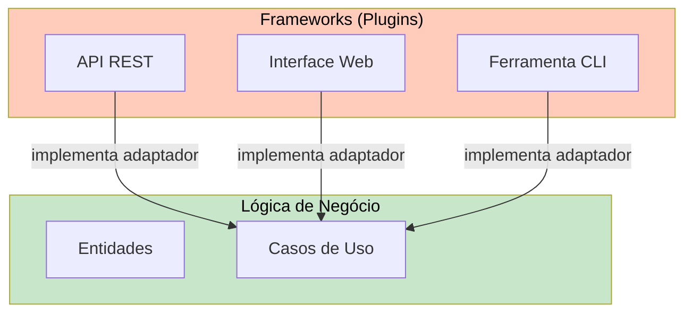

# Frameworks e Externalidades

Na Arquitetura Limpa, frameworks e ferramentas externas são **detalhes** — eles são a camada mais externa, não a fundação. Esta lição mostra como manter sua lógica de negócio independente de frameworks enquanto ainda aproveita ferramentas poderosas.

> [!NOTE]
> Frameworks são ferramentas, não arquiteturas. Uma boa arquitetura permite usar um framework sem estar acoplado a ele. Você deve poder trocar Flask por FastAPI sem mudar uma linha de lógica de negócio.

## Frameworks como Plugins



## Acoplamento de Framework: Antes e Depois

```python
# ANTES: Fortemente acoplado ao Flask
from flask import Flask, request, jsonify
from flask_sqlalchemy import SQLAlchemy

app = Flask(__name__)
db = SQLAlchemy(app)

class UserModel(db.Model):
    id = db.Column(db.Integer, primary_key=True)
    name = db.Column(db.String(80))
    email = db.Column(db.String(120))

@app.route("/users", methods=["POST"])
def create_user():
    data = request.get_json()
    if len(data["name"]) < 3:
        return jsonify({"error": "Nome muito curto"}), 400
    user = UserModel(name=data["name"], email=data["email"])
    db.session.add(user)
    db.session.commit()
    return jsonify({"id": user.id, "name": user.name}), 201


# DEPOIS: Flask é apenas um plugin
# entities.py
from dataclasses import dataclass

@dataclass
class User:
    user_id: str
    name: str
    email: str

    def validate(self) -> None:
        if len(self.name) < 3:
            raise ValueError("Nome muito curto")
        if "@" not in self.email:
            raise ValueError("Email inválido")


# use_cases.py
class CreateUserUseCase:
    def __init__(self, repo: "UserRepository"):
        self._repo = repo

    def execute(self, name: str, email: str) -> User:
        user = User(user_id=self._generate_id(), name=name, email=email)
        user.validate()
        self._repo.save(user)
        return user
```

> [!WARNING]
> Quando decoradores de framework (`@app.route`, `@db.Model`) aparecem na sua lógica de negócio, você acoplou seu sistema àquele framework. Sempre mantenha decoradores de framework na camada de adaptador.

## A Armadilha do Framework

| Armadilha | Sintoma | Consequência |
|-----------|---------|--------------|
| Design framework-first | Começar com `Flask(__name__)` | Lógica de negócio é secundária |
| Modelos ORM como entidades | `class User(db.Model)` | Não pode testar sem BD |
| Poluição de decoradores | `@app.route` na lógica | Mudar framework = reescrever |
| Acoplamento de configuração | `app.config` em todo lugar | Configuração vaza do framework |

## Banco de Dados como Detalhe

```python
from abc import ABC, abstractmethod
from typing import Optional


class ProductRepository(ABC):
    @abstractmethod
    def save(self, product) -> None: ...
    @abstractmethod
    def find_by_id(self, product_id: str) -> Optional: ...


class PostgresProductRepository(ProductRepository):
    def __init__(self, connection_string: str):
        self._conn_string = connection_string

    def save(self, product) -> None:
        import psycopg2
        conn = psycopg2.connect(self._conn_string)
        with conn.cursor() as cur:
            cur.execute("INSERT INTO products VALUES (%s, %s, %s, %s) ON CONFLICT (id) DO UPDATE SET ...",
                        (product.id, product.name, product.price, product.stock))
        conn.commit()
        conn.close()


class InMemoryProductRepository(ProductRepository):
    def __init__(self):
        self._products = {}

    def save(self, product) -> None:
        self._products[product.product_id] = product

    def find_by_id(self, product_id: str) -> Optional:
        return self._products.get(product_id)
```

## Frameworks Web como Detalhes

```python
# fastapi_adapter.py
from fastapi import FastAPI, HTTPException
from pydantic import BaseModel

app = FastAPI()

class OrderRequest(BaseModel):
    customer_id: str
    items: list[dict]

@app.post("/orders")
def place_order(request: OrderRequest):
    use_case = create_order_use_case()
    try:
        result = use_case.execute(customer_id=request.customer_id, items=request.items)
        return result
    except ValueError as e:
        raise HTTPException(status_code=400, detail=str(e))


# flask_adapter.py
from flask import Blueprint, request, jsonify

orders_bp = Blueprint("orders", __name__)

@orders_bp.route("/orders", methods=["POST"])
def place_order():
    use_case = create_order_use_case()
    data = request.get_json()
    try:
        result = use_case.execute(customer_id=data["customer_id"], items=data["items"])
        return jsonify(result), 201
    except ValueError as e:
        return jsonify({"error": str(e)}), 400
```

## Configuração como Detalhe

```python
from dataclasses import dataclass


@dataclass
class AppConfig:
    database_url: str
    stripe_api_key: str
    smtp_host: str
    log_level: str


def create_app_config() -> AppConfig:
    import os
    return AppConfig(
        database_url=os.environ["DATABASE_URL"],
        stripe_api_key=os.environ["STRIPE_API_KEY"],
        smtp_host=os.environ.get("SMTP_HOST", "localhost"),
        log_level=os.environ.get("LOG_LEVEL", "INFO"),
    )
```

## Log como Detalhe

```python
from abc import ABC, abstractmethod
from enum import Enum


class LogLevel(Enum):
    DEBUG = "DEBUG"
    INFO = "INFO"
    WARNING = "WARNING"
    ERROR = "ERROR"


class Logger(ABC):
    @abstractmethod
    def log(self, level: LogLevel, message: str) -> None: ...

    def info(self, message: str) -> None:
        self.log(LogLevel.INFO, message)


class StdoutLogger(Logger):
    def log(self, level: LogLevel, message: str) -> None:
        print(f"[{level.value}] {message}")
```

## Migração de Framework no Mundo Real

```python
# CENÁRIO: Migrando de Flask para FastAPI
# ÚNICOS arquivos que mudam:

# ANTES: flask_adapter.py
@orders_bp.route("/orders/<order_id>", methods=["GET"])
def get_order(order_id):
    use_case = get_order_use_case()
    result = use_case.execute(order_id=order_id)
    return jsonify(result)

# DEPOIS: fastapi_adapter.py
@router.get("/orders/{order_id}")
def get_order(order_id: str):
    use_case = get_order_use_case()
    return use_case.execute(order_id=order_id)


# Todo o resto permanece igual:
# - use_cases/get_order.py  → INALTERADO
# - entities/order.py        → INALTERADO
# - repositories/*.py        → INALTERADO
# - tests/*.py                → INALTERADO
```

> [!SUCCESS]
> Quando frameworks são tratados como detalhes, migrar do Flask para FastAPI é questão de reescrever um arquivo adaptador — não a aplicação inteira.

## Lista de Verificação para Seleção de Framework

| Critério | Pergunta | Por Que Importa |
|----------|----------|-----------------|
| Acoplamento | Este framework força minhas entidades a herdar dele? | Acoplamento ORM = entidades não testáveis |
| Testabilidade | Posso testar minha lógica sem executar o framework? | Testes lentos = testes ignorados |
| Custo de troca | Quantos arquivos mudam se eu trocar de framework? | Menos = melhor arquitetura |

## Exercícios Práticos

1. **Auditoria de framework**: Examine um projeto que você trabalha. Liste todos os arquivos que mudariam se você trocasse o framework web.

2. **Troque um banco de dados**: Pegue um repositório baseado em SQLAlchemy e implemente uma versão MongoDB. O caso de uso não deve mudar.

3. **Abstraia um serviço de email**: Crie uma interface `EmailSender` e duas implementações: `SmtpSender` e `SendGridSender`.

4. **Injeção de configuração**: Refatore um caso de uso que lê `os.environ["API_KEY"]` diretamente. Injete a chave via construtor.

5. **Adaptador de framework**: Crie um adaptador FastAPI e um Flask para o mesmo `CreateProductUseCase`.

6. **Desacoplamento de ORM**: Pegue um modelo Django que mistura lógica de entidade e separe em entidade + repositório.

7. **Limite assíncrono**: Crie um caso de uso que chama uma interface `Logger`. Forneça implementações `SyncLogger` e `AsyncLogger`.

8. **Plano de migração**: Escreva um plano passo a passo para migrar um monólito Django para Arquitetura Limpa.

> [!SUCCESS]
> Frameworks são ferramentas, não fundações. Quando você os trata como detalhes, sua arquitetura sobrevive a atualizações, migrações e mudanças de tecnologia.

## Exemplo de Adaptador de Email

```python
from abc import ABC, abstractmethod


class EmailSender(ABC):
    @abstractmethod
    def send(self, to: str, subject: str, body: str) -> None: ...


class SmtpEmailSender(EmailSender):
    def __init__(self, host: str, port: int, username: str, password: str):
        self._host = host
        self._port = port
        self._username = username
        self._password = password

    def send(self, to: str, subject: str, body: str) -> None:
        import smtplib
        from email.mime.text import MIMEText

        msg = MIMEText(body)
        msg["Subject"] = subject
        msg["To"] = to
        msg["From"] = self._username

        with smtplib.SMTP(self._host, self._port) as server:
            server.starttls()
            server.login(self._username, self._password)
            server.send_message(msg)


class SendGridEmailSender(EmailSender):
    def __init__(self, api_key: str):
        self._api_key = api_key

    def send(self, to: str, subject: str, body: str) -> None:
        from sendgrid import SendGridAPIClient
        from sendgrid.helpers.mail import Mail

        message = Mail(from_email="noreply@example.com", to_emails=to, subject=subject, plain_text_content=body)
        sg = SendGridAPIClient(self._api_key)
        sg.send(message)


class FakeEmailSender(EmailSender):
    def __init__(self):
        self.sent_emails = []

    def send(self, to: str, subject: str, body: str) -> None:
        self.sent_emails.append({"to": to, "subject": subject, "body": body})
```

## Testando Decisões de Framework

```python
def test_use_case_has_no_framework_imports():
    import ast

    use_case_path = "src/use_cases/place_order.py"
    with open(use_case_path) as f:
        tree = ast.parse(f.read())

    forbidden = {"flask", "fastapi", "django", "sqlalchemy", "psycopg2"}
    for node in ast.walk(tree):
        if isinstance(node, ast.Import):
            for alias in node.names:
                root = alias.name.split(".")[0]
                assert root not in forbidden, f"Caso de uso importa framework: {alias.name}"
        elif isinstance(node, ast.ImportFrom):
            root = node.module.split(".")[0] if node.module else ""
            assert root not in forbidden, f"Caso de uso importa framework: {node.module}"
```

## Frameworks Assíncronos como Detalhes

```python
import asyncio
from abc import ABC, abstractmethod


class UseCase:
    """Síncrono — não sabe sobre async."""
    def __init__(self, email_sender: EmailSender):
        self._email_sender = email_sender

    def execute(self, user_email: str, message: str) -> None:
        self._email_sender.send(to=user_email, subject="Notificação", body=message)


# Adaptador async
class AsyncEmailSender(EmailSender):
    def send(self, to: str, subject: str, body: str) -> None:
        asyncio.create_task(self._async_send(to, subject, body))

    async def _async_send(self, to: str, subject: str, body: str) -> None:
        import aiosmtplib
        await aiosmtplib.send(body, hostname="localhost", recipients=[to], subject=subject)


# Controlador adapta chamada síncrona para async
class AsyncNotifyUserController:
    def __init__(self, use_case: UseCase):
        self._use_case = use_case

    async def handle(self, user_email: str, message: str) -> dict:
        await asyncio.to_thread(self._use_case.execute, user_email, message)
        return {"status": 200, "body": {"sent": True}}
```

> [!NOTE]
> Sua lógica de negócio não deve ter opinião sobre se executa síncrona ou assincronamente. O adaptador lida com o limite assíncrono.

## A Armadilha do Framework-First

Muitos desenvolvedores cometem o erro de começar um projeto configurando o framework primeiro:

```python
# ABORDAGEM FRAMEWORK-FIRST (evite)
# 1. django-admin startproject mysite
# 2. Configurar models.py
# 3. Configurar views.py
# 4. "Ah, e qual é a lógica de negócio mesmo?"

# ABORDAGEM LÓGICA-PRIMEIRO (prefira)
# 1. entities/ — modelar regras de negócio
# 2. use_cases/ — definir operações do sistema
# 3. tests/ — testar lógica sem framework
# 4. Adapter — conectar framework por último
```

## Checklist: Seu Framework é um Detalhe?

- [ ] Você pode trocar o framework web sem mudar a lógica de negócio?
- [ ] Você pode testar casos de uso sem iniciar o framework?
- [ ] As entidades não importam nada do framework?
- [ ] A configuração do framework está isolada em um módulo?
- [ ] Você pode executar os testes em < 1 segundo?
- [ ] As views/controllers têm menos de 50 linhas cada?

> [!WARNING]
> Evite desenvolvimento "framework-first". Nunca comece um projeto executando `npx create-react-app` ou `django-admin startproject`. Comece com a lógica de negócio, depois adicione o framework como um plugin.

> [!SUCCESS]
> Frameworks são ferramentas, não fundações. Quando você os trata como detalhes, sua arquitetura sobrevive a atualizações, migrações e mudanças de tecnologia.
