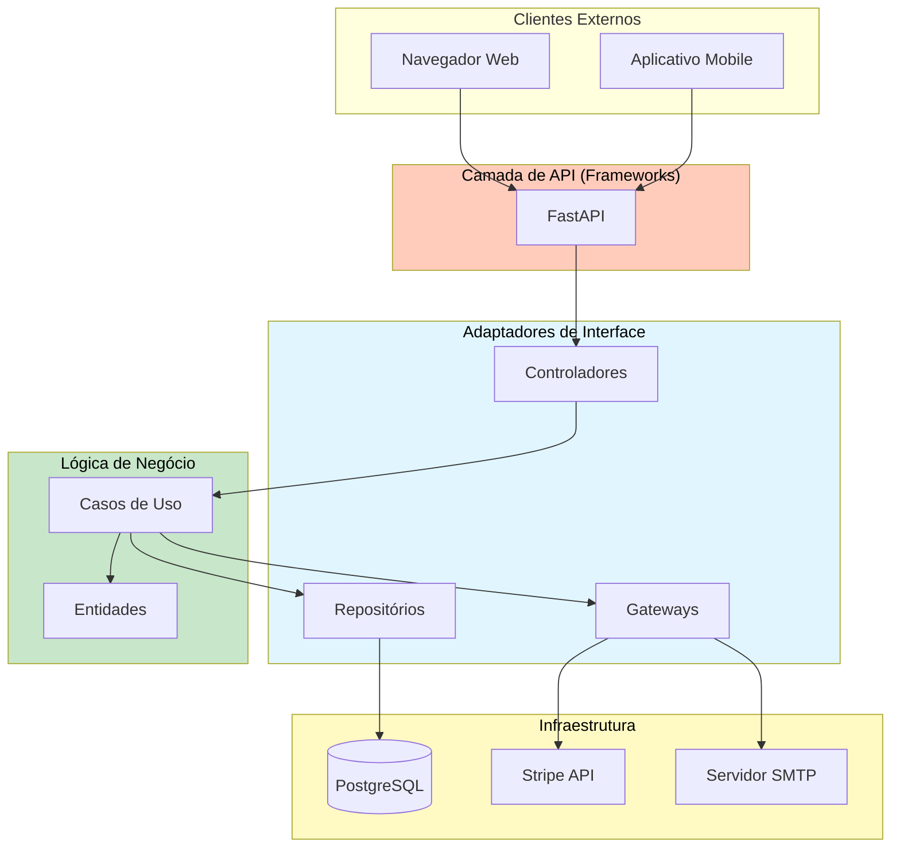
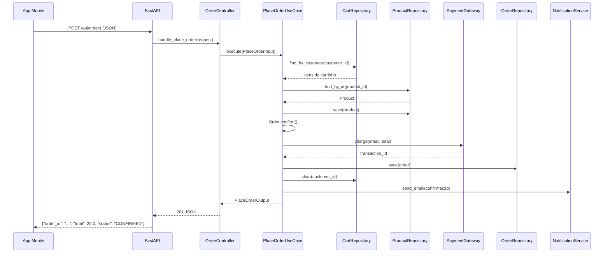

# Exemplo Real de Arquitetura

Esta lição reúne tudo construindo um sistema completo de **gerenciamento de pedidos de e-commerce** usando Arquitetura Limpa. Você verá cada camada — de entidades a adaptadores de framework — trabalhando juntos em uma aplicação realista.

> [!NOTE]
> O sistema lida com: catálogo de produtos, carrinho de compras, pedidos com pagamento, rastreamento e notificação. Toda a lógica de negócio é independente de framework e totalmente testável.

## Visão Geral do Sistema



## 1. Estrutura do Projeto

```
ecommerce/
  src/
    entities/
      product.py
      customer.py
      order.py
      cart.py
    use_cases/
      interfaces.py
      catalog/list_products.py
      cart/add_to_cart.py
      checkout/place_order.py
      tracking/cancel_order.py
    interface_adapters/
      controllers/order_controller.py
      presenters/order_presenter.py
      repositories/postgres_order_repo.py
      gateways/stripe_gateway.py
    frameworks/
      web/fastapi_app.py
      config.py
    main.py
  tests/
    test_entities/
    test_use_cases/
    test_adapters/
```

## 2. Camada de Entidades

```python
# entities/product.py
from dataclasses import dataclass
from decimal import Decimal
from typing import Optional


@dataclass
class Product:
    product_id: str
    name: str
    description: str
    price: Decimal
    stock: int
    category: str
    is_active: bool = True

    def can_be_purchased(self, quantity: int) -> bool:
        return self.is_active and self.stock >= quantity > 0

    def reduce_stock(self, quantity: int) -> None:
        if not self.can_be_purchased(quantity):
            raise ValueError(f"Estoque insuficiente para {self.name}")
        self.stock -= quantity

    def restock(self, quantity: int) -> None:
        if quantity <= 0:
            raise ValueError("Quantidade de reabastecimento deve ser positiva")
        self.stock += quantity


# entities/order.py
from enum import Enum, auto
from datetime import datetime


class OrderStatus(Enum):
    PENDING = auto()
    CONFIRMED = auto()
    SHIPPED = auto()
    DELIVERED = auto()
    CANCELLED = auto()


@dataclass
class OrderItem:
    product_id: str
    product_name: str
    quantity: int
    unit_price: Decimal

    def subtotal(self) -> Decimal:
        return Decimal(str(self.quantity)) * self.unit_price


@dataclass
class Order:
    order_id: str
    customer_id: str
    items: list = None
    status: OrderStatus = OrderStatus.PENDING
    total: Decimal = Decimal("0")
    created_at: datetime = None
    updated_at: datetime = None

    def __post_init__(self):
        if self.items is None:
            self.items = []
        if self.created_at is None:
            self.created_at = datetime.now()
        if self.updated_at is None:
            self.updated_at = datetime.now()

    def confirm(self) -> None:
        if self.status != OrderStatus.PENDING:
            raise ValueError(f"Não pode confirmar pedido no estado {self.status.name}")
        if not self.items:
            raise ValueError("Não pode confirmar um pedido vazio")
        self.status = OrderStatus.CONFIRMED
        self.updated_at = datetime.now()

    def cancel(self) -> None:
        if self.status in (OrderStatus.SHIPPED, OrderStatus.DELIVERED):
            raise ValueError(f"Não pode cancelar pedido no estado {self.status.name}")
        self.status = OrderStatus.CANCELLED
        self.updated_at = datetime.now()
```

## 3. Camada de Casos de Uso

```python
# use_cases/interfaces.py
from typing import Protocol, Optional, List
from decimal import Decimal


class ProductRepository(Protocol):
    def find_by_id(self, product_id: str) -> Optional[Product]: ...
    def save(self, product: Product) -> None: ...
    def search(self, query: str, page: int, size: int) -> tuple: ...


class CustomerRepository(Protocol):
    def find_by_id(self, customer_id: str) -> Optional[Customer]: ...
    def save(self, customer: Customer) -> None: ...


class OrderRepository(Protocol):
    def save(self, order: Order) -> None: ...
    def find_by_id(self, order_id: str) -> Optional[Order]: ...


class CartRepository(Protocol):
    def find_by_customer(self, customer_id: str) -> list: ...
    def clear(self, customer_id: str) -> None: ...


class PaymentGateway(Protocol):
    def charge(self, customer_email: str, amount: Decimal) -> str: ...


class NotificationService(Protocol):
    def send_email(self, to: str, subject: str, body: str) -> None: ...
```

```python
# use_cases/checkout/place_order.py
from dataclasses import dataclass


@dataclass
class PlaceOrderInput:
    customer_id: str


@dataclass
class PlaceOrderOutput:
    order_id: str
    total: float
    status: str
    item_count: int


class PlaceOrderUseCase:
    def __init__(self, customer_repo: CustomerRepository, product_repo: ProductRepository,
                 order_repo: OrderRepository, cart_repo: CartRepository,
                 payment_gateway: PaymentGateway, notification: NotificationService):
        self._customer_repo = customer_repo
        self._product_repo = product_repo
        self._order_repo = order_repo
        self._cart_repo = cart_repo
        self._payment = payment_gateway
        self._notification = notification

    def execute(self, input_dto: PlaceOrderInput) -> PlaceOrderOutput:
        customer = self._customer_repo.find_by_id(input_dto.customer_id)
        if customer is None:
            raise ValueError("Cliente não encontrado")

        cart_items = self._cart_repo.find_by_customer(input_dto.customer_id)
        if not cart_items:
            raise ValueError("Carrinho vazio")

        import uuid
        order = Order(order_id=str(uuid.uuid4()), customer_id=input_dto.customer_id)

        for cart_item in cart_items:
            product = self._product_repo.find_by_id(cart_item["product_id"])
            if product is None:
                raise ValueError(f"Produto {cart_item['product_id']} não encontrado")
            product.reduce_stock(cart_item["quantity"])
            order.items.append(OrderItem(product.product_id, product.name, cart_item["quantity"], product.price))
            self._product_repo.save(product)

        order.confirm()
        order.total = sum(i.subtotal() for i in order.items)
        txn_id = self._payment.charge(customer.email, order.total)
        self._order_repo.save(order)
        self._cart_repo.clear(input_dto.customer_id)

        self._notification.send_email(customer.email, "Pedido Confirmado",
                                      f"Seu pedido {order.order_id} foi confirmado. Total: R$ {order.total:.2f}")

        return PlaceOrderOutput(order_id=order.order_id, total=float(order.total),
                                status=order.status.name, item_count=len(order.items))
```

## 4. Camada de Adaptadores de Interface

```python
# controllers/order_controller.py

class OrderController:
    def __init__(self, place_order: "PlaceOrderUseCase", cancel_order: "CancelOrderUseCase"):
        self._place_order = place_order
        self._cancel_order = cancel_order

    def handle_place_order(self, request: dict) -> dict:
        try:
            body = request.get("body", {})
            output = self._place_order.execute(PlaceOrderInput(customer_id=body["customer_id"]))
            return {"status": 201, "body": {"success": True, "data": {
                "order_id": output.order_id, "total": output.total,
                "status": output.status, "item_count": output.item_count,
            }}}
        except ValueError as e:
            return {"status": 400, "body": {"success": False, "error": str(e)}}

    def handle_cancel_order(self, request: dict) -> dict:
        try:
            order_id = request["params"]["order_id"]
            self._cancel_order.execute(order_id)
            return {"status": 200, "body": {"success": True, "message": "Pedido cancelado"}}
        except ValueError as e:
            return {"status": 400, "body": {"success": False, "error": str(e)}}
```

```python
# repositories/postgres_order_repo.py
import psycopg2
from psycopg2.extras import RealDictCursor
from decimal import Decimal


class PostgresOrderRepository:
    def __init__(self, connection_string: str):
        self._conn_string = connection_string

    def save(self, order: Order) -> None:
        conn = psycopg2.connect(self._conn_string)
        with conn.cursor() as cur:
            cur.execute("INSERT INTO orders (order_id, customer_id, status, total, created_at) VALUES (%s, %s, %s, %s, %s) ON CONFLICT (order_id) DO UPDATE SET status=EXCLUDED.status",
                        (order.order_id, order.customer_id, order.status.name, str(order.total), order.created_at))
            for item in order.items:
                cur.execute("INSERT INTO order_items (order_id, product_id, product_name, quantity, unit_price) VALUES (%s, %s, %s, %s, %s)",
                            (order.order_id, item.product_id, item.product_name, item.quantity, str(item.unit_price)))
        conn.commit()
        conn.close()
```

## 5. Camada de Frameworks

```python
# frameworks/web/fastapi_app.py
from fastapi import FastAPI, HTTPException
from pydantic import BaseModel


class PlaceOrderRequest(BaseModel):
    customer_id: str


def create_fastapi_app(order_controller) -> FastAPI:
    app = FastAPI(title="API de E-Commerce")

    @app.post("/api/orders")
    def place_order(request: PlaceOrderRequest):
        response = order_controller.handle_place_order({"body": request.model_dump()})
        if response["status"] != 201:
            raise HTTPException(status_code=response["status"], detail=response["body"]["error"])
        return response["body"]["data"]

    return app
```

## 6. Raiz de Composição

```python
# main.py

def create_app() -> FastAPI:
    config = AppConfig.from_env()

    product_repo = PostgresProductRepository(config.database_url)
    customer_repo = PostgresCustomerRepository(config.database_url)
    order_repo = PostgresOrderRepository(config.database_url)
    cart_repo = RedisCartRepository(config.redis_url)
    payment_gateway = StripePaymentGateway(config.stripe_api_key)
    notification = SMTPNotificationService(host=config.smtp_host)

    place_order = PlaceOrderUseCase(customer_repo, product_repo, order_repo, cart_repo, payment_gateway, notification)
    cancel_order = CancelOrderUseCase(order_repo)
    order_controller = OrderController(place_order, cancel_order)

    return create_fastapi_app(order_controller)


if __name__ == "__main__":
    import uvicorn
    app = create_app()
    uvicorn.run(app, host="0.0.0.0", port=8000)
```

## 7. Testando o Sistema Real

```python
# tests/test_use_cases/test_place_order.py
import pytest
from decimal import Decimal


class TestPlaceOrderUseCase:
    @pytest.fixture
    def setup(self):
        customer = Customer(customer_id="C1", name="Alice", email="a@test.com")
        product = Product(product_id="P1", name="Widget", price=Decimal("10.00"), stock=5, category="Gadgets")

        customer_repo = InMemoryCustomerRepository()
        customer_repo.save(customer)
        product_repo = InMemoryProductRepository()
        product_repo.save(product)
        cart_repo = InMemoryCartRepository()
        cart_repo.save("C1", [{"product_id": "P1", "quantity": 2}])

        use_case = PlaceOrderUseCase(
            customer_repo=customer_repo, product_repo=product_repo,
            order_repo=InMemoryOrderRepository(), cart_repo=cart_repo,
            payment_gateway=FakePaymentGateway(), notification=FakeNotificationService(),
        )
        return use_case, customer, product

    def test_place_order_successfully(self, setup):
        use_case, customer, product = setup
        output = use_case.execute(PlaceOrderInput(customer_id="C1"))
        assert output.status == "CONFIRMED"
        assert output.total == 20.0
        assert output.item_count == 1

    def test_place_order_reduces_stock(self, setup):
        use_case, customer, product = setup
        use_case.execute(PlaceOrderInput(customer_id="C1"))
        assert product.stock == 3

    def test_place_order_empty_cart_fails(self, setup):
        use_case, customer, product = setup
        use_case._cart_repo.clear("C1")
        with pytest.raises(ValueError, match="vazio"):
            use_case.execute(PlaceOrderInput(customer_id="C1"))
```

## 8. Fluxo de Requisição Através do Sistema



## Decisões Arquiteturais Principais

| Decisão | Escolha | Justificativa |
|---------|---------|---------------|
| Framework web | FastAPI | Assíncrono, validação de tipos, docs OpenAPI |
| Banco de dados | PostgreSQL | ACID, suporte a JSON |
| Pagamento | Stripe | Global, API bem documentada |
| Notificação | SMTP + SendGrid | Entrega confiável de email |

## Exercícios Práticos

1. **Adicione uma nova entidade**: Crie uma entidade `Shipment` com `tracking_number`, `carrier`, `estimated_delivery` e um `ShipUseCase`.

2. **Construa um novo repositório**: Implemente `PostgresCustomerRepository` com CRUD completo.

3. **Crie um adaptador de notificação**: Implemente `TwilioSMSNotification` que implementa o Protocol `NotificationService`.

4. **Adicione um caso de uso**: Escreva um `ApplyCouponUseCase` que aplica desconto ao total do pedido.

5. **Teste end-to-end**: Escreva um teste que: cria cliente, adiciona produtos ao carrinho, faz pedido e verifica o status.

6. **Containerize a app**: Escreva um `Dockerfile` e `docker-compose.yml` para a aplicação com PostgreSQL e Redis.

7. **Adicione autenticação**: Estenda o sistema com um `LoginUseCase` e geração de token JWT.

8. **Teste de performance**: Meça a diferença entre usar `PostgresOrderRepository` e `InMemoryOrderRepository` em um teste.

> [!SUCCESS]
> Você completou o curso de Arquitetura Limpa. Agora você tem o conhecimento e os padrões para construir sistemas manteníveis, testáveis e independentes de framework. Comece aplicando esses princípios uma camada de cada vez.
