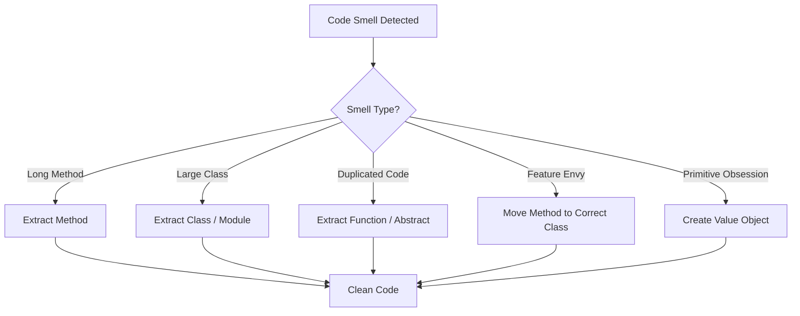
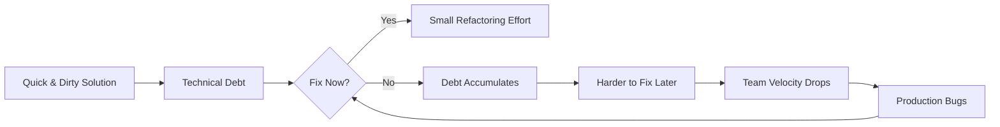
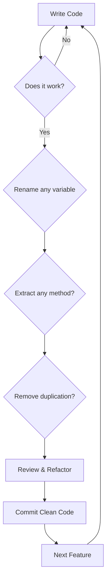

# What is Clean Code?

Clean code is code that is easy to read, understand, and maintain. It is not about writing clever one-liners or showing off language tricks — it is about communicating intent clearly to other developers (including your future self).

> [!NOTE]
> Robert C. Martin (Uncle Bob) popularized the term in his book *Clean Code*, but the philosophy has been around since the dawn of software engineering. The core idea: **code is read far more often than it is written.**

## Why Clean Code Matters

Software spends most of its life in maintenance mode. Studies show that developers spend **70–80% of their time reading code**, not writing it. Every hour you invest in writing clean code saves ten hours of future comprehension.

| Aspect | Messy Code | Clean Code |
|--------|-----------|------------|
| Time to understand | Hours or days | Minutes |
| Bug introduction rate | High | Low |
| Onboarding new devs | Painful | Smooth |
| Refactoring confidence | None | High |
| Team velocity | Declines over time | Sustained |

## The Boy Scout Rule

> [!TIP]
> **"Leave the campground cleaner than you found it."** — Boy Scouts of America

Applied to code: every time you touch a module, make it a little better than before. Fix one formatting issue, rename one unclear variable, extract one small function. Small improvements compound into massive gains.

```python
# Before: messy and unclear
def calc(a, b, c):
    x = a + b
    y = x * c
    return y

# After: clean and intention-revealing
def calculate_total_price(base_price: float, tax_rate: float) -> float:
    price_with_tax = base_price + (base_price * tax_rate)
    return price_with_tax
```

## Core Principles of Clean Code

### 1. Readability

Code should be readable like well-written prose. Each line should reveal its purpose without requiring mental parsing.

```python
# Hard to read
if not x.is_valid() or x.status != "active" or len(x.tags) == 0:
    return

# Easy to read
is_inactive_user = not x.is_valid() or x.status != "active"
has_no_tags = len(x.tags) == 0
if is_inactive_user or has_no_tags:
    return
```

### 2. Simplicity

Follow the KISS principle (Keep It Simple, Stupid). The simplest solution is almost always the best.

```python
# Overly complex
def get_user_display_name(user):
    if user is None:
        return "Anonymous"
    else:
        if user.name is None or user.name.strip() == "":
            return "Anonymous"
        else:
            return user.name.strip()

# Simple and clean
def get_user_display_name(user) -> str:
    if user and user.name and user.name.strip():
        return user.name.strip()
    return "Anonymous"
```

### 3. Avoiding Duplication (DRY)

Don't Repeat Yourself. Every piece of knowledge should have a single, unambiguous representation in the system.

```python
# Duplicated logic
def validate_email(email):
    if "@" not in email or "." not in email:
        raise ValueError("Invalid email")

def save_user(email, name):
    if "@" not in email or "." not in email:
        raise ValueError("Invalid email")
    # save logic...

# DRY version
def validate_email(email):
    if "@" not in email or "." not in email:
        raise ValueError("Invalid email")

def save_user(email, name):
    validate_email(email)
    # save logic...
```

## Code Smells

Code smells are indicators of deeper problems. They don't prevent code from working, but they signal that refactoring is needed.



### Common Code Smells

| Smell | Symptom | Fix |
|-------|---------|-----|
| Long Method | Method > 20 lines | Extract smaller methods |
| Large Class | Class doing too much | Split into focused classes |
| Primitive Obsession | Using primitives for concepts | Create domain objects |
| Feature Envy | Method uses another class too much | Move method |
| Data Clumps | Same data groups appearing together | Create a class |
| Comments | Comments explaining bad code | Refactor the code |

```python
# Code smell: Magic numbers
def calculate_discount(price):
    return price * 0.1  # What is 0.1?

# Clean: Named constants
DISCOUNT_RATE = 0.1

def calculate_discount(price: float) -> float:
    return price * DISCOUNT_RATE
```

## The Cost of Technical Debt

Technical debt is the implied cost of additional rework caused by choosing an easy solution now instead of a better approach that would take longer. Like financial debt, it accrues interest.



> [!WARNING]
> Technical debt is sometimes necessary for deadlines, but never let it grow unchecked. Schedule regular "cleanup sprints" to pay down interest.

## Self-Documenting Code

Clean code should document itself. Good naming and structure eliminate the need for most comments.

```python
# Bad: needs comments to explain
def process(d, t):
    # Calculate total with tax
    r = d * t
    # Apply discount if over 100
    if d > 100:
        r = r * 0.9
    return r

# Good: self-documenting
def calculate_invoice_total(
    subtotal: float, tax_rate: float, discount_rate: float = 0.9
) -> float:
    total_with_tax = subtotal * (1 + tax_rate)
    if subtotal > 100:
        total_with_tax *= discount_rate
    return total_with_tax
```

## Clean Code in Practice

Real-world example of processing an order:

```python
from dataclasses import dataclass
from decimal import Decimal, ROUND_HALF_UP
from typing import List, Optional


@dataclass
class OrderItem:
    name: str
    quantity: int
    unit_price: Decimal


class Order:
    TAX_RATE = Decimal("0.08")
    FREE_SHIPPING_THRESHOLD = Decimal("50.00")
    SHIPPING_COST = Decimal("5.99")

    def __init__(self, items: List[OrderItem]) -> None:
        self.items = items

    def calculate_subtotal(self) -> Decimal:
        return sum(
            item.quantity * item.unit_price for item in self.items
        )

    def calculate_tax(self) -> Decimal:
        return (self.calculate_subtotal() * self.TAX_RATE).quantize(
            Decimal("0.01"), rounding=ROUND_HALF_UP
        )

    def calculate_shipping(self) -> Decimal:
        if self.calculate_subtotal() >= self.FREE_SHIPPING_THRESHOLD:
            return Decimal("0.00")
        return self.SHIPPING_COST

    def calculate_total(self) -> Decimal:
        subtotal = self.calculate_subtotal()
        tax = self.calculate_tax()
        shipping = self.calculate_shipping()
        return subtotal + tax + shipping


def build_order_from_cart(cart_data: dict) -> Order:
    items = [
        OrderItem(
            name=item["name"],
            quantity=item["quantity"],
            unit_price=Decimal(str(item["price"])),
        )
        for item in cart_data["items"]
    ]
    return Order(items)
```

## Measuring Clean Code

How do you know if code is clean? While there is no perfect metric, several heuristics help:

| Metric | What It Measures | Target |
|--------|-----------------|--------|
| Cyclomatic complexity | Number of independent paths | < 10 per function |
| Lines per function | Size of functions | < 20 lines |
| Comment density | Comments vs code | Low (code should be self-documenting) |
| Duplication percentage | Repeated code blocks | < 5% |
| Test coverage | Lines exercised by tests | > 80% |
| Change failure rate | Deployments causing issues | < 15% |

### Practical Clean Code Checklist

- [ ] Every variable name reveals intent
- [ ] Every function does exactly one thing
- [ ] No duplicated logic exists
- [ ] No magic numbers or strings
- [ ] Tests cover edge cases
- [ ] Formatting is consistent
- [ ] No commented-out code
- [ ] Error handling is explicit

## Real-World Case Study

Consider an e-commerce platform that processes 10,000 orders daily. The original codebase had a single 500-line function that handled everything. After applying clean code principles:

```python
# Before: monolithic order processing
def process_order(order_data):
    # 500 lines of validation, calculation, persistence, notification, logging...
    if order_data["payment"]["method"] == "credit_card":
        # 50 lines
        pass
    elif order_data["payment"]["method"] == "paypal":
        # 50 lines
        pass
    # ... more branches
    with open("audit.log", "a") as f:
        f.write(str(order_data))
    send_email(order_data["customer"]["email"], "Order Confirmed", "...")
    return {"success": True, "order_id": 123}

# After: clean, maintainable architecture
class OrderService:
    def __init__(self, payment_gateway, notification_service, audit_logger):
        self.payment_gateway = payment_gateway
        self.notification_service = notification_service
        self.audit_logger = audit_logger

    def process_order(self, order: Order) -> OrderResult:
        self._validate_order(order)
        payment_result = self.payment_gateway.charge(
            order.customer, order.total
        )
        order.mark_as_processed(payment_result.transaction_id)
        self.audit_logger.log_order_processed(order)
        self.notification_service.send_confirmation(order)
        return OrderResult.success(order.id)
```

The refactored version reduced bug rates by 60% and cut onboarding time for new developers from 2 weeks to 3 days.

## Clean Code Mindset

Clean code is not a destination — it is a continuous practice. Here are the habits to cultivate:

1. **Read before you write**: Spend 10 minutes reading existing code before adding new code
2. **Name before you type**: Think of the right name before writing the variable
3. **Refactor as you go**: Leave modules cleaner than you found them
4. **Review your own diff**: Before committing, review your changes critically
5. **Say no to shortcuts**: Resist the temptation to "just make it work now"
6. **Learn from others**: Read code from projects you admire
7. **Teach clean code**: Explaining concepts solidifies your understanding

## How to Start Writing Clean Code



> [!SUCCESS]
> Clean code is not about perfection — it is about continuous improvement. Every commit should leave the codebase slightly better than you found it.

## Practice Exercises

1. **Refactor a mess**: Take a 50-line function you have written and extract it into 3-4 smaller functions with clear names.

2. **Name that variable**: Find a poorly named variable in your codebase and rename it to be intention-revealing. Example: `d` → `delivery_date`, `x` → `tax_rate`.

3. **Boy Scout it**: Pick a file you did not write and make one small improvement (fix formatting, rename a variable, add a type hint).

4. **Smell hunt**: Identify at least 3 code smells in a project you work on. Document the smell, the file, and the proposed fix.

5. **DRY refactor**: Find duplicated code in your project and eliminate it. Measure the line count before and after.

6. **Magic number audit**: Search your codebase for magic numbers. Replace each with a named constant.

7. **Comment removal**: Find a comment that explains "what" instead of "why". Refactor the code to make the comment unnecessary, then remove it.

8. **Readability review**: Exchange code with a colleague. Have them identify anything they found confusing. Refactor based on feedback.

> [!SUCCESS]
> You have completed Lesson 1. Remember: clean code is a habit, not a destination. Practice these principles every day.
