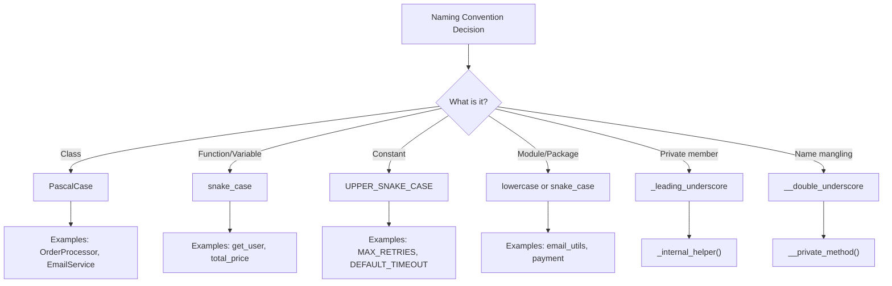
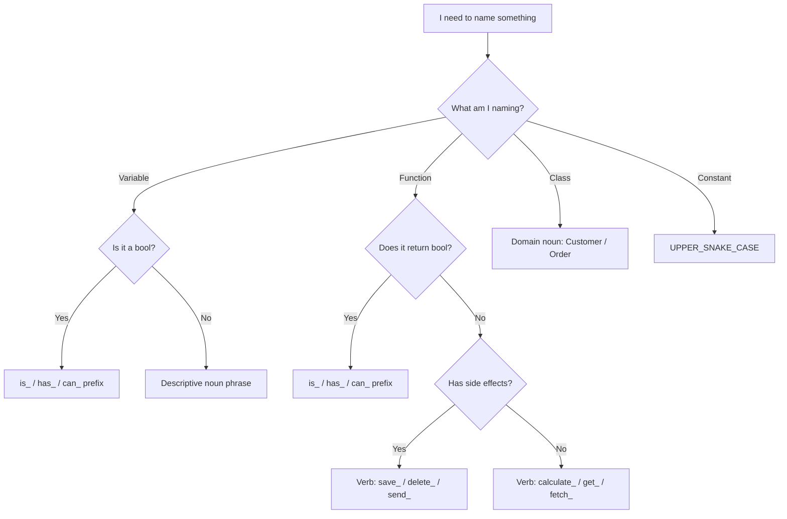

# Naming Conventions

Naming is one of the two hardest problems in computer science (along with cache invalidation and off-by-one errors). Good names reduce the need for comments, make code self-documenting, and prevent misunderstandings.

> [!NOTE]
> Phil Karlton famously said: "There are only two hard things in Computer Science: cache invalidation and naming things." Good naming requires empathy for the reader.

## Why Naming Matters

Code is written once but read dozens of times. A well-chosen name communicates intent instantly. A bad name forces the reader to mentally trace every usage to understand what the variable represents.

```python
# Bad naming
def proc(lst):
    for i in lst:
        if i[3] > 0:
            print(i[0], i[1])

# Good naming
def print_active_users(users: list) -> None:
    for user in users:
        if user["is_active"]:
            print(user["name"], user["email"])
```

## Principles of Good Naming

### 1. Intention-Revealing Names

A name should answer three questions: Why does it exist? What does it do? How is it used?

```python
# Bad
d = 5  # elapsed time in days

# Good
days_since_last_login = 5
```

```python
# Bad
def get_them(the_list):
    result = []
    for x in the_list:
        if x[0] == 4:
            result.append(x)
    return result

# Good
def get_active_orders(order_rows: list) -> list:
    active_orders = []
    for row in order_rows:
        if row["status"] == OrderStatus.ACTIVE:
            active_orders.append(row)
    return active_orders
```

### 2. Avoid Disinformation

Do not use names that leave false clues. Avoid variations that are visually similar.

```python
# Disinformation: Hungarian notation without purpose
str_name = "Alice"        # It's a string, clearly
int_count = 5             # The type is obvious

# Better: no misleading prefix
user_name = "Alice"
item_count = 5
```

```python
# Confusing: visually similar names
l = 1  # lowercase L
O = 2  # uppercase O
result = l + O  # Is this 1+2 or something else?

# Clean
left_operand = 1
right_operand = 2
result = left_operand + right_operand
```

### 3. Make Meaningful Distinctions

If names must differ, they should mean different things.

```python
# Meaningless distinction
def process_data(a1, a2):
    pass

def process_data_v2(a1, a2):
    pass

# Meaningful distinction
def process_monthly_report(raw_data: dict) -> dict:
    pass

def process_monthly_report_with_totals(raw_data: dict) -> dict:
    pass
```

```python
# Noise words
product_info = {}      # What is "info" vs just product?
product_data = {}      # Same as above?
product_object = {}    # Of course it's an object

# Clean
product = {}
product_summary = {}
product_details = {}
```

## Naming by Element Type

### Variables

Variables should be nouns or noun phrases that describe the data they hold.

```python
# Bad
t = "2024-01-15"
n = 42
x = ["Alice", "Bob"]

# Good
current_date = "2024-01-15"
max_retry_count = 42
team_members = ["Alice", "Bob"]
```

### Boolean Variables

Boolean variables should read like predicates: `is_`, `has_`, `can_`, `should_`.

```python
# Unclear
flag = True
status = False

# Clear
is_verified = True
has_permission = False
can_edit = has_permission and is_verified
should_retry = error_count < max_retries
```

### Functions

Functions should be verbs or verb phrases describing the action performed.

```python
# Bad
def data():
    pass

def stuff(x, y):
    pass

# Good
def fetch_user_preferences(user_id: int) -> dict:
    pass

def calculate_distance(point_a: tuple, point_b: tuple) -> float:
    pass

def validate_email_address(email: str) -> bool:
    pass
```

### Classes

Classes are nouns or noun phrases representing a concept or entity.

```python
# Bad
class Manager:
    pass

class Thing:
    pass

class Data:
    pass

# Good
class OrderProcessor:
    pass

class CustomerRepository:
    pass

class EmailService:
    pass
```

### Modules and Packages

Modules should be short, lowercase, and meaningful. Avoid generic names.

```python
# Bad module names
utils.py
helpers.py
common.py
misc.py

# Good module names
email_validator.py
order_calculator.py
user_auth.py
payment_gateway.py
```

## Language-Specific Conventions (Python)



| Element | Convention | Example |
|---------|-----------|---------|
| Variable | `snake_case` | `user_name`, `total_price` |
| Constant | `UPPER_SNAKE_CASE` | `MAX_CONNECTIONS`, `API_KEY` |
| Function | `snake_case` | `get_user_by_id()` |
| Class | `PascalCase` | `OrderProcessor`, `EmailService` |
| Module | `snake_case` | `email_validator.py` |
| Private | `_leading_underscore` | `_internal_helper()` |
| Magic | `__dunder__` | `__init__`, `__str__` |

> [!TIP]
> PEP 8 is the official Python style guide. Use `snake_case` for functions and variables, `PascalCase` for classes, and `UPPER_SNAKE_CASE` for constants.

## Naming Anti-Patterns

### 1. Encoded Names

```python
# Anti-pattern: encoding type in name
strFirstName = "Alice"      # Hungarian notation in Python
intAge = 30                 # We already have type hints
arrItems = [1, 2, 3]        # Unnecessary prefix

# Clean
first_name = "Alice"
age = 30
items = [1, 2, 3]
```

### 2. Abbreviations

```python
# Anti-pattern: unclear abbreviations
def calc_avg_rt(u_ids, p_ids):
    pass

# Clean
def calculate_average_rating(user_ids: list, product_ids: list) -> float:
    pass
```

### 3. Single-Letter Names (except loop indices)

```python
# Anti-pattern: single letters
def validate(c, u, p):
    return c > 0 and u and len(p) >= 8

# Clean
def is_input_valid(count: int, username: str, password: str) -> bool:
    return count > 0 and bool(username) and len(password) >= 8
```

## Real-World Example: Refactoring Names

Before refactoring:

```python
class emp:
    def __init__(self, n, a, s):
        self.n = n
        self.a = a
        self.s = s

    def calc(self):
        if self.a >= 5:
            return self.s * 1.10
        return self.s

    def disp(self):
        print(f"Name: {self.n}, Salary: {self.calc()}")
```

After refactoring:

```python
class Employee:
    BONUS_THRESHOLD_YEARS = 5
    BONUS_MULTIPLIER = 1.10

    def __init__(self, full_name: str, years_of_service: int, base_salary: float):
        self.full_name = full_name
        self.years_of_service = years_of_service
        self.base_salary = base_salary

    def calculate_total_compensation(self) -> float:
        if self.years_of_service >= self.BONUS_THRESHOLD_YEARS:
            return self.base_salary * self.BONUS_MULTIPLIER
        return self.base_salary

    def display_employee_info(self) -> None:
        total_salary = self.calculate_total_compensation()
        print(f"Name: {self.full_name}, Salary: {total_salary}")
```

## Context Matters

Names exist within a context. A variable named `name` makes perfect sense inside a `Customer` class but is confusing in global scope.

```python
# Without context
name = "Alice"
address = "123 Main St"
email = "alice@example.com"
# Are these related? Is this a customer, an employee, a vendor?

# With context (class)
class Customer:
    def __init__(self, name: str, address: str, email: str):
        self.name = name
        self.address = address
        self.email = email
```

```python
# Without context
def print_report():
    name = "Monthly Sales"
    data = [100, 200, 300]
    # name of what? data of what?

# With context
def print_sales_report():
    report_title = "Monthly Sales"
    sales_data = [100, 200, 300]
```

## Naming Decision Flow



> [!SUCCESS]
> Good naming is the single most impactful practice for code maintainability. Spend time choosing the right name — your future self will thank you.

## Practice Exercises

1. **Rename the mess**: Refactor these names: `d` (days overdue), `lst` (product catalog), `tmp` (temporary storage), `x` (tax percentage).

2. **Bool naming**: A variable tracks whether a user has completed onboarding. Name it. A function checks if an email is deliverable. Name it.

3. **Class naming**: You are modeling a system with: payment processing, user authentication, report generation. Name each class.

4. **Module audit**: Look at your project's module names. Replace `utils.py` and `helpers.py` with domain-specific names.

5. **Disinformation hunt**: Find 3 misleading names in open-source code and suggest better alternatives.

6. **Context exercise**: You have variables `email`, `phone`, `address`. Without a class, what domain concept do they belong to? Wrap them in an appropriate class.

7. **Abbreviation expansion**: Write a function that expands abbreviations in code: `calc_avg_rt` → `calculate_average_rating`, `get_usrs` → `get_users`.

8. **Peer review**: Have a colleague review 100 lines of your code and highlight any name that is unclear to them. Refactor accordingly.
