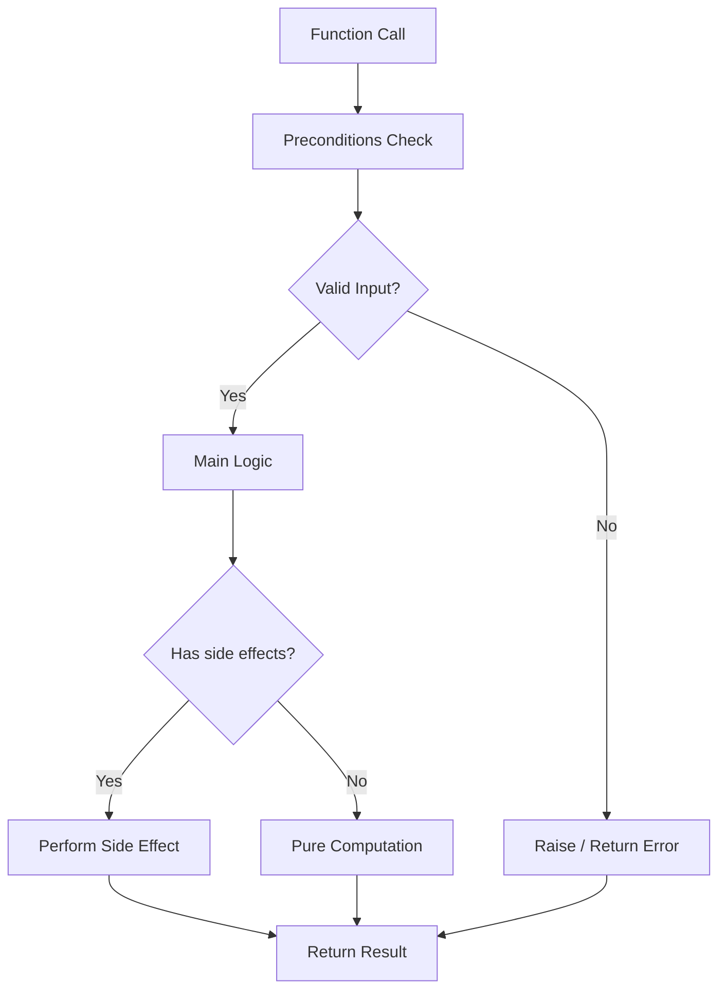
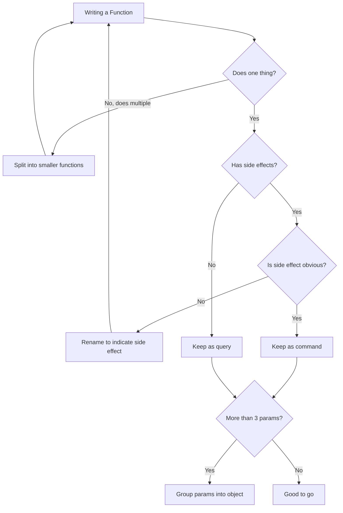

# Functions Done Right

Functions are the fundamental building blocks of readable, maintainable code. A well-crafted function tells a clear story about what it does, what it needs, and what it returns.

> [!NOTE]
> Robert C. Martin states: "The first rule of functions is that they should be small. The second rule of functions is that they should be smaller than that."

## The First Rule: Small Functions

A function should do one thing, do it well, and do it only. If you can extract another function from it with a meaningful name, it is doing too much.

```python
# Too large: this function does everything
def process_order(order_data: dict) -> dict:
    # Validate
    if not order_data.get("items"):
        raise ValueError("Order must have items")
    if sum(item["price"] for item in order_data["items"]) <= 0:
        raise ValueError("Total must be positive")

    # Calculate
    subtotal = sum(item["price"] * item["quantity"] for item in order_data["items"])
    tax = subtotal * 0.08
    shipping = 5.99 if subtotal < 50 else 0
    total = subtotal + tax + shipping

    # Save
    with open("orders.txt", "a") as f:
        f.write(f"{order_data['customer']}:{total}\n")

    # Notify
    print(f"Order confirmed for {order_data['customer']}")

    return {"total": total, "status": "confirmed"}

# Refactored: each function does one thing
def validate_order(order_data: dict) -> None:
    if not order_data.get("items"):
        raise ValueError("Order must have items")
    if sum(item["price"] for item in order_data["items"]) <= 0:
        raise ValueError("Total must be positive")

def calculate_total(order_data: dict) -> dict:
    subtotal = sum(item["price"] * item["quantity"] for item in order_data["items"])
    tax = subtotal * TAX_RATE
    shipping = SHIPPING_COST if subtotal < FREE_SHIPPING_THRESHOLD else 0
    total = subtotal + tax + shipping
    return {"subtotal": subtotal, "tax": tax, "shipping": shipping, "total": total}

def save_order(order_data: dict, totals: dict) -> None:
    with open("orders.txt", "a") as f:
        f.write(f"{order_data['customer']}:{totals['total']}\n")

def notify_customer(customer_name: str) -> None:
    print(f"Order confirmed for {customer_name}")

def process_order(order_data: dict) -> dict:
    validate_order(order_data)
    totals = calculate_total(order_data)
    save_order(order_data, totals)
    notify_customer(order_data["customer"])
    return {**totals, "status": "confirmed"}
```

## Single Responsibility Principle

A function should have one reason to change. If a function mixes business logic, I/O, and presentation, it violates SRP.

```python
# Violates SRP: mixes calculation, formatting, and I/O
def generate_salary_report(employees: list):
    total = sum(e.salary for e in employees)
    avg = total / len(employees)
    report = f"Total: ${total}\nAverage: ${avg}\n"
    with open("salary_report.txt", "w") as f:
        f.write(report)
    return report

# Follows SRP: each function has one responsibility
def calculate_salary_stats(employees: list) -> dict:
    total = sum(e.salary for e in employees)
    return {"total": total, "average": total / len(employees), "count": len(employees)}

def format_salary_report(stats: dict) -> str:
    return f"Total: ${stats['total']:.2f}\nAverage: ${stats['average']:.2f}\nCount: {stats['count']}"

def write_report_to_file(report: str, filename: str) -> None:
    with open(filename, "w") as f:
        f.write(report)

def generate_salary_report(employees: list, filename: str) -> str:
    stats = calculate_salary_stats(employees)
    report = format_salary_report(stats)
    write_report_to_file(report, filename)
    return report
```

## Function Parameters

### Minimize Parameters

A function with no parameters is the easiest to understand. One or two parameters is good. Three should be justified. More than three suggests a design problem.

```python
# Too many parameters
def create_user(name, email, age, address, phone, is_admin, notify):
    pass

# Group related params into an object
@dataclass
class UserProfile:
    name: str
    email: str
    age: int
    address: str
    phone: str

def create_user(profile: UserProfile, is_admin: bool = False, notify: bool = True) -> User:
    pass
```

### Avoid Flag Parameters

Boolean flags in function signatures indicate the function does two things.

```python
# Flag parameter: two behaviors
def send_email(to: str, message: str, is_urgent: bool):
    if is_urgent:
        # Send immediately
        pass
    else:
        # Add to queue
        pass

# Better: two functions
def send_immediate_email(to: str, message: str):
    pass

def queue_email(to: str, message: str):
    pass
```

### Prefer Keyword Arguments

Keyword arguments make function calls self-documenting.

```python
# Unclear positional args
connect("localhost", 5432, "admin", "secret", "dbname")

# Clear keyword args
connect(
    host="localhost",
    port=5432,
    username="admin",
    password="secret",
    database="dbname",
)
```

## Side Effects

A function should either do something (command) or answer something (query), but not both. Side effects are hidden changes to state.

```python
# Side effect: modifies global state
DISCOUNT_MULTIPLIER = 1.0

def apply_discount(price: float) -> float:
    global DISCOUNT_MULTIPLIER
    DISCOUNT_MULTIPLIER = 0.9  # Side effect!
    return price * DISCOUNT_MULTIPLIER

# Pure function: predictable, no side effects
def apply_discount(price: float, discount_multiplier: float = 1.0) -> float:
    return price * discount_multiplier
```

```python
# Side effect: modifies input
def add_to_cart(cart: list, item: dict) -> list:
    cart.append(item)  # Modifies the original list
    return cart

# Explicit: returns new state
def add_to_cart(cart: list, item: dict) -> list:
    return [*cart, item]
```

## Command-Query Separation

Functions should either be commands (perform an action) or queries (return data), not both.

```python
# Violates CQS: both modifies and queries
def pop_item(stack: list):
    if not stack:
        return None
    return stack.pop()

# Follows CQS
def is_empty(stack: list) -> bool:
    return len(stack) == 0

def pop_item(stack: list):
    if is_empty(stack):
        return None
    return stack.pop()
```

## Function Structure and Flow



## The Stepdown Rule

Every function should be followed by functions at the next level of abstraction. This creates a narrative that reads top-to-bottom.

```python
# High-level story
def process_payment(order: Order) -> PaymentResult:
    validate_order(order)
    charge_customer(order)
    send_receipt(order)
    return PaymentResult.success()

# Next level of detail
def validate_order(order: Order) -> None:
    if not order.items:
        raise ValueError("Empty order")
    if order.total <= 0:
        raise ValueError("Invalid total")

def charge_customer(order: Order) -> None:
    gateway = PaymentGateway(order.payment_method)
    gateway.charge(order.total)

def send_receipt(order: Order) -> None:
    email = EmailService()
    email.send(
        to=order.customer_email,
        subject="Your Receipt",
        body=f"Total charged: ${order.total:.2f}",
    )
```

## Error Handling

Error handling is one thing. A function that handles errors should do nothing else.

```python
# Mixed: error handling with business logic
def get_user_score(user_id: int) -> int:
    try:
        user = database.find_user(user_id)
        score = calculate_score(user)
        return score
    except DatabaseError:
        return 0
    except ScoreError:
        return 0

# Clean: separate error handling from logic
def get_user_score(user_id: int) -> int:
    try:
        user = database.find_user(user_id)
        return calculate_score(user)
    except (DatabaseError, ScoreError):
        return 0
```

## Pure Functions vs Impure Functions

| Aspect | Pure Function | Impure Function |
|--------|--------------|-----------------|
| Same input → same output | Always | Not guaranteed |
| Side effects | None | May have |
| Testing | Trivial | Requires mocking |
| Thread-safe | Yes | Depends |
| Cachable | Yes | No |
| Example | `sum(a, b)` | `print(message)` |

```python
# Pure function
def add_to_date(start_date: date, days: int) -> date:
    return start_date + timedelta(days=days)

# Impure function (relies on external state)
def get_current_timestamp() -> datetime:
    return datetime.now()
```

## Real-World Example: Refactoring a Monolith

Before: A single 80-line function handling payment processing.

```python
def handle_payment(request):
    # Parse input
    data = json.loads(request.body)
    user_id = data["user_id"]
    amount = data["amount"]
    currency = data.get("currency", "USD")
    method = data["method"]

    # Validate user
    user = db.query(f"SELECT * FROM users WHERE id = {user_id}")
    if not user:
        return {"error": "User not found"}, 404
    if user["balance"] < amount:
        return {"error": "Insufficient funds"}, 400

    # Process payment
    if method == "credit_card":
        result = credit_card_charge(user["card_token"], amount, currency)
    elif method == "paypal":
        result = paypal_charge(user["paypal_email"], amount, currency)
    else:
        return {"error": "Unknown method"}, 400

    if result["status"] == "success":
        db.query(f"UPDATE users SET balance = balance - {amount} WHERE id = {user_id}")
        send_email(user["email"], "Payment received", f"Amount: {amount}")
        return {"status": "ok", "transaction_id": result["id"]}, 200
    else:
        return {"error": result["message"]}, 500
```

After: Clean, focused functions.

```python
@dataclass
class PaymentRequest:
    user_id: int
    amount: Decimal
    currency: str
    method: str

@dataclass
class PaymentResult:
    success: bool
    transaction_id: Optional[str] = None
    error_message: Optional[str] = None


def parse_payment_request(body: str) -> PaymentRequest:
    data = json.loads(body)
    return PaymentRequest(
        user_id=data["user_id"],
        amount=Decimal(str(data["amount"])),
        currency=data.get("currency", "USD"),
        method=data["method"],
    )

def validate_payment(user: User, request: PaymentRequest) -> Optional[str]:
    if user.balance < request.amount:
        return "Insufficient funds"
    return None

def process_payment(user: User, request: PaymentRequest) -> PaymentResult:
    processors = {
        "credit_card": lambda: charge_credit_card(user.card_token, request),
        "paypal": lambda: charge_paypal(user.paypal_email, request),
    }
    processor = processors.get(request.method)
    if not processor:
        return PaymentResult(success=False, error_message="Unknown method")
    return processor()

def charge_credit_card(token: str, request: PaymentRequest) -> PaymentResult:
    gateway = CreditCardGateway(token)
    result = gateway.charge(request.amount, request.currency)
    return PaymentResult(success=result.ok, transaction_id=result.id)

def charge_paypal(email: str, request: PaymentRequest) -> PaymentResult:
    gateway = PayPalGateway(email)
    result = gateway.charge(request.amount, request.currency)
    return PaymentResult(success=result.ok, transaction_id=result.id)

def deduct_balance(user: User, amount: Decimal) -> None:
    user.balance -= amount

def notify_user(user: User, amount: Decimal) -> None:
    send_email(user.email, "Payment received", f"Amount: {amount}")

def handle_payment(request_body: str) -> tuple:
    payment_request = parse_payment_request(request_body)
    user = find_user(payment_request.user_id)
    if not user:
        return {"error": "User not found"}, 404

    error = validate_payment(user, payment_request)
    if error:
        return {"error": error}, 400

    result = process_payment(user, payment_request)
    if not result.success:
        return {"error": result.error_message}, 500

    deduct_balance(user, payment_request.amount)
    notify_user(user, payment_request.amount)
    return {"status": "ok", "transaction_id": result.transaction_id}, 200
```

## Functions and Testing

Clean functions are easy to test. Each function can be tested in isolation.

```python
import pytest

def test_parse_payment_request():
    body = '{"user_id": 1, "amount": "100.00", "method": "credit_card"}'
    result = parse_payment_request(body)
    assert result.user_id == 1
    assert result.amount == Decimal("100.00")

def test_validate_payment_insufficient_funds():
    user = User(balance=Decimal("50.00"))
    request = PaymentRequest(amount=Decimal("100.00"), ...)
    error = validate_payment(user, request)
    assert error == "Insufficient funds"

def test_validate_payment_sufficient_funds():
    user = User(balance=Decimal("200.00"))
    request = PaymentRequest(amount=Decimal("100.00"), ...)
    error = validate_payment(user, request)
    assert error is None
```

## Function Decision Flow



> [!WARNING]
> A common mistake is making functions "just a little bit bigger" to save a few lines. Resist this. Every additional line decreases readability and increases the chance of bugs.

> [!SUCCESS]
> Small, focused functions are the foundation of clean code. Practice extracting functions until it becomes second nature.

## Practice Exercises

1. **Extract till you drop**: Take a 100-line function and keep extracting until no function is longer than 10 lines.

2. **Flag removal**: Find a function with a boolean parameter and split it into two named functions.

3. **Parameter audit**: Find a function with 4+ parameters. Group related parameters into a dataclass.

4. **Side effect hunt**: Find a function that modifies global state or its inputs. Refactor it to be pure (or explicitly state side effects).

5. **CQS violation**: Find a function that both returns data and modifies state. Split it into a command and a query.

6. **Stepdown structure**: Take a complex function and reorganize it so high-level logic reads first, followed by helper functions.

7. **SRP refactor**: Find a class with one large method. Extract smaller, focused methods until the class follows the single responsibility principle.

8. **Test-driven refactor**: Before refactoring a large function, write tests that capture its behavior. Refactor, then verify all tests still pass.
