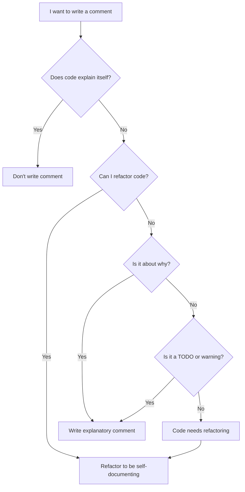
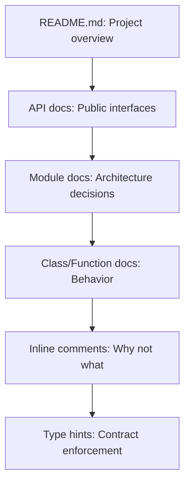

# Comments & Documentation

Comments are a double-edged sword. Good comments explain "why" — the reasoning behind a decision. Bad comments explain "what" — which the code should already communicate. The best comment is the one you do not need to write because the code is clear.

> [!NOTE]
> "Don't comment bad code — rewrite it." — Brian W. Kernighan

## Self-Documenting Code

The goal is to write code so clear that comments become unnecessary for understanding "what" the code does. Comments should only explain "why" something is done a particular way.

```python
# Bad comment: explains what (obvious from code)
# Calculate the total by adding subtotal and tax
total = subtotal + tax

# Good comment: explains why (non-obvious)
# Use Decimal to avoid floating-point rounding in financial calculations
from decimal import Decimal
total = subtotal + tax
```

```python
# Bad: commenting bad code
# Check if user is active and has permission
# then apply discount if total > 100
if u.active and u.role == "admin" or u.role == "manager":
    if t > 100:
        t = t * 0.9

# Good: self-documenting code
def is_eligible_for_discount(user: User, total: float) -> bool:
    return user.is_active and user.has_admin_permission() and total > 100

def apply_discount(total: float) -> float:
    return total * DISCOUNT_RATE
```

## When to Comment

### 1. Legal Comments

```python
# Copyright (c) 2024 NUniversity. All rights reserved.
# Licensed under the MIT License.
```

### 2. Explanatory Comments for Complex Logic

```python
def calculate_levenshtein_distance(s1: str, s2: str) -> int:
    """
    Calculate the Levenshtein distance between two strings.

    The Levenshtein distance is the minimum number of single-character
    edits (insertions, deletions, substitutions) required to change
    one word into another.
    """
    if len(s1) < len(s2):
        return calculate_levenshtein_distance(s2, s1)

    if len(s2) == 0:
        return len(s1)

    previous_row = range(len(s2) + 1)
    for i, c1 in enumerate(s1):
        current_row = [i + 1]
        for j, c2 in enumerate(s2):
            insertions = previous_row[j + 1] + 1
            deletions = current_row[j] + 1
            substitutions = previous_row[j] + (c1 != c2)
            current_row.append(min(insertions, deletions, substitutions))
        previous_row = current_row

    return previous_row[-1]
```

### 3. TODOs and FIXMEs

```python
# TODO: Implement pagination for large result sets
# FIXME: This query is slow for datasets over 10M rows
# HACK: Workaround for API rate limiting — remove when we get enterprise plan
```

### 4. Warnings About Consequences

```python
# WARNING: This function modifies the list in-place. Call with a copy if
# you need to preserve the original ordering.
def sort_by_priority(items: list) -> None:
    items.sort(key=lambda x: x.priority, reverse=True)
```

## When NOT to Comment

### 1. Redundant Comments

```python
# Bad: states the obvious
x = 42  # Set x to 42

# Bad: comment repeats code
# Increment counter by 1
counter += 1
```

### 2. Misleading Comments

```python
# Bad: comment says one thing, code does another
# Returns True if user is active
def is_user_banned(user):
    return user.status == "banned"  # Bug: wrong variable name
```

### 3. Journal Comments

```python
# Bad: version history belongs in git
# 2024-01-10: Added discount calculation - Alice
# 2024-01-15: Fixed tax rounding bug - Bob
def calculate_total():
    pass
```

### 4. Commented-Out Code

```python
# Bad: dead code that nobody will clean up
# def old_process():
#     x = 10
#     y = 20
#     return x + y
```

> [!WARNING]
> Commented-out code is the worst kind of technical debt. Delete it. If you need it again, use version control.

## Docstrings

Docstrings are documentation embedded in the code. Unlike comments, docstrings are accessible at runtime and processed by documentation generators.

```python
def calculate_bmi(weight_kg: float, height_m: float) -> float:
    """Calculate Body Mass Index from weight and height.

    BMI is a measure of body fat based on height and weight.
    It is calculated as weight / (height ^ 2).

    Args:
        weight_kg: Weight in kilograms (must be positive).
        height_m: Height in meters (must be positive).

    Returns:
        The BMI value, rounded to one decimal place.

    Raises:
        ValueError: If either weight or height is not positive.

    Examples:
        >>> calculate_bmi(70, 1.75)
        22.9
    """
    if weight_kg <= 0 or height_m <= 0:
        raise ValueError("Weight and height must be positive values")
    bmi = weight_kg / (height_m ** 2)
    return round(bmi, 1)
```

### Docstring Styles

| Style | Format | Best for |
|-------|--------|----------|
| Google | Sections with headers | Most Python projects |
| NumPy/SciPy | Rich section headers | Scientific computing |
| Sphinx/reST | reStructuredText | Large documentation |
| Epytext | JavaDoc-like | Legacy code |

### Google-Style Docstrings

```python
def fetch_user_data(user_id: int, include_inactive: bool = False) -> dict:
    """Retrieve user data from the database.

    Queries the user database and returns user profile information.
    By default, only active users are returned.

    Args:
        user_id: The unique identifier of the user.
        include_inactive: Whether to include deactivated users.

    Returns:
        A dictionary containing user profile data with keys:
        - id: int
        - name: str
        - email: str
        - created_at: datetime
        - is_active: bool

    Raises:
        UserNotFoundError: If no user exists with the given ID.
        DatabaseConnectionError: If the database is unreachable.
    """
```

### NumPy-Style Docstrings

```python
def calculate_statistics(numbers: list) -> dict:
    """Compute descriptive statistics for a numeric dataset.

    Parameters
    ----------
    numbers : list
        A list of numeric values. Must contain at least one element
        and all elements must be finite numbers.

    Returns
    -------
    dict
        Dictionary with keys: mean, median, std, min, max, count.

    Raises
    ------
    ValueError
        If numbers list is empty or contains non-numeric values.
    """
    import statistics
    return {
        "mean": statistics.mean(numbers),
        "median": statistics.median(numbers),
        "std": statistics.stdev(numbers),
        "min": min(numbers),
        "max": max(numbers),
        "count": len(numbers),
    }
```

## Module and Package Documentation

Every module should have a docstring explaining its purpose.

```python
# email_service.py
"""Email sending service for the notification system.

This module provides functions for sending transactional emails
using the SMTP protocol. It supports HTML and plain text formats,
file attachments, and template rendering.

Typical usage:
    from services.email_service import send_email

    send_email(
        to="user@example.com",
        subject="Welcome!",
        template="welcome.html",
        context={"name": "Alice"},
    )
"""
```

## Class Documentation

```python
class RateLimiter:
    """Token bucket rate limiter for API endpoints.

    Implements the token bucket algorithm to control request rates.
    Each client gets a bucket that fills at a configurable rate.
    Requests consume tokens; if the bucket is empty, the request is
    rejected.

    Attributes:
        rate: Number of tokens added per second.
        capacity: Maximum number of tokens the bucket can hold.

    Example:
        >>> limiter = RateLimiter(rate=10, capacity=20)
        >>> limiter.allow_request("client_1")
        True
    """

    def __init__(self, rate: float, capacity: int):
        self.rate = rate
        self.capacity = capacity
        self._buckets: dict[str, float] = {}

    def allow_request(self, client_id: str) -> bool:
        """Check if a request from this client should be allowed.

        Args:
            client_id: Unique identifier for the client.

        Returns:
            True if the request is allowed, False if rate limited.
        """
```

## Documentation Decision Flow



## Tools for Documentation

### Sphinx

Sphinx generates documentation from docstrings and reStructuredText files.

```python
# conf.py for Sphinx
extensions = [
    "sphinx.ext.autodoc",      # Pull docstrings from code
    "sphinx.ext.napoleon",     # Support Google/NumPy style
    "sphinx.ext.viewcode",     # Link to source code
]
```

### MkDocs

MkDocs builds documentation from Markdown files.

```yaml
# mkdocs.yml
site_name: My API Docs
theme: material
plugins:
  - mkdocstrings
  - search
```

### Type Hints as Documentation

Type hints serve as machine-checkable documentation.

```python
# Without type hints (what type is user_id?)
def get_user(user_id):
    return database.query(f"SELECT * FROM users WHERE id = {user_id}")

# With type hints (self-documenting)
def get_user(user_id: int) -> User | None:
    return database.query(f"SELECT * FROM users WHERE id = {user_id}")
```

## Real-World Example: Documentation Pyramid



### Bad Documentation Example

```python
def calc(a, b):
    # This function calculates something
    # a is first number
    # b is second number
    # returns the result
    return a * b  # multiply a and b
```

### Good Documentation Example

```python
def calculate_total_compensation(
    base_salary: float,
    bonus_percentage: float,
    years_of_service: int,
) -> float:
    """Calculate total employee compensation including bonuses.

    Total compensation = base salary + (base salary * bonus percentage)
    Employees with 5+ years of service get an additional seniority bonus.

    Note:
        Bonus percentage should be provided as a decimal (e.g., 0.10 for 10%).
        All monetary values are in USD.

    Args:
        base_salary: Annual base salary in USD (must be > 0).
        bonus_percentage: Performance bonus as decimal (0.0 to 1.0).
        years_of_service: Complete years worked at the company.

    Returns:
        Total annual compensation rounded to 2 decimal places.

    Raises:
        ValueError: If base_salary <= 0 or bonus_percentage < 0.
    """
    if base_salary <= 0:
        raise ValueError("Base salary must be positive")
    if bonus_percentage < 0:
        raise ValueError("Bonus percentage cannot be negative")

    base_bonus = base_salary * bonus_percentage
    # Seniority bonus: 5% extra for employees with 5+ years
    seniority_bonus = base_salary * 0.05 if years_of_service >= 5 else 0

    return round(base_salary + base_bonus + seniority_bonus, 2)
```

## Comment Types Comparison

| Comment Type | Purpose | Frequency | Example |
|-------------|---------|-----------|---------|
| Legal | Copyright / license | File header | `# Copyright 2024` |
| Docstring | API documentation | Every public function | `"""Calculate total."""` |
| TODO | Future work | Occasional | `# TODO: Add pagination` |
| Warning | Side effects / risks | Rare | `# WARNING: In-place sort` |
| Clarification | Complex logic | Minimal | `# Off-by-one: 0-indexed` |
| Redundant | Explains obvious | Never | `# Set x to 42` |

> [!TIP]
> A good heuristic: if you can delete a comment and the code remains just as understandable, delete the comment. If the code becomes unclear, either improve the code or keep the comment explaining why.

## Practice Exercises

1. **Comment audit**: Go through your codebase and classify every comment as "useful" or "noise". Delete all noise comments.

2. **Refactor to remove comments**: Find a block of code with a comment explaining "what". Refactor the code so the comment is unnecessary.

3. **Add missing docstrings**: Write Google-style docstrings for three functions in your project that lack documentation.

4. **Module docstring**: Add a module-level docstring to a Python file explaining its purpose and usage.

5. **Type hint audit**: Add type hints to a function that previously had none. Verify correctness with `mypy`.

6. **TODO cleanup**: Review all TODOs in your project. Delete completed ones, add issue references to remaining, and remove those that are no longer relevant.

7. **Documentation generation**: Set up Sphinx or MkDocs for your project and generate HTML documentation from docstrings.

8. **Readme improvement**: Write a README for a module or package following the documentation pyramid principle.
