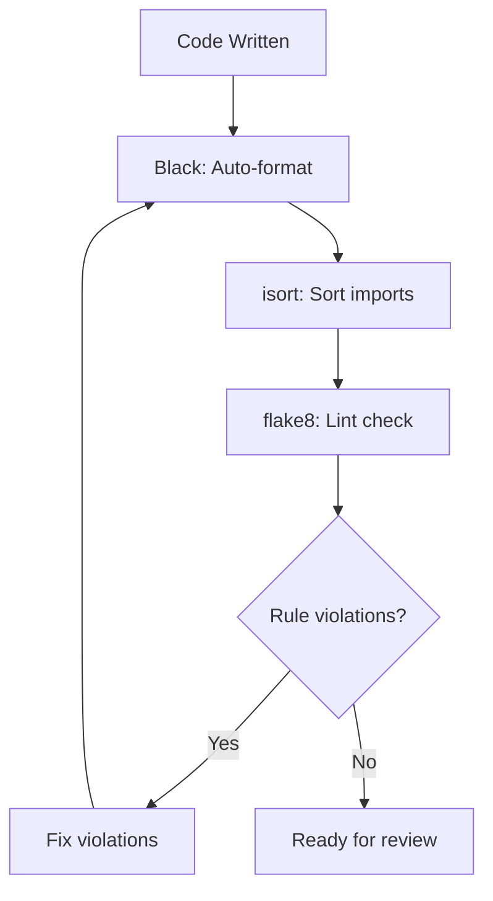
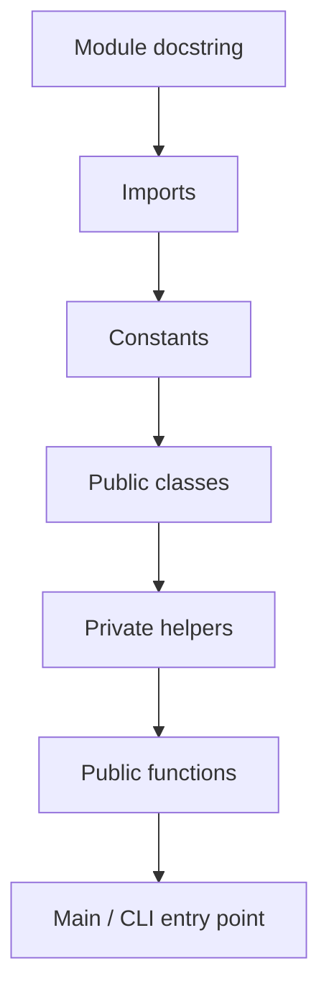
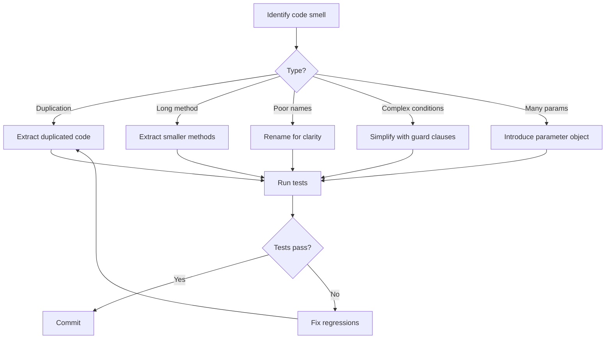

# Code Formatting & Style

Code formatting is like punctuation in writing — it makes the meaning clear. Consistent style across a codebase reduces cognitive load, prevents trivial style debates in code reviews, and helps catch bugs faster.

> [!NOTE]
> "Code formatting is about communication, not personal preference. A consistent style across a team eliminates an entire class of pointless arguments." — Adapted from *Clean Code*

## Why Formatting Matters

```python
# Poor formatting: hard to scan and understand
def calculate(items):
    result=0
    for i in items:
        if i['active']==True:
            result=result+i['value']
            if result>100:
                result=result*0.9
    return result

# Consistent formatting: easy to read and maintain
def calculate_discounted_total(items: list[dict]) -> float:
    result = 0.0
    for item in items:
        if item["active"]:
            result += item["value"]
            if result > DISCOUNT_THRESHOLD:
                result *= DISCOUNT_RATE
    return result
```

## PEP 8: The Python Style Guide

PEP 8 is the official style guide for Python code. Most Python projects follow it.

### Indentation

Use 4 spaces per indentation level. Never mix tabs and spaces.

```python
# Correct
def fetch_data(url: str) -> dict:
    response = requests.get(url)
    if response.status_code == 200:
        return response.json()
    return {}

# Incorrect (2 spaces)
def fetch_data(url: str) -> dict:
  response = requests.get(url)
  if response.status_code == 200:
    return response.json()
  return {}
```

### Line Length

Maximum line length is 79 characters for code, 72 for comments and docstrings.

```python
# Too long
result = some_function_with_many_parameters(param_one, param_two, param_three, param_four, param_five)

# Properly wrapped
result = some_function_with_many_parameters(
    param_one, param_two, param_three,
    param_four, param_five,
)

# Using parentheses for implicit continuation
total = (
    subtotal
    + tax_amount
    - discount
    + shipping_cost
)
```

### Blank Lines

```python
import os
import sys

# Two blank lines between top-level definitions
class OrderProcessor:
    pass

class EmailService:
    pass

# One blank line between methods
class UserManager:
    def __init__(self):
        self.users = []

    def add_user(self, user):
        self.users.append(user)

    def remove_user(self, user):
        self.users.remove(user)
```

### Imports

```python
# Standard library imports
import os
import sys
from datetime import datetime

# Third-party imports
import pytest
import requests
from fastapi import FastAPI

# Local application imports
from models.user import User
from services.email import EmailService
```

## Automated Formatting Tools



### Black

Black is an opinionated code formatter that eliminates formatting debates. It formats code deterministically.

```bash
# Format a single file
black main.py

# Format entire project
black .

# Check if files would be reformatted
black --check .

# Show differences
black --diff .
```

```python
# Before Black
def complex_function(first_param,second_param,third_param,
                     fourth_param):
    result=first_param+second_param
    if result>100:
        result=result*0.9
        for item in fourth_param:
            if item.get('active'):
                result+=item['value']
    return result

# After Black
def complex_function(
    first_param, second_param, third_param, fourth_param
):
    result = first_param + second_param
    if result > 100:
        result = result * 0.9
        for item in fourth_param:
            if item.get("active"):
                result += item["value"]
    return result
```

### isort

isort sorts imports alphabetically and groups them by type.

```python
# Before isort
from services.email import EmailService
import os
from models.user import User
import sys
import requests
from datetime import datetime

# After isort
import os
import sys
from datetime import datetime

import requests

from models.user import User
from services.email import EmailService
```

### flake8

flake8 checks for PEP 8 violations and common errors.

```bash
# Basic usage
flake8 src/

# With configuration
flake8 src/ --max-line-length 88 --ignore E203,W503
```

### Configuration File

```ini
# setup.cfg
[flake8]
max-line-length = 88
extend-ignore = E203, W503
exclude = .git, __pycache__, venv

[isort]
profile = black
line_length = 88

[tool:black]
line-length = 88
target-version = py311
include = '\.pyw?$'
```

```toml
# pyproject.toml
[tool.black]
line-length = 88
target-version = ["py311"]

[tool.isort]
profile = "black"
line_length = 88

[tool.flake8]
max-line-length = 88
extend-ignore = ["E203", "W503"]
```

## Variable and Attribute Spacing

```python
# Inconsistent spacing
name="Alice"
age   = 30
address="123 Main St"

# Consistent spacing (PEP 8)
name = "Alice"
age = 30
address = "123 Main St"
```

## Trailing Commas

```python
# Without trailing comma — adding a new item changes two lines
ITEMS = [
    "apple",
    "banana",
    "cherry"  # Need to add comma when adding "date"
]

# With trailing comma — cleaner diffs
ITEMS = [
    "apple",
    "banana",
    "cherry",
]
```

## Refactoring Techniques

### Extract Method

```python
# Before
def process_report(data):
    # Validate
    if not data:
        raise ValueError("Empty data")
    if "revenue" not in data:
        raise ValueError("Missing revenue")
    if "expenses" not in data:
        raise ValueError("Missing expenses")

    # Calculate
    revenue = sum(data["revenue"])
    expenses = sum(data["expenses"])
    profit = revenue - expenses
    margin = (profit / revenue * 100) if revenue > 0 else 0

    # Format
    report = f"""
    Revenue: ${revenue:,.2f}
    Expenses: ${expenses:,.2f}
    Profit: ${profit:,.2f}
    Margin: {margin:.1f}%
    """
    return report

# After
def validate_report_data(data: dict) -> None:
    if not data:
        raise ValueError("Empty data")
    if "revenue" not in data:
        raise ValueError("Missing revenue")
    if "expenses" not in data:
        raise ValueError("Missing expenses")

def calculate_financials(data: dict) -> dict:
    revenue = sum(data["revenue"])
    expenses = sum(data["expenses"])
    profit = revenue - expenses
    margin = (profit / revenue * 100) if revenue > 0 else 0
    return {"revenue": revenue, "expenses": expenses, "profit": profit, "margin": margin}

def format_report(financials: dict) -> str:
    return f"""
    Revenue: ${financials['revenue']:,.2f}
    Expenses: ${financials['expenses']:,.2f}
    Profit: ${financials['profit']:,.2f}
    Margin: {financials['margin']:.1f}%
    """

def process_report(data: dict) -> str:
    validate_report_data(data)
    financials = calculate_financials(data)
    return format_report(financials)
```

### Rename

```python
# Before
def proc(lst):
    r = []
    for x in lst:
        if x[3] == "active":
            r.append(x[0])
    return r

# After
def get_active_user_emails(users: list[dict]) -> list[str]:
    active_emails = []
    for user in users:
        if user["status"] == "active":
            active_emails.append(user["email"])
    return active_emails
```

### Simplify Conditionals

```python
# Before: nested conditionals
def can_access(user, resource):
    if user:
        if user.is_active:
            if user.role == "admin" or user.role == "manager":
                return True
            if resource.is_public:
                return True
            if resource.owner_id == user.id:
                return True
    return False

# After: guard clauses
def can_access(user: User | None, resource: Resource) -> bool:
    if not user:
        return False
    if not user.is_active:
        return False
    if user.role in ("admin", "manager"):
        return True
    if resource.is_public:
        return True
    if resource.owner_id == user.id:
        return True
    return False
```

## Code Organization Within a File



```python
"""Email notification service for the e-commerce platform.

This module handles sending transactional emails using the
SMTP protocol with support for HTML templates.
"""

import logging
import smtplib
from email.mime.text import MIMEText
from typing import Optional

import jinja2

# Constants
DEFAULT_SMTP_PORT = 587
DEFAULT_TIMEOUT = 30
TEMPLATE_DIR = "templates/emails"

logger = logging.getLogger(__name__)


class EmailSender:
    """Handles SMTP connection and email delivery."""

    def __init__(self, host: str, port: int = DEFAULT_SMTP_PORT):
        self.host = host
        self.port = port
        self._connection: Optional[smtplib.SMTP] = None

    def connect(self, username: str, password: str) -> None:
        self._connection = smtplib.SMTP(self.host, self.port, timeout=DEFAULT_TIMEOUT)
        self._connection.starttls()
        self._connection.login(username, password)

    def send(self, to: str, subject: str, body: str) -> None:
        if not self._connection:
            raise RuntimeError("Not connected. Call connect() first.")
        msg = MIMEText(body, "html")
        msg["Subject"] = subject
        msg["To"] = to
        self._connection.send_message(msg)

    def disconnect(self) -> None:
        if self._connection:
            self._connection.quit()
            self._connection = None
```

## Refactoring Flow



## Pre-commit Hooks

Automate formatting checks with pre-commit hooks:

```yaml
# .pre-commit-config.yaml
repos:
  - repo: https://github.com/psf/black
    rev: 23.12.0
    hooks:
      - id: black

  - repo: https://github.com/pycqa/isort
    rev: 5.13.0
    hooks:
      - id: isort

  - repo: https://github.com/pycqa/flake8
    rev: 6.1.0
    hooks:
      - id: flake8

  - repo: https://github.com/pre-commit/mirrors-mypy
    rev: v1.8.0
    hooks:
      - id: mypy
```

```bash
# Install pre-commit hooks
pip install pre-commit
pre-commit install

# Run against all files
pre-commit run --all-files
```

## Formatting Rules Comparison

| Rule | PEP 8 | Black | flake8 |
|------|-------|-------|--------|
| Indentation | 4 spaces | 4 spaces | Checks |
| Max line length | 79 | 88 (configurable) | 79 default |
| Quotes | Single preferred | Double | — |
| Trailing commas | Optional | Adds on multi-line | — |
| Blank lines | 2 top-level, 1 method | Enforces | Checks |
| Imports | Groups with blanks | Groups | Checks order |

> [!TIP]
> Stop debating formatting. Use Black. It formats everything consistently and is the closest Python has to an official formatter.

> [!WARNING]
> Do not customize Black's settings (other than line length). The entire point of Black is to be opinionated and eliminate formatting debates.

## Practice Exercises

1. **Format a file**: Run `black` on a Python file in your project. Review the diff and understand what changed.

2. **Sort imports**: Run `isort` on a file with disorganized imports. Commit the result.

3. **Lint your code**: Run `flake8` on your project and fix all warnings. Track the number of warnings before and after.

4. **Set up pre-commit**: Create a `.pre-commit-config.yaml` and install hooks for black, isort, and flake8.

5. **Extract method**: Find a function longer than 30 lines. Extract it into smaller functions until no function exceeds 15 lines.

6. **Guard clauses**: Find a function with nested conditionals. Refactor to use guard clauses.

7. **Consistent spacing**: Audit your codebase for inconsistent spacing around operators. Use Black to fix it.

8. **Refactor a module**: Choose a module with poor organization. Reorganize it following the standard file structure (imports, constants, classes, functions).
