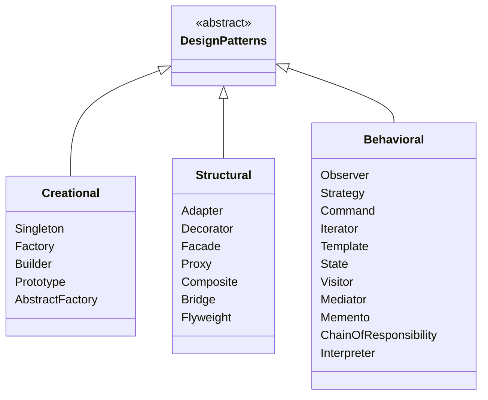
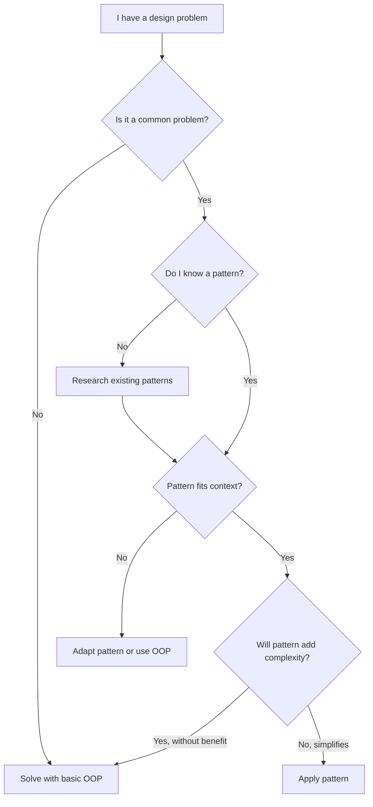
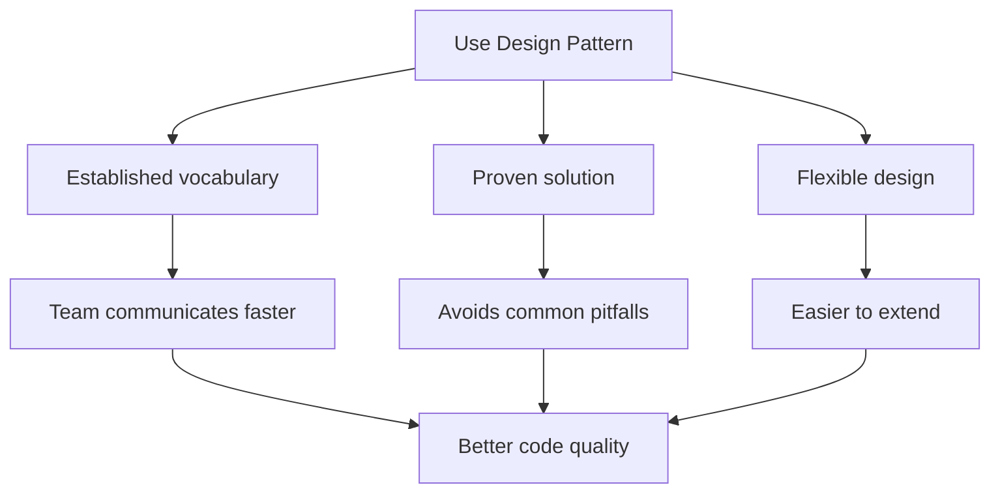
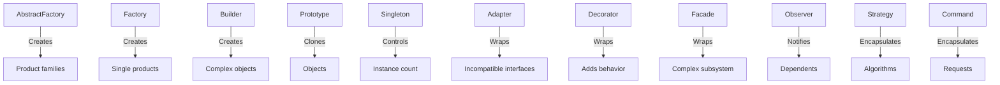

# Introduction to Design Patterns

Design patterns are reusable solutions to common problems in software design. They are not finished designs that you copy-paste, but templates for solving problems in context. Patterns represent battle-tested approaches that have evolved over decades.

> [!NOTE]
> The concept of design patterns was popularized by the "Gang of Four" (GoF) — Erich Gamma, Richard Helm, Ralph Johnson, and John Vlissides — in their 1994 book *Design Patterns: Elements of Reusable Object-Oriented Software*.

## What Are Design Patterns?

A design pattern describes a problem that occurs repeatedly, the core of the solution, and the consequences of applying it. Each pattern has four essential elements:

1. **Pattern name** — a handle for description
2. **Problem** — when to apply the pattern
3. **Solution** — the elements and their relationships
4. **Consequences** — trade-offs and results

```python
# Without a pattern: ad-hoc approach to creating objects
def create_database_connection():
    # Every caller creates their own connection
    return Database("localhost", 5432)

# With Singleton pattern: controlled instance management
class DatabaseConnection:
    _instance = None

    def __new__(cls):
        if cls._instance is None:
            cls._instance = super().__new__(cls)
            cls._instance._connection = Database("localhost", 5432)
        return cls._instance
```

## The Gang of Four Classification

The GoF cataloged 23 patterns into three categories based on their purpose:



### Creational Patterns

Creational patterns abstract the instantiation process. They make a system independent of how its objects are created, composed, and represented.

| Pattern | Purpose | Python Example |
|---------|---------|----------------|
| Singleton | Ensure a class has only one instance | Database connection pool |
| Factory | Create objects without specifying exact class | Payment processor creation |
| Builder | Construct complex objects step by step | HTML report builder |
| Prototype | Clone existing objects | Configuration templates |
| Abstract Factory | Create families of related objects | UI theme factory |

### Structural Patterns

Structural patterns compose classes and objects into larger structures while keeping them flexible and efficient.

| Pattern | Purpose | Python Example |
|---------|---------|----------------|
| Adapter | Match interfaces of different classes | Legacy API wrapper |
| Decorator | Add responsibilities to objects dynamically | Logging middleware |
| Facade | Provide a unified interface to a subsystem | API gateway |
| Proxy | Control access to another object | Lazy loading |
| Composite | Treat individual and composite objects uniformly | File system tree |

### Behavioral Patterns

Behavioral patterns distribute algorithms and responsibilities among objects.

| Pattern | Purpose | Python Example |
|---------|---------|----------------|
| Observer | Notify multiple objects about state changes | Event system |
| Strategy | Swap algorithms at runtime | Sorting strategy |
| Command | Encapsulate requests as objects | Undo/redo |
| Iterator | Traverse collections without exposing internals | Custom iterable |
| Template | Define skeleton of algorithm with hook methods | Data pipeline |

## When to Use Design Patterns



> [!WARNING]
> Do not overuse patterns. A pattern should solve a problem, not create one. If a simple function suffices, do not add a Strategy pattern. Patterns add complexity — use them only when the complexity pays off.

## Pattern Selection Guide

```python
# Problem: I need to create different types of objects based on input
# Solution: Factory pattern

def create_payment_processor(method: str) -> PaymentProcessor:
    processors = {
        "credit_card": CreditCardProcessor,
        "paypal": PayPalProcessor,
        "stripe": StripeProcessor,
    }
    processor_class = processors.get(method)
    if not processor_class:
        raise ValueError(f"Unknown payment method: {method}")
    return processor_class()
```

```python
# Problem: I need to add behavior to objects without modifying them
# Solution: Decorator pattern

def log_execution(func):
    def wrapper(*args, **kwargs):
        logger.info(f"Calling {func.__name__}")
        result = func(*args, **kwargs)
        logger.info(f"{func.__name__} returned {result}")
        return result
    return wrapper

@log_execution
def process_payment(amount: float) -> str:
    # Payment logic
    return "success"
```

## Patterns Are Not Recipes

A common misconception is that design patterns are plug-and-play solutions. They are not. Each pattern must be adapted to your specific context.

```python
# Anti-pattern: copying GoF example blindly (Java-style Singleton)
class Singleton:
    _instance = None

    @staticmethod
    def get_instance():
        if Singleton._instance is None:
            Singleton._instance = Singleton()
        return Singleton._instance

# Pythonic Singleton: use module-level constant
# database.py
connection = DatabaseConnection("localhost", 5432)

# Use: from database import connection
```

## Benefits of Design Patterns

| Benefit | Description |
|---------|-------------|
| Reusability | Proven solutions you do not have to reinvent |
| Communication | Shared vocabulary for design discussions |
| Maintainability | Well-structured code is easier to change |
| Flexibility | Loosely coupled systems adapt to new requirements |
| Documentation | Pattern names convey design intent |
| Best practices | Incorporate decades of industry wisdom |

## Common Misconceptions About Design Patterns

### "Patterns are a silver bullet"

No single pattern solves all problems. Each pattern addresses a specific concern and introduces trade-offs. The Factory pattern adds complexity in exchange for flexibility. The Singleton solves instance control but creates global state.

### "You must use patterns everywhere"

Patterns are solutions, not goals. If a simple dictionary lookup replaces a Strategy pattern, use the dictionary. Over-engineering with patterns is a common anti-pattern itself.

### "Patterns are only for OOP languages"

While GoF patterns emphasize OOP concepts like inheritance and polymorphism, many patterns translate to functional or multi-paradigm languages. Python, for instance, implements Strategy with first-class functions and Decorator with function wrappers.

### "Patterns are outdated"

Some developers claim patterns are no longer relevant due to modern frameworks. In reality, frameworks are built *using* patterns. Understanding patterns helps you understand frameworks at a deeper level.

## Pattern Documentation Template

When documenting a pattern for your team, use this template:

```markdown
## Pattern: [Name]

**Intent**: One-sentence description.

**Problem**: When should you use this pattern?

**Solution**: Core structure and participants.

**Python Example**: Minimal working code.

**Trade-offs**: What do you gain and lose?

**Related Patterns**: How does this connect to other patterns?
```

Example:

```python
"""
Pattern: Factory Method

Intent: Define an interface for creating an object, but let subclasses
        decide which class to instantiate.

Problem: A class cannot anticipate the class of objects it must create.
         A class wants its subclasses to specify the objects it creates.

Solution: Define a factory method that returns a product. Subclasses
          override to return different product implementations.

Trade-offs:
  + Eliminates tight coupling to concrete classes
  + Follows Open/Closed Principle
  - Introduces many subclasses
  - Complexity may be unnecessary for simple cases
"""
```

## Real-World Pattern Usage

### Web Frameworks

Django and FastAPI use patterns extensively:

- **Singleton**: Django's `settings` object is effectively a Singleton
- **Factory**: Django REST Framework's serializer classes use Factory
- **Observer**: Django signals (pre_save, post_save) implement Observer
- **Strategy**: Authentication backends in Django use Strategy
- **Command**: Management commands in Django use Command pattern
- **Decorator**: `@login_required`, `@permission_required` are Decorators

### Standard Library Examples

Python's standard library itself contains pattern implementations:

```python
# Iterator pattern: built into every collection
for item in my_list:
    print(item)

# Strategy pattern: key functions for sorting
sorted(data, key=str.lower)

# Decorator pattern: property, classmethod, staticmethod
@property
def full_name(self):
    return f"{self.first} {self.last}"

# Observer pattern: asyncio events
import asyncio
event = asyncio.Event()
# Multiple coroutines can wait for the same event
```

## Benefits of Design Patterns Flow



## Common Anti-Patterns to Avoid

### 1. Pattern Overuse

```python
# Over-engineered: Strategy pattern for a simple if-else
class GreetingStrategy:
    def greet(self, name: str) -> str:
        raise NotImplementedError

class EnglishGreeting(GreetingStrategy):
    def greet(self, name: str) -> str:
        return f"Hello, {name}!"

class SpanishGreeting(GreetingStrategy):
    def greet(self, name: str) -> str:
        return f"¡Hola, {name}!"

def greet(name: str, language: str) -> str:
    strategies = {"en": EnglishGreeting(), "es": SpanishGreeting()}
    return strategies[language].greet(name)

# Simple alternative: just use a dictionary of functions
def greet(name: str, language: str) -> str:
    greetings = {"en": f"Hello, {name}!", "es": f"¡Hola, {name}!"}
    return greetings[language]
```

### 2. Singleton Abuse

Using Singleton for everything that "should have only one instance" creates hidden global dependencies.

### 3. Pattern for Pattern's Sake

Applying patterns just to have patterns in your resume code.

## Patterns in Python vs Other Languages

Python's dynamic nature means some patterns are simpler or even built-in:

| Pattern | Java Approach | Python Approach |
|---------|---------------|-----------------|
| Singleton | Class with static instance | Module-level variable |
| Iterator | Implement Iterable interface | `__iter__` / `__next__` or generator |
| Decorator | Annotation framework | First-class decorator functions |
| Strategy | Interface + implementation classes | First-class functions / dict |
| Observer | Event listener interfaces | Callbacks / signals |

```python
# Java-style Iterator
class Range:
    def __init__(self, start, end):
        self.start = start
        self.end = end

    def __iter__(self):
        self.current = self.start
        return self

    def __next__(self):
        if self.current >= self.end:
            raise StopIteration
        value = self.current
        self.current += 1
        return value

# Pythonic generator
def range_generator(start: int, end: int):
    for i in range(start, end):
        yield i
```

## Pattern Relationships



> [!SUCCESS]
> Design patterns are tools, not rules. Learn them to build your vocabulary and recognize common problems, but always choose the simplest solution that works.

## Practice Exercises

1. **Pattern identification**: Look at your current project and identify at least 2 places where you are already using a design pattern (even unknowingly).

2. **GoF catalog**: Research one pattern from each category (Creational, Structural, Behavioral) and write a one-paragraph summary of each.

3. **Pattern vs simple**: Take a piece of code that uses a simple if-else chain. Implement it with a Strategy pattern. Compare the two approaches — which is better?

4. **Anti-pattern hunt**: Find a place in your codebase where a pattern is overused or misapplied. Simplify it.

5. **Pythonic rewrite**: Take a Java-style pattern implementation and rewrite it in a more Pythonic way.

6. **Pattern decision**: You need to create a system that can send notifications via email, SMS, and push notifications. Which pattern(s) would you use? Justify.

7. **Singleton audit**: Find all Singleton-like patterns in your codebase. Determine which are appropriate and which should be replaced with module-level variables.

8. **Pattern communication**: Describe a complex part of your architecture to a colleague using only pattern names. Does this improve understanding?
