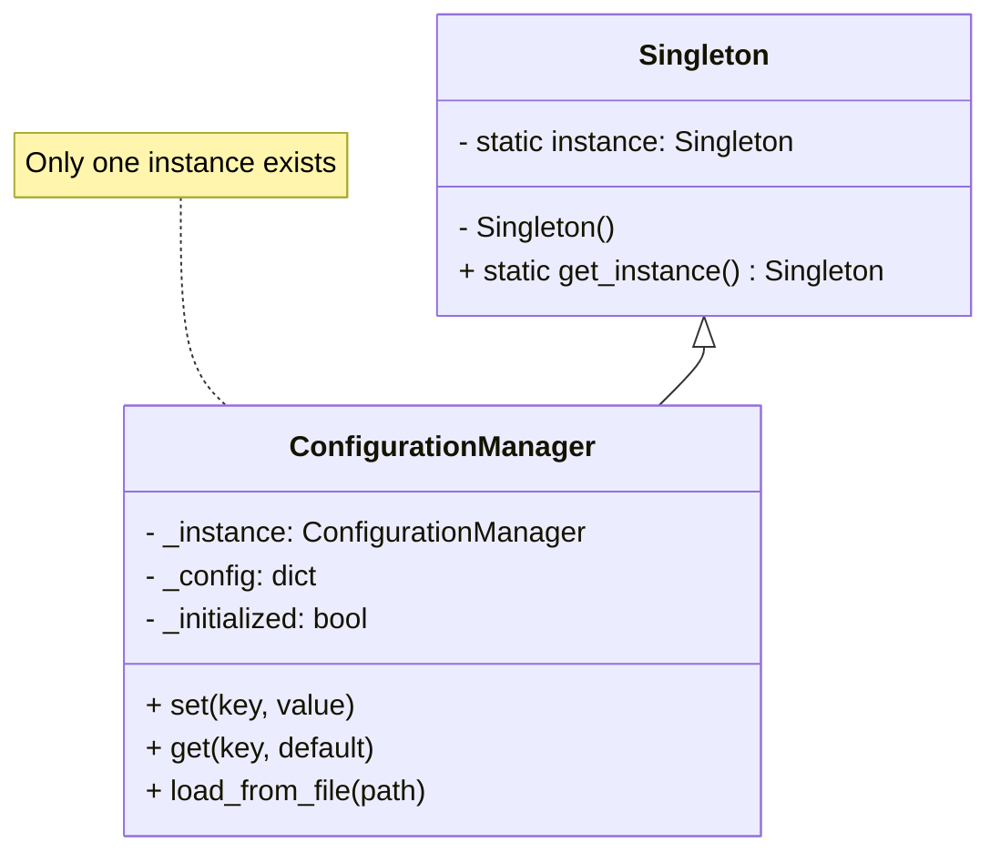
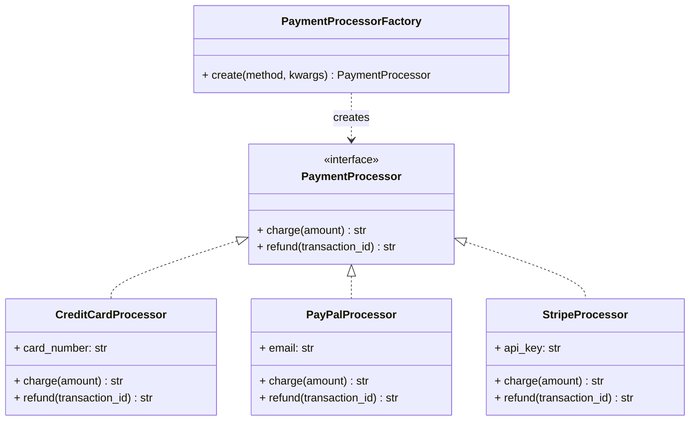
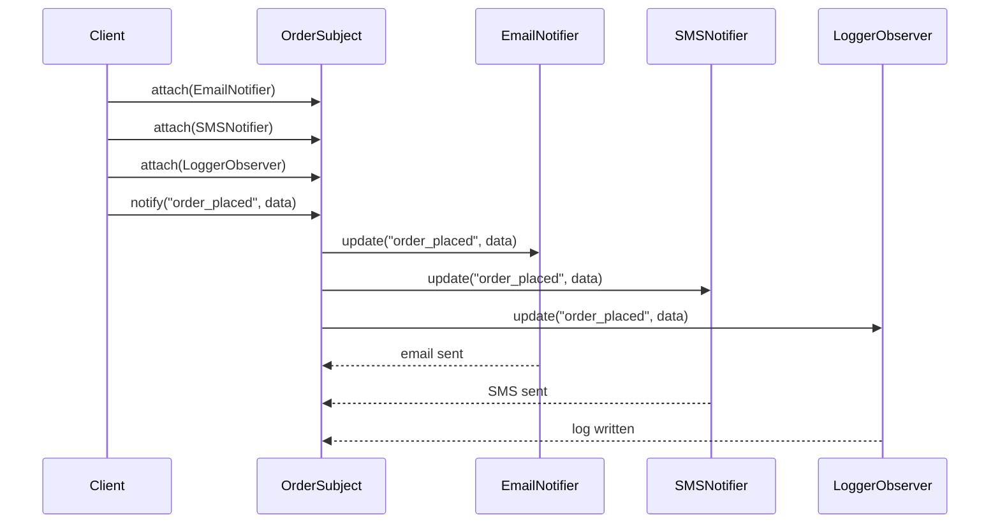
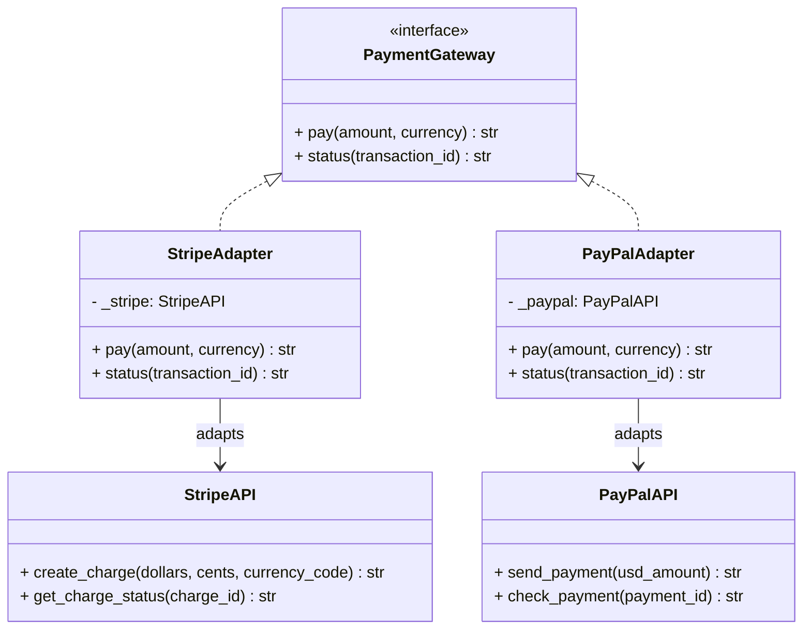
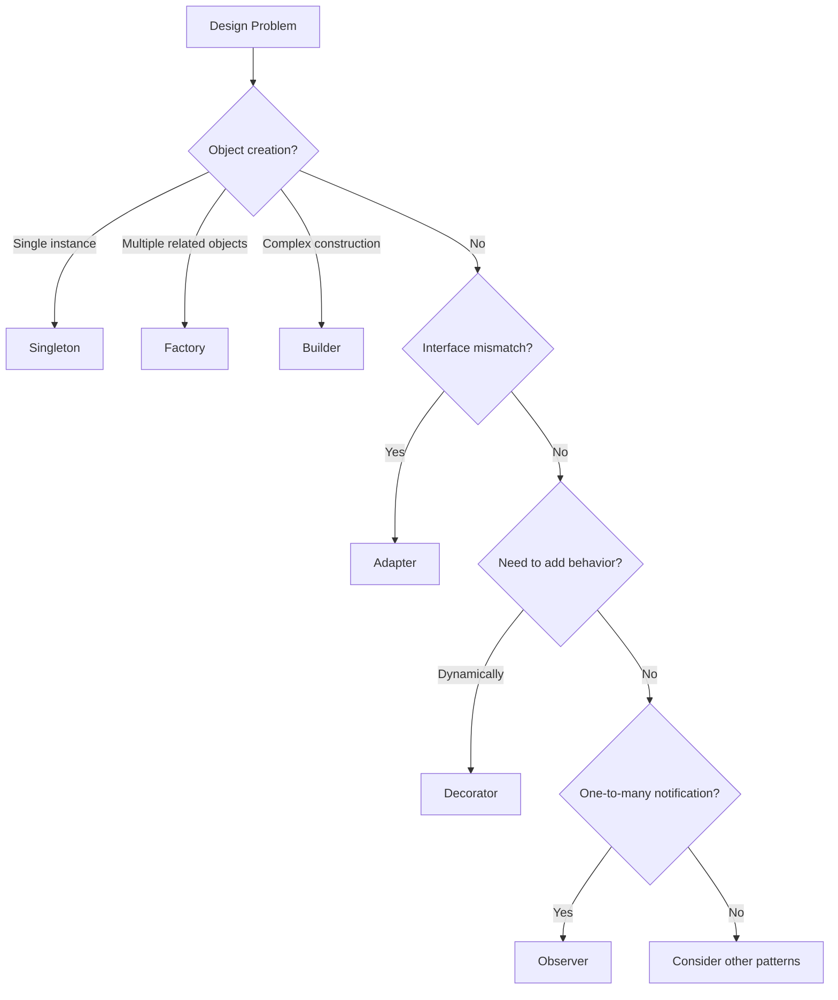

# Creational & Structural Patterns

Creational patterns deal with object creation mechanisms, while structural patterns compose classes and objects into larger structures. Together, they form the foundation of flexible, reusable object-oriented design.

> [!NOTE]
> This lesson covers the most widely used patterns from the Creational and Structural categories. Mastering these four patterns — Singleton, Factory, Observer, Adapter — will solve a majority of common design challenges.

## Singleton Pattern

**Purpose**: Ensure a class has only one instance and provide a global point of access to it.

### When to Use

- A single database connection pool
- A shared configuration manager
- A logging service
- A cache manager

### Python Implementation

```python
class ConfigurationManager:
    """Thread-safe Singleton for application configuration."""

    _instance = None
    _initialized = False

    def __new__(cls):
        if cls._instance is None:
            cls._instance = super().__new__(cls)
        return cls._instance

    def __init__(self):
        if self._initialized:
            return
        self._config: dict = {}
        self._initialized = True

    def set(self, key: str, value: any) -> None:
        self._config[key] = value

    def get(self, key: str, default: any = None) -> any:
        return self._config.get(key, default)

    def load_from_file(self, path: str) -> None:
        import json
        with open(path) as f:
            self._config.update(json.load(f))


# Usage
config = ConfigurationManager()
config.set("database_url", "postgres://localhost:5432/app")
config.set("debug", True)

# Same instance
another_ref = ConfigurationManager()
assert config is another_ref  # True
print(another_ref.get("database_url"))  # postgres://localhost:5432/app
```

### Singleton Class Diagram



### Trade-offs

| Advantage | Disadvantage |
|-----------|-------------|
| Controlled access to single instance | Global state makes testing harder |
| Reduced memory footprint | Creates hidden dependencies |
| Lazy initialization possible | Violates Single Responsibility Principle |
| Avoids resource contention | Tight coupling to the singleton class |

> [!WARNING]
> Singletons are often overused. In Python, a module-level variable is usually simpler and achieves the same goal without the ceremony.

## Factory Pattern

**Purpose**: Define an interface for creating an object, but let subclasses decide which class to instantiate.

### When to Use

- Creating objects based on runtime configuration
- Decoupling client code from concrete classes
- Centralizing object creation logic

### Python Implementation

```python
from abc import ABC, abstractmethod
from dataclasses import dataclass
from typing import Protocol


# Product interface
class PaymentProcessor(Protocol):
    def charge(self, amount: float) -> str: ...

    def refund(self, transaction_id: str) -> str: ...


# Concrete products
@dataclass
class CreditCardProcessor:
    card_number: str

    def charge(self, amount: float) -> str:
        return f"Charged ${amount:.2f} to card {self.card_number[-4:]}"

    def refund(self, transaction_id: str) -> str:
        return f"Refunded transaction {transaction_id}"


@dataclass
class PayPalProcessor:
    email: str

    def charge(self, amount: float) -> str:
        return f"Charged ${amount:.2f} via PayPal ({self.email})"

    def refund(self, transaction_id: str) -> str:
        return f"Refunded PayPal transaction {transaction_id}"


@dataclass
class StripeProcessor:
    api_key: str

    def charge(self, amount: float) -> str:
        return f"Charged ${amount:.2f} via Stripe"

    def refund(self, transaction_id: str) -> str:
        return f"Refunded Stripe transaction {transaction_id}"


# Factory
class PaymentProcessorFactory:
    """Creates payment processors based on method type."""

    _processors = {
        "credit_card": CreditCardProcessor,
        "paypal": PayPalProcessor,
        "stripe": StripeProcessor,
    }

    @classmethod
    def create(cls, method: str, **kwargs) -> PaymentProcessor:
        processor_class = cls._processors.get(method)
        if not processor_class:
            raise ValueError(f"Unknown payment method: {method}")
        return processor_class(**kwargs)


# Usage
def process_payment(method: str, amount: float, **details) -> str:
    processor = PaymentProcessorFactory.create(method, **details)
    return processor.charge(amount)


print(process_payment("credit_card", 99.99, card_number="4111111111111111"))
print(process_payment("paypal", 49.99, email="user@example.com"))
```

### Factory Class Diagram



## Observer Pattern

**Purpose**: Define a one-to-many dependency between objects so that when one object changes state, all its dependents are notified and updated automatically.

### When to Use

- Event handling systems
- UI updates from data changes
- Publish-subscribe systems
- Real-time data feeds

### Python Implementation

```python
from abc import ABC, abstractmethod
from dataclasses import dataclass, field
from typing import List


class Observer(ABC):
    """Interface for all observers."""

    @abstractmethod
    def update(self, event_type: str, data: any) -> None: ...


@dataclass
class EmailNotifier(Observer):
    email: str

    def update(self, event_type: str, data: any) -> None:
        print(f"[EMAIL to {self.email}] {event_type}: {data}")


@dataclass
class SMSNotifier(Observer):
    phone: str

    def update(self, event_type: str, data: any) -> None:
        print(f"[SMS to {self.phone}] {event_type}: {data}")


@dataclass
class LoggerObserver(Observer):
    log_file: str

    def update(self, event_type: str, data: any) -> None:
        print(f"[LOG to {self.log_file}] {event_type}: {data}")


class OrderSubject:
    """Subject being observed — an order system."""

    def __init__(self):
        self._observers: List[Observer] = []

    def attach(self, observer: Observer) -> None:
        self._observers.append(observer)

    def detach(self, observer: Observer) -> None:
        self._observers.remove(observer)

    def notify(self, event_type: str, data: any) -> None:
        for observer in self._observers:
            observer.update(event_type, data)


# Usage
order_system = OrderSubject()

# Register observers
order_system.attach(EmailNotifier("admin@shop.com"))
order_system.attach(SMSNotifier("+1234567890"))
order_system.attach(LoggerObserver("orders.log"))

# Trigger events
order_system.notify("order_placed", {"id": 123, "total": 99.99})
order_system.notify("payment_received", {"id": 123, "amount": 99.99})
order_system.notify("order_shipped", {"id": 123, "tracking": "TRACK123"})
```

### Observer Sequence Diagram



## Adapter Pattern

**Purpose**: Convert the interface of a class into another interface that clients expect. Adapter lets classes work together that could not otherwise because of incompatible interfaces.

### When to Use

- Integrating legacy systems
- Using third-party libraries with different interfaces
- Wrapping APIs for consistency

### Python Implementation

```python
from abc import ABC, abstractmethod
from dataclasses import dataclass


# Target interface (what the client expects)
class PaymentGateway(ABC):
    @abstractmethod
    def pay(self, amount: float, currency: str) -> str: ...

    @abstractmethod
    def status(self, transaction_id: str) -> str: ...


# Adaptee 1: Third-party library with different interface
class StripeAPI:
    """Stripe's native API (different method names)."""

    def create_charge(self, dollars: int, cents: int, currency_code: str) -> str:
        return f"stripe_txn_{dollars}_{cents}_{currency_code}"

    def get_charge_status(self, charge_id: str) -> str:
        return "completed"


# Adapter for Stripe
class StripeAdapter(PaymentGateway):
    def __init__(self, stripe_api: StripeAPI):
        self._stripe = stripe_api

    def pay(self, amount: float, currency: str) -> str:
        dollars = int(amount)
        cents = int((amount - dollars) * 100)
        return self._stripe.create_charge(dollars, cents, currency)

    def status(self, transaction_id: str) -> str:
        return self._stripe.get_charge_status(transaction_id)


# Adaptee 2: Another library
class PayPalAPI:
    def send_payment(self, usd_amount: float) -> str:
        return f"paypal_{usd_amount}"

    def check_payment(self, payment_id: str) -> str:
        return "success"


class PayPalAdapter(PaymentGateway):
    def __init__(self, paypal_api: PayPalAPI):
        self._paypal = paypal_api

    def pay(self, amount: float, currency: str) -> str:
        if currency != "USD":
            raise ValueError("PayPal only supports USD")
        return self._paypal.send_payment(amount)

    def status(self, transaction_id: str) -> str:
        return self._paypal.check_payment(transaction_id)


# Client code
def process_transaction(gateway: PaymentGateway, amount: float, currency: str) -> None:
    txn_id = gateway.pay(amount, currency)
    print(f"Transaction: {txn_id}")
    print(f"Status: {gateway.status(txn_id)}")


# Usage
stripe_adapter = StripeAdapter(StripeAPI())
paypal_adapter = PayPalAdapter(PayPalAPI())

process_transaction(stripe_adapter, 99.99, "USD")
process_transaction(paypal_adapter, 49.99, "USD")
```

### Adapter Class Diagram



## Real-World Example: E-Commerce Order System

Combining Factory, Observer, and Adapter:

```python
from dataclasses import dataclass, field
from typing import List, Protocol


# --- Factory: Creating payment gateways ---
class PaymentGateway(Protocol):
    def charge(self, amount: float) -> str: ...


class StripeGateway:
    def charge(self, amount: float) -> str:
        return f"stripe:{amount}"


class PayPalGateway:
    def charge(self, amount: float) -> str:
        return f"paypal:{amount}"


def create_gateway(method: str) -> PaymentGateway:
    gateways = {"stripe": StripeGateway, "paypal": PayPalGateway}
    return gateways[method]()


# --- Observer: Notifications ---
class Observer(Protocol):
    def update(self, event: str, data: dict) -> None: ...


@dataclass
class OrderManager:
    observers: List[Observer] = field(default_factory=list)

    def attach(self, observer: Observer) -> None:
        self.observers.append(observer)

    def notify(self, event: str, data: dict) -> None:
        for obs in self.observers:
            obs.update(event, data)


# --- Adapter: Legacy inventory system ---
class LegacyInventoryAPI:
    def check_stock(self, sku: str) -> int:
        return 42  # Legacy response

    def reserve_item(self, sku: str) -> bool:
        return True


class InventoryAdapter:
    def __init__(self):
        self._legacy = LegacyInventoryAPI()

    def is_in_stock(self, sku: str) -> bool:
        return self._legacy.check_stock(sku) > 0

    def reserve(self, sku: str) -> bool:
        return self._legacy.reserve_item(sku)


# Usage
order_mgr = OrderManager()
gateway = create_gateway("stripe")
inventory = InventoryAdapter()

if inventory.is_in_stock("PROD-001"):
    gateway.charge(49.99)
    inventory.reserve("PROD-001")
    order_mgr.notify("order_confirmed", {"sku": "PROD-001"})
```

## Pattern Selection Flow



> [!SUCCESS]
> These four patterns solve a surprising number of everyday design problems. Practice implementing each one until you can recognize when to apply them automatically.

## Practice Exercises

1. **Singleton refactor**: Take a class that creates expensive resources (database connections, API clients) and implement it as a Singleton. Measure memory savings.

2. **Factory expansion**: Extend the payment processor factory to support a new method (e.g., `crypto` or `bank_transfer`).

3. **Observer implementation**: Build a stock price tracker that notifies multiple investors when a price changes.

4. **Adapter for legacy code**: Find a third-party library with an awkward interface and write an Adapter that provides a clean API.

5. **Combined pattern**: Build a notification system that uses Factory to create notification channels (email, SMS, push) and Observer to distribute events.

6. **Real-world Singleton**: Implement a thread-safe Singleton cache for database query results.

7. **Adapter unit test**: Write unit tests for the StripeAdapter that mock the StripeAPI.

8. **Observer event filtering**: Extend the Observer pattern to support event filtering so observers only receive events they care about.
