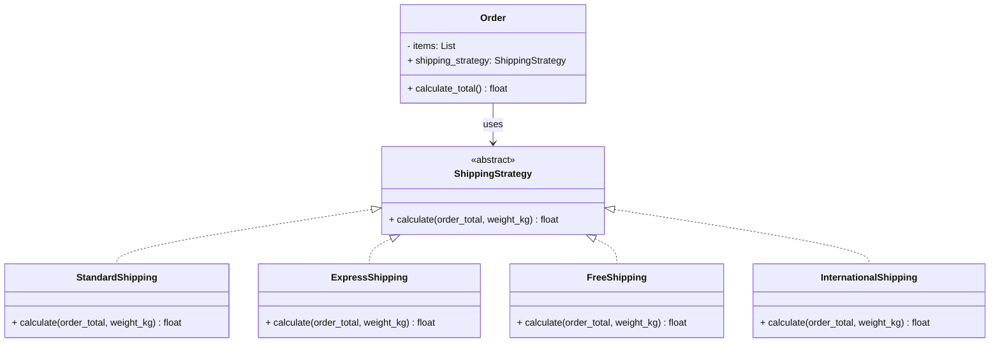
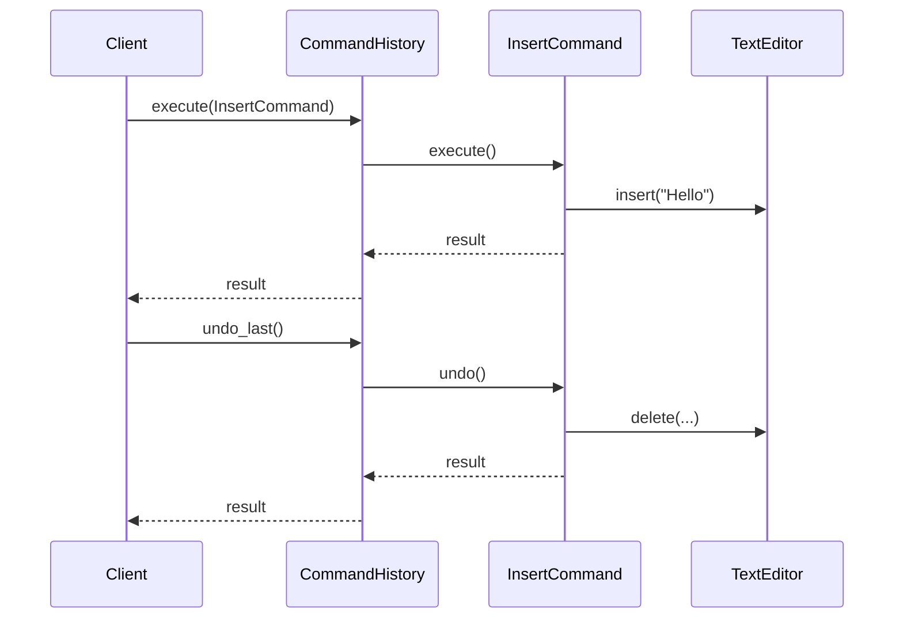
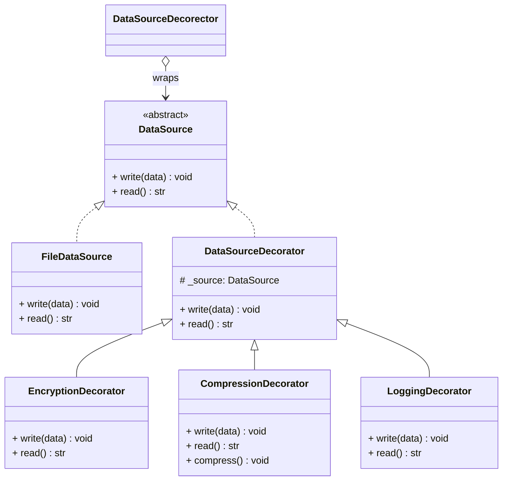
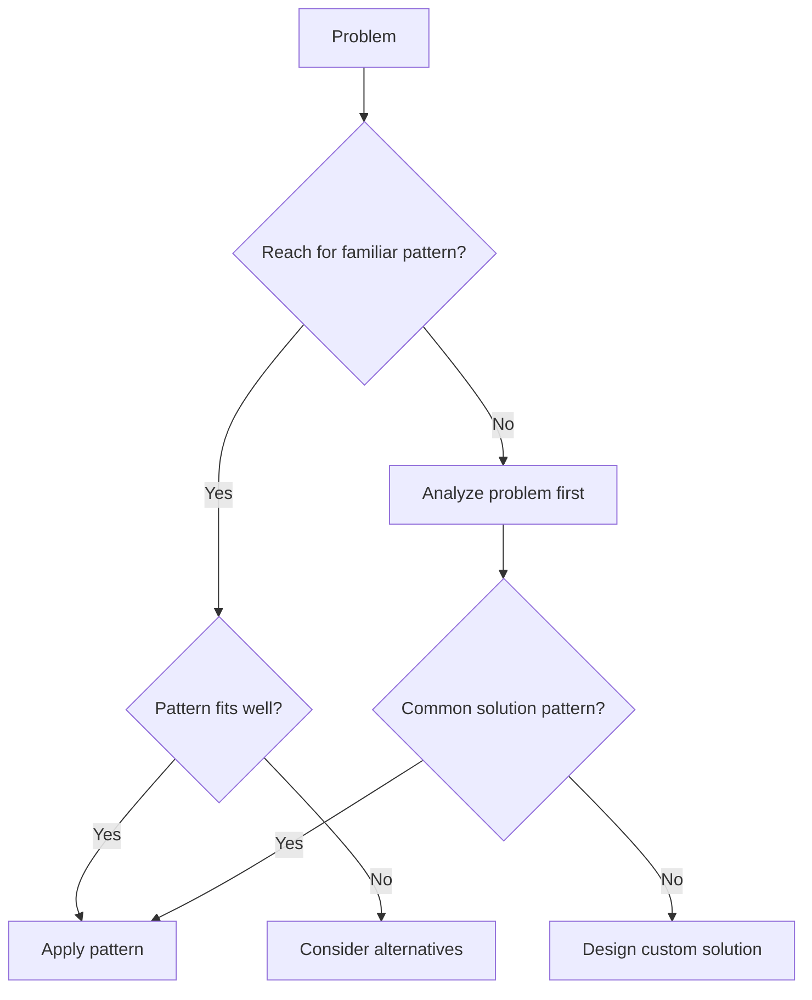
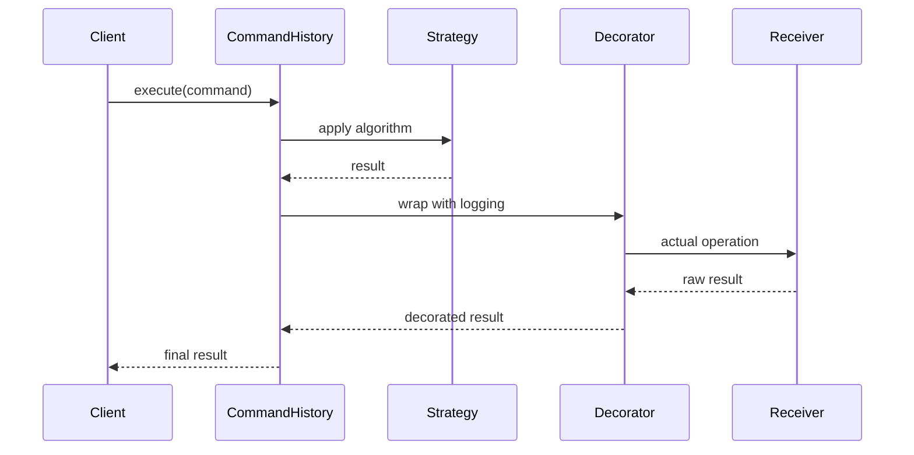

# Behavioral Patterns & Best Practices

Behavioral patterns focus on algorithms and the assignment of responsibilities between objects. They capture complex control flow that is difficult to follow at runtime, making it easier to reason about how your system behaves.

> [!NOTE]
> Behavioral patterns are the largest category in the GoF catalog (11 patterns). They answer the question: "How do objects communicate and collaborate?"

## Strategy Pattern

**Purpose**: Define a family of algorithms, encapsulate each one, and make them interchangeable. Strategy lets the algorithm vary independently from the clients that use it.

### When to Use

- Multiple algorithms for the same task
- Conditional logic with many if-else branches
- Selecting behavior at runtime

### Python Implementation

```python
from abc import ABC, abstractmethod
from dataclasses import dataclass
from typing import List


# Strategy interface
class ShippingStrategy(ABC):
    @abstractmethod
    def calculate(self, order_total: float, weight_kg: float) -> float: ...


# Concrete strategies
class StandardShipping(ShippingStrategy):
    def calculate(self, order_total: float, weight_kg: float) -> float:
        base_rate = 5.99
        weight_surcharge = weight_kg * 0.50
        return base_rate + weight_surcharge


class ExpressShipping(ShippingStrategy):
    def calculate(self, order_total: float, weight_kg: float) -> float:
        base_rate = 14.99
        weight_surcharge = weight_kg * 1.20
        return base_rate + weight_surcharge


class FreeShipping(ShippingStrategy):
    def calculate(self, order_total: float, weight_kg: float) -> float:
        return 0.0


class InternationalShipping(ShippingStrategy):
    def calculate(self, order_total: float, weight_kg: float) -> float:
        base_rate = 25.00
        weight_surcharge = weight_kg * 3.50
        customs_fee = order_total * 0.10
        return base_rate + weight_surcharge + customs_fee


# Context
@dataclass
class Order:
    items: List[dict]
    shipping_strategy: ShippingStrategy

    def calculate_total(self) -> float:
        subtotal = sum(item["price"] * item["quantity"] for item in self.items)
        weight = sum(item.get("weight_kg", 0) * item["quantity"] for item in self.items)
        shipping = self.shipping_strategy.calculate(subtotal, weight)
        return subtotal + shipping


# Usage
order = Order(
    items=[
        {"name": "Laptop", "price": 999.99, "quantity": 1, "weight_kg": 2.5},
        {"name": "Mouse", "price": 29.99, "quantity": 2, "weight_kg": 0.2},
    ],
    shipping_strategy=ExpressShipping(),
)

print(f"Total with express shipping: ${order.calculate_total():.2f}")

# Switch strategy at runtime
order.shipping_strategy = FreeShipping()
print(f"Total with free shipping: ${order.calculate_total():.2f}")
```

### Strategy Class Diagram



> [!TIP]
> In Python, you can often replace the Strategy pattern with a simple function or callable. Use the class-based approach when strategies have shared state or complex configuration.

## Command Pattern

**Purpose**: Encapsulate a request as an object, thereby letting you parameterize clients with different requests, queue or log requests, and support undoable operations.

### When to Use

- Undo/redo functionality
- Task queues and job scheduling
- Transactional operations
- Macro recording (composing commands)

### Python Implementation

```python
from abc import ABC, abstractmethod
from dataclasses import dataclass, field
from typing import List


# Command interface
class Command(ABC):
    @abstractmethod
    def execute(self) -> str: ...

    @abstractmethod
    def undo(self) -> str: ...


# Receiver
class TextEditor:
    def __init__(self):
        self.content = ""

    def insert(self, text: str, position: int = -1) -> None:
        if position == -1:
            self.content += text
        else:
            self.content = self.content[:position] + text + self.content[position:]

    def delete(self, start: int, end: int) -> str:
        deleted = self.content[start:end]
        self.content = self.content[:start] + self.content[end:]
        return deleted


# Concrete commands
@dataclass
class InsertCommand(Command):
    editor: TextEditor
    text: str
    position: int = -1

    def execute(self) -> str:
        self.editor.insert(self.text, self.position)
        return f"Inserted '{self.text}' at position {self.position}"

    def undo(self) -> str:
        if self.position == -1:
            start = len(self.editor.content) - len(self.text)
        else:
            start = self.position
        self.editor.delete(start, start + len(self.text))
        return f"Undid insertion of '{self.text}'"


@dataclass
class DeleteCommand(Command):
    editor: TextEditor
    start: int
    end: int
    _deleted_text: str = ""

    def execute(self) -> str:
        self._deleted_text = self.editor.delete(self.start, self.end)
        return f"Deleted '{self._deleted_text}'"

    def undo(self) -> str:
        self.editor.insert(self._deleted_text, self.start)
        return f"Restored '{self._deleted_text}'"


# Invoker
class CommandHistory:
    def __init__(self):
        self._history: List[Command] = []

    def execute(self, command: Command) -> str:
        result = command.execute()
        self._history.append(command)
        return result

    def undo_last(self) -> str:
        if not self._history:
            return "Nothing to undo"
        command = self._history.pop()
        return command.undo()


# Usage
editor = TextEditor()
history = CommandHistory()

print(history.execute(InsertCommand(editor, "Hello, ")))
print(history.execute(InsertCommand(editor, "World!")))
print(f"Content: '{editor.content}'")

print(history.execute(DeleteCommand(editor, 7, 13)))
print(f"Content: '{editor.content}'")

print(history.undo_last())
print(f"Content: '{editor.content}'")

print(history.undo_last())
print(f"Content: '{editor.content}'")
```

### Command Sequence Diagram



## Decorator Pattern

**Purpose**: Attach additional responsibilities to an object dynamically. Decorators provide a flexible alternative to subclassing for extending functionality.

> [!NOTE]
> Python has first-class support for the Decorator pattern via the `@decorator` syntax. While Python decorators modify functions, the classic GoF Decorator pattern works with objects.

### When to Use

- Adding logging, authentication, or caching to operations
- Calculating metrics and performance monitoring
- Adding validation or sanitization layers
- Extending third-party classes

### Python Implementation (Class-Based)

```python
from abc import ABC, abstractmethod
from dataclasses import dataclass


# Component interface
class DataSource(ABC):
    @abstractmethod
    def write(self, data: str) -> None: ...

    @abstractmethod
    def read(self) -> str: ...


# Concrete component
class FileDataSource(DataSource):
    def __init__(self, filename: str):
        self.filename = filename
        self._data = ""

    def write(self, data: str) -> None:
        self._data = data
        print(f"Written to {self.filename}: {data}")

    def read(self) -> str:
        return self._data


# Base decorator
class DataSourceDecorator(DataSource):
    def __init__(self, source: DataSource):
        self._source = source

    def write(self, data: str) -> None:
        self._source.write(data)

    def read(self) -> str:
        return self._source.read()


# Concrete decorators
class EncryptionDecorator(DataSourceDecorator):
    def write(self, data: str) -> None:
        encrypted = f"ENCRYPTED[{data}]"
        super().write(encrypted)

    def read(self) -> str:
        data = super().read()
        return data.replace("ENCRYPTED[", "").rstrip("]")


class CompressionDecorator(DataSourceDecorator):
    def write(self, data: str) -> None:
        compressed = f"COMPRESSED({data})"
        super().write(compressed)

    def read(self) -> str:
        data = super().read()
        return data.replace("COMPRESSED(", "").rstrip(")")

    def compress(self) -> None:
        print("Running compression algorithm...")


class LoggingDecorator(DataSourceDecorator):
    def write(self, data: str) -> None:
        print(f"[LOG] Writing {len(data)} bytes")
        super().write(data)

    def read(self) -> str:
        data = super().read()
        print(f"[LOG] Read {len(data)} bytes")
        return data


# Usage
source = FileDataSource("data.txt")
source = CompressionDecorator(source)
source = EncryptionDecorator(source)
source = LoggingDecorator(source)

source.write("Hello, World!")
print(f"Read: {source.read()}")
```

### Decorator Class Diagram



## Anti-Patterns to Avoid

### 1. God Object

A centralized class that knows too much or does too much.

```python
# Anti-pattern: God Object
class Application:
    def __init__(self):
        self.users = []
        self.orders = []
        self.inventory = {}
        self.payments = []
        self.email_server = ...
        self.logger = ...

    def process_order(self, ...):
        # Handles validation, payment, inventory, email, logging...
        pass

    def manage_users(self, ...):
        pass

    def generate_reports(self, ...):
        pass

# Solution: Split into focused classes
class UserManager: ...
class OrderProcessor: ...
class InventoryManager: ...
class PaymentService: ...
class ReportGenerator: ...
```

### 2. Spaghetti Code

Code with complex, tangled control structures.

```python
# Anti-pattern: Spaghetti code
def handle_request(request):
    if request.method == "GET":
        if request.path == "/users":
            if request.args.get("id"):
                # Get user by ID
                pass
            else:
                # List all users
                pass
        elif request.path == "/orders":
            # Handle orders
            pass
    elif request.method == "POST":
        # Handle POST
        pass

# Solution: Use clear routing
@app.get("/users/{user_id}")
def get_user(user_id: int): ...

@app.get("/users")
def list_users(): ...

@app.post("/orders")
def create_order(): ...
```

### 3. Copy-Paste Programming

Duplicating code instead of abstracting.

```python
# Anti-pattern: Copy-paste
def validate_user_email(email):
    if "@" not in email:
        raise ValueError("Invalid email")
    if len(email) > 255:
        raise ValueError("Email too long")

def validate_admin_email(email):
    if "@" not in email:
        raise ValueError("Invalid email")
    if len(email) > 255:
        raise ValueError("Email too long")

# Solution: Single function
def validate_email(email: str, max_length: int = 255) -> None:
    if "@" not in email:
        raise ValueError("Invalid email")
    if len(email) > max_length:
        raise ValueError(f"Email exceeds {max_length} characters")
```

### 4. Premature Optimization

```python
# Anti-pattern: Premature optimization
class FastLookupCache:
    def __init__(self):
        self._data = {}
        self._index = {}
        self._reverse_index = {}
        self._bloom_filter = ...
        self._lru_cache = ...

    # Hundreds of lines of cache optimization
    # ... but the app handles 10 requests/day

# Solution: Start simple, optimize when needed
class SimpleCache:
    def __init__(self):
        self._data = {}

    def get(self, key):
        return self._data.get(key)

    def set(self, key, value):
        self._data[key] = value
```

### 5. Golden Hammer

Using a familiar tool or pattern for every problem, even when inappropriate.



## Pattern Comparison

| Pattern | Purpose | Structure | When to Use |
|---------|---------|-----------|-------------|
| Strategy | Encapsulate algorithms | Context + Strategy interface | Multiple ways to do same task |
| Command | Encapsulate requests | Invoker + Command + Receiver | Undo/redo, task queues |
| Decorator | Add behavior dynamically | Wrapper chain | Extending third-party code |
| Observer | One-to-many notifications | Subject + Observers | Event systems, UI updates |
| Adapter | Interface conversion | Client + Adapter + Adaptee | Legacy integration |
| Factory | Object creation | Creator + Product interface | Runtime polymorphism |

## Real-World Architecture



> [!WARNING]
> Anti-patterns are not just "bad code" — they are common solutions to recurring problems that seem good initially but have negative consequences. Recognizing them is the first step to avoiding them.

## Practice Exercises

1. **Strategy implementation**: Build a pricing calculator that supports different discount strategies (percentage, fixed amount, buy-one-get-one).

2. **Command undo**: Extend the text editor example with a `ReplaceCommand` that supports undo/redo.

3. **Decorator chain**: Create a data pipeline with decorators for validation, transformation, and logging.

4. **Anti-pattern hunt**: Find a God Object in your codebase and split it into focused classes.

5. **Strategy vs if-else**: Take a function with a chain of if-elif-else and refactor it using the Strategy pattern. Compare testability.

6. **Command queue**: Implement a task queue using the Command pattern where commands can be queued, executed, and their results collected.

7. **Function decorator**: Write a Python `@` decorator that measures and logs execution time of any function.

8. **Anti-pattern documentation**: Document 3 anti-patterns present in a project you work on, with concrete examples and proposed refactorings.
