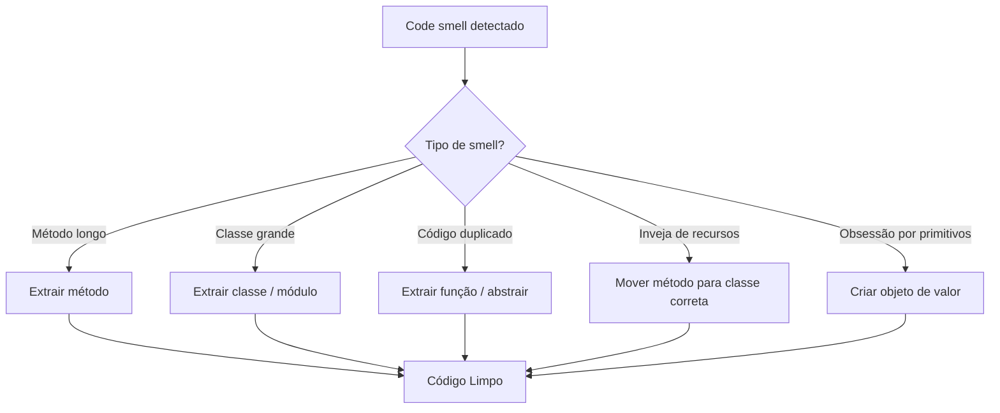
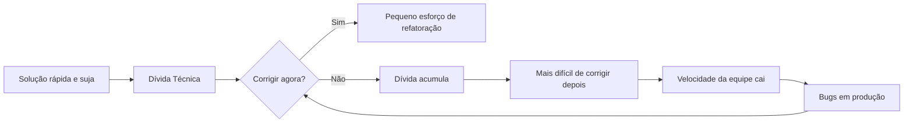
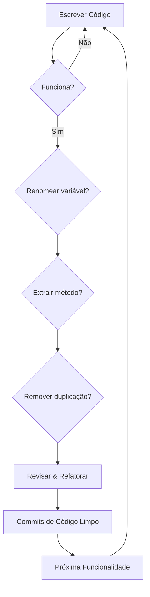

# O que é Código Limpo?

Código limpo é aquele fácil de ler, entender e manter. Não se trata de escrever linhas engenhosas ou exibir truques da linguagem — trata-se de comunicar a intenção claramente para outros desenvolvedores (incluindo você mesmo no futuro).

> [!NOTE]
> Robert C. Martin (Uncle Bob) popularizou o termo em seu livro *Código Limpo*, mas a filosofia existe desde os primórdios da engenharia de software. A ideia central: **código é lido com muito mais frequência do que é escrito.**

## Por que o Código Limpo é Importante

O software passa a maior parte de sua vida em modo de manutenção. Estudos mostram que desenvolvedores gastam **70–80% do tempo lendo código**, não escrevendo. Cada hora investida em escrever código limpo economiza dez horas de compreensão futura.

| Aspecto | Código Bagunçado | Código Limpo |
|---------|-----------------|--------------|
| Tempo para entender | Horas ou dias | Minutos |
| Taxa de introdução de bugs | Alta | Baixa |
| Integração de novos devs | Dolorosa | Suave |
| Confiança para refatorar | Nenhuma | Alta |
| Velocidade da equipe | Diminui com o tempo | Sustentada |

## A Regra do Escoteiro

> [!TIP]
> **"Deixe o acampamento mais limpo do que você encontrou."** — Escoteiros dos Estados Unidos

Aplicado ao código: toda vez que você tocar em um módulo, deixe-o um pouco melhor do que antes. Corrija um problema de formatação, renomeie uma variável confusa, extraia uma pequena função. Pequenas melhorias se acumulam em ganhos enormes.

```python
# Antes: bagunçado e confuso
def calc(a, b, c):
    x = a + b
    y = x * c
    return y

# Depois: limpo e com intenção explícita
def calcular_preco_total(preco_base: float, taxa_imposto: float) -> float:
    preco_com_imposto = preco_base + (preco_base * taxa_imposto)
    return preco_com_imposto
```

## Princípios Fundamentais do Código Limpo

### 1. Legibilidade

O código deve ser legível como uma boa prosa. Cada linha deve revelar seu propósito sem exigir esforço mental.

```python
# Difícil de ler
if not x.is_valid() or x.status != "active" or len(x.tags) == 0:
    return

# Fácil de ler
usuario_inativo = not x.is_valid() or x.status != "active"
sem_tags = len(x.tags) == 0
if usuario_inativo or sem_tags:
    return
```

### 2. Simplicidade

Siga o princípio KISS (Keep It Simple, Stupid). A solução mais simples é quase sempre a melhor.

```python
# Excessivamente complexo
def obter_nome_exibicao(usuario):
    if usuario is None:
        return "Anônimo"
    else:
        if usuario.nome is None or usuario.nome.strip() == "":
            return "Anônimo"
        else:
            return usuario.nome.strip()

# Simples e limpo
def obter_nome_exibicao(usuario) -> str:
    if usuario and usuario.nome and usuario.nome.strip():
        return usuario.nome.strip()
    return "Anônimo"
```

### 3. Evitar Duplicação (DRY)

Don't Repeat Yourself. Cada conhecimento deve ter uma representação única e inequívoca no sistema.

```python
# Lógica duplicada
def validar_email(email):
    if "@" not in email or "." not in email:
        raise ValueError("Email inválido")

def salvar_usuario(email, nome):
    if "@" not in email or "." not in email:
        raise ValueError("Email inválido")
    # lógica de salvamento...

# Versão DRY
def validar_email(email):
    if "@" not in email or "." not in email:
        raise ValueError("Email inválido")

def salvar_usuario(email, nome):
    validar_email(email)
    # lógica de salvamento...
```

## Code Smells (Maus Cheiros)

Code smells são indicadores de problemas mais profundos. Eles não impedem o código de funcionar, mas sinalizam que refatoração é necessária.



### Code Smells Comuns

| Smell | Sintoma | Correção |
|-------|---------|----------|
| Método longo | Método > 20 linhas | Extrair métodos menores |
| Classe grande | Classe fazendo demais | Dividir em classes focadas |
| Obsessão por primitivos | Usar primitivos para conceitos | Criar objetos de domínio |
| Inveja de recursos | Método usa outra classe demais | Mover método |
| Conglomerados de dados | Mesmos grupos de dados juntos | Criar uma classe |
| Comentários | Comentários explicando código ruim | Refatorar o código |

```python
# Code smell: Números mágicos
def calcular_desconto(preco):
    return preco * 0.1  # O que é 0.1?

# Limpo: Constantes nomeadas
TAXA_DESCONTO = 0.1

def calcular_desconto(preco: float) -> float:
    return preco * TAXA_DESCONTO
```

## O Custo da Dívida Técnica

Dívida técnica é o custo implícito de retrabalho causado por escolher uma solução fácil agora em vez de uma abordagem melhor que levaria mais tempo. Como dívida financeira, ela acumula juros.



> [!WARNING]
> Dívida técnica às vezes é necessária para prazos, mas nunca deixe ela crescer sem controle. Agende "sprints de limpeza" regulares para pagar os juros.

## Código Autodocumentável

Código limpo deve se documentar sozinho. Bons nomes e estrutura eliminam a necessidade da maioria dos comentários.

```python
# Ruim: precisa de comentários para explicar
def processar(d, t):
    # Calcula total com imposto
    r = d * t
    # Aplica desconto se maior que 100
    if d > 100:
        r = r * 0.9
    return r

# Bom: autodocumentável
def calcular_total_fatura(
    subtotal: float, taxa_imposto: float, taxa_desconto: float = 0.9
) -> float:
    total_com_imposto = subtotal * (1 + taxa_imposto)
    if subtotal > 100:
        total_com_imposto *= taxa_desconto
    return total_com_imposto
```

## Código Limpo na Prática

Exemplo real de processamento de pedido:

```python
from dataclasses import dataclass
from decimal import Decimal, ROUND_HALF_UP
from typing import List, Optional


@dataclass
class ItemPedido:
    nome: str
    quantidade: int
    preco_unitario: Decimal


class Pedido:
    TAXA_IMPOSTO = Decimal("0.08")
    LIMITE_FRETE_GRATIS = Decimal("50.00")
    CUSTO_FRETE = Decimal("5.99")

    def __init__(self, itens: List[ItemPedido]) -> None:
        self.itens = itens

    def calcular_subtotal(self) -> Decimal:
        return sum(
            item.quantidade * item.preco_unitario for item in self.itens
        )

    def calcular_imposto(self) -> Decimal:
        return (self.calcular_subtotal() * self.TAXA_IMPOSTO).quantize(
            Decimal("0.01"), rounding=ROUND_HALF_UP
        )

    def calcular_frete(self) -> Decimal:
        if self.calcular_subtotal() >= self.LIMITE_FRETE_GRATIS:
            return Decimal("0.00")
        return self.CUSTO_FRETE

    def calcular_total(self) -> Decimal:
        subtotal = self.calcular_subtotal()
        imposto = self.calcular_imposto()
        frete = self.calcular_frete()
        return subtotal + imposto + frete


def construir_pedido_do_carrinho(dados_carrinho: dict) -> Pedido:
    itens = [
        ItemPedido(
            nome=item["nome"],
            quantidade=item["quantidade"],
            preco_unitario=Decimal(str(item["preco"])),
        )
        for item in dados_carrinho["itens"]
    ]
    return Pedido(itens)
```

## Medindo Código Limpo

Como saber se o código é limpo? Embora não exista uma métrica perfeita, várias heurísticas ajudam:

| Métrica | O Que Mede | Alvo |
|---------|-----------|------|
| Complexidade ciclomática | Caminhos independentes | < 10 por função |
| Linhas por função | Tamanho das funções | < 20 linhas |
| Densidade de comentários | Comentários vs código | Baixa |
| Percentual de duplicação | Blocos de código repetidos | < 5% |
| Cobertura de testes | Linhas exercitadas por testes | > 80% |

### Checklist Prático de Código Limpo

- [ ] Cada nome de variável revela intenção
- [ ] Cada função faz exatamente uma coisa
- [ ] Nenhuma lógica duplicada existe
- [ ] Sem números ou strings mágicas
- [ ] Testes cobrem casos de borda
- [ ] Formatação é consistente
- [ ] Sem código comentado
- [ ] Tratamento de erros é explícito

## Estudo de Caso do Mundo Real

Considere uma plataforma de e-commerce que processa 10.000 pedidos diariamente. O código original tinha uma única função de 500 linhas que lidava com tudo. Após aplicar princípios de código limpo:

```python
# Antes: processamento monolítico de pedidos
def processar_pedido(dados_pedido):
    # 500 linhas de validação, cálculo, persistência, notificação, logging...
    if dados_pedido["pagamento"]["metodo"] == "cartao_credito":
        pass
    elif dados_pedido["pagamento"]["metodo"] == "paypal":
        pass
    with open("auditoria.log", "a") as f:
        f.write(str(dados_pedido))
    return {"sucesso": True, "pedido_id": 123}

# Depois: arquitetura limpa e sustentável
class ServicoPedido:
    def __init__(self, gateway_pagamento, servico_notificacao, auditoria):
        self.gateway_pagamento = gateway_pagamento
        self.servico_notificacao = servico_notificacao
        self.auditoria = auditoria

    def processar_pedido(self, pedido: Pedido) -> ResultadoPedido:
        self._validar_pedido(pedido)
        resultado = self.gateway_pagamento.cobrar(pedido.cliente, pedido.total)
        pedido.marcar_como_processado(resultado.id_transacao)
        self.auditoria.registrar_pedido_processado(pedido)
        self.servico_notificacao.enviar_confirmacao(pedido)
        return ResultadoPedido.sucesso(pedido.id)
```

A versão refatorada reduziu as taxas de bugs em 60% e diminuiu o tempo de integração de novos desenvolvedores de 2 semanas para 3 dias.

## Mentalidade de Código Limpo

Código limpo não é um destino — é uma prática contínua. Aqui estão os hábitos para cultivar:

1. **Leia antes de escrever**: Passe 10 minutos lendo código existente antes de adicionar novo código
2. **Nomeie antes de digitar**: Pense no nome certo antes de escrever a variável
3. **Refatore enquanto avança**: Deixe os módulos mais limpos do que os encontrou
4. **Revise seu próprio diff**: Antes de committar, revise criticamente suas mudanças
5. **Diga não aos atalhos**: Resista à tentação de "fazer funcionar agora"
6. **Aprenda com outros**: Leia código de projetos que você admira

## Como Começar a Escrever Código Limpo



> [!SUCCESS]
> Código limpo não é sobre perfeição — é sobre melhoria contínua. Cada commit deve deixar a base de código ligeiramente melhor do que você encontrou.

## Exercícios Práticos

1. **Refatore uma bagunça**: Pegue uma função de 50 linhas que você escreveu e extraia-a em 3-4 funções menores com nomes claros.

2. **Nomeie essa variável**: Encontre uma variável mal nomeada em sua base de código e renomeie-a para revelar a intenção. Exemplo: `d` → `data_entrega`, `x` → `taxa_imposto`.

3. **Regra do escoteiro**: Escolha um arquivo que você não escreveu e faça uma pequena melhoria (corrigir formatação, renomear variável, adicionar type hint).

4. **Caça aos smells**: Identifique pelo menos 3 code smells em um projeto que você trabalha. Documente o smell, o arquivo e a correção proposta.

5. **Refatoração DRY**: Encontre código duplicado em seu projeto e elimine-o. Meça a contagem de linhas antes e depois.

6. **Auditoria de números mágicos**: Pesquise em sua base de código por números mágicos. Substitua cada um por uma constante nomeada.

7. **Remoção de comentários**: Encontre um comentário que explica "o quê" em vez de "por quê". Refatore o código para tornar o comentário desnecessário e remova-o.

8. **Revisão de legibilidade**: Troque código com um colega. Peça para eles identificarem qualquer coisa confusa. Refatore com base no feedback.
