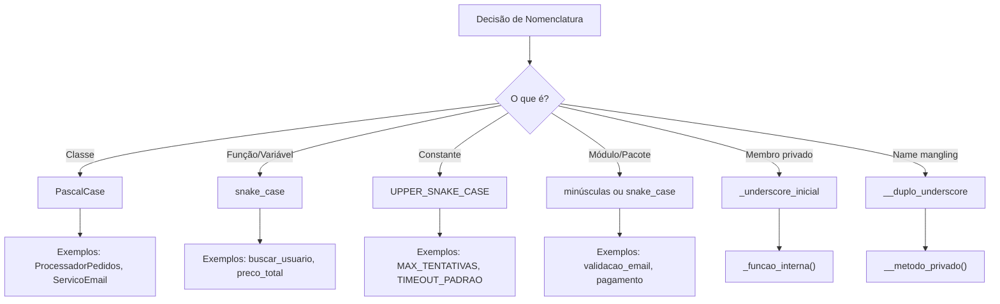
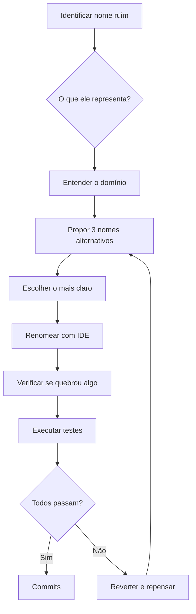
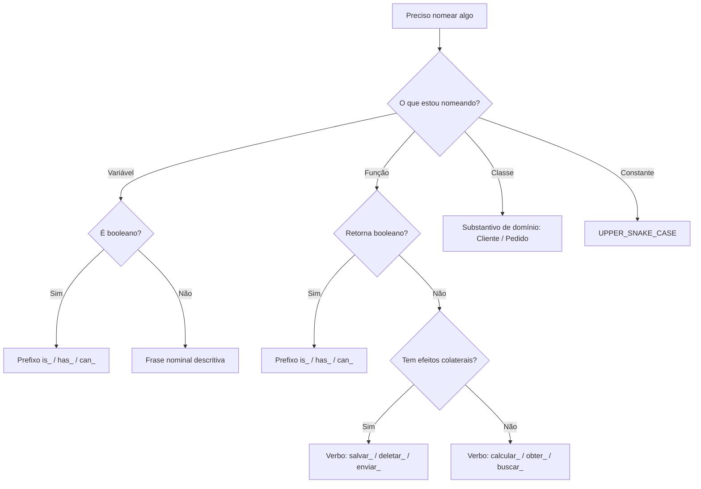

# Convenções de Nomenclatura

Nomear é um dos dois problemas mais difíceis na ciência da computação (junto com invalidação de cache e erros de deslocamento). Bons nomes reduzem a necessidade de comentários, tornam o código autodocumentável e previnem mal-entendidos.

> [!NOTE]
> Phil Karlton disse famosamente: "Só existem duas coisas difíceis na Ciência da Computação: invalidação de cache e nomear coisas." Uma boa nomenclatura exige empatia com o leitor.

## Por que a Nomenclatura é Importante

O código é escrito uma vez, mas lido dezenas de vezes. Um nome bem escolhido comunica a intenção instantaneamente. Um nome ruim força o leitor a rastrear mentalmente cada uso para entender o que a variável representa.

```python
# Nomenclatura ruim
def proc(lst):
    for i in lst:
        if i[3] > 0:
            print(i[0], i[1])

# Nomenclatura boa
def imprimir_usuarios_ativos(usuarios: list) -> None:
    for usuario in usuarios:
        if usuario["ativo"]:
            print(usuario["nome"], usuario["email"])
```

## Princípios da Boa Nomenclatura

### 1. Nomes que Revelam a Intenção

Um nome deve responder a três perguntas: Por que existe? O que faz? Como é usado?

```python
# Ruim
d = 5  # dias desde o último login

# Bom
dias_desde_ultimo_login = 5
```

```python
# Ruim
def pega_eles(lista):
    resultado = []
    for x in lista:
        if x[0] == 4:
            resultado.append(x)
    return resultado

# Bom
def obter_pedidos_ativos(linhas_pedido: list) -> list:
    pedidos_ativos = []
    for linha in linhas_pedido:
        if linha["status"] == StatusPedido.ATIVO:
            pedidos_ativos.append(linha)
    return pedidos_ativos
```

### 2. Evitar Desinformação

Não use nomes que deixam pistas falsas. Evite variações visualmente similares.

```python
# Desinformação: notação húngara sem propósito
str_nome = "Alice"        # É uma string, obviamente
int_contagem = 5          # O tipo é óbvio

# Melhor: sem prefixo enganoso
nome_usuario = "Alice"
contagem_itens = 5
```

```python
# Confuso: nomes visualmente similares
l = 1  # L minúsculo
O = 2  # O maiúsculo
resultado = l + O  # É 1+2 ou outra coisa?

# Limpo
operando_esquerdo = 1
operando_direito = 2
resultado = operando_esquerdo + operando_direito
```

### 3. Faça Distinções Significativas

Se os nomes precisam ser diferentes, eles devem significar coisas diferentes.

```python
# Distinção sem sentido
def processar_dados(a1, a2):
    pass

def processar_dados_v2(a1, a2):
    pass

# Distinção significativa
def processar_relatorio_mensal(dados_brutos: dict) -> dict:
    pass

def processar_relatorio_mensal_com_totais(dados_brutos: dict) -> dict:
    pass
```

## Nomenclatura por Tipo de Elemento

### Variáveis

Variáveis devem ser substantivos ou frases nominais que descrevem os dados que armazenam.

```python
# Ruim
t = "2024-01-15"
n = 42
x = ["Alice", "Bob"]

# Bom
data_atual = "2024-01-15"
maximo_tentativas = 42
membros_equipe = ["Alice", "Bob"]
```

### Variáveis Booleanas

Variáveis booleanas devem ser lidas como predicados: `is_`, `has_`, `can_`, `should_`.

```python
# Confuso
flag = True
status = False

# Claro
esta_verificado = True
tem_permissao = False
pode_editar = tem_permissao and esta_verificado
deve_repetir = contagem_erros < maximo_tentativas
```

### Funções

Funções devem ser verbos ou frases verbais que descrevem a ação executada.

```python
# Ruim
def dados():
    pass

def coisas(x, y):
    pass

# Bom
def buscar_preferencias_usuario(usuario_id: int) -> dict:
    pass

def calcular_distancia(ponto_a: tuple, ponto_b: tuple) -> float:
    pass

def validar_endereco_email(email: str) -> bool:
    pass
```

### Classes

Classes são substantivos ou frases nominais representando um conceito ou entidade.

```python
# Ruim
class Gerenciador:
    pass

class Coisa:
    pass

class Dados:
    pass

# Bom
class ProcessadorPedidos:
    pass

class RepositorioClientes:
    pass

class ServicoEmail:
    pass
```

## Convenções Específicas do Python



| Elemento | Convenção | Exemplo |
|----------|-----------|---------|
| Variável | `snake_case` | `nome_usuario`, `preco_total` |
| Constante | `UPPER_SNAKE_CASE` | `MAX_CONEXOES`, `CHAVE_API` |
| Função | `snake_case` | `buscar_usuario_por_id()` |
| Classe | `PascalCase` | `ProcessadorPedidos`, `ServicoEmail` |
| Módulo | `snake_case` | `validacao_email.py` |
| Privado | `_underscore_inicial` | `_funcao_interna()` |
| Mágico | `__dunder__` | `__init__`, `__str__` |

> [!TIP]
> PEP 8 é o guia de estilo oficial do Python. Use `snake_case` para funções e variáveis, `PascalCase` para classes e `UPPER_SNAKE_CASE` para constantes.

## Anti-Padrões de Nomenclatura

### 1. Nomes Codificados

```python
# Anti-padrão: codificando tipo no nome
strPrimeiroNome = "Alice"      # Notação húngara em Python
intIdade = 30                  # Já temos type hints
arrItens = [1, 2, 3]           # Prefixo desnecessário

# Limpo
primeiro_nome = "Alice"
idade = 30
itens = [1, 2, 3]
```

### 2. Abreviações

```python
# Anti-padrão: abreviações confusas
def calc_med_av(ids_usr, ids_prod):
    pass

# Limpo
def calcular_media_avaliacao(ids_usuarios: list, ids_produtos: list) -> float:
    pass
```

## Exemplo Real: Refatorando Nomes

Antes da refatoração:

```python
class func:
    def __init__(self, n, a, s):
        self.n = n
        self.a = a
        self.s = s

    def calc(self):
        if self.a >= 5:
            return self.s * 1.10
        return self.s
```

Depois da refatoração:

```python
class Funcionario:
    LIMITADOR_BONUS_ANOS = 5
    MULTIPLICADOR_BONUS = 1.10

    def __init__(self, nome_completo: str, anos_servico: int, salario_base: float):
        self.nome_completo = nome_completo
        self.anos_servico = anos_servico
        self.salario_base = salario_base

    def calcular_remuneracao_total(self) -> float:
        if self.anos_servico >= self.LIMITADOR_BONUS_ANOS:
            return self.salario_base * self.MULTIPLICADOR_BONUS
        return self.salario_base
```

## Abreviações e Acrônimos

Algumas abreviações são amplamente aceitas e devem ser usadas:

```python
# Aceitável: abreviações universais
def parse_html_document(source: str) -> Document:
    pass

def connect_to_db(connection_string: str) -> Connection:
    pass

def export_to_pdf(data: dict, filename: str) -> None:
    pass
```

A regra de ouro: use a abreviação se for mais conhecida que a forma expandida. `HTML` é melhor que `HyperTextMarkupLanguage`. `API` é melhor que `ApplicationProgrammingInterface`.

## Nomenclatura em Equipes

A consistência em toda a equipe é mais importante que qualquer regra individual. Estabeleça um guia de nomenclatura compartilhado:

```python
# Decisões de equipe para nomenclatura
# IDs de usuário: user_id (não uid, userId, ou ID_do_Usuario)
# Prefixos de tabela: tbl_orders (não orders_table)
# Nomes de serviço: OrderService (não order_service ou SvcOrder)
```

### Convenções para Testes

Testes também precisam de bons nomes. Um nome de teste deve descrever o cenário e o resultado esperado:

```python
def test_calculate_total_with_discount_returns_correct_amount():
    ...

def test_validate_email_with_invalid_format_raises_error():
    ...

def test_user_cannot_access_admin_panel_without_permission():
    ...
```

## Renomeando na Prática

Refatorar nomes existentes é uma habilidade importante. Aqui está um processo estruturado:



## Fluxo de Decisão de Nomenclatura



> [!SUCCESS]
> Uma boa nomenclatura é a prática de maior impacto para a manutenibilidade do código. Invista tempo escolhendo o nome certo — seu eu do futuro agradecerá.

## Exercícios Práticos

1. **Renomeie a bagunça**: Refatore estes nomes: `d` (dias em atraso), `lst` (catálogo de produtos), `tmp` (armazenamento temporário), `x` (percentual de imposto).

2. **Nomenclatura booleana**: Uma variável rastreia se um usuário completou a integração. Nomeie-a. Uma função verifica se um email é entregável. Nomeie-a.

3. **Nomenclatura de classes**: Você está modelando um sistema com: processamento de pagamentos, autenticação de usuários, geração de relatórios. Nomeie cada classe.

4. **Auditoria de módulos**: Analise os nomes de módulos do seu projeto. Substitua `utils.py` e `helpers.py` por nomes específicos do domínio.

5. **Caça à desinformação**: Encontre 3 nomes enganosos em código aberto e sugira alternativas melhores.

6. **Exercício de contexto**: Você tem variáveis `email`, `telefone`, `endereco`. Sem uma classe, a que conceito de domínio pertencem? Encapsule-as em uma classe apropriada.

7. **Expansão de abreviações**: Escreva uma função que expande abreviações no código: `calc_med_av` → `calcular_media_avaliacao`, `get_usr` → `obter_usuario`.

8. **Revisão por pares**: Peça a um colega para revisar 100 linhas do seu código e destacar qualquer nome que não esteja claro para eles. Refatore conforme necessário.
