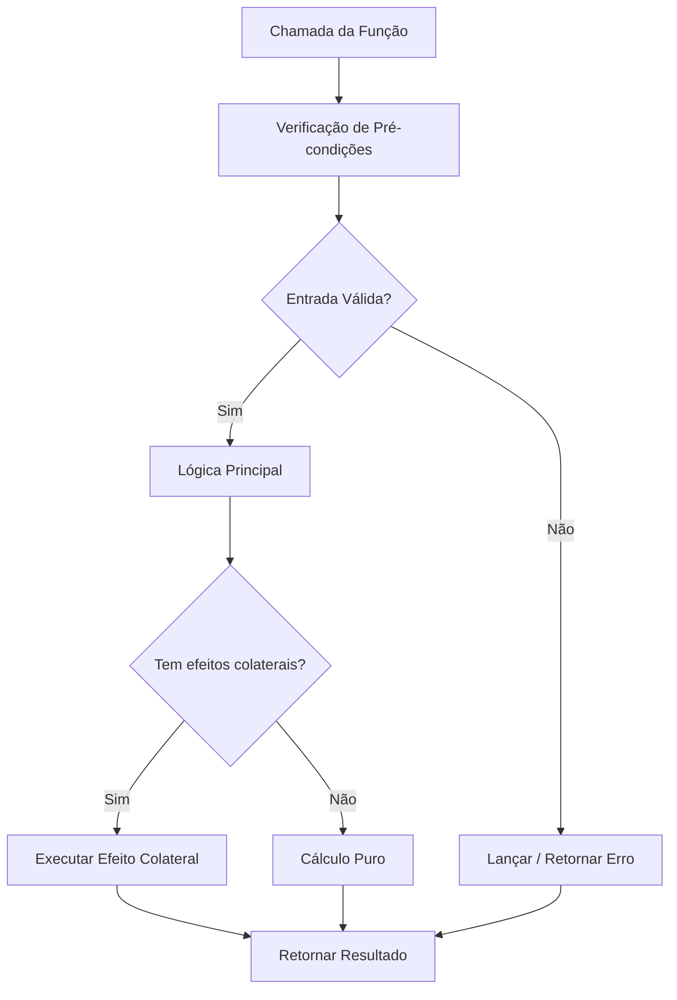
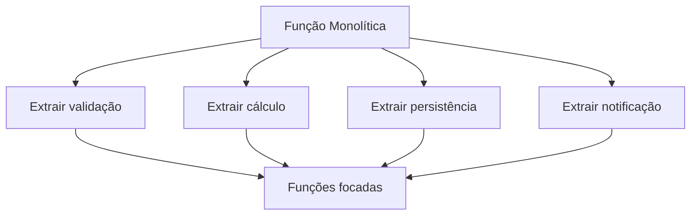

# Funções Feitas do Jeito Certo

Funções são os blocos fundamentais do código legível e sustentável. Uma função bem elaborada conta uma história clara sobre o que faz, o que precisa e o que retorna.

> [!NOTE]
> Robert C. Martin afirma: "A primeira regra das funções é que elas devem ser pequenas. A segunda regra das funções é que elas devem ser menores que isso."

## A Primeira Regra: Funções Pequenas

Uma função deve fazer uma coisa, fazer bem e fazer somente ela. Se você pode extrair outra função com um nome significativo, ela está fazendo demais.

```python
# Muito grande: esta função faz tudo
def processar_pedido(dados_pedido: dict) -> dict:
    # Validar
    if not dados_pedido.get("itens"):
        raise ValueError("Pedido deve ter itens")
    if sum(item["preco"] for item in dados_pedido["itens"]) <= 0:
        raise ValueError("Total deve ser positivo")

    # Calcular
    subtotal = sum(item["preco"] * item["quantidade"] for item in dados_pedido["itens"])
    imposto = subtotal * 0.08
    frete = 5.99 if subtotal < 50 else 0
    total = subtotal + imposto + frete

    # Salvar
    with open("pedidos.txt", "a") as f:
        f.write(f"{dados_pedido['cliente']}:{total}\n")

    # Notificar
    print(f"Pedido confirmado para {dados_pedido['cliente']}")

    return {"total": total, "status": "confirmado"}

# Refatorado: cada função faz uma coisa
def validar_pedido(dados_pedido: dict) -> None:
    if not dados_pedido.get("itens"):
        raise ValueError("Pedido deve ter itens")
    if sum(item["preco"] for item in dados_pedido["itens"]) <= 0:
        raise ValueError("Total deve ser positivo")

def calcular_total(dados_pedido: dict) -> dict:
    subtotal = sum(item["preco"] * item["quantidade"] for item in dados_pedido["itens"])
    imposto = subtotal * TAXA_IMPOSTO
    frete = CUSTO_FRETE if subtotal < LIMITE_FRETE_GRATIS else 0
    total = subtotal + imposto + frete
    return {"subtotal": subtotal, "imposto": imposto, "frete": frete, "total": total}

def salvar_pedido(dados_pedido: dict, totais: dict) -> None:
    with open("pedidos.txt", "a") as f:
        f.write(f"{dados_pedido['cliente']}:{totais['total']}\n")

def notificar_cliente(nome_cliente: str) -> None:
    print(f"Pedido confirmado para {nome_cliente}")

def processar_pedido(dados_pedido: dict) -> dict:
    validar_pedido(dados_pedido)
    totais = calcular_total(dados_pedido)
    salvar_pedido(dados_pedido, totais)
    notificar_cliente(dados_pedido["cliente"])
    return {**totais, "status": "confirmado"}
```

## Princípio da Responsabilidade Única

Uma função deve ter apenas um motivo para mudar. Se uma função mistura lógica de negócio, E/S e apresentação, ela viola o SRP.

```python
# Viola SRP: mistura cálculo, formatação e E/S
def gerar_relatorio_salarios(funcionarios: list):
    total = sum(f.salario for f in funcionarios)
    media = total / len(funcionarios)
    relatorio = f"Total: ${total}\nMédia: ${media}\n"
    with open("relatorio_salarios.txt", "w") as f:
        f.write(relatorio)
    return relatorio

# Segue SRP: cada função tem uma responsabilidade
def calcular_estatisticas_salarios(funcionarios: list) -> dict:
    total = sum(f.salario for f in funcionarios)
    return {"total": total, "media": total / len(funcionarios), "contagem": len(funcionarios)}

def formatar_relatorio_salarios(estatisticas: dict) -> str:
    return f"Total: ${estatisticas['total']:.2f}\nMédia: ${estatisticas['media']:.2f}\nContagem: {estatisticas['contagem']}"

def escrever_relatorio_arquivo(relatorio: str, nome_arquivo: str) -> None:
    with open(nome_arquivo, "w") as f:
        f.write(relatorio)

def gerar_relatorio_salarios(funcionarios: list, nome_arquivo: str) -> str:
    estatisticas = calcular_estatisticas_salarios(funcionarios)
    relatorio = formatar_relatorio_salarios(estatisticas)
    escrever_relatorio_arquivo(relatorio, nome_arquivo)
    return relatorio
```

## Parâmetros de Função

### Minimizar Parâmetros

Uma função sem parâmetros é a mais fácil de entender. Um ou dois parâmetros é bom. Três deve ser justificado. Mais de três sugere um problema de design.

```python
# Muitos parâmetros
def criar_usuario(nome, email, idade, endereco, telefone, eh_admin, notificar):
    pass

# Agrupar parâmetros relacionados em um objeto
@dataclass
class PerfilUsuario:
    nome: str
    email: str
    idade: int
    endereco: str
    telefone: str

def criar_usuario(perfil: PerfilUsuario, eh_admin: bool = False, notificar: bool = True) -> Usuario:
    pass
```

### Evitar Parâmetros Bandeira

Parâmetros booleanos em assinaturas de função indicam que a função faz duas coisas.

```python
# Parâmetro bandeira: dois comportamentos
def enviar_email(para: str, mensagem: str, urgente: bool):
    if urgente:
        # Enviar imediatamente
        pass
    else:
        # Adicionar à fila
        pass

# Melhor: duas funções
def enviar_email_imediato(para: str, mensagem: str):
    pass

def enfileirar_email(para: str, mensagem: str):
    pass
```

## Efeitos Colaterais

Uma função deve fazer algo (comando) ou responder algo (consulta), mas não ambos. Efeitos colaterais são mudanças ocultas no estado.

```python
# Efeito colateral: modifica estado global
MULTIPLICADOR_DESCONTO = 1.0

def aplicar_desconto(preco: float) -> float:
    global MULTIPLICADOR_DESCONTO
    MULTIPLICADOR_DESCONTO = 0.9  # Efeito colateral!
    return preco * MULTIPLICADOR_DESCONTO

# Função pura: previsível, sem efeitos colaterais
def aplicar_desconto(preco: float, multiplicador_desconto: float = 1.0) -> float:
    return preco * multiplicador_desconto
```

## Separação Comando-Consulta

Funções devem ser comandos (executar uma ação) ou consultas (retornar dados), não ambos.

```python
# Viola CQS: modifica e consulta
def remover_item(pilha: list):
    if not pilha:
        return None
    return pilha.pop()

# Segue CQS
def esta_vazia(pilha: list) -> bool:
    return len(pilha) == 0

def remover_item(pilha: list):
    if esta_vazia(pilha):
        return None
    return pilha.pop()
```

## Estrutura e Fluxo da Função



## A Regra da Escada

Cada função deve ser seguida por funções no próximo nível de abstração. Isso cria uma narrativa que se lê de cima para baixo.

```python
# História de alto nível
def processar_pagamento(pedido: Pedido) -> ResultadoPagamento:
    validar_pedido(pedido)
    cobrar_cliente(pedido)
    enviar_recibo(pedido)
    return ResultadoPagamento.sucesso()

# Próximo nível de detalhe
def validar_pedido(pedido: Pedido) -> None:
    if not pedido.itens:
        raise ValueError("Pedido vazio")
    if pedido.total <= 0:
        raise ValueError("Total inválido")

def cobrar_cliente(pedido: Pedido) -> None:
    gateway = GatewayPagamento(pedido.metodo_pagamento)
    gateway.cobrar(pedido.total)

def enviar_recibo(pedido: Pedido) -> None:
    email = ServicoEmail()
    email.enviar(
        para=pedido.email_cliente,
        assunto="Seu Recibo",
        corpo=f"Total cobrado: ${pedido.total:.2f}",
    )
```

## Funções Puras vs Impuras

| Aspecto | Função Pura | Função Impura |
|---------|-------------|---------------|
| Mesma entrada → mesma saída | Sempre | Não garantido |
| Efeitos colaterais | Nenhum | Pode ter |
| Testabilidade | Trivial | Requer mocks |
| Thread-safe | Sim | Depende |
| Cacheável | Sim | Não |
| Exemplo | `soma(a, b)` | `imprimir(mensagem)` |

## Tratamento de Erros em Funções

Erros devem ser tratados de forma consistente. Uma função que lida com erros não deve fazer mais nada.

### Padrão: Fail Fast

Valide entradas no início da função para evitar processamento desnecessário:

```python
# Fail fast: valida no início
def dividir(a: float, b: float) -> float:
    if b == 0:
        raise ValueError("Divisão por zero não permitida")
    if not isinstance(a, (int, float)) or not isinstance(b, (int, float)):
        raise TypeError("Ambos os parâmetros devem ser números")
    return a / b
```

### Padrão: Retornar vs Levantar Exceção

| Abordagem | Quando Usar | Exemplo |
|-----------|-------------|---------|
| Retornar None | Erro esperado e recuperável | `buscar_usuario(id)` pode não encontrar |
| Levantar exceção | Erro inesperado ou grave | `conectar_banco()` falha de conexão |
| Retornar Result | Operações que podem falhar de várias formas | `ProcessarPagamento` |

```python
from dataclasses import dataclass
from typing import Optional, Union


@dataclass
class Resultado:
    sucesso: bool
    dados: Optional[any] = None
    erro: Optional[str] = None


def processar_pagamento(valor: float, metodo: str) -> Resultado:
    if valor <= 0:
        return Resultado(sucesso=False, erro="Valor deve ser positivo")
    if metodo not in ("credito", "debito"):
        return Resultado(sucesso=False, erro="Método inválido")
    # Lógica de pagamento...
    return Resultado(sucesso=True, dados={"id": "txn_123"})
```

## Funções e Testabilidade

Funções limpas são fáceis de testar. Cada função pode ser testada isoladamente sem mocks complexos.

```python
# Função pura: fácil de testar
def calcular_imposto(subtotal: float, taxa: float) -> float:
    return round(subtotal * taxa, 2)

# Teste simples, sem mocks
def test_calcular_imposto():
    assert calcular_imposto(100, 0.08) == 8.0
    assert calcular_imposto(0, 0.08) == 0.0
    assert calcular_imposto(100, 0) == 0.0

# Função impura: requer mock
def salvar_e_calcular(subtotal: float, taxa: float, arquivo: str) -> float:
    imposto = calcular_imposto(subtotal, taxa)
    with open(arquivo, "w") as f:
        f.write(str(imposto))
    return imposto

# Teste com mock
def test_salvar_e_calcular(tmp_path):
    arquivo = tmp_path / "imposto.txt"
    resultado = salvar_e_calcular(100, 0.08, str(arquivo))
    assert resultado == 8.0
    assert arquivo.read_text() == "8.0"
```

## Exemplo Real: Refatorando um Monólito

Uma função de 80 linhas virou funções focadas e testáveis. Cada função faz uma única coisa, tem um nome claro e pode ser testada isoladamente.



> [!WARNING]
> Um erro comum é fazer funções "um pouquinho maiores" para economizar algumas linhas. Resista a isso. Cada linha adicional diminui a legibilidade e aumenta a chance de bugs.

> [!SUCCESS]
> Funções pequenas e focadas são a base do código limpo. Pratique a extração de funções até que se torne um hábito natural.

## Exercícios Práticos

1. **Extraia até não poder mais**: Pegue uma função de 100 linhas e continue extraindo até que nenhuma função tenha mais de 10 linhas.

2. **Remoção de bandeira**: Encontre uma função com um parâmetro booleano e divida-a em duas funções nomeadas.

3. **Auditoria de parâmetros**: Encontre uma função com 4+ parâmetros. Agrupe parâmetros relacionados em um dataclass.

4. **Caça aos efeitos colaterais**: Encontre uma função que modifica estado global ou suas entradas. Refatore-a para ser pura.

5. **Violação de CQS**: Encontre uma função que retorna dados e modifica estado. Divida-a em um comando e uma consulta.

6. **Estrutura de escada**: Pegue uma função complexa e reorganize-a para que a lógica de alto nível seja lida primeiro, seguida pelas funções auxiliares.

7. **Refatoração SRP**: Encontre uma classe com um método grande. Extraia métodos menores e focados.

8. **Refatoração orientada a testes**: Antes de refatorar uma função grande, escreva testes que capturem seu comportamento. Refatore e verifique se todos os testes ainda passam.
