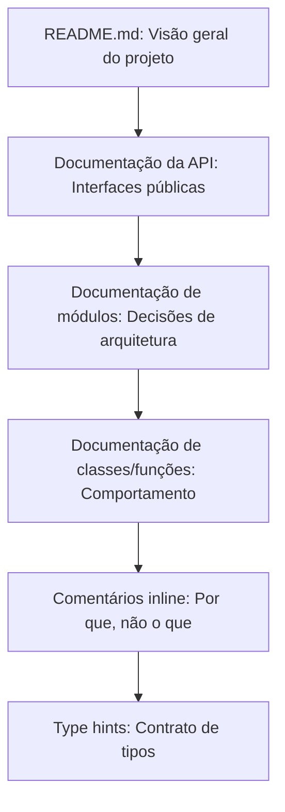

# Comentários e Documentação

Comentários são uma faca de dois gumes. Bons comentários explicam "por quê" — a justificativa por trás de uma decisão. Comentários ruins explicam "o quê" — que o código já deveria comunicar. O melhor comentário é aquele que você não precisa escrever porque o código já está claro.

> [!NOTE]
> "Não comente código ruim — reescreva-o." — Brian W. Kernighan

## Código Autodocumentável

O objetivo é escrever código tão claro que comentários se tornem desnecessários para entender "o que" o código faz. Comentários devem explicar apenas "por que" algo é feito de determinada forma.

```python
# Comentário ruim: explica o que (óbvio no código)
# Calcula o total somando subtotal e imposto
total = subtotal + imposto

# Comentário bom: explica por que (não óbvio)
# Usar Decimal para evitar arredondamento de ponto flutuante em cálculos financeiros
from decimal import Decimal
total = subtotal + imposto
```

```python
# Ruim: comentando código ruim
# Verifica se usuário está ativo e tem permissão
# depois aplica desconto se total > 100
if u.ativo and u.cargo == "admin" or u.cargo == "gerente":
    if t > 100:
        t = t * 0.9

# Bom: código autodocumentável
def eh_elegivel_para_desconto(usuario: Usuario, total: float) -> bool:
    return usuario.ativo and usuario.tem_permissao_admin() and total > 100

def aplicar_desconto(total: float) -> float:
    return total * TAXA_DESCONTO
```

## Quando Comentar

### 1. Comentários Legais

```python
# Direitos Autorais (c) 2024 NUniversity. Todos os direitos reservados.
# Licenciado sob a Licença MIT.
```

### 2. Comentários Explicativos para Lógica Complexa

```python
def calcular_distancia_levenshtein(s1: str, s2: str) -> int:
    """
    Calcula a distância de Levenshtein entre duas strings.

    A distância de Levenshtein é o número mínimo de edições
    de caractere único (inserções, deleções, substituições)
    necessárias para transformar uma palavra em outra.
    """
```

### 3. TODOs e FIXMEs

```python
# TODO: Implementar paginação para grandes conjuntos de resultados
# FIXME: Esta consulta é lenta para datasets acima de 10M linhas
# HACK: Workaround para limitação de taxa da API — remover quando tivermos plano enterprise
```

### 4. Alertas sobre Consequências

```python
# ATENÇÃO: Esta função modifica a lista in-place. Faça uma cópia
# se precisar preservar a ordenação original.
def ordenar_por_prioridade(itens: list) -> None:
    itens.sort(key=lambda x: x.prioridade, reverse=True)
```

## Quando NÃO Comentar

### 1. Comentários Redundantes

```python
# Ruim: afirma o óbvio
x = 42  # Define x como 42

# Ruim: comentário repete o código
# Incrementa contador em 1
contador += 1
```

### 2. Comentários Enganosos

```python
# Ruim: comentário diz uma coisa, código faz outra
# Retorna True se o usuário está ativo
def usuario_esta_banido(usuario):
    return usuario.status == "banido"  # Bug: nome de variável errado
```

### 3. Comentários de Diário

```python
# Ruim: histórico de versão pertence ao git
# 2024-01-10: Adicionado cálculo de desconto - Alice
# 2024-01-15: Corrigido bug de arredondamento de imposto - Bob
def calcular_total():
    pass
```

### 4. Código Comentado

```python
# Ruim: código morto que ninguém vai limpar
# def processamento_antigo():
#     x = 10
#     y = 20
#     return x + y
```

> [!WARNING]
> Código comentado é o pior tipo de dívida técnica. Delete-o. Se precisar dele novamente, use controle de versão.

## Docstrings

Docstrings são documentação embutida no código. Diferente de comentários, docstrings são acessíveis em tempo de execução e processadas por geradores de documentação.

```python
def calcular_imc(peso_kg: float, altura_m: float) -> float:
    """Calcula o Índice de Massa Corporal a partir de peso e altura.

    O IMC é uma medida de gordura corporal baseada em altura e peso.
    É calculado como peso / (altura ^ 2).

    Args:
        peso_kg: Peso em quilogramas (deve ser positivo).
        altura_m: Altura em metros (deve ser positivo).

    Returns:
        O valor do IMC, arredondado para uma casa decimal.

    Raises:
        ValueError: Se peso ou altura não forem positivos.

    Examples:
        >>> calcular_imc(70, 1.75)
        22.9
    """
    if peso_kg <= 0 or altura_m <= 0:
        raise ValueError("Peso e altura devem ser valores positivos")
    imc = peso_kg / (altura_m ** 2)
    return round(imc, 1)
```

### Estilos de Docstring

| Estilo | Formato | Melhor para |
|--------|---------|-------------|
| Google | Seções com cabeçalhos | Maioria dos projetos Python |
| NumPy/SciPy | Cabeçalhos de seção ricos | Computação científica |
| Sphinx/reST | reStructuredText | Documentação extensa |
| Epytext | Estilo JavaDoc | Código legado |

### Docstrings Estilo Google

```python
def buscar_dados_usuario(usuario_id: int, incluir_inativos: bool = False) -> dict:
    """Recupera dados do usuário do banco de dados.

    Consulta o banco de dados de usuários e retorna informações do perfil.
    Por padrão, apenas usuários ativos são retornados.

    Args:
        usuario_id: O identificador único do usuário.
        incluir_inativos: Se deve incluir usuários desativados.

    Returns:
        Um dicionário contendo dados do perfil do usuário.

    Raises:
        ErroUsuarioNaoEncontrado: Se nenhum usuário existe com o ID fornecido.
        ErroConexaoBanco: Se o banco de dados estiver inacessível.
    """
```

## Documentação de Módulos e Pacotes

Todo módulo deve ter um docstring explicando seu propósito.

```python
# servico_email.py
"""Serviço de envio de email para o sistema de notificações.

Este módulo fornece funções para envio de emails transacionais
usando o protocolo SMTP. Suporta formatos HTML e texto simples,
anexos e renderização de templates.
"""
```

## Documentação de Projetos: README

O README é a porta de entrada do seu projeto. Um bom README responde rapidamente: "O que é isso? Como uso? Como contribuo?"

```markdown
# Nome do Projeto

Breve descrição em 1-2 frases.

## Instalação

```bash
pip install meu-projeto
```

## Uso Rápido

```python
from meu_projeto import calcular
resultado = calcular(10, 20)
```

## Documentação Completa

Link para documentação detalhada.

## Contribuindo

Guia de contribuição.

## Licença

MIT
```

## Documentação de API

Para APIs, documente cada endpoint com exemplos de requisição e resposta:

```python
# Exemplo de documentação de endpoint
@app.post("/api/usuarios")
def criar_usuario(usuario: UsuarioSchema) -> UsuarioResponse:
    """Cria um novo usuário no sistema.

    ## Request Body
    ```json
    {
        "nome": "Alice",
        "email": "alice@exemplo.com",
        "senha": "segura123"
    }
    ```

    ## Response (201)
    ```json
    {
        "id": 1,
        "nome": "Alice",
        "email": "alice@exemplo.com",
        "criado_em": "2024-01-15T10:30:00Z"
    }
    ```

    ## Errors
    - 400: Dados inválidos
    - 409: Email já cadastrado
    """
    ...
```

## Manutenção de Documentação

Documentação desatualizada é pior que nenhuma documentação. Ela engana os desenvolvedores.

### Checklist de Manutenção

- [ ] Documentação é revisada em cada PR que muda comportamento
- [ ] Docstrings são atualizadas quando parâmetros mudam
- [ ] README reflete o estado atual do projeto
- [ ] Exemplos de código na documentação são testáveis
- [ ] Links não estão quebrados
- [ ] Changelog é mantido atualizado

## Ferramentas para Documentação

### Type Hints como Documentação

Type hints servem como documentação verificável por máquina.

```python
# Sem type hints (que tipo é usuario_id?)
def buscar_usuario(usuario_id):
    return banco.query(f"SELECT * FROM usuarios WHERE id = {usuario_id}")

# Com type hints (autodocumentável)
def buscar_usuario(usuario_id: int) -> Usuario | None:
    return banco.query(f"SELECT * FROM usuarios WHERE id = {usuario_id}")
```

## Pirâmide de Documentação



## Comparação de Tipos de Comentários

| Tipo de Comentário | Propósito | Frequência | Exemplo |
|-------------------|-----------|------------|---------|
| Legal | Direitos autorais/licença | Cabeçalho | `# Copyright 2024` |
| Docstring | Documentação da API | Toda função pública | `"""Calcula total."""` |
| TODO | Trabalho futuro | Ocasional | `# TODO: Adicionar paginação` |
| Alerta | Efeitos colaterais/riscos | Raro | `# ATENÇÃO: Ordenação in-place` |
| Esclarecimento | Lógica complexa | Mínimo | `# Off-by-one: indexado em 0` |
| Redundante | Explica o óbvio | Nunca | `# Define x como 42` |

> [!TIP]
> Uma boa heurística: se você pode deletar um comentário e o código permanece igualmente compreensível, delete o comentário. Se o código ficar confuso, melhore o código ou mantenha o comentário explicando por quê.

## Exercícios Práticos

1. **Auditoria de comentários**: Revise sua base de código e classifique cada comentário como "útil" ou "ruído". Delete todos os comentários ruído.

2. **Refatore para remover comentários**: Encontre um bloco de código com um comentário explicando "o quê". Refatore o código para que o comentário se torne desnecessário.

3. **Adicione docstrings faltantes**: Escreva docstrings estilo Google para três funções em seu projeto que não têm documentação.

4. **Docstring de módulo**: Adicione um docstring de nível de módulo a um arquivo Python explicando seu propósito e uso.

5. **Auditoria de type hints**: Adicione type hints a uma função que anteriormente não os tinha. Verifique a correção com `mypy`.

6. **Limpeza de TODOs**: Revise todos os TODOs em seu projeto. Delete os concluídos, adicione referências a issues nos restantes e remova os que não são mais relevantes.

7. **Geração de documentação**: Configure Sphinx ou MkDocs para seu projeto e gere documentação HTML a partir de docstrings.

8. **Melhoria do README**: Escreva um README para um módulo ou pacote seguindo o princípio da pirâmide de documentação.

### Resumo: Quando Comentar vs. Quando Refatorar

| Situação | Ação |
|----------|------|
| Código é confuso | Refatore o código, não adicione comentário |
| Decisão de design não é óbvia | Adicione comentário explicando "por quê" |
| API pública sem documentação | Adicione docstring |
| TODO para trabalho futuro | Adicione TODO com referência a issue |
| Código comentado | Delete (use git para histórico) |
| Alerta de segurança/warning | Adicione comentário de alerta |

> [!SUCCESS]
> O objetivo não é eliminar todos os comentários, mas garantir que cada comentário agregue valor que o código sozinho não consegue transmitir.
