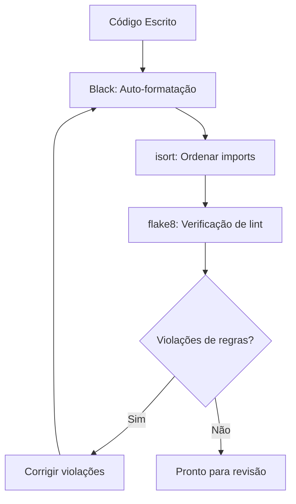
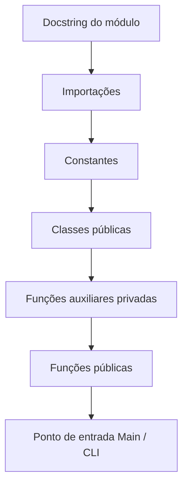
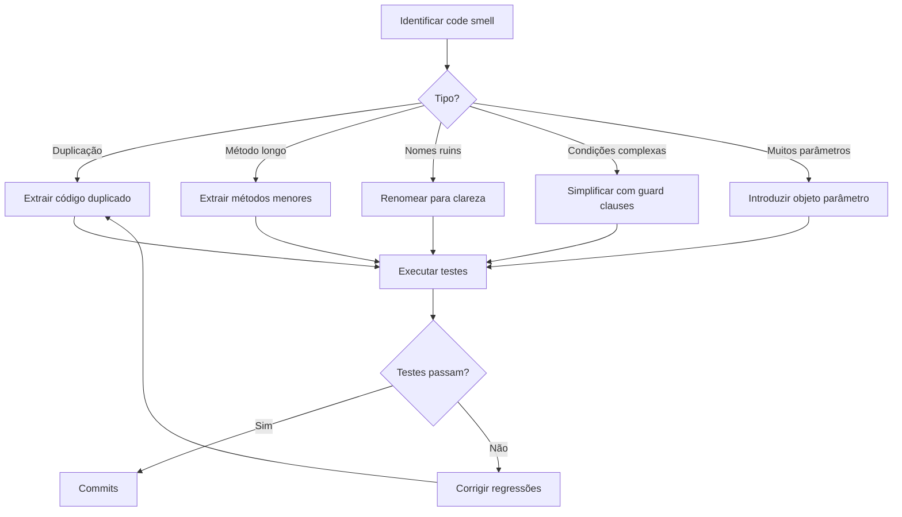

# Formatação e Estilo de Código

A formatação de código é como a pontuação na escrita — ela torna o significado claro. Um estilo consistente em toda a base de código reduz a carga cognitiva, previne debates triviais de estilo em revisões de código e ajuda a encontrar bugs mais rapidamente.

> [!NOTE]
> "Formatação de código é sobre comunicação, não preferência pessoal. Um estilo consistente em uma equipe elimina uma classe inteira de discussões sem sentido." — Adaptado de *Código Limpo*

## Por que a Formatação é Importante

```python
# Formatação ruim: difícil de escanear e entender
def calcular(itens):
    resultado=0
    for i in itens:
        if i['ativo']==True:
            resultado=resultado+i['valor']
            if resultado>100:
                resultado=resultado*0.9
    return resultado

# Formatação consistente: fácil de ler e manter
def calcular_total_com_desconto(itens: list[dict]) -> float:
    resultado = 0.0
    for item in itens:
        if item["ativo"]:
            resultado += item["valor"]
            if resultado > LIMIAR_DESCONTO:
                resultado *= TAXA_DESCONTO
    return resultado
```

## PEP 8: O Guia de Estilo do Python

PEP 8 é o guia de estilo oficial para código Python. A maioria dos projetos Python o segue.

### Indentação

Use 4 espaços por nível de indentação. Nunca misture tabs e espaços.

```python
# Correto
def buscar_dados(url: str) -> dict:
    resposta = requests.get(url)
    if resposta.status_code == 200:
        return resposta.json()
    return {}

# Incorreto (2 espaços)
def buscar_dados(url: str) -> dict:
  resposta = requests.get(url)
  if resposta.status_code == 200:
    return resposta.json()
  return {}
```

### Comprimento de Linha

O comprimento máximo de linha é 79 caracteres para código, 72 para comentários e docstrings.

```python
# Muito longo
resultado = funcao_com_muitos_parametros(param_um, param_dois, param_tres, param_quatro, param_cinco)

# Corretamente quebrado
resultado = funcao_com_muitos_parametros(
    param_um, param_dois, param_tres,
    param_quatro, param_cinco,
)
```

### Importações

```python
# Bibliotecas padrão
import os
import sys
from datetime import datetime

# Bibliotecas de terceiros
import pytest
import requests
from fastapi import FastAPI

# Importações locais
from modelos.usuario import Usuario
from servicos.email import ServicoEmail
```

## Ferramentas Automatizadas de Formatação



### Black

Black é um formatador de código opinativo que elimina debates de formatação. Formata código deterministicamente.

```bash
# Formatar um único arquivo
black main.py

# Formatar projeto inteiro
black .

# Verificar se arquivos seriam reformatados
black --check .

# Mostrar diferenças
black --diff .
```

```python
# Antes do Black
def funcao_complexa(primeiro_param,segundo_param,terceiro_param,
                     quarto_param):
    resultado=primeiro_param+segundo_param
    if resultado>100:
        resultado=resultado*0.9
        for item in quarto_param:
            if item.get('ativo'):
                resultado+=item['valor']
    return resultado

# Depois do Black
def funcao_complexa(
    primeiro_param, segundo_param, terceiro_param, quarto_param
):
    resultado = primeiro_param + segundo_param
    if resultado > 100:
        resultado = resultado * 0.9
        for item in quarto_param:
            if item.get("ativo"):
                resultado += item["valor"]
    return resultado
```

### isort

isort ordena importações alfabeticamente e as agrupa por tipo.

```python
# Antes do isort
from servicos.email import ServicoEmail
import os
from modelos.usuario import Usuario
import sys
import requests
from datetime import datetime

# Depois do isort
import os
import sys
from datetime import datetime

import requests

from modelos.usuario import Usuario
from servicos.email import ServicoEmail
```

### Configuração

```ini
# setup.cfg
[flake8]
max-line-length = 88
extend-ignore = E203, W503
exclude = .git, __pycache__, venv

[isort]
profile = black
line_length = 88

[tool:black]
line-length = 88
target-version = py311
```

## Técnicas de Refatoração

### Extrair Método

```python
# Antes
def processar_relatorio(dados):
    if not dados:
        raise ValueError("Dados vazios")
    receita = sum(dados["receita"])
    despesas = sum(dados["despesas"])
    lucro = receita - despesas
    margem = (lucro / receita * 100) if receita > 0 else 0
    relatorio = f"""Receita: ${receita:,.2f}
Despesas: ${despesas:,.2f}
Lucro: ${lucro:,.2f}
Margem: {margem:.1f}%"""
    return relatorio

# Depois
def validar_dados_relatorio(dados: dict) -> None:
    if not dados:
        raise ValueError("Dados vazios")

def calcular_financeiro(dados: dict) -> dict:
    receita = sum(dados["receita"])
    despesas = sum(dados["despesas"])
    lucro = receita - despesas
    margem = (lucro / receita * 100) if receita > 0 else 0
    return {"receita": receita, "despesas": despesas, "lucro": lucro, "margem": margem}

def processar_relatorio(dados: dict) -> str:
    validar_dados_relatorio(dados)
    financeiro = calcular_financeiro(dados)
    return formatar_relatorio(financeiro)
```

### Simplificar Condicionais

```python
# Antes: condicionais aninhados
def pode_acessar(usuario, recurso):
    if usuario:
        if usuario.ativo:
            if usuario.cargo == "admin" or usuario.cargo == "gerente":
                return True
            if recurso.publico:
                return True
            if recurso.proprietario_id == usuario.id:
                return True
    return False

# Depois: guard clauses
def pode_acessar(usuario: Usuario | None, recurso: Recurso) -> bool:
    if not usuario:
        return False
    if not usuario.ativo:
        return False
    if usuario.cargo in ("admin", "gerente"):
        return True
    if recurso.publico:
        return True
    if recurso.proprietario_id == usuario.id:
        return True
    return False
```

## Organização do Código em um Arquivo



## Pre-commit Hooks

Automatize verificações de formatação com pre-commit hooks:

```yaml
# .pre-commit-config.yaml
repos:
  - repo: https://github.com/psf/black
    rev: 23.12.0
    hooks:
      - id: black

  - repo: https://github.com/pycqa/isort
    rev: 5.13.0
    hooks:
      - id: isort

  - repo: https://github.com/pycqa/flake8
    rev: 6.1.0
    hooks:
      - id: flake8

  - repo: https://github.com/pre-commit/mirrors-mypy
    rev: v1.8.0
    hooks:
      - id: mypy
```

```bash
# Instalar pre-commit hooks
pip install pre-commit
pre-commit install

# Executar contra todos os arquivos
pre-commit run --all-files
```

## Fluxo de Refatoração



> [!TIP]
> Pare de debater formatação. Use Black. Ele formata tudo de forma consistente e é o mais próximo que Python tem de um formatador oficial.

> [!WARNING]
> Não personalize as configurações do Black (além do comprimento de linha). O objetivo do Black é ser opinativo e eliminar debates de formatação.

## Exercícios Práticos

1. **Formate um arquivo**: Execute `black` em um arquivo Python do seu projeto. Revise o diff e entenda o que mudou.

2. **Ordene importações**: Execute `isort` em um arquivo com importações desorganizadas. Commits o resultado.

3. **Lint no seu código**: Execute `flake8` em seu projeto e corrija todos os avisos. Acompanhe o número de avisos antes e depois.

4. **Configure pre-commit**: Crie um `.pre-commit-config.yaml` e instale hooks para black, isort e flake8.

5. **Extraia método**: Encontre uma função com mais de 30 linhas. Extraia-a em funções menores até que nenhuma exceda 15 linhas.

6. **Guard clauses**: Encontre uma função com condicionais aninhados. Refatore para usar guard clauses.

7. **Espaçamento consistente**: Audite sua base de código quanto a espaçamento inconsistente ao redor de operadores. Use Black para corrigir.

8. **Refatore um módulo**: Escolha um módulo com organização pobre. Reorganize-o seguindo a estrutura de arquivo padrão.
