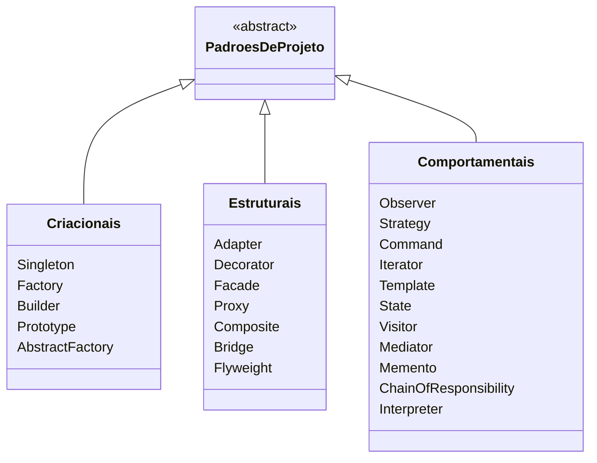
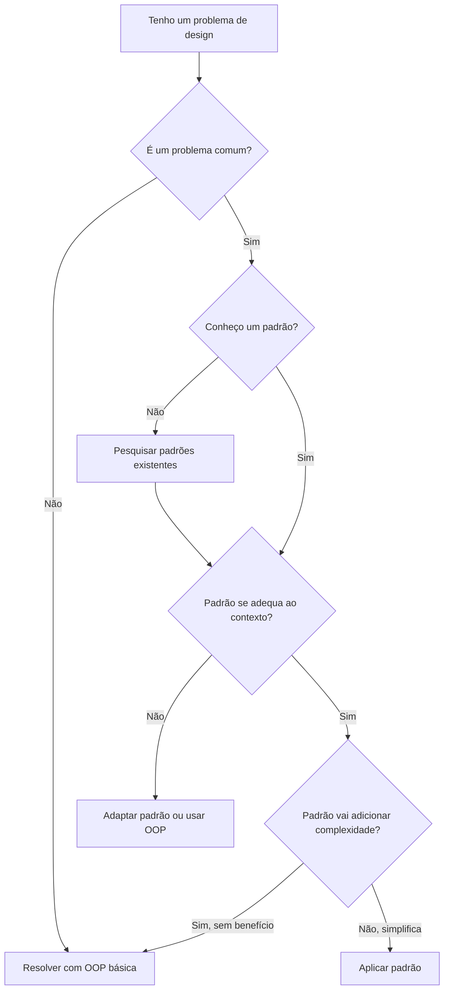
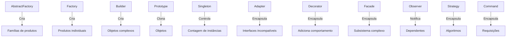

# Introdução aos Padrões de Projeto

Padrões de projeto são soluções reutilizáveis para problemas comuns no design de software. Não são designs prontos que você copia e cola, mas modelos para resolver problemas em contexto. Os padrões representam abordagens testadas e aprovadas que evoluíram ao longo de décadas.

> [!NOTE]
> O conceito de padrões de projeto foi popularizado pelo "Gang of Four" (GoF) — Erich Gamma, Richard Helm, Ralph Johnson e John Vlissides — em seu livro de 1994 *Design Patterns: Elements of Reusable Object-Oriented Software*.

## O Que São Padrões de Projeto?

Um padrão de projeto descreve um problema que ocorre repetidamente, o núcleo da solução e as consequências de aplicá-lo. Cada padrão tem quatro elementos essenciais:

1. **Nome do padrão** — um identificador para descrição
2. **Problema** — quando aplicar o padrão
3. **Solução** — os elementos e seus relacionamentos
4. **Consequências** — trade-offs e resultados

```python
# Sem padrão: abordagem ad-hoc para criar objetos
def criar_conexao_banco():
    # Cada chamador cria sua própria conexão
    return Banco("localhost", 5432)

# Com padrão Singleton: gerenciamento controlado de instâncias
class ConexaoBanco:
    _instancia = None

    def __new__(cls):
        if cls._instancia is None:
            cls._instancia = super().__new__(cls)
            cls._instancia._conexao = Banco("localhost", 5432)
        return cls._instancia
```

## Classificação Gang of Four

O GoF catalogou 23 padrões em três categorias baseadas em seu propósito:



### Padrões Criacionais

Padrões criacionais abstraem o processo de instanciação. Eles tornam um sistema independente de como seus objetos são criados, compostos e representados.

| Padrão | Propósito | Exemplo em Python |
|--------|-----------|-------------------|
| Singleton | Garantir que uma classe tenha apenas uma instância | Pool de conexão de banco |
| Factory | Criar objetos sem especificar a classe exata | Criação de processador de pagamento |
| Builder | Construir objetos complexos passo a passo | Construtor de relatório HTML |
| Prototype | Clonar objetos existentes | Templates de configuração |
| Abstract Factory | Criar famílias de objetos relacionados | Fábrica de temas de UI |

### Padrões Estruturais

Padrões estruturais compõem classes e objetos em estruturas maiores, mantendo-os flexíveis e eficientes.

| Padrão | Propósito | Exemplo em Python |
|--------|-----------|-------------------|
| Adapter | Compatibilizar interfaces de classes diferentes | Wrapper de API legada |
| Decorator | Adicionar responsabilidades a objetos dinamicamente | Middleware de logging |
| Facade | Fornecer uma interface unificada para um subsistema | Gateway de API |
| Proxy | Controlar acesso a outro objeto | Lazy loading |
| Composite | Tratar objetos individuais e compostos uniformemente | Árvore do sistema de arquivos |

### Padrões Comportamentais

Padrões comportamentais distribuem algoritmos e responsabilidades entre objetos.

| Padrão | Propósito | Exemplo em Python |
|--------|-----------|-------------------|
| Observer | Notificar múltiplos objetos sobre mudanças de estado | Sistema de eventos |
| Strategy | Trocar algoritmos em tempo de execução | Estratégia de ordenação |
| Command | Encapsular requisições como objetos | Undo/redo |
| Iterator | Percorrer coleções sem expor detalhes internos | Iterável personalizado |
| Template | Definir esqueleto de algoritmo com métodos hook | Pipeline de dados |

## Quando Usar Padrões de Projeto



> [!WARNING]
> Não abuse dos padrões. Um padrão deve resolver um problema, não criar um. Se uma função simples for suficiente, não adicione um padrão Strategy. Padrões adicionam complexidade — use-os apenas quando a complexidade valer a pena.

## Padrões em Python vs Outras Linguagens

A natureza dinâmica do Python torna alguns padrões mais simples ou até mesmo nativos:

| Padrão | Abordagem Java | Abordagem Python |
|--------|---------------|------------------|
| Singleton | Classe com instância estática | Variável de módulo |
| Iterator | Implementar interface Iterable | `__iter__` / `__next__` ou generator |
| Decorator | Framework de anotações | Decoradores como cidadãos de primeira classe |
| Strategy | Interface + classes de implementação | Funções de primeira classe / dict |
| Observer | Interfaces de listener | Callbacks / signals |

```python
# Iterator estilo Java
class Intervalo:
    def __init__(self, inicio, fim):
        self.inicio = inicio
        self.fim = fim

    def __iter__(self):
        self.atual = self.inicio
        return self

    def __next__(self):
        if self.atual >= self.fim:
            raise StopIteration
        valor = self.atual
        self.atual += 1
        return valor

# Generator pythonico
def gerador_intervalo(inicio: int, fim: int):
    for i in range(inicio, fim):
        yield i
```

## Ideias Erradas Comuns sobre Padrões de Projeto

### "Padrões são uma bala de prata"

Nenhum padrão único resolve todos os problemas. Cada padrão aborda uma preocupação específica e introduz trade-offs. O padrão Factory adiciona complexidade em troca de flexibilidade. O Singleton resolve controle de instância, mas cria estado global.

### "Você deve usar padrões em todo lugar"

Padrões são soluções, não objetivos. Se uma simples busca em dicionário substitui um padrão Strategy, use o dicionário. Excesso de engenharia com padrões é ele próprio um anti-padrão comum.

### "Padrões são só para linguagens OOP"

Embora os padrões GoF enfatizem conceitos de POO como herança e polimorfismo, muitos padrões se traduzem para linguagens funcionais ou multiparadigma. Python, por exemplo, implementa Strategy com funções de primeira classe e Decorator com wrappers de função.

### "Padrões estão ultrapassados"

Alguns desenvolvedores afirmam que padrões não são mais relevantes devido a frameworks modernos. Na realidade, frameworks são construídos *usando* padrões. Entender padrões ajuda a entender frameworks em um nível mais profundo.

## Template de Documentação de Padrões

Ao documentar um padrão para sua equipe, use este template:

```markdown
## Padrão: [Nome]

**Intenção**: Descrição em uma frase.

**Problema**: Quando usar este padrão?

**Solução**: Estrutura central e participantes.

**Exemplo Python**: Código funcional mínimo.

**Trade-offs**: O que você ganha e perde?

**Padrões Relacionados**: Como se conecta a outros padrões?
```

Exemplo:

```python
"""
Padrão: Factory Method

Intenção: Definir uma interface para criar um objeto, mas permitir
          que subclasses decidam qual classe instanciar.

Problema: Uma classe não pode antecipar a classe dos objetos que
          deve criar.

Solução: Definir um método factory que retorna um produto. Subclasses
         sobrescrevem para retornar implementações diferentes.

Trade-offs:
  + Elimina acoplamento a classes concretas
  + Segue o Princípio Aberto/Fechado
  - Introduz muitas subclasses
  - Complexidade pode ser desnecessária
"""
```

## Uso de Padrões no Mundo Real

### Frameworks Web

Django e FastAPI usam padrões extensivamente:

- **Singleton**: As `settings` do Django são efetivamente um Singleton
- **Factory**: As classes de serializers do Django REST Framework usam Factory
- **Observer**: Os sinais do Django (pre_save, post_save) implementam Observer
- **Strategy**: Os backends de autenticação do Django usam Strategy
- **Command**: Comandos de gerenciamento do Django usam Command
- **Decorator**: `@login_required`, `@permission_required` são Decorators

### Exemplos na Biblioteca Padrão

A própria biblioteca padrão do Python contém implementações de padrões:

```python
# Padrão Iterator: nativo em toda coleção
for item in minha_lista:
    print(item)

# Padrão Strategy: funções key para ordenação
sorted(dados, key=str.lower)

# Padrão Decorator: property, classmethod, staticmethod
@property
def nome_completo(self):
    return f"{self.primeiro} {self.ultimo}"

# Padrão Observer: eventos asyncio
import asyncio
evento = asyncio.Event()
# Várias corotinas podem esperar o mesmo evento
```

## Relacionamentos entre Padrões



## Benefícios de Usar Padrões de Projeto

| Benefício | Descrição |
|-----------|-----------|
| Reutilização | Soluções comprovadas que você não precisa reinventar |
| Comunicação | Vocabulário compartilhado para discussões de design |
| Mantenibilidade | Código bem estruturado é mais fácil de modificar |
| Flexibilidade | Sistemas com baixo acoplamento se adaptam a novos requisitos |
| Documentação | Nomes de padrões transmitem intenção de design |
| Melhores práticas | Incorporam décadas de sabedoria da indústria |

### Padrões Facilitam a Comunicação

Quando um desenvolvedor diz "vamos usar um Observer aqui", toda a equipe imediatamente entende a estrutura: haverá um sujeito, múltiplos observadores, e notificações automáticas. Sem o vocabulário de padrões, a mesma conversa exigiria parágrafos de explicação.

## Quando NÃO Usar Padrões

Saber quando evitar padrões é tão importante quanto saber usá-los:

1. **A solução simples funciona**: Não adicione um padrão Strategy para substituir um if-else de 3 branches
2. **A equipe não conhece o padrão**: Padrões são vocabulário compartilhado; se a equipe não os conhece, eles confundem em vez de esclarecer
3. **O padrão aumenta o acoplamento**: Alguns padrões (Singleton, por exemplo) criam dependências ocultas
4. **O código ficará mais difícil de entender**: A simplicidade é o objetivo final

### Heurística de Decisão

Para cada padrão que você considera usar, pergunte:

- Este problema ocorre repetidamente?
- O padrão torna o código mais flexível ou apenas mais complexo?
- A equipe conseguirá manter este código daqui a 6 meses?
- Existe uma solução mais simples da linguagem/framework?

> [!SUCCESS]
> Padrões de projeto são ferramentas, não regras. Aprenda-os para construir seu vocabulário e reconhecer problemas comuns, mas sempre escolha a solução mais simples que funciona.

## Exercícios Práticos

1. **Identificação de padrões**: Analise seu projeto atual e identifique pelo menos 2 lugares onde você já está usando um padrão de projeto (mesmo sem saber).

2. **Catálogo GoF**: Pesquise um padrão de cada categoria (Criacional, Estrutural, Comportamental) e escreva um resumo de um parágrafo para cada.

3. **Padrão vs simples**: Pegue um trecho de código que usa uma cadeia simples de if-else. Implemente-o com um padrão Strategy. Compare as duas abordagens.

4. **Caça a anti-padrões**: Encontre um lugar em sua base de código onde um padrão é usado em excesso ou aplicado incorretamente. Simplifique-o.

5. **Reescrita pythonica**: Pegue uma implementação de padrão estilo Java e reescreva-a de forma mais pythonica.

6. **Decisão de padrão**: Você precisa criar um sistema que pode enviar notificações via email, SMS e push. Qual(is) padrão(is) você usaria? Justifique.

7. **Auditoria de Singleton**: Encontre todos os padrões Singleton em sua base de código. Determine quais são apropriados e quais devem ser substituídos por variáveis de módulo.

8. **Comunicação com padrões**: Descreva uma parte complexa de sua arquitetura para um colega usando apenas nomes de padrões. Isso melhora o entendimento?

### Resumo dos Conceitos

| Conceito | Descrição |
|----------|-----------|
| Gang of Four | Grupo que catalogou 23 padrões em 3 categorias |
| Padrão Criacional | Abstrai criação de objetos (Singleton, Factory) |
| Padrão Estrutural | Compõe classes em estruturas maiores (Adapter, Decorator) |
| Padrão Comportamental | Distribui algoritmos entre objetos (Strategy, Observer) |
| Trade-off | Todo padrão resolve um problema mas introduz complexidade |
| Contexto | Um padrão só faz sentido no contexto certo |
| Simplicidade | A solução mais simples que funciona é geralmente a melhor |

> [!SUCCESS]
> Os padrões de projeto são seu vocabulário compartilhado de design. Use-os para se comunicar com outros desenvolvedores e para reconhecer soluções comprovadas para problemas recorrentes.
