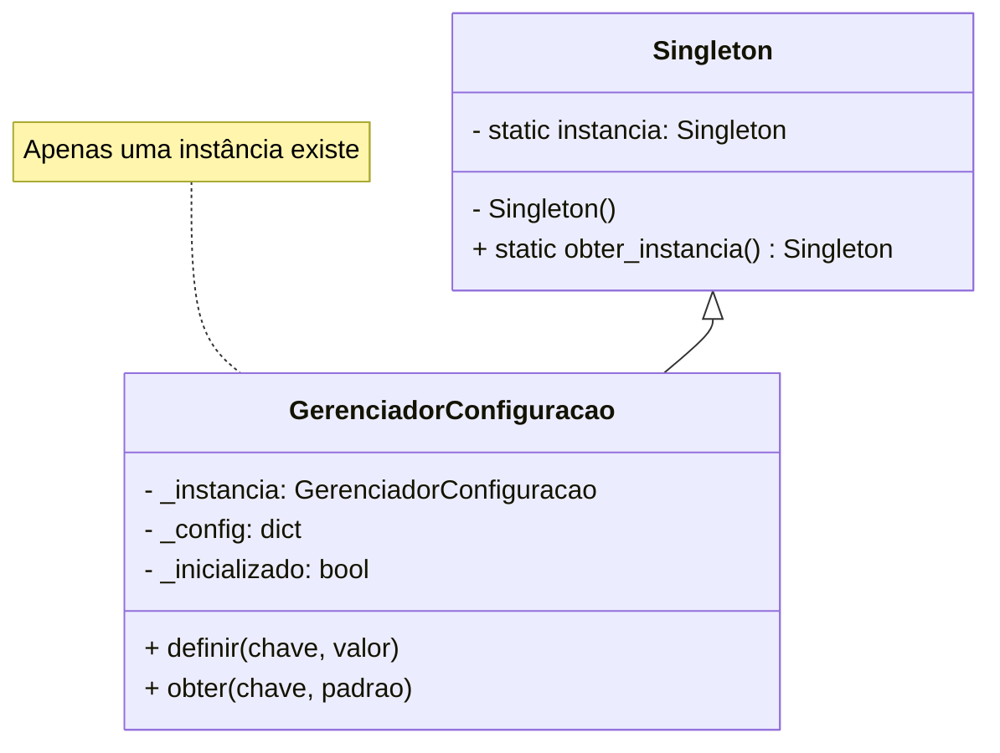
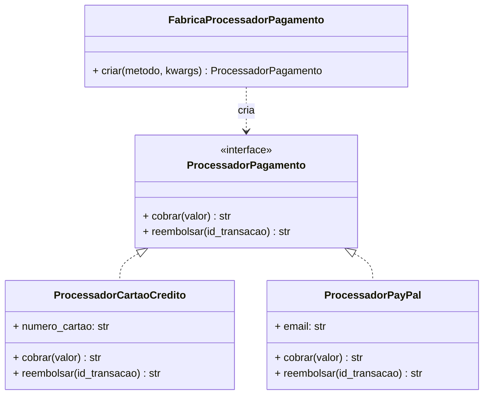
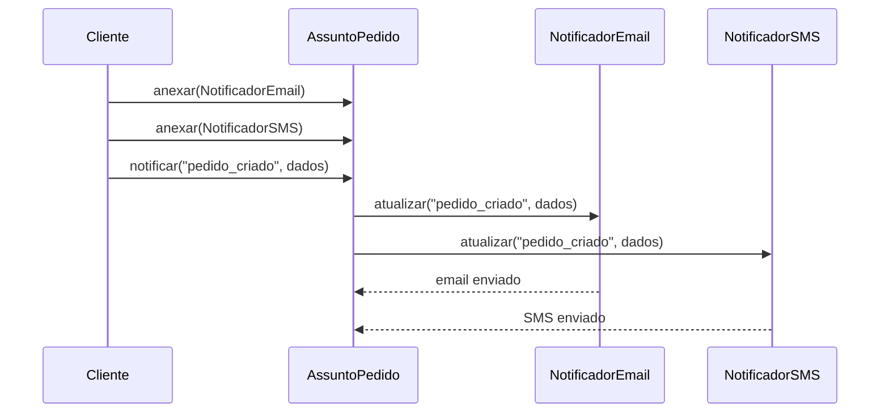
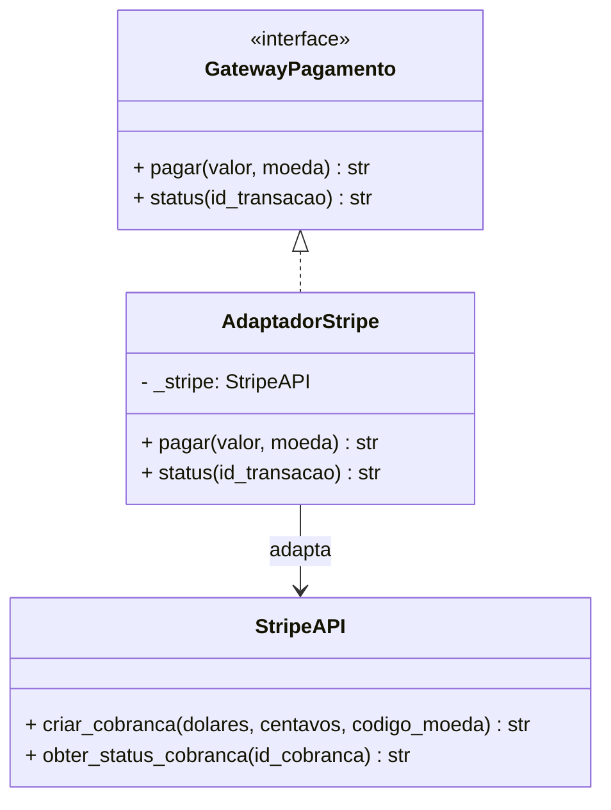
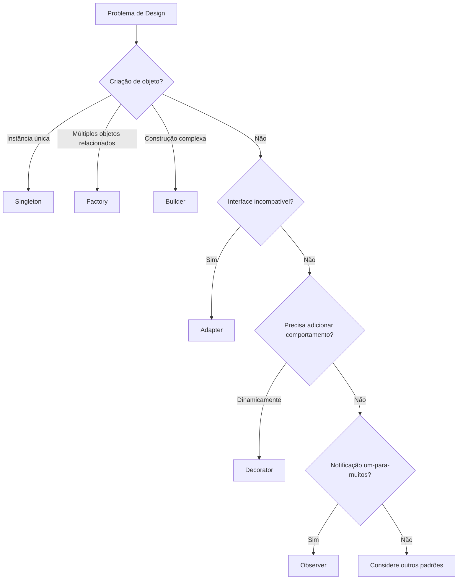

# Padrões Criacionais e Estruturais

Padrões criacionais lidam com mecanismos de criação de objetos, enquanto padrões estruturais compõem classes e objetos em estruturas maiores. Juntos, eles formam a base do design orientado a objetos flexível e reutilizável.

> [!NOTE]
> Esta lição cobre os padrões mais amplamente usados das categorias Criacional e Estrutural. Dominar estes quatro padrões — Singleton, Factory, Observer e Adapter — resolve a maioria dos desafios comuns de design.

## Padrão Singleton

**Propósito**: Garantir que uma classe tenha apenas uma instância e fornecer um ponto de acesso global a ela.

### Quando Usar

- Um único pool de conexão de banco de dados
- Um gerenciador de configuração compartilhado
- Um serviço de logging
- Um gerenciador de cache

### Implementação em Python

```python
class GerenciadorConfiguracao:
    """Singleton thread-safe para configuração da aplicação."""

    _instancia = None
    _inicializado = False

    def __new__(cls):
        if cls._instancia is None:
            cls._instancia = super().__new__(cls)
        return cls._instancia

    def __init__(self):
        if self._inicializado:
            return
        self._config: dict = {}
        self._inicializado = True

    def definir(self, chave: str, valor: any) -> None:
        self._config[chave] = valor

    def obter(self, chave: str, padrao: any = None) -> any:
        return self._config.get(chave, padrao)


# Uso
config = GerenciadorConfiguracao()
config.definir("url_banco", "postgres://localhost:5432/app")
config.definir("debug", True)

# Mesma instância
outra_ref = GerenciadorConfiguracao()
assert config is outra_ref  # True
print(outra_ref.obter("url_banco"))  # postgres://localhost:5432/app
```

### Diagrama de Classe Singleton



### Trade-offs

| Vantagem | Desvantagem |
|----------|-------------|
| Acesso controlado à instância única | Estado global dificulta testes |
| Memória reduzida | Cria dependências ocultas |
| Inicialização lazy possível | Viola Princípio da Responsabilidade Única |
| Evita contenção de recursos | Acoplamento forte à classe singleton |

> [!WARNING]
> Singletons são frequentemente usados em excesso. Em Python, uma variável de módulo é geralmente mais simples e alcança o mesmo objetivo sem a cerimônia.

## Padrão Factory

**Propósito**: Definir uma interface para criar um objeto, mas permitir que as subclasses decidam qual classe instanciar.

### Quando Usar

- Criar objetos baseados em configuração em tempo de execução
- Desacoplar o código cliente das classes concretas
- Centralizar a lógica de criação de objetos

### Implementação em Python

```python
from abc import ABC, abstractmethod
from dataclasses import dataclass
from typing import Protocol


# Interface de produto
class ProcessadorPagamento(Protocol):
    def cobrar(self, valor: float) -> str: ...

    def reembolsar(self, id_transacao: str) -> str: ...


# Produtos concretos
@dataclass
class ProcessadorCartaoCredito:
    numero_cartao: str

    def cobrar(self, valor: float) -> str:
        return f"Cobrado ${valor:.2f} no cartão {self.numero_cartao[-4:]}"

    def reembolsar(self, id_transacao: str) -> str:
        return f"Reembolsado transação {id_transacao}"


@dataclass
class ProcessadorPayPal:
    email: str

    def cobrar(self, valor: float) -> str:
        return f"Cobrado ${valor:.2f} via PayPal ({self.email})"

    def reembolsar(self, id_transacao: str) -> str:
        return f"Reembolsado transação PayPal {id_transacao}"


# Factory
class FabricaProcessadorPagamento:
    """Cria processadores de pagamento baseados no método."""

    _processadores = {
        "cartao_credito": ProcessadorCartaoCredito,
        "paypal": ProcessadorPayPal,
    }

    @classmethod
    def criar(cls, metodo: str, **kwargs) -> ProcessadorPagamento:
        classe_processador = cls._processadores.get(metodo)
        if not classe_processador:
            raise ValueError(f"Método de pagamento desconhecido: {metodo}")
        return classe_processador(**kwargs)
```

### Diagrama de Classe Factory



## Padrão Observer

**Propósito**: Definir uma dependência um-para-muitos entre objetos para que quando um objeto mude de estado, todos os seus dependentes sejam notificados e atualizados automaticamente.

### Quando Usar

- Sistemas de manipulação de eventos
- Atualizações de UI a partir de mudanças de dados
- Sistemas de publish-subscribe
- Feeds de dados em tempo real

### Implementação em Python

```python
from abc import ABC, abstractmethod
from dataclasses import dataclass, field
from typing import List


class Observador(ABC):
    """Interface para todos os observadores."""

    @abstractmethod
    def atualizar(self, tipo_evento: str, dados: any) -> None: ...


@dataclass
class NotificadorEmail(Observador):
    email: str

    def atualizar(self, tipo_evento: str, dados: any) -> None:
        print(f"[EMAIL para {self.email}] {tipo_evento}: {dados}")


@dataclass
class NotificadorSMS(Observador):
    telefone: str

    def atualizar(self, tipo_evento: str, dados: any) -> None:
        print(f"[SMS para {self.telefone}] {tipo_evento}: {dados}")


class AssuntoPedido:
    """Assunto sendo observado — um sistema de pedidos."""

    def __init__(self):
        self._observadores: List[Observador] = []

    def anexar(self, observador: Observador) -> None:
        self._observadores.append(observador)

    def desanexar(self, observador: Observador) -> None:
        self._observadores.remove(observador)

    def notificar(self, tipo_evento: str, dados: any) -> None:
        for observador in self._observadores:
            observador.atualizar(tipo_evento, dados)
```

### Diagrama de Sequência Observer



## Padrão Adapter

**Propósito**: Converter a interface de uma classe em outra interface que os clientes esperam. O Adapter permite que classes trabalhem juntas que não poderiam devido a interfaces incompatíveis.

### Quando Usar

- Integração com sistemas legados
- Uso de bibliotecas de terceiros com interfaces diferentes
- Encapsulamento de APIs para consistência

### Implementação em Python

```python
from abc import ABC, abstractmethod


# Interface alvo (o que o cliente espera)
class GatewayPagamento(ABC):
    @abstractmethod
    def pagar(self, valor: float, moeda: str) -> str: ...

    @abstractmethod
    def status(self, id_transacao: str) -> str: ...


# Adaptee 1: Biblioteca de terceiros com interface diferente
class StripeAPI:
    def criar_cobranca(self, dolares: int, centavos: int, codigo_moeda: str) -> str:
        return f"stripe_txn_{dolares}_{centavos}_{codigo_moeda}"

    def obter_status_cobranca(self, id_cobranca: str) -> str:
        return "concluido"


# Adapter para Stripe
class AdaptadorStripe(GatewayPagamento):
    def __init__(self, api_stripe: StripeAPI):
        self._stripe = api_stripe

    def pagar(self, valor: float, moeda: str) -> str:
        dolares = int(valor)
        centavos = int((valor - dolares) * 100)
        return self._stripe.criar_cobranca(dolares, centavos, moeda)

    def status(self, id_transacao: str) -> str:
        return self._stripe.obter_status_cobranca(id_transacao)
```

### Diagrama de Classe Adapter



## Fluxo de Seleção de Padrão



> [!SUCCESS]
> Estes quatro padrões resolvem uma quantidade surpreendente de problemas comuns de design. Pratique a implementação de cada um até que você possa reconhecer quando aplicá-los automaticamente.

## Exercícios Práticos

1. **Refatoração Singleton**: Pegue uma classe que cria recursos caros (conexões de banco, clientes de API) e implemente-a como Singleton. Meça a economia de memória.

2. **Expansão da Factory**: Estenda a fábrica de processadores de pagamento para suportar um novo método (ex.: `cripto` ou `transferencia_bancaria`).

3. **Implementação Observer**: Construa um rastreador de preços de ações que notifica múltiplos investidores quando um preço muda.

4. **Adapter para código legado**: Encontre uma biblioteca de terceiros com uma interface estranha e escreva um Adapter que forneça uma API limpa.

5. **Padrão combinado**: Construa um sistema de notificação que usa Factory para criar canais de notificação (email, SMS, push) e Observer para distribuir eventos.

6. **Singleton do mundo real**: Implemente um cache Singleton thread-safe para resultados de consultas de banco de dados.

7. **Teste unitário do Adapter**: Escreva testes unitários para o AdaptadorStripe que mock a StripeAPI.

8. **Filtro de eventos no Observer**: Estenda o padrão Observer para suportar filtragem de eventos para que observadores só recebam eventos que lhes interessam.
