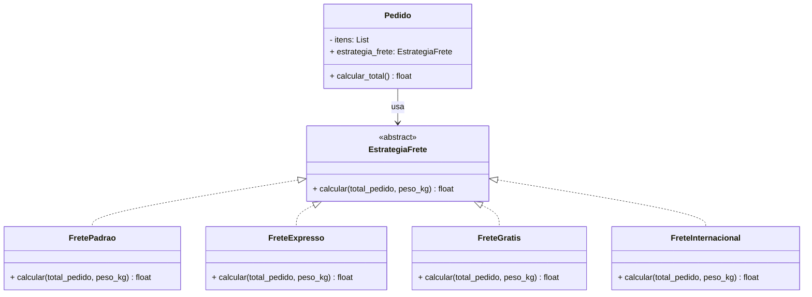
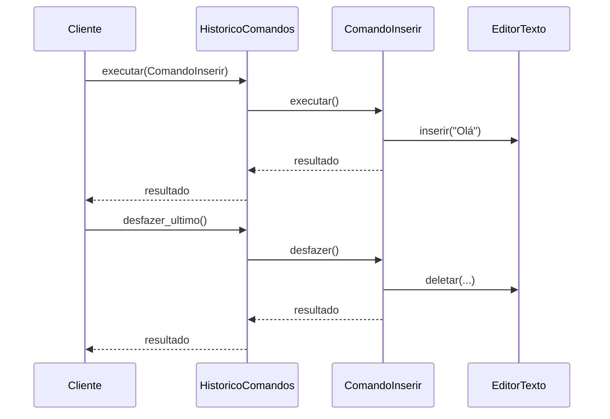
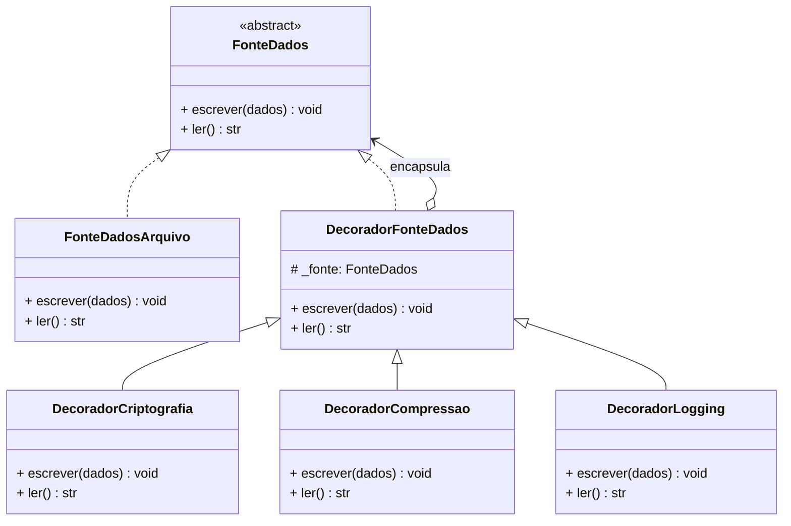
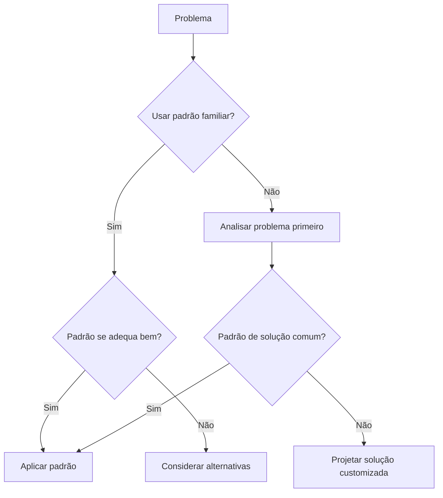
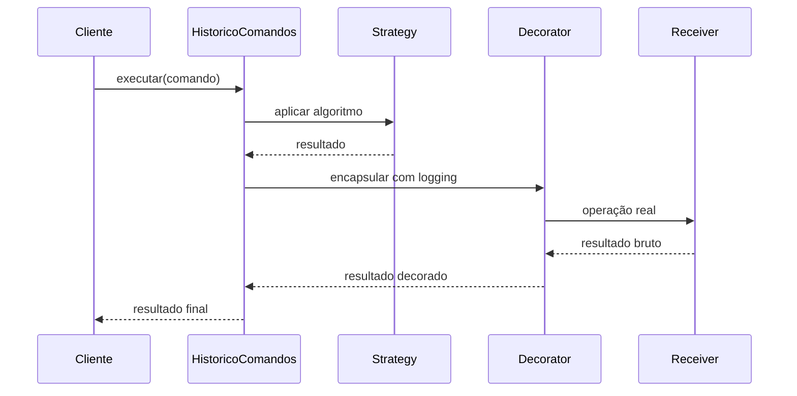

# Padrões Comportamentais e Boas Práticas

Padrões comportamentais focam em algoritmos e na atribuição de responsabilidades entre objetos. Eles capturam fluxos de controle complexos que são difíceis de acompanhar em tempo de execução, tornando mais fácil raciocinar sobre como seu sistema se comporta.

> [!NOTE]
> Padrões comportamentais são a maior categoria no catálogo GoF (11 padrões). Eles respondem à pergunta: "Como os objetos se comunicam e colaboram?"

## Padrão Strategy

**Propósito**: Definir uma família de algoritmos, encapsular cada um e torná-los intercambiáveis. Strategy permite que o algoritmo varie independentemente dos clientes que o usam.

### Quando Usar

- Múltiplos algoritmos para a mesma tarefa
- Lógica condicional com muitos if-else
- Selecionar comportamento em tempo de execução

### Implementação em Python

```python
from abc import ABC, abstractmethod
from dataclasses import dataclass
from typing import List


# Interface Strategy
class EstrategiaFrete(ABC):
    @abstractmethod
    def calcular(self, total_pedido: float, peso_kg: float) -> float: ...


# Estratégias concretas
class FretePadrao(EstrategiaFrete):
    def calcular(self, total_pedido: float, peso_kg: float) -> float:
        taxa_base = 5.99
        sobretaxa_peso = peso_kg * 0.50
        return taxa_base + sobretaxa_peso


class FreteExpresso(EstrategiaFrete):
    def calcular(self, total_pedido: float, peso_kg: float) -> float:
        taxa_base = 14.99
        sobretaxa_peso = peso_kg * 1.20
        return taxa_base + sobretaxa_peso


class FreteGratis(EstrategiaFrete):
    def calcular(self, total_pedido: float, peso_kg: float) -> float:
        return 0.0


class FreteInternacional(EstrategiaFrete):
    def calcular(self, total_pedido: float, peso_kg: float) -> float:
        taxa_base = 25.00
        sobretaxa_peso = peso_kg * 3.50
        taxa_alfandega = total_pedido * 0.10
        return taxa_base + sobretaxa_peso + taxa_alfandega


# Contexto
@dataclass
class Pedido:
    itens: List[dict]
    estrategia_frete: EstrategiaFrete

    def calcular_total(self) -> float:
        subtotal = sum(item["preco"] * item["quantidade"] for item in self.itens)
        peso = sum(item.get("peso_kg", 0) * item["quantidade"] for item in self.itens)
        frete = self.estrategia_frete.calcular(subtotal, peso)
        return subtotal + frete


# Uso
pedido = Pedido(
    itens=[
        {"nome": "Notebook", "preco": 4999.99, "quantidade": 1, "peso_kg": 2.5},
        {"nome": "Mouse", "preco": 29.99, "quantidade": 2, "peso_kg": 0.2},
    ],
    estrategia_frete=FreteExpresso(),
)

print(f"Total com frete expresso: R${pedido.calcular_total():.2f}")

# Trocar estratégia em tempo de execução
pedido.estrategia_frete = FreteGratis()
print(f"Total com frete grátis: R${pedido.calcular_total():.2f}")
```

### Diagrama de Classe Strategy



> [!TIP]
> Em Python, você pode frequentemente substituir o padrão Strategy por uma simples função ou callable. Use a abordagem baseada em classe quando as estratégias tiverem estado compartilhado ou configuração complexa.

## Padrão Command

**Propósito**: Encapsular uma requisição como um objeto, permitindo parametrizar clientes com diferentes requisições, enfileirar ou registrar requisições e suportar operações desfazíveis.

### Quando Usar

- Funcionalidade desfazer/refazer
- Filas de tarefas e agendamento de jobs
- Operações transacionais
- Gravação de macros (compondo comandos)

### Implementação em Python

```python
from abc import ABC, abstractmethod
from dataclasses import dataclass, field
from typing import List


# Interface Command
class Comando(ABC):
    @abstractmethod
    def executar(self) -> str: ...

    @abstractmethod
    def desfazer(self) -> str: ...


# Receiver
class EditorTexto:
    def __init__(self):
        self.conteudo = ""

    def inserir(self, texto: str, posicao: int = -1) -> None:
        if posicao == -1:
            self.conteudo += texto
        else:
            self.conteudo = self.conteudo[:posicao] + texto + self.conteudo[posicao:]

    def deletar(self, inicio: int, fim: int) -> str:
        deletado = self.conteudo[inicio:fim]
        self.conteudo = self.conteudo[:inicio] + self.conteudo[fim:]
        return deletado


# Comandos concretos
@dataclass
class ComandoInserir(Comando):
    editor: EditorTexto
    texto: str
    posicao: int = -1

    def executar(self) -> str:
        self.editor.inserir(self.texto, self.posicao)
        return f"Inserido '{self.texto}' na posição {self.posicao}"

    def desfazer(self) -> str:
        if self.posicao == -1:
            inicio = len(self.editor.conteudo) - len(self.texto)
        else:
            inicio = self.posicao
        self.editor.deletar(inicio, inicio + len(self.texto))
        return f"Desfeita inserção de '{self.texto}'"


@dataclass
class ComandoDeletar(Comando):
    editor: EditorTexto
    inicio: int
    fim: int
    _texto_deletado: str = ""

    def executar(self) -> str:
        self._texto_deletado = self.editor.deletar(self.inicio, self.fim)
        return f"Deletado '{self._texto_deletado}'"

    def desfazer(self) -> str:
        self.editor.inserir(self._texto_deletado, self.inicio)
        return f"Restaurado '{self._texto_deletado}'"


# Invoker
class HistoricoComandos:
    def __init__(self):
        self._historico: List[Comando] = []

    def executar(self, comando: Comando) -> str:
        resultado = comando.executar()
        self._historico.append(comando)
        return resultado

    def desfazer_ultimo(self) -> str:
        if not self._historico:
            return "Nada para desfazer"
        comando = self._historico.pop()
        return comando.desfazer()
```

### Diagrama de Sequência Command



## Padrão Decorator

**Propósito**: Anexar responsabilidades adicionais a um objeto dinamicamente. Decorators fornecem uma alternativa flexível à criação de subclasses para estender funcionalidade.

> [!NOTE]
> Python tem suporte de primeira classe para o padrão Decorator através da sintaxe `@decorator`. Enquanto decoradores Python modificam funções, o padrão GoF clássico trabalha com objetos.

### Quando Usar

- Adicionar logging, autenticação ou cache a operações
- Calcular métricas e monitoramento de performance
- Adicionar camadas de validação ou sanitização
- Estender classes de terceiros

### Implementação em Python

```python
from abc import ABC, abstractmethod


# Interface Component
class FonteDados(ABC):
    @abstractmethod
    def escrever(self, dados: str) -> None: ...

    @abstractmethod
    def ler(self) -> str: ...


# Componente concreto
class FonteDadosArquivo(FonteDados):
    def __init__(self, nome_arquivo: str):
        self.nome_arquivo = nome_arquivo
        self._dados = ""

    def escrever(self, dados: str) -> None:
        self._dados = dados
        print(f"Escrito em {self.nome_arquivo}: {dados}")

    def ler(self) -> str:
        return self._dados


# Decorator base
class DecoradorFonteDados(FonteDados):
    def __init__(self, fonte: FonteDados):
        self._fonte = fonte

    def escrever(self, dados: str) -> None:
        self._fonte.escrever(dados)

    def ler(self) -> str:
        return self._fonte.ler()


# Decorators concretos
class DecoradorCriptografia(DecoradorFonteDados):
    def escrever(self, dados: str) -> None:
        criptografado = f"CRIPTOGRAFADO[{dados}]"
        super().escrever(criptografado)

    def ler(self) -> str:
        dados = super().ler()
        return dados.replace("CRIPTOGRAFADO[", "").rstrip("]")


class DecoradorCompressao(DecoradorFonteDados):
    def escrever(self, dados: str) -> None:
        comprimido = f"COMPRIMIDO({dados})"
        super().escrever(comprimido)

    def ler(self) -> str:
        dados = super().ler()
        return dados.replace("COMPRIMIDO(", "").rstrip(")")


class DecoradorLogging(DecoradorFonteDados):
    def escrever(self, dados: str) -> None:
        print(f"[LOG] Escrevendo {len(dados)} bytes")
        super().escrever(dados)

    def ler(self) -> str:
        dados = super().ler()
        print(f"[LOG] Lidos {len(dados)} bytes")
        return dados
```

### Diagrama de Classe Decorator



## Anti-Padrões a Evitar

### 1. Objeto Deus

Uma classe centralizada que sabe demais ou faz demais.

```python
# Anti-padrão: Objeto Deus
class Aplicacao:
    def __init__(self):
        self.usuarios = []
        self.pedidos = []
        self.inventario = {}
        self.pagamentos = []

    def processar_pedido(self, ...):
        # Lida com validação, pagamento, inventário, email, logging...
        pass

    def gerenciar_usuarios(self, ...):
        pass

# Solução: Dividir em classes focadas
class GerenciadorUsuarios: ...
class ProcessadorPedidos: ...
class GerenciadorInventario: ...
```

### 2. Código Espaguete

Código com estruturas de controle complexas e emaranhadas.

```python
# Anti-padrão: Código espaguete
def manipular_requisicao(requisicao):
    if requisicao.metodo == "GET":
        if requisicao.caminho == "/usuarios":
            if requisicao.args.get("id"):
                pass
            else:
                pass
        elif requisicao.caminho == "/pedidos":
            pass

# Solução: Roteamento claro
@app.get("/usuarios/{usuario_id}")
def obter_usuario(usuario_id: int): ...

@app.get("/usuarios")
def listar_usuarios(): ...
```

### 3. Programação Copiar-Colar

Duplicar código em vez de abstrair.

```python
# Anti-padrão: Copiar-colar
def validar_email_usuario(email):
    if "@" not in email:
        raise ValueError("Email inválido")
    if len(email) > 255:
        raise ValueError("Email muito longo")

def validar_email_admin(email):
    if "@" not in email:
        raise ValueError("Email inválido")
    if len(email) > 255:
        raise ValueError("Email muito longo")

# Solução: Função única
def validar_email(email: str, maximo: int = 255) -> None:
    if "@" not in email:
        raise ValueError("Email inválido")
    if len(email) > maximo:
        raise ValueError(f"Email excede {maximo} caracteres")
```

### 4. Martelo de Ouro

Usar uma ferramenta ou padrão familiar para todo problema, mesmo quando inadequado.



## Comparação de Padrões

| Padrão | Propósito | Estrutura | Quando Usar |
|--------|-----------|-----------|-------------|
| Strategy | Encapsular algoritmos | Contexto + Strategy | Múltiplas formas de fazer a mesma tarefa |
| Command | Encapsular requisições | Invoker + Command + Receiver | Undo/redo, filas de tarefas |
| Decorator | Adicionar comportamento dinamicamente | Cadeia de wrappers | Estender código de terceiros |
| Observer | Notificações um-para-muitos | Assunto + Observadores | Sistemas de eventos, UI |
| Adapter | Conversão de interface | Cliente + Adapter + Adaptee | Integração legada |
| Factory | Criação de objetos | Criador + Produto | Polimorfismo em tempo de execução |

## Arquitetura do Mundo Real



> [!WARNING]
> Anti-padrões não são apenas "código ruim" — são soluções comuns para problemas recorrentes que parecem boas inicialmente, mas têm consequências negativas. Reconhecê-los é o primeiro passo para evitá-los.

## Exercícios Práticos

1. **Implementação Strategy**: Construa uma calculadora de preços que suporta diferentes estratégias de desconto (percentual, valor fixo, compre-um-levoutro).

2. **Command com desfazer**: Estenda o exemplo do editor de texto com um `ComandoSubstituir` que suporta desfazer/refazer.

3. **Cadeia de Decorators**: Crie um pipeline de dados com decorators para validação, transformação e logging.

4. **Caça a anti-padrões**: Encontre um Objeto Deus em sua base de código e divida-o em classes focadas.

5. **Strategy vs if-else**: Pegue uma função com uma cadeia de if-elif-else e refatore-a usando o padrão Strategy. Compare a testabilidade.

6. **Fila de comandos**: Implemente uma fila de tarefas usando o padrão Command onde comandos podem ser enfileirados, executados e seus resultados coletados.

7. **Decorator de função**: Escreva um decorator Python `@` que mede e registra o tempo de execução de qualquer função.

8. **Documentação de anti-padrões**: Documente 3 anti-padrões presentes em um projeto que você trabalha, com exemplos concretos e refatorações propostas.
