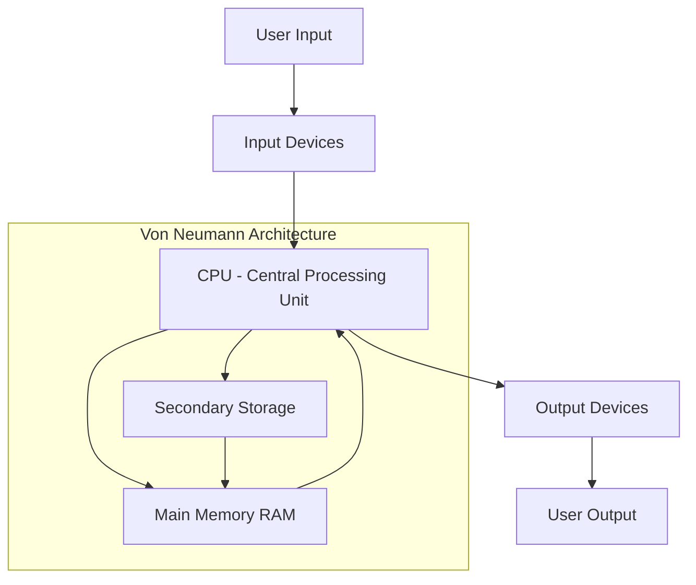
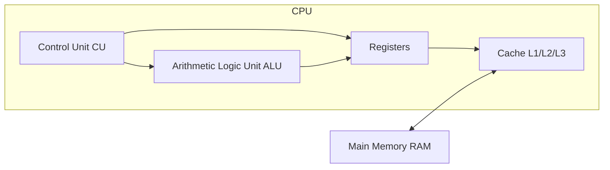
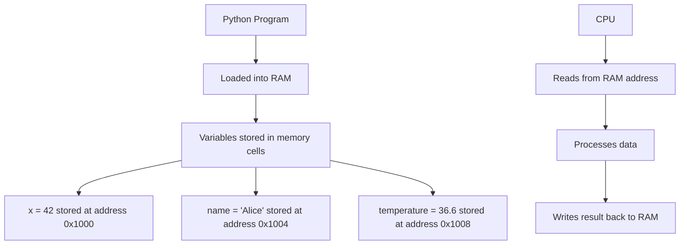
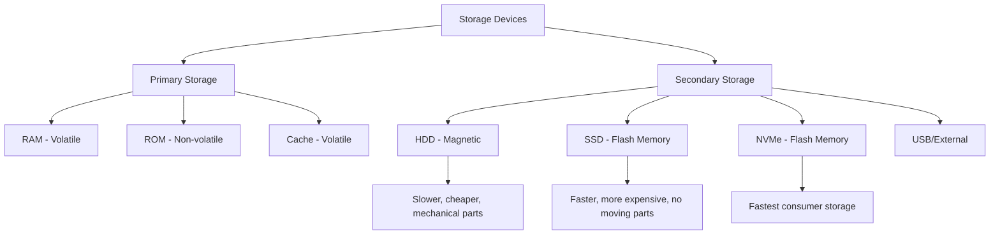
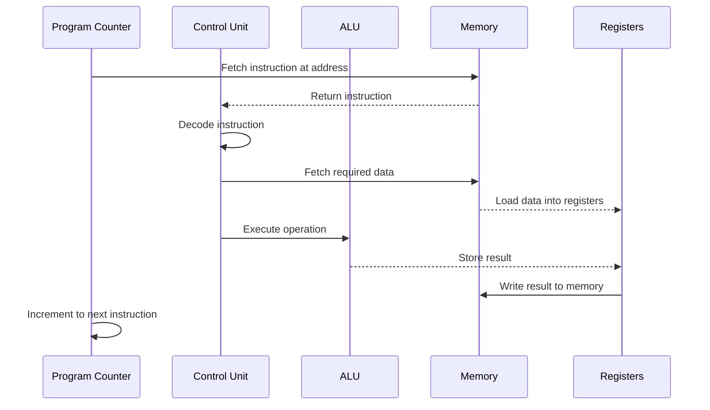
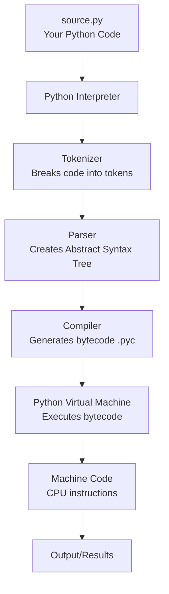

# How Computers Work

Before diving into Python programming, it's essential to understand the machine that runs your code. This lesson covers the fundamental components of computers, how they process information, and how programs are executed.

## The Computer System Overview

A computer is an electronic device that processes data according to a set of instructions called a program. Every Python program you write ultimately runs on this hardware.



### The Von Neumann Architecture

Most modern computers follow the Von Neumann architecture, proposed by mathematician John von Neumann in 1945. This architecture consists of four main components:

| Component | Function | Real-World Analogy |
|-----------|----------|-------------------|
| CPU | Processes instructions and data | The brain that thinks and calculates |
| Memory (RAM) | Stores active programs and data | A workbench where you do your work |
| Storage | Permanently saves data and programs | A filing cabinet for long-term storage |
| I/O Devices | Communicates with the outside world | Eyes, ears, mouth, and hands |

## Central Processing Unit (CPU)

The CPU is the "brain" of the computer. It executes instructions from programs, performs calculations, and manages data flow between components.

### CPU Components



**Control Unit (CU):** Directs the operation of the processor. It fetches instructions from memory, decodes them, and coordinates their execution.

**Arithmetic Logic Unit (ALU):** Performs mathematical operations (addition, subtraction, multiplication, division) and logical operations (AND, OR, NOT, comparisons).

**Registers:** Small, ultra-fast storage locations within the CPU. They hold data that the CPU is currently processing.

**Cache:** High-speed memory that stores frequently accessed data. L1 is fastest but smallest; L3 is slower but larger.

### CPU Clock Speed

The CPU clock determines how many cycles per second the processor can execute:

| Clock Speed | Cycles per Second | Typical Use |
|-------------|------------------|-------------|
| 1 GHz | 1,000,000,000 | Basic computing |
| 2.4 GHz | 2,400,000,000 | Standard laptops |
| 3.5 GHz | 3,500,000,000 | Gaming PCs |
| 5.0 GHz | 5,000,000,000 | High-performance workstations |

> [!NOTE]
> A 3.5 GHz CPU can execute billions of instructions per second. However, modern CPUs don't execute one instruction per cycle - they use pipelining and multiple cores to process many instructions simultaneously.

## Memory (RAM)

Random Access Memory (RAM) is the computer's short-term memory. It stores data and programs that are currently in use.

### How RAM Works



### Memory Hierarchy

| Type | Speed | Size | Volatile | Example |
|------|-------|------|----------|---------|
| Registers | Fastest | Bytes | Yes | CPU registers |
| L1 Cache | Very Fast | KBs | Yes | CPU cache |
| L2 Cache | Fast | MBs | Yes | CPU cache |
| L3 Cache | Moderate | MBs | Yes | CPU cache |
| RAM | Slower | GBs | Yes | DDR4/DDR5 |
| SSD | Slow | TBs | No | NVMe SSD |
| HDD | Slowest | TBs | No | Mechanical drive |

> [!TIP]
> When you run a Python script, the entire program is loaded into RAM. This is why programs with large datasets need more RAM. If RAM fills up, the system uses swap space on the disk, which is much slower.

## Binary Representation

Computers understand only two states: ON (1) and OFF (0). This binary system is the foundation of all digital computing.

### Binary Number System

The binary system uses base-2, while humans typically use base-10 (decimal).

| Decimal | Binary | Explanation |
|---------|--------|-------------|
| 0 | 0000 | 0 × 2⁰ = 0 |
| 1 | 0001 | 1 × 2⁰ = 1 |
| 2 | 0010 | 1 × 2¹ = 2 |
| 3 | 0011 | 1 × 2¹ + 1 × 2⁰ = 3 |
| 4 | 0100 | 1 × 2² = 4 |
| 5 | 0101 | 1 × 2² + 1 × 2⁰ = 5 |
| 10 | 1010 | 1 × 2³ + 1 × 2¹ = 10 |
| 255 | 11111111 | All 8 bits set to 1 |

### Converting Decimal to Binary

```
Decimal 13 to Binary:
13 ÷ 2 = 6 remainder 1  (least significant bit)
 6 ÷ 2 = 3 remainder 0
 3 ÷ 2 = 1 remainder 1
 1 ÷ 2 = 0 remainder 1  (most significant bit)

Reading remainders from bottom to top: 1101
Verification: 1×8 + 1×4 + 0×2 + 1×1 = 13 ✓
```

### Bits, Bytes, and Beyond

| Unit | Size | Can Store |
|------|------|-----------|
| Bit | 1 binary digit | 0 or 1 |
| Nibble | 4 bits | 0-15 |
| Byte | 8 bits | 0-255 or one ASCII character |
| Kilobyte (KB) | 1,024 bytes | A short paragraph |
| Megabyte (MB) | 1,024 KB | A small photo |
| Gigabyte (GB) | 1,024 MB | A movie |
| Terabyte (TB) | 1,024 GB | Thousands of movies |

> [!NOTE]
> In Python, integers can be arbitrarily large (limited only by available memory). The language handles the binary representation automatically, so you rarely need to think about bits and bytes directly.

## Storage Devices

Storage devices hold data permanently, even when the computer is powered off.

### Types of Storage



### HDD vs SSD Comparison

| Feature | HDD (Hard Disk Drive) | SSD (Solid State Drive) |
|---------|----------------------|------------------------|
| Technology | Magnetic platters | Flash memory chips |
| Speed | 80-160 MB/s | 500-7000 MB/s |
| Durability | Fragile (moving parts) | Robust (no moving parts) |
| Noise | Audible spinning | Silent |
| Price | Cheaper per GB | More expensive per GB |
| Best For | Bulk storage | OS and applications |

## The Fetch-Decode-Execute Cycle

Every program runs through a continuous cycle called the Fetch-Decode-Execute cycle. This is how your Python code actually runs on the CPU.

### The Cycle Steps


### Detailed Breakdown



### Example: Running `x = 5 + 3`

When Python executes `x = 5 + 3`, the CPU performs:

1. **FETCH:** Get the ADD instruction from memory
2. **DECODE:** Recognize it needs to add two numbers
3. **FETCH:** Get the values 5 and 3 from memory
4. **EXECUTE:** ALU performs 5 + 3 = 8
5. **STORE:** Save result 8 to memory location for variable `x`

> [!WARNING]
> This cycle happens billions of times per second. A simple Python program may execute millions of these cycles before completing.

## How Python Code Runs

Understanding how your Python code translates to machine operations helps you write more efficient programs.

### Python Execution Pipeline



### Bytecode Example

When you write Python code, it's compiled to bytecode before execution:

```python
# Source code
x = 10
y = 20
result = x + y
print(result)
```

The Python interpreter converts this to bytecode (shown using the `dis` module):

```python
import dis

def add_numbers():
    x = 10
    y = 20
    result = x + y
    print(result)

dis.dis(add_numbers)
```

Output:
```
  2           0 LOAD_CONST               1 (10)
              2 STORE_FAST               0 (x)

  3           4 LOAD_CONST               2 (20)
              6 STORE_FAST               1 (y)

  4           8 LOAD_FAST                0 (x)
             10 LOAD_FAST                1 (y)
             12 BINARY_ADD
             14 STORE_FAST               2 (result)

  5          16 LOAD_GLOBAL              0 (print)
             18 LOAD_FAST                2 (result)
             20 CALL_FUNCTION            1
             22 POP_TOP
             24 LOAD_CONST               0 (None)
             26 RETURN_VALUE
```

> [!TIP]
> The `dis` module is a great tool for understanding what Python does under the hood. Use it to see the bytecode of any function.

## Real-World Example: Calculator Performance

Let's see how computer architecture affects Python performance:

```python
import time

# Measure time for different operations
def benchmark_operations():
    iterations = 10_000_000
    
    # Test 1: Simple addition (uses ALU directly)
    start = time.time()
    total = 0
    for i in range(iterations):
        total += 1
    print(f"Addition: {time.time() - start:.4f} seconds")
    
    # Test 2: Multiplication (slightly more complex ALU operation)
    start = time.time()
    total = 1
    for i in range(iterations):
        total *= 1.0000001
    print(f"Multiplication: {time.time() - start:.4f} seconds")
    
    # Test 3: List access (involves memory access)
    data = list(range(iterations))
    start = time.time()
    total = 0
    for i in range(iterations):
        total += data[i]
    print(f"List access: {time.time() - start:.4f} seconds")

benchmark_operations()
```

Typical output:
```
Addition: 0.5234 seconds
Multiplication: 0.6891 seconds
List access: 1.2456 seconds
```

> [!NOTE]
> List access is slower because it involves memory lookups, not just CPU calculations. This demonstrates why understanding memory hierarchy matters for writing efficient code.

## Practice Exercises

### Exercise 1: Binary Conversion
Convert the following decimal numbers to binary:
- a) 7
- b) 15
- c) 32
- d) 100

### Exercise 2: Memory Hierarchy
Arrange the following from fastest to slowest:
- RAM, L1 Cache, HDD, Registers, SSD, L2 Cache

### Exercise 3: CPU Components
Explain what happens in the CPU when Python executes: `result = 10 * 5`

### Exercise 4: Storage Calculation
If a text file contains 1,000 characters (1 byte each), how many bytes, KB, and bits does it occupy?

### Exercise 5: Fetch-Decode-Execute
Describe each step of the fetch-decode-execute cycle for the Python statement: `x = x + 1`

### Exercise 6: Performance Analysis
Why is accessing data in RAM faster than accessing data from an SSD? Explain using the memory hierarchy concept.

### Exercise 7: Python Bytecode
Use the `dis` module to examine the bytecode of a simple function that returns the square of a number. What operations do you see?

### Exercise 8: Real-World Application
A program needs to process 1 million records. Would you store them in RAM or read from disk? Justify your answer based on what you learned about memory and storage.

## Summary

In this lesson, you learned:
- The Von Neumann architecture and its four main components
- CPU components: Control Unit, ALU, Registers, and Cache
- How RAM stores active programs and data
- Binary representation and why computers use base-2
- The memory hierarchy from registers to hard drives
- The fetch-decode-execute cycle that runs all programs
- How Python code is transformed into machine instructions

Understanding these fundamentals will help you write more efficient Python code and debug performance issues more effectively.
