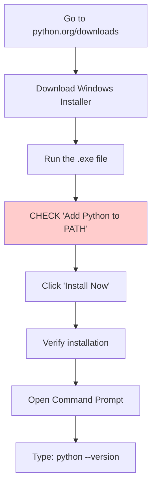
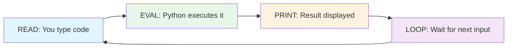
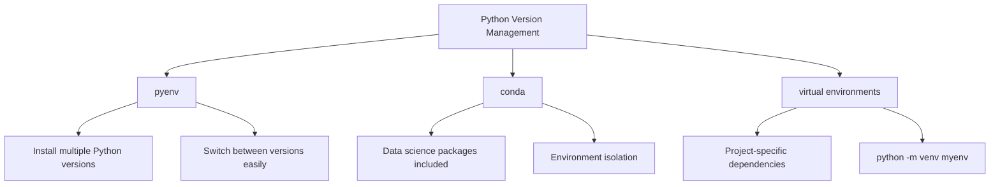

# Python Setup & First Program

Welcome to your first hands-on Python lesson! In this lesson, you'll install Python, write your first program, and learn different ways to run Python code.

## Installing Python

Python is available for all major operating systems. Let's get you set up.

### Checking if Python is Already Installed

Many systems come with Python pre-installed. Open your terminal or command prompt and type:

```bash
python3 --version
# or on Windows:
python --version
```

Expected output:
```
Python 3.11.4
```

> [!NOTE]
> This course requires Python 3.8 or higher. If you have an older version or Python is not installed, follow the installation steps below.

### Installing on Windows



**Step-by-step:**

1. Visit [python.org/downloads](https://www.python.org/downloads/)
2. Click "Download Python 3.x.x" (latest version)
3. Run the downloaded installer
4. **IMPORTANT:** Check "Add Python to PATH" at the bottom
5. Click "Install Now"
6. Verify by opening Command Prompt and typing `python --version`

### Installing on macOS

```bash
# Option 1: Using Homebrew (recommended)
brew install python3

# Option 2: Download from python.org
# Visit https://www.python.org/downloads/macos/
```

Verify installation:
```bash
python3 --version
```

### Installing on Linux (Ubuntu/Debian)

```bash
# Update package list
sudo apt update

# Install Python 3
sudo apt install python3 python3-pip

# Verify installation
python3 --version
```

> [!TIP]
> On Linux, you may already have Python installed. Use `python3` instead of `python` to ensure you're using Python 3.

## The Python REPL

REPL stands for Read-Eval-Print Loop. It's an interactive environment where you can type Python code and see results immediately.

### Starting the REPL

```bash
# Windows
python

# macOS/Linux
python3
```

You'll see something like:
```
Python 3.11.4 (main, Jun  1 2024, 00:00:00) [GCC 11.3.0] on linux
Type "help", "copyright", "credits" or "license" for more information.
>>>
```

### Using the REPL

```python
# The >>> is the prompt. Type code after it.
>>> 2 + 2
4

>>> "Hello, World!"
'Hello, World!'

>>> name = "Alice"
>>> name
'Alice'

>>> len(name)
5

>>> type(42)
<class 'int'>

>>> type("hello")
<class 'str'>
```



### Exiting the REPL

```python
# Method 1: Use exit()
>>> exit()

# Method 2: Use Ctrl+D (macOS/Linux) or Ctrl+Z then Enter (Windows)
```

> [!TIP]
> The REPL is perfect for testing small code snippets, exploring Python features, and doing quick calculations. Use it frequently while learning!

## Your First Python Program: Hello World

The tradition in programming is to start with a "Hello, World!" program. Let's create yours.

### Using a Text Editor

Create a new file called `hello.py` with the following content:

```python
# hello.py - My first Python program
print("Hello, World!")
```

That's it! One line of code. Let's break it down:

| Part | Purpose |
|------|---------|
| `#` | Starts a comment (ignored by Python) |
| `print()` | A built-in function that displays output |
| `"Hello, World!"` | A string (text) to display |

### Running Your Script

```bash
# Navigate to the folder where hello.py is saved
cd path/to/your/folder

# Run the script
python3 hello.py
```

Output:
```
Hello, World!
```

```mermaid
flowchart TD
    A[hello.py file] --> B[Python Interpreter]
    B --> C[Reads: print"Hello, World!"]
    C --> D[Executes print function]
    D --> E[Displays: Hello, World!]
    E --> F[Program ends]
```

## Running Python Scripts

There are multiple ways to run Python code. Let's explore them all.

### Method 1: Direct Script Execution

```bash
python3 script.py
```

### Method 2: Running as a Module

```bash
python3 -m script
```

### Method 3: Making a Script Executable (Linux/macOS)

```python
#!/usr/bin/env python3
# hello.py

print("Hello, World!")
```

```bash
# Make the file executable
chmod +x hello.py

# Run it directly
./hello.py
```

### Method 4: Using an IDE

Popular Python IDEs and editors:

| IDE/Editor | Type | Best For |
|------------|------|----------|
| VS Code | Free editor | General purpose |
| PyCharm | Free/Paid IDE | Professional development |
| Thonny | Free IDE | Beginners |
| Jupyter Notebook | Web-based | Data science, exploration |
| IDLE | Bundled with Python | Simple testing |

> [!NOTE]
> For this course, any text editor works. VS Code with the Python extension is recommended for its simplicity and powerful features.

## Python Comments

Comments are notes in your code that Python ignores. They help explain what your code does.

### Single-Line Comments

```python
# This is a single-line comment
print("Hello")  # This is an inline comment
```

### Multi-Line Comments

```python
# This is a comment
# that spans multiple lines
# explaining complex logic
print("Hello")

# Or use triple quotes (technically a string, but often used as multi-line comment)
"""
This is a multi-line comment
using triple quotes.
It's often used for documentation.
"""
print("Hello")
```

## Working with Input and Output

Let's make our program interactive by taking user input.

### The input() Function

```python
# greeting.py
name = input("What is your name? ")
print(f"Hello, {name}! Welcome to Python!")
```

Running this script:
```
$ python3 greeting.py
What is your name? Alice
Hello, Alice! Welcome to Python!
```

> [!WARNING]
> The `input()` function always returns a string. If you need a number, you must convert it using `int()` or `float()`.

### Complete Example: Simple Calculator

```python
# simple_calculator.py
# A simple calculator that adds two numbers

# Get user input
print("=== Simple Addition Calculator ===")
num1 = float(input("Enter the first number: "))
num2 = float(input("Enter the second number: "))

# Perform calculation
result = num1 + num2

# Display result
print(f"{num1} + {num2} = {result}")
```

Sample output:
```
=== Simple Addition Calculator ===
Enter the first number: 15.5
Enter the second number: 7.3
15.5 + 7.3 = 22.8
```

## Understanding File Extensions

Python files use the `.py` extension. Here's what different Python file types mean:

| Extension | Description |
|-----------|-------------|
| `.py` | Python source code file |
| `.pyc` | Compiled Python bytecode (auto-generated) |
| `.pyw` | Python script without console window (Windows) |
| `.pyi` | Python stub file for type hints |

## Python Version Management

As you progress, you might need multiple Python versions. Here are tools to manage them:



### Creating a Virtual Environment

```bash
# Create a virtual environment
python3 -m venv myenv

# Activate it (Linux/macOS)
source myenv/bin/activate

# Activate it (Windows)
myenv\Scripts\activate

# Now python points to the environment's Python
python --version

# Deactivate when done
deactivate
```

> [!TIP]
> Always use virtual environments for your projects. They keep dependencies isolated and prevent conflicts between projects.

## Real-World Example: System Information Script

Let's create a useful script that displays system information:

```python
# system_info.py
import platform
import sys
import os

def display_system_info():
    """Display basic system information."""
    print("=" * 40)
    print("       SYSTEM INFORMATION")
    print("=" * 40)
    print(f"Python Version: {sys.version}")
    print(f"Operating System: {platform.system()} {platform.release()}")
    print(f"Machine: {platform.machine()}")
    print(f"Processor: {platform.processor()}")
    print(f"Current Directory: {os.getcwd()}")
    print(f"Python Path: {sys.executable}")
    print("=" * 40)

if __name__ == "__main__":
    display_system_info()
```

Sample output:
```
========================================
       SYSTEM INFORMATION
========================================
Python Version: 3.11.4 (main, Jun  1 2024, 00:00:00) [GCC 11.3.0]
Operating System: Linux 5.15.0-91-generic
Machine: x86_64
Processor: x86_64
Current Directory: /home/user/projects
Python Path: /usr/bin/python3
========================================
```

## Practice Exercises

### Exercise 1: Installation Check
Verify Python is installed correctly by running `python3 --version` and `pip3 --version` in your terminal.

### Exercise 2: REPL Exploration
Open the Python REPL and try the following:
- Calculate `17 * 23`
- Find the length of the string "Python Programming"
- Check the type of `3.14`
- Use `help(print)` to see the documentation for the print function

### Exercise 3: Personalized Greeting
Create a script called `greeting.py` that asks for the user's name and age, then prints a personalized greeting including the year they were born.

### Exercise 4: Temperature Converter
Write a script that asks for a temperature in Celsius and converts it to Fahrenheit using the formula: `F = C * 9/5 + 32`

### Exercise 5: Multi-line Output
Create a script that prints a simple ASCII art or pattern using multiple print statements:
```
  *
 ***
*****
 ***
  *
```

### Exercise 6: Virtual Environment
Create a virtual environment, activate it, verify it's active, and then deactivate it.

### Exercise 7: Comments Practice
Write a script with at least 5 lines of code and add meaningful comments explaining each step.

### Exercise 8: Error Exploration
In the REPL, try these and observe the error messages:
- `print("hello"` (missing closing parenthesis)
- `2 + "two"` (adding number and string)
- `prnt("hello")` (typo in function name)

## Summary

In this lesson, you learned:
- How to install Python on Windows, macOS, and Linux
- How to use the Python REPL for interactive coding
- How to write and run your first Python script
- Different methods to execute Python code
- How to use comments to document your code
- How to get user input with `input()`
- How to create and use virtual environments
- How to build practical scripts

You're now ready to start writing Python programs! The next lesson will dive into variables and data types.
