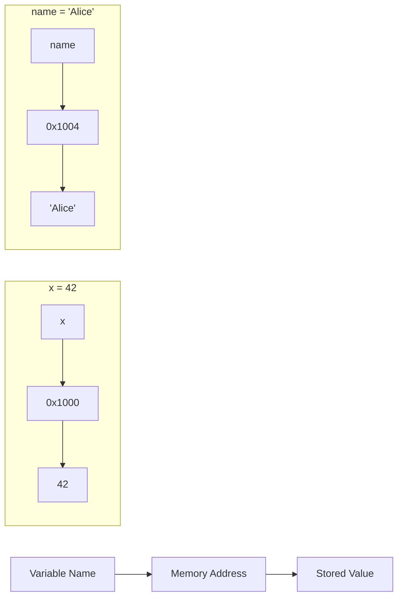
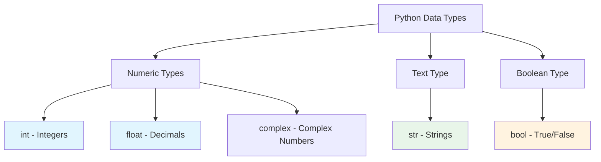
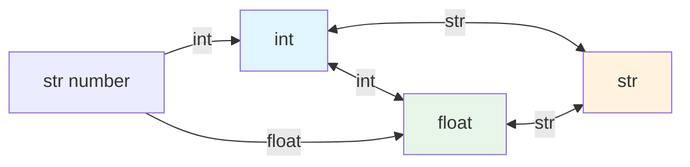

# Variables & Data Types

Variables are the foundation of every program. They store data that your program manipulates. In Python, working with variables is intuitive and flexible.

## What is a Variable?

A variable is a named location in memory that stores a value. Think of it as a labeled box where you can put different items.



### Creating Variables in Python

```python
# Variable assignment
age = 25
name = "Alice"
height = 1.75
is_student = True

# Multiple assignment
x, y, z = 10, 20, 30
a = b = c = 0

# Displaying variables
print(f"Name: {name}")
print(f"Age: {age}")
print(f"Height: {height}m")
print(f"Student: {is_student}")
```

Output:
```
Name: Alice
Age: 25
Height: 1.75m
Student: True
```

> [!NOTE]
> Unlike languages like C or Java, Python doesn't require you to declare the type of a variable. Python infers the type from the value you assign. This is called "dynamic typing."

## Python's Primitive Data Types

Python has several built-in data types. Let's explore the four most fundamental ones.

### Overview of Data Types



| Type | Python Name | Example | Description |
|------|-------------|---------|-------------|
| Integer | `int` | `42`, `-7`, `0` | Whole numbers (positive, negative, zero) |
| Float | `float` | `3.14`, `-0.5`, `2.0` | Decimal numbers |
| String | `str` | `"hello"`, `'world'` | Text/characters |
| Boolean | `bool` | `True`, `False` | Truth values |

## Integers (int)

Integers represent whole numbers without a decimal point.

### Integer Operations

```python
# Creating integers
positive = 100
negative = -50
zero = 0
large_number = 1_000_000  # Underscores for readability

# Arithmetic with integers
a = 15
b = 4

print(f"Addition: {a} + {b} = {a + b}")       # 19
print(f"Subtraction: {a} - {b} = {a - b}")    # 11
print(f"Multiplication: {a} * {b} = {a * b}") # 60
print(f"Division: {a} / {b} = {a / b}")       # 3.75 (returns float!)
print(f"Floor Division: {a} // {b} = {a // b}") # 3
print(f"Modulus: {a} % {b} = {a % b}")        # 3
print(f"Exponent: {a} ** {b} = {a ** b}")     # 50625
```

Output:
```
Addition: 15 + 4 = 19
Subtraction: 15 - 4 = 11
Multiplication: 15 * 4 = 60
Division: 15 / 4 = 3.75
Floor Division: 15 // 4 = 3
Modulus: 15 % 4 = 3
Exponent: 15 ** 4 = 50625
```

> [!TIP]
> Python integers have unlimited precision! You can work with numbers as large as your memory allows:
> ```python
> >>> 2 ** 1000
> 107150860718626732094842504906000181056140481170553360744375038837...
> ```

## Floats (float)

Floats represent numbers with decimal points.

### Float Operations and Precision

```python
# Creating floats
pi = 3.14159
temperature = -5.5
scientific = 6.022e23  # Scientific notation: 6.022 × 10²³

# Float operations
x = 10.5
y = 3.2

print(f"Addition: {x + y}")       # 13.7
print(f"Multiplication: {x * y}") # 33.6

# Float precision caveat
print(f"\n0.1 + 0.2 = {0.1 + 0.2}")  # 0.30000000000000004 (!)
print(f"0.1 + 0.2 == 0.3: {0.1 + 0.2 == 0.3}")  # False!
```

Output:
```
Addition: 13.7
Multiplication: 33.6

0.1 + 0.2 = 0.30000000000000004
0.1 + 0.2 == 0.3: False
```

> [!WARNING]
> Floating-point arithmetic can have precision issues due to how computers represent decimals in binary. For financial calculations, use the `decimal` module instead of floats.

```python
# Using decimal for precise calculations
from decimal import Decimal

a = Decimal('0.1')
b = Decimal('0.2')
print(f"Decimal: {a + b}")  # 0.3 (exact!)
```

## Strings (str)

Strings represent text and are enclosed in quotes.

### Creating and Using Strings

```python
# Different ways to create strings
single_quotes = 'Hello'
double_quotes = "World"
triple_quotes = """This is a
multi-line string"""

# String operations
first_name = "Alice"
last_name = "Smith"

# Concatenation
full_name = first_name + " " + last_name
print(f"Full name: {full_name}")

# Repetition
separator = "-" * 30
print(separator)

# String length
message = "Python Programming"
print(f"Length: {len(message)}")  # 18

# Accessing characters (indexing)
word = "Python"
print(f"First character: {word[0]}")    # P
print(f"Last character: {word[-1]}")    # n
print(f"Third character: {word[2]}")    # t
```

Output:
```
Full name: Alice Smith
------------------------------
Length: 18
First character: P
Last character: n
Third character: t
```

### String Methods

```python
text = "  Hello, World!  "

print(f"Original: '{text}'")
print(f"Upper: '{text.upper()}'")
print(f"Lower: '{text.lower()}'")
print(f"Title: '{text.title()}'")
print(f"Strip: '{text.strip()}'")
print(f"Replace: '{text.replace('World', 'Python')}'")
print(f"Split: {text.strip().split(',')}")
```

Output:
```
Original: '  Hello, World!  '
Upper: '  HELLO, WORLD!  '
Lower: '  hello, world!  '
Title: '  Hello, World!  '
Strip: 'Hello, World!'
Replace: '  Hello, Python!  '
Split: ['Hello', 'World!']
```

### F-Strings (Formatted String Literals)

```python
name = "Alice"
age = 30
score = 95.678

# Basic f-string
print(f"My name is {name} and I am {age} years old.")

# Expressions in f-strings
print(f"Next year I will be {age + 1}.")

# Formatting numbers
print(f"Score: {score:.2f}")      # 2 decimal places: 95.68
print(f"Score as percent: {score:.1%}")  # Not applicable here, but useful
print(f"Right aligned: {name:>10}")     # Right aligned in 10 chars
print(f"Center aligned: {name:^10}")    # Center aligned
```

Output:
```
My name is Alice and I am 30 years old.
Next year I will be 31.
Score: 95.68
Right aligned:      Alice
Center aligned:  Alice   
```

## Booleans (bool)

Booleans represent truth values: `True` or `False`.

### Boolean Basics

```python
# Boolean values
is_active = True
is_admin = False

print(f"Active: {is_active}")       # True
print(f"Admin: {is_admin}")         # False
print(f"Type: {type(is_active)}")   # <class 'bool'>

# Boolean from comparisons
x = 10
y = 20

print(f"\n{x} > {y}: {x > y}")       # False
print(f"{x} < {y}: {x < y}")         # True
print(f"{x} == {y}: {x == y}")       # False
print(f"{x} != {y}: {x != y}")       # True
print(f"{x} >= 10: {x >= 10}")       # True
```

### Truthiness in Python

```python
# Python evaluates many values as True or False in boolean context
print(f"bool(1): {bool(1)}")         # True
print(f"bool(0): {bool(0)}")         # False
print(f"bool('hello'): {bool('hello')}")  # True
print(f"bool(''): {bool('')}")       # False
print(f"bool([]): {bool([])}")       # False (empty list)
print(f"bool([1, 2]): {bool([1, 2])}")  # True (non-empty list)
print(f"bool(None): {bool(None)}")   # False
```

> [!NOTE]
> In Python, the following are considered "falsy": `False`, `None`, `0`, `0.0`, `""`, `[]`, `{}`, `set()`. Everything else is "truthy".

## Type Conversion (Casting)

You often need to convert between types. Python provides built-in functions for this.

### Converting Between Types



```python
# String to int
age_str = "25"
age_int = int(age_str)
print(f"int('25') = {age_int}")        # 25
print(f"Type: {type(age_int)}")        # <class 'int'>

# String to float
price_str = "19.99"
price_float = float(price_str)
print(f"float('19.99') = {price_float}")  # 19.99

# Int/float to string
number = 42
number_str = str(number)
print(f"str(42) = '{number_str}'")     # '42'

# Float to int (truncates, doesn't round!)
pi = 3.14159
pi_int = int(pi)
print(f"int(3.14159) = {pi_int}")     # 3

# Boolean to int/float
print(f"int(True) = {int(True)}")      # 1
print(f"int(False) = {int(False)}")    # 0
print(f"float(True) = {float(True)}")  # 1.0
```

### Practical Example: Input Conversion

```python
# calculator_input.py
# Getting numeric input from user

print("=== Rectangle Area Calculator ===")

# input() always returns a string, so we must convert
width_str = input("Enter width: ")
height_str = input("Enter height: ")

# Convert strings to floats
width = float(width_str)
height = float(height_str)

# Calculate area
area = width * height

print(f"\nRectangle Dimensions:")
print(f"  Width: {width}")
print(f"  Height: {height}")
print(f"  Area: {area}")
```

Sample output:
```
=== Rectangle Area Calculator ===
Enter width: 5.5
Enter height: 3.2

Rectangle Dimensions:
  Width: 5.5
  Height: 3.2
  Area: 17.6
```

## Variable Naming Conventions

Python has specific rules and conventions for naming variables.

### Rules (Must Follow)

| Rule | Valid | Invalid |
|------|-------|---------|
| Start with letter or underscore | `name`, `_age` | `1name`, `2nd` |
| Only letters, numbers, underscores | `user_name`, `var2` | `user-name`, `var@2` |
| Case-sensitive | `age`, `Age`, `AGE` are different | - |
| Not a reserved keyword | - | `if`, `for`, `class`, `def` |

### Conventions (Should Follow)

```python
# Snake case for variables (recommended)
user_name = "Alice"
total_amount = 100.50
is_active = True

# Constants (all uppercase)
PI = 3.14159
MAX_RETRIES = 3
API_KEY = "secret123"

# Private variables (leading underscore - convention only)
_internal_value = 42
_temp_data = []

# Bad names - avoid these!
x = 10          # Too vague
temp123 = "hi"  # Not descriptive
myVariableName = "Alice"  # camelCase not standard in Python
```

> [!TIP]
> Choose descriptive names! `student_age` is much better than `sa` or `x`. Your future self (and other developers) will thank you.

## Checking Types with type() and isinstance()

```python
# Using type()
value1 = 42
value2 = 3.14
value3 = "hello"
value4 = True

print(f"type(42) = {type(value1)}")         # <class 'int'>
print(f"type(3.14) = {type(value2)}")       # <class 'float'>
print(f"type('hello') = {type(value3)}")    # <class 'str'>
print(f"type(True) = {type(value4)}")       # <class 'bool'>

# Using isinstance() for type checking
print(f"\nisinstance(42, int): {isinstance(42, int)}")          # True
print(f"isinstance(3.14, int): {isinstance(3.14, int)}")        # False
print(f"isinstance(3.14, float): {isinstance(3.14, float)}")    # True
print(f"isinstance(True, int): {isinstance(True, int)}")        # True (bool is subclass of int!)
```

## Real-World Example: Student Record System

```python
# student_record.py
# A simple student record using different data types

# Student information
student_id = 1001                    # int
name = "Maria Santos"                # str
age = 22                             # int
gpa = 3.85                           # float
is_enrolled = True                   # bool
courses = ["Math", "Physics", "CS"]  # list

# Display student record
print("=" * 40)
print("       STUDENT RECORD")
print("=" * 40)
print(f"Student ID: {student_id}")
print(f"Name: {name}")
print(f"Age: {age}")
print(f"GPA: {gpa:.2f}")
print(f"Enrolled: {'Yes' if is_enrolled else 'No'}")
print(f"Courses: {', '.join(courses)}")
print("=" * 40)

# Type summary
print("\nData Types Used:")
print(f"  student_id: {type(student_id).__name__}")
print(f"  name: {type(name).__name__}")
print(f"  age: {type(age).__name__}")
print(f"  gpa: {type(gpa).__name__}")
print(f"  is_enrolled: {type(is_enrolled).__name__}")
```

Output:
```
========================================
       STUDENT RECORD
========================================
Student ID: 1001
Name: Maria Santos
Age: 22
GPA: 3.85
Enrolled: Yes
Courses: Math, Physics, CS
========================================

Data Types Used:
  student_id: int
  name: str
  age: int
  gpa: float
  is_enrolled: bool
```

## Practice Exercises

### Exercise 1: Type Identification
Identify the type of each value:
- `42`
- `"42"`
- `42.0`
- `True`
- `"True"`
- `0`

### Exercise 2: Variable Creation
Create variables for a product: name (str), price (float), quantity (int), and in_stock (bool). Print a summary.

### Exercise 3: Type Conversion
Convert the string `"3.14159"` to a float, then to an int. What happens to the decimal part?

### Exercise 4: String Operations
Given `text = "Python Programming"`, write code to:
- Get the length
- Convert to uppercase
- Replace "Python" with "Java"
- Get the first 6 characters

### Exercise 5: F-String Formatting
Create an f-string that displays a price of $19.99 with 2 decimal places, right-aligned in 10 characters.

### Exercise 6: Naming Convention Fix
Fix these variable names to follow Python conventions:
- `myVariableName`
- `2ndPlace`
- `user-email`
- `TOTALTAX`

### Exercise 7: Temperature Conversion Program
Write a program that converts Celsius to Fahrenheit and Kelvin:
- F = C × 9/5 + 32
- K = C + 273.15

### Exercise 8: Type Checker Function
Write a function that takes any value and prints its type and whether it's truthy or falsy.

## Summary

In this lesson, you learned:
- How to create and use variables in Python
- The four primitive data types: int, float, str, bool
- Arithmetic operations and their behavior with different types
- String operations, methods, and f-string formatting
- Boolean values and truthiness in Python
- Type conversion between different data types
- Variable naming rules and conventions
- How to check types using `type()` and `isinstance()`

Variables and data types are the building blocks of every Python program. Master these fundamentals before moving on to operators and expressions.
