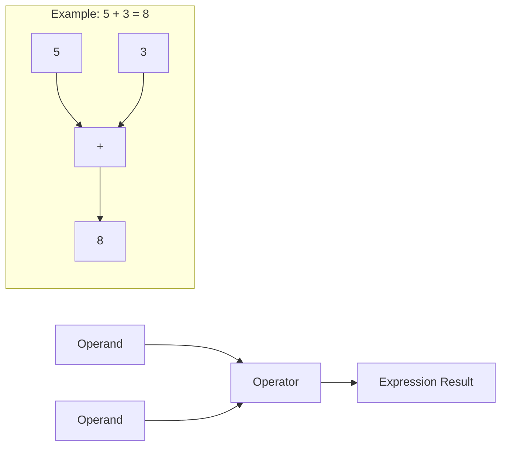
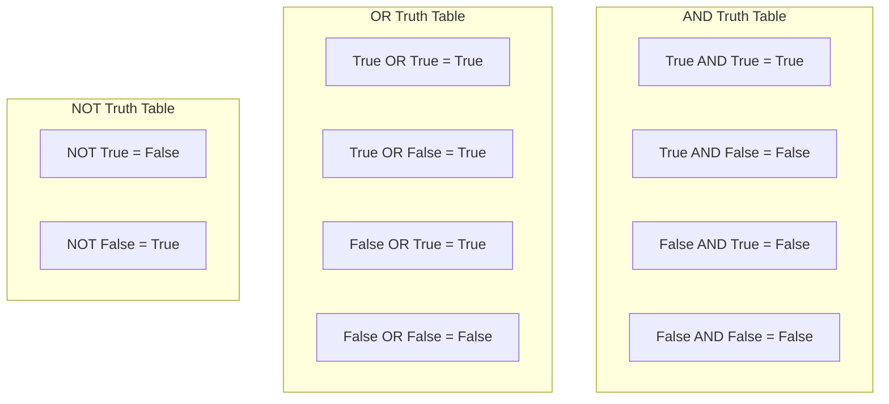

# Operators & Expressions

Operators are symbols that perform operations on values and variables. Expressions combine operators and operands to produce results. This lesson covers all Python operators you need to know.

## What Are Operators and Expressions?



An **expression** is any combination of values, variables, and operators that evaluates to a single value.

```python
# Simple expressions
5 + 3           # 8
x * 2           # depends on x
age >= 18       # True or False

# Complex expressions
result = (x + y) * (z - 1) / 2
is_valid = age >= 18 and has_id == True
```

## Arithmetic Operators

Arithmetic operators perform mathematical calculations.

### Arithmetic Operator Reference

| Operator | Name | Example | Result |
|----------|------|---------|--------|
| `+` | Addition | `10 + 3` | `13` |
| `-` | Subtraction | `10 - 3` | `7` |
| `*` | Multiplication | `10 * 3` | `30` |
| `/` | Division | `10 / 3` | `3.333...` |
| `//` | Floor Division | `10 // 3` | `3` |
| `%` | Modulus | `10 % 3` | `1` |
| `**` | Exponentiation | `10 ** 3` | `1000` |

### Arithmetic in Action

```python
# Basic arithmetic
a = 17
b = 5

print(f"a = {a}, b = {b}\n")
print(f"Addition:       {a} + {b} = {a + b}")
print(f"Subtraction:    {a} - {b} = {a - b}")
print(f"Multiplication: {a} * {b} = {a * b}")
print(f"Division:       {a} / {b} = {a / b}")
print(f"Floor Division: {a} // {b} = {a // b}")
print(f"Modulus:        {a} % {b} = {a % b}")
print(f"Exponentiation: {a} ** {b} = {a ** b}")
```

Output:
```
a = 17, b = 5

Addition:       17 + 5 = 22
Subtraction:    17 - 5 = 12
Multiplication: 17 * 5 = 85
Division:       17 / 5 = 3.4
Floor Division: 17 // 5 = 3
Modulus:        17 % 5 = 2
Exponentiation: 17 ** 5 = 1419857
```

### Practical Use of Modulus and Floor Division

```python
# Time conversion: seconds to hours, minutes, seconds
total_seconds = 10000

hours = total_seconds // 3600
remaining = total_seconds % 3600
minutes = remaining // 60
seconds = remaining % 60

print(f"{total_seconds} seconds = {hours}h {minutes}m {seconds}s")
# Output: 10000 seconds = 2h 46m 40s

# Check if a number is even or odd
def check_even_odd(number):
    if number % 2 == 0:
        return f"{number} is even"
    else:
        return f"{number} is odd"

print(check_even_odd(42))  # 42 is even
print(check_even_odd(17))  # 17 is odd
```

## Comparison Operators

Comparison operators compare two values and return a boolean result.

### Comparison Operator Reference

| Operator | Name | Example | Result |
|----------|------|---------|--------|
| `==` | Equal | `5 == 5` | `True` |
| `!=` | Not Equal | `5 != 3` | `True` |
| `>` | Greater Than | `5 > 3` | `True` |
| `<` | Less Than | `5 < 3` | `False` |
| `>=` | Greater or Equal | `5 >= 5` | `True` |
| `<=` | Less or Equal | `5 <= 3` | `False` |

### Comparison in Action

```python
x = 10
y = 20

print(f"x = {x}, y = {y}\n")
print(f"x == y: {x == y}")   # False
print(f"x != y: {x != y}")   # True
print(f"x > y:  {x > y}")    # False
print(f"x < y:  {x < y}")    # True
print(f"x >= y: {x >= y}")   # False
print(f"x <= y: {x <= y}")   # True

# Chaining comparisons (Python feature!)
age = 25
print(f"\n18 <= {age} <= 65: {18 <= age <= 65}")  # True
print(f"0 <= {age} <= 18: {0 <= age <= 18}")      # False
```

> [!TIP]
> Python allows chaining comparisons! `18 <= age <= 65` is equivalent to `18 <= age and age <= 65`, but more readable.

### Real-World Example: Age Verification

```python
def check_access(age, has_ticket, is_vip):
    """Determine if a person can enter an event."""
    
    # Age check
    age_ok = age >= 18
    
    # Access logic
    if is_vip:
        access = age_ok  # VIPs only need age check
        reason = "VIP access granted"
    elif has_ticket:
        access = age_ok
        reason = "Ticket holder" if age_ok else "Underage"
    else:
        access = False
        reason = "No ticket"
    
    return access, reason

# Test cases
print(check_access(25, True, False))   # (True, 'Ticket holder')
print(check_access(16, True, False))   # (False, 'Underage')
print(check_access(17, False, True))   # (False, 'VIP access granted')
print(check_access(30, False, True))   # (True, 'VIP access granted')
```

## Logical Operators

Logical operators combine boolean expressions.

### Logical Operator Reference

| Operator | Description | Example | Result |
|----------|-------------|---------|--------|
| `and` | True if both are True | `True and False` | `False` |
| `or` | True if at least one is True | `True or False` | `True` |
| `not` | Inverts the boolean | `not True` | `False` |

### Truth Tables



### Logical Operators in Action

```python
# AND: Both conditions must be True
age = 25
has_id = True

can_enter = age >= 18 and has_id
print(f"Can enter (AND): {can_enter}")  # True

# OR: At least one condition must be True
is_weekend = False
is_holiday = True

no_work = is_weekend or is_holiday
print(f"No work today (OR): {no_work}")  # True

# NOT: Inverts the result
is_raining = False
print(f"Need umbrella (NOT): {not is_raining}")  # True (it's NOT raining, so no umbrella needed... wait!)

# Actually, let's fix the logic:
need_umbrella = is_raining  # If it's raining, we need umbrella
print(f"Need umbrella: {need_umbrella}")  # False
```

### Short-Circuit Evaluation

```python
# AND short-circuits: if first is False, second is not evaluated
def check():
    print("  check() was called!")
    return True

result = False and check()  # check() is NOT called
print(f"Result: {result}")

result = True and check()   # check() IS called
print(f"Result: {result}")
```

Output:
```
Result: False
  check() was called!
Result: True
```

> [!NOTE]
> Short-circuit evaluation is useful for avoiding errors:
> ```python
> # Safe division
> if divisor != 0 and (numerator / divisor) > 10:
>     print("Large result")
> ```

## Assignment Operators

Assignment operators assign and update variable values.

### Assignment Operator Reference

| Operator | Example | Equivalent To |
|----------|---------|---------------|
| `=` | `x = 5` | `x = 5` |
| `+=` | `x += 3` | `x = x + 3` |
| `-=` | `x -= 3` | `x = x - 3` |
| `*=` | `x *= 3` | `x = x * 3` |
| `/=` | `x /= 3` | `x = x / 3` |
| `//=` | `x //= 3` | `x = x // 3` |
| `%=` | `x %= 3` | `x = x % 3` |
| `**=` | `x **= 3` | `x = x ** 3` |

### Assignment in Action

```python
# Basic assignment
score = 100
print(f"Initial score: {score}")

# Augmented assignment
score += 10   # Add 10
print(f"After += 10: {score}")   # 110

score -= 20   # Subtract 20
print(f"After -= 20: {score}")   # 90

score *= 2    # Multiply by 2
print(f"After *= 2: {score}")    # 180

score /= 3    # Divide by 3
print(f"After /= 3: {score}")    # 60.0 (becomes float!)

score //= 7   # Floor divide by 7
print(f"After //= 7: {score}")   # 8.0

score **= 2   # Square it
print(f"After **= 2: {score}")   # 64.0
```

### Practical Example: Running Total

```python
# Shopping cart total
cart_total = 0

# Add items
cart_total += 29.99   # Book
print(f"After book: R${cart_total:.2f}")

cart_total += 149.90  # Headphones
print(f"After headphones: R${cart_total:.2f}")

cart_total += 5.50    # Coffee
print(f"After coffee: R${cart_total:.2f}")

# Apply 10% discount
cart_total *= 0.90
print(f"After 10% discount: R${cart_total:.2f}")
```

Output:
```
After book: R$29.99
After headphones: R$179.89
After coffee: R$185.39
After 10% discount: R$166.85
```

## Identity Operators

Identity operators check if two variables reference the same object in memory.

### Identity vs Equality

```python
a = [1, 2, 3]
b = [1, 2, 3]
c = a

print(f"a = {a}")
print(f"b = {b}")
print(f"c = {c}\n")

# Equality: same value?
print(f"a == b: {a == b}")   # True (same values)
print(f"a == c: {a == c}")   # True (same values)

# Identity: same object in memory?
print(f"a is b: {a is b}")   # False (different objects)
print(f"a is c: {a is c}")   # True (same object!)
print(f"a is not b: {a is not b}")  # True
```

> [!WARNING]
> Use `==` to compare values. Use `is` only when checking for `None` or comparing to singletons:
> ```python
> # Correct
> if value is None:
>     ...
> 
> # Incorrect (might work but is bad practice)
> if value is 5:
>     ...
> ```

## Membership Operators

Membership operators check if a value exists in a sequence.

### Membership Operator Reference

| Operator | Description | Example |
|----------|-------------|---------|
| `in` | True if value is found | `'a' in 'apple'` → `True` |
| `not in` | True if value is NOT found | `'z' not in 'apple'` → `True` |

### Membership in Action

```python
# String membership
text = "Python Programming"
print(f"'Py' in text: {'Py' in text}")         # True
print(f"'Java' in text: {'Java' in text}")      # False
print(f"'x' not in text: {'x' not in text}")    # True

# List membership
fruits = ["apple", "banana", "cherry"]
print(f"'apple' in fruits: {'apple' in fruits}")       # True
print(f"'grape' in fruits: {'grape' in fruits}")       # False
print(f"'grape' not in fruits: {'grape' not in fruits}") # True

# Practical: Permission check
allowed_users = ["admin", "moderator", "editor"]
current_user = "editor"

if current_user in allowed_users:
    print(f"Access granted for {current_user}")
else:
    print(f"Access denied for {current_user}")
```

## Operator Precedence

When multiple operators appear in an expression, Python evaluates them in a specific order.

### Precedence Table (Highest to Lowest)

| Priority | Operators |
|----------|-----------|
| 1 (Highest) | `**` (exponentiation) |
| 2 | `*`, `/`, `//`, `%` |
| 3 | `+`, `-` |
| 4 | `==`, `!=`, `>`, `<`, `>=`, `<=` |
| 5 | `not` |
| 6 | `and` |
| 7 (Lowest) | `or` |

### Precedence Examples

```python
# Without parentheses (follows precedence)
result = 5 + 3 * 2 ** 2
# Step 1: 2 ** 2 = 4
# Step 2: 3 * 4 = 12
# Step 3: 5 + 12 = 17
print(f"5 + 3 * 2 ** 2 = {result}")  # 17

# With parentheses (overrides precedence)
result = (5 + 3) * 2 ** 2
# Step 1: (5 + 3) = 8
# Step 2: 2 ** 2 = 4
# Step 3: 8 * 4 = 32
print(f"(5 + 3) * 2 ** 2 = {result}")  # 32

# Complex expression
x = 10
y = 3
result = x + y * 2 > 15 and x - y < 10
# Step 1: y * 2 = 6
# Step 2: x + 6 = 16
# Step 3: 16 > 15 = True
# Step 4: x - y = 7
# Step 5: 7 < 10 = True
# Step 6: True and True = True
print(f"Result: {result}")  # True
```

> [!TIP]
> When in doubt, use parentheses! They make your intention clear and override precedence rules:
> ```python
> # Unclear
> result = a + b * c > d and e or f
> 
> # Clear
> result = ((a + (b * c)) > d and e) or f
> ```

## Real-World Example: Grade Calculator

```python
# grade_calculator.py
# Calculate letter grade from numeric score

def calculate_grade(score):
    """Convert numeric score to letter grade."""
    
    # Validate input
    if not 0 <= score <= 100:
        return "Invalid score"
    
    # Determine grade
    if score >= 90:
        grade = "A"
    elif score >= 80:
        grade = "B"
    elif score >= 70:
        grade = "C"
    elif score >= 60:
        grade = "D"
    else:
        grade = "F"
    
    # Add + or - modifier
    remainder = score % 10
    if grade not in ("F",) and remainder >= 7:
        grade += "-"
    elif grade not in ("F",) and remainder <= 3 and grade != "A":
        grade += "+"
    
    return grade

# Test the function
test_scores = [95, 87, 72, 65, 58, 100, 0, 83]

print("Grade Calculator")
print("=" * 25)
for score in test_scores:
    print(f"Score: {score:3d} → Grade: {calculate_grade(score)}")
```

Output:
```
Grade Calculator
=========================
Score:  95 → Grade: A-
Score:  87 → Grade: B
Score:  72 → Grade: C+
Score:  65 → Grade: D
Score:  58 → Grade: F
Score: 100 → Grade: A-
Score:   0 → Grade: F
Score:  83 → Grade: B+
```

## Practice Exercises

### Exercise 1: Arithmetic Practice
Calculate the following using Python:
- The area of a circle with radius 7 (use `3.14159 * r ** 2`)
- How many complete hours are in 5000 seconds
- The remainder when 1234 is divided by 7

### Exercise 2: Comparison Chains
Write expressions using chained comparisons to check:
- If a number is between 1 and 100 (inclusive)
- If a temperature is between 18 and 25 degrees (exclusive)

### Exercise 3: Logical Operators
Write a condition that is True when:
- A person is a student AND is over 18 OR has a parent permission slip
- A number is divisible by both 3 AND 5

### Exercise 4: Assignment Operators
Starting with `x = 100`, apply these operations in sequence and show the result after each:
- `x += 50`
- `x *= 2`
- `x //= 3`
- `x %= 7`

### Exercise 5: Membership Check
Create a list of vowels `['a', 'e', 'i', 'o', 'u']` and write code that checks if a user-input character is a vowel.

### Exercise 6: Operator Precedence
Predict the result before running:
- `2 + 3 * 4 - 1`
- `(2 + 3) * (4 - 1)`
- `2 ** 3 * 2`
- `not True or False and True`

### Exercise 7: BMI Calculator
Write a program that calculates Body Mass Index: `BMI = weight_kg / height_m ** 2`
Classify: underweight (<18.5), normal (18.5-24.9), overweight (25-29.9), obese (30+)

### Exercise 8: Leap Year Checker
A year is a leap year if:
- It's divisible by 4 AND NOT divisible by 100, OR
- It's divisible by 400
Write a function that checks if a given year is a leap year.

## Summary

In this lesson, you learned:
- Arithmetic operators for mathematical calculations
- Comparison operators for comparing values
- Logical operators (`and`, `or`, `not`) for combining conditions
- Assignment operators for updating variables efficiently
- Identity operators (`is`, `is not`) for object comparison
- Membership operators (`in`, `not in`) for sequence checks
- Operator precedence and the importance of parentheses
- How to combine operators in real-world programs

Operators are the tools that let you manipulate data. Master them to write powerful Python expressions.
