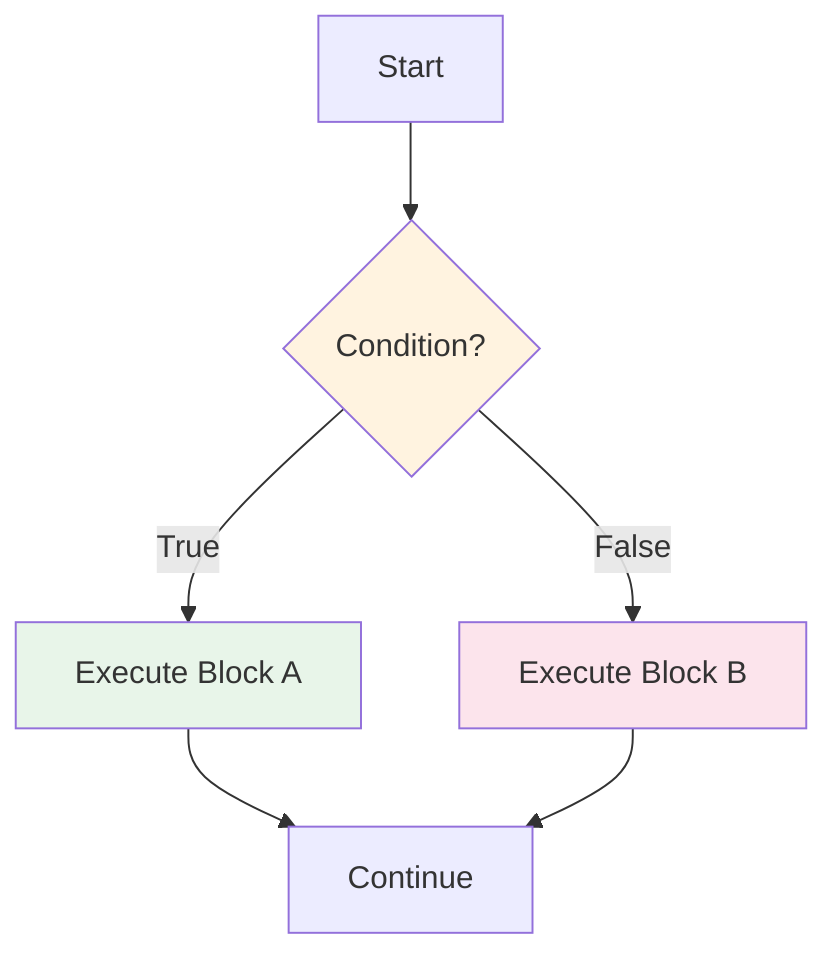
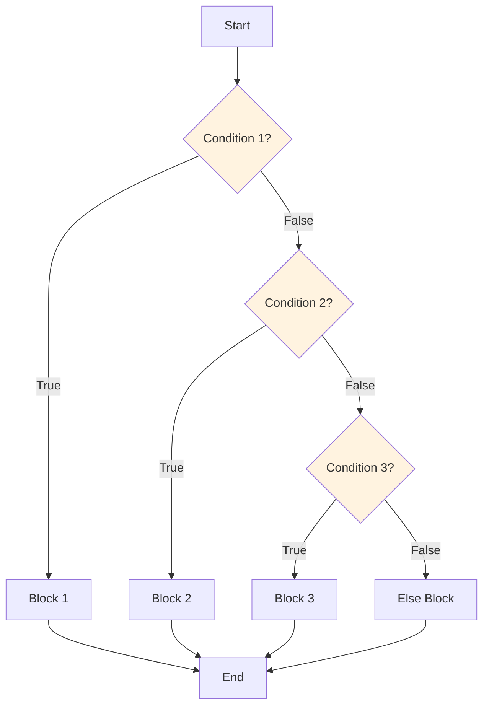

# Control Flow: Conditionals

Control flow determines the order in which statements execute. Conditionals allow your program to make decisions and execute different code based on conditions.

## What is Control Flow?

By default, Python executes statements sequentially, one after another. Conditionals let you change this flow based on conditions.



## The if Statement

The `if` statement executes a block of code only when a condition is True.

### Basic Syntax

```python
if condition:
    # Code executes only if condition is True
    print("Condition is True!")
```

### Simple if Example

```python
# Check if a number is positive
number = 15

if number > 0:
    print(f"{number} is positive")

print("Program continues...")
```

Output:
```
15 is positive
Program continues...
```

```python
# What if the condition is False?
number = -5

if number > 0:
    print(f"{number} is positive")  # This won't execute

print("Program continues...")
```

Output:
```
Program continues...
```

> [!NOTE]
> Python uses indentation (typically 4 spaces) to define code blocks. This is not optional - it's how Python knows which statements belong to the if block.

## The if-else Statement

The `else` clause provides an alternative when the condition is False.

### Syntax

```python
if condition:
    # Executes when condition is True
    pass
else:
    # Executes when condition is False
    pass
```

### if-else Example

```python
# Age verification
age = 16

if age >= 18:
    print("You are an adult.")
    print("You can vote and drive.")
else:
    print("You are a minor.")
    print("You need parental consent.")
```

Output:
```
You are a minor.
You need parental consent.
```

### Real-World Example: Login System

```python
# login_system.py
def check_login(username, password):
    """Simple login verification."""
    
    # Valid credentials (in real apps, these would be in a database)
    valid_username = "admin"
    valid_password = "python123"
    
    if username == valid_username and password == valid_password:
        print("Login successful! Welcome back.")
        return True
    else:
        print("Invalid username or password.")
        return False

# Test the login system
print("=== Login System ===")
check_login("admin", "python123")   # Success
print()
check_login("admin", "wrongpass")   # Failure
print()
check_login("user", "python123")    # Failure
```

Output:
```
=== Login System ===
Login successful! Welcome back.

Invalid username or password.

Invalid username or password.
```

## The if-elif-else Statement

When you have multiple conditions to check, use `elif` (else if).

### Syntax

```python
if condition1:
    # Executes if condition1 is True
    pass
elif condition2:
    # Executes if condition1 is False and condition2 is True
    pass
elif condition3:
    # Executes if condition1 and condition2 are False, and condition3 is True
    pass
else:
    # Executes if all conditions are False
    pass
```

### Flowchart



### Grade Calculator Example

```python
# grade_calculator.py
def get_letter_grade(score):
    """Convert numeric score to letter grade."""
    
    if score >= 90:
        return "A"
    elif score >= 80:
        return "B"
    elif score >= 70:
        return "C"
    elif score >= 60:
        return "D"
    else:
        return "F"

# Test with various scores
scores = [95, 87, 72, 65, 45]

for score in scores:
    grade = get_letter_grade(score)
    print(f"Score: {score:3d} → Grade: {grade}")
```

Output:
```
Score:  95 → Grade: A
Score:  87 → Grade: B
Score:  72 → Grade: C
Score:  65 → Grade: D
Score:  45 → Grade: F
```

> [!WARNING]
> Conditions are checked in order! Once a True condition is found, the rest are skipped. This means:
> ```python
> # WRONG ORDER - always returns "A"
> if score >= 60:
>     return "D"  # 95 >= 60 is True, so this executes!
> elif score >= 90:
>     return "A"  # Never reached
> 
> # CORRECT ORDER - check highest first
> if score >= 90:
>     return "A"
> elif score >= 60:
>     return "D"
> ```

## Nested Conditionals

You can place if statements inside other if statements.

### Nested if Example

```python
# ticket_pricing.py
def calculate_ticket_price(age, is_student, is_weekend):
    """Calculate movie ticket price with discounts."""
    
    base_price = 15.00
    
    if age < 12:
        # Child pricing
        price = base_price * 0.5
        category = "Child"
    elif age >= 65:
        # Senior pricing
        price = base_price * 0.6
        category = "Senior"
    else:
        # Adult pricing
        if is_student:
            price = base_price * 0.8
            category = "Student"
        else:
            price = base_price
            category = "Adult"
    
    # Weekend surcharge
    if is_weekend:
        price += 2.00
    
    return category, price

# Test cases
test_cases = [
    (10, False, False),   # Child, weekday
    (70, False, True),    # Senior, weekend
    (25, True, False),    # Student, weekday
    (30, False, True),    # Adult, weekend
]

print("Movie Ticket Pricing")
print("=" * 45)
for age, student, weekend in test_cases:
    category, price = calculate_ticket_price(age, student, weekend)
    day = "Weekend" if weekend else "Weekday"
    print(f"Age {age:2d}, {category:8s}, {day}: R${price:.2f}")
```

Output:
```
Movie Ticket Pricing
=============================================
Age 10, Child   , Weekday: R$7.50
Age 70, Senior  , Weekend: R$11.00
Age 25, Student , Weekday: R$12.00
Age 30, Adult   , Weekend: R$17.00
```

## Ternary Operator (Conditional Expression)

Python has a concise way to write simple if-else statements in one line.

### Syntax

```python
value = true_value if condition else false_value
```

### Ternary Examples

```python
# Basic usage
age = 20
status = "adult" if age >= 18 else "minor"
print(f"Status: {status}")  # adult

# With numbers
x = 10
y = 20
maximum = x if x > y else y
print(f"Maximum: {maximum}")  # 20

# Absolute value
number = -15
abs_value = number if number >= 0 else -number
print(f"Absolute value: {abs_value}")  # 15

# Even or odd
num = 7
result = "even" if num % 2 == 0 else "odd"
print(f"{num} is {result}")  # 7 is odd
```

### Practical Example: Discount Calculator

```python
# discount_calculator.py
def apply_discount(price, is_member, purchase_amount):
    """Apply discount based on membership and purchase amount."""
    
    # Member discount
    member_discount = 0.15 if is_member else 0.05
    
    # Bulk purchase bonus
    bulk_bonus = 0.10 if purchase_amount > 100 else 0.0
    
    # Total discount (capped at 20%)
    total_discount = min(member_discount + bulk_bonus, 0.20)
    
    final_price = price * (1 - total_discount)
    
    return final_price, total_discount * 100

# Test cases
print("Discount Calculator")
print("=" * 50)
print(f"{'Price':>8} {'Member':>8} {'Amount':>8} {'Discount':>10} {'Final':>8}")
print("-" * 50)

tests = [
    (50.00, True, 50),
    (120.00, True, 120),
    (80.00, False, 80),
    (200.00, False, 200),
]

for price, member, amount in tests:
    final, disc_pct = apply_discount(price, member, amount)
    member_str = "Yes" if member else "No"
    print(f"R${price:7.2f} {member_str:>8} R${amount:7.2f} {disc_pct:9.1f}% R${final:7.2f}")
```

Output:
```
Discount Calculator
==================================================
   Price   Member   Amount   Discount    Final
--------------------------------------------------
R$  50.00      Yes  R$  50.00      15.0% R$  42.50
R$ 120.00      Yes  R$ 120.00      20.0% R$  96.00
R$  80.00       No  R$  80.00       5.0% R$  76.00
R$ 200.00       No  R$ 200.00      15.0% R$ 170.00
```

## Multiple Conditions with Logical Operators

Combine conditions using `and`, `or`, and `not`.

### Combining Conditions

```python
# Weather activity recommender
def recommend_activity(temperature, is_raining, is_weekend):
    """Recommend an activity based on weather conditions."""
    
    if not is_raining and temperature >= 25:
        return "Go to the beach!"
    elif not is_raining and 15 <= temperature < 25:
        return "Go for a walk in the park."
    elif is_raining and is_weekend:
        return "Watch a movie at home."
    elif is_raining and not is_weekend:
        return "Take an umbrella to work."
    elif temperature < 15:
        return "Stay indoors with hot chocolate."
    else:
        return "Check local events."

# Test scenarios
scenarios = [
    (30, False, True),   # Hot, sunny, weekend
    (20, False, False),  # Mild, sunny, weekday
    (18, True, True),    # Mild, rainy, weekend
    (10, True, False),   # Cold, rainy, weekday
    (5, False, True),    # Cold, sunny, weekend
]

print("Activity Recommender")
print("=" * 60)
for temp, rain, weekend in scenarios:
    weather = "Rainy" if rain else "Sunny"
    day = "Weekend" if weekend else "Weekday"
    activity = recommend_activity(temp, rain, weekend)
    print(f"{temp:2d}°C, {weather:6s}, {day:7s} → {activity}")
```

Output:
```
Activity Recommender
============================================================
30°C, Sunny , Weekend → Go to the beach!
20°C, Sunny , Weekday → Go for a walk in the park.
18°C, Rainy, Weekend → Watch a movie at home.
10°C, Rainy, Weekday → Take an umbrella to work.
 5°C, Sunny , Weekend → Stay indoors with hot chocolate.
```

## Truthy and Falsy Values in Conditions

Python allows any value in a condition, not just booleans.

### Truthy and Falsy Values

```python
# Falsy values (evaluate to False)
falsy_values = [
    False,
    None,
    0,
    0.0,
    "",           # Empty string
    [],           # Empty list
    {},           # Empty dict
    set(),        # Empty set
]

print("Falsy values:")
for val in falsy_values:
    print(f"  bool({repr(val):10s}) = {bool(val)}")

# Truthy values (evaluate to True)
print("\nTruthy values:")
print(f"  bool(1) = {bool(1)}")
print(f"  bool('hello') = {bool('hello')}")
print(f"  bool([1, 2, 3]) = {bool([1, 2, 3])}")
```

Output:
```
Falsy values:
  bool(False    ) = False
  bool(None     ) = False
  bool(0        ) = False
  bool(0.0      ) = False
  bool(''       ) = False
  bool([]       ) = False
  bool({}       ) = False
  bool(set()    ) = False

Truthy values:
  bool(1) = True
  bool('hello') = True
  bool([1, 2, 3]) = True
```

### Idiomatic Python: Checking for Empty Values

```python
# Instead of this:
if len(my_list) > 0:
    print("List has items")

# Write this (more Pythonic):
if my_list:
    print("List has items")

# Instead of this:
if my_string != "":
    print("String is not empty")

# Write this:
if my_string:
    print("String is not empty")
```

## Real-World Example: ATM Withdrawal System

```python
# atm_system.py
def atm_withdrawal(balance, amount, pin, daily_limit):
    """Simulate an ATM withdrawal with multiple checks."""
    
    # Check 1: PIN validation
    if pin != 1234:
        return "ERROR: Invalid PIN"
    
    # Check 2: Amount must be positive
    if amount <= 0:
        return "ERROR: Amount must be positive"
    
    # Check 3: Amount must be multiple of 10
    if amount % 10 != 0:
        return "ERROR: Amount must be a multiple of 10"
    
    # Check 4: Sufficient balance
    if amount > balance:
        return f"ERROR: Insufficient funds. Balance: R${balance:.2f}"
    
    # Check 5: Daily limit
    if amount > daily_limit:
        return f"ERROR: Exceeds daily limit of R${daily_limit:.2f}"
    
    # All checks passed - process withdrawal
    new_balance = balance - amount
    return f"SUCCESS: Withdrawn R${amount:.2f}. New balance: R${new_balance:.2f}"

# Test the ATM system
print("=== ATM Withdrawal System ===\n")

test_cases = [
    (500.00, 100, 1234, 300),   # Valid withdrawal
    (500.00, 100, 5678, 300),   # Wrong PIN
    (500.00, -50, 1234, 300),   # Negative amount
    (500.00, 55, 1234, 300),    # Not multiple of 10
    (500.00, 600, 1234, 300),   # Insufficient funds
    (500.00, 400, 1234, 300),   # Exceeds daily limit
]

for balance, amount, pin, limit in test_cases:
    result = atm_withdrawal(balance, amount, pin, limit)
    print(f"Balance: R${balance:7.2f}, Withdraw: R${amount:4d}, PIN: {pin}")
    print(f"  → {result}\n")
```

Output:
```
=== ATM Withdrawal System ===

Balance: R$ 500.00, Withdraw: R$ 100, PIN: 1234
  → SUCCESS: Withdrawn R$100.00. New balance: R$400.00

Balance: R$ 500.00, Withdraw: R$ 100, PIN: 5678
  → ERROR: Invalid PIN

Balance: R$ 500.00, Withdraw: R$ -50, PIN: 1234
  → ERROR: Amount must be positive

Balance: R$ 500.00, Withdraw: R$  55, PIN: 1234
  → ERROR: Amount must be a multiple of 10

Balance: R$ 500.00, Withdraw: R$ 600, PIN: 1234
  → ERROR: Insufficient funds. Balance: R$500.00

Balance: R$ 500.00, Withdraw: R$ 400, PIN: 1234
  → ERROR: Exceeds daily limit of R$300.00
```

## Practice Exercises

### Exercise 1: Positive, Negative, or Zero
Write a program that checks if a number is positive, negative, or zero.

### Exercise 2: Number Comparator
Write a program that takes two numbers and prints which one is larger, or if they are equal.

### Exercise 3: Leap Year Checker
Write a program that determines if a year is a leap year using nested conditionals.

### Exercise 4: Grade Classifier
Create a program that takes a score (0-100) and returns:
- "Excellent" for 90-100
- "Good" for 75-89
- "Average" for 60-74
- "Needs Improvement" for below 60

### Exercise 5: Simple Calculator
Write a calculator that takes two numbers and an operation (+, -, *, /) and performs the calculation. Handle division by zero.

### Exercise 6: Ternary Practice
Rewrite these if-else statements as ternary expressions:
```python
if x > 100:
    result = "high"
else:
    result = "low"
```

### Exercise 7: Password Strength Checker
Write a function that checks password strength:
- "Weak" if length < 6
- "Medium" if length 6-11
- "Strong" if length >= 12 and contains uppercase
- "Very Strong" if length >= 12, contains uppercase, and contains a digit

### Exercise 8: Rock Paper Scissors
Write a program that determines the winner of a Rock-Paper-Scissors round given two choices.

## Summary

In this lesson, you learned:
- How to use `if` statements for basic decision-making
- How `if-else` provides two execution paths
- How `if-elif-else` handles multiple conditions
- How to nest conditionals for complex logic
- How to use the ternary operator for concise expressions
- How to combine conditions with logical operators
- How truthy and falsy values work in Python
- How to build real-world decision-making systems

Conditionals are essential for creating programs that respond to different situations. Practice writing conditionals to build your decision-making skills.
