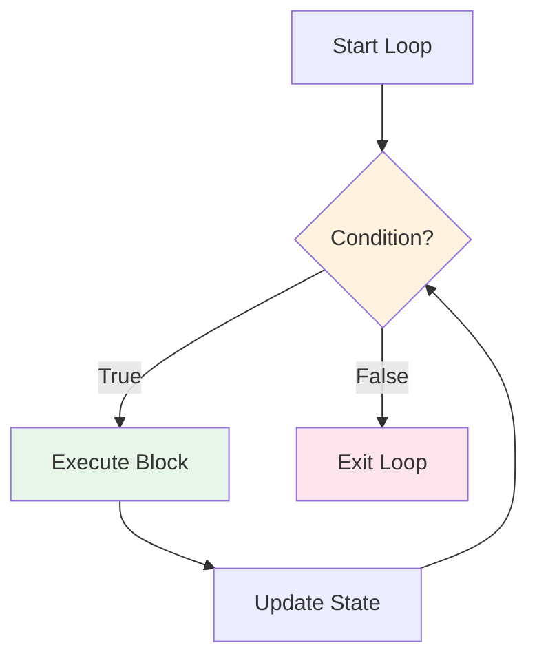
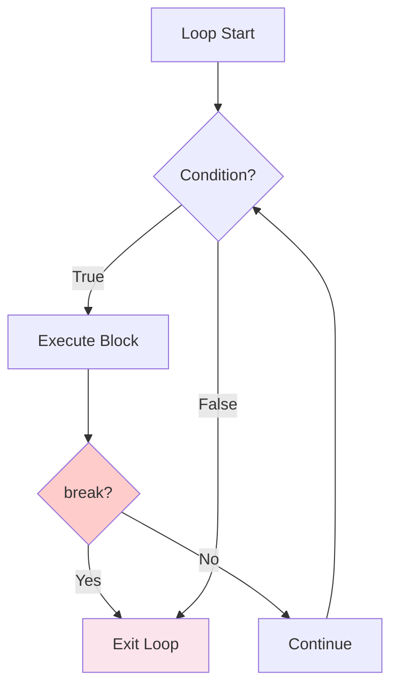
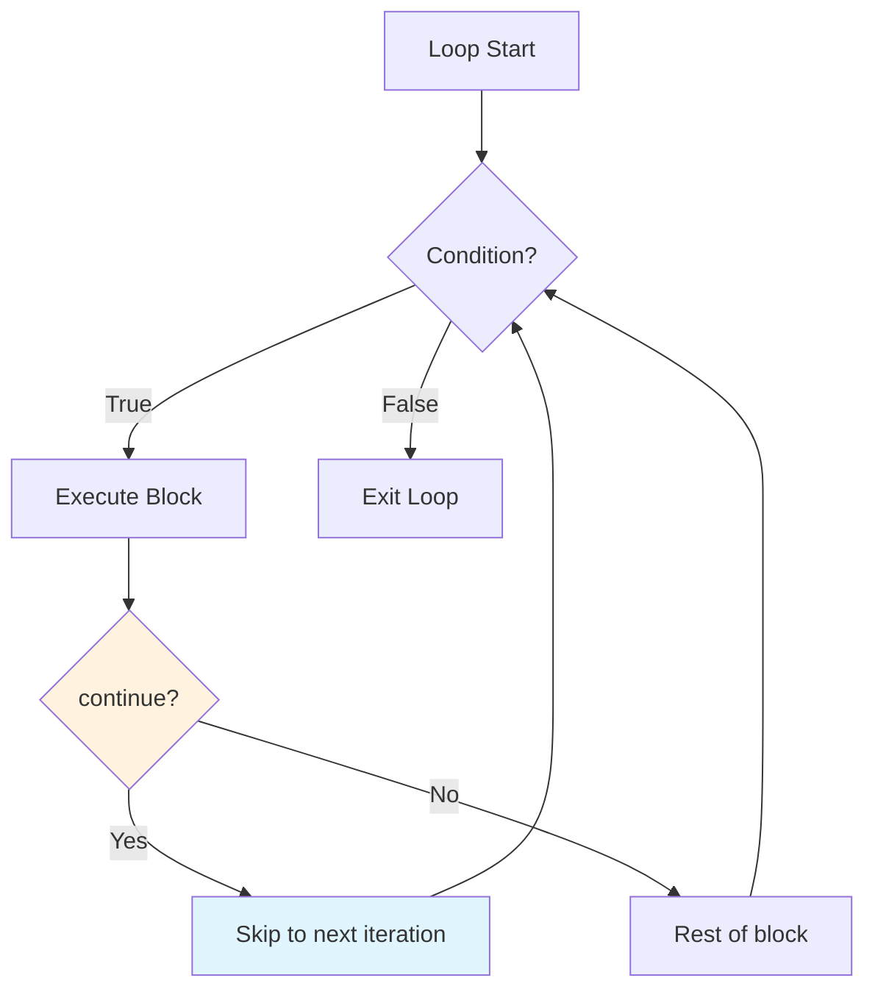
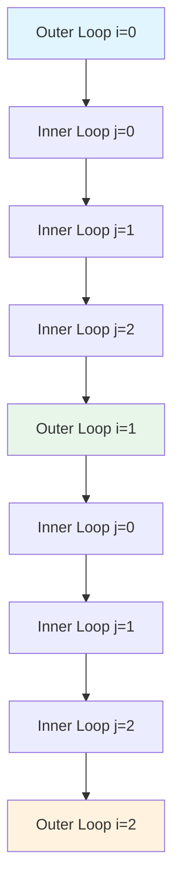

# Control Flow: Loops

Loops allow you to execute a block of code multiple times. They are essential for processing collections, repeating tasks, and implementing algorithms.

## What Are Loops?

A loop repeats a block of code until a condition is met. Python provides two main loop types: `while` and `for`.



## The while Loop

The `while` loop repeats as long as a condition remains True.

### Basic Syntax

```python
while condition:
    # Code executes repeatedly while condition is True
    pass
```

### Simple while Example

```python
# Countdown from 5
count = 5

while count > 0:
    print(f"Count: {count}")
    count -= 1  # IMPORTANT: Update the counter!

print("Liftoff! 🚀")
```

Output:
```
Count: 5
Count: 4
Count: 3
Count: 2
Count: 1
Liftoff! 🚀
```

> [!WARNING]
> Always ensure the loop condition eventually becomes False! Forgetting to update the loop variable creates an infinite loop:
> ```python
> # INFINITE LOOP - don't do this!
> count = 5
> while count > 0:
>     print(count)
>     # Forgot: count -= 1
> ```

### while Loop with User Input

```python
# number_guessing.py
import random

def guess_the_number():
    """Simple number guessing game using while loop."""
    
    secret = random.randint(1, 20)
    attempts = 0
    max_attempts = 5
    
    print("=== Number Guessing Game ===")
    print("I'm thinking of a number between 1 and 20.")
    print(f"You have {max_attempts} attempts.\n")
    
    while attempts < max_attempts:
        guess = int(input(f"Attempt {attempts + 1}/{max_attempts}: "))
        attempts += 1
        
        if guess == secret:
            print(f"🎉 Correct! You got it in {attempts} attempts!")
            return
        elif guess < secret:
            print("Too low! Try higher.")
        else:
            print("Too high! Try lower.")
    
    print(f"\n😔 Game over! The number was {secret}.")

# Run the game
guess_the_number()
```

Sample output:
```
=== Number Guessing Game ===
I'm thinking of a number between 1 and 20.
You have 5 attempts.

Attempt 1/5: 10
Too high! Try lower.
Attempt 2/5: 5
Too low! Try higher.
Attempt 3/5: 7
🎉 Correct! You got it in 3 attempts!
```

## The for Loop

The `for` loop iterates over a sequence (list, string, range, etc.).

### Basic Syntax

```python
for item in sequence:
    # Code executes once for each item in the sequence
    pass
```

### Iterating Over Different Sequences

```python
# Iterating over a list
fruits = ["apple", "banana", "cherry"]
print("Fruits:")
for fruit in fruits:
    print(f"  - {fruit}")

# Iterating over a string
print("\nLetters in 'Python':")
for letter in "Python":
    print(f"  {letter}")

# Iterating over a tuple
coordinates = (10, 20, 30)
print("\nCoordinates:")
for coord in coordinates:
    print(f"  {coord}")
```

Output:
```
Fruits:
  - apple
  - banana
  - cherry

Letters in 'Python':
  P
  y
  t
  h
  o
  n

Coordinates:
  10
  20
  30
```

## The range() Function

`range()` generates a sequence of numbers, commonly used with `for` loops.

### range() Variants

```mermaid
flowchart LR
    A[range(stop)] --> B["range(5) → 0,1,2,3,4"]
    C[range(start, stop)] --> D["range(2, 6) → 2,3,4,5"]
    E[range(start, stop, step)] --> F["range(0, 10, 2) → 0,2,4,6,8"]
    
    style B fill:#e1f5fe
    style D fill:#e8f5e9
    style F fill:#fff3e0
```

### range() Examples

```python
# range(stop) - starts at 0, stops before stop
print("range(5):")
for i in range(5):
    print(i, end=" ")
# Output: 0 1 2 3 4

print("\n\nrange(2, 6):")
for i in range(2, 6):
    print(i, end=" ")
# Output: 2 3 4 5

print("\n\nrange(0, 10, 2):")
for i in range(0, 10, 2):
    print(i, end=" ")
# Output: 0 2 4 6 8

print("\n\nrange(5, 0, -1):")
for i in range(5, 0, -1):
    print(i, end=" ")
# Output: 5 4 3 2 1
```

### Practical range() Uses

```python
# Sum of first n numbers
def sum_first_n(n):
    total = 0
    for i in range(1, n + 1):
        total += i
    return total

print(f"Sum of 1 to 100: {sum_first_n(100)}")  # 5050

# Multiplication table
def print_multiplication_table(number, up_to=10):
    print(f"\nMultiplication Table for {number}:")
    for i in range(1, up_to + 1):
        print(f"  {number} × {i:2d} = {number * i:3d}")

print_multiplication_table(7)
```

Output:
```
Sum of 1 to 100: 5050

Multiplication Table for 7:
  7 ×  1 =   7
  7 ×  2 =  14
  7 ×  3 =  21
  7 ×  4 =  28
  7 ×  5 =  35
  7 ×  6 =  42
  7 ×  7 =  49
  7 ×  8 =  56
  7 ×  9 =  63
  7 × 10 =  70
```

## Loop Control: break and continue

Control statements modify loop behavior.

### break - Exit the Loop Immediately



```python
# break example: find first even number
numbers = [1, 3, 5, 8, 9, 10, 11]

for num in numbers:
    if num % 2 == 0:
        print(f"First even number found: {num}")
        break
    print(f"  Checking {num}... (odd)")
```

Output:
```
  Checking 1... (odd)
  Checking 3... (odd)
  Checking 5... (odd)
First even number found: 8
```

### continue - Skip to Next Iteration



```python
# continue example: skip odd numbers
for num in range(1, 11):
    if num % 2 != 0:
        continue  # Skip odd numbers
    print(num, end=" ")
# Output: 2 4 6 8 10
```

### break and continue Comparison

```python
# Demonstration of break vs continue
print("Using break (stops at 5):")
for i in range(1, 11):
    if i == 5:
        break
    print(i, end=" ")
# Output: 1 2 3 4

print("\n\nUsing continue (skips 5):")
for i in range(1, 11):
    if i == 5:
        continue
    print(i, end=" ")
# Output: 1 2 3 4 6 7 8 9 10
```

## Nested Loops

Loops inside loops are called nested loops. The inner loop completes all its iterations for each iteration of the outer loop.

### Nested Loop Flow



### Nested Loop Examples

```python
# Multiplication table grid
print("Multiplication Table (1-5):")
print("    ", end="")
for j in range(1, 6):
    print(f"{j:4d}", end="")
print("\n" + "-" * 25)

for i in range(1, 6):
    print(f"{i:2d} |", end="")
    for j in range(1, 6):
        print(f"{i * j:4d}", end="")
    print()
```

Output:
```
Multiplication Table (1-5):
       1   2   3   4   5
-------------------------
 1 |   1   2   3   4   5
 2 |   2   4   6   8  10
 3 |   3   6   9  12  15
 4 |   4   8  12  16  20
 5 |   5  10  15  20  25
```

### Pattern Printing with Nested Loops

```python
# Print a pyramid pattern
def print_pyramid(height):
    """Print a pyramid of stars."""
    for i in range(1, height + 1):
        # Print spaces
        spaces = " " * (height - i)
        # Print stars
        stars = "*" * (2 * i - 1)
        print(spaces + stars)

print("Pyramid of height 5:")
print_pyramid(5)
```

Output:
```
Pyramid of height 5:
    *
   ***
  *****
 *******
*********
```

## The else Clause with Loops

Python allows an `else` clause with loops. It executes when the loop completes normally (not via `break`).

### Loop else Syntax

```python
for item in sequence:
    if condition:
        break
else:
    # Executes if loop completed without break
    pass
```

### Loop else Example

```python
# Search with else clause
def search_number(numbers, target):
    """Search for a number and report if found."""
    for num in numbers:
        if num == target:
            print(f"Found {target}!")
            break
    else:
        print(f"{target} not found in the list.")

search_number([1, 3, 5, 7, 9], 5)   # Found
search_number([1, 3, 5, 7, 9], 10)  # Not found
```

Output:
```
Found 5!
10 not found in the list.
```

## Enumerate and zip

Python provides useful functions for working with loops.

### enumerate() - Get Index and Value

```python
fruits = ["apple", "banana", "cherry"]

# Without enumerate
print("Without enumerate:")
for i in range(len(fruits)):
    print(f"  {i}: {fruits[i]}")

# With enumerate (cleaner!)
print("\nWith enumerate:")
for index, fruit in enumerate(fruits):
    print(f"  {index}: {fruit}")

# Starting index at 1
print("\nStarting at 1:")
for index, fruit in enumerate(fruits, start=1):
    print(f"  {index}. {fruit}")
```

### zip() - Iterate Over Multiple Sequences

```python
names = ["Alice", "Bob", "Charlie"]
ages = [25, 30, 35]
cities = ["NYC", "London", "Tokyo"]

print("Using zip:")
for name, age, city in zip(names, ages, cities):
    print(f"  {name} is {age} years old and lives in {city}")
```

Output:
```
Using zip:
  Alice is 25 years old and lives in NYC
  Bob is 30 years old and lives in London
  Charlie is 35 years old and lives in Tokyo
```

## Real-World Example: Data Analysis with Loops

```python
# data_analysis.py
def analyze_grades(student_data):
    """Analyze student grades using loops."""
    
    print("=" * 55)
    print("         STUDENT GRADE ANALYSIS")
    print("=" * 55)
    
    total_students = 0
    total_grade = 0
    highest_grade = 0
    highest_student = ""
    lowest_grade = 100
    lowest_student = ""
    passed = 0
    failed = 0
    
    for name, grade in student_data:
        total_students += 1
        total_grade += grade
        
        # Track highest and lowest
        if grade > highest_grade:
            highest_grade = grade
            highest_student = name
        
        if grade < lowest_grade:
            lowest_grade = grade
            lowest_student = name
        
        # Count pass/fail
        if grade >= 60:
            passed += 1
        else:
            failed += 1
        
        # Print individual result
        status = "PASS" if grade >= 60 else "FAIL"
        print(f"  {name:15s} {grade:6.1f}  {status}")
    
    # Summary
    print("-" * 55)
    average = total_grade / total_students
    print(f"  Total Students: {total_students}")
    print(f"  Average Grade:  {average:.1f}")
    print(f"  Highest:        {highest_student} ({highest_grade:.1f})")
    print(f"  Lowest:         {lowest_student} ({lowest_grade:.1f})")
    print(f"  Passed:         {passed}")
    print(f"  Failed:         {failed}")
    print(f"  Pass Rate:      {passed/total_students*100:.1f}%")
    print("=" * 55)

# Sample data
students = [
    ("Alice", 92.5),
    ("Bob", 78.0),
    ("Charlie", 45.0),
    ("Diana", 88.5),
    ("Eve", 95.0),
    ("Frank", 62.0),
    ("Grace", 71.5),
    ("Henry", 55.0),
]

analyze_grades(students)
```

Output:
```
=======================================================
         STUDENT GRADE ANALYSIS
=======================================================
  Alice            92.5  PASS
  Bob              78.0  PASS
  Charlie          45.0  FAIL
  Diana            88.5  PASS
  Eve              95.0  PASS
  Frank            62.0  PASS
  Grace            71.5  PASS
  Henry            55.0  FAIL
-------------------------------------------------------
  Total Students: 8
  Average Grade:  73.4
  Highest:        Eve (95.0)
  Lowest:         Charlie (45.0)
  Passed:         6
  Failed:         2
  Pass Rate:      75.0%
=======================================================
```

## Practice Exercises

### Exercise 1: Sum of Even Numbers
Write a loop that calculates the sum of all even numbers from 1 to 100.

### Exercise 2: Factorial Calculator
Write a program that calculates the factorial of a number using a for loop. (5! = 5 × 4 × 3 × 2 × 1 = 120)

### Exercise 3: FizzBuzz
Write a program that prints numbers 1 to 100, but:
- For multiples of 3, print "Fizz"
- For multiples of 5, print "Buzz"
- For multiples of both, print "FizzBuzz"

### Exercise 4: Prime Number Checker
Write a program that checks if a number is prime using a loop.

### Exercise 5: Reverse a String
Write a loop that reverses a string without using built-in reverse functions.

### Exercise 6: Pattern Printing
Use nested loops to print this pattern:
```
1
12
123
1234
12345
```

### Exercise 7: Number Guessing Game
Create a complete number guessing game where the computer picks a random number and the user has to guess it. Provide hints (too high/too low) and count attempts.

### Exercise 8: Password Validator
Write a program that asks for a password and uses a loop to check:
- At least 8 characters
- Contains at least one uppercase letter
- Contains at least one digit
Keep asking until a valid password is entered.

## Summary

In this lesson, you learned:
- How to use `while` loops for condition-based repetition
- How to use `for` loops for sequence iteration
- How `range()` generates number sequences
- How `break` exits a loop immediately
- How `continue` skips to the next iteration
- How nested loops work and when to use them
- How the `else` clause works with loops
- How `enumerate()` and `zip()` enhance iteration
- How to apply loops to real-world data processing

Loops are fundamental to programming. Master them to efficiently process data and implement algorithms.
