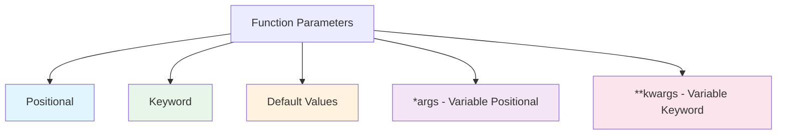
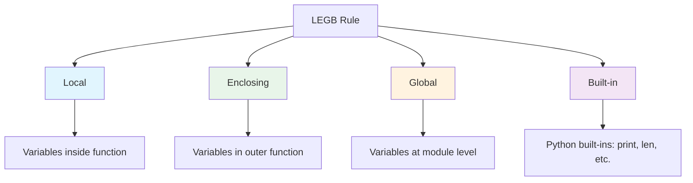

# Functions

Functions are reusable blocks of code that perform specific tasks. They help organize code, avoid repetition, and make programs easier to understand and maintain.

## What is a Function?

A function is a named block of code that can be called (invoked) to perform a task. Think of it as a recipe: you define it once, then use it whenever needed.

```mermaid
flowchart LR
    A[Function Definition] --> B[def greet(name):]
    B --> C[    return f'Hello, {name}!']
    
    D[Function Call] --> E[greet('Alice')]
    E --> F[Result: 'Hello, Alice!']
    
    style A fill:#e1f5fe
    style D fill:#e8f5e9
```

## Defining Functions

### Basic Syntax

```python
def function_name(parameters):
    """Docstring: describes what the function does."""
    # Function body
    result = ...
    return result
```

### Simple Function Example

```python
def greet(name):
    """Return a greeting message for the given name."""
    return f"Hello, {name}! Welcome to Python."

# Calling the function
message = greet("Alice")
print(message)  # Hello, Alice! Welcome to Python.

message = greet("Bob")
print(message)  # Hello, Bob! Welcome to Python.
```

### Functions Without Return Value

```python
def print_separator(char="-", length=30):
    """Print a separator line."""
    print(char * length)

print_separator()           # ------------------------------
print_separator("=", 20)    # ====================
print_separator("*", 10)    # **********
```

> [!NOTE]
> Functions without a `return` statement implicitly return `None`. This is Python's way of representing "nothing."

## Parameters and Arguments

Parameters are variables listed in the function definition. Arguments are the actual values passed when calling the function.

### Types of Parameters



### Positional Parameters

```python
def calculate_area(length, width):
    """Calculate the area of a rectangle."""
    return length * width

# Arguments matched by position
area = calculate_area(10, 5)
print(f"Area: {area}")  # 50

# Order matters!
print(f"10×5 = {calculate_area(10, 5)}")  # 50
print(f"5×10 = {calculate_area(5, 10)}")  # 50 (same result, but different meaning)
```

### Default Parameters

```python
def create_profile(name, age, country="Brazil", language="Python"):
    """Create a user profile with default values."""
    return {
        "name": name,
        "age": age,
        "country": country,
        "language": language
    }

# Using defaults
profile1 = create_profile("Alice", 25)
print(profile1)
# {'name': 'Alice', 'age': 25, 'country': 'Brazil', 'language': 'Python'}

# Overriding defaults
profile2 = create_profile("Bob", 30, "USA", "JavaScript")
print(profile2)
# {'name': 'Bob', 'age': 30, 'country': 'USA', 'language': 'JavaScript'}
```

> [!WARNING]
> Default parameter values are evaluated only once, when the function is defined. Never use mutable defaults (like lists or dicts):
> ```python
> # BAD - shared list across calls!
> def add_item(item, items=[]):
>     items.append(item)
>     return items
> 
> # GOOD - create new list each time
> def add_item(item, items=None):
>     if items is None:
>         items = []
>     items.append(item)
>     return items
> ```

### Keyword Arguments

```python
def create_email(to, subject, body, priority="normal"):
    """Create an email message."""
    return f"To: {to}\nSubject: {subject}\nPriority: {priority}\n\n{body}"

# Using keyword arguments (order doesn't matter)
email = create_email(
    body="Please review the attached document.",
    to="manager@company.com",
    priority="high",
    subject="Document Review"
)
print(email)
```

Output:
```
To: manager@company.com
Subject: Document Review
Priority: high

Please review the attached document.
```

### *args - Variable Positional Arguments

```python
def calculate_sum(*args):
    """Sum any number of arguments."""
    total = 0
    for num in args:
        total += num
    return total

print(f"Sum of 1, 2, 3: {calculate_sum(1, 2, 3)}")         # 6
print(f"Sum of 10, 20, 30, 40: {calculate_sum(10, 20, 30, 40)}")  # 100
print(f"Sum of nothing: {calculate_sum()}")                  # 0
```

### **kwargs - Variable Keyword Arguments

```python
def create_student_record(name, **kwargs):
    """Create a student record with optional fields."""
    record = {"name": name}
    record.update(kwargs)
    return record

student = create_student_record(
    "Maria",
    age=22,
    major="Computer Science",
    gpa=3.8,
    enrolled=True
)
print(student)
# {'name': 'Maria', 'age': 22, 'major': 'Computer Science', 'gpa': 3.8, 'enrolled': True}
```

## Return Values

Functions can return values using the `return` statement.

### Single Return Value

```python
def square(number):
    """Return the square of a number."""
    return number ** 2

result = square(5)
print(f"5² = {result}")  # 25
```

### Multiple Return Values

```python
def divide_with_remain(dividend, divisor):
    """Return quotient and remainder."""
    quotient = dividend // divisor
    remainder = dividend % divisor
    return quotient, remainder  # Returns a tuple

q, r = divide_with_remain(17, 5)
print(f"17 ÷ 5 = {q} remainder {r}")  # 17 ÷ 5 = 3 remainder 2
```

### Early Return

```python
def classify_age(age):
    """Classify a person's age group."""
    if age < 0:
        return "Invalid age"
    if age < 13:
        return "Child"
    if age < 18:
        return "Teenager"
    if age < 65:
        return "Adult"
    return "Senior"

ages = [-5, 8, 15, 30, 70]
for age in ages:
    print(f"Age {age:3d}: {classify_age(age)}")
```

Output:
```
Age  -5: Invalid age
Age   8: Child
Age  15: Teenager
Age  30: Adult
Age  70: Senior
```

## Variable Scope

Scope determines where a variable can be accessed.

### Scope Levels



### Scope Examples

```python
# Global variable
global_var = "I'm global"

def demonstrate_scope():
    # Local variable
    local_var = "I'm local"
    
    # Can read global variable
    print(f"Inside function - global: {global_var}")
    print(f"Inside function - local: {local_var}")

demonstrate_scope()
print(f"Outside function - global: {global_var}")
# print(local_var)  # ERROR: NameError - local_var not defined here
```

### Modifying Global Variables

```python
counter = 0

def increment():
    global counter  # Declare we're using the global variable
    counter += 1

increment()
increment()
increment()
print(f"Counter: {counter}")  # 3
```

> [!TIP]
> Avoid using `global` when possible. Instead, pass values as parameters and return results:
> ```python
> # Better approach
> def increment_counter(counter):
>     return counter + 1
> 
> counter = 0
> counter = increment_counter(counter)
> ```

## Docstrings

Docstrings are string literals that appear as the first statement in a function. They document what the function does.

### Docstring Formats

```python
def calculate_bmi(weight_kg, height_m):
    """
    Calculate Body Mass Index (BMI).
    
    Args:
        weight_kg: Weight in kilograms (float)
        height_m: Height in meters (float)
    
    Returns:
        float: BMI value
    
    Raises:
        ValueError: If weight or height is not positive
    
    Example:
        >>> calculate_bmi(70, 1.75)
        22.86
    """
    if weight_kg <= 0 or height_m <= 0:
        raise ValueError("Weight and height must be positive")
    
    return weight_kg / (height_m ** 2)

# Access docstring
print(calculate_bmi.__doc__)
# Or use help()
# help(calculate_bmi)
```

### Using help()

```python
def fibonacci(n):
    """
    Calculate the nth Fibonacci number.
    
    The Fibonacci sequence: 0, 1, 1, 2, 3, 5, 8, 13, ...
    Each number is the sum of the two preceding ones.
    
    Args:
        n: Position in the sequence (non-negative integer)
    
    Returns:
        int: The nth Fibonacci number
    """
    if n < 0:
        raise ValueError("n must be non-negative")
    if n <= 1:
        return n
    
    a, b = 0, 1
    for _ in range(2, n + 1):
        a, b = b, a + b
    return b

# Display documentation
help(fibonacci)
```

## Lambda Functions

Lambda functions are small anonymous functions defined with the `lambda` keyword.

### Lambda Syntax

```python
# Regular function
def square(x):
    return x ** 2

# Equivalent lambda
square_lambda = lambda x: x ** 2

print(f"square(5) = {square(5)}")              # 25
print(f"square_lambda(5) = {square_lambda(5)}") # 25
```

### Lambda Use Cases

```python
# Sorting with lambda
students = [
    ("Alice", 85),
    ("Bob", 92),
    ("Charlie", 78),
]

# Sort by grade (second element)
by_grade = sorted(students, key=lambda s: s[1])
print("Sorted by grade:", by_grade)

# Sort by name (first element)
by_name = sorted(students, key=lambda s: s[0])
print("Sorted by name:", by_name)

# Using with map()
numbers = [1, 2, 3, 4, 5]
squared = list(map(lambda x: x ** 2, numbers))
print(f"Squared: {squared}")  # [1, 4, 9, 16, 25]

# Using with filter()
evens = list(filter(lambda x: x % 2 == 0, numbers))
print(f"Evens: {evens}")  # [2, 4]
```

## Real-World Example: Temperature Converter System

```python
# temperature_converter.py
"""
Temperature Converter System
Supports Celsius, Fahrenheit, and Kelvin conversions.
"""

def celsius_to_fahrenheit(c):
    """Convert Celsius to Fahrenheit."""
    return c * 9/5 + 32

def celsius_to_kelvin(c):
    """Convert Celsius to Kelvin."""
    return c + 273.15

def fahrenheit_to_celsius(f):
    """Convert Fahrenheit to Celsius."""
    return (f - 32) * 5/9

def fahrenheit_to_kelvin(f):
    """Convert Fahrenheit to Kelvin."""
    return (f - 32) * 5/9 + 273.15

def kelvin_to_celsius(k):
    """Convert Kelvin to Celsius."""
    return k - 273.15

def kelvin_to_fahrenheit(k):
    """Convert Kelvin to Fahrenheit."""
    return (k - 273.15) * 9/5 + 32

# Conversion map
CONVERSIONS = {
    ("C", "F"): celsius_to_fahrenheit,
    ("C", "K"): celsius_to_kelvin,
    ("F", "C"): fahrenheit_to_celsius,
    ("F", "K"): fahrenheit_to_kelvin,
    ("K", "C"): kelvin_to_celsius,
    ("K", "F"): kelvin_to_fahrenheit,
}

def convert_temperature(value, from_unit, to_unit):
    """
    Convert temperature between units.
    
    Args:
        value: Temperature value (float)
        from_unit: Source unit ('C', 'F', or 'K')
        to_unit: Target unit ('C', 'F', or 'K')
    
    Returns:
        float: Converted temperature
    """
    from_unit = from_unit.upper()
    to_unit = to_unit.upper()
    
    if from_unit == to_unit:
        return value
    
    key = (from_unit, to_unit)
    if key not in CONVERSIONS:
        raise ValueError(f"Invalid conversion: {from_unit} to {to_unit}")
    
    return CONVERSIONS[key](value)

def display_conversion_table():
    """Display a temperature conversion table."""
    print("=" * 55)
    print("     TEMPERATURE CONVERSION TABLE")
    print("=" * 55)
    print(f"{'Celsius':>10} {'Fahrenheit':>12} {'Kelvin':>10}")
    print("-" * 55)
    
    for c in range(-20, 51, 5):
        f = celsius_to_fahrenheit(c)
        k = celsius_to_kelvin(c)
        print(f"{c:10.1f} {f:12.1f} {k:10.1f}")
    
    print("=" * 55)

# Run the converter
display_conversion_table()

# Interactive conversion
print("\nQuick Conversions:")
test_values = [
    (0, "C", "F"),
    (100, "C", "F"),
    (98.6, "F", "C"),
    (37, "C", "K"),
    (0, "K", "C"),
]

for value, frm, to in test_values:
    result = convert_temperature(value, frm, to)
    print(f"  {value}°{frm} = {result:.2f}°{to}")
```

Output:
```
=======================================================
     TEMPERATURE CONVERSION TABLE
=======================================================
   Celsius   Fahrenheit     Kelvin
-------------------------------------------------------
     -20.0        -4.0      253.2
     -15.0          5.0      258.2
     -10.0         14.0      263.2
      -5.0         23.0      268.2
       0.0         32.0      273.2
       5.0         41.0      278.2
      10.0         50.0      283.2
      15.0         59.0      288.2
      20.0         68.0      293.2
      25.0         77.0      298.2
      30.0         86.0      303.2
      35.0         95.0      308.2
      40.0        104.0      313.2
      45.0        113.0      318.2
      50.0        122.0      323.2
=======================================================

Quick Conversions:
  0°C = 32.00°F
  100°C = 212.00°F
  98.6°F = 37.00°C
  37°C = 310.15K
  0K = -273.15°C
```

## Practice Exercises

### Exercise 1: Simple Function
Write a function `is_even(n)` that returns `True` if n is even, `False` otherwise.

### Exercise 2: Temperature Converter
Write a function that converts Celsius to Fahrenheit and vice versa based on a parameter.

### Exercise 3: String Repeater
Write a function `repeat_string(text, n)` that returns the text repeated n times, separated by spaces.

### Exercise 4: Maximum of Three
Write a function `max_of_three(a, b, c)` that returns the largest of three numbers without using `max()`.

### Exercise 5: Palindrome Checker
Write a function `is_palindrome(text)` that returns `True` if the text reads the same forwards and backwards.

### Exercise 6: Function with Default Parameters
Write a function `format_currency(amount, symbol="$", decimals=2)` that formats a number as currency.

### Exercise 7: Fibonacci Sequence
Write a function `fibonacci_sequence(n)` that returns a list of the first n Fibonacci numbers.

### Exercise 8: Statistics Functions
Write functions `mean(numbers)`, `median(numbers)`, and `mode(numbers)` that calculate basic statistics.

## Summary

In this lesson, you learned:
- How to define and call functions with `def`
- Different parameter types: positional, keyword, default, *args, **kwargs
- How to return single and multiple values
- Variable scope and the LEGB rule
- How to write effective docstrings
- How to use lambda functions for simple operations
- How to organize code into reusable, well-documented functions

Functions are the building blocks of modular programming. Master them to write clean, maintainable code.
