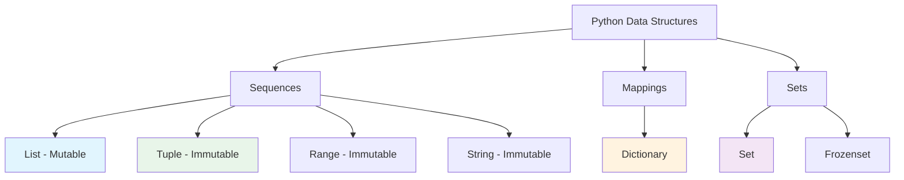
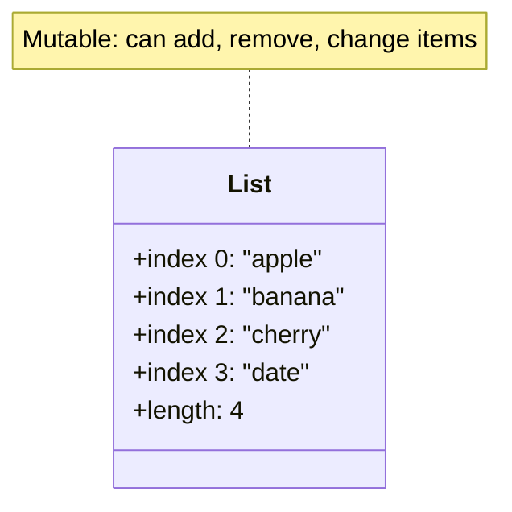

# Data Structures: Lists & Tuples

Lists and tuples are Python's fundamental sequence types. They store ordered collections of items and are used in virtually every Python program.

## What Are Data Structures?

Data structures are ways to organize and store data so it can be accessed and modified efficiently. Python provides several built-in data structures.



## Lists

Lists are ordered, mutable collections that can hold items of any type.

### Creating Lists

```python
# Empty list
empty = []
empty_alt = list()

# List with items
numbers = [1, 2, 3, 4, 5]
fruits = ["apple", "banana", "cherry"]
mixed = [1, "hello", 3.14, True]  # Different types allowed!

# List from range
evens = list(range(0, 11, 2))
print(f"Evens: {evens}")  # [0, 2, 4, 6, 8, 10]

# List comprehension (preview)
squares = [x ** 2 for x in range(1, 6)]
print(f"Squares: {squares}")  # [1, 4, 9, 16, 25]
```

### List Memory Representation



### Indexing

Access individual elements by their position (0-based index).

```python
fruits = ["apple", "banana", "cherry", "date", "elderberry"]

# Positive indexing (from start)
print(f"First:  {fruits[0]}")   # apple
print(f"Second: {fruits[1]}")   # banana
print(f"Third:  {fruits[2]}")   # cherry

# Negative indexing (from end)
print(f"Last:    {fruits[-1]}")   # elderberry
print(f"Second-to-last: {fruits[-2]}")  # date
print(f"Third-to-last: {fruits[-3]}")   # cherry
```

### Slicing

Extract portions of a list using slice notation: `[start:stop:step]`.

```python
numbers = [0, 1, 2, 3, 4, 5, 6, 7, 8, 9]

# Basic slicing
print(f"numbers[2:5]   = {numbers[2:5]}")     # [2, 3, 4]
print(f"numbers[:3]    = {numbers[:3]}")      # [0, 1, 2]
print(f"numbers[7:]    = {numbers[7:]}")      # [7, 8, 9]
print(f"numbers[:]     = {numbers[:]}")       # [0, 1, 2, 3, 4, 5, 6, 7, 8, 9] (copy)

# With step
print(f"numbers[::2]   = {numbers[::2]}")     # [0, 2, 4, 6, 8]
print(f"numbers[1::2]  = {numbers[1::2]}")    # [1, 3, 5, 7, 9]
print(f"numbers[::-1]  = {numbers[::-1]}")    # [9, 8, 7, 6, 5, 4, 3, 2, 1, 0] (reverse)
```

### List Methods

```mermaid
flowchart LR
    A[List Methods] --> B[Add Items]
    A --> C[Remove Items]
    A --> D[Find Items]
    A --> E[Other]
    
    B --> B1[append(x)]
    B --> B2[insert(i, x)]
    B --> B3[extend(iterable)]
    
    C --> C1[remove(x)]
    C --> C2[pop(i)]
    C --> C3[clear()]
    
    D --> D1[index(x)]
    D --> D2[count(x)]
    
    E --> E1[sort()]
    E --> E2[reverse()]
    E --> E3[copy()]
    
    style B fill:#e1f5fe
    style C fill:#fce4ec
    style D fill:#fff3e0
    style E fill:#e8f5e9
```

### Adding Items

```python
fruits = ["apple", "banana"]

# append() - add to end
fruits.append("cherry")
print(f"After append: {fruits}")  # ['apple', 'banana', 'cherry']

# insert() - add at specific position
fruits.insert(1, "apricot")
print(f"After insert: {fruits}")  # ['apple', 'apricot', 'banana', 'cherry']

# extend() - add multiple items
fruits.extend(["date", "elderberry"])
print(f"After extend: {fruits}")  # ['apple', 'apricot', 'banana', 'cherry', 'date', 'elderberry']

# Concatenation with +
more_fruits = fruits + ["fig", "grape"]
print(f"After +: {more_fruits}")
```

### Removing Items

```python
fruits = ["apple", "banana", "cherry", "date", "banana"]

# remove() - remove first occurrence of value
fruits.remove("banana")
print(f"After remove: {fruits}")  # ['apple', 'cherry', 'date', 'banana']

# pop() - remove and return item at index
removed = fruits.pop(2)
print(f"pop(2) returned: {removed}")  # date
print(f"After pop: {fruits}")  # ['apple', 'cherry', 'banana']

# pop() without argument - remove last
last = fruits.pop()
print(f"pop() returned: {last}")  # banana
print(f"After pop: {fruits}")  # ['apple', 'cherry']

# del statement
del fruits[0]
print(f"After del: {fruits}")  # ['cherry']
```

### Sorting and Reversing

```python
numbers = [5, 2, 8, 1, 9, 3]

# sort() - sort in place (modifies original)
numbers.sort()
print(f"Sorted: {numbers}")  # [1, 2, 3, 5, 8, 9]

# sort(reverse=True) - descending
numbers.sort(reverse=True)
print(f"Descending: {numbers}")  # [9, 8, 5, 3, 2, 1]

# sorted() - returns new list (doesn't modify original)
original = [5, 2, 8, 1, 9]
new_sorted = sorted(original)
print(f"Original: {original}")    # [5, 2, 8, 1, 9]
print(f"Sorted:   {new_sorted}")  # [1, 2, 5, 8, 9]

# reverse() - reverse in place
numbers = [1, 2, 3, 4, 5]
numbers.reverse()
print(f"Reversed: {numbers}")  # [5, 4, 3, 2, 1]
```

### Useful List Functions

```python
numbers = [5, 2, 8, 1, 9, 3]

print(f"Length:  {len(numbers)}")    # 6
print(f"Min:     {min(numbers)}")    # 1
print(f"Max:     {max(numbers)}")    # 9
print(f"Sum:     {sum(numbers)}")    # 28
print(f"Average: {sum(numbers)/len(numbers):.2f}")  # 4.67

# Check membership
print(f"5 in numbers: {5 in numbers}")      # True
print(f"10 in numbers: {10 in numbers}")    # False
```

## Tuples

Tuples are ordered, **immutable** collections. Once created, they cannot be modified.

### Creating Tuples

```python
# Empty tuple
empty = ()
empty_alt = tuple()

# Tuple with items
coordinates = (10, 20)
colors = ("red", "green", "blue")
single = (42,)  # Note the comma! Without it, it's just (42) = 42

# Tuple from other iterable
list_data = [1, 2, 3]
tuple_data = tuple(list_data)
print(f"Tuple from list: {tuple_data}")  # (1, 2, 3)
```

### Tuple vs List: Key Differences

| Feature | List | Tuple |
|---------|------|-------|
| Syntax | `[1, 2, 3]` | `(1, 2, 3)` |
| Mutable | Yes | No |
| Methods | Many (append, remove, etc.) | Few (count, index) |
| Performance | Slower | Faster |
| Use Case | Changing collections | Fixed data |
| Hashable | No | Yes (can be dict key) |

### Tuple Operations

```python
# Indexing (same as lists)
point = (3, 5, 7)
print(f"x: {point[0]}")  # 3
print(f"y: {point[1]}")  # 5
print(f"z: {point[2]}")  # 7

# Slicing (same as lists)
numbers = (0, 1, 2, 3, 4, 5)
print(f"[1:4]: {numbers[1:4]}")    # (1, 2, 3)
print(f"[::2]: {numbers[::2]}")    # (0, 2, 4)

# Concatenation
t1 = (1, 2)
t2 = (3, 4)
combined = t1 + t2
print(f"Combined: {combined}")  # (1, 2, 3, 4)

# Repetition
repeated = (0,) * 5
print(f"Repeated: {repeated}")  # (0, 0, 0, 0, 0)
```

### Tuple Immutability

```python
# Lists are mutable
my_list = [1, 2, 3]
my_list[0] = 99
print(f"List after modification: {my_list}")  # [99, 2, 3]

# Tuples are immutable
my_tuple = (1, 2, 3)
# my_tuple[0] = 99  # ERROR: TypeError!
print(f"Tuple unchanged: {my_tuple}")  # (1, 2, 3)
```

> [!NOTE]
> While tuples themselves are immutable, if they contain mutable objects (like lists), those objects can still be modified:
> ```python
> data = ([1, 2], [3, 4])
> data[0].append(3)  # This works!
> print(data)  # ([1, 2, 3], [3, 4])
> ```

### Tuple Unpacking

```python
# Basic unpacking
point = (3, 5)
x, y = point
print(f"x = {x}, y = {y}")  # x = 3, y = 5

# Multiple return values (functions return tuples!)
def divide(a, b):
    return a // b, a % b

quotient, remainder = divide(17, 5)
print(f"17 ÷ 5 = {quotient} remainder {remainder}")

# Swapping variables (Python idiom!)
a = 10
b = 20
print(f"Before: a = {a}, b = {b}")
a, b = b, a
print(f"After:  a = {a}, b = {b}")

# Extended unpacking
numbers = (1, 2, 3, 4, 5)
first, *middle, last = numbers
print(f"First: {first}")       # 1
print(f"Middle: {middle}")     # [2, 3, 4]
print(f"Last: {last}")         # 5
```

## Practical Examples

### List as a Stack

```python
# Stack implementation using list
stack = []

# Push (add to top)
stack.append("Task 1")
stack.append("Task 2")
stack.append("Task 3")
print(f"Stack: {stack}")

# Pop (remove from top)
current = stack.pop()
print(f"Processing: {current}")  # Task 3
print(f"Stack: {stack}")         # ['Task 1', 'Task 2']

# Peek (look at top without removing)
print(f"Next task: {stack[-1]}")  # Task 2
```

### List as a Queue

```python
from collections import deque

# Queue implementation
queue = deque(["Alice", "Bob", "Charlie"])

# Enqueue (add to end)
queue.append("Diana")
print(f"Queue: {list(queue)}")

# Dequeue (remove from front)
next_person = queue.popleft()
print(f"Serving: {next_person}")  # Alice
print(f"Queue: {list(queue)}")    # ['Bob', 'Charlie', 'Diana']
```

### Real-World Example: Grade Management System

```python
# grade_manager.py
"""Student grade management using lists and tuples."""

def add_student(students, name, grades):
    """Add a student with their grades as a tuple."""
    students.append((name, tuple(grades)))

def calculate_average(grades):
    """Calculate average of a tuple of grades."""
    return sum(grades) / len(grades)

def get_grade_letter(average):
    """Convert numeric average to letter grade."""
    if average >= 90:
        return "A"
    elif average >= 80:
        return "B"
    elif average >= 70:
        return "C"
    elif average >= 60:
        return "D"
    else:
        return "F"

def display_report(students):
    """Display a grade report for all students."""
    print("=" * 55)
    print("         STUDENT GRADE REPORT")
    print("=" * 55)
    print(f"{'Name':<15} {'Grades':<25} {'Avg':>6} {'Grade':>6}")
    print("-" * 55)
    
    class_total = 0
    for name, grades in students:
        avg = calculate_average(grades)
        letter = get_grade_letter(avg)
        grades_str = ", ".join(str(g) for g in grades)
        print(f"{name:<15} {grades_str:<25} {avg:6.1f} {letter:>6}")
        class_total += avg
    
    class_avg = class_total / len(students)
    print("-" * 55)
    print(f"{'Class Average:':<42} {class_avg:6.1f}")
    print("=" * 55)

# Create student database
students = []
add_student(students, "Alice", [92, 88, 95, 90])
add_student(students, "Bob", [78, 82, 75, 80])
add_student(students, "Charlie", [65, 70, 68, 72])
add_student(students, "Diana", [95, 98, 92, 97])
add_student(students, "Eve", [55, 60, 58, 62])

# Display report
display_report(students)
```

Output:
```
=======================================================
         STUDENT GRADE REPORT
=======================================================
Name            Grades                     Avg  Grade
-------------------------------------------------------
Alice           92, 88, 95, 90            91.2      A
Bob             78, 82, 75, 80            78.8      C
Charlie         65, 70, 68, 72            68.8      D
Diana           95, 98, 92, 97            95.5      A
Eve             55, 60, 58, 62            58.8      F
-------------------------------------------------------
Class Average:                              78.6
=======================================================
```

## Practice Exercises

### Exercise 1: List Creation
Create a list of your 5 favorite movies and print each one with its index.

### Exercise 2: List Slicing
Given `numbers = [0, 1, 2, 3, 4, 5, 6, 7, 8, 9]`, write slices to get:
- First 3 elements
- Last 3 elements
- Every other element
- Elements from index 3 to 7

### Exercise 3: List Methods
Start with an empty list. Add 5 numbers, sort them, reverse them, remove the smallest, and insert 100 at position 2.

### Exercise 4: Tuple Unpacking
Write a function that returns the min, max, and average of a list as a tuple. Unpack the result.

### Exercise 5: Remove Duplicates
Write a function that removes duplicates from a list while preserving order.

### Exercise 6: Matrix Operations
Represent a 3x3 matrix as a list of lists. Write functions to:
- Get a specific row
- Get a specific column
- Calculate the sum of all elements

### Exercise 7: Shopping List Manager
Create a program that lets users add, remove, and view items in a shopping list using a menu loop.

### Exercise 8: Tuple as Record
Create a list of tuples representing books: `(title, author, year, price)`. Write functions to:
- Find the most expensive book
- Find all books by a specific author
- Calculate the average price

## Summary

In this lesson, you learned:
- How to create and manipulate lists
- List indexing and slicing techniques
- Essential list methods: append, insert, remove, pop, sort, etc.
- How tuples differ from lists (immutability)
- Tuple unpacking and its practical uses
- How to use lists as stacks and queues
- Real-world applications of lists and tuples

Lists and tuples are the workhorses of Python data storage. Master them to handle collections of data effectively.
