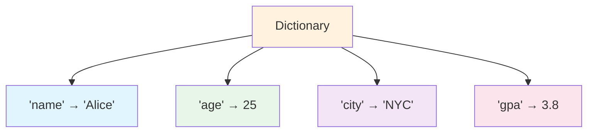

# Data Structures: Dictionaries & Sets

Dictionaries and sets are powerful Python data structures that use hashing for fast lookups. They're essential for organizing and processing data efficiently.

## Dictionaries

Dictionaries store data as key-value pairs. They're like real-world dictionaries: you look up a key to find its associated value.

### Dictionary Overview



### Creating Dictionaries

```python
# Empty dictionary
empty = {}
empty_alt = dict()

# Dictionary with key-value pairs
student = {
    "name": "Alice",
    "age": 25,
    "major": "Computer Science",
    "gpa": 3.8
}

# Using dict() constructor
student2 = dict(name="Bob", age=22, major="Math")

# From a list of tuples
pairs = [("a", 1), ("b", 2), ("c", 3)]
mapping = dict(pairs)
print(f"From pairs: {mapping}")  # {'a': 1, 'b': 2, 'c': 3}
```

### Accessing Values

```python
student = {
    "name": "Alice",
    "age": 25,
    "major": "Computer Science",
    "gpa": 3.8
}

# Square bracket notation
print(f"Name: {student['name']}")    # Alice
print(f"Age: {student['age']}")      # 25

# get() method - safe access (returns None if key missing)
print(f"GPA: {student.get('gpa')}")        # 3.8
print(f"Phone: {student.get('phone')}")    # None
print(f"Phone: {student.get('phone', 'N/A')}")  # N/A (default value)

# What happens with missing key?
# print(student['phone'])  # KeyError!
```

### Modifying Dictionaries

```python
student = {"name": "Alice", "age": 25}

# Adding new key-value pair
student["major"] = "Computer Science"
print(f"After add: {student}")

# Updating existing value
student["age"] = 26
print(f"After update: {student}")

# update() - merge dictionaries
student.update({"gpa": 3.8, "city": "NYC"})
print(f"After update: {student}")

# Deleting key-value pairs
del student["city"]
print(f"After del: {student}")

removed = student.pop("major")
print(f"pop returned: {removed}")
print(f"After pop: {student}")
```

### Dictionary Methods

| Method | Description | Example |
|--------|-------------|---------|
| `keys()` | Returns all keys | `d.keys()` |
| `values()` | Returns all values | `d.values()` |
| `items()` | Returns key-value pairs | `d.items()` |
| `get(key, default)` | Safe value access | `d.get('x', 0)` |
| `pop(key)` | Remove and return value | `d.pop('x')` |
| `update(other)` | Merge dictionaries | `d.update({...})` |
| `setdefault(k, v)` | Set if key missing | `d.setdefault('x', 0)` |

### Iterating Over Dictionaries

```python
student = {
    "name": "Alice",
    "age": 25,
    "major": "Computer Science",
    "gpa": 3.8
}

# Iterate over keys (default)
print("Keys:")
for key in student:
    print(f"  {key}: {student[key]}")

# Iterate over keys explicitly
print("\nKeys (explicit):")
for key in student.keys():
    print(f"  {key}")

# Iterate over values
print("\nValues:")
for value in student.values():
    print(f"  {value}")

# Iterate over key-value pairs
print("\nKey-Value Pairs:")
for key, value in student.items():
    print(f"  {key}: {value}")
```

Output:
```
Keys:
  name: Alice
  age: 25
  major: Computer Science
  gpa: 3.8

Keys (explicit):
  name
  age
  major
  gpa

Values:
  Alice
  25
  Computer Science
  3.8

Key-Value Pairs:
  name: Alice
  age: 25
  major: Computer Science
  gpa: 3.8
```

### Dictionary Comprehension

```python
# Create dictionary from lists
names = ["Alice", "Bob", "Charlie"]
scores = [92, 78, 85]

# Dictionary comprehension
grade_book = {name: score for name, score in zip(names, scores)}
print(f"Grade book: {grade_book}")

# Transform existing dictionary
squared = {k: v ** 2 for k, v in grade_book.items()}
print(f"Squared: {squared}")

# Filter dictionary
passed = {k: v for k, v in grade_book.items() if v >= 80}
print(f"Passed: {passed}")
```

## Sets

Sets are unordered collections of unique elements. They're perfect for membership testing and eliminating duplicates.

### Creating Sets

```python
# Empty set (note: {} creates a dict!)
empty_set = set()

# Set with items
fruits = {"apple", "banana", "cherry"}
print(f"Fruits: {fruits}")

# From a list (removes duplicates!)
numbers = [1, 2, 2, 3, 3, 3, 4, 4, 4, 4]
unique = set(numbers)
print(f"Unique: {unique}")  # {1, 2, 3, 4}

# Set comprehension
squares = {x ** 2 for x in range(1, 6)}
print(f"Squares: {squares}")  # {1, 4, 9, 16, 25}
```

### Set Operations

```mermaid
flowchart LR
    A[Set Operations] --> B[Union |]
    A --> C[Intersection &]
    A --> D[Difference -]
    A --> E[Symmetric Difference ^]
    
    B --> B1["All elements from both"]
    C --> C1["Common elements only"]
    D --> D1["In A but not in B"]
    E --> E1["In either, not both"]
    
    style B fill:#e1f5fe
    style C fill:#e8f5e9
    style D fill:#fff3e0
    style E fill:#f3e5f5
```

### Set Operations in Code

```python
# Two sets
python_devs = {"Alice", "Bob", "Charlie", "Diana"}
js_devs = {"Bob", "Charlie", "Eve", "Frank"}

# Union - all developers
all_devs = python_devs | js_devs
print(f"All developers: {all_devs}")
# {'Alice', 'Bob', 'Charlie', 'Diana', 'Eve', 'Frank'}

# Intersection - developers who know both
both = python_devs & js_devs
print(f"Know both: {both}")
# {'Bob', 'Charlie'}

# Difference - Python-only developers
python_only = python_devs - js_devs
print(f"Python only: {python_only}")
# {'Alice', 'Diana'}

# Symmetric difference - developers who know exactly one
one_language = python_devs ^ js_devs
print(f"One language: {one_language}")
# {'Alice', 'Diana', 'Eve', 'Frank'}
```

### Set Methods

```python
fruits = {"apple", "banana", "cherry"}

# Adding items
fruits.add("date")
print(f"After add: {fruits}")

# Adding multiple items
fruits.update(["elderberry", "fig"])
print(f"After update: {fruits}")

# Removing items
fruits.remove("banana")  # Error if not found
print(f"After remove: {fruits}")

fruits.discard("grape")  # No error if not found
print(f"After discard: {fruits}")

# Set membership (very fast - O(1))
print(f"'apple' in fruits: {'apple' in fruits}")  # True
print(f"'banana' in fruits: {'banana' in fruits}")  # False
```

### Practical Set Example: Finding Common Elements

```python
def find_common_students(class_a, class_b):
    """Find students enrolled in both classes."""
    set_a = set(class_a)
    set_b = set(class_b)
    
    common = set_a & set_b
    only_a = set_a - set_b
    only_b = set_b - set_a
    
    return common, only_a, only_b

class_a = ["Alice", "Bob", "Charlie", "David"]
class_b = ["Bob", "Charlie", "Eve", "Frank"]

common, only_a, only_b = find_common_students(class_a, class_b)
print(f"Both classes: {common}")
print(f"Only class A: {only_a}")
print(f"Only class B: {only_b}")
```

## Nested Data Structures

Dictionaries and lists can be combined to create complex data structures.

### Dictionary of Dictionaries

```python
# Student database
students = {
    "S001": {
        "name": "Alice",
        "age": 22,
        "grades": {"math": 95, "physics": 88, "cs": 92}
    },
    "S002": {
        "name": "Bob",
        "age": 23,
        "grades": {"math": 78, "physics": 82, "cs": 85}
    },
    "S003": {
        "name": "Charlie",
        "age": 21,
        "grades": {"math": 90, "physics": 95, "cs": 88}
    }
}

# Access nested data
print(f"Alice's math grade: {students['S001']['grades']['math']}")

# Calculate Alice's average
alice_grades = students["S001"]["grades"].values()
alice_avg = sum(alice_grades) / len(alice_grades)
print(f"Alice's average: {alice_avg:.1f}")
```

### List of Dictionaries

```python
# Product catalog
products = [
    {"id": 1, "name": "Laptop", "price": 999.99, "stock": 50},
    {"id": 2, "name": "Mouse", "price": 29.99, "stock": 200},
    {"id": 3, "name": "Keyboard", "price": 79.99, "stock": 150},
    {"id": 4, "name": "Monitor", "price": 349.99, "stock": 75},
]

# Find expensive products
expensive = [p for p in products if p["price"] > 100]
print(f"Expensive products ({len(expensive)}):")
for p in expensive:
    print(f"  {p['name']}: R${p['price']:.2f}")

# Calculate total inventory value
total_value = sum(p["price"] * p["stock"] for p in products)
print(f"\nTotal inventory value: R${total_value:,.2f}")
```

## Real-World Example: Contact Management System

```python
# contact_manager.py
"""Contact management system using dictionaries."""

class ContactManager:
    """Manage a collection of contacts."""
    
    def __init__(self):
        self.contacts = {}
    
    def add_contact(self, name, phone, email, city):
        """Add a new contact."""
        self.contacts[name] = {
            "phone": phone,
            "email": email,
            "city": city
        }
        print(f"Added: {name}")
    
    def get_contact(self, name):
        """Get contact information."""
        return self.contacts.get(name, "Contact not found")
    
    def remove_contact(self, name):
        """Remove a contact."""
        if name in self.contacts:
            del self.contacts[name]
            print(f"Removed: {name}")
        else:
            print(f"Contact not found: {name}")
    
    def search_by_city(self, city):
        """Find all contacts in a city."""
        return [
            name for name, info in self.contacts.items()
            if info["city"].lower() == city.lower()
        ]
    
    def display_all(self):
        """Display all contacts."""
        if not self.contacts:
            print("No contacts found.")
            return
        
        print("=" * 60)
        print(f"{'Name':<15} {'Phone':<15} {'Email':<25} {'City':<10}")
        print("-" * 60)
        for name, info in sorted(self.contacts.items()):
            print(f"{name:<15} {info['phone']:<15} {info['email']:<25} {info['city']:<10}")
        print("=" * 60)
        print(f"Total contacts: {len(self.contacts)}")

# Create and populate contact manager
manager = ContactManager()

manager.add_contact("Alice", "555-0101", "alice@email.com", "NYC")
manager.add_contact("Bob", "555-0102", "bob@email.com", "London")
manager.add_contact("Charlie", "555-0103", "charlie@email.com", "NYC")
manager.add_contact("Diana", "555-0104", "diana@email.com", "Tokyo")
manager.add_contact("Eve", "555-0105", "eve@email.com", "London")

print("\nAll Contacts:")
manager.display_all()

print("\nContacts in NYC:")
nyc_contacts = manager.search_by_city("NYC")
print(f"  {nyc_contacts}")

print("\nLooking up Bob:")
print(f"  {manager.get_contact('Bob')}")
```

Output:
```
Added: Alice
Added: Bob
Added: Charlie
Added: Diana
Added: Eve

All Contacts:
============================================================
Name            Phone           Email                     City      
------------------------------------------------------------
Alice           555-0101        alice@email.com           NYC       
Bob             555-0102        bob@email.com             London    
Charlie         555-0103        charlie@email.com         NYC       
Diana           555-0104        diana@email.com           Tokyo     
Eve             555-0105        eve@email.com             London    
============================================================
Total contacts: 5

Contacts in NYC:
  ['Alice', 'Charlie']

Looking up Bob:
  {'phone': '555-0102', 'email': 'bob@email.com', 'city': 'London'}
```

## Practice Exercises

### Exercise 1: Dictionary Creation
Create a dictionary representing a book with keys: title, author, year, pages, and price. Print each key-value pair.

### Exercise 2: Word Frequency Counter
Write a function that counts the frequency of each word in a sentence and returns a dictionary.

### Exercise 3: Dictionary Merge
Given two dictionaries, write code to merge them. If a key exists in both, keep the value from the second dictionary.

### Exercise 4: Set Operations
Given `A = {1, 2, 3, 4, 5}` and `B = {4, 5, 6, 7, 8}`, find:
- Union
- Intersection
- Difference (A - B)
- Symmetric difference

### Exercise 5: Remove Duplicates
Write a function that removes duplicates from a list using a set, then converts back to a list.

### Exercise 6: Phone Book
Create a phone book dictionary. Write functions to:
- Add a contact
- Look up a number by name
- Delete a contact
- List all contacts alphabetically

### Exercise 7: Inventory System
Create an inventory system using a dictionary where keys are product names and values are quantities. Write functions to:
- Add stock
- Remove stock
- Check availability
- List low-stock items (below threshold)

### Exercise 8: Venn Diagram Analysis
Three groups of students take different courses. Use set operations to find:
- Students taking all three courses
- Students taking exactly two courses
- Students taking only one course
- Students not taking any course

## Summary

In this lesson, you learned:
- How to create and manipulate dictionaries
- Dictionary methods: keys(), values(), items(), get(), update(), pop()
- How to iterate over dictionaries efficiently
- Dictionary comprehension for creating dictionaries
- How sets store unique elements
- Set operations: union, intersection, difference, symmetric difference
- How to combine dictionaries and lists for complex data
- Real-world applications of dictionaries and sets

Dictionaries and sets are essential for efficient data organization and retrieval. Master them to handle complex data structures.
