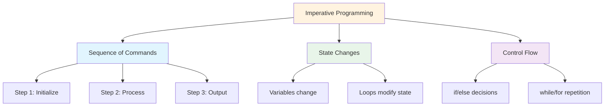
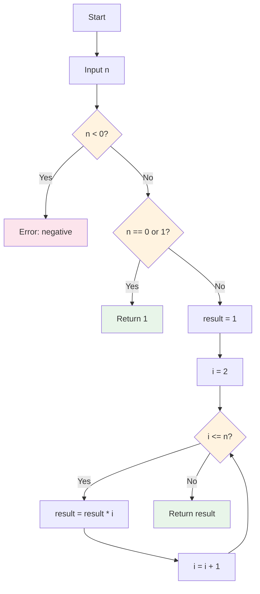
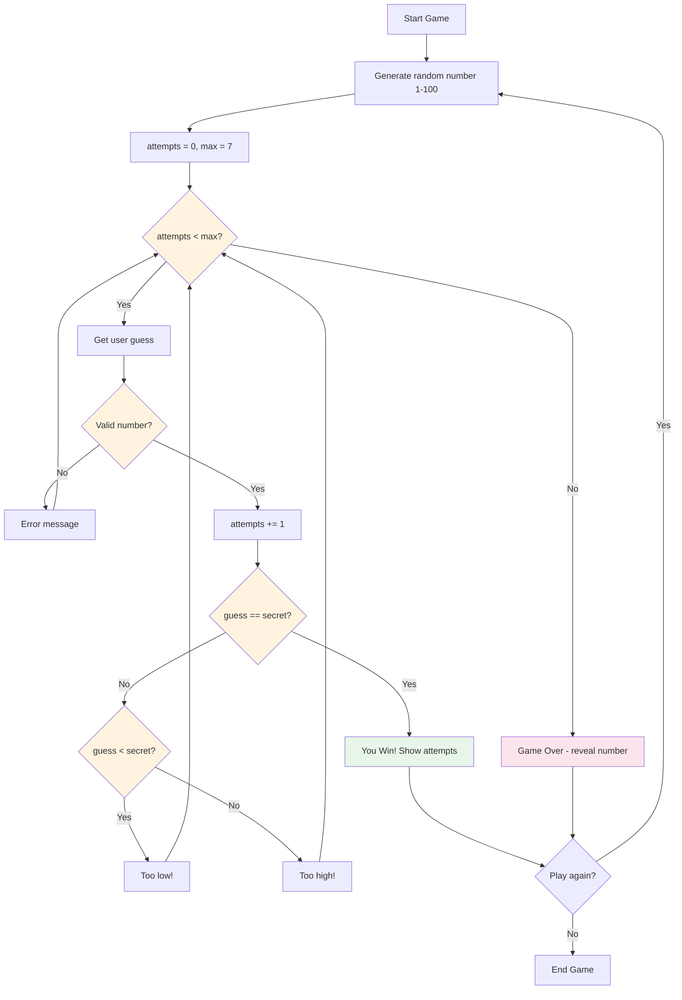

# Imperative Algorithm Projects

This lesson brings together everything you've learned to build complete algorithm implementations. We'll write imperative Python programs that solve classic computational problems.

## What is Imperative Programming?

Imperative programming describes HOW to solve a problem step by step, using statements that change program state. This contrasts with declarative programming, which describes WHAT the result should be.



## Project 1: Factorial Calculator

The factorial of n (written n!) is the product of all positive integers from 1 to n.

### Algorithm Flowchart



### Implementation

```python
# factorial.py
"""Factorial calculator using imperative approach."""

def factorial_iterative(n):
    """
    Calculate factorial using a loop.
    
    Args:
        n: Non-negative integer
    
    Returns:
        int: n! (factorial of n)
    
    Raises:
        ValueError: If n is negative
    """
    if n < 0:
        raise ValueError("Factorial is not defined for negative numbers")
    
    result = 1
    for i in range(2, n + 1):
        result *= i
    
    return result

def factorial_with_steps(n):
    """Calculate factorial showing each step."""
    if n < 0:
        raise ValueError("Factorial is not defined for negative numbers")
    
    print(f"Calculating {n}!:")
    result = 1
    
    for i in range(1, n + 1):
        result *= i
        print(f"  Step {i}: result = {result}")
    
    return result

# Test the factorial function
print("=== Factorial Calculator ===\n")

# Test cases
test_values = [0, 1, 5, 10, 20]

for n in test_values:
    result = factorial_iterative(n)
    print(f"{n:2d}! = {result}")

print("\nDetailed calculation of 5!:")
factorial_with_steps(5)
```

Output:
```
=== Factorial Calculator ===

 0! = 1
 1! = 1
 5! = 120
10! = 3628800
20! = 2432902008176640000

Detailed calculation of 5!:
Calculating 5!:
  Step 1: result = 1
  Step 2: result = 2
  Step 3: result = 6
  Step 4: result = 24
  Step 5: result = 120
```

## Project 2: Fibonacci Sequence Generator

The Fibonacci sequence: each number is the sum of the two preceding ones.

### Algorithm Flowchart

```mermaid
flowchart TD
    A[Start] --> B[Input n]
    B --> C{n <= 0?}
    C -->|Yes| D[Return empty list]
    C -->|No| E{n == 1?}
    E -->|Yes| F[Return [0]]
    E -->|No| G[fib = [0, 1]]
    G --> H[i = 2]
    H --> I{i < n?}
    I -->|Yes| J[next = fib[i-1] + fib[i-2]]
    J --> K[Append next to fib]
    K --> L[i = i + 1]
    L --> I
    I -->|No| M[Return fib]
    
    style C fill:#fff3e0
    style E fill:#fff3e0
    style I fill:#fff3e0
```

### Implementation

```python
# fibonacci.py
"""Fibonacci sequence generator."""

def fibonacci_sequence(n):
    """
    Generate the first n Fibonacci numbers.
    
    Args:
        n: Number of Fibonacci numbers to generate
    
    Returns:
        list: First n Fibonacci numbers
    """
    if n <= 0:
        return []
    if n == 1:
        return [0]
    
    fib = [0, 1]
    for i in range(2, n):
        next_fib = fib[i - 1] + fib[i - 2]
        fib.append(next_fib)
    
    return fib

def fibonacci_nth(n):
    """
    Get the nth Fibonacci number (0-indexed).
    
    Args:
        n: Position in the sequence
    
    Returns:
        int: The nth Fibonacci number
    """
    if n < 0:
        raise ValueError("n must be non-negative")
    if n <= 1:
        return n
    
    a, b = 0, 1
    for _ in range(2, n + 1):
        a, b = b, a + b
    
    return b

def fibonacci_ratio(n):
    """Show how Fibonacci ratios approach the golden ratio."""
    print(f"{'n':>4} {'F(n)':>12} {'F(n)/F(n-1)':>14}")
    print("-" * 35)
    
    prev = 0
    for i in range(1, n + 1):
        curr = fibonacci_nth(i)
        if prev > 0:
            ratio = curr / prev
            print(f"{i:4d} {curr:12d} {ratio:14.10f}")
        else:
            print(f"{i:4d} {curr:12d} {'N/A':>14}")
        prev = curr

# Test Fibonacci
print("=== Fibonacci Sequence Generator ===\n")

# Generate sequences
print("First 10 Fibonacci numbers:")
print(fibonacci_sequence(10))

print("\nFirst 15 Fibonacci numbers:")
print(fibonacci_sequence(15))

# Golden ratio convergence
print("\nFibonacci ratios approaching golden ratio (φ ≈ 1.6180339887):")
fibonacci_ratio(15)
```

Output:
```
=== Fibonacci Sequence Generator ===

First 10 Fibonacci numbers:
[0, 1, 1, 2, 3, 5, 8, 13, 21, 34]

First 15 Fibonacci numbers:
[0, 1, 1, 2, 3, 5, 8, 13, 21, 34, 55, 89, 144, 233, 377]

Fibonacci ratios approaching golden ratio (φ ≈ 1.6180339887):
   n         F(n)    F(n)/F(n-1)
-----------------------------------
   1            1            N/A
   2            1     1.0000000000
   3            2     2.0000000000
   4            3     1.5000000000
   5            5     1.6666666667
   6            8     1.6000000000
   7           13     1.6250000000
   8           21     1.6153846154
   9           34     1.6190476190
  10           55     1.6176470588
  11           89     1.6181818182
  12          144     1.6179775281
  13          233     1.6180555556
  14          377     1.6180257511
  15          610     1.6180371353
```

## Project 3: Prime Number Checker

A prime number is a natural number greater than 1 that has no positive divisors other than 1 and itself.

### Algorithm Flowchart

```mermaid
flowchart TD
    A[Start] --> B[Input n]
    B --> C{n <= 1?}
    C -->|Yes| D[Not prime]
    C -->|No| E{n <= 3?}
    E -->|Yes| F[Prime]
    E -->|No| G{n % 2 == 0 or n % 3 == 0?}
    G -->|Yes| D
    G -->|No| H[i = 5]
    H --> I{i * i <= n?}
    I -->|Yes| J{n % i == 0 or n % (i+2) == 0?}
    J -->|Yes| D
    J -->|No| K[i = i + 6]
    K --> I
    I -->|No| F[Prime]
    
    style C fill:#fff3e0
    style E fill:#fff3e0
    style G fill:#fff3e0
    style I fill:#fff3e0
    style J fill:#fff3e0
    style D fill:#fce4ec
    style F fill:#e8f5e9
```

### Implementation

```python
# prime_checker.py
"""Prime number checker and generator."""

def is_prime(n):
    """
    Check if a number is prime using optimized trial division.
    
    Args:
        n: Integer to check
    
    Returns:
        bool: True if prime, False otherwise
    """
    if n <= 1:
        return False
    if n <= 3:
        return True
    if n % 2 == 0 or n % 3 == 0:
        return False
    
    i = 5
    while i * i <= n:
        if n % i == 0 or n % (i + 2) == 0:
            return False
        i += 6
    
    return True

def find_primes_up_to(limit):
    """
    Find all prime numbers up to a given limit.
    
    Args:
        limit: Upper bound (inclusive)
    
    Returns:
        list: All prime numbers up to limit
    """
    primes = []
    for num in range(2, limit + 1):
        if is_prime(num):
            primes.append(num)
    return primes

def count_primes_in_range(start, end):
    """Count primes in a range."""
    count = 0
    for num in range(start, end + 1):
        if is_prime(num):
            count += 1
    return count

# Test prime checker
print("=== Prime Number Checker ===\n")

# Check individual numbers
test_numbers = [1, 2, 3, 4, 17, 25, 29, 97, 100]
print("Prime checks:")
for n in test_numbers:
    status = "Prime" if is_prime(n) else "Not prime"
    print(f"  {n:3d}: {status}")

# Find primes up to 50
print("\nPrimes up to 50:")
primes = find_primes_up_to(50)
print(f"  {primes}")
print(f"  Count: {len(primes)}")

# Prime density
print("\nPrime density:")
for limit in [10, 100, 1000]:
    count = count_primes_in_range(2, limit)
    density = count / limit * 100
    print(f"  Up to {limit:4d}: {count:4d} primes ({density:.1f}%)")
```

Output:
```
=== Prime Number Checker ===

Prime checks:
    1: Not prime
    2: Prime
    3: Prime
    4: Not prime
   17: Prime
   25: Not prime
   29: Prime
   97: Prime
  100: Not prime

Primes up to 50:
  [2, 3, 5, 7, 11, 13, 17, 19, 23, 29, 31, 37, 41, 43, 47]
  Count: 15

Prime density:
  Up to   10:    4 primes (40.0%)
  Up to  100:   25 primes (25.0%)
  Up to 1000:  168 primes (16.8%)
```

## Project 4: Bubble Sort

Bubble sort is a simple sorting algorithm that repeatedly steps through the list, compares adjacent elements, and swaps them if they're in the wrong order.

### Algorithm Flowchart

```mermaid
flowchart TD
    A[Start] --> B[Input list arr]
    B --> C[n = length of arr]
    C --> D[i = 0]
    D --> E{i < n - 1?}
    E -->|No| F[Sorted! Return arr]
    E -->|Yes| G[swapped = False]
    G --> H[j = 0]
    H --> I{j < n - i - 1?}
    I -->|No| J{swapped?}
    J -->|No| F
    J -->|Yes| K[i = i + 1]
    K --> E
    I -->|Yes| L{arr[j] > arr[j+1]?}
    L -->|No| M[j = j + 1]
    M --> I
    L -->|Yes| N[Swap arr[j], arr[j+1]]
    N --> O[swapped = True]
    O --> M
    
    style E fill:#fff3e0
    style I fill:#fff3e0
    style J fill:#fff3e0
    style L fill:#fff3e0
    style F fill:#e8f5e9
    style N fill:#fce4ec
```

### Implementation

```python
# bubble_sort.py
"""Bubble sort implementation with visualization."""

def bubble_sort(arr):
    """
    Sort a list using bubble sort algorithm.
    
    Args:
        arr: List of comparable elements
    
    Returns:
        list: Sorted list (new list, original unchanged)
    """
    result = arr.copy()
    n = len(result)
    
    for i in range(n - 1):
        swapped = False
        for j in range(n - i - 1):
            if result[j] > result[j + 1]:
                # Swap
                result[j], result[j + 1] = result[j + 1], result[j]
                swapped = True
        
        if not swapped:
            break  # Already sorted
    
    return result

def bubble_sort_visual(arr):
    """Sort with step-by-step visualization."""
    result = arr.copy()
    n = len(result)
    passes = 0
    
    print(f"Initial: {result}")
    
    for i in range(n - 1):
        swapped = False
        passes += 1
        
        for j in range(n - i - 1):
            if result[j] > result[j + 1]:
                result[j], result[j + 1] = result[j + 1], result[j]
                swapped = True
                print(f"  Pass {passes}, Swap {j},{j+1}: {result}")
        
        if not swapped:
            print(f"  Pass {passes}: No swaps needed (sorted!)")
            break
    
    print(f"Final:   {result}")
    print(f"Total passes: {passes}")
    return result

# Test bubble sort
print("=== Bubble Sort ===\n")

# Simple sort
numbers = [64, 34, 25, 12, 22, 11, 90]
print(f"Original: {numbers}")
sorted_nums = bubble_sort(numbers)
print(f"Sorted:   {sorted_nums}")
print(f"Original unchanged: {numbers}\n")

# Visual sort
print("Visual bubble sort:")
bubble_sort_visual([5, 3, 8, 1, 2])
```

Output:
```
=== Bubble Sort ===

Original: [64, 34, 25, 12, 22, 11, 90]
Sorted:   [11, 12, 22, 25, 34, 64, 90]
Original unchanged: [64, 34, 25, 12, 22, 11, 90]

Visual bubble sort:
Initial: [5, 3, 8, 1, 2]
  Pass 1, Swap 0,1: [3, 5, 8, 1, 2]
  Pass 1, Swap 2,3: [3, 5, 1, 8, 2]
  Pass 1, Swap 3,4: [3, 5, 1, 2, 8]
  Pass 2, Swap 1,2: [3, 1, 5, 2, 8]
  Pass 2, Swap 2,3: [3, 1, 2, 5, 8]
  Pass 3, Swap 0,1: [1, 3, 2, 5, 8]
  Pass 3, Swap 1,2: [1, 2, 3, 5, 8]
  Pass 4: No swaps needed (sorted!)
Final:   [1, 2, 3, 5, 8]
Total passes: 4
```

## Project 5: Number Guessing Game

A complete interactive game that combines all concepts learned in this course.

### Game Flowchart



### Implementation

```python
# number_guessing_game.py
"""Number guessing game with scoring and difficulty levels."""

import random

def get_difficulty():
    """Let player choose difficulty level."""
    print("\nSelect difficulty:")
    print("  1. Easy   (1-50,  10 attempts)")
    print("  2. Medium (1-100,  7 attempts)")
    print("  3. Hard   (1-200,  5 attempts)")
    
    while True:
        choice = input("Choice (1-3): ").strip()
        if choice == "1":
            return 50, 10
        elif choice == "2":
            return 100, 7
        elif choice == "3":
            return 200, 5
        print("Invalid choice. Please enter 1, 2, or 3.")

def play_game():
    """Play one round of the guessing game."""
    max_num, max_attempts = get_difficulty()
    secret = random.randint(1, max_num)
    attempts = 0
    guesses = []
    
    print(f"\n{'=' * 40}")
    print(f"  Guess the number between 1 and {max_num}")
    print(f"  You have {max_attempts} attempts")
    print(f"{'=' * 40}\n")
    
    while attempts < max_attempts:
        # Get valid guess
        while True:
            try:
                guess = int(input(f"Attempt {attempts + 1}/{max_attempts}: "))
                if 1 <= guess <= max_num:
                    break
                print(f"  Please enter a number between 1 and {max_num}.")
            except ValueError:
                print("  Please enter a valid number.")
        
        attempts += 1
        guesses.append(guess)
        
        # Check guess
        if guess == secret:
            print(f"\n  🎉 Congratulations! You guessed it!")
            print(f"  The number was {secret}.")
            print(f"  Attempts: {attempts}/{max_attempts}")
            
            # Score calculation
            score = max(0, (max_attempts - attempts + 1) * 100)
            print(f"  Score: {score} points")
            return True, score
        
        elif guess < secret:
            diff = secret - guess
            hint = "Much too low!" if diff > 20 else "Too low! Try higher."
            print(f"  {hint}")
        else:
            diff = guess - secret
            hint = "Much too high!" if diff > 20 else "Too high! Try lower."
            print(f"  {hint}")
    
    # Game over
    print(f"\n  😔 Game over! The number was {secret}.")
    print(f"  Your guesses: {guesses}")
    return False, 0

def display_stats(games_played, games_won, total_score):
    """Display game statistics."""
    print(f"\n{'=' * 40}")
    print("         GAME STATISTICS")
    print(f"{'=' * 40}")
    print(f"  Games played: {games_played}")
    print(f"  Games won:    {games_won}")
    print(f"  Games lost:   {games_played - games_won}")
    
    if games_played > 0:
        win_rate = games_won / games_played * 100
        avg_score = total_score / games_played
        print(f"  Win rate:     {win_rate:.1f}%")
        print(f"  Avg score:    {avg_score:.0f}")
    
    print(f"  Total score:  {total_score}")
    print(f"{'=' * 40}")

def main():
    """Main game loop."""
    print("=" * 40)
    print("   NUMBER GUESSING GAME")
    print("=" * 40)
    
    games_played = 0
    games_won = 0
    total_score = 0
    
    while True:
        games_played += 1
        won, score = play_game()
        
        if won:
            games_won += 1
        total_score += score
        
        # Play again?
        while True:
            again = input("\nPlay again? (yes/no): ").strip().lower()
            if again in ("yes", "y", "no", "n"):
                break
            print("Please enter 'yes' or 'no'.")
        
        if again in ("no", "n"):
            break
    
    display_stats(games_played, games_won, total_score)
    print("\nThanks for playing! Goodbye! 👋")

# Run the game
if __name__ == "__main__":
    main()
```

Sample output:
```
========================================
   NUMBER GUESSING GAME
========================================

Select difficulty:
  1. Easy   (1-50,  10 attempts)
  2. Medium (1-100,  7 attempts)
  3. Hard   (1-200,  5 attempts)
Choice (1-3): 2

========================================
  Guess the number between 1 and 100
  You have 7 attempts
========================================

Attempt 1/7: 50
  Too high! Try lower.
Attempt 2/7: 25
  Too low! Try higher.
Attempt 3/7: 37
  Too low! Try higher.
Attempt 4/7: 43
  🎉 Congratulations! You guessed it!
  The number was 43.
  Attempts: 4/7
  Score: 400 points

Play again? (yes/no): no

========================================
         GAME STATISTICS
========================================
  Games played: 1
  Games won:    1
  Games lost:   0
  Win rate:     100.0%
  Avg score:    400
  Total score:  400
========================================

Thanks for playing! Goodbye! 👋
```

## Practice Exercises

### Exercise 1: Enhanced Factorial
Modify the factorial function to use a while loop instead of a for loop.

### Exercise 2: Fibonacci Search
Write a function that checks if a given number is a Fibonacci number.

### Exercise 3: Prime Factorization
Write a function that returns the prime factorization of a number as a list of prime factors.

### Exercise 4: Selection Sort
Implement selection sort: find the minimum element, swap it to the front, repeat for the remaining elements.

### Exercise 5: Binary Search
Implement binary search on a sorted list. Compare its efficiency with linear search.

### Exercise 6: Enhanced Guessing Game
Add features to the guessing game:
- Track best score (fewest attempts)
- Add a hint system (reveals if number is even/odd)
- Add a timer to track how long each game takes

### Exercise 7: Sieve of Eratosthenes
Implement the Sieve of Eratosthenes algorithm to find all primes up to n. Compare its speed with the trial division method.

### Exercise 8: Algorithm Comparison
Write a program that compares the execution time of bubble sort vs Python's built-in sorted() for lists of different sizes (100, 1000, 10000 elements).

## Summary

In this lesson, you built complete imperative algorithm projects:
- **Factorial**: Iterative calculation with step-by-step visualization
- **Fibonacci**: Sequence generation and golden ratio convergence
- **Prime Checker**: Optimized trial division for primality testing
- **Bubble Sort**: Step-by-step sorting with swap visualization
- **Number Guessing Game**: Complete interactive game with difficulty levels and scoring

These projects demonstrate how variables, loops, conditionals, functions, and data structures work together to solve real computational problems. Practice modifying and extending these algorithms to deepen your understanding.
