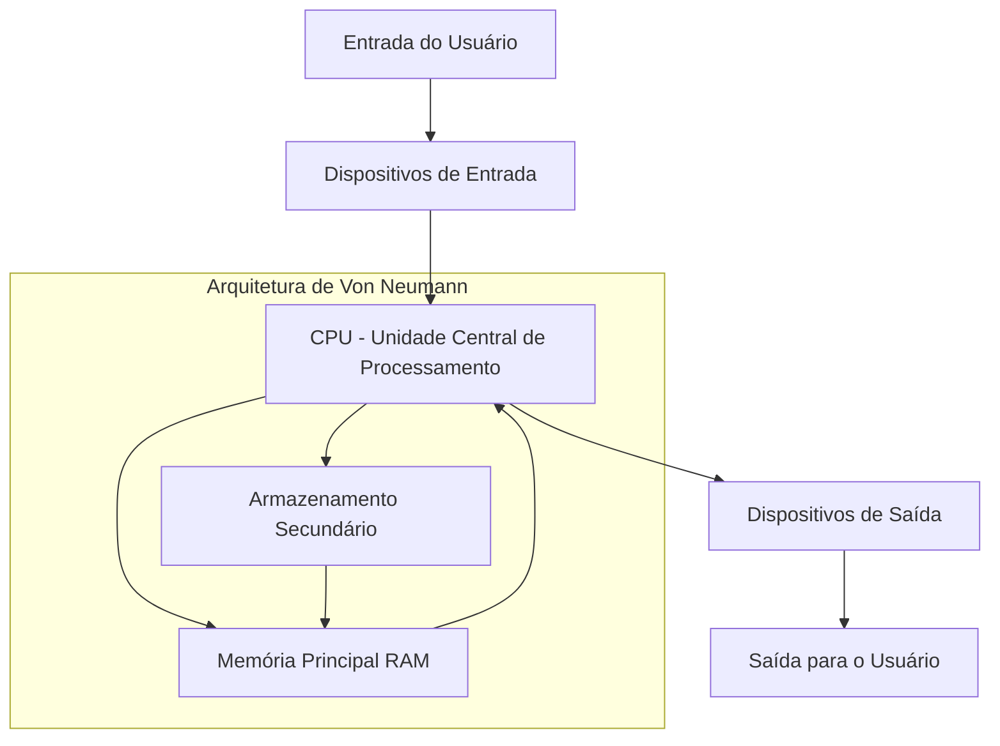
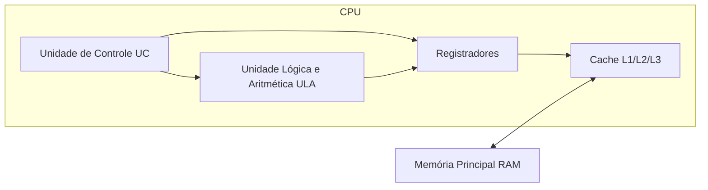
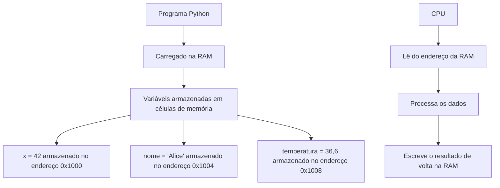
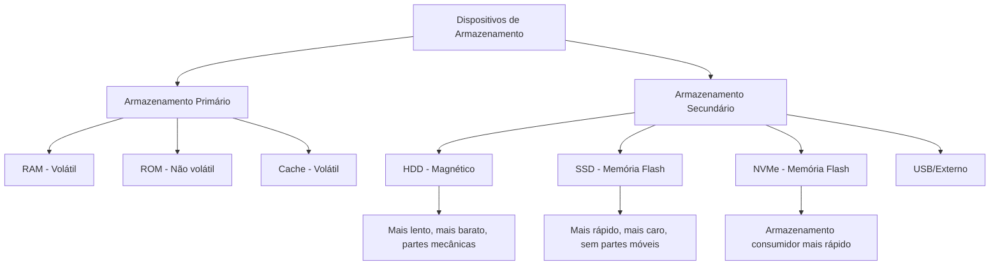
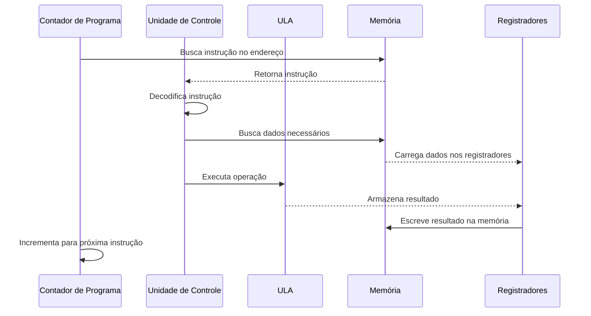
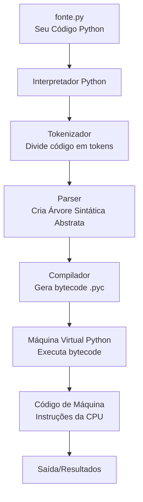

# Como os Computadores Funcionam

Antes de mergulhar na programação Python, é essencial entender a máquina que executa seu código. Esta lição aborda os componentes fundamentais dos computadores, como eles processam informações e como os programas são executados.

## Visão Geral do Sistema Computacional

Um computador é um dispositivo eletrônico que processa dados de acordo com um conjunto de instruções chamado programa. Todo programa Python que você escreve é executado neste hardware.



### A Arquitetura de Von Neumann

A maioria dos computadores modernos segue a arquitetura de Von Neumann, proposta pelo matemático John von Neumann em 1945. Esta arquitetura consiste em quatro componentes principais:

| Componente | Função | Analogia do Mundo Real |
|------------|--------|----------------------|
| CPU | Processa instruções e dados | O cérebro que pensa e calcula |
| Memória (RAM) | Armazena programas e dados ativos | Uma bancada de trabalho |
| Armazenamento | Salva dados e programas permanentemente | Um arquivo para armazenamento longo |
| Dispositivos E/S | Comunica-se com o mundo externo | Olhos, ouvidos, boca e mãos |

## Unidade Central de Processamento (CPU)

A CPU é o "cérebro" do computador. Ela executa instruções dos programas, realiza cálculos e gerencia o fluxo de dados entre os componentes.

### Componentes da CPU



**Unidade de Controle (UC):** Direciona a operação do processador. Ela busca instruções na memória, decodifica-as e coordena sua execução.

**Unidade Lógica e Aritmética (ULA):** Realiza operações matemáticas (adição, subtração, multiplicação, divisão) e operações lógicas (E, OU, NÃO, comparações).

**Registradores:** Pequenas localizações de armazenamento ultra-rápidas dentro da CPU. Eles mantêm os dados que a CPU está processando atualmente.

**Cache:** Memória de alta velocidade que armazena dados frequentemente acessados. L1 é o mais rápido porém menor; L3 é mais lento porém maior.

### Velocidade do Clock da CPU

O clock da CPU determina quantos ciclos por segundo o processador pode executar:

| Velocidade do Clock | Ciclos por Segundo | Uso Típico |
|---------------------|-------------------|------------|
| 1 GHz | 1.000.000.000 | Computação básica |
| 2,4 GHz | 2.400.000.000 | Laptops padrão |
| 3,5 GHz | 3.500.000.000 | PCs gamer |
| 5,0 GHz | 5.000.000.000 | Estações de trabalho de alto desempenho |

> [!NOTE]
> Uma CPU de 3,5 GHz pode executar bilhões de instruções por segundo. No entanto, CPUs modernas não executam uma instrução por ciclo - elas usam pipeline e múltiplos núcleos para processar muitas instruções simultaneamente.

## Memória (RAM)

A Memória de Acesso Aleatório (RAM) é a memória de curto prazo do computador. Ela armazena dados e programas que estão atualmente em uso.

### Como a RAM Funciona



### Hierarquia de Memória

| Tipo | Velocidade | Tamanho | Volátil | Exemplo |
|------|------------|---------|---------|---------|
| Registradores | Mais rápido | Bytes | Sim | Registradores da CPU |
| Cache L1 | Muito rápido | KBs | Sim | Cache da CPU |
| Cache L2 | Rápido | MBs | Sim | Cache da CPU |
| Cache L3 | Moderado | MBs | Sim | Cache da CPU |
| RAM | Mais lento | GBs | Sim | DDR4/DDR5 |
| SSD | Lento | TBs | Não | SSD NVMe |
| HDD | Mais lento | TBs | Não | Disco mecânico |

> [!TIP]
> Quando você executa um script Python, o programa inteiro é carregado na RAM. É por isso que programas com grandes conjuntos de dados precisam de mais RAM. Se a RAM encher, o sistema usa espaço de troca no disco, que é muito mais lento.

## Representação Binária

Computadores entendem apenas dois estados: LIGADO (1) e DESLIGADO (0). Este sistema binário é a base de toda computação digital.

### Sistema de Numeração Binária

O sistema binário usa base-2, enquanto humanos normalmente usam base-10 (decimal).

| Decimal | Binário | Explicação |
|---------|---------|------------|
| 0 | 0000 | 0 × 2⁰ = 0 |
| 1 | 0001 | 1 × 2⁰ = 1 |
| 2 | 0010 | 1 × 2¹ = 2 |
| 3 | 0011 | 1 × 2¹ + 1 × 2⁰ = 3 |
| 4 | 0100 | 1 × 2² = 4 |
| 5 | 0101 | 1 × 2² + 1 × 2⁰ = 5 |
| 10 | 1010 | 1 × 2³ + 1 × 2¹ = 10 |
| 255 | 11111111 | Todos os 8 bits definidos como 1 |

### Convertendo Decimal para Binário

```
Decimal 13 para Binário:
13 ÷ 2 = 6 resto 1  (bit menos significativo)
 6 ÷ 2 = 3 resto 0
 3 ÷ 2 = 1 resto 1
 1 ÷ 2 = 0 resto 1  (bit mais significativo)

Lendo os restos de baixo para cima: 1101
Verificação: 1×8 + 1×4 + 0×2 + 1×1 = 13 ✓
```

### Bits, Bytes e Além

| Unidade | Tamanho | Pode Armazenar |
|---------|---------|----------------|
| Bit | 1 dígito binário | 0 ou 1 |
| Nibble | 4 bits | 0-15 |
| Byte | 8 bits | 0-255 ou um caractere ASCII |
| Kilobyte (KB) | 1.024 bytes | Um parágrafo curto |
| Megabyte (MB) | 1.024 KB | Uma foto pequena |
| Gigabyte (GB) | 1.024 MB | Um filme |
| Terabyte (TB) | 1.024 GB | Milhares de filmes |

> [!NOTE]
> Em Python, inteiros podem ser arbitrariamente grandes (limitados apenas pela memória disponível). A linguagem lida com a representação binária automaticamente, então você raramente precisa pensar sobre bits e bytes diretamente.

## Dispositivos de Armazenamento

Dispositivos de armazenamento mantêm dados permanentemente, mesmo quando o computador está desligado.

### Tipos de Armazenamento



### Comparação HDD vs SSD

| Característica | HDD (Disco Rígido) | SSD (Estado Sólido) |
|----------------|-------------------|---------------------|
| Tecnologia | Pratos magnéticos | Chips de memória flash |
| Velocidade | 80-160 MB/s | 500-7000 MB/s |
| Durabilidade | Frágil (partes móveis) | Robusto (sem partes móveis) |
| Ruído | Audível (rotação) | Silencioso |
| Preço | Mais barato por GB | Mais caro por GB |
| Ideal Para | Armazenamento em massa | SO e aplicativos |

## O Ciclo Busca-Decodifica-Executa

Todo programa é executado através de um ciclo contínuo chamado ciclo Busca-Decodifica-Executa. É assim que seu código Python realmente é executado na CPU.

### Etapas do Ciclo


### Detalhamento



### Exemplo: Executando `x = 5 + 3`

Quando Python executa `x = 5 + 3`, a CPU realiza:

1. **BUSCA:** Obtém a instrução ADD da memória
2. **DECODIFICA:** Reconhece que precisa somar dois números
3. **BUSCA:** Obtém os valores 5 e 3 da memória
4. **EXECUTA:** ULA realiza 5 + 3 = 8
5. **ARMAZENA:** Salva o resultado 8 na localização de memória para a variável `x`

> [!WARNING]
> Este ciclo acontece bilhões de vezes por segundo. Um programa Python simples pode executar milhões desses ciclos antes de terminar.

## Como o Código Python é Executado

Entender como seu código Python se traduz em operações de máquina ajuda você a escrever programas mais eficientes.

### Pipeline de Execução Python



### Exemplo de Bytecode

Quando você escreve código Python, ele é compilado para bytecode antes da execução:

```python
# Código fonte
x = 10
y = 20
resultado = x + y
print(resultado)
```

O interpretador Python converte isso para bytecode (mostrado usando o módulo `dis`):

```python
import dis

def somar_numeros():
    x = 10
    y = 20
    resultado = x + y
    print(resultado)

dis.dis(somar_numeros)
```

Saída:
```
  2           0 LOAD_CONST               1 (10)
              2 STORE_FAST               0 (x)

  3           4 LOAD_CONST               2 (20)
              6 STORE_FAST               1 (y)

  4           8 LOAD_FAST                0 (x)
             10 LOAD_FAST                1 (y)
             12 BINARY_ADD
             14 STORE_FAST               2 (resultado)

  5          16 LOAD_GLOBAL              0 (print)
             18 LOAD_FAST                2 (resultado)
             20 CALL_FUNCTION            1
             22 POP_TOP
             24 LOAD_CONST               0 (None)
             26 RETURN_VALUE
```

> [!TIP]
> O módulo `dis` é uma ótima ferramenta para entender o que Python faz nos bastidores. Use-o para ver o bytecode de qualquer função.

## Exemplo do Mundo Real: Desempenho de Calculadora

Vamos ver como a arquitetura do computador afeta o desempenho do Python:

```python
import time

# Mede o tempo para diferentes operações
def benchmark_operacoes():
    iteracoes = 10_000_000
    
    # Teste 1: Adição simples (usa ULA diretamente)
    inicio = time.time()
    total = 0
    for i in range(iteracoes):
        total += 1
    print(f"Adição: {time.time() - inicio:.4f} segundos")
    
    # Teste 2: Multiplicação (operação ULA um pouco mais complexa)
    inicio = time.time()
    total = 1
    for i in range(iteracoes):
        total *= 1.0000001
    print(f"Multiplicação: {time.time() - inicio:.4f} segundos")
    
    # Teste 3: Acesso a lista (envolve acesso à memória)
    dados = list(range(iteracoes))
    inicio = time.time()
    total = 0
    for i in range(iteracoes):
        total += dados[i]
    print(f"Acesso à lista: {time.time() - inicio:.4f} segundos")

benchmark_operacoes()
```

Saída típica:
```
Adição: 0,5234 segundos
Multiplicação: 0,6891 segundos
Acesso à lista: 1,2456 segundos
```

> [!NOTE]
> O acesso à lista é mais lento porque envolve consultas à memória, não apenas cálculos da CPU. Isso demonstra por que entender a hierarquia de memória é importante para escrever código eficiente.

## Exercícios Práticos

### Exercício 1: Conversão Binária
Converta os seguintes números decimais para binário:
- a) 7
- b) 15
- c) 32
- d) 100

### Exercício 2: Hierarquia de Memória
Organize do mais rápido para o mais lento:
- RAM, Cache L1, HDD, Registradores, SSD, Cache L2

### Exercício 3: Componentes da CPU
Explique o que acontece na CPU quando Python executa: `resultado = 10 * 5`

### Exercício 4: Cálculo de Armazenamento
Se um arquivo de texto contém 1.000 caracteres (1 byte cada), quantos bytes, KB e bits ele ocupa?

### Exercício 5: Busca-Decodifica-Executa
Descreva cada etapa do ciclo busca-decodifica-executa para a instrução Python: `x = x + 1`

### Exercício 6: Análise de Desempenho
Por que acessar dados na RAM é mais rápido do que acessar dados de um SSD? Explique usando o conceito de hierarquia de memória.

### Exercício 7: Bytecode Python
Use o módulo `dis` para examinar o bytecode de uma função simples que retorna o quadrado de um número. Quais operações você vê?

### Exercício 8: Aplicação do Mundo Real
Um programa precisa processar 1 milhão de registros. Você os armazenaria na RAM ou leria do disco? Justifique sua resposta com base no que aprendeu sobre memória e armazenamento.

## Resumo

Nesta lição, você aprendeu:
- A arquitetura de Von Neumann e seus quatro componentes principais
- Componentes da CPU: Unidade de Controle, ULA, Registradores e Cache
- Como a RAM armazena programas e dados ativos
- Representação binária e por que computadores usam base-2
- A hierarquia de memória de registradores a discos rígidos
- O ciclo busca-decodifica-executa que executa todos os programas
- Como o código Python é transformado em instruções de máquina

Entender esses fundamentos ajudará você a escrever código Python mais eficiente e depurar problemas de desempenho de forma mais eficaz.
