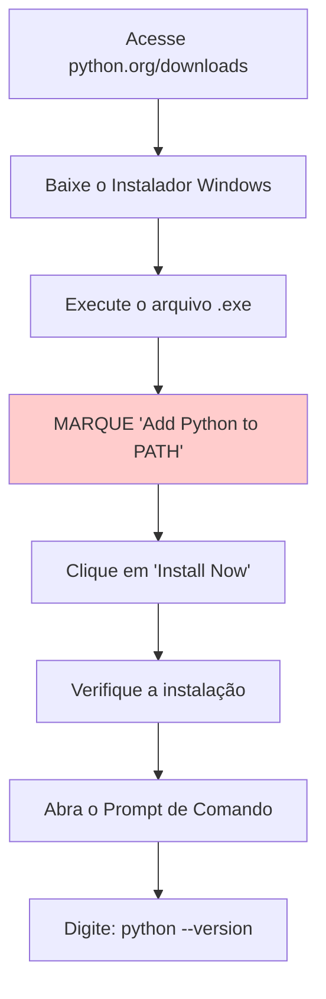
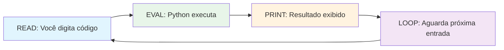
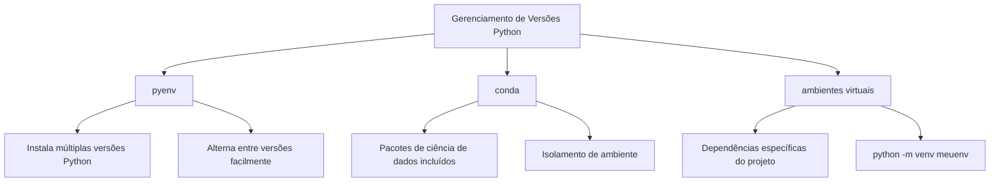

# Configuração do Python e Primeiro Programa

Bem-vindo à sua primeira lição prática de Python! Nesta lição, você instalará Python, escreverá seu primeiro programa e aprenderá diferentes formas de executar código Python.

## Instalando o Python

Python está disponível para todos os principais sistemas operacionais. Vamos configurar seu ambiente.

### Verificando se Python Já Está Instalado

Muitos sistemas vêm com Python pré-instalado. Abra seu terminal ou prompt de comando e digite:

```bash
python3 --version
# ou no Windows:
python --version
```

Saída esperada:
```
Python 3.11.4
```

> [!NOTE]
> Este curso requer Python 3.8 ou superior. Se você tiver uma versão mais antiga ou Python não estiver instalado, siga os passos de instalação abaixo.

### Instalando no Windows



**Passo a passo:**

1. Acesse [python.org/downloads](https://www.python.org/downloads/)
2. Clique em "Download Python 3.x.x" (última versão)
3. Execute o instalador baixado
4. **IMPORTANTE:** Marque "Add Python to PATH" na parte inferior
5. Clique em "Install Now"
6. Verifique abrindo o Prompt de Comando e digitando `python --version`

### Instalando no macOS

```bash
# Opção 1: Usando Homebrew (recomendado)
brew install python3

# Opção 2: Baixar do python.org
# Acesse https://www.python.org/downloads/macos/
```

Verifique a instalação:
```bash
python3 --version
```

### Instalando no Linux (Ubuntu/Debian)

```bash
# Atualize a lista de pacotes
sudo apt update

# Instale Python 3
sudo apt install python3 python3-pip

# Verifique a instalação
python3 --version
```

> [!TIP]
> No Linux, você pode já ter Python instalado. Use `python3` em vez de `python` para garantir que está usando Python 3.

## O REPL Python

REPL significa Read-Eval-Print Loop (Loop de Leitura-Avaliação-Impressão). É um ambiente interativo onde você pode digitar código Python e ver os resultados imediatamente.

### Iniciando o REPL

```bash
# Windows
python

# macOS/Linux
python3
```

Você verá algo como:
```
Python 3.11.4 (main, Jun  1 2024, 00:00:00) [GCC 11.3.0] on linux
Type "help", "copyright", "credits" or "license" for more information.
>>>
```

### Usando o REPL

```python
# O >>> é o prompt. Digite código após ele.
>>> 2 + 2
4

>>> "Olá, Mundo!"
'Olá, Mundo!'

>>> nome = "Alice"
>>> nome
'Alice'

>>> len(nome)
5

>>> type(42)
<class 'int'>

>>> type("ola")
<class 'str'>
```



### Saindo do REPL

```python
# Método 1: Use exit()
>>> exit()

# Método 2: Use Ctrl+D (macOS/Linux) ou Ctrl+Z depois Enter (Windows)
```

> [!TIP]
> O REPL é perfeito para testar pequenos trechos de código, explorar funcionalidades do Python e fazer cálculos rápidos. Use-o frequentemente enquanto aprende!

## Seu Primeiro Programa Python: Olá Mundo

A tradição em programação é começar com um programa "Olá, Mundo!". Vamos criar o seu.

### Usando um Editor de Texto

Crie um novo arquivo chamado `ola.py` com o seguinte conteúdo:

```python
# ola.py - Meu primeiro programa Python
print("Olá, Mundo!")
```

É isso! Uma linha de código. Vamos entender:

| Parte | Propósito |
|-------|-----------|
| `#` | Inicia um comentário (ignorado pelo Python) |
| `print()` | Uma função embutida que exibe saída |
| `"Olá, Mundo!"` | Uma string (texto) para exibir |

### Executando Seu Script

```bash
# Navegue até a pasta onde ola.py está salvo
cd caminho/para/sua/pasta

# Execute o script
python3 ola.py
```

Saída:
```
Olá, Mundo!
```

```mermaid
flowchart TD
    A[Arquivo ola.py] --> B[Interpretador Python]
    B --> C[Lê: print"Olá, Mundo!"]
    C --> D[Executa a função print]
    D --> E[Exibe: Olá, Mundo!]
    E --> F[Programa termina]
```

## Executando Scripts Python

Existem múltiplas formas de executar código Python. Vamos explorar todas elas.

### Método 1: Execução Direta de Script

```bash
python3 script.py
```

### Método 2: Executando como Módulo

```bash
python3 -m script
```

### Método 3: Tornando um Script Executável (Linux/macOS)

```python
#!/usr/bin/env python3
# ola.py

print("Olá, Mundo!")
```

```bash
# Torne o arquivo executável
chmod +x ola.py

# Execute-o diretamente
./ola.py
```

### Método 4: Usando uma IDE

IDEs e editores populares para Python:

| IDE/Editor | Tipo | Ideal Para |
|------------|------|------------|
| VS Code | Editor gratuito | Uso geral |
| PyCharm | IDE Gratuita/Paga | Desenvolvimento profissional |
| Thonny | IDE Gratuita | Iniciantes |
| Jupyter Notebook | Baseado na web | Ciência de dados, exploração |
| IDLE | Incluído com Python | Testes simples |

> [!NOTE]
> Para este curso, qualquer editor de texto funciona. VS Code com a extensão Python é recomendado por sua simplicidade e recursos poderosos.

## Comentários em Python

Comentários são notas no seu código que Python ignora. Eles ajudam a explicar o que seu código faz.

### Comentários de Uma Linha

```python
# Este é um comentário de uma linha
print("Olá")  # Este é um comentário inline
```

### Comentários de Múltiplas Linhas

```python
# Este é um comentário
# que ocupa várias linhas
# explicando lógica complexa
print("Olá")

# Ou use aspas triplas (tecnicamente uma string, mas frequentemente usada como comentário)
"""
Este é um comentário de múltiplas linhas
usando aspas triplas.
É frequentemente usado para documentação.
"""
print("Olá")
```

## Trabalhando com Entrada e Saída

Vamos tornar nosso programa interativo recebendo entrada do usuário.

### A Função input()

```python
# saudacao.py
nome = input("Qual é o seu nome? ")
print(f"Olá, {nome}! Bem-vindo ao Python!")
```

Executando este script:
```
$ python3 saudacao.py
Qual é o seu nome? Alice
Olá, Alice! Bem-vindo ao Python!
```

> [!WARNING]
> A função `input()` sempre retorna uma string. Se você precisar de um número, deve convertê-lo usando `int()` ou `float()`.

### Exemplo Completo: Calculadora Simples

```python
# calculadora_simples.py
# Uma calculadora simples que soma dois números

# Obtém entrada do usuário
print("=== Calculadora de Adição Simples ===")
num1 = float(input("Digite o primeiro número: "))
num2 = float(input("Digite o segundo número: "))

# Realiza o cálculo
resultado = num1 + num2

# Exibe o resultado
print(f"{num1} + {num2} = {resultado}")
```

Saída de exemplo:
```
=== Calculadora de Adição Simples ===
Digite o primeiro número: 15.5
Digite o segundo número: 7.3
15.5 + 7.3 = 22.8
```

## Entendendo Extensões de Arquivo

Arquivos Python usam a extensão `.py`. Veja o que diferentes tipos de arquivos Python significam:

| Extensão | Descrição |
|----------|-----------|
| `.py` | Arquivo de código fonte Python |
| `.pyc` | Bytecode Python compilado (gerado automaticamente) |
| `.pyw` | Script Python sem janela de console (Windows) |
| `.pyi` | Arquivo stub Python para dicas de tipo |

## Gerenciamento de Versões Python

Conforme você avança, pode precisar de múltiplas versões do Python. Aqui estão ferramentas para gerenciá-las:



### Criando um Ambiente Virtual

```bash
# Crie um ambiente virtual
python3 -m venv meuenv

# Ative-o (Linux/macOS)
source meuenv/bin/activate

# Ative-o (Windows)
meuenv\Scripts\activate

# Agora python aponta para o Python do ambiente
python --version

# Desative quando terminar
deactivate
```

> [!TIP]
> Sempre use ambientes virtuais para seus projetos. Eles mantêm dependências isoladas e previnem conflitos entre projetos.

## Exemplo do Mundo Real: Script de Informações do Sistema

Vamos criar um script útil que exibe informações do sistema:

```python
# info_sistema.py
import platform
import sys
import os

def exibir_info_sistema():
    """Exibe informações básicas do sistema."""
    print("=" * 40)
    print("       INFORMAÇÕES DO SISTEMA")
    print("=" * 40)
    print(f"Versão Python: {sys.version}")
    print(f"Sistema Operacional: {platform.system()} {platform.release()}")
    print(f"Máquina: {platform.machine()}")
    print(f"Processador: {platform.processor()}")
    print(f"Diretório Atual: {os.getcwd()}")
    print(f"Caminho Python: {sys.executable}")
    print("=" * 40)

if __name__ == "__main__":
    exibir_info_sistema()
```

Saída de exemplo:
```
========================================
       INFORMAÇÕES DO SISTEMA
========================================
Versão Python: 3.11.4 (main, Jun  1 2024, 00:00:00) [GCC 11.3.0]
Sistema Operacional: Linux 5.15.0-91-generic
Máquina: x86_64
Processador: x86_64
Diretório Atual: /home/user/projects
Caminho Python: /usr/bin/python3
========================================
```

## Exercícios Práticos

### Exercício 1: Verificação de Instalação
Verifique se Python está instalado corretamente executando `python3 --version` e `pip3 --version` no seu terminal.

### Exercício 2: Exploração do REPL
Abra o REPL Python e tente o seguinte:
- Calcule `17 * 23`
- Encontre o comprimento da string "Programação Python"
- Verifique o tipo de `3.14`
- Use `help(print)` para ver a documentação da função print

### Exercício 3: Saudação Personalizada
Crie um script chamado `saudacao.py` que pergunta o nome e a idade do usuário, depois imprime uma saudação personalizada incluindo o ano em que nasceu.

### Exercício 4: Conversor de Temperatura
Escreva um script que pede uma temperatura em Celsius e converte para Fahrenheit usando a fórmula: `F = C * 9/5 + 32`

### Exercício 5: Saída Multi-linha
Crie um script que imprime uma arte ASCII ou padrão simples usando múltiplos comandos print:
```
  *
 ***
*****
 ***
  *
```

### Exercício 6: Ambiente Virtual
Crie um ambiente virtual, ative-o, verifique se está ativo e depois desative-o.

### Exercício 7: Prática de Comentários
Escreva um script com pelo menos 5 linhas de código e adicione comentários significativos explicando cada passo.

### Exercício 8: Exploração de Erros
No REPL, tente estes e observe as mensagens de erro:
- `print("ola"` (parêntese de fechamento faltando)
- `2 + "dois"` (somando número e string)
- `prnt("ola")` (erro de digitação no nome da função)

## Resumo

Nesta lição, você aprendeu:
- Como instalar Python no Windows, macOS e Linux
- Como usar o REPL Python para codificação interativa
- Como escrever e executar seu primeiro script Python
- Diferentes métodos para executar código Python
- Como usar comentários para documentar seu código
- Como obter entrada do usuário com `input()`
- Como criar e usar ambientes virtuais
- Como construir scripts práticos

Você está pronto para começar a escrever programas Python! A próxima lição mergulhará em variáveis e tipos de dados.
