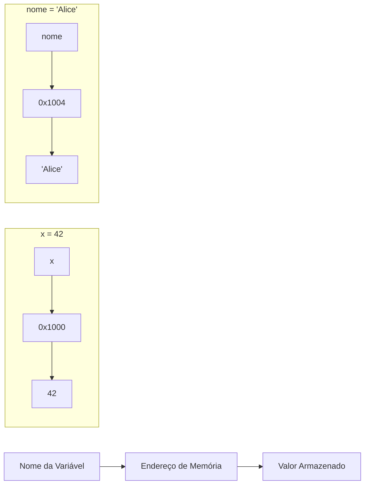
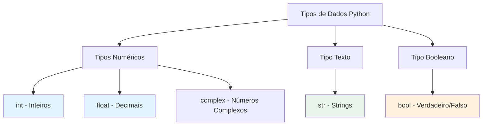
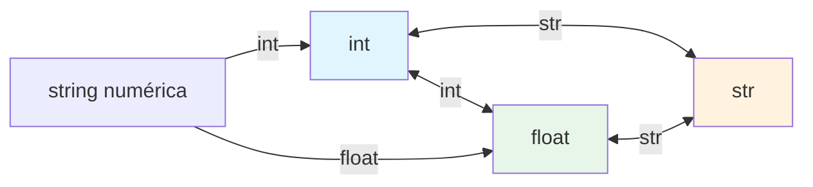

# Variáveis e Tipos de Dados

Variáveis são a base de todo programa. Elas armazenam dados que seu programa manipula. Em Python, trabalhar com variáveis é intuitivo e flexível.

## O que é uma Variável?

Uma variável é uma localização nomeada na memória que armazena um valor. Pense nela como uma caixa etiquetada onde você pode colocar diferentes itens.



### Criando Variáveis em Python

```python
# Atribuição de variáveis
idade = 25
nome = "Alice"
altura = 1.75
estudante = True

# Atribuição múltipla
x, y, z = 10, 20, 30
a = b = c = 0

# Exibindo variáveis
print(f"Nome: {nome}")
print(f"Idade: {idade}")
print(f"Altura: {altura}m")
print(f"Estudante: {estudante}")
```

Saída:
```
Nome: Alice
Idade: 25
Altura: 1.75m
Estudante: True
```

> [!NOTE]
> Diferente de linguagens como C ou Java, Python não exige que você declare o tipo de uma variável. Python infere o tipo a partir do valor que você atribui. Isso é chamado de "tipagem dinâmica".

## Tipos de Dados Primitivos do Python

Python possui vários tipos de dados embutidos. Vamos explorar os quatro mais fundamentais.

### Visão Geral dos Tipos de Dados



| Tipo | Nome Python | Exemplo | Descrição |
|------|-------------|---------|-----------|
| Inteiro | `int` | `42`, `-7`, `0` | Números inteiros (positivos, negativos, zero) |
| Ponto Flutuante | `float` | `3.14`, `-0.5`, `2.0` | Números decimais |
| String | `str` | `"ola"`, `'mundo'` | Texto/caracteres |
| Booleano | `bool` | `True`, `False` | Valores de verdade |

## Inteiros (int)

Inteiros representam números inteiros sem ponto decimal.

### Operações com Inteiros

```python
# Criando inteiros
positivo = 100
negativo = -50
zero = 0
numero_grande = 1_000_000  # Underscores para legibilidade

# Aritmética com inteiros
a = 15
b = 4

print(f"Adição: {a} + {b} = {a + b}")        # 19
print(f"Subtração: {a} - {b} = {a - b}")     # 11
print(f"Multiplicação: {a} * {b} = {a * b}") # 60
print(f"Divisão: {a} / {b} = {a / b}")       # 3.75 (retorna float!)
print(f"Divisão Inteira: {a} // {b} = {a // b}") # 3
print(f"Módulo: {a} % {b} = {a % b}")        # 3
print(f"Exponenciação: {a} ** {b} = {a ** b}") # 50625
```

Saída:
```
Adição: 15 + 4 = 19
Subtração: 15 - 4 = 11
Multiplicação: 15 * 4 = 60
Divisão: 15 / 4 = 3.75
Divisão Inteira: 15 // 4 = 3
Módulo: 15 % 4 = 3
Exponenciação: 15 ** 4 = 50625
```

> [!TIP]
> Inteiros Python têm precisão ilimitada! Você pode trabalhar com números tão grandes quanto sua memória permitir:
> ```python
> >>> 2 ** 1000
> 107150860718626732094842504906000181056140481170553360744375038837...
> ```

## Ponto Flutuante (float)

Floats representam números com ponto decimal.

### Operações com Float e Precisão

```python
# Criando floats
pi = 3.14159
temperatura = -5.5
cientifico = 6.022e23  # Notação científica: 6.022 × 10²³

# Operações com float
x = 10.5
y = 3.2

print(f"Adição: {x + y}")       # 13.7
print(f"Multiplicação: {x * y}") # 33.6

# Cuidado com precisão de float
print(f"\n0.1 + 0.2 = {0.1 + 0.2}")  # 0.30000000000000004 (!)
print(f"0.1 + 0.2 == 0.3: {0.1 + 0.2 == 0.3}")  # False!
```

Saída:
```
Adição: 13.7
Multiplicação: 33.6

0.1 + 0.2 = 0.30000000000000004
0.1 + 0.2 == 0.3: False
```

> [!WARNING]
> Aritmética de ponto flutuante pode ter problemas de precisão devido a como computadores representam decimais em binário. Para cálculos financeiros, use o módulo `decimal` em vez de floats.

```python
# Usando decimal para cálculos precisos
from decimal import Decimal

a = Decimal('0.1')
b = Decimal('0.2')
print(f"Decimal: {a + b}")  # 0.3 (exato!)
```

## Strings (str)

Strings representam texto e são delimitadas por aspas.

### Criando e Usando Strings

```python
# Diferentes formas de criar strings
aspas_simples = 'Olá'
aspas_duplas = "Mundo"
aspas_triplas = """Esta é uma
string multi-linha"""

# Operações com strings
primeiro_nome = "Alice"
sobrenome = "Silva"

# Concatenação
nome_completo = primeiro_nome + " " + sobrenome
print(f"Nome completo: {nome_completo}")

# Repetição
separador = "-" * 30
print(separador)

# Comprimento da string
mensagem = "Programação Python"
print(f"Comprimento: {len(mensagem)}")  # 18

# Acessando caracteres (indexação)
palavra = "Python"
print(f"Primeiro caractere: {palavra[0]}")   # P
print(f"Último caractere: {palavra[-1]}")    # n
print(f"Terceiro caractere: {palavra[2]}")   # t
```

Saída:
```
Nome completo: Alice Silva
------------------------------
Comprimento: 18
Primeiro caractere: P
Último caractere: n
Terceiro caractere: t
```

### Métodos de String

```python
texto = "  Olá, Mundo!  "

print(f"Original: '{texto}'")
print(f"Maiúsculas: '{texto.upper()}'")
print(f"Minúsculas: '{texto.lower()}'")
print(f"Title: '{texto.title()}'")
print(f"Strip: '{texto.strip()}'")
print(f"Replace: '{texto.replace('Mundo', 'Python')}'")
print(f"Split: {texto.strip().split(',')}")
```

Saída:
```
Original: '  Olá, Mundo!  '
Maiúsculas: '  OLÁ, MUNDO!  '
Minúsculas: '  olá, mundo!  '
Title: '  Olá, Mundo!  '
Strip: 'Olá, Mundo!'
Replace: '  Olá, Python!  '
Split: ['Olá', 'Mundo!']
```

### F-Strings (Strings Formatadas)

```python
nome = "Alice"
idade = 30
nota = 95.678

# F-string básica
print(f"Meu nome é {nome} e tenho {idade} anos.")

# Expressões em f-strings
print(f"Ano que vem terei {idade + 1}.")

# Formatando números
print(f"Nota: {nota:.2f}")      # 2 casas decimais: 95.68
print(f"Alinhado à direita: {nome:>10}")   # Alinhado à direita em 10 chars
print(f"Centralizado: {nome:^10}")         # Centralizado
```

Saída:
```
Meu nome é Alice e tenho 30 anos.
Ano que vem terei 31.
Nota: 95.68
Alinhado à direita:      Alice
Centralizado:  Alice   
```

## Booleanos (bool)

Booleanos representam valores de verdade: `True` (verdadeiro) ou `False` (falso).

### Fundamentos Booleanos

```python
# Valores booleanos
ativo = True
admin = False

print(f"Ativo: {ativo}")       # True
print(f"Admin: {admin}")       # False
print(f"Tipo: {type(ativo)}")  # <class 'bool'>

# Booleanos de comparações
x = 10
y = 20

print(f"\n{x} > {y}: {x > y}")      # False
print(f"{x} < {y}: {x < y}")        # True
print(f"{x} == {y}: {x == y}")      # False
print(f"{x} != {y}: {x != y}")      # True
print(f"{x} >= 10: {x >= 10}")      # True
```

### Verdadeiridade em Python

```python
# Python avalia muitos valores como True ou False em contexto booleano
print(f"bool(1): {bool(1)}")         # True
print(f"bool(0): {bool(0)}")         # False
print(f"bool('ola'): {bool('ola')}") # True
print(f"bool(''): {bool('')}")       # False
print(f"bool([]): {bool([])}")       # False (lista vazia)
print(f"bool([1, 2]): {bool([1, 2])}") # True (lista não vazia)
print(f"bool(None): {bool(None)}")   # False
```

> [!NOTE]
> Em Python, os seguintes são considerados "falsy": `False`, `None`, `0`, `0.0`, `""`, `[]`, `{}`, `set()`. Todo o resto é "truthy".

## Conversão de Tipos (Casting)

Frequentemente você precisa converter entre tipos. Python fornece funções embutidas para isso.

### Convertendo Entre Tipos



```python
# String para int
idade_str = "25"
idade_int = int(idade_str)
print(f"int('25') = {idade_int}")        # 25
print(f"Tipo: {type(idade_int)}")        # <class 'int'>

# String para float
preco_str = "19.99"
preco_float = float(preco_str)
print(f"float('19.99') = {preco_float}") # 19.99

# Int/float para string
numero = 42
numero_str = str(numero)
print(f"str(42) = '{numero_str}'")       # '42'

# Float para int (trunca, não arredonda!)
pi = 3.14159
pi_int = int(pi)
print(f"int(3.14159) = {pi_int}")       # 3

# Booleano para int/float
print(f"int(True) = {int(True)}")        # 1
print(f"int(False) = {int(False)}")      # 0
print(f"float(True) = {float(True)}")    # 1.0
```

### Exemplo Prático: Conversão de Entrada

```python
# calculadora_entrada.py
# Obtendo entrada numérica do usuário

print("=== Calculadora de Área do Retângulo ===")

# input() sempre retorna string, então devemos converter
largura_str = input("Digite a largura: ")
altura_str = input("Digite a altura: ")

# Converte strings para floats
largura = float(largura_str)
altura = float(altura_str)

# Calcula área
area = largura * altura

print(f"\nDimensões do Retângulo:")
print(f"  Largura: {largura}")
print(f"  Altura: {altura}")
print(f"  Área: {area}")
```

Saída de exemplo:
```
=== Calculadora de Área do Retângulo ===
Digite a largura: 5.5
Digite a altura: 3.2

Dimensões do Retângulo:
  Largura: 5.5
  Altura: 3.2
  Área: 17.6
```

## Convenções de Nomenclatura de Variáveis

Python tem regras e convenções específicas para nomear variáveis.

### Regras (Obrigatório Seguir)

| Regra | Válido | Inválido |
|-------|--------|----------|
| Começar com letra ou underscore | `nome`, `_idade` | `1nome`, `2o` |
| Apenas letras, números, underscores | `nome_usuario`, `var2` | `nome-usuario`, `var@2` |
| Sensível a maiúsculas/minúsculas | `idade`, `Idade`, `IDADE` são diferentes | - |
| Não pode ser palavra reservada | - | `if`, `for`, `class`, `def` |

### Convenções (Deve Seguir)

```python
# Snake case para variáveis (recomendado)
nome_usuario = "Alice"
valor_total = 100.50
esta_ativo = True

# Constantes (todas maiúsculas)
PI = 3.14159
MAX_TENTATIVAS = 3
CHAVE_API = "secreto123"

# Variáveis privadas (underscore inicial - apenas convenção)
_valor_interno = 42
_dados_temp = []

# Nomes ruins - evite estes!
x = 10           # Muito vago
temp123 = "oi"   # Não descritivo
nomeVariavel = "Alice"  # camelCase não é padrão em Python
```

> [!TIP]
> Escolha nomes descritivos! `idade_estudante` é muito melhor que `ie` ou `x`. Seu eu futuro (e outros desenvolvedores) agradecerão.

## Verificando Tipos com type() e isinstance()

```python
# Usando type()
valor1 = 42
valor2 = 3.14
valor3 = "ola"
valor4 = True

print(f"type(42) = {type(valor1)}")         # <class 'int'>
print(f"type(3.14) = {type(valor2)}")       # <class 'float'>
print(f"type('ola') = {type(valor3)}")      # <class 'str'>
print(f"type(True) = {type(valor4)}")       # <class 'bool'>

# Usando isinstance() para verificação de tipo
print(f"\nisinstance(42, int): {isinstance(42, int)}")           # True
print(f"isinstance(3.14, int): {isinstance(3.14, int)}")         # False
print(f"isinstance(3.14, float): {isinstance(3.14, float)}")     # True
print(f"isinstance(True, int): {isinstance(True, int)}")         # True (bool é subclasse de int!)
```

## Exemplo do Mundo Real: Sistema de Registro de Estudantes

```python
# registro_estudante.py
# Um registro simples de estudante usando diferentes tipos de dados

# Informações do estudante
id_estudante = 1001                  # int
nome = "Maria Santos"                # str
idade = 22                           # int
media = 3.85                         # float
matriculado = True                   # bool
cursos = ["Matemática", "Física", "CC"]  # list

# Exibir registro do estudante
print("=" * 40)
print("       REGISTRO DO ESTUDANTE")
print("=" * 40)
print(f"ID do Estudante: {id_estudante}")
print(f"Nome: {nome}")
print(f"Idade: {idade}")
print(f"Média: {media:.2f}")
print(f"Matriculado: {'Sim' if matriculado else 'Não'}")
print(f"Cursos: {', '.join(cursos)}")
print("=" * 40)

# Resumo de tipos
print("\nTipos de Dados Usados:")
print(f"  id_estudante: {type(id_estudante).__name__}")
print(f"  nome: {type(nome).__name__}")
print(f"  idade: {type(idade).__name__}")
print(f"  media: {type(media).__name__}")
print(f"  matriculado: {type(matriculado).__name__}")
```

Saída:
```
========================================
       REGISTRO DO ESTUDANTE
========================================
ID do Estudante: 1001
Nome: Maria Santos
Idade: 22
Média: 3.85
Matriculado: Sim
Cursos: Matemática, Física, CC
========================================

Tipos de Dados Usados:
  id_estudante: int
  nome: str
  idade: int
  media: float
  matriculado: bool
```

## Exercícios Práticos

### Exercício 1: Identificação de Tipos
Identifique o tipo de cada valor:
- `42`
- `"42"`
- `42.0`
- `True`
- `"True"`
- `0`

### Exercício 2: Criação de Variáveis
Crie variáveis para um produto: nome (str), preço (float), quantidade (int) e em_estoque (bool). Imprima um resumo.

### Exercício 3: Conversão de Tipos
Converta a string `"3.14159"` para float, depois para int. O que acontece com a parte decimal?

### Exercício 4: Operações com String
Dado `texto = "Programação Python"`, escreva código para:
- Obter o comprimento
- Converter para maiúsculas
- Substituir "Python" por "Java"
- Obter os primeiros 6 caracteres

### Exercício 5: Formatação F-String
Crie uma f-string que exibe um preço de R$19,99 com 2 casas decimais, alinhado à direita em 10 caracteres.

### Exercício 6: Correção de Convenção de Nomes
Corrija estes nomes de variáveis para seguir as convenções Python:
- `minhaVariavelNome`
- `2oLugar`
- `usuario-email`
- `TOTALIMPOSTO`

### Exercício 7: Programa de Conversão de Temperatura
Escreva um programa que converte Celsius para Fahrenheit e Kelvin:
- F = C × 9/5 + 32
- K = C + 273.15

### Exercício 8: Função Verificadora de Tipo
Escreva uma função que recebe qualquer valor e imprime seu tipo e se é truthy ou falsy.

## Resumo

Nesta lição, você aprendeu:
- Como criar e usar variáveis em Python
- Os quatro tipos de dados primitivos: int, float, str, bool
- Operações aritméticas e seu comportamento com diferentes tipos
- Operações com strings, métodos e formatação f-string
- Valores booleanos e verdadeiridade em Python
- Conversão de tipos entre diferentes tipos de dados
- Regras e convenções de nomenclatura de variáveis
- Como verificar tipos usando `type()` e `isinstance()`

Variáveis e tipos de dados são os blocos de construção de todo programa Python. Domine estes fundamentos antes de prosseguir para operadores e expressões.
