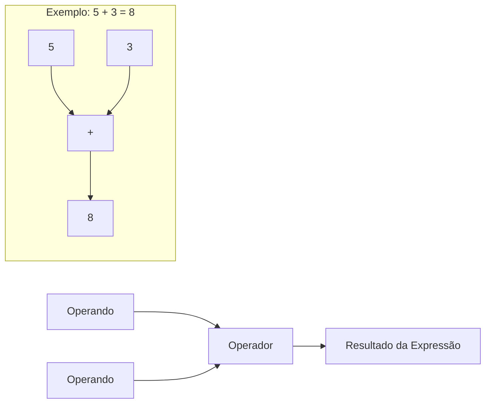
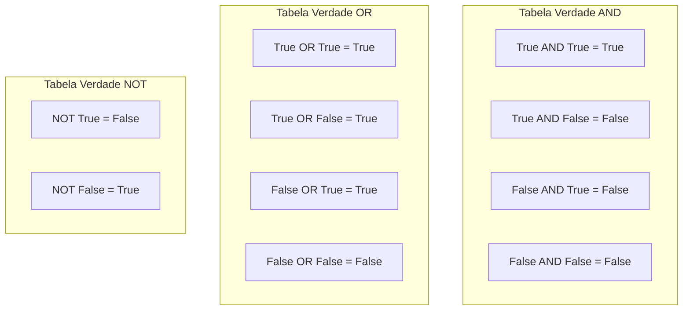

# Operadores e Expressões

Operadores são símbolos que realizam operações sobre valores e variáveis. Expressões combinam operadores e operandos para produzir resultados. Esta lição cobre todos os operadores Python que você precisa conhecer.

## O que São Operadores e Expressões?



Uma **expressão** é qualquer combinação de valores, variáveis e operadores que avalia para um único valor.

```python
# Expressões simples
5 + 3           # 8
x * 2           # depende de x
idade >= 18     # True ou False

# Expressões complexas
resultado = (x + y) * (z - 1) / 2
valido = idade >= 18 and tem_identificacao == True
```

## Operadores Aritméticos

Operadores aritméticos realizam cálculos matemáticos.

### Referência de Operadores Aritméticos

| Operador | Nome | Exemplo | Resultado |
|----------|------|---------|-----------|
| `+` | Adição | `10 + 3` | `13` |
| `-` | Subtração | `10 - 3` | `7` |
| `*` | Multiplicação | `10 * 3` | `30` |
| `/` | Divisão | `10 / 3` | `3.333...` |
| `//` | Divisão Inteira | `10 // 3` | `3` |
| `%` | Módulo (Resto) | `10 % 3` | `1` |
| `**` | Exponenciação | `10 ** 3` | `1000` |

### Aritmética em Ação

```python
# Aritmética básica
a = 17
b = 5

print(f"a = {a}, b = {b}\n")
print(f"Adição:       {a} + {b} = {a + b}")
print(f"Subtração:    {a} - {b} = {a - b}")
print(f"Multiplicação: {a} * {b} = {a * b}")
print(f"Divisão:       {a} / {b} = {a / b}")
print(f"Divisão Inteira: {a} // {b} = {a // b}")
print(f"Módulo:        {a} % {b} = {a % b}")
print(f"Exponenciação: {a} ** {b} = {a ** b}")
```

Saída:
```
a = 17, b = 5

Adição:       17 + 5 = 22
Subtração:    17 - 5 = 12
Multiplicação: 17 * 5 = 85
Divisão:       17 / 5 = 3.4
Divisão Inteira: 17 // 5 = 3
Módulo:        17 % 5 = 2
Exponenciação: 17 ** 5 = 1419857
```

### Uso Prático de Módulo e Divisão Inteira

```python
# Conversão de tempo: segundos para horas, minutos, segundos
total_segundos = 10000

horas = total_segundos // 3600
restante = total_segundos % 3600
minutos = restante // 60
segundos = restante % 60

print(f"{total_segundos} segundos = {horas}h {minutos}m {segundos}s")
# Saída: 10000 segundos = 2h 46m 40s

# Verificar se um número é par ou ímpar
def verificar_par_impar(numero):
    if numero % 2 == 0:
        return f"{numero} é par"
    else:
        return f"{numero} é ímpar"

print(verificar_par_impar(42))  # 42 é par
print(verificar_par_impar(17))  # 17 é ímpar
```

## Operadores de Comparação

Operadores de comparação comparam dois valores e retornam um resultado booleano.

### Referência de Operadores de Comparação

| Operador | Nome | Exemplo | Resultado |
|----------|------|---------|-----------|
| `==` | Igual | `5 == 5` | `True` |
| `!=` | Diferente | `5 != 3` | `True` |
| `>` | Maior que | `5 > 3` | `True` |
| `<` | Menor que | `5 < 3` | `False` |
| `>=` | Maior ou igual | `5 >= 5` | `True` |
| `<=` | Menor ou igual | `5 <= 3` | `False` |

### Comparação em Ação

```python
x = 10
y = 20

print(f"x = {x}, y = {y}\n")
print(f"x == y: {x == y}")   # False
print(f"x != y: {x != y}")   # True
print(f"x > y:  {x > y}")    # False
print(f"x < y:  {x < y}")    # True
print(f"x >= y: {x >= y}")   # False
print(f"x <= y: {x <= y}")   # True

# Encadeamento de comparações (recurso do Python!)
idade = 25
print(f"\n18 <= {idade} <= 65: {18 <= idade <= 65}")  # True
print(f"0 <= {idade} <= 18: {0 <= idade <= 18}")      # False
```

> [!TIP]
> Python permite encadear comparações! `18 <= idade <= 65` é equivalente a `18 <= idade and idade <= 65`, mas mais legível.

### Exemplo do Mundo Real: Verificação de Idade

```python
def verificar_acesso(idade, tem_ingresso, e_vip):
    """Determina se uma pessoa pode entrar em um evento."""
    
    # Verificação de idade
    idade_ok = idade >= 18
    
    # Lógica de acesso
    if e_vip:
        acesso = idade_ok  # VIPs precisam apenas da verificação de idade
        motivo = "Acesso VIP concedido"
    elif tem_ingresso:
        acesso = idade_ok
        motivo = "Portador de ingresso" if idade_ok else "Menor de idade"
    else:
        acesso = False
        motivo = "Sem ingresso"
    
    return acesso, motivo

# Casos de teste
print(verificar_acesso(25, True, False))   # (True, 'Portador de ingresso')
print(verificar_acesso(16, True, False))   # (False, 'Menor de idade')
print(verificar_acesso(17, False, True))   # (False, 'Acesso VIP concedido')
print(verificar_acesso(30, False, True))   # (True, 'Acesso VIP concedido')
```

## Operadores Lógicos

Operadores lógicos combinam expressões booleanas.

### Referência de Operadores Lógicos

| Operador | Descrição | Exemplo | Resultado |
|----------|-----------|---------|-----------|
| `and` | True se ambos forem True | `True and False` | `False` |
| `or` | True se pelo menos um for True | `True or False` | `True` |
| `not` | Inverte o booleano | `not True` | `False` |

### Tabelas Verdade



### Operadores Lógicos em Ação

```python
# AND: Ambas condições devem ser True
idade = 25
tem_id = True

pode_entrar = idade >= 18 and tem_id
print(f"Pode entrar (AND): {pode_entrar}")  # True

# OR: Pelo menos uma condição deve ser True
eh_fim_de_semana = False
eh_feriado = True

nao_trabalho = eh_fim_de_semana or eh_feriado
print(f"Não trabalho hoje (OR): {nao_trabalho}")  # True

# NOT: Inverte o resultado
esta_chovendo = False
precisa_guarda_chuva = esta_chovendo
print(f"Precisa guarda-chuva: {precisa_guarda_chuva}")  # False
```

### Avaliação de Curto-Circuito

```python
# AND faz curto-circuito: se o primeiro é False, o segundo não é avaliado
def verificar():
    print("  verificar() foi chamado!")
    return True

resultado = False and verificar()  # verificar() NÃO é chamado
print(f"Resultado: {resultado}")

resultado = True and verificar()   # verificar() É chamado
print(f"Resultado: {resultado}")
```

Saída:
```
Resultado: False
  verificar() foi chamado!
Resultado: True
```

> [!NOTE]
> Avaliação de curto-circuito é útil para evitar erros:
> ```python
> # Divisão segura
> if divisor != 0 and (numerador / divisor) > 10:
>     print("Resultado grande")
> ```

## Operadores de Atribuição

Operadores de atribuição atribuem e atualizam valores de variáveis.

### Referência de Operadores de Atribuição

| Operador | Exemplo | Equivalente a |
|----------|---------|---------------|
| `=` | `x = 5` | `x = 5` |
| `+=` | `x += 3` | `x = x + 3` |
| `-=` | `x -= 3` | `x = x - 3` |
| `*=` | `x *= 3` | `x = x * 3` |
| `/=` | `x /= 3` | `x = x / 3` |
| `//=` | `x //= 3` | `x = x // 3` |
| `%=` | `x %= 3` | `x = x % 3` |
| `**=` | `x **= 3` | `x = x ** 3` |

### Atribuição em Ação

```python
# Atribuição básica
pontuacao = 100
print(f"Pontuação inicial: {pontuacao}")

# Atribuição aumentada
pontuacao += 10   # Adiciona 10
print(f"Após += 10: {pontuacao}")   # 110

pontuacao -= 20   # Subtrai 20
print(f"Após -= 20: {pontuacao}")   # 90

pontuacao *= 2    # Multiplica por 2
print(f"Após *= 2: {pontuacao}")    # 180

pontuacao /= 3    # Divide por 3
print(f"Após /= 3: {pontuacao}")    # 60.0 (vira float!)

pontuacao //= 7   # Divisão inteira por 7
print(f"Após //= 7: {pontuacao}")   # 8.0

pontuacao **= 2   # Eleva ao quadrado
print(f"Após **= 2: {pontuacao}")   # 64.0
```

### Exemplo Prático: Total Acumulado

```python
# Total do carrinho de compras
total_carrinho = 0

# Adiciona itens
total_carrinho += 29.99   # Livro
print(f"Após livro: R${total_carrinho:.2f}")

total_carrinho += 149.90  # Fone de ouvido
print(f"Após fone: R${total_carrinho:.2f}")

total_carrinho += 5.50    # Café
print(f"Após café: R${total_carrinho:.2f}")

# Aplica desconto de 10%
total_carrinho *= 0.90
print(f"Após 10% desconto: R${total_carrinho:.2f}")
```

Saída:
```
Após livro: R$29.99
Após fone: R$179.89
Após café: R$185.39
Após 10% desconto: R$166.85
```

## Operadores de Identidade

Operadores de identidade verificam se duas variáveis referenciam o mesmo objeto na memória.

### Identidade vs Igualdade

```python
a = [1, 2, 3]
b = [1, 2, 3]
c = a

print(f"a = {a}")
print(f"b = {b}")
print(f"c = {c}\n")

# Igualdade: mesmo valor?
print(f"a == b: {a == b}")   # True (mesmos valores)
print(f"a == c: {a == c}")   # True (mesmos valores)

# Identidade: mesmo objeto na memória?
print(f"a is b: {a is b}")   # False (objetos diferentes)
print(f"a is c: {a is c}")   # True (mesmo objeto!)
print(f"a is not b: {a is not b}")  # True
```

> [!WARNING]
> Use `==` para comparar valores. Use `is` apenas quando verificar `None` ou comparar com singletons:
> ```python
> # Correto
> if valor is None:
>     ...
> 
> # Incorreto (pode funcionar mas é má prática)
> if valor is 5:
>     ...
> ```

## Operadores de Associação

Operadores de associação verificam se um valor existe em uma sequência.

### Referência de Operadores de Associação

| Operador | Descrição | Exemplo |
|----------|-----------|---------|
| `in` | True se valor for encontrado | `'a' in 'maca'` → `True` |
| `not in` | True se valor NÃO for encontrado | `'z' not in 'maca'` → `True` |

### Associação em Ação

```python
# Associação em string
texto = "Programação Python"
print(f"'Py' in texto: {'Py' in texto}")           # True
print(f"'Java' in texto: {'Java' in texto}")        # False
print(f"'x' not in texto: {'x' not in texto}")      # True

# Associação em lista
frutas = ["maca", "banana", "cereja"]
print(f"'maca' in frutas: {'maca' in frutas}")         # True
print(f"'uva' in frutas: {'uva' in frutas}")           # False
print(f"'uva' not in frutas: {'uva' not in frutas}")   # True

# Prático: Verificação de permissão
usuarios_permitidos = ["admin", "moderador", "editor"]
usuario_atual = "editor"

if usuario_atual in usuarios_permitidos:
    print(f"Acesso concedido para {usuario_atual}")
else:
    print(f"Acesso negado para {usuario_atual}")
```

## Precedência de Operadores

Quando múltiplos operadores aparecem em uma expressão, Python os avalia em uma ordem específica.

### Tabela de Precedência (Maior para Menor)

| Prioridade | Operadores |
|------------|------------|
| 1 (Maior) | `**` (exponenciação) |
| 2 | `*`, `/`, `//`, `%` |
| 3 | `+`, `-` |
| 4 | `==`, `!=`, `>`, `<`, `>=`, `<=` |
| 5 | `not` |
| 6 | `and` |
| 7 (Menor) | `or` |

### Exemplos de Precedência

```python
# Sem parênteses (segue precedência)
resultado = 5 + 3 * 2 ** 2
# Passo 1: 2 ** 2 = 4
# Passo 2: 3 * 4 = 12
# Passo 3: 5 + 12 = 17
print(f"5 + 3 * 2 ** 2 = {resultado}")  # 17

# Com parênteses (sobrescreve precedência)
resultado = (5 + 3) * 2 ** 2
# Passo 1: (5 + 3) = 8
# Passo 2: 2 ** 2 = 4
# Passo 3: 8 * 4 = 32
print(f"(5 + 3) * 2 ** 2 = {resultado}")  # 32

# Expressão complexa
x = 10
y = 3
resultado = x + y * 2 > 15 and x - y < 10
# Passo 1: y * 2 = 6
# Passo 2: x + 6 = 16
# Passo 3: 16 > 15 = True
# Passo 4: x - y = 7
# Passo 5: 7 < 10 = True
# Passo 6: True and True = True
print(f"Resultado: {resultado}")  # True
```

> [!TIP]
> Na dúvida, use parênteses! Eles tornam sua intenção clara e sobrescrevem regras de precedência:
> ```python
> # Pouco claro
> resultado = a + b * c > d and e or f
> 
> # Claro
> resultado = ((a + (b * c)) > d and e) or f
> ```

## Exemplo do Mundo Real: Calculadora de Notas

```python
# calculadora_notas.py
# Calcula nota literal a partir da pontuação numérica

def calcular_nota(pontuacao):
    """Converte pontuação numérica em nota literal."""
    
    # Valida entrada
    if not 0 <= pontuacao <= 100:
        return "Pontuação inválida"
    
    # Determina nota
    if pontuacao >= 90:
        nota = "A"
    elif pontuacao >= 80:
        nota = "B"
    elif pontuacao >= 70:
        nota = "C"
    elif pontuacao >= 60:
        nota = "D"
    else:
        nota = "F"
    
    # Adiciona modificador + ou -
    resto = pontuacao % 10
    if nota not in ("F",) and resto >= 7:
        nota += "-"
    elif nota not in ("F",) and resto <= 3 and nota != "A":
        nota += "+"
    
    return nota

# Testa a função
pontuacoes_teste = [95, 87, 72, 65, 58, 100, 0, 83]

print("Calculadora de Notas")
print("=" * 25)
for pontuacao in pontuacoes_teste:
    print(f"Pontuação: {pontuacao:3d} → Nota: {calcular_nota(pontuacao)}")
```

Saída:
```
Calculadora de Notas
=========================
Pontuação:  95 → Nota: A-
Pontuação:  87 → Nota: B
Pontuação:  72 → Nota: C+
Pontuação:  65 → Nota: D
Pontuação:  58 → Nota: F
Pontuação: 100 → Nota: A-
Pontuação:   0 → Nota: F
Pontuação:  83 → Nota: B+
```

## Exercícios Práticos

### Exercício 1: Prática Aritmética
Calcule usando Python:
- A área de um círculo com raio 7 (use `3.14159 * r ** 2`)
- Quantas horas completas existem em 5000 segundos
- O resto quando 1234 é dividido por 7

### Exercício 2: Encadeamento de Comparações
Escreva expressões usando comparações encadeadas para verificar:
- Se um número está entre 1 e 100 (inclusive)
- Se uma temperatura está entre 18 e 25 graus (exclusivo)

### Exercício 3: Operadores Lógicos
Escreva uma condição que é True quando:
- Uma pessoa é estudante E tem mais de 18 anos OU tem autorização dos pais
- Um número é divisível por 3 E por 5

### Exercício 4: Operadores de Atribuição
Começando com `x = 100`, aplique estas operações em sequência e mostre o resultado após cada uma:
- `x += 50`
- `x *= 2`
- `x //= 3`
- `x %= 7`

### Exercício 5: Verificação de Associação
Crie uma lista de vogais `['a', 'e', 'i', 'o', 'u']` e escreva código que verifica se um caractere inserido pelo usuário é uma vogal.

### Exercício 6: Precedência de Operadores
Preveja o resultado antes de executar:
- `2 + 3 * 4 - 1`
- `(2 + 3) * (4 - 1)`
- `2 ** 3 * 2`
- `not True or False and True`

### Exercício 7: Calculadora de IMC
Escreva um programa que calcula o Índice de Massa Corporal: `IMC = peso_kg / altura_m ** 2`
Classifique: abaixo do peso (<18.5), normal (18.5-24.9), sobrepeso (25-29.9), obeso (30+)

### Exercício 8: Verificador de Ano Bissexto
Um ano é bissexto se:
- É divisível por 4 E NÃO divisível por 100, OU
- É divisível por 400
Escreva uma função que verifica se um dado ano é bissexto.

## Resumo

Nesta lição, você aprendeu:
- Operadores aritméticos para cálculos matemáticos
- Operadores de comparação para comparar valores
- Operadores lógicos (`and`, `or`, `not`) para combinar condições
- Operadores de atribuição para atualizar variáveis eficientemente
- Operadores de identidade (`is`, `is not`) para comparação de objetos
- Operadores de associação (`in`, `not in`) para verificações em sequências
- Precedência de operadores e a importância dos parênteses
- Como combinar operadores em programas do mundo real

Operadores são as ferramentas que permitem manipular dados. Domine-os para escrever expressões Python poderosas.
