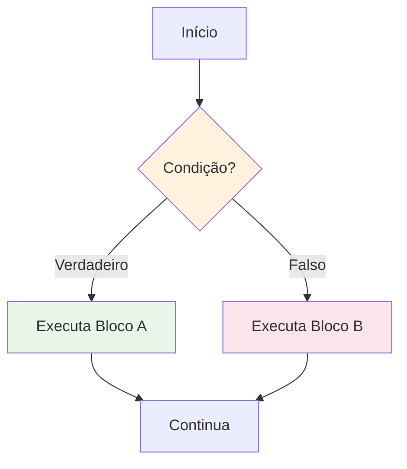
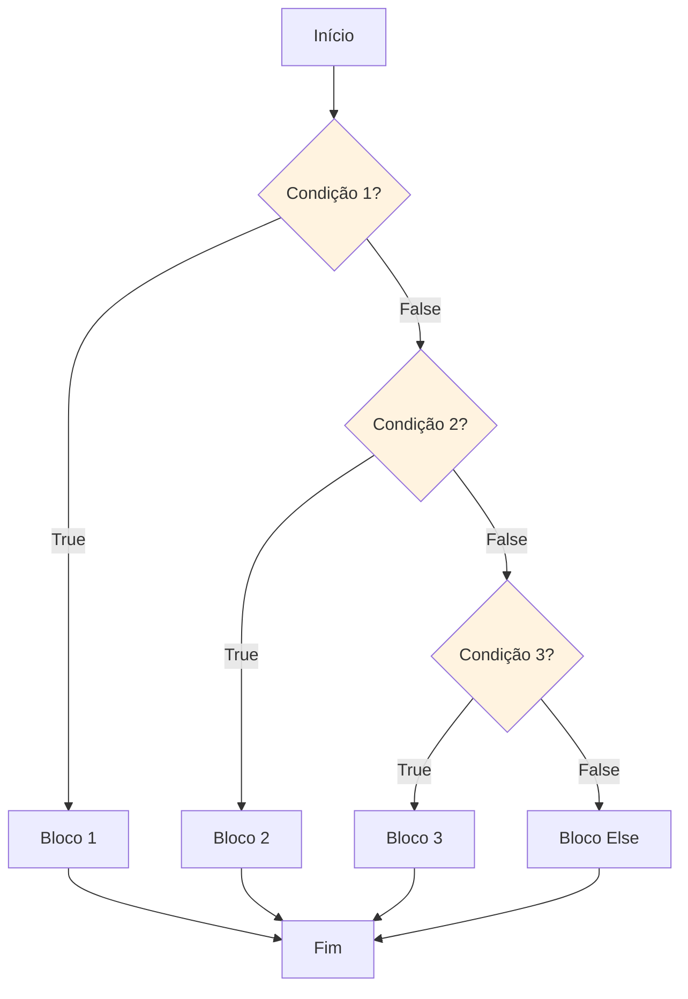

# Fluxo de Controle: Condicionais

O fluxo de controle determina a ordem em que as instruções são executadas. Condicionais permitem que seu programa tome decisões e execute código diferente com base em condições.

## O que é Fluxo de Controle?

Por padrão, Python executa instruções sequencialmente, uma após outra. Condicionais permitem que você altere este fluxo com base em condições.



## A Instrução if

A instrução `if` executa um bloco de código apenas quando uma condição é True.

### Sintaxe Básica

```python
if condicao:
    # Código executa apenas se condicao for True
    print("Condição é verdadeira!")
```

### Exemplo Simples de if

```python
# Verifica se um número é positivo
numero = 15

if numero > 0:
    print(f"{numero} é positivo")

print("Programa continua...")
```

Saída:
```
15 é positivo
Programa continua...
```

```python
# E se a condição for False?
numero = -5

if numero > 0:
    print(f"{numero} é positivo")  # Isso não executa

print("Programa continua...")
```

Saída:
```
Programa continua...
```

> [!NOTE]
> Python usa indentação (tipicamente 4 espaços) para definir blocos de código. Isso não é opcional - é como Python sabe quais instruções pertencem ao bloco if.

## A Instrução if-else

A cláusula `else` fornece uma alternativa quando a condição é False.

### Sintaxe

```python
if condicao:
    # Executa quando condicao é True
    pass
else:
    # Executa quando condicao é False
    pass
```

### Exemplo if-else

```python
# Verificação de idade
idade = 16

if idade >= 18:
    print("Você é adulto.")
    print("Pode votar e dirigir.")
else:
    print("Você é menor de idade.")
    print("Precisa de consentimento dos pais.")
```

Saída:
```
Você é menor de idade.
Precisa de consentimento dos pais.
```

### Exemplo do Mundo Real: Sistema de Login

```python
# sistema_login.py
def verificar_login(usuario, senha):
    """Verificação simples de login."""
    
    # Credenciais válidas (em apps reais, estariam em um banco de dados)
    usuario_valido = "admin"
    senha_valida = "python123"
    
    if usuario == usuario_valido and senha == senha_valida:
        print("Login bem-sucedido! Bem-vindo de volta.")
        return True
    else:
        print("Usuário ou senha inválidos.")
        return False

# Testa o sistema de login
print("=== Sistema de Login ===")
verificar_login("admin", "python123")   # Sucesso
print()
verificar_login("admin", "senh_errada") # Falha
print()
verificar_login("user", "python123")    # Falha
```

Saída:
```
=== Sistema de Login ===
Login bem-sucedido! Bem-vindo de volta.

Usuário ou senha inválidos.

Usuário ou senha inválidos.
```

## A Instrução if-elif-else

Quando você tem múltiplas condições para verificar, use `elif` (else if).

### Sintaxe

```python
if condicao1:
    # Executa se condicao1 for True
    pass
elif condicao2:
    # Executa se condicao1 for False e condicao2 for True
    pass
elif condicao3:
    # Executa se condicao1 e condicao2 forem False, e condicao3 for True
    pass
else:
    # Executa se todas as condições forem False
    pass
```

### Fluxograma



### Exemplo: Calculadora de Notas

```python
# calculadora_notas.py
def obter_nota_literal(pontuacao):
    """Converte pontuação numérica em nota literal."""
    
    if pontuacao >= 90:
        return "A"
    elif pontuacao >= 80:
        return "B"
    elif pontuacao >= 70:
        return "C"
    elif pontuacao >= 60:
        return "D"
    else:
        return "F"

# Testa com várias pontuações
pontuacoes = [95, 87, 72, 65, 45]

for pontuacao in pontuacoes:
    nota = obter_nota_literal(pontuacao)
    print(f"Pontuação: {pontuacao:3d} → Nota: {nota}")
```

Saída:
```
Pontuação:  95 → Nota: A
Pontuação:  87 → Nota: B
Pontuação:  72 → Nota: C
Pontuação:  65 → Nota: D
Pontuação:  45 → Nota: F
```

> [!WARNING]
> As condições são verificadas em ordem! Quando uma condição True é encontrada, o resto é ignorado. Isso significa:
> ```python
> # ORDEM ERRADA - sempre retorna "D"
> if pontuacao >= 60:
>     return "D"  # 95 >= 60 é True, então isso executa!
> elif pontuacao >= 90:
>     return "A"  # Nunca alcançado
> 
> # ORDEM CORRETA - verifica o maior primeiro
> if pontuacao >= 90:
>     return "A"
> elif pontuacao >= 60:
>     return "D"
> ```

## Condicionais Aninhadas

Você pode colocar instruções if dentro de outras instruções if.

### Exemplo de if Aninhado

```python
# precificacao_ingresso.py
def calcular_preco_ingresso(idade, e_estudante, e_fim_de_semana):
    """Calcula preço de ingresso de cinema com descontos."""
    
    preco_base = 15.00
    
    if idade < 12:
        # Preço infantil
        preco = preco_base * 0.5
        categoria = "Criança"
    elif idade >= 65:
        # Preço idoso
        preco = preco_base * 0.6
        categoria = "Idoso"
    else:
        # Preço adulto
        if e_estudante:
            preco = preco_base * 0.8
            categoria = "Estudante"
        else:
            preco = preco_base
            categoria = "Adulto"
    
    # Taxa de fim de semana
    if e_fim_de_semana:
        preco += 2.00
    
    return categoria, preco

# Casos de teste
casos_teste = [
    (10, False, False),   # Criança, dia de semana
    (70, False, True),    # Idoso, fim de semana
    (25, True, False),    # Estudante, dia de semana
    (30, False, True),    # Adulto, fim de semana
]

print("Precificação de Ingressos de Cinema")
print("=" * 50)
for idade, estudante, fim_semana in casos_teste:
    categoria, preco = calcular_preco_ingresso(idade, estudante, fim_semana)
    dia = "Fim de semana" if fim_semana else "Dia de semana"
    print(f"Idade {idade:2d}, {categoria:10s}, {dia}: R${preco:.2f}")
```

Saída:
```
Precificação de Ingressos de Cinema
==================================================
Idade 10, Criança   , Dia de semana: R$7.50
Idade 70, Idoso     , Fim de semana: R$11.00
Idade 25, Estudante , Dia de semana: R$12.00
Idade 30, Adulto    , Fim de semana: R$17.00
```

## Operador Ternário (Expressão Condicional)

Python tem uma forma concisa de escrever instruções if-else simples em uma linha.

### Sintaxe

```python
valor = valor_verdadeiro if condicao else valor_falso
```

### Exemplos Ternários

```python
# Uso básico
idade = 20
status = "adulto" if idade >= 18 else "menor"
print(f"Status: {status}")  # adulto

# Com números
x = 10
y = 20
maximo = x if x > y else y
print(f"Máximo: {maximo}")  # 20

# Valor absoluto
numero = -15
valor_abs = numero if numero >= 0 else -numero
print(f"Valor absoluto: {valor_abs}")  # 15

# Par ou ímpar
num = 7
resultado = "par" if num % 2 == 0 else "ímpar"
print(f"{num} é {resultado}")  # 7 é ímpar
```

### Exemplo Prático: Calculadora de Desconto

```python
# calculadora_desconto.py
def aplicar_desconto(preco, e_membro, valor_compra):
    """Aplica desconto com base em membresia e valor da compra."""
    
    # Desconto de membro
    desconto_membro = 0.15 if e_membro else 0.05
    
    # Bônus de compra em grande quantidade
    bonus_volume = 0.10 if valor_compra > 100 else 0.0
    
    # Desconto total (limitado a 20%)
    desconto_total = min(desconto_membro + bonus_volume, 0.20)
    
    preco_final = preco * (1 - desconto_total)
    
    return preco_final, desconto_total * 100

# Casos de teste
print("Calculadora de Desconto")
print("=" * 55)
print(f"{'Preço':>10} {'Membro':>8} {'Valor':>10} {'Desconto':>10} {'Final':>10}")
print("-" * 55)

testes = [
    (50.00, True, 50),
    (120.00, True, 120),
    (80.00, False, 80),
    (200.00, False, 200),
]

for preco, membro, valor in testes:
    final, desc_pct = aplicar_desconto(preco, membro, valor)
    membro_str = "Sim" if membro else "Não"
    print(f"R${preco:9.2f} {membro_str:>8} R${valor:9.2f} {desc_pct:9.1f}% R${final:9.2f}")
```

Saída:
```
Calculadora de Desconto
=======================================================
     Preço   Membro      Valor   Desconto      Final
-------------------------------------------------------
R$    50.00      Sim  R$    50.00      15.0% R$    42.50
R$   120.00      Sim  R$   120.00      20.0% R$    96.00
R$    80.00      Não  R$    80.00       5.0% R$    76.00
R$   200.00      Não  R$   200.00      15.0% R$   170.00
```

## Múltiplas Condições com Operadores Lógicos

Combine condições usando `and`, `or` e `not`.

### Combinando Condições

```python
# Recomendador de atividades por clima
def recomendar_atividade(temperatura, esta_chovendo, e_fim_de_semana):
    """Recomenda uma atividade com base nas condições climáticas."""
    
    if not esta_chovendo and temperatura >= 25:
        return "Vá à praia!"
    elif not esta_chovendo and 15 <= temperatura < 25:
        return "Dê uma caminhada no parque."
    elif esta_chovendo and e_fim_de_semana:
        return "Assista a um filme em casa."
    elif esta_chovendo and not e_fim_de_semana:
        return "Leve um guarda-chuva para o trabalho."
    elif temperatura < 15:
        return "Fique em casa com chocolate quente."
    else:
        return "Verifique eventos locais."

# Cenários de teste
cenarios = [
    (30, False, True),   # Quente, ensolarado, fim de semana
    (20, False, False),  # Ameno, ensolarado, dia de semana
    (18, True, True),    # Ameno, chuvoso, fim de semana
    (10, True, False),   # Frio, chuvoso, dia de semana
    (5, False, True),    # Frio, ensolarado, fim de semana
]

print("Recomendador de Atividades")
print("=" * 65)
for temp, chuva, fim_semana in cenarios:
    clima = "Chuvoso" if chuva else "Ensolarado"
    dia = "Fim de semana" if fim_semana else "Dia de semana"
    atividade = recomendar_atividade(temp, chuva, fim_semana)
    print(f"{temp:2d}°C, {clima:10s}, {dia:12s} → {atividade}")
```

Saída:
```
Recomendador de Atividades
=================================================================
30°C, Ensolarado, Fim de semana  → Vá à praia!
20°C, Ensolarado, Dia de semana  → Dê uma caminhada no parque.
18°C, Chuvoso   , Fim de semana  → Assista a um filme em casa.
10°C, Chuvoso   , Dia de semana  → Leve um guarda-chuva para o trabalho.
 5°C, Ensolarado, Fim de semana  → Fique em casa com chocolate quente.
```

## Valores Truthy e Falsy em Condições

Python permite qualquer valor em uma condição, não apenas booleanos.

### Valores Truthy e Falsy

```python
# Valores Falsy (avaliam como False)
valores_falsy = [
    False,
    None,
    0,
    0.0,
    "",           # String vazia
    [],           # Lista vazia
    {},           # Dicionário vazio
    set(),        # Conjunto vazio
]

print("Valores Falsy:")
for val in valores_falsy:
    print(f"  bool({repr(val):10s}) = {bool(val)}")

# Valores Truthy (avaliam como True)
print("\nValores Truthy:")
print(f"  bool(1) = {bool(1)}")
print(f"  bool('ola') = {bool('ola')}")
print(f"  bool([1, 2, 3]) = {bool([1, 2, 3])}")
```

### Python Idiomático: Verificando Valores Vazios

```python
# Em vez disso:
if len(minha_lista) > 0:
    print("Lista tem itens")

# Escreva assim (mais Pythonico):
if minha_lista:
    print("Lista tem itens")

# Em vez disso:
if minha_string != "":
    print("String não está vazia")

# Escreva assim:
if minha_string:
    print("String não está vazia")
```

## Exemplo do Mundo Real: Sistema de Saque ATM

```python
# sistema_atm.py
def saque_atm(saldo, valor, pin, limite_diario):
    """Simula um saque ATM com múltiplas verificações."""
    
    # Verificação 1: Validação do PIN
    if pin != 1234:
        return "ERRO: PIN inválido"
    
    # Verificação 2: Valor deve ser positivo
    if valor <= 0:
        return "ERRO: Valor deve ser positivo"
    
    # Verificação 3: Valor deve ser múltiplo de 10
    if valor % 10 != 0:
        return "ERRO: Valor deve ser múltiplo de 10"
    
    # Verificação 4: Saldo suficiente
    if valor > saldo:
        return f"ERRO: Saldo insuficiente. Saldo: R${saldo:.2f}"
    
    # Verificação 5: Limite diário
    if valor > limite_diario:
        return f"ERRO: Excede limite diário de R${limite_diario:.2f}"
    
    # Todas verificações passaram - processa saque
    novo_saldo = saldo - valor
    return f"SUCESSO: Sacado R${valor:.2f}. Novo saldo: R${novo_saldo:.2f}"

# Testa o sistema ATM
print("=== Sistema de Saque ATM ===\n")

casos_teste = [
    (500.00, 100, 1234, 300),   # Saque válido
    (500.00, 100, 5678, 300),   # PIN errado
    (500.00, -50, 1234, 300),   # Valor negativo
    (500.00, 55, 1234, 300),    # Não múltiplo de 10
    (500.00, 600, 1234, 300),   # Saldo insuficiente
    (500.00, 400, 1234, 300),   # Excede limite diário
]

for saldo, valor, pin, limite in casos_teste:
    resultado = saque_atm(saldo, valor, pin, limite)
    print(f"Saldo: R${saldo:7.2f}, Saque: R${valor:4d}, PIN: {pin}")
    print(f"  → {resultado}\n")
```

Saída:
```
=== Sistema de Saque ATM ===

Saldo: R$ 500.00, Saque: R$ 100, PIN: 1234
  → SUCESSO: Sacado R$100.00. Novo saldo: R$400.00

Saldo: R$ 500.00, Saque: R$ 100, PIN: 5678
  → ERRO: PIN inválido

Saldo: R$ 500.00, Saque: R$ -50, PIN: 1234
  → ERRO: Valor deve ser positivo

Saldo: R$ 500.00, Saque: R$  55, PIN: 1234
  → ERRO: Valor deve ser múltiplo de 10

Saldo: R$ 500.00, Saque: R$ 600, PIN: 1234
  → ERRO: Saldo insuficiente. Saldo: R$500.00

Saldo: R$ 500.00, Saque: R$ 400, PIN: 1234
  → ERRO: Excede limite diário de R$300.00
```

## Exercícios Práticos

### Exercício 1: Positivo, Negativo ou Zero
Escreva um programa que verifica se um número é positivo, negativo ou zero.

### Exercício 2: Comparador de Números
Escreva um programa que recebe dois números e imprime qual é maior, ou se são iguais.

### Exercício 3: Verificador de Ano Bissexto
Escreva um programa que determina se um ano é bissexto usando condicionais aninhadas.

### Exercício 4: Classificador de Notas
Crie um programa que recebe uma pontuação (0-100) e retorna:
- "Excelente" para 90-100
- "Bom" para 75-89
- "Médio" para 60-74
- "Precisa Melhorar" para abaixo de 60

### Exercício 5: Calculadora Simples
Escreva uma calculadora que recebe dois números e uma operação (+, -, *, /) e realiza o cálculo. Trate divisão por zero.

### Exercício 6: Prática Ternária
Reescreva estas instruções if-else como expressões ternárias:
```python
if x > 100:
    resultado = "alto"
else:
    resultado = "baixo"
```

### Exercício 7: Verificador de Força de Senha
Escreva uma função que verifica a força da senha:
- "Fraca" se comprimento < 6
- "Média" se comprimento 6-11
- "Forte" se comprimento >= 12 e contém maiúscula
- "Muito Forte" se comprimento >= 12, contém maiúscula e contém um dígito

### Exercício 8: Pedra Papel Tesoura
Escreva um programa que determina o vencedor de uma rodada Pedra-Papel-Tesoura dadas duas escolhas.

## Resumo

Nesta lição, você aprendeu:
- Como usar instruções `if` para tomada de decisão básica
- Como `if-else` fornece dois caminhos de execução
- Como `if-elif-else` lida com múltiplas condições
- Como aninhar condicionais para lógica complexa
- Como usar o operador ternário para expressões concisas
- Como combinar condições com operadores lógicos
- Como valores truthy e falsy funcionam em Python
- Como construir sistemas de tomada de decisão do mundo real

Condicionais são essenciais para criar programas que respondem a diferentes situações. Pratique escrever condicionais para desenvolver suas habilidades de tomada de decisão.
