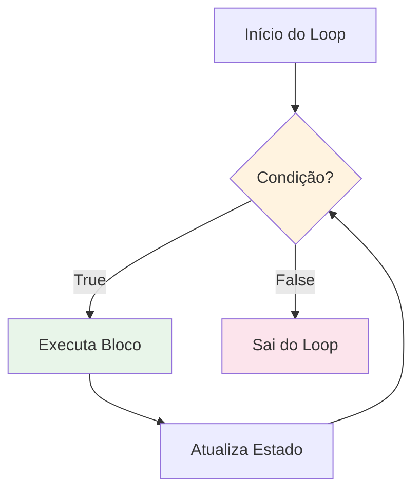
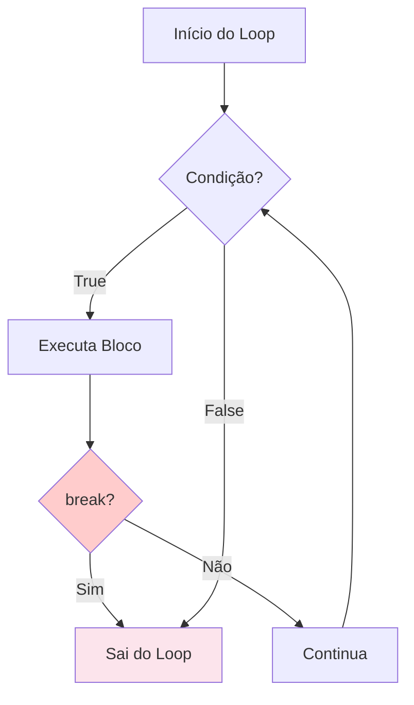
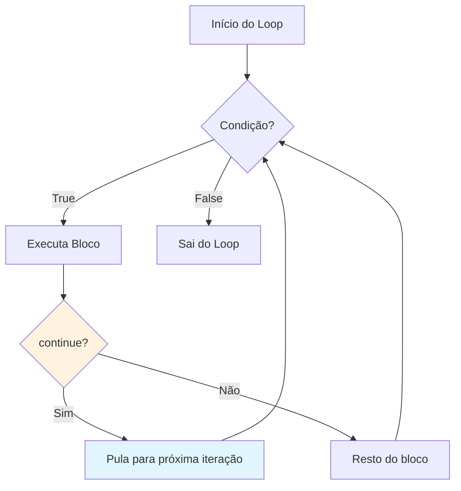
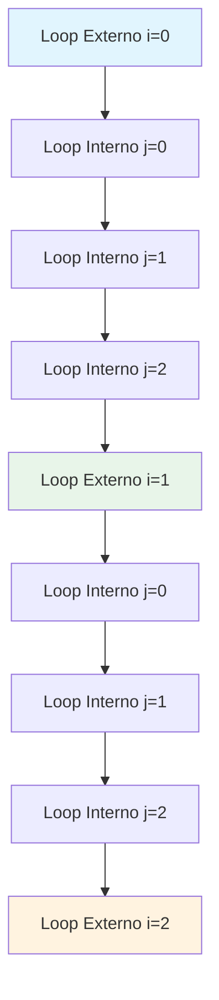

# Fluxo de Controle: Loops

Loops permitem que você execute um bloco de código múltiplas vezes. Eles são essenciais para processar coleções, repetir tarefas e implementar algoritmos.

## O que São Loops?

Um loop repete um bloco de código até que uma condição seja satisfeita. Python fornece dois tipos principais de loops: `while` e `for`.



## O Loop while

O loop `while` repete enquanto uma condição permanecer True.

### Sintaxe Básica

```python
while condicao:
    # Código executa repetidamente enquanto condicao for True
    pass
```

### Exemplo Simples de while

```python
# Contagem regressiva de 5
contador = 5

while contador > 0:
    print(f"Contagem: {contador}")
    contador -= 1  # IMPORTANTE: Atualize o contador!

print("Decolagem! 🚀")
```

Saída:
```
Contagem: 5
Contagem: 4
Contagem: 3
Contagem: 2
Contagem: 1
Decolagem! 🚀
```

> [!WARNING]
> Sempre garanta que a condição do loop eventualmente se torne False! Esquecer de atualizar a variável do loop cria um loop infinito:
> ```python
> # LOOP INFINITO - não faça isso!
> contador = 5
> while contador > 0:
>     print(contador)
>     # Esqueceu: contador -= 1
> ```

### Loop while com Entrada do Usuário

```python
# jogo_adivinhacao.py
import random

def adivinhar_numero():
    """Jogo simples de adivinhação usando loop while."""
    
    secreto = random.randint(1, 20)
    tentativas = 0
    max_tentativas = 5
    
    print("=== Jogo de Adivinhação ===")
    print("Estou pensando em um número entre 1 e 20.")
    print(f"Você tem {max_tentativas} tentativas.\n")
    
    while tentativas < max_tentativas:
        palpite = int(input(f"Tentativa {tentativas + 1}/{max_tentativas}: "))
        tentativas += 1
        
        if palpite == secreto:
            print(f"🎉 Correto! Você acertou em {tentativas} tentativas!")
            return
        elif palpite < secreto:
            print("Muito baixo! Tente um número maior.")
        else:
            print("Muito alto! Tente um número menor.")
    
    print(f"\n😔 Fim de jogo! O número era {secreto}.")

# Executa o jogo
adivinhar_numero()
```

Saída de exemplo:
```
=== Jogo de Adivinhação ===
Estou pensando em um número entre 1 e 20.
Você tem 5 tentativas.

Tentativa 1/5: 10
Muito alto! Tente um número menor.
Tentativa 2/5: 5
Muito baixo! Tente um número maior.
Tentativa 3/5: 7
🎉 Correto! Você acertou em 3 tentativas!
```

## O Loop for

O loop `for` itera sobre uma sequência (lista, string, range, etc.).

### Sintaxe Básica

```python
for item in sequencia:
    # Código executa uma vez para cada item na sequência
    pass
```

### Iterando Sobre Diferentes Sequências

```python
# Iterando sobre uma lista
frutas = ["maca", "banana", "cereja"]
print("Frutas:")
for fruta in frutas:
    print(f"  - {fruta}")

# Iterando sobre uma string
print("\nLetras em 'Python':")
for letra in "Python":
    print(f"  {letra}")

# Iterando sobre uma tupla
coordenadas = (10, 20, 30)
print("\nCoordenadas:")
for coord in coordenadas:
    print(f"  {coord}")
```

Saída:
```
Frutas:
  - maca
  - banana
  - cereja

Letras em 'Python':
  P
  y
  t
  h
  o
  n

Coordenadas:
  10
  20
  30
```

## A Função range()

`range()` gera uma sequência de números, comumente usada com loops `for`.

### Variantes de range()

```mermaid
flowchart LR
    A[range(fim)] --> B["range(5) → 0,1,2,3,4"]
    C[range(inicio, fim)] --> D["range(2, 6) → 2,3,4,5"]
    E[range(inicio, fim, passo)] --> F["range(0, 10, 2) → 0,2,4,6,8"]
    
    style B fill:#e1f5fe
    style D fill:#e8f5e9
    style F fill:#fff3e0
```

### Exemplos de range()

```python
# range(fim) - começa em 0, para antes de fim
print("range(5):")
for i in range(5):
    print(i, end=" ")
# Saída: 0 1 2 3 4

print("\n\nrange(2, 6):")
for i in range(2, 6):
    print(i, end=" ")
# Saída: 2 3 4 5

print("\n\nrange(0, 10, 2):")
for i in range(0, 10, 2):
    print(i, end=" ")
# Saída: 0 2 4 6 8

print("\n\nrange(5, 0, -1):")
for i in range(5, 0, -1):
    print(i, end=" ")
# Saída: 5 4 3 2 1
```

### Usos Práticos de range()

```python
# Soma dos primeiros n números
def soma_primeiros_n(n):
    total = 0
    for i in range(1, n + 1):
        total += i
    return total

print(f"Soma de 1 a 100: {soma_primeiros_n(100)}")  # 5050

# Tabuada
def imprimir_tabuada(numero, ate=10):
    print(f"\nTabuada do {numero}:")
    for i in range(1, ate + 1):
        print(f"  {numero} × {i:2d} = {numero * i:3d}")

imprimir_tabuada(7)
```

Saída:
```
Soma de 1 a 100: 5050

Tabuada do 7:
  7 ×  1 =   7
  7 ×  2 =  14
  7 ×  3 =  21
  7 ×  4 =  28
  7 ×  5 =  35
  7 ×  6 =  42
  7 ×  7 =  49
  7 ×  8 =  56
  7 ×  9 =  63
  7 × 10 =  70
```

## Controle de Loop: break e continue

Instruções de controle modificam o comportamento do loop.

### break - Sai do Loop Imediatamente



```python
# Exemplo de break: encontrar primeiro número par
numeros = [1, 3, 5, 8, 9, 10, 11]

for num in numeros:
    if num % 2 == 0:
        print(f"Primeiro número par encontrado: {num}")
        break
    print(f"  Verificando {num}... (ímpar)")
```

Saída:
```
  Verificando 1... (ímpar)
  Verificando 3... (ímpar)
  Verificando 5... (ímpar)
Primeiro número par encontrado: 8
```

### continue - Pula para a Próxima Iteração



```python
# Exemplo de continue: pular números ímpares
for num in range(1, 11):
    if num % 2 != 0:
        continue  # Pula números ímpares
    print(num, end=" ")
# Saída: 2 4 6 8 10
```

### Comparação break vs continue

```python
# Demonstração de break vs continue
print("Usando break (para no 5):")
for i in range(1, 11):
    if i == 5:
        break
    print(i, end=" ")
# Saída: 1 2 3 4

print("\n\nUsando continue (pula o 5):")
for i in range(1, 11):
    if i == 5:
        continue
    print(i, end=" ")
# Saída: 1 2 3 4 6 7 8 9 10
```

## Loops Aninhados

Loops dentro de loops são chamados de loops aninhados. O loop interno completa todas as suas iterações para cada iteração do loop externo.

### Fluxo de Loop Aninhado



### Exemplos de Loops Aninhados

```python
# Grade de tabuada
print("Tabuada (1-5):")
print("    ", end="")
for j in range(1, 6):
    print(f"{j:4d}", end="")
print("\n" + "-" * 25)

for i in range(1, 6):
    print(f"{i:2d} |", end="")
    for j in range(1, 6):
        print(f"{i * j:4d}", end="")
    print()
```

Saída:
```
Tabuada (1-5):
       1   2   3   4   5
-------------------------
 1 |   1   2   3   4   5
 2 |   2   4   6   8  10
 3 |   3   6   9  12  15
 4 |   4   8  12  16  20
 5 |   5  10  15  20  25
```

### Impressão de Padrões com Loops Aninhados

```python
# Imprime um padrão de pirâmide
def imprimir_piramide(altura):
    """Imprime uma pirâmide de asteriscos."""
    for i in range(1, altura + 1):
        # Imprime espaços
        espacos = " " * (altura - i)
        # Imprime asteriscos
        asteriscos = "*" * (2 * i - 1)
        print(espacos + asteriscos)

print("Pirâmide de altura 5:")
imprimir_piramide(5)
```

Saída:
```
Pirâmide de altura 5:
    *
   ***
  *****
 *******
*********
```

## A Cláusula else com Loops

Python permite uma cláusula `else` com loops. Ela executa quando o loop completa normalmente (não via `break`).

### Sintaxe else de Loop

```python
for item in sequencia:
    if condicao:
        break
else:
    # Executa se loop completou sem break
    pass
```

### Exemplo else de Loop

```python
# Busca com cláusula else
def buscar_numero(numeros, alvo):
    """Busca um número e reporta se encontrado."""
    for num in numeros:
        if num == alvo:
            print(f"Encontrado {alvo}!")
            break
    else:
        print(f"{alvo} não encontrado na lista.")

buscar_numero([1, 3, 5, 7, 9], 5)   # Encontrado
buscar_numero([1, 3, 5, 7, 9], 10)  # Não encontrado
```

Saída:
```
Encontrado 5!
10 não encontrado na lista.
```

## Enumerate e zip

Python fornece funções úteis para trabalhar com loops.

### enumerate() - Obter Índice e Valor

```python
frutas = ["maca", "banana", "cereja"]

# Sem enumerate
print("Sem enumerate:")
for i in range(len(frutas)):
    print(f"  {i}: {frutas[i]}")

# Com enumerate (mais limpo!)
print("\nCom enumerate:")
for indice, fruta in enumerate(frutas):
    print(f"  {indice}: {fruta}")

# Começando índice em 1
print("\nComeçando em 1:")
for indice, fruta in enumerate(frutas, start=1):
    print(f"  {indice}. {fruta}")
```

### zip() - Iterar Sobre Múltiplas Sequências

```python
nomes = ["Alice", "Bob", "Carlos"]
idades = [25, 30, 35]
cidades = ["SP", "London", "Tokyo"]

print("Usando zip:")
for nome, idade, cidade in zip(nomes, idades, cidades):
    print(f"  {nome} tem {idade} anos e mora em {cidade}")
```

Saída:
```
Usando zip:
  Alice tem 25 anos e mora em SP
  Bob tem 30 anos e mora em London
  Carlos tem 35 anos e mora em Tokyo
```

## Exemplo do Mundo Real: Análise de Dados com Loops

```python
# analise_notas.py
def analisar_notas(dados_estudantes):
    """Analisa notas de estudantes usando loops."""
    
    print("=" * 55)
    print("         ANÁLISE DE NOTAS DOS ESTUDANTES")
    print("=" * 55)
    
    total_estudantes = 0
    total_nota = 0
    maior_nota = 0
    melhor_estudante = ""
    menor_nota = 100
    pior_estudante = ""
    aprovados = 0
    reprovados = 0
    
    for nome, nota in dados_estudantes:
        total_estudantes += 1
        total_nota += nota
        
        # Rastreia maior e menor
        if nota > maior_nota:
            maior_nota = nota
            melhor_estudante = nome
        
        if nota < menor_nota:
            menor_nota = nota
            pior_estudante = nome
        
        # Conta aprovação/reprovação
        if nota >= 60:
            aprovados += 1
        else:
            reprovados += 1
        
        # Imprime resultado individual
        status = "APROVADO" if nota >= 60 else "REPROVADO"
        print(f"  {nome:15s} {nota:6.1f}  {status}")
    
    # Resumo
    print("-" * 55)
    media = total_nota / total_estudantes
    print(f"  Total Estudantes: {total_estudantes}")
    print(f"  Média:            {media:.1f}")
    print(f"  Maior Nota:       {melhor_estudante} ({maior_nota:.1f})")
    print(f"  Menor Nota:       {pior_estudante} ({menor_nota:.1f})")
    print(f"  Aprovados:        {aprovados}")
    print(f"  Reprovados:       {reprovados}")
    print(f"  Taxa Aprov.:      {aprovados/total_estudantes*100:.1f}%")
    print("=" * 55)

# Dados de exemplo
estudantes = [
    ("Alice", 92.5),
    ("Bob", 78.0),
    ("Carlos", 45.0),
    ("Diana", 88.5),
    ("Eva", 95.0),
    ("Frank", 62.0),
    ("Grace", 71.5),
    ("Henrique", 55.0),
]

analisar_notas(estudantes)
```

Saída:
```
=======================================================
         ANÁLISE DE NOTAS DOS ESTUDANTES
=======================================================
  Alice            92.5  APROVADO
  Bob              78.0  APROVADO
  Carlos           45.0  REPROVADO
  Diana            88.5  APROVADO
  Eva              95.0  APROVADO
  Frank            62.0  APROVADO
  Grace            71.5  APROVADO
  Henrique         55.0  REPROVADO
-------------------------------------------------------
  Total Estudantes: 8
  Média:            73.4
  Maior Nota:       Eva (95.0)
  Menor Nota:       Carlos (45.0)
  Aprovados:        6
  Reprovados:       2
  Taxa Aprov.:      75.0%
=======================================================
```

## Exercícios Práticos

### Exercício 1: Soma de Números Pares
Escreva um loop que calcula a soma de todos os números pares de 1 a 100.

### Exercício 2: Calculadora de Fatorial
Escreva um programa que calcula o fatorial de um número usando um loop for. (5! = 5 × 4 × 3 × 2 × 1 = 120)

### Exercício 3: FizzBuzz
Escreva um programa que imprime números de 1 a 100, mas:
- Para múltiplos de 3, imprima "Fizz"
- Para múltiplos de 5, imprima "Buzz"
- Para múltiplos de ambos, imprima "FizzBuzz"

### Exercício 4: Verificador de Número Primo
Escreva um programa que verifica se um número é primo usando um loop.

### Exercício 5: Inverter uma String
Escreva um loop que inverte uma string sem usar funções de inversão embutidas.

### Exercício 6: Impressão de Padrão
Use loops aninhados para imprimir este padrão:
```
1
12
123
1234
12345
```

### Exercício 7: Jogo de Adivinhação
Crie um jogo completo de adivinhação onde o computador escolhe um número aleatório e o usuário precisa adivinhá-lo. Forneça dicas (muito alto/muito baixo) e conte tentativas.

### Exercício 8: Validador de Senha
Escreva um programa que pede uma senha e usa um loop para verificar:
- Pelo menos 8 caracteres
- Contém pelo menos uma letra maiúscula
- Contém pelo menos um dígito
Continue pedindo até que uma senha válida seja inserida.

## Resumo

Nesta lição, você aprendeu:
- Como usar loops `while` para repetição baseada em condição
- Como usar loops `for` para iteração sobre sequências
- Como `range()` gera sequências numéricas
- Como `break` sai de um loop imediatamente
- Como `continue` pula para a próxima iteração
- Como loops aninhados funcionam e quando usá-los
- Como a cláusula `else` funciona com loops
- Como `enumerate()` e `zip()` melhoram a iteração
- Como aplicar loops ao processamento de dados do mundo real

Loops são fundamentais para programação. Domine-os para processar dados eficientemente e implementar algoritmos.
