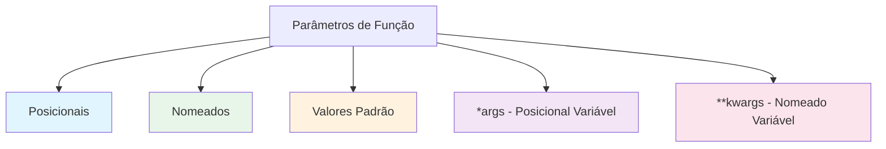
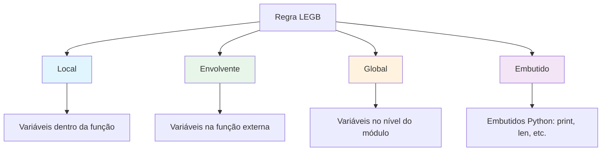

# Funções

Funções são blocos de código reutilizáveis que realizam tarefas específicas. Elas ajudam a organizar código, evitar repetição e tornar programas mais fáceis de entender e manter.

## O que é uma Função?

Uma função é um bloco nomeado de código que pode ser chamado (invocado) para realizar uma tarefa. Pense nela como uma receita: você a define uma vez, depois usa sempre que necessário.

```mermaid
flowchart LR
    A[Definição da Função] --> B[def saudacao(nome):]
    B --> C[    return f'Olá, {nome}!']
    
    D[Chamada da Função] --> E[saudacao('Alice')]
    E --> F[Resultado: 'Olá, Alice!']
    
    style A fill:#e1f5fe
    style D fill:#e8f5e9
```

## Definindo Funções

### Sintaxe Básica

```python
def nome_funcao(parametros):
    """Docstring: descreve o que a função faz."""
    # Corpo da função
    resultado = ...
    return resultado
```

### Exemplo Simples de Função

```python
def saudacao(nome):
    """Retorna uma mensagem de saudação para o nome dado."""
    return f"Olá, {nome}! Bem-vindo ao Python."

# Chamando a função
mensagem = saudacao("Alice")
print(mensagem)  # Olá, Alice! Bem-vindo ao Python.

mensagem = saudacao("Bob")
print(mensagem)  # Olá, Bob! Bem-vindo ao Python.
```

### Funções Sem Valor de Retorno

```python
def imprimir_separador(caracter="-", comprimento=30):
    """Imprime uma linha separadora."""
    print(caracter * comprimento)

imprimir_separador()           # ------------------------------
imprimir_separador("=", 20)    # ====================
imprimir_separador("*", 10)    # **********
```

> [!NOTE]
> Funções sem uma instrução `return` retornam implicitamente `None`. Esta é a forma do Python representar "nada".

## Parâmetros e Argumentos

Parâmetros são variáveis listadas na definição da função. Argumentos são os valores reais passados ao chamar a função.

### Tipos de Parâmetros



### Parâmetros Posicionais

```python
def calcular_area(comprimento, largura):
    """Calcula a área de um retângulo."""
    return comprimento * largura

# Argumentos correspondidos por posição
area = calcular_area(10, 5)
print(f"Área: {area}")  # 50

# Ordem importa!
print(f"10×5 = {calcular_area(10, 5)}")  # 50
print(f"5×10 = {calcular_area(5, 10)}")  # 50 (mesmo resultado, mas significado diferente)
```

### Parâmetros com Valor Padrão

```python
def criar_perfil(nome, idade, pais="Brasil", linguagem="Python"):
    """Cria um perfil de usuário com valores padrão."""
    return {
        "nome": nome,
        "idade": idade,
        "pais": pais,
        "linguagem": linguagem
    }

# Usando padrões
perfil1 = criar_perfil("Alice", 25)
print(perfil1)
# {'nome': 'Alice', 'idade': 25, 'pais': 'Brasil', 'linguagem': 'Python'}

# Sobrescrevendo padrões
perfil2 = criar_perfil("Bob", 30, "EUA", "JavaScript")
print(perfil2)
# {'nome': 'Bob', 'idade': 30, 'pais': 'EUA', 'linguagem': 'JavaScript'}
```

> [!WARNING]
> Valores padrão de parâmetros são avaliados apenas uma vez, quando a função é definida. Nunca use padrões mutáveis (como listas ou dicts):
> ```python
> # RUIM - lista compartilhada entre chamadas!
> def adicionar_item(item, itens=[]):
>     itens.append(item)
>     return itens
> 
> # BOM - cria nova lista a cada vez
> def adicionar_item(item, itens=None):
>     if itens is None:
>         itens = []
>     itens.append(item)
>     return itens
> ```

### Argumentos Nomeados

```python
def criar_email(para, assunto, corpo, prioridade="normal"):
    """Cria uma mensagem de email."""
    return f"Para: {para}\nAssunto: {assunto}\nPrioridade: {prioridade}\n\n{corpo}"

# Usando argumentos nomeados (ordem não importa)
email = criar_email(
    corpo="Por favor revise o documento anexado.",
    para="gerente@empresa.com",
    prioridade="alta",
    assunto="Revisão de Documento"
)
print(email)
```

### *args - Argumentos Posicionais Variáveis

```python
def calcular_soma(*args):
    """Soma qualquer número de argumentos."""
    total = 0
    for num in args:
        total += num
    return total

print(f"Soma de 1, 2, 3: {calcular_soma(1, 2, 3)}")         # 6
print(f"Soma de 10, 20, 30, 40: {calcular_soma(10, 20, 30, 40)}")  # 100
print(f"Soma de nada: {calcular_soma()}")                  # 0
```

### **kwargs - Argumentos Nomeados Variáveis

```python
def criar_registro_estudante(nome, **kwargs):
    """Cria um registro de estudante com campos opcionais."""
    registro = {"nome": nome}
    registro.update(kwargs)
    return registro

estudante = criar_registro_estudante(
    "Maria",
    idade=22,
    curso="Ciência da Computação",
    media=3.8,
    matriculado=True
)
print(estudante)
# {'nome': 'Maria', 'idade': 22, 'curso': 'Ciência da Computação', 'media': 3.8, 'matriculado': True}
```

## Valores de Retorno

Funções podem retornar valores usando a instrução `return`.

### Valor de Retorno Único

```python
def quadrado(numero):
    """Retorna o quadrado de um número."""
    return numero ** 2

resultado = quadrado(5)
print(f"5² = {resultado}")  # 25
```

### Múltiplos Valores de Retorno

```python
def dividir_com_resto(dividendo, divisor):
    """Retorna quociente e resto."""
    quociente = dividendo // divisor
    resto = dividendo % divisor
    return quociente, resto  # Retorna uma tupla

q, r = dividir_com_resto(17, 5)
print(f"17 ÷ 5 = {q} resto {r}")  # 17 ÷ 5 = 3 resto 2
```

### Retorno Antecipado

```python
def classificar_idade(idade):
    """Classifica a faixa etária de uma pessoa."""
    if idade < 0:
        return "Idade inválida"
    if idade < 13:
        return "Criança"
    if idade < 18:
        return "Adolescente"
    if idade < 65:
        return "Adulto"
    return "Idoso"

idades = [-5, 8, 15, 30, 70]
for idade in idades:
    print(f"Idade {idade:3d}: {classificar_idade(idade)}")
```

Saída:
```
Idade  -5: Idade inválida
Idade   8: Criança
Idade  15: Adolescente
Idade  30: Adulto
Idade  70: Idoso
```

## Escopo de Variáveis

Escopo determina onde uma variável pode ser acessada.

### Níveis de Escopo



### Exemplos de Escopo

```python
# Variável global
var_global = "Sou global"

def demonstrar_escopo():
    # Variável local
    var_local = "Sou local"
    
    # Pode ler variável global
    print(f"Dentro da função - global: {var_global}")
    print(f"Dentro da função - local: {var_local}")

demonstrar_escopo()
print(f"Fora da função - global: {var_global}")
# print(var_local)  # ERRO: NameError - var_local não definida aqui
```

### Modificando Variáveis Globais

```python
contador = 0

def incrementar():
    global contador  # Declara que estamos usando a variável global
    contador += 1

incrementar()
incrementar()
incrementar()
print(f"Contador: {contador}")  # 3
```

> [!TIP]
> Evite usar `global` quando possível. Em vez disso, passe valores como parâmetros e retorne resultados:
> ```python
> # Abordagem melhor
> def incrementar_contador(contador):
>     return contador + 1
> 
> contador = 0
> contador = incrementar_contador(contador)
> ```

## Docstrings

Docstrings são strings literais que aparecem como a primeira instrução em uma função. Elas documentam o que a função faz.

### Formatos de Docstring

```python
def calcular_imc(peso_kg, altura_m):
    """
    Calcula o Índice de Massa Corporal (IMC).
    
    Args:
        peso_kg: Peso em quilogramas (float)
        altura_m: Altura em metros (float)
    
    Returns:
        float: Valor do IMC
    
    Raises:
        ValueError: Se peso ou altura não forem positivos
    
    Example:
        >>> calcular_imc(70, 1.75)
        22.86
    """
    if peso_kg <= 0 or altura_m <= 0:
        raise ValueError("Peso e altura devem ser positivos")
    
    return peso_kg / (altura_m ** 2)

# Acessar docstring
print(calcular_imc.__doc__)
# Ou usar help()
# help(calcular_imc)
```

## Funções Lambda

Funções lambda são pequenas funções anônimas definidas com a palavra-chave `lambda`.

### Sintaxe Lambda

```python
# Função regular
def quadrado(x):
    return x ** 2

# Lambda equivalente
quadrado_lambda = lambda x: x ** 2

print(f"quadrado(5) = {quadrado(5)}")              # 25
print(f"quadrado_lambda(5) = {quadrado_lambda(5)}") # 25
```

### Casos de Uso Lambda

```python
# Ordenação com lambda
estudantes = [
    ("Alice", 85),
    ("Bob", 92),
    ("Carlos", 78),
]

# Ordenar por nota (segundo elemento)
por_nota = sorted(estudantes, key=lambda e: e[1])
print("Ordenado por nota:", por_nota)

# Ordenar por nome (primeiro elemento)
por_nome = sorted(estudantes, key=lambda e: e[0])
print("Ordenado por nome:", por_nome)

# Usando com map()
numeros = [1, 2, 3, 4, 5]
quadrados = list(map(lambda x: x ** 2, numeros))
print(f"Quadrados: {quadrados}")  # [1, 4, 9, 16, 25]

# Usando com filter()
pares = list(filter(lambda x: x % 2 == 0, numeros))
print(f"Pares: {pares}")  # [2, 4]
```

## Exemplo do Mundo Real: Sistema de Conversão de Temperatura

```python
# conversor_temperatura.py
"""
Sistema de Conversão de Temperatura
Suporta conversões entre Celsius, Fahrenheit e Kelvin.
"""

def celsius_para_fahrenheit(c):
    """Converte Celsius para Fahrenheit."""
    return c * 9/5 + 32

def celsius_para_kelvin(c):
    """Converte Celsius para Kelvin."""
    return c + 273.15

def fahrenheit_para_celsius(f):
    """Converte Fahrenheit para Celsius."""
    return (f - 32) * 5/9

def fahrenheit_para_kelvin(f):
    """Converte Fahrenheit para Kelvin."""
    return (f - 32) * 5/9 + 273.15

def kelvin_para_celsius(k):
    """Converte Kelvin para Celsius."""
    return k - 273.15

def kelvin_para_fahrenheit(k):
    """Converte Kelvin para Fahrenheit."""
    return (k - 273.15) * 9/5 + 32

# Mapa de conversões
CONVERSOES = {
    ("C", "F"): celsius_para_fahrenheit,
    ("C", "K"): celsius_para_kelvin,
    ("F", "C"): fahrenheit_para_celsius,
    ("F", "K"): fahrenheit_para_kelvin,
    ("K", "C"): kelvin_para_celsius,
    ("K", "F"): kelvin_para_fahrenheit,
}

def converter_temperatura(valor, de_unidade, para_unidade):
    """
    Converte temperatura entre unidades.
    
    Args:
        valor: Valor da temperatura (float)
        de_unidade: Unidade origem ('C', 'F' ou 'K')
        para_unidade: Unidade destino ('C', 'F' ou 'K')
    
    Returns:
        float: Temperatura convertida
    """
    de_unidade = de_unidade.upper()
    para_unidade = para_unidade.upper()
    
    if de_unidade == para_unidade:
        return valor
    
    chave = (de_unidade, para_unidade)
    if chave not in CONVERSOES:
        raise ValueError(f"Conversão inválida: {de_unidade} para {para_unidade}")
    
    return CONVERSOES[chave](valor)

def exibir_tabela_conversao():
    """Exibe uma tabela de conversão de temperatura."""
    print("=" * 55)
    print("     TABELA DE CONVERSÃO DE TEMPERATURA")
    print("=" * 55)
    print(f"{'Celsius':>10} {'Fahrenheit':>12} {'Kelvin':>10}")
    print("-" * 55)
    
    for c in range(-20, 51, 5):
        f = celsius_para_fahrenheit(c)
        k = celsius_para_kelvin(c)
        print(f"{c:10.1f} {f:12.1f} {k:10.1f}")
    
    print("=" * 55)

# Executa o conversor
exibir_tabela_conversao()

# Conversão rápida
print("\nConversões Rápidas:")
valores_teste = [
    (0, "C", "F"),
    (100, "C", "F"),
    (98.6, "F", "C"),
    (37, "C", "K"),
    (0, "K", "C"),
]

for valor, frm, para in valores_teste:
    resultado = converter_temperatura(valor, frm, para)
    print(f"  {valor}°{frm} = {resultado:.2f}°{para}")
```

Saída:
```
=======================================================
     TABELA DE CONVERSÃO DE TEMPERATURA
=======================================================
   Celsius   Fahrenheit     Kelvin
-------------------------------------------------------
     -20.0        -4.0      253.2
     -15.0          5.0      258.2
     -10.0         14.0      263.2
      -5.0         23.0      268.2
       0.0         32.0      273.2
       5.0         41.0      278.2
      10.0         50.0      283.2
      15.0         59.0      288.2
      20.0         68.0      293.2
      25.0         77.0      298.2
      30.0         86.0      303.2
      35.0         95.0      308.2
      40.0        104.0      313.2
      45.0        113.0      318.2
      50.0        122.0      323.2
=======================================================

Conversões Rápidas:
  0°C = 32.00°F
  100°C = 212.00°F
  98.6°F = 37.00°C
  37°C = 310.15K
  0K = -273.15°C
```

## Exercícios Práticos

### Exercício 1: Função Simples
Escreva uma função `eh_par(n)` que retorna `True` se n é par, `False` caso contrário.

### Exercício 2: Conversor de Temperatura
Escreva uma função que converte Celsius para Fahrenheit e vice-versa com base em um parâmetro.

### Exercício 3: Repetidor de String
Escreva uma função `repetir_string(texto, n)` que retorna o texto repetido n vezes, separados por espaços.

### Exercício 4: Máximo de Três
Escreva uma função `maximo_tres(a, b, c)` que retorna o maior de três números sem usar `max()`.

### Exercício 5: Verificador de Palíndromo
Escreva uma função `eh_palindromo(texto)` que retorna `True` se o texto lê igual de trás para frente.

### Exercício 6: Função com Parâmetros Padrão
Escreva uma função `formatar_moeda(valor, simbolo="R$", decimais=2)` que formata um número como moeda.

### Exercício 7: Sequência Fibonacci
Escreva uma função `sequencia_fibonacci(n)` que retorna uma lista dos primeiros n números Fibonacci.

### Exercício 8: Funções de Estatística
Escreva funções `media(numeros)`, `mediana(numeros)` e `moda(numeros)` que calculam estatísticas básicas.

## Resumo

Nesta lição, você aprendeu:
- Como definir e chamar funções com `def`
- Diferentes tipos de parâmetros: posicionais, nomeados, padrão, *args, **kwargs
- Como retornar valores únicos e múltiplos
- Escopo de variáveis e a regra LEGB
- Como escrever docstrings eficazes
- Como usar funções lambda para operações simples
- Como organizar código em funções reutilizáveis e bem documentadas

Funções são os blocos de construção da programação modular. Domine-as para escrever código limpo e manutenível.
