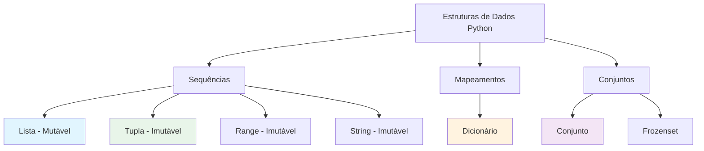
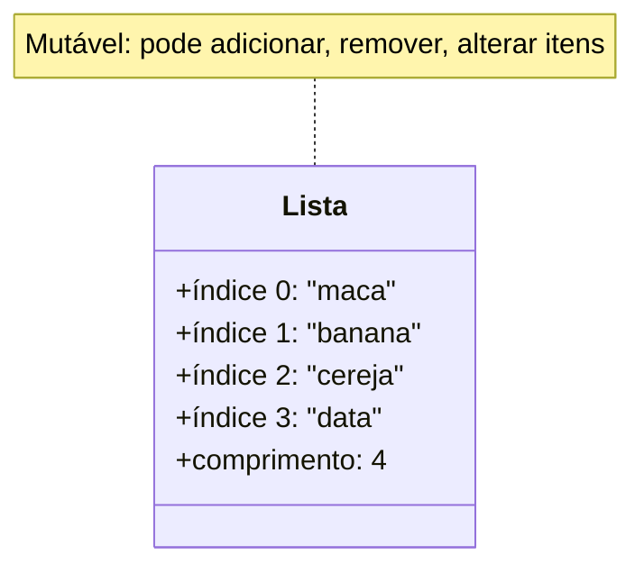

# Estruturas de Dados: Listas e Tuplas

Listas e tuplas são os tipos de sequência fundamentais do Python. Elas armazenam coleções ordenadas de itens e são usadas em praticamente todo programa Python.

## O que São Estruturas de Dados?

Estruturas de dados são formas de organizar e armazenar dados para que possam ser acessados e modificados eficientemente. Python fornece várias estruturas de dados embutidas.



## Listas

Listas são coleções ordenadas e mutáveis que podem conter itens de qualquer tipo.

### Criando Listas

```python
# Lista vazia
vazia = []
vazia_alt = list()

# Lista com itens
numeros = [1, 2, 3, 4, 5]
frutas = ["maca", "banana", "cereja"]
misturada = [1, "ola", 3.14, True]  # Tipos diferentes permitidos!

# Lista a partir de range
pares = list(range(0, 11, 2))
print(f"Pares: {pares}")  # [0, 2, 4, 6, 8, 10]

# List comprehension (prévia)
quadrados = [x ** 2 for x in range(1, 6)]
print(f"Quadrados: {quadrados}")  # [1, 4, 9, 16, 25]
```

### Representação de Memória de Lista



### Indexação

Acesse elementos individuais por sua posição (índice baseado em 0).

```python
frutas = ["maca", "banana", "cereja", "data", "elderberry"]

# Indexação positiva (do início)
print(f"Primeira:  {frutas[0]}")   # maca
print(f"Segunda: {frutas[1]}")   # banana
print(f"Terceira:  {frutas[2]}")   # cereja

# Indexação negativa (do fim)
print(f"Última:    {frutas[-1]}")   # elderberry
print(f"Penúltima: {frutas[-2]}")  # data
print(f"Antepenúltima: {frutas[-3]}")   # cereja
```

### Fatiamento (Slicing)

Extraia porções de uma lista usando notação de fatia: `[inicio:fim:passo]`.

```python
numeros = [0, 1, 2, 3, 4, 5, 6, 7, 8, 9]

# Fatiamento básico
print(f"numeros[2:5]   = {numeros[2:5]}")     # [2, 3, 4]
print(f"numeros[:3]    = {numeros[:3]}")      # [0, 1, 2]
print(f"numeros[7:]    = {numeros[7:]}")      # [7, 8, 9]
print(f"numeros[:]     = {numeros[:]}")       # [0, 1, 2, 3, 4, 5, 6, 7, 8, 9] (cópia)

# Com passo
print(f"numeros[::2]   = {numeros[::2]}")     # [0, 2, 4, 6, 8]
print(f"numeros[1::2]  = {numeros[1::2]}")    # [1, 3, 5, 7, 9]
print(f"numeros[::-1]  = {numeros[::-1]}")    # [9, 8, 7, 6, 5, 4, 3, 2, 1, 0] (inverso)
```

### Métodos de Lista

```mermaid
flowchart LR
    A[Métodos de Lista] --> B[Adicionar Itens]
    A --> C[Remover Itens]
    A --> D[Encontrar Itens]
    A --> E[Outros]
    
    B --> B1[append(x)]
    B --> B2[insert(i, x)]
    B --> B3[extend(iterable)]
    
    C --> C1[remove(x)]
    C --> C2[pop(i)]
    C --> C3[clear()]
    
    D --> D1[index(x)]
    D --> D2[count(x)]
    
    E --> E1[sort()]
    E --> E2[reverse()]
    E --> E3[copy()]
    
    style B fill:#e1f5fe
    style C fill:#fce4ec
    style D fill:#fff3e0
    style E fill:#e8f5e9
```

### Adicionando Itens

```python
frutas = ["maca", "banana"]

# append() - adiciona ao final
frutas.append("cereja")
print(f"Após append: {frutas}")  # ['maca', 'banana', 'cereja']

# insert() - adiciona em posição específica
frutas.insert(1, "damasco")
print(f"Após insert: {frutas}")  # ['maca', 'damasco', 'banana', 'cereja']

# extend() - adiciona múltiplos itens
frutas.extend(["data", "elderberry"])
print(f"Após extend: {frutas}")  # ['maca', 'damasco', 'banana', 'cereja', 'data', 'elderberry']

# Concatenação com +
mais_frutas = frutas + ["figo", "uva"]
print(f"Após +: {mais_frutas}")
```

### Removendo Itens

```python
frutas = ["maca", "banana", "cereja", "data", "banana"]

# remove() - remove primeira ocorrência do valor
frutas.remove("banana")
print(f"Após remove: {frutas}")  # ['maca', 'cereja', 'data', 'banana']

# pop() - remove e retorna item no índice
removido = frutas.pop(2)
print(f"pop(2) retornou: {removido}")  # data
print(f"Após pop: {frutas}")  # ['maca', 'cereja', 'banana']

# pop() sem argumento - remove último
ultimo = frutas.pop()
print(f"pop() retornou: {ultimo}")  # banana
print(f"Após pop: {frutas}")  # ['maca', 'cereja']

# instrução del
del frutas[0]
print(f"Após del: {frutas}")  # ['cereja']
```

### Ordenação e Reversão

```python
numeros = [5, 2, 8, 1, 9, 3]

# sort() - ordena no lugar (modifica original)
numeros.sort()
print(f"Ordenada: {numeros}")  # [1, 2, 3, 5, 8, 9]

# sort(reverse=True) - descendente
numeros.sort(reverse=True)
print(f"Descendente: {numeros}")  # [9, 8, 5, 3, 2, 1]

# sorted() - retorna nova lista (não modifica original)
original = [5, 2, 8, 1, 9]
nova_ordenada = sorted(original)
print(f"Original: {original}")    # [5, 2, 8, 1, 9]
print(f"Ordenada:   {nova_ordenada}")  # [1, 2, 5, 8, 9]

# reverse() - inverte no lugar
numeros = [1, 2, 3, 4, 5]
numeros.reverse()
print(f"Invertida: {numeros}")  # [5, 4, 3, 2, 1]
```

## Tuplas

Tuplas são coleções ordenadas e **imutáveis**. Uma vez criadas, não podem ser modificadas.

### Criando Tuplas

```python
# Tupla vazia
vazia = ()
vazia_alt = tuple()

# Tupla com itens
coordenadas = (10, 20)
cores = ("vermelho", "verde", "azul")
unica = (42,)  # Note a vírgula! Sem ela, é apenas (42) = 42

# Tupla de outro iterável
lista_dados = [1, 2, 3]
tupla_dados = tuple(lista_dados)
print(f"Tupla da lista: {tupla_dados}")  # (1, 2, 3)
```

### Tupla vs Lista: Diferenças Principais

| Característica | Lista | Tupla |
|----------------|-------|-------|
| Sintaxe | `[1, 2, 3]` | `(1, 2, 3)` |
| Mutável | Sim | Não |
| Métodos | Muitos (append, remove, etc.) | Poucos (count, index) |
| Desempenho | Mais lento | Mais rápido |
| Caso de Uso | Coleções mutáveis | Dados fixos |
| Hashável | Não | Sim (pode ser chave de dict) |

### Operações com Tuplas

```python
# Indexação (igual a listas)
ponto = (3, 5, 7)
print(f"x: {ponto[0]}")  # 3
print(f"y: {ponto[1]}")  # 5
print(f"z: {ponto[2]}")  # 7

# Fatiamento (igual a listas)
numeros = (0, 1, 2, 3, 4, 5)
print(f"[1:4]: {numeros[1:4]}")    # (1, 2, 3)
print(f"[::2]: {numeros[::2]}")    # (0, 2, 4)

# Concatenação
t1 = (1, 2)
t2 = (3, 4)
combinada = t1 + t2
print(f"Combinada: {combinada}")  # (1, 2, 3, 4)

# Repetição
repetida = (0,) * 5
print(f"Repetida: {repetida}")  # (0, 0, 0, 0, 0)
```

### Imutabilidade da Tupla

```python
# Listas são mutáveis
minha_lista = [1, 2, 3]
minha_lista[0] = 99
print(f"Lista após modificação: {minha_lista}")  # [99, 2, 3]

# Tuplas são imutáveis
minha_tupla = (1, 2, 3)
# minha_tupla[0] = 99  # ERRO: TypeError!
print(f"Tupla inalterada: {minha_tupla}")  # (1, 2, 3)
```

> [!NOTE]
> Embora tuplas sejam imutáveis, se contiverem objetos mutáveis (como listas), esses objetos ainda podem ser modificados:
> ```python
> dados = ([1, 2], [3, 4])
> dados[0].append(3)  # Isso funciona!
> print(dados)  # ([1, 2, 3], [3, 4])
> ```

### Desempacotamento de Tuplas

```python
# Desempacotamento básico
ponto = (3, 5)
x, y = ponto
print(f"x = {x}, y = {y}")  # x = 3, y = 5

# Múltiplos valores de retorno (funções retornam tuplas!)
def dividir(a, b):
    return a // b, a % b

quociente, resto = dividir(17, 5)
print(f"17 ÷ 5 = {quociente} resto {resto}")

# Trocando variáveis (idioma Python!)
a = 10
b = 20
print(f"Antes: a = {a}, b = {b}")
a, b = b, a
print(f"Depois:  a = {a}, b = {b}")

# Desempacotamento estendido
numeros = (1, 2, 3, 4, 5)
primeiro, *meio, ultimo = numeros
print(f"Primeiro: {primeiro}")     # 1
print(f"Meio: {meio}")     # [2, 3, 4]
print(f"Último: {ultimo}")         # 5
```

## Exemplos Práticos

### Lista como Pilha (Stack)

```python
# Implementação de pilha usando lista
pilha = []

# Push (adiciona ao topo)
pilha.append("Tarefa 1")
pilha.append("Tarefa 2")
pilha.append("Tarefa 3")
print(f"Pilha: {pilha}")

# Pop (remove do topo)
atual = pilha.pop()
print(f"Processando: {atual}")  # Tarefa 3
print(f"Pilha: {pilha}")        # ['Tarefa 1', 'Tarefa 2']

# Peek (olha o topo sem remover)
print(f"Próxima tarefa: {pilha[-1]}")  # Tarefa 2
```

### Lista como Fila (Queue)

```python
from collections import deque

# Implementação de fila
fila = deque(["Alice", "Bob", "Carlos"])

# Enqueue (adiciona ao final)
fila.append("Diana")
print(f"Fila: {list(fila)}")

# Dequeue (remove do início)
proxima = fila.popleft()
print(f"Atendendo: {proxima}")  # Alice
print(f"Fila: {list(fila)}")    # ['Bob', 'Carlos', 'Diana']
```

### Exemplo do Mundo Real: Sistema de Gerenciamento de Notas

```python
# gerenciador_notas.py
"""Gerenciamento de notas de estudantes usando listas e tuplas."""

def adicionar_estudante(estudantes, nome, notas):
    """Adiciona um estudante com suas notas como tupla."""
    estudantes.append((nome, tuple(notas)))

def calcular_media(notas):
    """Calcula média de uma tupla de notas."""
    return sum(notas) / len(notas)

def obter_nota_literal(media):
    """Converte média numérica em nota literal."""
    if media >= 90:
        return "A"
    elif media >= 80:
        return "B"
    elif media >= 70:
        return "C"
    elif media >= 60:
        return "D"
    else:
        return "F"

def exibir_relatorio(estudantes):
    """Exibe um relatório de notas para todos os estudantes."""
    print("=" * 60)
    print("         RELATÓRIO DE NOTAS DOS ESTUDANTES")
    print("=" * 60)
    print(f"{'Nome':<15} {'Notas':<30} {'Média':>6} {'Nota':>6}")
    print("-" * 60)
    
    total_turma = 0
    for nome, notas in estudantes:
        media = calcular_media(notas)
        letra = obter_nota_literal(media)
        notas_str = ", ".join(str(n) for n in notas)
        print(f"{nome:<15} {notas_str:<30} {media:6.1f} {letra:>6}")
        total_turma += media
    
    media_turma = total_turma / len(estudantes)
    print("-" * 60)
    print(f"{'Média da Turma:':<47} {media_turma:6.1f}")
    print("=" * 60)

# Cria banco de dados de estudantes
estudantes = []
adicionar_estudante(estudantes, "Alice", [92, 88, 95, 90])
adicionar_estudante(estudantes, "Bob", [78, 82, 75, 80])
adicionar_estudante(estudantes, "Carlos", [65, 70, 68, 72])
adicionar_estudante(estudantes, "Diana", [95, 98, 92, 97])
adicionar_estudante(estudantes, "Eva", [55, 60, 58, 62])

# Exibe relatório
exibir_relatorio(estudantes)
```

Saída:
```
============================================================
         RELATÓRIO DE NOTAS DOS ESTUDANTES
============================================================
Nome            Notas                           Média   Nota
------------------------------------------------------------
Alice           92, 88, 95, 90                   91.2      A
Bob             78, 82, 75, 80                   78.8      C
Carlos          65, 70, 68, 72                   68.8      D
Diana           95, 98, 92, 97                   95.5      A
Eva             55, 60, 58, 62                   58.8      F
------------------------------------------------------------
Média da Turma:                                    78.6
============================================================
```

## Exercícios Práticos

### Exercício 1: Criação de Lista
Crie uma lista de seus 5 filmes favoritos e imprima cada um com seu índice.

### Exercício 2: Fatiamento de Lista
Dado `numeros = [0, 1, 2, 3, 4, 5, 6, 7, 8, 9]`, escreva fatias para obter:
- Primeiros 3 elementos
- Últimos 3 elementos
- Cada outro elemento
- Elementos do índice 3 ao 7

### Exercício 3: Métodos de Lista
Comece com uma lista vazia. Adicione 5 números, ordene-os, inverta-os, remova o menor e insira 100 na posição 2.

### Exercício 4: Desempacotamento de Tupla
Escreva uma função que retorna o mínimo, máximo e média de uma lista como tupla. Desempacote o resultado.

### Exercício 5: Remover Duplicatas
Escreva uma função que remove duplicatas de uma lista preservando a ordem.

### Exercício 6: Operações com Matriz
Represente uma matriz 3x3 como uma lista de listas. Escreva funções para:
- Obter uma linha específica
- Obter uma coluna específica
- Calcular a soma de todos os elementos

### Exercício 7: Gerenciador de Lista de Compras
Crie um programa que permite adicionar, remover e visualizar itens em uma lista de compras usando um loop de menu.

### Exercício 8: Tupla como Registro
Crie uma lista de tuplas representando livros: `(título, autor, ano, preço)`. Escreva funções para:
- Encontrar o livro mais caro
- Encontrar todos os livros de um autor específico
- Calcular o preço médio

## Resumo

Nesta lição, você aprendeu:
- Como criar e manipular listas
- Técnicas de indexação e fatiamento de listas
- Métodos essenciais de lista: append, insert, remove, pop, sort, etc.
- Como tuplas diferem de listas (imutabilidade)
- Desempacotamento de tuplas e seus usos práticos
- Como usar listas como pilhas e filas
- Aplicações do mundo real de listas e tuplas

Listas e tuplas são os cavalos de batalha do armazenamento de dados Python. Domine-as para lidar com coleções de dados efetivamente.
