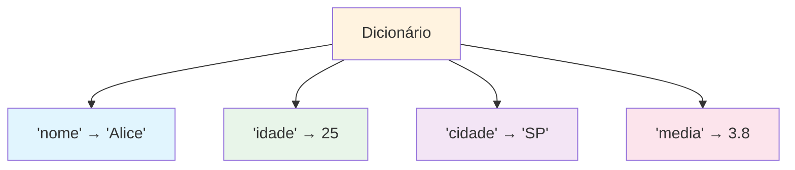

# Estruturas de Dados: Dicionários e Conjuntos

Dicionários e conjuntos são estruturas de dados Python poderosas que usam hash para buscas rápidas. Eles são essenciais para organizar e processar dados eficientemente.

## Dicionários

Dicionários armazenam dados como pares chave-valor. Eles são como dicionários do mundo real: você procura uma chave para encontrar seu valor associado.

### Visão Geral do Dicionário



### Criando Dicionários

```python
# Dicionário vazio
vazio = {}
vazio_alt = dict()

# Dicionário com pares chave-valor
estudante = {
    "nome": "Alice",
    "idade": 25,
    "curso": "Ciência da Computação",
    "media": 3.8
}

# Usando construtor dict()
estudante2 = dict(nome="Bob", idade=22, curso="Matemática")

# A partir de uma lista de tuplas
pares = [("a", 1), ("b", 2), ("c", 3)]
mapeamento = dict(pares)
print(f"De pares: {mapeamento}")  # {'a': 1, 'b': 2, 'c': 3}
```

### Acessando Valores

```python
estudante = {
    "nome": "Alice",
    "idade": 25,
    "curso": "Ciência da Computação",
    "media": 3.8
}

# Notação de colchetes
print(f"Nome: {estudante['nome']}")    # Alice
print(f"Idade: {estudante['idade']}")  # 25

# Método get() - acesso seguro (retorna None se chave ausente)
print(f"Média: {estudante.get('media')}")        # 3.8
print(f"Telefone: {estudante.get('telefone')}")  # None
print(f"Telefone: {estudante.get('telefone', 'N/A')}")  # N/A

# O que acontece com chave ausente?
# print(estudante['telefone'])  # KeyError!
```

### Modificando Dicionários

```python
estudante = {"nome": "Alice", "idade": 25}

# Adicionando novo par chave-valor
estudante["curso"] = "Ciência da Computação"
print(f"Após adicionar: {estudante}")

# Atualizando valor existente
estudante["idade"] = 26
print(f"Após atualizar: {estudante}")

# update() - mesclar dicionários
estudante.update({"media": 3.8, "cidade": "SP"})
print(f"Após update: {estudante}")

# Deletando pares chave-valor
del estudante["cidade"]
print(f"Após del: {estudante}")

removido = estudante.pop("curso")
print(f"pop retornou: {removido}")
print(f"Após pop: {estudante}")
```

### Métodos de Dicionário

| Método | Descrição | Exemplo |
|--------|-----------|---------|
| `keys()` | Retorna todas as chaves | `d.keys()` |
| `values()` | Retorna todos os valores | `d.values()` |
| `items()` | Retorna pares chave-valor | `d.items()` |
| `get(chave, padrao)` | Acesso seguro a valor | `d.get('x', 0)` |
| `pop(chave)` | Remove e retorna valor | `d.pop('x')` |
| `update(outro)` | Mescla dicionários | `d.update({...})` |
| `setdefault(c, v)` | Define se chave ausente | `d.setdefault('x', 0)` |

### Iterando Sobre Dicionários

```python
estudante = {
    "nome": "Alice",
    "idade": 25,
    "curso": "Ciência da Computação",
    "media": 3.8
}

# Itera sobre chaves (padrão)
print("Chaves:")
for chave in estudante:
    print(f"  {chave}: {estudante[chave]}")

# Itera sobre chaves explicitamente
print("\nChaves (explícito):")
for chave in estudante.keys():
    print(f"  {chave}")

# Itera sobre valores
print("\nValores:")
for valor in estudante.values():
    print(f"  {valor}")

# Itera sobre pares chave-valor
print("\nPares Chave-Valor:")
for chave, valor in estudante.items():
    print(f"  {chave}: {valor}")
```

### Compreensão de Dicionário

```python
# Cria dicionário a partir de listas
nomes = ["Alice", "Bob", "Carlos"]
notas = [92, 78, 85]

# Compreensão de dicionário
diario_notas = {nome: nota for nome, nota in zip(nomes, notas)}
print(f"Diário de notas: {diario_notas}")

# Transforma dicionário existente
quadrados = {k: v ** 2 for k, v in diario_notas.items()}
print(f"Quadrados: {quadrados}")

# Filtra dicionário
aprovados = {k: v for k, v in diario_notas.items() if v >= 80}
print(f"Aprovados: {aprovados}")
```

## Conjuntos (Sets)

Conjuntos são coleções não ordenadas de elementos únicos. São perfeitos para teste de associação e eliminação de duplicatas.

### Criando Conjuntos

```python
# Conjunto vazio (nota: {} cria um dict!)
conjunto_vazio = set()

# Conjunto com itens
frutas = {"maca", "banana", "cereja"}
print(f"Frutas: {frutas}")

# De uma lista (remove duplicatas!)
numeros = [1, 2, 2, 3, 3, 3, 4, 4, 4, 4]
unicos = set(numeros)
print(f"Únicos: {unicos}")  # {1, 2, 3, 4}

# Compreensão de conjunto
quadrados = {x ** 2 for x in range(1, 6)}
print(f"Quadrados: {quadrados}")  # {1, 4, 9, 16, 25}
```

### Operações com Conjuntos

```mermaid
flowchart LR
    A[Operações com Conjuntos] --> B[União |]
    A --> C[Interseção &]
    A --> D[Diferença -]
    A --> E[Diferença Simétrica ^]
    
    B --> B1["Todos elementos de ambos"]
    C --> C1["Apenas elementos comuns"]
    D --> D1["Em A mas não em B"]
    E --> E1["Em um ou outro, não ambos"]
    
    style B fill:#e1f5fe
    style C fill:#e8f5e9
    style D fill:#fff3e0
    style E fill:#f3e5f5
```

### Operações com Conjuntos em Código

```python
# Dois conjuntos
devs_python = {"Alice", "Bob", "Carlos", "Diana"}
devs_js = {"Bob", "Carlos", "Eva", "Frank"}

# União - todos os desenvolvedores
todos_devs = devs_python | devs_js
print(f"Todos os desenvolvedores: {todos_devs}")

# Interseção - desenvolvedores que sabem ambas
ambas = devs_python & devs_js
print(f"Sabem ambas: {ambas}")

# Diferença - desenvolvedores apenas Python
apenas_python = devs_python - devs_js
print(f"Apenas Python: {apenas_python}")

# Diferença simétrica - desenvolvedores que sabem exatamente uma
uma_linguagem = devs_python ^ devs_js
print(f"Uma linguagem: {uma_linguagem}")
```

### Métodos de Conjunto

```python
frutas = {"maca", "banana", "cereja"}

# Adicionando itens
frutas.add("damasco")
print(f"Após add: {frutas}")

# Adicionando múltiplos itens
frutas.update(["elderberry", "figo"])
print(f"Após update: {frutas}")

# Removendo itens
frutas.remove("banana")  # Erro se não encontrado
print(f"Após remove: {frutas}")

frutas.discard("uva")  # Sem erro se não encontrado
print(f"Após discard: {frutas}")

# Associação em conjunto (muito rápido - O(1))
print(f"'maca' in frutas: {'maca' in frutas}")    # True
print(f"'banana' in frutas: {'banana' in frutas}")  # False
```

## Estruturas de Dados Aninhadas

Dicionários e listas podem ser combinados para criar estruturas de dados complexas.

### Dicionário de Dicionários

```python
# Banco de dados de estudantes
estudantes = {
    "A001": {
        "nome": "Alice",
        "idade": 22,
        "notas": {"matematica": 95, "fisica": 88, "cc": 92}
    },
    "A002": {
        "nome": "Bob",
        "idade": 23,
        "notas": {"matematica": 78, "fisica": 82, "cc": 85}
    },
    "A003": {
        "nome": "Carlos",
        "idade": 21,
        "notas": {"matematica": 90, "fisica": 95, "cc": 88}
    }
}

# Acessa dados aninhados
print(f"Nota de Alice em matemática: {estudantes['A001']['notas']['matematica']}")

# Calcula média de Alice
notas_alice = estudantes["A001"]["notas"].values()
media_alice = sum(notas_alice) / len(notas_alice)
print(f"Média de Alice: {media_alice:.1f}")
```

### Lista de Dicionários

```python
# Catálogo de produtos
produtos = [
    {"id": 1, "nome": "Laptop", "preco": 999.99, "estoque": 50},
    {"id": 2, "nome": "Mouse", "preco": 29.99, "estoque": 200},
    {"id": 3, "nome": "Teclado", "preco": 79.99, "estoque": 150},
    {"id": 4, "nome": "Monitor", "preco": 349.99, "estoque": 75},
]

# Encontra produtos caros
caros = [p for p in produtos if p["preco"] > 100]
print(f"Produtos caros ({len(caros)}):")
for p in caros:
    print(f"  {p['nome']}: R${p['preco']:.2f}")

# Calcula valor total do estoque
valor_total = sum(p["preco"] * p["estoque"] for p in produtos)
print(f"\nValor total do estoque: R${valor_total:,.2f}")
```

## Exemplo do Mundo Real: Sistema de Gerenciamento de Contatos

```python
# gerenciador_contatos.py
"""Sistema de gerenciamento de contatos usando dicionários."""

class GerenciadorContatos:
    """Gerencia uma coleção de contatos."""
    
    def __init__(self):
        self.contatos = {}
    
    def adicionar_contato(self, nome, telefone, email, cidade):
        """Adiciona um novo contato."""
        self.contatos[nome] = {
            "telefone": telefone,
            "email": email,
            "cidade": cidade
        }
        print(f"Adicionado: {nome}")
    
    def obter_contato(self, nome):
        """Obtém informações do contato."""
        return self.contatos.get(nome, "Contato não encontrado")
    
    def remover_contato(self, nome):
        """Remove um contato."""
        if nome in self.contatos:
            del self.contatos[nome]
            print(f"Removido: {nome}")
        else:
            print(f"Contato não encontrado: {nome}")
    
    def buscar_por_cidade(self, cidade):
        """Encontra todos os contatos em uma cidade."""
        return [
            nome for nome, info in self.contatos.items()
            if info["cidade"].lower() == cidade.lower()
        ]
    
    def exibir_todos(self):
        """Exibe todos os contatos."""
        if not self.contatos:
            print("Nenhum contato encontrado.")
            return
        
        print("=" * 65)
        print(f"{'Nome':<15} {'Telefone':<15} {'Email':<25} {'Cidade':<10}")
        print("-" * 65)
        for nome, info in sorted(self.contatos.items()):
            print(f"{nome:<15} {info['telefone']:<15} {info['email']:<25} {info['cidade']:<10}")
        print("=" * 65)
        print(f"Total de contatos: {len(self.contatos)}")

# Cria e popula o gerenciador de contatos
gerenciador = GerenciadorContatos()

gerenciador.adicionar_contato("Alice", "555-0101", "alice@email.com", "SP")
gerenciador.adicionar_contato("Bob", "555-0102", "bob@email.com", "RJ")
gerenciador.adicionar_contato("Carlos", "555-0103", "carlos@email.com", "SP")
gerenciador.adicionar_contato("Diana", "555-0104", "diana@email.com", "BH")
gerenciador.adicionar_contato("Eva", "555-0105", "eva@email.com", "RJ")

print("\nTodos os Contatos:")
gerenciador.exibir_todos()

print("\nContatos em SP:")
contatos_sp = gerenciador.buscar_por_cidade("SP")
print(f"  {contatos_sp}")

print("\nProcurando Bob:")
print(f"  {gerenciador.obter_contato('Bob')}")
```

## Exercícios Práticos

### Exercício 1: Criação de Dicionário
Crie um dicionário representando um livro com chaves: título, autor, ano, páginas e preço. Imprima cada par chave-valor.

### Exercício 2: Contador de Frequência de Palavras
Escreva uma função que conta a frequência de cada palavra em uma frase e retorna um dicionário.

### Exercício 3: Mesclagem de Dicionário
Dados dois dicionários, escreva código para mesclá-los. Se uma chave existe em ambos, mantenha o valor do segundo dicionário.

### Exercício 4: Operações com Conjuntos
Dados `A = {1, 2, 3, 4, 5}` e `B = {4, 5, 6, 7, 8}`, encontre:
- União
- Interseção
- Diferença (A - B)
- Diferença simétrica

### Exercício 5: Remover Duplicatas
Escreva uma função que remove duplicatas de uma lista usando um conjunto, depois converte de volta para lista.

### Exercício 6: Agenda Telefônica
Crie um dicionário de agenda telefônica. Escreva funções para:
- Adicionar um contato
- Procurar um número por nome
- Deletar um contato
- Listar todos os contatos em ordem alfabética

### Exercício 7: Sistema de Inventário
Crie um sistema de inventário usando um dicionário onde chaves são nomes de produtos e valores são quantidades. Escreva funções para:
- Adicionar estoque
- Remover estoque
- Verificar disponibilidade
- Listar itens com baixo estoque (abaixo do limite)

### Exercício 8: Análise de Diagrama de Venn
Três grupos de estudantes fazem cursos diferentes. Use operações com conjuntos para encontrar:
- Estudantes fazendo todos os três cursos
- Estudantes fazendo exatamente dois cursos
- Estudantes fazendo apenas um curso
- Estudantes não fazendo nenhum curso

## Resumo

Nesta lição, você aprendeu:
- Como criar e manipular dicionários
- Métodos de dicionário: keys(), values(), items(), get(), update(), pop()
- Como iterar sobre dicionários eficientemente
- Compreensão de dicionário para criar dicionários
- Como conjuntos armazenam elementos únicos
- Operações com conjuntos: união, interseção, diferença, diferença simétrica
- Como combinar dicionários e listas para dados complexos
- Aplicações do mundo real de dicionários e conjuntos

Dicionários e conjuntos são essenciais para organização e recuperação eficiente de dados. Domine-os para lidar com estruturas de dados complexas.
