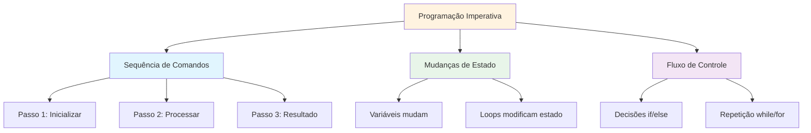
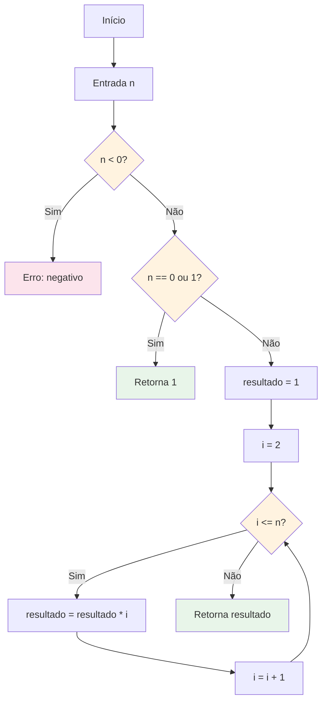
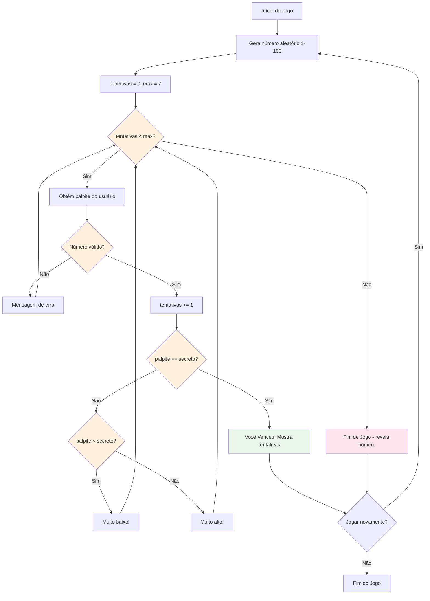

# Projetos de Algoritmos Imperativos

Esta lição reúne tudo que você aprendeu para construir implementações completas de algoritmos. Escreveremos programas Python imperativos que resolvem problemas computacionais clássicos.

## O que é Programação Imperativa?

Programação imperativa descreve COMO resolver um problema passo a passo, usando instruções que mudam o estado do programa. Isso contrasta com programação declarativa, que descreve QUAL deve ser o resultado.



## Projeto 1: Calculadora de Fatorial

O fatorial de n (escrito n!) é o produto de todos os inteiros positivos de 1 a n.

### Fluxograma do Algoritmo



### Implementação

```python
# fatorial.py
"""Calculadora de fatorial usando abordagem imperativa."""

def fatorial_iterativo(n):
    """
    Calcula fatorial usando um loop.
    
    Args:
        n: Inteiro não negativo
    
    Returns:
        int: n! (fatorial de n)
    
    Raises:
        ValueError: Se n for negativo
    """
    if n < 0:
        raise ValueError("Fatorial não é definido para números negativos")
    
    resultado = 1
    for i in range(2, n + 1):
        resultado *= i
    
    return resultado

def fatorial_com_passos(n):
    """Calcula fatorial mostrando cada passo."""
    if n < 0:
        raise ValueError("Fatorial não é definido para números negativos")
    
    print(f"Calculando {n}!:")
    resultado = 1
    
    for i in range(1, n + 1):
        resultado *= i
        print(f"  Passo {i}: resultado = {resultado}")
    
    return resultado

# Testa a função fatorial
print("=== Calculadora de Fatorial ===\n")

# Casos de teste
valores_teste = [0, 1, 5, 10, 20]

for n in valores_teste:
    resultado = fatorial_iterativo(n)
    print(f"{n:2d}! = {resultado}")

print("\nCálculo detalhado de 5!:")
fatorial_com_passos(5)
```

Saída:
```
=== Calculadora de Fatorial ===

 0! = 1
 1! = 1
 5! = 120
10! = 3628800
20! = 2432902008176640000

Cálculo detalhado de 5!:
Calculando 5!:
  Passo 1: resultado = 1
  Passo 2: resultado = 2
  Passo 3: resultado = 6
  Passo 4: resultado = 24
  Passo 5: resultado = 120
```

## Projeto 2: Gerador de Sequência Fibonacci

A sequência Fibonacci: cada número é a soma dos dois anteriores.

### Fluxograma do Algoritmo

```mermaid
flowchart TD
    A[Início] --> B[Entrada n]
    B --> C{n <= 0?}
    C -->|Sim| D[Retorna lista vazia]
    C -->|Não| E{n == 1?}
    E -->|Sim| F[Retorna [0]]
    E -->|Não| G[fib = [0, 1]]
    G --> H[i = 2]
    H --> I{i < n?}
    I -->|Sim| J[proximo = fib[i-1] + fib[i-2]]
    J --> K[Adiciona proximo a fib]
    K --> L[i = i + 1]
    L --> I
    I -->|Não| M[Retorna fib]
    
    style C fill:#fff3e0
    style E fill:#fff3e0
    style I fill:#fff3e0
```

### Implementação

```python
# fibonacci.py
"""Gerador de sequência Fibonacci."""

def sequencia_fibonacci(n):
    """
    Gera os primeiros n números Fibonacci.
    
    Args:
        n: Número de Fibonacci para gerar
    
    Returns:
        list: Primeiros n números Fibonacci
    """
    if n <= 0:
        return []
    if n == 1:
        return [0]
    
    fib = [0, 1]
    for i in range(2, n):
        proximo = fib[i - 1] + fib[i - 2]
        fib.append(proximo)
    
    return fib

def fibonacci_nesimo(n):
    """
    Obtém o n-ésimo número Fibonacci (indexado em 0).
    
    Args:
        n: Posição na sequência
    
    Returns:
        int: O n-ésimo número Fibonacci
    """
    if n < 0:
        raise ValueError("n deve ser não negativo")
    if n <= 1:
        return n
    
    a, b = 0, 1
    for _ in range(2, n + 1):
        a, b = b, a + b
    
    return b

def razao_fibonacci(n):
    """Mostra como as razões Fibonacci se aproximam da razão áurea."""
    print(f"{'n':>4} {'F(n)':>12} {'F(n)/F(n-1)':>14}")
    print("-" * 35)
    
    anterior = 0
    for i in range(1, n + 1):
        atual = fibonacci_nesimo(i)
        if anterior > 0:
            razao = atual / anterior
            print(f"{i:4d} {atual:12d} {razao:14.10f}")
        else:
            print(f"{i:4d} {atual:12d} {'N/A':>14}")
        anterior = atual

# Testa Fibonacci
print("=== Gerador de Sequência Fibonacci ===\n")

# Gera sequências
print("Primeiros 10 números Fibonacci:")
print(sequencia_fibonacci(10))

print("\nPrimeiros 15 números Fibonacci:")
print(sequencia_fibonacci(15))

# Convergência da razão áurea
print("\nRazões Fibonacci se aproximando da razão áurea (φ ≈ 1.6180339887):")
razao_fibonacci(15)
```

Saída:
```
=== Gerador de Sequência Fibonacci ===

Primeiros 10 números Fibonacci:
[0, 1, 1, 2, 3, 5, 8, 13, 21, 34]

Primeiros 15 números Fibonacci:
[0, 1, 1, 2, 3, 5, 8, 13, 21, 34, 55, 89, 144, 233, 377]

Razões Fibonacci se aproximando da razão áurea (φ ≈ 1.6180339887):
   n         F(n)    F(n)/F(n-1)
-----------------------------------
   1            1            N/A
   2            1     1.0000000000
   3            2     2.0000000000
   4            3     1.5000000000
   5            5     1.6666666667
   6            8     1.6000000000
   7           13     1.6250000000
   8           21     1.6153846154
   9           34     1.6190476190
  10           55     1.6176470588
  11           89     1.6181818182
  12          144     1.6179775281
  13          233     1.6180555556
  14          377     1.6180257511
  15          610     1.6180371353
```

## Projeto 3: Verificador de Números Primos

Um número primo é um número natural maior que 1 que não tem divisores positivos além de 1 e ele mesmo.

### Fluxograma do Algoritmo

```mermaid
flowchart TD
    A[Início] --> B[Entrada n]
    B --> C{n <= 1?}
    C -->|Sim| D[Não é primo]
    C -->|Não| E{n <= 3?}
    E -->|Sim| F[Primo]
    E -->|Não| G{n % 2 == 0 ou n % 3 == 0?}
    G -->|Sim| D
    G -->|Não| H[i = 5]
    H --> I{i * i <= n?}
    I -->|Sim| J{n % i == 0 ou n % (i+2) == 0?}
    J -->|Sim| D
    J -->|Não| K[i = i + 6]
    K --> I
    I -->|Não| F[Primo]
    
    style C fill:#fff3e0
    style E fill:#fff3e0
    style G fill:#fff3e0
    style I fill:#fff3e0
    style J fill:#fff3e0
    style D fill:#fce4ec
    style F fill:#e8f5e9
```

### Implementação

```python
# verificador_primos.py
"""Verificador e gerador de números primos."""

def eh_primo(n):
    """
    Verifica se um número é primo usando divisão por tentativa otimizada.
    
    Args:
        n: Inteiro para verificar
    
    Returns:
        bool: True se primo, False caso contrário
    """
    if n <= 1:
        return False
    if n <= 3:
        return True
    if n % 2 == 0 or n % 3 == 0:
        return False
    
    i = 5
    while i * i <= n:
        if n % i == 0 or n % (i + 2) == 0:
            return False
        i += 6
    
    return True

def encontrar_primos_ate(limite):
    """
    Encontra todos os números primos até um limite.
    
    Args:
        limite: Limite superior (inclusive)
    
    Returns:
        list: Todos os números primos até o limite
    """
    primos = []
    for num in range(2, limite + 1):
        if eh_primo(num):
            primos.append(num)
    return primos

def contar_primos_no_intervalo(inicio, fim):
    """Conta primos em um intervalo."""
    contagem = 0
    for num in range(inicio, fim + 1):
        if eh_primo(num):
            contagem += 1
    return contagem

# Testa verificador de primos
print("=== Verificador de Números Primos ===\n")

# Verifica números individuais
numeros_teste = [1, 2, 3, 4, 17, 25, 29, 97, 100]
print("Verificação de primos:")
for n in numeros_teste:
    status = "Primo" if eh_primo(n) else "Não primo"
    print(f"  {n:3d}: {status}")

# Encontra primos até 50
print("\nPrimos até 50:")
primos = encontrar_primos_ate(50)
print(f"  {primos}")
print(f"  Contagem: {len(primos)}")

# Densidade de primos
print("\nDensidade de primos:")
for limite in [10, 100, 1000]:
    contagem = contar_primos_no_intervalo(2, limite)
    densidade = contagem / limite * 100
    print(f"  Até {limite:4d}: {contagem:4d} primos ({densidade:.1f}%)")
```

Saída:
```
=== Verificador de Números Primos ===

Verificação de primos:
    1: Não primo
    2: Primo
    3: Primo
    4: Não primo
   17: Primo
   25: Não primo
   29: Primo
   97: Primo
  100: Não primo

Primos até 50:
  [2, 3, 5, 7, 11, 13, 17, 19, 23, 29, 31, 37, 41, 43, 47]
  Contagem: 15

Densidade de primos:
  Até   10:    4 primos (40.0%)
  Até  100:   25 primos (25.0%)
  Até 1000:  168 primos (16.8%)
```

## Projeto 4: Bubble Sort (Ordenação por Bolha)

Bubble sort é um algoritmo de ordenação simples que percorre repetidamente a lista, compara elementos adjacentes e os troca se estiverem na ordem errada.

### Fluxograma do Algoritmo

```mermaid
flowchart TD
    A[Início] --> B[Entrada lista arr]
    B --> C[n = comprimento de arr]
    C --> D[i = 0]
    D --> E{i < n - 1?}
    E -->|Não| F[Ordenada! Retorna arr]
    E -->|Sim| G[trocado = False]
    G --> H[j = 0]
    H --> I{j < n - i - 1?}
    I -->|Não| J{trocado?}
    J -->|Não| F
    J -->|Sim| K[i = i + 1]
    K --> E
    I -->|Sim| L{arr[j] > arr[j+1]?}
    L -->|Não| M[j = j + 1]
    M --> I
    L -->|Sim| N[Troca arr[j], arr[j+1]]
    N --> O[trocado = True]
    O --> M
    
    style E fill:#fff3e0
    style I fill:#fff3e0
    style J fill:#fff3e0
    style L fill:#fff3e0
    style F fill:#e8f5e9
    style N fill:#fce4ec
```

### Implementação

```python
# bubble_sort.py
"""Implementação de bubble sort com visualização."""

def bubble_sort(arr):
    """
    Ordena uma lista usando o algoritmo bubble sort.
    
    Args:
        arr: Lista de elementos comparáveis
    
    Returns:
        list: Lista ordenada (nova lista, original inalterada)
    """
    resultado = arr.copy()
    n = len(resultado)
    
    for i in range(n - 1):
        trocado = False
        for j in range(n - i - 1):
            if resultado[j] > resultado[j + 1]:
                # Troca
                resultado[j], resultado[j + 1] = resultado[j + 1], resultado[j]
                trocado = True
        
        if not trocado:
            break  # Já ordenada
    
    return resultado

def bubble_sort_visual(arr):
    """Ordena com visualização passo a passo."""
    resultado = arr.copy()
    n = len(resultado)
    passadas = 0
    
    print(f"Inicial: {resultado}")
    
    for i in range(n - 1):
        trocado = False
        passadas += 1
        
        for j in range(n - i - 1):
            if resultado[j] > resultado[j + 1]:
                resultado[j], resultado[j + 1] = resultado[j + 1], resultado[j]
                trocado = True
                print(f"  Passada {passadas}, Troca {j},{j+1}: {resultado}")
        
        if not trocado:
            print(f"  Passada {passadas}: Sem trocas necessárias (ordenada!)")
            break
    
    print(f"Final:   {resultado}")
    print(f"Total de passadas: {passadas}")
    return resultado

# Testa bubble sort
print("=== Bubble Sort ===\n")

# Ordenação simples
numeros = [64, 34, 25, 12, 22, 11, 90]
print(f"Original: {numeros}")
ordenados = bubble_sort(numeros)
print(f"Ordenada:   {ordenados}")
print(f"Original inalterada: {numeros}\n")

# Ordenação visual
print("Bubble sort visual:")
bubble_sort_visual([5, 3, 8, 1, 2])
```

Saída:
```
=== Bubble Sort ===

Original: [64, 34, 25, 12, 22, 11, 90]
Ordenada:   [11, 12, 22, 25, 34, 64, 90]
Original inalterada: [64, 34, 25, 12, 22, 11, 90]

Bubble sort visual:
Inicial: [5, 3, 8, 1, 2]
  Passada 1, Troca 0,1: [3, 5, 8, 1, 2]
  Passada 1, Troca 2,3: [3, 5, 1, 8, 2]
  Passada 1, Troca 3,4: [3, 5, 1, 2, 8]
  Passada 2, Troca 1,2: [3, 1, 5, 2, 8]
  Passada 2, Troca 2,3: [3, 1, 2, 5, 8]
  Passada 3, Troca 0,1: [1, 3, 2, 5, 8]
  Passada 3, Troca 1,2: [1, 2, 3, 5, 8]
  Passada 4: Sem trocas necessárias (ordenada!)
Final:   [1, 2, 3, 5, 8]
Total de passadas: 4
```

## Projeto 5: Jogo de Adivinhação de Números

Um jogo interativo completo que combina todos os conceitos aprendidos neste curso.

### Fluxograma do Jogo



### Implementação

```python
# jogo_adivinhacao.py
"""Jogo de adivinhação com pontuação e níveis de dificuldade."""

import random

def obter_dificuldade():
    """Permite ao jogador escolher o nível de dificuldade."""
    print("\nSelecione a dificuldade:")
    print("  1. Fácil   (1-50,  10 tentativas)")
    print("  2. Médio   (1-100,  7 tentativas)")
    print("  3. Difícil (1-200,  5 tentativas)")
    
    while True:
        escolha = input("Escolha (1-3): ").strip()
        if escolha == "1":
            return 50, 10
        elif escolha == "2":
            return 100, 7
        elif escolha == "3":
            return 200, 5
        print("Escolha inválida. Digite 1, 2 ou 3.")

def jogar():
    """Joga uma rodada do jogo de adivinhação."""
    max_num, max_tentativas = obter_dificuldade()
    secreto = random.randint(1, max_num)
    tentativas = 0
    palpites = []
    
    print(f"\n{'=' * 40}")
    print(f"  Adivinhe o número entre 1 e {max_num}")
    print(f"  Você tem {max_tentativas} tentativas")
    print(f"{'=' * 40}\n")
    
    while tentativas < max_tentativas:
        # Obtém palpite válido
        while True:
            try:
                palpite = int(input(f"Tentativa {tentativas + 1}/{max_tentativas}: "))
                if 1 <= palpite <= max_num:
                    break
                print(f"  Digite um número entre 1 e {max_num}.")
            except ValueError:
                print("  Digite um número válido.")
        
        tentativas += 1
        palpites.append(palpite)
        
        # Verifica palpite
        if palpite == secreto:
            print(f"\n  🎉 Parabéns! Você acertou!")
            print(f"  O número era {secreto}.")
            print(f"  Tentativas: {tentativas}/{max_tentativas}")
            
            # Cálculo da pontuação
            pontuacao = max(0, (max_tentativas - tentativas + 1) * 100)
            print(f"  Pontuação: {pontuacao} pontos")
            return True, pontuacao
        
        elif palpite < secreto:
            diff = secreto - palpite
            dica = "Muito baixo!" if diff > 20 else "Baixo! Tente um número maior."
            print(f"  {dica}")
        else:
            diff = palpite - secreto
            dica = "Muito alto!" if diff > 20 else "Alto! Tente um número menor."
            print(f"  {dica}")
    
    # Fim de jogo
    print(f"\n  😔 Fim de jogo! O número era {secreto}.")
    print(f"  Seus palpites: {palpites}")
    return False, 0

def exibir_estatisticas(jogos_jogados, jogos_ganhos, pontuacao_total):
    """Exibe estatísticas do jogo."""
    print(f"\n{'=' * 40}")
    print("         ESTATÍSTICAS DO JOGO")
    print(f"{'=' * 40}")
    print(f"  Jogos jogados: {jogos_jogados}")
    print(f"  Jogos ganhos:  {jogos_ganhos}")
    print(f"  Jogos perdidos: {jogos_jogados - jogos_ganhos}")
    
    if jogos_jogados > 0:
        taxa_vitoria = jogos_ganhos / jogos_jogados * 100
        media_pontuacao = pontuacao_total / jogos_jogados
        print(f"  Taxa vitória:  {taxa_vitoria:.1f}%")
        print(f"  Média pontos:  {media_pontuacao:.0f}")
    
    print(f"  Pontuação total: {pontuacao_total}")
    print(f"{'=' * 40}")

def principal():
    """Loop principal do jogo."""
    print("=" * 40)
    print("   JOGO DE ADIVINHAÇÃO")
    print("=" * 40)
    
    jogos_jogados = 0
    jogos_ganhos = 0
    pontuacao_total = 0
    
    while True:
        jogos_jogados += 1
    ganhou, pontuacao = jogar()
        
        if ganhou:
            jogos_ganhos += 1
        pontuacao_total += pontuacao
        
        # Jogar novamente?
        while True:
            novamente = input("\nJogar novamente? (sim/nao): ").strip().lower()
            if novamente in ("sim", "s", "nao", "n", "não"):
                break
            print("Digite 'sim' ou 'nao'.")
        
        if novamente in ("nao", "n", "não"):
            break
    
    exibir_estatisticas(jogos_jogados, jogos_ganhos, pontuacao_total)
    print("\nObrigado por jogar! Até mais! 👋")

# Executa o jogo
if __name__ == "__main__":
    principal()
```

Saída de exemplo:
```
========================================
   JOGO DE ADIVINHAÇÃO
========================================

Selecione a dificuldade:
  1. Fácil   (1-50,  10 tentativas)
  2. Médio   (1-100,  7 tentativas)
  3. Difícil (1-200,  5 tentativas)
Escolha (1-3): 2

========================================
  Adivinhe o número entre 1 e 100
  Você tem 7 tentativas
========================================

Tentativa 1/7: 50
  Alto! Tente um número menor.
Tentativa 2/7: 25
  Baixo! Tente um número maior.
Tentativa 3/7: 37
  Baixo! Tente um número maior.
Tentativa 4/7: 43
  🎉 Parabéns! Você acertou!
  O número era 43.
  Tentativas: 4/7
  Pontuação: 400 pontos

Jogar novamente? (sim/nao): nao

========================================
         ESTATÍSTICAS DO JOGO
========================================
  Jogos jogados: 1
  Jogos ganhos:  1
  Jogos perdidos: 0
  Taxa vitória:  100.0%
  Média pontos:  400
  Pontuação total: 400
========================================

Obrigado por jogar! Até mais! 👋
```

## Exercícios Práticos

### Exercício 1: Fatorial Aprimorado
Modifique a função fatorial para usar um loop while em vez de um loop for.

### Exercício 2: Busca Fibonacci
Escreva uma função que verifica se um dado número é um número Fibonacci.

### Exercício 3: Fatoração Prima
Escreva uma função que retorna a fatoração prima de um número como uma lista de fatores primos.

### Exercício 4: Selection Sort
Implemente selection sort: encontre o elemento mínimo, troque-o para o início, repita para os elementos restantes.

### Exercício 5: Busca Binária
Implemente busca binária em uma lista ordenada. Compare sua eficiência com busca linear.

### Exercício 6: Jogo de Adivinhação Aprimorado
Adicione recursos ao jogo de adivinhação:
- Rastreie melhor pontuação (menos tentativas)
- Adicione um sistema de dicas (revela se número é par/ímpar)
- Adicione um cronômetro para medir quanto tempo cada jogo leva

### Exercício 7: Crivo de Eratóstenes
Implemente o algoritmo Crivo de Eratóstenes para encontrar todos os primos até n. Compare sua velocidade com o método de divisão por tentativa.

### Exercício 8: Comparação de Algoritmos
Escreva um programa que compara o tempo de execução do bubble sort vs o sorted() embutido do Python para listas de diferentes tamanhos (100, 1000, 10000 elementos).

## Resumo

Nesta lição, você construiu projetos completos de algoritmos imperativos:
- **Fatorial**: Cálculo iterativo com visualização passo a passo
- **Fibonacci**: Geração de sequência e convergência da razão áurea
- **Verificador de Primos**: Divisão por tentativa otimizada para teste de primalidade
- **Bubble Sort**: Ordenação passo a passo com visualização de trocas
- **Jogo de Adivinhação**: Jogo interativo completo com níveis de dificuldade e pontuação

Estes projetos demonstram como variáveis, loops, condicionais, funções e estruturas de dados trabalham juntos para resolver problemas computacionais reais. Pratique modificar e estender estes algoritmos para aprofundar seu entendimento.
